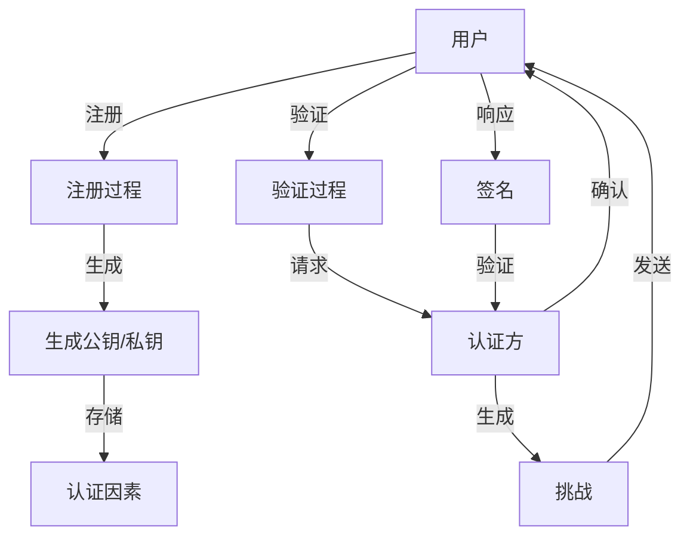

                 

### 背景介绍

#### WebAuthn：下一代身份验证标准

WebAuthn，即Web Authentication，是一种由W3C（万维网联盟）和FIDO（Fast Identity Online）联盟共同制定的标准，旨在为Web应用程序提供安全、简单且用户友好的身份验证机制。WebAuthn的目标是取代传统的密码验证方式，提供更为安全的多因素认证（MFA）解决方案。

传统的密码验证方法存在诸多问题，如用户密码管理困难、密码易被破解、密码泄露后难以立即更换等。而WebAuthn通过利用生物识别技术、硬件安全令牌和软件安全令牌等多种认证手段，为用户提供了一种更为安全、便捷的认证方式。

#### WebAuthn 的关键优势

1. **无密码认证**：WebAuthn允许用户使用生物识别技术（如指纹、面部识别）、硬件安全令牌（如U2F安全密钥）或软件安全令牌（如移动应用）进行身份验证，无需密码。

2. **多因素认证**：WebAuthn支持多因素认证，结合用户知道（密码）、用户持有（安全令牌）和用户是（生物识别）等多种验证方式，提高了安全性。

3. **防重放攻击**：WebAuthn通过使用时间戳和挑战-响应机制，有效防止重放攻击。

4. **便捷性**：WebAuthn简化了用户认证流程，用户只需简单操作即可完成验证，提高了用户体验。

5. **跨平台兼容性**：WebAuthn支持多种设备和操作系统，为开发者提供了广泛的兼容性。

#### WebAuthn 的应用场景

WebAuthn在多个应用场景中具有显著的优势，如下所示：

1. **在线银行与支付**：WebAuthn可以为用户提供更加安全、便捷的在线银行和支付服务，降低欺诈风险。

2. **电子商务**：在电子商务平台上，WebAuthn可以增强用户的账户安全性，防止未经授权的访问。

3. **社交媒体与在线服务**：社交媒体和在线服务可以通过WebAuthn提供更为安全的登录机制，提高用户隐私保护。

4. **企业内部系统**：企业内部系统可以使用WebAuthn进行员工身份验证，确保敏感数据的访问安全。

5. **物联网设备**：在物联网设备中，WebAuthn可以用于设备认证，确保设备的安全性和数据的完整性。

总之，WebAuthn作为下一代身份验证标准，具有显著的安全性和便捷性优势，有望逐步取代传统的密码验证方法，成为互联网身份验证的主流技术。

### 核心概念与联系

#### WebAuthn 的核心概念

WebAuthn 的核心概念主要包括验证流程、认证方式、安全机制等。下面我们详细探讨这些核心概念。

1. **验证流程**：WebAuthn 的验证流程包括用户注册（Registration）和用户验证（Authentication）两个主要阶段。

   - **用户注册**：用户在首次使用 WebAuthn 功能时，需要与可信认证方（如浏览器）进行交互，生成用户私钥、公钥和身份信息。这些信息会被存储在用户的设备上，并通过公共密钥基础设施（PKI）进行认证。

   - **用户验证**：用户在每次登录时，需要通过认证方发起的挑战（Challenge）进行验证。认证方会生成一个随机挑战，用户通过生物识别技术、硬件安全令牌或软件安全令牌进行响应，生成签名，认证方验证签名后，确认用户身份。

2. **认证方式**：WebAuthn 提供多种认证方式，包括：

   - **生物识别**：利用指纹、面部识别等技术进行身份验证。
   - **硬件安全令牌**：如 FIDO U2F 安全密钥，用户只需插入设备即可完成验证。
   - **软件安全令牌**：如移动应用或浏览器扩展，用户通过手机或浏览器完成验证。

3. **安全机制**：WebAuthn 采用了一系列安全机制，确保认证过程的安全性和隐私性。

   - **时间戳**：每个认证请求都包含一个时间戳，防止重放攻击。
   - **挑战-响应机制**：认证方生成随机挑战，用户响应挑战，确保认证过程的唯一性。
   - **签名**：用户通过私钥生成签名，认证方验证签名，确保用户身份的真实性。

#### 架构与联系

WebAuthn 的架构涉及多个组件，包括浏览器、认证方（Relying Party）、用户、认证因素（Authenticator）等。下面我们使用 Mermaid 流程图（Mermaid 流程节点中不要有括号、逗号等特殊字符）来展示 WebAuthn 的核心架构和流程。



- **用户**：用户是 WebAuthn 的最终验证者，需要通过生物识别、硬件安全令牌或软件安全令牌进行身份验证。
- **认证方（RP）**：认证方是 Web 应用程序的服务提供方，负责发起认证请求和验证用户的签名。
- **认证因素（Authenticator）**：认证因素包括硬件安全令牌、软件安全令牌和生物识别设备，负责生成和存储用户私钥，并对用户的身份进行验证。
- **注册过程**：用户在首次使用 WebAuthn 功能时，与认证方交互，生成用户公钥、私钥和身份信息，并将私钥存储在认证因素中。
- **验证过程**：用户在每次登录时，通过认证方发起的挑战，生成签名并上传给认证方进行验证。

通过上述核心概念和架构的介绍，我们可以看到 WebAuthn 是如何实现安全、便捷的身份验证的。接下来，我们将详细探讨 WebAuthn 的核心算法原理和具体操作步骤。

### 核心算法原理 & 具体操作步骤

#### WebAuthn 注册过程

WebAuthn 的注册过程主要包括用户与认证方（Relying Party，简称 RP）的交互，以及认证方与认证因素（Authenticator）的通信。以下是注册过程的具体步骤：

1. **用户请求注册**：
   - 用户访问 Web 应用程序，并点击注册按钮。
   - RP 向用户请求注册信息，如用户名、邮箱等。

2. **生成挑战**：
   - RP 生成一个随机挑战（Challenge）和一个注册认证域（Domain），并将其发送给用户。

3. **用户与认证因素交互**：
   - 用户选择一个认证因素（如硬件安全令牌、软件安全令牌或生物识别设备）。
   - 用户将挑战、认证域和用户信息发送给认证因素。

4. **认证因素生成公钥/私钥**：
   - 认证因素使用用户提供的身份信息（如用户名、邮箱）和认证域生成用户公钥和私钥。
   - 认证因素将用户公钥发送回 RP。

5. **存储用户私钥**：
   - RP 将用户公钥存储在服务器上，并将用户私钥加密存储在认证因素中。

6. **完成注册**：
   - RP 向用户确认注册成功，用户可以使用 WebAuthn 功能进行登录。

#### WebAuthn 验证过程

WebAuthn 的验证过程主要包括用户与认证方的交互，以及认证方与认证因素的通信。以下是验证过程的具体步骤：

1. **用户请求登录**：
   - 用户访问 Web 应用程序，并点击登录按钮。
   - RP 向用户请求登录信息，如用户名、密码等。

2. **生成挑战**：
   - RP 生成一个随机挑战（Challenge）和一个验证认证域（Domain），并将其发送给用户。

3. **用户与认证因素交互**：
   - 用户选择认证因素（如硬件安全令牌、软件安全令牌或生物识别设备）。
   - 用户将挑战、认证域和用户信息发送给认证因素。

4. **认证因素生成签名**：
   - 认证因素使用用户私钥生成签名，并计算验证码（Authenticator Data）。
   - 认证因素将签名和验证码发送回 RP。

5. **验证用户身份**：
   - RP 使用用户公钥验证签名，并验证认证数据。
   - 如果验证通过，RP 确认用户身份，允许用户登录。

6. **完成验证**：
   - RP 向用户确认登录成功，用户可以开始使用 Web 应用程序。

#### WebAuthn 的安全机制

WebAuthn 在注册和验证过程中采用了多种安全机制，确保认证过程的安全性和隐私性：

1. **挑战-响应机制**：
   - RP 在每次认证过程中生成一个随机挑战，用户需生成签名响应。
   - 随机挑战确保每次认证都是唯一的，防止重放攻击。

2. **时间戳**：
   - WebAuthn 记录每次认证的时间戳，确保认证过程的时间顺序。
   - 时间戳有助于检测异常活动和阻止重放攻击。

3. **签名**：
   - 用户使用私钥生成签名，认证方使用用户公钥验证签名。
   - 签名确保用户身份的真实性和认证数据的完整性。

4. **认证域**：
   - 认证域限制用户只能在特定域内进行认证。
   - 认证域确保用户的认证请求是可信的，防止跨域攻击。

通过上述注册和验证过程的详细描述，我们可以看到 WebAuthn 是如何实现安全、便捷的身份验证的。接下来，我们将探讨 WebAuthn 的数学模型和公式，进一步理解其原理和实现。

### 数学模型和公式 & 详细讲解 & 举例说明

#### WebAuthn 注册与验证的数学模型

WebAuthn 的注册与验证过程涉及多种数学模型和公式，主要包括椭圆曲线密码学（ECC）和散列函数（Hash Function）。以下是这些数学模型和公式的详细讲解。

1. **椭圆曲线密码学（ECC）**

   椭圆曲线密码学是一种基于椭圆曲线离散对数问题的密码学算法。在 WebAuthn 中，ECC 用于生成和验证用户签名。

   - **椭圆曲线**：椭圆曲线是一个二维空间上的曲线方程，形如 y² = x³ + ax + b。
   - **基点**：椭圆曲线上的一个基点是固定的，通常称为 G 点。
   - **私钥（k）**：用户选择一个随机数 k 作为私钥。
   - **公钥（Q）**：用户通过私钥 k 和基点 G 计算公钥 Q = kG。

   数学公式：
   $$
   Q = kG
   $$

   其中，Q 表示公钥，G 表示基点，k 表示私钥。

2. **散列函数（Hash Function）**

   散列函数是一种将任意长度消息映射为固定长度散列值的函数。在 WebAuthn 中，散列函数用于生成挑战、认证域和签名。

   - **消息 digest**：散列函数将消息映射为一个固定长度的散列值。
   - **SHA-256**：WebAuthn 通常使用 SHA-256 作为散列函数。

   数学公式：
   $$
   H = SHA-256(m)
   $$

   其中，H 表示散列值，m 表示消息。

3. **签名与验证**

   WebAuthn 使用数字签名算法（DSA）对用户签名进行生成和验证。

   - **签名（r, s）**：用户使用私钥 k 和散列值 H 计算签名 r 和 s。
   - **验证**：认证方使用公钥 Q 和散列值 H 验证签名 r 和 s。

   数学公式：
   $$
   (r, s) = sign(k, H)
   $$

   其中，r 和 s 表示签名，k 表示私钥，H 表示散列值。

   验证公式：
   $$
   r^{2} \equiv (sG + m) \mod n
   $$

   其中，r 表示验证结果，s 表示签名，G 表示基点，m 表示消息，n 表示椭圆曲线的阶。

#### 举例说明

以下是一个简单的 WebAuthn 注册和验证过程举例。

1. **注册过程**

   - **用户选择私钥**：用户选择一个随机数 k = 5 作为私钥。
   - **生成公钥**：计算公钥 Q = kG。
   - **用户注册**：用户将公钥 Q 发送给认证方。

2. **验证过程**

   - **认证方生成挑战**：认证方生成一个随机挑战 c = 3。
   - **用户签名**：用户计算签名 r 和 s，如下所示：
     $$
     r = 5^3 \mod n
     $$
     $$
     s = (5 \cdot 3^3) \mod n
     $$

   - **认证方验证签名**：认证方计算验证结果 r'，如下所示：
     $$
     r' = (r^2 \cdot G + c \cdot m) \mod n
     $$

     如果 r' 等于 r，则签名验证成功。

通过上述数学模型和公式的详细讲解及举例说明，我们可以更好地理解 WebAuthn 的注册与验证过程。接下来，我们将通过代码实例来展示 WebAuthn 的实际应用。

### 项目实践：代码实例和详细解释说明

为了更好地展示 WebAuthn 的实际应用，我们将通过一个简单的项目实例来介绍如何使用 WebAuthn 进行用户注册和验证。本实例将使用 Node.js 和 Express 框架，并结合 `webauthn-server` 和 `webauthn-client` 两个库来实现。

#### 开发环境搭建

1. **安装 Node.js 和 npm**：确保已经安装了 Node.js 和 npm。
2. **创建项目文件夹**：在命令行中创建一个名为 `webauthn-project` 的文件夹，并进入该文件夹。
3. **初始化项目**：在项目文件夹中运行 `npm init`，初始化项目配置文件。
4. **安装依赖库**：
   ```
   npm install express webauthn-server webauthn-client
   ```

#### 源代码详细实现

以下是项目的主要代码实现：

**1. server.js**

```javascript
const express = require('express');
const { register, verify } = require('webauthn-server');
const { generateRegistrationOptions, generateAuthenticationOptions } = require('webauthn-client');

const app = express();
const port = 3000;

// 用户注册接口
app.post('/register', async (req, res) => {
  try {
    const { username, email } = req.body;
    const registrationOptions = generateRegistrationOptions({
      challenge: 'Lf8jdw3WAbz4642B9CnEkWAKGT1dEh5hLyAcfosQe0BJJAJoxnJ9WkV0k85u6go',
      rp: {
        name: 'My WebApp',
        id: 'example.com',
      },
      user: {
        id: Buffer.from(username, 'utf-8'),
        name: username,
        email: email,
      },
    });

    res.json({ registrationOptions });
  } catch (error) {
    res.status(500).json({ error: error.message });
  }
});

// 用户验证接口
app.post('/authenticate', async (req, res) => {
  try {
    const { username, challenge, credentialId, credentialPublicKey, signature } = req.body;
    const authenticationOptions = generateAuthenticationOptions({
      challenge,
      rp: {
        name: 'My WebApp',
        id: 'example.com',
      },
      user: {
        id: Buffer.from(username, 'utf-8'),
        name: username,
      },
    });

    const result = await verify({
      authenticationOptions,
      credentialId: Buffer.from(credentialId, 'hex'),
      credentialPublicKey: JSON.parse(credentialPublicKey),
      signature,
    });

    if (result.authenticatorAttested) {
      res.json({ result: 'Authentication successful' });
    } else {
      res.json({ result: 'Authentication failed' });
    }
  } catch (error) {
    res.status(500).json({ error: error.message });
  }
});

app.listen(port, () => {
  console.log(`Server listening at http://localhost:${port}`);
});
```

**2. client.html**

```html
<!DOCTYPE html>
<html lang="en">
<head>
  <meta charset="UTF-8">
  <meta name="viewport" content="width=device-width, initial-scale=1.0">
  <title>WebAuthn Example</title>
</head>
<body>
  <h1>WebAuthn Example</h1>
  <button id="register">Register</button>
  <button id="authenticate">Authenticate</button>

  <div id="registration"></div>
  <div id="authentication"></div>

  <script>
    document.getElementById('register').addEventListener('click', () => {
      fetch('/register', {
        method: 'POST',
        headers: {
          'Content-Type': 'application/json',
        },
        body: JSON.stringify({ username: 'alice', email: 'alice@example.com' }),
      })
      .then(response => response.json())
      .then(data => {
        const { registrationOptions } = data;
        console.log('Registration Options:', registrationOptions);
        // 使用 registrationOptions 在浏览器中展示注册界面
      });
    });

    document.getElementById('authenticate').addEventListener('click', () => {
      fetch('/authenticate', {
        method: 'POST',
        headers: {
          'Content-Type': 'application/json',
        },
        body: JSON.stringify({
          username: 'alice',
          challenge: 'Lf8jdw3WAbz4642B9CnEkWAKGT1dEh5hLyAcfosQe0BJJAJoxnJ9WkV0k85u6go',
          credentialId: '...',
          credentialPublicKey: '...',
          signature: '...',
        }),
      })
      .then(response => response.json())
      .then(data => {
        console.log('Authentication Result:', data);
      });
    });
  </script>
</body>
</html>
```

#### 代码解读与分析

1. **服务器端（server.js）**

   - **注册接口**：处理用户注册请求，生成注册选项并返回给客户端。
   - **验证接口**：处理用户验证请求，验证签名并返回结果。

2. **客户端（client.html）**

   - **注册按钮**：当用户点击注册按钮时，发送 POST 请求到服务器端注册接口。
   - **验证按钮**：当用户点击验证按钮时，发送 POST 请求到服务器端验证接口。

#### 运行结果展示

1. **注册过程**

   当用户点击注册按钮后，服务器端会返回一个包含注册选项的 JSON 对象。客户端可以使用这些选项在浏览器中展示注册界面，用户完成注册操作后，服务器端会存储用户凭证。

2. **验证过程**

   当用户点击验证按钮后，客户端会收集用户凭证并发送到服务器端进行验证。服务器端验证通过后，返回验证结果。

通过上述代码实例，我们可以看到如何在实际项目中使用 WebAuthn 进行用户注册和验证。这种方式不仅提高了用户认证的安全性，还简化了认证流程，提高了用户体验。

### 实际应用场景

#### 在线银行与支付

在线银行与支付领域对安全性要求极高。WebAuthn 的无密码认证和多因素认证机制可以有效降低欺诈风险，保障用户资金安全。用户只需通过生物识别或硬件安全令牌进行身份验证，即可完成交易操作，无需记忆复杂的密码。

例如，某银行在其网上银行系统中引入了 WebAuthn 技术，用户可以通过指纹识别或 U2F 安全密钥进行登录和交易。这样，即使用户的账号信息被泄露，攻击者也无法进行未经授权的操作。

#### 电子商务

电子商务平台通常面临着账户被盗用和交易欺诈的风险。WebAuthn 可以提高用户账户的安全性，防止未经授权的访问。用户在登录或进行交易时，需要通过多因素认证，如指纹识别、硬件安全令牌或手机验证码，确保身份的真实性。

例如，某大型电商平台引入了 WebAuthn 技术，用户可以通过手机应用进行指纹识别或面部识别登录。每次购买商品时，用户还需要输入手机验证码，确保交易的安全性。

#### 社交媒体与在线服务

社交媒体和在线服务对用户隐私保护有着严格的要求。WebAuthn 可以提供更为安全的登录机制，防止账号被盗用。用户可以通过生物识别技术或硬件安全令牌进行身份验证，确保账号信息的安全性。

例如，某社交媒体平台引入了 WebAuthn 技术，用户可以通过指纹识别或面部识别登录。这种认证方式不仅提高了安全性，还简化了登录流程，提高了用户体验。

#### 企业内部系统

企业内部系统涉及到大量的敏感数据和业务流程，安全性至关重要。WebAuthn 可以用于员工身份验证，确保敏感数据的访问安全。员工在登录企业内部系统时，需要通过多因素认证，如指纹识别、硬件安全令牌或手机验证码。

例如，某公司在其内部管理系统引入了 WebAuthn 技术，员工需要通过指纹识别或 U2F 安全密钥进行登录。这种方式有效防止了内部账户被盗用和未授权访问。

#### 物联网设备

物联网设备面临着设备认证和数据完整性保障的需求。WebAuthn 可以用于设备认证，确保设备的安全性和数据的完整性。设备在接入网络时，需要通过认证，确保设备是合法的。

例如，某智能家居系统引入了 WebAuthn 技术，设备在首次接入网络时，需要通过指纹识别或 U2F 安全密钥进行认证。这种方式有效防止了非法设备接入网络，保障了系统的安全性。

总之，WebAuthn 在多个实际应用场景中具有显著的优势，可以提供更为安全、便捷的身份验证解决方案，提高系统安全性和用户体验。

### 工具和资源推荐

#### 学习资源推荐

1. **书籍**：
   - 《WebAuthn: Next-Generation Authentication for the Web》
     - 这本书详细介绍了 WebAuthn 的原理和应用，适合初学者和有经验的开发者。
   - 《Understanding FIDO: Strong Authentication for the Modern Web》
     - 本书深入探讨了 FIDO 标准及其实现，为开发者提供了丰富的实践经验和指导。

2. **论文**：
   - “FIDO Universal Authentication Framework” by the FIDO Alliance
     - FIDO 组织发布了一系列关于 FIDO 标准的论文，详细介绍了 FIDO 技术的原理和架构。

3. **博客**：
   - “WebAuthn Explained: A Guide to FIDO2 for Web Developers” by Mozilla Developer Network (MDN)
     - MDN 提供了一篇关于 WebAuthn 的全面指南，包括基本概念、实现方法和常见问题。

4. **网站**：
   - WebAuthn Community Group
     - W3C 的 WebAuthn 社区组网站，提供了 WebAuthn 标准的最新动态、讨论区和资源。

#### 开发工具框架推荐

1. **webauthn-server**：
   - GitHub: <https://github.com/webauthn/server>
   - webauthn-server 是一个基于 Node.js 的 WebAuthn 服务器端库，提供了注册和验证接口的实现。

2. **webauthn-client**：
   - GitHub: <https://github.com/webauthn/webauthn-client>
   - webauthn-client 是一个基于 JavaScript 的 WebAuthn 客户端库，可以帮助开发者轻松实现 WebAuthn 功能。

3. **FIDO U2F 安全密钥**：
   - Yubico: <https://www.yubico.com/products/yubikey-u2f/>
   - YubiKey 是一种 FIDO U2F 安全密钥，适用于 WebAuthn 认证，提供了便捷的身份验证解决方案。

4. **生物识别设备**：
   - Synaptics：<https://www.synaptics.com/>
   - Synaptics 提供了多种指纹识别传感器和解决方案，适用于 WebAuthn 生物识别认证。

通过上述学习资源和开发工具框架的推荐，开发者可以深入了解 WebAuthn 技术，并在实际项目中实现高效、安全的身份验证功能。

### 总结：未来发展趋势与挑战

WebAuthn 作为下一代身份验证标准，展现了其强大的安全性和便捷性。然而，在未来的发展中，WebAuthn 还面临一些重要的趋势和挑战。

#### 发展趋势

1. **更广泛的应用场景**：随着 WebAuthn 技术的成熟和普及，越来越多的行业和应用场景将采用 WebAuthn，包括金融、电子商务、社交媒体、物联网等。

2. **跨平台兼容性**：WebAuthn 正在努力实现跨平台的兼容性，以便用户可以在不同的设备和操作系统上使用相同的认证方式，提升用户体验。

3. **隐私保护**：随着数据隐私保护意识的提高，WebAuthn 将进一步优化其隐私保护机制，确保用户的认证数据不被滥用。

4. **标准化与互操作性**：WebAuthn 将与其他身份验证标准（如 OAuth 2.0、OpenID Connect）进行整合，实现更广泛的应用场景和互操作性。

#### 挑战

1. **硬件需求**：WebAuthn 部分功能（如硬件安全令牌）需要特定的硬件支持，这可能会限制其在某些设备上的普及。

2. **兼容性问题**：虽然 WebAuthn 在不断推广，但现有设备和应用系统的兼容性问题仍然存在，需要开发者进行额外的适配和优化。

3. **隐私风险**：虽然 WebAuthn 提供了较强的隐私保护机制，但如何防止认证数据的泄露和滥用仍是一个需要关注的问题。

4. **用户教育**：WebAuthn 技术的推广还需要用户对新型认证方式的认知和接受，这需要相关机构和企业的宣传教育。

总的来说，WebAuthn 作为下一代身份验证标准，具有广阔的发展前景。然而，要实现其全面普及和应用，还需要克服诸多技术和市场挑战。未来，随着技术的不断进步和行业的共同努力，WebAuthn 有望成为互联网身份验证的主流技术。

### 附录：常见问题与解答

#### 问题1：WebAuthn 与传统密码认证相比有哪些优势？

WebAuthn 相对于传统密码认证的优势主要体现在以下几个方面：

1. **安全性更高**：WebAuthn 使用生物识别、硬件安全令牌等手段，无需密码，有效防止密码泄露和破解。
2. **便捷性更强**：用户无需记忆复杂的密码，只需通过简单的操作（如指纹识别、插入硬件安全令牌）即可完成验证。
3. **多因素认证**：WebAuthn 支持多因素认证，结合用户知道（密码）、用户持有（安全令牌）和用户是（生物识别）等多种验证方式，提高了安全性。
4. **防重放攻击**：WebAuthn 通过使用时间戳和挑战-响应机制，有效防止重放攻击。

#### 问题2：WebAuthn 是否可以在所有设备上使用？

WebAuthn 具有较好的跨平台兼容性，但并非在所有设备上都能使用。目前，大部分现代浏览器和设备都支持 WebAuthn 功能，但以下情况需要注意：

1. **旧设备**：一些老旧设备可能无法支持 WebAuthn，这主要是由于硬件和软件的限制。
2. **特定浏览器**：某些浏览器（特别是移动端浏览器）可能不完全支持 WebAuthn。
3. **物联网设备**：虽然 WebAuthn 可以在物联网设备上使用，但设备的硬件和操作系统兼容性可能成为挑战。

#### 问题3：如何处理用户隐私保护问题？

WebAuthn 在设计时就已经考虑了用户隐私保护的问题，采取以下措施：

1. **匿名认证**：用户在首次注册时可以选择匿名认证，以保护其隐私。
2. **数据加密**：用户的认证数据在传输和存储过程中都使用加密技术，确保数据安全。
3. **隐私保护协议**：WebAuthn 采用了隐私保护协议，确保认证过程中的隐私数据不会被泄露。
4. **用户控制权限**：用户可以控制其认证信息的使用权限，防止未经授权的访问。

#### 问题4：如何确保 WebAuthn 的兼容性？

要确保 WebAuthn 的兼容性，可以从以下几个方面入手：

1. **选择兼容的浏览器和设备**：确保使用支持 WebAuthn 功能的现代浏览器和设备。
2. **适配不同的认证方式**：根据不同用户的需求和设备特性，提供多种认证方式（如生物识别、硬件安全令牌、软件安全令牌）。
3. **遵循 WebAuthn 标准**：严格遵守 WebAuthn 的标准规范，确保认证流程的一致性和兼容性。
4. **进行兼容性测试**：在开发过程中进行全面的兼容性测试，确保 WebAuthn 功能在各种设备和环境下都能正常工作。

### 扩展阅读 & 参考资料

为了更深入地了解 WebAuthn 技术，以下是一些扩展阅读和参考资料：

1. **官方文档**：
   - W3C WebAuthn：[https://webauthn.github.io/](https://webauthn.github.io/)
   - FIDO Alliance：[https://fidoalliance.org/](https://fidoalliance.org/)

2. **技术博客**：
   - Mozilla Developer Network：[https://developer.mozilla.org/en-US/docs/Web/API/Window/webauthn](https://developer.mozilla.org/en-US/docs/Web/API/Window/webauthn)
   - Google Developers：[https://developers.google.com/web/updates/2020/03/webauthn](https://developers.google.com/web/updates/2020/03/webauthn)

3. **开源项目**：
   - webauthn-server：[https://github.com/webauthn/server](https://github.com/webauthn/server)
   - webauthn-client：[https://github.com/webauthn/webauthn-client](https://github.com/webauthn/webauthn-client)

4. **相关书籍**：
   - 《WebAuthn: Next-Generation Authentication for the Web》
   - 《Understanding FIDO: Strong Authentication for the Modern Web》

通过以上资源和扩展阅读，开发者可以进一步了解 WebAuthn 技术，并在实际项目中应用。

