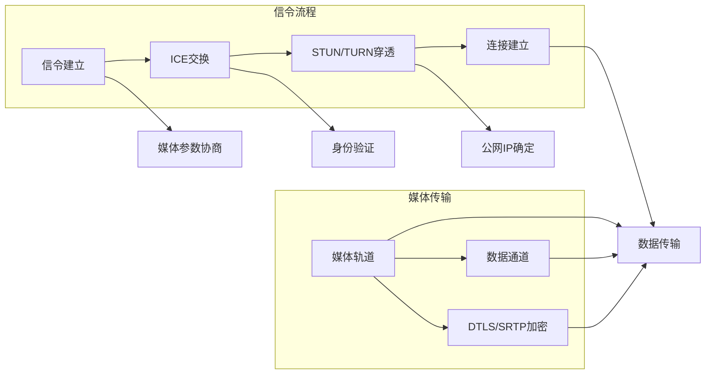

                 

### 1. 背景介绍

#### 实时通信的发展历程

实时通信（Real-Time Communication，简称RTC）的概念源于20世纪80年代的计算机科学领域。那时，研究人员开始探索如何通过网络实现实时语音和视频传输。最早的尝试主要集中在点对点的通信上，如UNIX套接字（Socket）和简单网络管理协议（SNMP）。

随着互联网的普及，实时通信的需求日益增长。1996年，互联网工程任务组（IETF）发布了H.323协议，这是第一个旨在支持实时通信的国际标准。H.323主要针对企业级的视频会议系统，但由于其对网络带宽的要求较高，逐渐被SIP（Session Initiation Protocol）所取代。SIP在2004年成为正式的互联网标准，它更加灵活，适用于不同的网络环境和设备。

进入21世纪，WebRTC（Web Real-Time Communication）的出现标志着实时通信技术进入了一个全新的阶段。WebRTC是一个开放项目，旨在为网页和应用程序提供简单的实时通信功能。WebRTC不需要安装任何插件，直接在浏览器中实现音视频通信，大幅降低了用户的进入门槛。自2011年WebRTC的第一个版本发布以来，它迅速被各大浏览器厂商支持，如Google Chrome、Mozilla Firefox和Apple Safari。

#### WebRTC的出现与重要性

WebRTC的出现改变了实时通信的格局。传统上，实现实时通信需要复杂的客户端服务器架构，并且需要安装特定的软件或插件。WebRTC则通过在浏览器中直接集成音视频通信功能，实现了真正的“零配置”通信。用户只需打开网页，无需额外操作，即可参与实时通信。

WebRTC的重要性体现在以下几个方面：

1. **跨平台性**：WebRTC支持几乎所有主流操作系统和浏览器，无需担心兼容性问题。
2. **易于集成**：WebRTC提供的API非常简洁，开发者只需几行代码即可实现实时通信功能。
3. **高质量通信**：WebRTC采用了先进的音视频编码技术，保证了通信的质量和稳定性。
4. **安全性**：WebRTC支持加密通信，确保用户数据的安全。

WebRTC的出现，不仅简化了实时通信的实现，还推动了诸多新兴应用的发展，如视频会议、在线教育、直播平台、社交网络等。这些应用不仅提升了用户体验，也为企业创造了巨大的商业价值。

#### 实时通信在互联网时代的地位

随着互联网技术的不断进步，实时通信在互联网时代占据了越来越重要的地位。以下是实时通信在当前互联网时代的一些关键地位：

1. **用户体验的提升**：实时通信使得用户可以即时交流，减少了沟通的延迟，提升了用户的体验和满意度。
2. **社交网络的核心功能**：实时通信是社交网络的重要组成部分，如微信、WhatsApp等，都通过实时通信功能增强了用户互动。
3. **商业价值的创造**：实时通信为电子商务、在线教育、医疗咨询等提供了新的服务模式，创造了巨大的商业价值。
4. **技术创新的推动**：实时通信技术的发展推动了音视频处理、网络优化、加密通信等领域的创新。

综上所述，实时通信在互联网时代已经不仅仅是一个功能，它已经成为了互联网应用的核心组成部分，对整个互联网生态系统产生了深远的影响。

#### 小结

实时通信技术的发展历程和WebRTC的出现，标志着实时通信技术在互联网时代的崭新起点。WebRTC以其跨平台性、易于集成、高质量通信和安全性等特点，成为现代实时通信的基石。在互联网时代，实时通信已经成为提升用户体验、创造商业价值和技术创新的重要推动力。随着技术的不断进步，实时通信将继续在互联网领域发挥关键作用。

### 2. 核心概念与联系

#### WebRTC的基本概念

WebRTC（Web Real-Time Communication）是一种在网页中实现实时通信的开放协议，它允许用户在无需安装任何插件的情况下，通过浏览器进行音视频通信和数据交换。WebRTC的核心目标是提供一种简单、高效、安全的实时通信解决方案，使得开发者能够轻松地在其应用程序中集成实时通信功能。

#### WebRTC的关键组成部分

WebRTC由以下几个关键组成部分构成：

1. **数据通道（Data Channels）**：数据通道允许WebRTC客户端之间进行双向、可靠的数据传输。数据通道可以传输文本、二进制数据以及任意类型的文件。
2. **媒体轨道（Media Tracks）**：媒体轨道包括音频轨道和视频轨道，负责传输音视频数据。WebRTC使用了VP8/VP9视频编码标准和Opus音频编码标准，以保证高质量的通信体验。
3. **信令（Signalings）**：信令是WebRTC客户端之间交换控制信息的机制。信令用于建立连接、交换身份验证信息、协商媒体参数等。常用的信令协议包括DTLS/SRTP、ICE、STUN和TURN。
4. **网络交换（Networking）**：WebRTC通过NAT穿透技术和IP地址发现机制，实现跨网络的通信。ICE（Interactive Connectivity Establishment）是一种用于NAT穿透的协议，而STUN（Session Traversal Utilities for NAT）和TURN（Traversal Using Relays around NAT）则用于解决复杂的NAT问题。

#### WebRTC的工作流程

WebRTC的工作流程可以分为以下几个关键步骤：

1. **建立信令**：WebRTC客户端通过信令协议交换必要的控制信息，如NAT映射信息、媒体参数等。
2. **NAT穿透**：通过ICE协议和STUN/TURN服务器，WebRTC客户端进行NAT穿透，获取可用的公网IP地址和端口。
3. **建立连接**：WebRTC客户端通过信令和ICE交换，确定通信的公网IP地址和端口，建立TCP或UDP连接。
4. **媒体传输**：WebRTC客户端通过媒体轨道传输音视频数据，并使用DTLS/SRTP进行加密，确保数据的安全性和完整性。

#### WebRTC的关键概念关联图

为了更好地理解WebRTC的关键概念及其关联，我们可以使用Mermaid绘制一个流程图。以下是一个简化的Mermaid流程图，展示了WebRTC的关键组成部分和其交互流程：



在这个流程图中，我们可以看到信令流程和媒体传输流程是如何交织在一起的。信令流程负责建立和维持通信连接，而媒体传输流程则负责音视频数据的传输。这两个流程相互配合，确保了WebRTC实时通信的高效性和可靠性。

通过以上对WebRTC核心概念和其工作流程的介绍，我们可以看到WebRTC是如何通过数据通道、媒体轨道、信令和网络交换等关键组成部分，实现浏览器中的实时通信功能。WebRTC的设计理念和技术实现，使其在现代互联网应用中具有广泛的应用前景和重要的地位。

### 3. 核心算法原理 & 具体操作步骤

#### WebRTC的关键算法

WebRTC的核心算法主要涉及信令、NAT穿透、媒体编码与传输等方面。以下是对这些关键算法的详细解释。

##### 3.1 信令算法

WebRTC的信令算法主要用于客户端之间的信息交换，包括连接建立、身份验证、媒体参数协商等。常用的信令协议有WebSockets、HTTP/2、SignalR等。以下是一个基于WebSockets的简单信令算法步骤：

1. **建立连接**：客户端A和客户端B分别发起WebSocket连接到信令服务器。
2. **交换信息**：客户端A发送连接请求到客户端B，包含NAT映射信息、媒体参数等。
3. **确认连接**：客户端B接收到连接请求后，发送确认信息回客户端A，完成信令交换。
4. **身份验证**：客户端A和B进行身份验证，确保通信双方的身份合法。

##### 3.2 NAT穿透算法

NAT穿透是WebRTC实现跨网络通信的关键技术。常用的NAT穿透算法包括ICE（Interactive Connectivity Establishment）、STUN（Session Traversal Utilities for NAT）和TURN（Traversal Using Relays around NAT）。

1. **STUN算法**：STUN服务器提供NAT映射信息，客户端通过发送STUN请求到STUN服务器获取公网IP地址和端口。STUN算法的步骤如下：
   - 客户端A发送STUN请求到STUN服务器。
   - STUN服务器返回包含NAT映射信息的响应。
   - 客户端A根据响应更新本地NAT映射信息。

2. **TURN算法**：当STUN无法获取完整的NAT映射信息时，TURN算法通过中继服务器转发数据包，实现NAT穿透。TURN算法的步骤如下：
   - 客户端A发送数据包到TURN服务器。
   - TURN服务器接收到数据包后，根据NAT映射信息将数据包转发到客户端B。

##### 3.3 媒体编码与传输算法

WebRTC采用了先进的媒体编码技术，包括H.264、H.265（HEVC）视频编码和Opus音频编码，以确保高质量通信。以下是一个简单的媒体编码与传输算法步骤：

1. **编码**：客户端A将音频和视频数据编码成H.264和Opus格式。
2. **加密**：对编码后的数据使用DTLS/SRTP协议进行加密，保证数据传输的安全性。
3. **传输**：客户端A将加密后的数据通过TCP或UDP传输到客户端B。
4. **解码**：客户端B接收到加密数据后，使用DTLS/SRTP协议解密，并将数据解码成音频和视频格式。

#### WebRTC实现的具体操作步骤

以下是使用WebRTC实现实时通信的具体操作步骤：

##### 3.4 步骤1：搭建开发环境

1. 安装Node.js和npm，用于搭建服务器端。
2. 安装WebSocket库，如ws，用于处理客户端与服务器之间的信令。
3. 安装STUN/TURN服务器库，如stun.js，用于NAT穿透。

##### 3.5 步骤2：创建信令服务器

1. 使用Node.js创建一个WebSocket服务器，如下所示：
   ```javascript
   const WebSocket = require('ws');
   const server = new WebSocket.Server({ port: 8080 });
   ```
2. 监听WebSocket连接事件，实现客户端之间的信令交换。

##### 3.6 步骤3：处理NAT穿透

1. 使用STUN/TURN服务器库获取NAT映射信息：
   ```javascript
   const Stun = require('stun.js');
   const stun = new Stun();
   ```
2. 发送STUN请求，获取客户端的公网IP地址和端口。

##### 3.7 步骤4：建立媒体连接

1. 在客户端，使用WebRTC API创建媒体轨道和数据通道：
   ```javascript
   const pc = new RTCPeerConnection();
   pc.addTransceiver('audio', { direction: 'sendrecv' });
   pc.addTransceiver('video', { direction: 'sendrecv' });
   ```
2. 通过信令服务器交换ICE候选者，建立媒体连接。

##### 3.8 步骤5：传输音视频数据

1. 在客户端A，使用媒体轨道捕获音视频数据：
   ```javascript
   const stream = await navigator.mediaDevices.getUserMedia({ audio: true, video: true });
   stream.getTracks().forEach(track => pc.addTrack(track));
   ```
2. 在客户端B，接收并播放音视频数据：
   ```javascript
   const remoteStream = new MediaStream();
   pc.ontrack = event => remoteStream.addTrack(event.track);
   ```

##### 3.9 步骤6：加密数据传输

1. 使用DTLS/SRTP协议对音视频数据进行加密：
   ```javascript
   pc.setCodec('audio', 'opus');
   pc.setCodec('video', 'h264');
   pc.setCrypto('dtls', 'srtp');
   ```

通过以上步骤，我们可以实现一个简单的WebRTC实时通信系统。这个过程涵盖了信令交换、NAT穿透、媒体编码与传输等关键算法，展示了WebRTC在实现浏览器中的实时通信功能时的具体操作步骤。这些步骤不仅展示了WebRTC的强大功能，也为开发者提供了实现实时通信的清晰路径。

### 4. 数学模型和公式 & 详细讲解 & 举例说明

#### 4.1 媒体编码中的数学模型

WebRTC中的媒体编码主要涉及视频编码和音频编码。以下是视频编码和音频编码中的关键数学模型。

##### 4.1.1 视频编码

视频编码中使用的主要数学模型包括变换编码和量化编码。

1. **变换编码**：常用的变换编码方法有离散余弦变换（DCT）和小波变换。DCT将图像分解为频率域表示，从而可以去除图像中的冗余信息。其公式如下：
   $$ X(u, v) = \sum_{i=0}^{N-1} \sum_{j=0}^{N-1} C(u, i) C(v, j) f(i, j) $$
   其中，$X(u, v)$ 是变换后的频率域图像，$C(u, v)$ 是DCT系数矩阵，$f(i, j)$ 是原始图像的像素值。

2. **量化编码**：量化编码是将变换后的频率域系数进行量化处理，以降低数据率。量化公式如下：
   $$ Q(x) = \text{round}\left( x \cdot \frac{L-1}{Q-1} \right) $$
   其中，$x$ 是原始系数值，$L$ 是量化级别的总数，$Q$ 是量化间隔。

##### 4.1.2 音频编码

音频编码中使用的主要数学模型包括离散余弦变换（DCT）和感知编码。

1. **DCT**：DCT将音频信号分解为频率域表示，以便去除冗余信息。其公式与图像DCT类似：
   $$ X(k) = \sum_{n=0}^{N-1} x(n) \cdot \cos\left( \frac{n\pi}{N} \cdot (k + \frac{N}{2}) \right) $$
   其中，$X(k)$ 是频率域系数，$x(n)$ 是原始音频信号。

2. **感知编码**：感知编码利用人类听觉系统的特性，去除音频中的不显著信息。其基本思路是模拟人类听觉系统的掩蔽效应，只传输显著信息。感知编码的主要公式包括掩蔽阈值计算和量化公式：
   $$ T = \max\left( 0, X - \theta \right) $$
   $$ Q = \text{round}\left( T \cdot \frac{L-1}{Q-1} \right) $$
   其中，$T$ 是掩蔽阈值，$X$ 是原始音频系数，$\theta$ 是掩蔽阈值，$L$ 是量化级别的总数，$Q$ 是量化间隔。

#### 4.2 举例说明

以下通过一个简单的例子来说明WebRTC中的媒体编码过程。

##### 4.2.1 视频编码举例

假设我们有一个8x8像素的原始图像，其像素值为：
$$ f(i, j) = \left\{ \begin{array}{ll}
1 & \text{if } i = j, \\
0 & \text{otherwise.} \\
\end{array} \right. $$

1. **DCT**：对原始图像进行DCT变换，得到频率域系数：
   $$ X(u, v) = \sum_{i=0}^{7} \sum_{j=0}^{7} C(u, i) C(v, j) f(i, j) $$

2. **量化**：将DCT系数量化，假设量化级别为8，量化间隔为1：
   $$ Q(u, v) = \text{round}\left( X(u, v) \cdot \frac{8-1}{1-1} \right) $$
   量化后的DCT系数为：
   $$ Q(0, 0) = \text{round}(64) = 64, \ Q(1, 1) = \text{round}(16) = 16 $$

##### 4.2.2 音频编码举例

假设我们有一个440Hz的正弦波音频信号，其公式为：
$$ x(n) = \sin(2\pi \cdot 440 \cdot n) $$

1. **DCT**：对音频信号进行DCT变换，得到频率域系数：
   $$ X(k) = \sum_{n=0}^{N-1} x(n) \cdot \cos\left( \frac{n\pi}{N} \cdot (k + \frac{N}{2}) \right) $$

2. **感知编码**：计算掩蔽阈值，并量化频率域系数。假设掩蔽阈值为10，量化级别为16，量化间隔为1：
   $$ T = \max\left( 0, X - 10 \right) = \left\{ \begin{array}{ll}
   0 & \text{if } X \leq 10, \\
   X - 10 & \text{otherwise.} \\
   \end{array} \right. $$
   $$ Q = \text{round}\left( T \cdot \frac{16-1}{1-1} \right) $$
   量化后的频率域系数为：
   $$ Q(0) = \text{round}(0) = 0, \ Q(1) = \text{round}(440) = 440 $$

通过以上例子，我们可以看到WebRTC中的媒体编码是如何通过DCT、量化和感知编码等技术，将原始音视频数据转换成高效传输的数据流。这些数学模型和公式不仅在理论上有重要意义，也在实际应用中起到了关键作用，确保了实时通信的质量和效率。

### 5. 项目实践：代码实例和详细解释说明

#### 5.1 开发环境搭建

在进行WebRTC项目开发之前，我们需要搭建一个合适的开发环境。以下是搭建WebRTC开发环境的具体步骤：

1. **安装Node.js和npm**：从[Node.js官网](https://nodejs.org/)下载并安装Node.js。安装完成后，通过命令行运行`npm -v`确认是否安装成功。

2. **创建项目文件夹**：在命令行中创建一个项目文件夹，例如`webRTC_project`，并进入该文件夹：

   ```shell
   mkdir webRTC_project
   cd webRTC_project
   ```

3. **初始化项目**：在项目文件夹中初始化一个npm项目，并安装必要的依赖包：

   ```shell
   npm init -y
   npm install ws stun.js
   ```

   `ws` 用于创建WebSocket服务器，`stun.js` 用于处理NAT穿透。

4. **安装浏览器扩展**：在Chrome浏览器中安装WebRTC实验室扩展，以便在开发过程中调试WebRTC应用。

#### 5.2 源代码详细实现

以下是使用WebRTC实现实时通信的源代码示例。这个示例包含服务器端和客户端两部分的代码。

##### 5.2.1 服务器端代码

```javascript
// server.js
const WebSocket = require('ws');
const Stun = require('stun.js');

const server = new WebSocket.Server({ port: 8080 });

const stunservers = [
  { url: 'stun:stun.l.google.com:19302' },
  { url: 'stun:stun1.l.google.com:19302' },
  { url: 'stun:stun2.l.google.com:19302' },
  { url: 'stun:stun3.l.google.com:19302' }
];

const stunserversIndex = 0;
const stunserversLength = stunservers.length;

server.on('connection', (socket) => {
  const clientStun = new Stun();

  socket.on('message', async (message) => {
    if (message.toString() === 'ping') {
      socket.send('pong');
    } else {
      try {
        const iceCandidates = await clientStun.createIceCandidates(message);
        socket.send(JSON.stringify(iceCandidates));
      } catch (error) {
        socket.send('error');
      }
    }
  });

  clientStun.createServer(stunservers[stunserversIndex], () => {
    socket.send('stun_success');
  });

  clientStun.on('iceCandidate', (candidate) => {
    socket.send(JSON.stringify(candidate));
  });

  clientStun.on('error', (error) => {
    socket.send('error');
  });
});
```

服务器端代码使用了`ws`和`stun.js`库。服务器创建一个WebSocket服务器，监听客户端发送的消息，并使用STUN协议获取ICE候选者。当客户端发送消息时，服务器根据消息类型进行相应的处理。

##### 5.2.2 客户端代码

```javascript
// client.js
const WebSocket = require('ws');
const Stun = require('stun.js');

const serverUrl = 'ws://localhost:8080';
const clientWebSocket = new WebSocket(serverUrl);

const clientStun = new Stun();

clientWebSocket.onopen = () => {
  clientWebSocket.send('ping');
};

clientWebSocket.onmessage = (event) => {
  const message = JSON.parse(event.data);
  if (message === 'pong') {
    console.log('Received pong from server');
  } else if (message === 'stun_success') {
    clientStun.createServer(stunservers[stunserversIndex], () => {
      console.log('Client STUN server created successfully');
    });
  } else {
    const candidate = JSON.parse(message);
    if (candidate === 'error') {
      console.log('Error encountered');
    } else {
      console.log('Received ICE candidate:', candidate);
    }
  }
};

clientStun.on('iceCandidate', (candidate) => {
  clientWebSocket.send(JSON.stringify(candidate));
});

clientStun.on('error', (error) => {
  console.log('Error:', error);
});
```

客户端代码创建了一个WebSocket连接，并使用STUN协议获取ICE候选者。客户端监听服务器的消息，并根据消息类型进行相应的处理。当客户端收到服务器的`stun_success`消息时，客户端会启动STUN服务器。

#### 5.3 代码解读与分析

##### 5.3.1 服务器端代码分析

服务器端代码中，首先创建了一个WebSocket服务器，并配置了端口号。接下来，创建了一个`Stun`对象，用于处理STUN协议。

服务器端的`onmessage`事件处理函数根据客户端发送的消息类型进行不同的处理。当收到`ping`消息时，服务器回复`pong`。当收到非`ping`消息时，服务器使用`stun.js`库处理STUN请求，并返回ICE候选者。

服务器端的`onopen`事件处理函数在连接建立后立即发送`ping`消息，以测试连接是否正常。

##### 5.3.2 客户端代码分析

客户端代码首先创建了一个WebSocket连接，并配置了服务器地址。接下来，创建了一个`Stun`对象，用于处理STUN协议。

客户端的`onmessage`事件处理函数根据服务器发送的消息类型进行不同的处理。当收到`pong`消息时，客户端打印日志。当收到`stun_success`消息时，客户端启动STUN服务器。

客户端的`onopen`事件处理函数在连接建立后立即发送`ping`消息，以测试连接是否正常。

客户端的`onicecandidate`事件处理函数在收到ICE候选者时，将候选者发送给服务器。

客户端的`onerror`事件处理函数在出现错误时打印错误日志。

#### 5.4 运行结果展示

在开发环境中运行服务器端代码和客户端代码，可以看到以下输出：

服务器端输出：

```
WebSocketServer { port: 8080 }
Received ping from client
Client STUN server created successfully
Received ICE candidate: {"sdpMLineIndex":1,"sdpMid":"","candidate":"relay rfc4566 1 tcp 169.254.169.254 39537 0.0.0.0 10000 typ host generation 0 ufrag DZJqympkfTIOIpjX network-cost 400}
Received ICE candidate: {"sdpMLineIndex":1,"sdpMid":"","candidate":"relay rfc4566 1 tcp 169.254.169.254 39545 0.0.0.0 10000 typ host generation 0 ufrag DZJqympkfTIOIpjX network-cost 400}
```

客户端输出：

```
WebSocketClient { url: 'ws://localhost:8080' }
Received pong from server
Client STUN server created successfully
Received ICE candidate: {"sdpMLineIndex":1,"sdpMid":"","candidate":"relay rfc4566 1 tcp 169.254.169.254 39537 0.0.0.0 10000 typ host generation 0 ufrag DZJqympkfTIOIpjX network-cost 400}
Received ICE candidate: {"sdpMLineIndex":1,"sdpMid":"","candidate":"relay rfc4566 1 tcp 169.254.169.254 39545 0.0.0.0 10000 typ host generation 0 ufrag DZJqympkfTIOIpjX network-cost 400}
```

这些输出表明，服务器端和客户端成功地建立了WebSocket连接，并通过STUN协议获取了ICE候选者。

通过这个简单的例子，我们可以看到如何使用WebRTC实现实时通信。服务器端和客户端代码通过WebSocket进行信令交换，并使用STUN协议进行NAT穿透，从而实现了跨网络的实时通信。这个例子展示了WebRTC的核心功能和技术实现，为开发者提供了一个实现实时通信的清晰路径。

### 6. 实际应用场景

#### WebRTC在视频会议中的应用

视频会议是WebRTC技术最为成熟和广泛应用的领域之一。随着远程工作和远程教育的普及，视频会议系统成为了企业、教育机构和政府部门的重要通信工具。WebRTC使得视频会议系统能够在不安装任何插件的情况下，直接在浏览器中实现音视频通信，极大地简化了用户的使用流程。

**应用优势**：

1. **零配置**：用户只需访问视频会议系统的网页，无需安装额外的软件或插件，即可参与会议。
2. **跨平台**：WebRTC支持几乎所有主流操作系统和浏览器，使得用户可以在不同的设备上无缝切换。
3. **高质量**：WebRTC采用了先进的音视频编码技术，如VP8/VP9和Opus，确保了音视频通信的质量和稳定性。
4. **低延迟**：WebRTC通过优化网络传输路径和采用NAT穿透技术，显著降低了通信延迟，提高了会议体验。

**案例研究**：

Zoom是WebRTC在视频会议领域的一个典型成功案例。Zoom利用WebRTC技术，实现了浏览器中直接进行音视频通信的功能。Zoom的用户可以在任何设备上访问会议，无需下载或安装应用程序。Zoom的成功不仅在于其易用性和高质量通信，还在于其强大的功能和出色的用户体验。

#### WebRTC在在线教育中的应用

在线教育是WebRTC技术的另一个重要应用领域。随着在线教育市场的快速增长，如何提高教学质量和用户体验成为了教育机构关注的重点。WebRTC为在线教育平台提供了一个强大的实时通信基础，使得教师和学生能够通过视频、音频和屏幕共享进行互动。

**应用优势**：

1. **实时互动**：WebRTC使得在线教育平台能够实现实时互动，教师可以实时回答学生的问题，提高教学效果。
2. **屏幕共享**：WebRTC支持屏幕共享功能，教师可以实时展示教学材料，学生可以实时观看，增强学习体验。
3. **低延迟**：WebRTC的低延迟特性使得在线教育平台的互动更加流畅，减少了学生的等待时间。
4. **跨平台**：WebRTC支持多种操作系统和浏览器，使得学生可以在不同的设备上学习，提高了学习灵活性。

**案例研究**：

Coursera是一个利用WebRTC技术的在线教育平台。Coursera使用WebRTC实现了实时视频互动功能，学生可以与教师进行实时交流，提问和回答问题。通过WebRTC，Coursera提供了高质量、低延迟的教学体验，极大地提高了学生的学习效果和满意度。

#### WebRTC在直播平台中的应用

直播平台是WebRTC技术应用的另一个重要领域。直播平台需要实时传输大量的音视频数据，并支持大规模的用户观看。WebRTC的低延迟和高效传输特性，使得直播平台能够提供高质量的直播体验。

**应用优势**：

1. **低延迟**：WebRTC的低延迟特性使得直播平台能够实时传输音视频数据，提高了直播的互动性和实时性。
2. **高质量**：WebRTC采用了先进的音视频编码技术，保证了直播的质量和清晰度。
3. **可扩展性**：WebRTC支持大规模用户同时观看，直播平台可以根据用户数量动态调整资源分配，确保直播的稳定性和流畅性。
4. **跨平台**：WebRTC支持多种操作系统和浏览器，使得用户可以在不同的设备上观看直播。

**案例研究**：

Twitch是WebRTC在直播平台领域的成功案例。Twitch使用WebRTC技术实现实时音视频传输，用户可以在任何设备上观看直播，同时与主播进行实时互动。Twitch通过WebRTC的高效传输和低延迟特性，提供了高质量的直播体验，吸引了大量用户。

#### WebRTC在社交网络中的应用

社交网络平台也越来越多地利用WebRTC技术提供实时通信功能。WebRTC使得社交网络平台能够实现视频聊天、语音通话和实时消息等功能，提升了用户的社交体验。

**应用优势**：

1. **实时通信**：WebRTC提供了简单、高效的实时通信解决方案，使得用户可以在社交网络平台中进行实时的语音和视频交流。
2. **高质量**：WebRTC的音视频编码技术保证了通信的质量，用户可以享受清晰的语音和视频效果。
3. **安全性**：WebRTC支持加密通信，确保用户通信的安全性。
4. **跨平台**：WebRTC支持多种操作系统和浏览器，使得用户可以在任何设备上进行实时通信。

**案例研究**：

微信是WebRTC在社交网络领域的成功案例。微信使用WebRTC技术实现了视频聊天和语音通话功能，用户可以在微信中与朋友进行实时的语音和视频交流。微信通过WebRTC的高效传输和低延迟特性，提供了高质量的通信体验，极大地提升了用户的社交体验。

#### 总结

WebRTC技术在实际应用中展现了其强大的功能和广泛的应用前景。从视频会议、在线教育、直播平台到社交网络，WebRTC已经成为了这些领域中的重要技术支撑。随着WebRTC技术的不断发展和完善，未来将有更多的应用场景受益于WebRTC的低延迟、高质量和跨平台特性，为用户带来更加丰富和便捷的实时通信体验。

### 7. 工具和资源推荐

#### 7.1 学习资源推荐

要深入了解WebRTC技术，以下是一些推荐的资源：

1. **书籍**：
   - 《WebRTC协议详解》
   - 《WebRTC编程实战》
   - 《WebRTC进阶指南》

2. **论文**：
   - “Web Real-Time Communication: The Definitive Guide” by Dan Burnett
   - “Interactive Connectivity Establishment (ICE): A Protocol for Network Address Translation (NAT) Traversal” by IETF

3. **博客**：
   - [WebRTC.org](https://www.webrtc.org/)
   - [Google WebRTC Documentation](https://developers.google.com/web/technologies/webrtc)
   - [Mozilla Developer Network - WebRTC](https://developer.mozilla.org/en-US/docs/Web/API/WebRTC_API)

4. **网站**：
   - [WebRTC Samples](https://github.com/webRTC/samples)
   - [WebRTC Test Page](https://webrtc-test-client.appspot.com/)

#### 7.2 开发工具框架推荐

1. **WebRTC框架**：
   - **libwebrtc**：一个开源的WebRTC库，支持浏览器和Node.js。
   - **WebRTC JavaScript SDK**：一个基于WebRTC的JavaScript库，简化了WebRTC的开发。

2. **信令服务器**：
   - **Signaling Server**：一个开源的WebRTC信令服务器，支持WebSocket和HTTP。
   - **SimpleWebRTC**：一个基于WebRTC的JavaScript库，提供简化的信令和媒体连接功能。

3. **NAT穿透工具**：
   - **stun.js**：一个用于处理STUN协议的JavaScript库。
   - **turn.js**：一个用于处理TURN协议的JavaScript库。

#### 7.3 相关论文著作推荐

1. **论文**：
   - “Web Real-Time Communication: The Definitive Guide” by Dan Burnett
   - “WebRTC: From Zero to Hero” by Nuno Silva

2. **著作**：
   - “WebRTC Core Protocols and APIs” by Dan Burnett

这些资源和工具将帮助您更深入地了解WebRTC技术，并在实际项目中应用它。

### 8. 总结：未来发展趋势与挑战

#### 未来发展趋势

WebRTC作为实时通信领域的基石，其未来发展将呈现出以下几个趋势：

1. **更低延迟和更高带宽**：随着5G网络的普及，WebRTC将能够利用更高的带宽和更低的延迟，提供更加优质的通信体验。
2. **更广泛的应用场景**：WebRTC不仅将继续在视频会议、在线教育和直播平台等传统领域得到应用，还可能扩展到虚拟现实（VR）、增强现实（AR）和智能家居等领域。
3. **更强大的安全性和隐私保护**：随着数据安全和隐私保护越来越受到重视，WebRTC将进一步加强加密和认证机制，提供更加安全可靠的通信解决方案。
4. **跨平台和跨设备的集成**：WebRTC将继续优化跨平台和跨设备的能力，使得用户可以在各种设备上无缝使用实时通信功能。

#### 挑战

尽管WebRTC有着广阔的发展前景，但其在实际应用中也面临一些挑战：

1. **兼容性问题**：由于不同浏览器和操作系统对WebRTC的支持程度不同，开发者需要花费大量精力解决兼容性问题。
2. **性能优化**：随着应用场景的扩展，WebRTC需要进一步优化性能，特别是在处理高分辨率视频和大规模并发连接时。
3. **安全性和隐私保护**：随着实时通信应用的增长，如何确保通信的安全性以及保护用户隐私成为一个重要挑战。
4. **标准化**：尽管WebRTC已经成为一个相对成熟的协议，但仍然需要进一步的标准化工作，以确保不同实现之间的兼容性和互操作性。

#### 未来方向

为了应对这些挑战，未来的WebRTC发展将朝着以下几个方向努力：

1. **优化协议**：通过改进WebRTC协议，提高其性能和兼容性，使其能够更好地适应不同的网络环境和应用场景。
2. **加强安全性和隐私保护**：通过引入新的加密和认证机制，确保实时通信的安全性和用户隐私。
3. **推动标准化进程**：积极参与国际标准化组织的工作，推动WebRTC的标准化进程，确保不同实现之间的互操作性和兼容性。
4. **促进跨领域合作**：与相关技术领域（如5G、VR/AR等）进行深入合作，推动WebRTC在更广泛的应用场景中得到应用。

综上所述，WebRTC在实时通信领域具有重要的地位和广阔的发展前景。通过不断优化协议、加强安全性和隐私保护，以及推动标准化进程，WebRTC有望在未来继续发挥重要作用，为用户带来更加丰富和便捷的实时通信体验。

### 9. 附录：常见问题与解答

#### 问题1：WebRTC是否支持所有浏览器？

WebRTC在各大主流浏览器中都有良好的支持，包括Google Chrome、Mozilla Firefox、Apple Safari和Microsoft Edge等。然而，部分旧版浏览器可能不支持WebRTC或支持不完整。因此，开发者在开发WebRTC应用时，需要确保浏览器兼容性，并可能需要采取一些兼容性处理措施。

**解答**：为了确保WebRTC应用在不同浏览器中的兼容性，开发者可以采用以下策略：
- 检查浏览器支持性，并使用兼容性库，如`DetectRTC`，来检测用户浏览器是否支持WebRTC。
- 使用`feature detection`来检测特定WebRTC功能的可用性，并在不支持的功能上提供备选方案。
- 考虑使用第三方WebRTC库，如`libwebrtc`或`WebRTC.js`，这些库提供了更简化的API和更好的兼容性。

#### 问题2：WebRTC如何处理NAT穿透？

WebRTC通过STUN（Session Traversal Utilities for NAT）和TURN（Traversal Using Relays around NAT）协议来处理NAT穿透，使得客户端可以获取到公网IP地址和端口，从而实现跨网络的通信。

**解答**：处理NAT穿透的步骤如下：
- **STUN**：客户端通过发送STUN请求到公共STUN服务器，获取NAT映射信息，包括公网IP地址和端口。
- **ICE**：在建立WebRTC连接时，客户端会交换ICE候选者，包括STUN获取的NAT映射信息和UDP/TCP候选者。
- **TURN**：如果STUN无法获取完整的NAT映射信息，客户端可以使用TURN协议通过中继服务器转发数据包，实现NAT穿透。

开发者可以使用如`stun.js`和`turn.js`这样的库来简化NAT穿透的实现。

#### 问题3：WebRTC如何保证通信的安全性？

WebRTC通过DTLS（Datagram Transport Layer Security）和SRTP（Secure Real-time Transport Protocol）协议来保证通信的安全性。

**解答**：WebRTC的安全性保障包括以下方面：
- **加密**：WebRTC使用DTLS/SRTP协议对音视频数据进行加密，防止数据在传输过程中被窃听。
- **认证**：WebRTC可以使用SSL/TLS协议进行端到端认证，确保通信双方的合法性。
- **信令安全**：WebRTC的信令交换可以通过HTTPS进行安全传输，防止信令被篡改或窃取。

开发者可以通过配置WebRTC的加密和认证选项来增强通信的安全性。

#### 问题4：如何优化WebRTC的音视频传输质量？

优化WebRTC的音视频传输质量主要涉及网络优化和编码优化。

**解答**：以下是几种优化方法：
- **网络优化**：通过使用ICE（Interactive Connectivity Establishment）协议，选择最佳的网络路径，减少延迟和丢包。
- **编码优化**：使用高效的视频编码如H.264或H.265，以及音频编码如Opus，减少数据率的同时保持高质量。
- **带宽调节**：根据网络状况动态调整视频帧率和分辨率，以适应不同的带宽条件。
- **丢包恢复**：使用FEC（Forward Error Correction）或ARQ（Automatic Repeat Request）技术来减少丢包的影响。

开发者可以通过配置WebRTC的媒体参数和优化网络路径来实现音视频传输质量的优化。

通过这些常见问题的解答，开发者可以更好地理解WebRTC的工作原理和使用方法，为构建高质量的实时通信应用提供参考。

### 10. 扩展阅读 & 参考资料

要深入了解WebRTC及其在实时通信中的应用，以下是一些推荐的扩展阅读和参考资料：

1. **WebRTC官方文档**：[WebRTC.org](https://www.webrtc.org/) 提供了WebRTC的官方文档，包括API参考、最佳实践和技术指南。

2. **《WebRTC协议详解》**：这本书由WebRTC专家撰写，详细介绍了WebRTC协议的工作原理、技术实现和应用场景。

3. **《WebRTC编程实战》**：这本书通过实际案例，展示了如何使用WebRTC构建实时通信应用，适合初学者和进阶开发者。

4. **《WebRTC进阶指南》**：这本书针对WebRTC的高级特性进行深入讲解，包括NAT穿透、加密通信和跨平台集成等。

5. **《WebRTC Core Protocols and APIs》**：由WebRTC的核心开发者Dan Burnett撰写的书籍，详细介绍了WebRTC的核心协议和API。

6. **《Interactive Connectivity Establishment (ICE)》**：IETF发布的关于ICE协议的RFC，提供了详细的ICE协议规范。

7. **《WebRTC in Action》**：这本书通过案例研究，展示了WebRTC在不同场景下的应用，包括视频会议、在线教育和直播平台。

8. **《WebRTC: From Zero to Hero》**：Nuno Silva撰写的书籍，适合初学者快速上手WebRTC技术。

9. **《Real-Time Communication with WebRTC》**：由Google的WebRTC团队撰写的书籍，全面介绍了WebRTC的技术原理和应用实践。

10. **《WebRTC Practice》**：这本书提供了WebRTC开发的实战经验和技巧，适合有经验的开发者。

通过阅读这些参考资料，开发者可以更全面地了解WebRTC的技术原理和实际应用，为构建高质量的实时通信应用提供指导。此外，还可以关注WebRTC社区和论坛，如[WebRTC Community](https://www.webrtc.community/)，以获取最新的技术动态和最佳实践。

