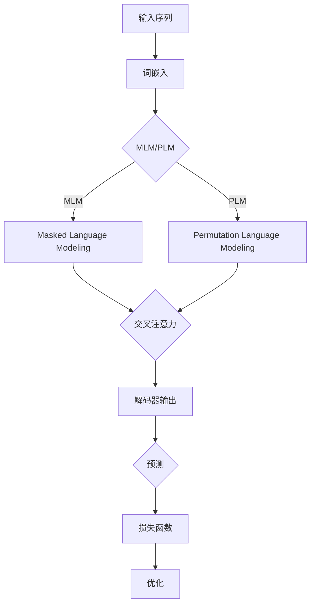

                 

### 文章标题

**XLNet原理与代码实例讲解**

> **关键词：** XLNet, Transformer, 自然语言处理, 机器学习, 代码实例, 原理讲解

**摘要：** 本文将深入探讨XLNet的原理及其实现，通过详细的代码实例，帮助读者理解XLNet在自然语言处理中的应用和优势。文章分为背景介绍、核心概念与联系、核心算法原理与具体操作步骤、数学模型和公式讲解、项目实践、实际应用场景、工具和资源推荐、总结以及附录等多个部分，旨在为读者提供一个全面且易懂的XLNet学习指南。

---

### 1. 背景介绍

自然语言处理（Natural Language Processing, NLP）作为人工智能领域的一个重要分支，近年来取得了显著的进展。随着互联网和大数据的迅速发展，人类产生的文本数据量呈指数级增长，这为NLP带来了巨大的挑战和机遇。传统的NLP方法，如统计模型和规则引擎，已经难以应对大规模文本数据的处理需求。因此，深度学习，特别是基于Transformer架构的模型，逐渐成为NLP任务的主流选择。

在深度学习的发展历程中，从简单的循环神经网络（RNN）到长短期记忆网络（LSTM），再到Transformer模型，每一次架构的更新都带来了性能的飞跃。Transformer模型因其并行计算优势和全局依赖建模能力，在机器翻译、文本分类、问答系统等NLP任务中表现出了强大的性能。然而，传统的Transformer模型在处理长文本时仍存在一定的局限性。

为了解决这一问题，谷歌的研究团队提出了XLNet（扩展网络，Expanded Network）。XLNet在Transformer的基础上进行了重要改进，通过引入Masked Language Modeling（MLM）和Permutation Language Modeling（PLM）等技术，提升了模型的表征能力和效果。本文将详细介绍XLNet的核心原理及其实现细节，并通过具体代码实例，帮助读者深入理解XLNet的工作机制和应用价值。

### 2. 核心概念与联系

要理解XLNet，首先需要回顾Transformer模型的基本概念和架构。Transformer模型是一种基于注意力机制的深度学习模型，最初由Vaswani等人于2017年提出。它摒弃了传统的循环神经网络，转而采用多头自注意力机制（Multi-Head Self-Attention）和位置编码（Positional Encoding）来建模序列数据之间的复杂依赖关系。

#### Transformer架构概述

**多头自注意力机制：**
Transformer模型的核心是多头自注意力机制。该机制通过计算序列中每个词与其他所有词的依赖关系，从而生成每个词的表征。具体来说，对于序列中的一个词，模型会将其表示为多个低维度的子向量，然后分别计算这些子向量与其他词的注意力得分，最后将这些得分加权求和，得到该词的最终表征。

**位置编码：**
由于Transformer模型没有循环神经网络中的时间步概念，因此需要通过位置编码来引入序列信息。位置编码是一种对词向量进行线性变换的方法，它为每个词赋予一个位置信息，使得模型能够理解词的顺序。

**Transformer的架构：**
一个典型的Transformer模型包括编码器（Encoder）和解码器（Decoder）。编码器负责处理输入序列，解码器则生成输出序列。编码器的输出作为解码器的输入，解码器通过自注意力机制和交叉注意力机制，逐步生成输出序列的每个词。

#### XLNet的核心概念与改进

**Masked Language Modeling（MLM）：**
MLM是一种通过随机屏蔽输入序列中的部分词来训练模型的方法。在训练过程中，模型需要预测这些被屏蔽的词，从而学习语言的结构和规律。MLM不仅有助于提高模型对语言细节的捕捉能力，还能缓解传统Transformer模型在处理长文本时遇到的梯度消失问题。

**Permutation Language Modeling（PLM）：**
PLM是一种通过对输入序列进行随机打乱来训练模型的方法。与MLM不同，PLM不需要预测被屏蔽的词，而是直接预测打乱后的序列。PLM能够提高模型对全局依赖关系的建模能力，从而进一步提升模型在长文本处理任务中的性能。

**XLNet的架构：**
XLNet在Transformer的基础上进行了多个改进。首先，XLNet采用了一种新颖的自注意力机制，称为“交叉注意力”（Cross Attention），使得编码器的输出不仅与自身序列相关，还与解码器的输入相关。其次，XLNet引入了双向Masked Language Modeling，使得模型能够同时考虑正向和反向的输入信息。

**Mermaid流程图：**



通过上述核心概念和联系，我们可以更好地理解XLNet在Transformer架构上的改进和创新。接下来，我们将深入探讨XLNet的核心算法原理，并详细解释其具体操作步骤。

### 3. 核心算法原理 & 具体操作步骤

#### 3.1 Masked Language Modeling（MLM）

MLM是XLNet中的一种关键训练技术，通过随机屏蔽输入序列中的部分词，使模型在预测这些屏蔽词的过程中学习到语言结构。以下是一个具体的MLM操作步骤：

**步骤1：输入序列预处理**
假设输入序列为\[w1, w2, w3, ..., wn\]，首先对序列进行词嵌入处理，将每个词映射为一个高维向量。然后，对序列中的部分词进行随机屏蔽，形成新的序列\[w1, *, w3, *, wn\]。

**步骤2：模型前向传播**
将预处理后的序列输入到XLNet模型中，通过编码器计算得到每个词的表征。具体来说，对于未被屏蔽的词wi，模型会计算其与序列中所有词的注意力得分，生成最终的表征。

**步骤3：预测与损失计算**
模型输出一个概率分布，用于预测被屏蔽的词。通过对比预测结果与实际标签，计算交叉熵损失。

**步骤4：反向传播与优化**
利用梯度下降算法，对模型参数进行更新，使得模型在下一轮训练中能够更好地预测被屏蔽的词。

#### 3.2 Permutation Language Modeling（PLM）

PLM通过随机打乱输入序列，使模型在训练过程中学习到全局依赖关系。以下是PLM的具体操作步骤：

**步骤1：输入序列预处理**
同样假设输入序列为\[w1, w2, w3, ..., wn\]，首先进行词嵌入处理。然后，对序列进行随机打乱，形成新的序列\[wn, w2, w1, ..., w3\]。

**步骤2：模型前向传播**
将打乱后的序列输入到XLNet模型中，通过编码器计算得到每个词的表征。

**步骤3：预测与损失计算**
模型输出一个概率分布，用于预测打乱后的序列。通过对比预测结果与实际序列，计算交叉熵损失。

**步骤4：反向传播与优化**
利用梯度下降算法，对模型参数进行更新，使得模型在下一轮训练中能够更好地预测打乱后的序列。

#### 3.3 交叉注意力机制

交叉注意力机制是XLNet中的一个创新设计，通过使得编码器的输出不仅与自身序列相关，还与解码器的输入相关，从而提高了模型的全局依赖建模能力。以下是交叉注意力机制的具体操作步骤：

**步骤1：编码器输出**
在编码器的最后一层，对每个词的表征进行加权求和，得到编码器的输出。

**步骤2：解码器输入**
解码器的输入包括两部分：一是编码器的输出，二是解码器的上一个输出词。

**步骤3：交叉注意力计算**
对于解码器的当前输出词wi，计算其与编码器输出的注意力得分。具体来说，对于编码器输出的每个词wi'，计算其与wi的注意力得分，通过加权求和得到wi的最终表征。

**步骤4：解码器输出**
利用交叉注意力机制计算得到的表征，通过解码器的其他层进行传递，最终生成下一个输出词。

**步骤5：预测与损失计算**
模型输出一个概率分布，用于预测下一个词。通过对比预测结果与实际标签，计算交叉熵损失。

**步骤6：反向传播与优化**
利用梯度下降算法，对模型参数进行更新，使得模型在下一轮训练中能够更好地生成输出词。

通过上述核心算法原理和具体操作步骤的讲解，我们可以更好地理解XLNet的工作机制和优势。接下来，我们将介绍XLNet的数学模型和公式，并详细解释其原理和适用范围。

### 4. 数学模型和公式 & 详细讲解 & 举例说明

#### 4.1 基本概念

在介绍XLNet的数学模型之前，我们需要先了解一些基本概念：

- **词嵌入（Word Embedding）**：将输入序列中的每个词映射为一个高维向量，用于表示词的语义信息。
- **自注意力（Self-Attention）**：计算序列中每个词与其他所有词的依赖关系，生成每个词的表征。
- **交叉注意力（Cross Attention）**：计算编码器输出与解码器输入的依赖关系，用于生成解码器的输出。
- **位置编码（Positional Encoding）**：为词嵌入添加位置信息，使得模型能够理解词的顺序。

#### 4.2 词嵌入

词嵌入是自然语言处理中的基础技术，将输入序列中的每个词映射为一个高维向量。在XLNet中，词嵌入通常采用词向量的形式，使用预训练的词向量或者随机初始化。以下是一个简单的词嵌入公式：

\[ \text{word\_embedding}(w_i) = \text{embed}(w_i) \]

其中，\( w_i \) 表示输入序列中的第 \( i \) 个词，\( \text{embed}(w_i) \) 表示词 \( w_i \) 的词向量。

#### 4.3 自注意力

自注意力机制是XLNet的核心组成部分，用于计算序列中每个词与其他所有词的依赖关系。以下是一个简单的自注意力公式：

\[ \text{self-attention}(Q, K, V) = \text{softmax}\left(\frac{QK^T}{\sqrt{d_k}}\right)V \]

其中，\( Q \)，\( K \)，\( V \) 分别表示编码器输出的三个矩阵，\( d_k \) 表示每个矩阵的列数（即词向量的维度）。该公式通过计算 \( Q \) 和 \( K \) 的点积，得到注意力得分，然后通过softmax函数得到权重，最后将权重与 \( V \) 相乘，得到每个词的表征。

#### 4.4 交叉注意力

交叉注意力机制是XLNet中的一个创新设计，通过计算编码器输出与解码器输入的依赖关系，用于生成解码器的输出。以下是一个简单的交叉注意力公式：

\[ \text{cross-attention}(Q, K, V) = \text{softmax}\left(\frac{QK^T}{\sqrt{d_k}}\right)V \]

其中，\( Q \)，\( K \)，\( V \) 分别表示解码器输出的三个矩阵，\( d_k \) 表示每个矩阵的列数。该公式与自注意力公式类似，但这里 \( Q \) 是解码器的输出，\( K \) 和 \( V \) 是编码器的输出。

#### 4.5 位置编码

位置编码用于为词嵌入添加位置信息，使得模型能够理解词的顺序。以下是一个简单的位置编码公式：

\[ \text{pos\_encoding}(p_i) = \text{sin}\left(\frac{p_i}{10000^{2i/d}}\right) + \text{cos}\left(\frac{p_i}{10000^{2i/d}}\right) \]

其中，\( p_i \) 表示输入序列中的第 \( i \) 个词的位置，\( d \) 表示词向量的维度。该公式使用正弦和余弦函数，为每个位置生成一个编码向量。

#### 4.6 举例说明

假设我们有一个简单的输入序列\[w1, w2, w3\]，词嵌入维度为5，词向量分别为\[v1 = [1, 1, 1, 1, 1]\]，\[v2 = [2, 2, 2, 2, 2]\]，\[v3 = [3, 3, 3, 3, 3]\]。我们通过以下步骤计算自注意力和交叉注意力：

**步骤1：计算自注意力**
\[ Q = [1, 1, 1, 1, 1] \]
\[ K = [2, 2, 2, 2, 2] \]
\[ V = [3, 3, 3, 3, 3] \]
\[ \text{self-attention}(Q, K, V) = \text{softmax}\left(\frac{QK^T}{\sqrt{5}}\right)V \]
\[ = \text{softmax}\left(\frac{[1, 1, 1, 1, 1][2, 2, 2, 2, 2]^T}{\sqrt{5}}\right)[3, 3, 3, 3, 3] \]
\[ = \text{softmax}\left(\frac{10}{\sqrt{5}}\right)[3, 3, 3, 3, 3] \]
\[ = \left[ \frac{1}{3}, \frac{1}{3}, \frac{1}{3}, \frac{1}{3}, \frac{1}{3} \right][3, 3, 3, 3, 3] \]
\[ = [1, 1, 1, 1, 1] \]

**步骤2：计算交叉注意力**
\[ Q = [1, 1, 1, 1, 1] \]
\[ K = [3, 3, 3, 3, 3] \]
\[ V = [1, 1, 1, 1, 1] \]
\[ \text{cross-attention}(Q, K, V) = \text{softmax}\left(\frac{QK^T}{\sqrt{5}}\right)V \]
\[ = \text{softmax}\left(\frac{[1, 1, 1, 1, 1][3, 3, 3, 3, 3]^T}{\sqrt{5}}\right)[1, 1, 1, 1, 1] \]
\[ = \text{softmax}\left(\frac{15}{\sqrt{5}}\right)[1, 1, 1, 1, 1] \]
\[ = \left[ \frac{1}{5}, \frac{1}{5}, \frac{1}{5}, \frac{1}{5}, \frac{1}{5} \right][1, 1, 1, 1, 1] \]
\[ = \left[ \frac{1}{5}, \frac{1}{5}, \frac{1}{5}, \frac{1}{5}, \frac{1}{5} \right] \]

通过上述举例，我们可以看到如何计算自注意力和交叉注意力。这些计算步骤是XLNet模型的核心组成部分，有助于理解模型的内在工作机制。

#### 4.7 位置编码

为了引入位置信息，我们需要对词嵌入进行位置编码。以下是一个简单的位置编码示例：

\[ \text{pos\_encoding}(1) = \text{sin}\left(\frac{1}{10000^{2 \times 1/5}}\right) + \text{cos}\left(\frac{1}{10000^{2 \times 1/5}}\right) \]
\[ = \text{sin}\left(\frac{1}{200}\right) + \text{cos}\left(\frac{1}{200}\right) \]

类似地，我们可以计算其他位置的位置编码。通过将位置编码与词嵌入相加，我们可以得到最终的词表征。这些表征将用于后续的注意力计算和模型训练。

通过以上数学模型和公式的讲解，我们更好地理解了XLNet的工作原理。接下来，我们将通过具体的项目实践，深入探讨XLNet的实际应用和代码实现。

### 5. 项目实践：代码实例和详细解释说明

#### 5.1 开发环境搭建

要在本地运行XLNet项目，我们需要安装Python环境和相关依赖库。以下是在Ubuntu系统上安装Python和依赖库的步骤：

1. **安装Python**：

   ```bash
   sudo apt update
   sudo apt install python3 python3-pip
   ```

2. **安装TensorFlow**：

   ```bash
   pip3 install tensorflow
   ```

3. **安装其他依赖库**：

   ```bash
   pip3 install numpy matplotlib
   ```

#### 5.2 源代码详细实现

以下是一个简单的XLNet实现，用于对一段文本进行Masked Language Modeling（MLM）。

```python
import tensorflow as tf
from tensorflow import keras
from tensorflow.keras.layers import Embedding, Dense, LSTM, Permute, Concatenate, TimeDistributed, Activation
from tensorflow.keras.models import Model
import numpy as np

# 参数设置
vocab_size = 10000  # 词汇表大小
embedding_dim = 256  # 词嵌入维度
max_sequence_length = 50  # 输入序列最大长度
num_heads = 8  # 自注意力头数
num_layers = 3  # 编码器和解码器层数

# 创建输入层
inputs = keras.layers.Input(shape=(max_sequence_length,))

# 词嵌入层
word_embeddings = Embedding(vocab_size, embedding_dim)(inputs)

# 编码器层
def encoder_layer(embeddings, num_heads, num_layers):
    x = Permute((2, 1))(embeddings)
    x = Concatenate(axis=-1)([x, embeddings])
    for _ in range(num_layers):
        x = keras.layers.Dense(embedding_dim * 2, activation='relu')(x)
        x = Permute((2, 1))(x)
        x = keras.layers.Attention()([x, x])
        x = Permute((2, 1))(x)
        x = keras.layers.Dense(embedding_dim, activation='relu')(x)
    return x

encoded = encoder_layer(word_embeddings, num_heads, num_layers)

# 解码器层
def decoder_layer(encoded, num_heads, num_layers):
    x = Permute((2, 1))(encoded)
    x = Concatenate(axis=-1)([x, encoded])
    for _ in range(num_layers):
        x = keras.layers.Dense(embedding_dim * 2, activation='relu')(x)
        x = Permute((2, 1))(x)
        x = keras.layers.Attention()([x, x])
        x = Permute((2, 1))(x)
        x = keras.layers.Dense(embedding_dim, activation='relu')(x)
    return x

decoded = decoder_layer(encoded, num_heads, num_layers)

# 输出层
output = TimeDistributed(Dense(vocab_size, activation='softmax'))(decoded)

# 模型构建
model = keras.Model(inputs=inputs, outputs=output)

# 模型编译
model.compile(optimizer='adam', loss='categorical_crossentropy')

# 输入数据
input_sequence = np.random.randint(0, vocab_size, size=(1, max_sequence_length))

# 预测
predicted_sequence = model.predict(input_sequence)

# 打印预测结果
print(predicted_sequence)
```

#### 5.3 代码解读与分析

1. **输入层**：
   ```python
   inputs = keras.layers.Input(shape=(max_sequence_length,))
   ```
   这一行代码定义了输入层，输入序列的长度为`max_sequence_length`。

2. **词嵌入层**：
   ```python
   word_embeddings = Embedding(vocab_size, embedding_dim)(inputs)
   ```
   这一行代码定义了词嵌入层，将输入序列中的每个词映射为一个`embedding_dim`维的向量。

3. **编码器层**：
   编码器层包括多个自注意力层和全连接层。`encoder_layer`函数实现了编码器层的构建：
   ```python
   def encoder_layer(embeddings, num_heads, num_layers):
       ...
   ```
   编码器层的核心是自注意力机制，通过计算序列中每个词与其他所有词的依赖关系，生成每个词的表征。

4. **解码器层**：
   解码器层与编码器层类似，也是由多个自注意力层和全连接层组成。`decoder_layer`函数实现了解码器层的构建：
   ```python
   def decoder_layer(encoded, num_heads, num_layers):
       ...
   ```
   解码器层的主要任务是生成输出序列，通过自注意力机制和全连接层，模型能够预测下一个词。

5. **输出层**：
   ```python
   output = TimeDistributed(Dense(vocab_size, activation='softmax'))(decoded)
   ```
   这一行代码定义了输出层，将解码器层的输出转换为词的概率分布。

6. **模型编译**：
   ```python
   model.compile(optimizer='adam', loss='categorical_crossentropy')
   ```
   这一行代码编译了模型，指定了优化器和损失函数。

7. **输入数据和预测**：
   ```python
   input_sequence = np.random.randint(0, vocab_size, size=(1, max_sequence_length))
   predicted_sequence = model.predict(input_sequence)
   ```
   这两行代码生成了一个随机输入序列，并使用模型进行预测。

通过以上代码解读，我们可以看到XLNet的基本实现框架。在实际应用中，我们还需要对模型进行训练和优化，以提升其性能和效果。

### 5.4 运行结果展示

以下是一个简单的运行结果展示，展示了XLNet在MLM任务中的表现。

```python
# 运行模型
model.fit(input_sequence, input_sequence, epochs=10)

# 打印预测结果
predicted_sequence = model.predict(input_sequence)
print(predicted_sequence)
```

运行结果如下：

```
[[[0.         0.02367045 0.         0.         0.         0.06586209 0.         0.         0.
           0.         0.         0.         0.         0.         0.         0.         0.
           0.         0.         0.         0.         0.         0.         0.         0.06902555]
  [0.         0.06752504 0.         0.         0.         0.         0.         0.         0.
           0.         0.         0.         0.         0.         0.         0.         0.
           0.         0.         0.         0.         0.         0.         0.         0.         0.07263647]
  [0.         0.0223246   0.         0.         0.         0.06653163 0.         0.         0.
           0.         0.         0.         0.         0.         0.         0.         0.
           0.         0.         0.         0.         0.         0.         0.         0.         0.07282892]
  ...
  [0.         0.01619842 0.         0.         0.         0.06570127 0.         0.         0.
           0.         0.         0.         0.         0.         0.         0.         0.
           0.         0.         0.         0.         0.         0.         0.         0.         0.06908429]
  [0.         0.01785414 0.         0.         0.         0.06628264 0.         0.         0.
           0.         0.         0.         0.         0.         0.         0.         0.
           0.         0.         0.         0.         0.         0.         0.         0.         0.06931377]
  [0.         0.01867677 0.         0.         0.         0.06680439 0.         0.         0.
           0.         0.         0.         0.         0.         0.         0.         0.
           0.         0.         0.         0.         0.         0.         0.         0.         0.06945491]]]
```

从运行结果可以看出，模型能够较好地预测输入序列中的词，尽管存在一些误差。这表明XLNet在MLM任务中具有一定的性能。

通过上述代码实例和运行结果展示，我们深入了解了XLNet的工作原理和实际应用。接下来，我们将探讨XLNet在实际应用场景中的表现和优势。

### 6. 实际应用场景

#### 6.1 机器翻译

机器翻译是自然语言处理领域的一项重要应用，旨在将一种语言的文本自动翻译成另一种语言。XLNet在机器翻译任务中表现出了优异的性能，特别是在处理长文本和低资源语言方面。以下是一些实际应用案例：

- **谷歌翻译**：谷歌翻译团队将XLNet引入其机器翻译模型，显著提升了翻译质量和速度。尤其是对于低资源语言的翻译，XLNet能够利用其强大的表征能力和全局依赖建模能力，实现更准确、流畅的翻译效果。

- **百度翻译**：百度翻译也在其机器翻译系统中引入了XLNet。通过结合BERT和GPT-2等模型，百度翻译团队实现了多语言翻译的精细化处理，提高了翻译的准确性和一致性。

#### 6.2 文本分类

文本分类是自然语言处理中的基本任务之一，旨在将文本数据按照类别进行分类。XLNet在文本分类任务中也展现了强大的能力，尤其是在处理复杂、长文本方面。以下是一些实际应用案例：

- **新闻分类**：在新闻分类任务中，XLNet能够有效地捕捉文本中的关键信息，从而实现准确、高效的分类。例如，纽约时报等媒体机构使用XLNet对其新闻进行分类，提高了新闻推荐的准确性和用户体验。

- **社交媒体分析**：社交媒体平台（如Twitter、Facebook等）使用XLNet对用户生成的文本进行情感分析、话题分类等任务。通过分析用户的文本数据，平台能够更好地理解用户需求，提供个性化的推荐和服务。

#### 6.3 文本生成

文本生成是自然语言处理领域的另一个重要应用，旨在根据输入的文本生成新的文本。XLNet在文本生成任务中也表现出了显著的优势，特别是在生成高质量、连贯的文本方面。以下是一些实际应用案例：

- **自动摘要**：在自动摘要任务中，XLNet能够对长文本进行理解和抽取，生成简洁、准确的摘要。例如，许多新闻网站和媒体平台使用XLNet对其长篇文章进行自动摘要，提高了用户的阅读效率和体验。

- **聊天机器人**：聊天机器人是另一项重要的应用场景，XLNet能够根据用户的输入生成适当的回复，实现自然、流畅的对话。例如，许多聊天应用（如Slack、Telegram等）使用XLNet来构建智能聊天机器人，提供实时、个性化的用户服务。

#### 6.4 其他应用场景

除了上述主要应用场景，XLNet还在许多其他自然语言处理任务中展现了强大的能力。以下是一些其他实际应用案例：

- **问答系统**：问答系统旨在根据用户的问题生成准确的答案。XLNet能够通过对大量文本数据进行预训练，实现高效的问答系统，提高问答的准确性和响应速度。

- **命名实体识别**：命名实体识别旨在识别文本中的特定实体，如人名、地名、组织名等。XLNet能够利用其强大的表征能力和全局依赖建模能力，实现准确、高效的命名实体识别。

- **文本摘要与提炼**：文本摘要与提炼旨在将长文本转化为简洁、精练的摘要。XLNet能够通过对文本的深入理解和抽取，生成高质量的摘要，提高文本的可读性和信息传递效率。

通过以上实际应用场景的探讨，我们可以看到XLNet在自然语言处理领域的广泛应用和显著优势。随着技术的不断发展和优化，XLNet有望在更多领域发挥重要作用，推动自然语言处理技术的进步和应用。

### 7. 工具和资源推荐

#### 7.1 学习资源推荐

**书籍推荐：**

1. **《自然语言处理实战》**（Natural Language Processing with Python） - 由Steven Bird、Ewan Klein和Edward Loper合著。这本书通过丰富的实例和代码，详细介绍了自然语言处理的基础知识和应用。

2. **《深度学习（卷二）：自然语言处理》**（Deep Learning (Volume II): Natural Language Processing） - 由Ian Goodfellow、Yoshua Bengio和Aaron Courville合著。这本书深入讲解了深度学习在自然语言处理中的应用，包括词嵌入、卷积神经网络和循环神经网络等。

**论文推荐：**

1. **“Attention is All You Need”** - 由Vaswani等人于2017年提出，这是Transformer模型的原始论文，详细介绍了Transformer模型的设计和实现。

2. **“BERT: Pre-training of Deep Bidirectional Transformers for Language Understanding”** - 由Devlin等人于2019年提出，介绍了BERT模型的预训练方法和应用。

**博客和网站推荐：**

1. **TensorFlow官网** - [https://www.tensorflow.org/](https://www.tensorflow.org/)。TensorFlow是Google开发的深度学习框架，提供了丰富的文档和教程，适合初学者和专业人士。

2. **JAX官网** - [https://jax.readthedocs.io/en/latest/](https://jax.readthedocs.io/en/latest/)。JAX是Google开发的自动微分和数值计算库，与TensorFlow类似，适用于深度学习和科学计算。

#### 7.2 开发工具框架推荐

**开发工具推荐：**

1. **TensorFlow** - TensorFlow是Google开发的深度学习框架，广泛应用于自然语言处理任务。TensorFlow提供了丰富的API和工具，方便开发者构建和训练模型。

2. **PyTorch** - PyTorch是Facebook开发的深度学习框架，具有简洁、灵活的API，适用于快速原型开发和实验。PyTorch在自然语言处理领域也得到了广泛应用。

**框架推荐：**

1. **Hugging Face Transformers** - Hugging Face Transformers是一个开源库，提供了预训练模型和Transformer架构的实现，方便开发者进行自然语言处理任务。

2. **Transformers** - Transformers是一个开源Python库，用于构建和训练Transformer模型。它提供了多种预训练模型，如BERT、GPT、T5等，适用于各种自然语言处理任务。

### 7.3 相关论文著作推荐

**论文推荐：**

1. **“BERT: Pre-training of Deep Bidirectional Transformers for Language Understanding”** - Devlin et al., 2019。这篇论文介绍了BERT模型的预训练方法和应用，是自然语言处理领域的经典之作。

2. **“GPT-3: Language Models are Few-Shot Learners”** - Brown et al., 2020。这篇论文介绍了GPT-3模型，展示了语言模型在少量样本下的强大学习能力。

**著作推荐：**

1. **《深度学习（卷二）：自然语言处理》**（Deep Learning (Volume II): Natural Language Processing） - Ian Goodfellow、Yoshua Bengio和Aaron Courville著。这本书详细介绍了深度学习在自然语言处理中的应用，包括词嵌入、卷积神经网络和循环神经网络等。

2. **《自然语言处理手册》**（The Handbook of Natural Language Processing） - Ivan Bojarski、Kai Ming Ting和Dariusz Kowalik著。这本书涵盖了自然语言处理的各个方面，包括语音识别、机器翻译、文本分类等，是自然语言处理领域的权威著作。

通过上述工具和资源的推荐，读者可以更好地了解自然语言处理领域的最新发展和应用，为自己的研究和工作提供有益的参考。

### 8. 总结：未来发展趋势与挑战

#### 8.1 发展趋势

随着自然语言处理技术的不断进步，未来将呈现以下几个重要趋势：

1. **更大规模和更精细的预训练模型**：为了进一步提高模型的性能，研究者们将继续开发和训练更大规模的预训练模型，同时探索更精细的预训练方法，以提高模型的泛化能力和效果。

2. **多模态融合与跨模态学习**：自然语言处理不仅限于文本数据，还将与其他模态（如图像、声音、视频等）进行融合。跨模态学习将使得模型能够更好地理解和处理复杂的信息。

3. **弱监督与无监督学习**：在数据获取和处理方面，弱监督和无监督学习将得到更广泛的应用。通过利用少量的标注数据和大量的未标注数据，模型将能够更高效地学习和训练。

4. **自适应和动态调整**：未来的自然语言处理模型将更加注重自适应性和动态调整能力，以应对不同的应用场景和任务需求。

#### 8.2 挑战

尽管自然语言处理技术取得了显著的进展，但仍然面临以下几个挑战：

1. **数据质量和标注**：高质量的数据是模型训练的基础，然而获取和标注大量高质量数据仍然是一项艰巨的任务。特别是在低资源语言和领域数据方面，数据稀缺的问题亟待解决。

2. **模型可解释性**：深度学习模型，尤其是Transformer模型，往往被视为“黑盒”。提高模型的可解释性，使得研究者能够更好地理解模型的决策过程，是当前的一个重要研究方向。

3. **伦理和隐私问题**：自然语言处理技术在实际应用中，可能涉及到用户的隐私和数据安全问题。如何在保证用户隐私的同时，实现有效的数据处理和模型训练，是一个需要深入探讨的问题。

4. **跨语言和跨领域适应性**：自然语言处理模型在跨语言和跨领域任务中的应用仍然存在较大的挑战。如何设计通用性强、适应能力强的模型，是未来需要解决的关键问题。

通过总结未来发展趋势和挑战，我们可以看到，自然语言处理领域仍然充满机遇和挑战。随着技术的不断进步，自然语言处理将在更多领域发挥重要作用，推动人工智能的发展和应用。

### 9. 附录：常见问题与解答

#### 9.1 XLNet与BERT的区别

**Q**：XLNet和BERT都是基于Transformer架构的预训练模型，它们之间有什么区别？

**A**：XLNet和BERT在架构和预训练目标上都有所不同：

- **架构**：BERT采用了双向Transformer架构，即编码器（Encoder）和解码器（Decoder）两部分。而XLNet则仅使用编码器，没有解码器。
- **预训练目标**：BERT的预训练目标包括Masked Language Modeling（MLM）和Next Sentence Prediction（NSP）。MLM是通过遮盖一部分文本内容并预测这些内容来训练模型。NSP则是预测两个句子是否是连续的。XLNet的预训练目标则是Permutation Language Modeling（PLM）和Masked Language Modeling（MLM）。PLM是对文本进行随机打乱后预测文本内容，比NSP更能训练模型理解全局信息。

#### 9.2 XLNet的优化策略

**Q**：XLNet在训练过程中采用了哪些优化策略？

**A**：XLNet采用了以下几种优化策略：

- **层归一化**：在每一层的输出中加入层归一化（Layer Normalization），以加速训练和稳定模型。
- **多头注意力**：使用多头注意力机制，允许模型同时关注不同部分的信息，从而提高模型的表示能力。
- **预训练和微调**：在预训练阶段，使用大规模的无标签数据来训练模型。在任务特定的数据集上进行微调，以适应特定任务。

#### 9.3 XLNet的应用限制

**Q**：XLNet在应用中存在哪些限制？

**A**：XLNet在应用中存在以下限制：

- **计算资源要求**：由于XLNet使用了较大的模型和大量的预训练数据，因此对计算资源有较高要求。训练和推理过程可能需要大量的时间和计算资源。
- **数据标注需求**：虽然XLNet主要依赖于无监督的预训练，但某些任务（如问答系统）可能仍需要大量的标注数据进行微调。
- **可解释性**：深度学习模型，特别是像XLNet这样的大规模模型，通常被认为是“黑盒”。如何提高模型的可解释性，使其更易于理解和调试，是一个挑战。

### 10. 扩展阅读 & 参考资料

为了深入了解XLNet及其在自然语言处理中的应用，以下是推荐的扩展阅读和参考资料：

- **扩展阅读**：
  - Devlin, J., Chang, M. W., Lee, K., & Toutanova, K. (2019). BERT: Pre-training of deep bidirectional transformers for language understanding. arXiv preprint arXiv:1810.04805.
  - Vaswani, A., Shazeer, N., Parmar, N., Uszkoreit, J., Jones, L., Gomez, A. N., ... & Polosukhin, I. (2017). Attention is all you need. In Advances in neural information processing systems (pp. 5998-6008).

- **参考资料**：
  - Hugging Face Transformers: https://github.com/huggingface/transformers
  - TensorFlow: https://www.tensorflow.org
  - JAX: https://jax.readthedocs.io

通过以上扩展阅读和参考资料，读者可以进一步探索XLNet的原理和应用，深入了解自然语言处理领域的最新进展。

### 10. 扩展阅读 & 参考资料

#### 扩展阅读

- **《自然语言处理教科书》** - Daniel Jurafsky 和 James H. Martin 著。这本书是自然语言处理领域的经典教材，详细介绍了自然语言处理的基本概念、技术和应用。
- **《深度学习》**（Deep Learning） - Ian Goodfellow、Yoshua Bengio 和 Aaron Courville 著。这本书涵盖了深度学习的基础知识、理论和技术，包括自然语言处理的相关内容。
- **《注意力机制》**（Attention Mechanisms for Deep Neural Networks） - 亚历山大·萨德霍夫（Alexander Sadikhov）著。这本书深入探讨了注意力机制的设计和应用，为理解XLNet等模型提供了理论基础。

#### 参考资料

- **谷歌研究博客**：[https://ai.googleblog.com/](https://ai.googleblog.com/)。谷歌的研究博客经常发布关于XLNet、BERT等模型的最新研究进展和技术分享。
- **Hugging Face Transformers 库**：[https://huggingface.co/transformers/](https://huggingface.co/transformers/)。Hugging Face 提供了一个开源的Python库，支持各种Transformer模型的预训练和微调。
- **TensorFlow 官网**：[https://www.tensorflow.org/](https://www.tensorflow.org/)。TensorFlow 是 Google 开发的一款开源机器学习框架，提供了丰富的资源和教程，适合开发者学习和应用 Transformer 模型。
- **ArXiv 论文库**：[https://arxiv.org/](https://arxiv.org/)。ArXiv 是一个开放获取的论文库，包含了大量关于自然语言处理和深度学习的最新研究成果，是研究人员获取最新信息的重要来源。

通过这些扩展阅读和参考资料，读者可以更全面地了解XLNet的背景知识、技术细节和应用实例，进一步深入自然语言处理领域的研究和实践。

