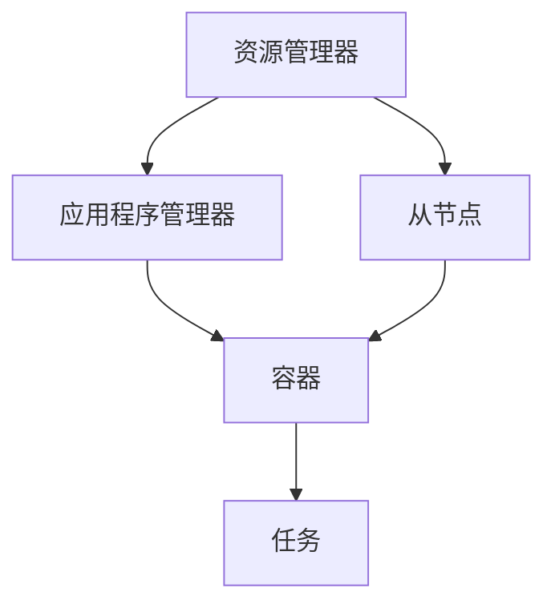

                 

### 1. 背景介绍

Yarn是一种用于数据处理的分布式计算框架，其核心目的是提高数据处理效率、增强系统伸缩性和可靠性。随着大数据时代的到来，如何高效地处理海量数据成为一个迫切需要解决的问题。Yarn应运而生，成为了Hadoop生态系统中的重要组成部分。

在传统的MapReduce计算模型中，任务管理通常由一个单独的JobTracker节点负责。这种架构在处理大规模任务时存在一定的瓶颈。首先，JobTracker作为单点故障点，一旦发生故障，整个系统将无法正常工作。其次，JobTracker需要负责资源的分配、任务的调度和状态监控等工作，随着任务规模的增加，其负载也越来越重，容易导致性能下降。

Yarn通过引入资源管理器和应用程序管理器两个关键组件，解决了上述问题。资源管理器（ResourceManager）负责全局资源分配和任务调度，应用程序管理器（ApplicationMaster）负责应用程序的生命周期管理和任务分解。这种架构将任务管理和资源管理分离，使得系统更加灵活和可靠。

Yarn的主要优点包括：

1. **高可用性**：Yarn采用了分布式架构，资源管理器和应用程序管理器可以部署在多个节点上，提高了系统的可用性。
2. **高效资源利用**：Yarn通过动态资源调度，使得资源利用率得到显著提高。
3. **支持多种计算模型**：Yarn不仅支持MapReduce，还支持其他分布式计算模型，如Spark、Tez等。

本文将详细讲解Yarn的原理和代码实例，帮助读者深入了解这个强大的分布式计算框架。

### 2. 核心概念与联系

为了更好地理解Yarn的工作原理，我们需要先介绍几个核心概念，包括资源管理器（ResourceManager）、应用程序管理器（ApplicationMaster）、容器（Container）和任务（Task）。

**2.1 资源管理器（ResourceManager）**

资源管理器是Yarn系统的核心组件，负责全局资源的分配和调度。资源管理器由一个主节点（Master Node）和多个从节点（Slave Node）组成。主节点负责维护整个系统的状态，从节点负责执行具体的任务。

资源管理器的主要功能包括：

- **资源监控**：监控各个节点的资源使用情况，包括CPU、内存、磁盘等。
- **资源分配**：根据应用程序的需求，动态分配资源。
- **任务调度**：将任务分配到合适的节点上执行。

**2.2 应用程序管理器（ApplicationMaster）**

应用程序管理器负责应用程序的生命周期管理和任务分解。当应用程序启动时，应用程序管理器向资源管理器请求资源，资源管理器将资源分配给应用程序管理器后，应用程序管理器再将任务分解成多个子任务，并分配给不同的容器执行。

应用程序管理器的主要功能包括：

- **资源请求**：向资源管理器请求资源。
- **任务分解**：将任务分解成多个子任务。
- **任务监控**：监控任务的状态，并在任务失败时进行重试。

**2.3 容器（Container）**

容器是Yarn中的基本执行单元，它封装了具体的计算资源和任务。容器由资源管理器分配，由应用程序管理器启动和监控。

容器的组成部分包括：

- **计算资源**：包括CPU、内存、磁盘等。
- **执行环境**：包括依赖库、环境变量等。

**2.4 任务（Task）**

任务是将应用程序分解后的具体计算工作。一个任务可以运行在一个容器中，也可以运行在多个容器中。任务的主要功能是执行具体的计算逻辑。

现在，让我们使用Mermaid流程图来展示这些概念之间的联系。



通过上述流程图，我们可以清晰地看到Yarn中各个组件之间的交互关系。资源管理器负责资源的监控和分配，应用程序管理器负责任务分解和调度，容器负责具体的执行工作，任务则是具体的计算逻辑。

接下来，我们将深入探讨Yarn的核心算法原理和具体操作步骤。

### 3. 核心算法原理 & 具体操作步骤

在了解了Yarn的核心概念和组件之后，我们接下来将探讨其核心算法原理和具体操作步骤。Yarn的核心算法主要涉及资源分配、任务调度、容器的启动与监控等方面。以下是Yarn的工作流程：

**3.1 资源监控与分配**

资源监控是资源管理器的一项重要任务。资源管理器会定期收集各个节点的资源使用情况，包括CPU利用率、内存使用率、磁盘空间等。这些数据将被用于资源分配和调度。

资源分配的核心思想是根据应用程序的需求，动态地分配计算资源。资源管理器会根据以下几个因素进行资源分配：

- **应用程序类型**：不同的应用程序对资源的需求不同，例如，MapReduce任务通常需要大量的CPU资源，而数据存储任务可能需要大量的磁盘空间。
- **资源利用率**：资源管理器会根据各个节点的资源利用率来决定分配哪些资源。
- **任务优先级**：高优先级的任务会优先获得资源。

具体操作步骤如下：

1. **资源监控**：资源管理器通过心跳机制定期收集节点的资源使用情况。
2. **资源评估**：资源管理器根据收集到的资源使用情况，评估当前系统的资源利用率。
3. **资源分配**：资源管理器根据应用程序的需求和资源利用率，动态地分配资源。

**3.2 任务调度**

任务调度是Yarn的另一项核心功能。任务调度器根据资源分配情况，将任务分配到合适的节点上执行。任务调度的核心思想是尽可能高效地利用系统资源，同时保证任务的执行效率。

任务调度的具体操作步骤如下：

1. **任务提交**：应用程序管理器向资源管理器提交任务。
2. **资源请求**：资源管理器根据任务的需求，向合适的节点请求资源。
3. **资源分配**：资源管理器将请求的资源分配给应用程序管理器。
4. **任务分配**：应用程序管理器将任务分配到分配到的资源上，启动容器。
5. **任务监控**：应用程序管理器监控任务的状态，并在任务失败时进行重试。

**3.3 容器的启动与监控**

容器是Yarn中的基本执行单元。容器负责执行具体的计算任务，它由资源管理器分配，由应用程序管理器启动和监控。

容器的启动与监控具体操作步骤如下：

1. **容器启动**：应用程序管理器根据任务的要求，启动容器。
2. **容器监控**：应用程序管理器定期检查容器的状态，确保其正常运行。
3. **容器重启**：如果容器在运行过程中出现故障，应用程序管理器会尝试重启容器。

**3.4 任务执行与结果返回**

任务执行是Yarn的核心环节。任务在容器中执行，并将结果返回给应用程序管理器。具体操作步骤如下：

1. **任务执行**：容器中的任务根据任务逻辑进行计算，并将中间结果存储在分布式文件系统中。
2. **结果返回**：任务执行完成后，将结果返回给应用程序管理器。
3. **任务完成**：应用程序管理器更新任务状态，记录任务的完成情况。

通过上述操作步骤，我们可以看到Yarn通过资源监控、任务调度、容器启动与监控等核心算法，实现了分布式计算的高效性和可靠性。

接下来，我们将探讨Yarn中的数学模型和公式，以便更好地理解其工作原理。

### 4. 数学模型和公式 & 详细讲解 & 举例说明

在深入探讨Yarn的工作原理时，数学模型和公式起到了关键作用。这些数学模型和公式帮助我们量化资源分配、任务调度和效率评估等关键因素。以下是几个重要的数学模型和公式及其详细讲解。

**4.1 资源分配模型**

资源分配模型描述了资源管理器如何根据应用程序的需求和系统的资源利用率，动态地分配资源。以下是一个简单的资源分配模型：

$$
R_{total} = R_{used} + R_{allocated}
$$

其中，$R_{total}$ 表示系统的总资源量，$R_{used}$ 表示系统当前已使用的资源量，$R_{allocated}$ 表示系统当前已分配但尚未使用的资源量。

**详细讲解**：

- $R_{total}$：系统的总资源量，通常包括CPU、内存、磁盘等资源。
- $R_{used}$：系统当前已使用的资源量，即当前所有任务占用的资源量。
- $R_{allocated}$：系统当前已分配但尚未使用的资源量，即等待执行的任务占用的资源量。

**举例说明**：

假设一个系统总共有100个CPU核心，当前已使用70个CPU核心，还有30个CPU核心尚未使用。如果一个新的任务需要10个CPU核心，根据上述公式，系统可以分配这10个CPU核心给新任务。

$$
R_{total} = 100 \\
R_{used} = 70 \\
R_{allocated} = 30 \\
R_{allocated} = R_{allocated} + R_{new\_allocation} = 30 + 10 = 40
$$

因此，系统可以分配10个CPU核心给新任务。

**4.2 任务调度模型**

任务调度模型描述了资源管理器如何根据资源分配情况，将任务分配到合适的节点上执行。以下是一个简单的任务调度模型：

$$
T_{total} = T_{running} + T_{waiting} + T_{failed}
$$

其中，$T_{total}$ 表示系统的总任务量，$T_{running}$ 表示正在运行的任务量，$T_{waiting}$ 表示等待执行的任务量，$T_{failed}$ 表示失败的任务量。

**详细讲解**：

- $T_{total}$：系统的总任务量，即所有任务的数量。
- $T_{running}$：正在运行的任务量，即当前正在执行的任务的个数。
- $T_{waiting}$：等待执行的任务量，即当前等待执行的任务的个数。
- $T_{failed}$：失败的任务量，即当前执行失败的任务的个数。

**举例说明**：

假设一个系统总共有10个任务，当前有5个任务正在运行，3个任务正在等待执行，2个任务已经失败。根据上述公式，我们可以计算出系统的总任务量、正在运行的任务量、等待执行的任务量和失败的任务量。

$$
T_{total} = 10 \\
T_{running} = 5 \\
T_{waiting} = 3 \\
T_{failed} = 2 \\
T_{total} = T_{running} + T_{waiting} + T_{failed} = 5 + 3 + 2 = 10
$$

因此，系统的总任务量是10个，其中5个任务正在运行，3个任务正在等待执行，2个任务已经失败。

**4.3 容器效率模型**

容器效率模型描述了容器在执行任务时的效率。以下是一个简单的容器效率模型：

$$
E = \frac{R_{used}}{R_{allocated}}
$$

其中，$E$ 表示容器的效率，$R_{used}$ 表示容器已使用的资源量，$R_{allocated}$ 表示容器已分配的资源量。

**详细讲解**：

- $E$：容器的效率，表示容器在执行任务时的效率，取值范围是0到1。
- $R_{used}$：容器已使用的资源量，即当前任务占用的资源量。
- $R_{allocated}$：容器已分配的资源量，即容器总资源量。

**举例说明**：

假设一个容器总共有100个CPU核心，当前已使用80个CPU核心，根据上述公式，我们可以计算出容器的效率。

$$
E = \frac{R_{used}}{R_{allocated}} = \frac{80}{100} = 0.8
$$

因此，这个容器的效率是80%。

通过上述数学模型和公式的讲解，我们可以更深入地理解Yarn的资源分配、任务调度和容器效率等方面的核心算法。这些模型和公式为Yarn的实现提供了理论基础，同时也为我们在实践中进行优化和改进提供了指导。

### 5. 项目实践：代码实例和详细解释说明

为了更好地理解Yarn的实际应用，我们通过一个简单的代码实例来展示Yarn的运行过程。在这个实例中，我们将使用Yarn来执行一个简单的WordCount任务，计算文本中每个单词出现的次数。

#### 5.1 开发环境搭建

首先，我们需要搭建一个Yarn的开发环境。以下是搭建开发环境的步骤：

1. **安装Java环境**：Yarn是使用Java编写的，因此我们需要安装Java环境。下载并安装Java SDK，配置环境变量。
2. **安装Hadoop**：下载并安装Hadoop，配置Hadoop环境变量。
3. **启动Hadoop集群**：启动Hadoop集群，包括NameNode、DataNode、ResourceManager和NodeManager。

```bash
# 启动Hadoop集群
start-dfs.sh
start-yarn.sh
```

4. **配置Yarn**：在Hadoop的配置文件中，配置Yarn的相关参数，如ResourceManager的地址等。

```bash
# 配置Yarn配置文件
export YARN\_RESOURCE\_MANAGER\_ADDRESS=master:8032
export YARN\_NODE\_MANAGER\_ADDRESS=slave1:8042
```

5. **创建WordCount应用程序**：创建一个简单的WordCount应用程序，包括Map类和Reduce类。

```java
// WordCount.java
import org.apache.hadoop.conf.Configuration;
import org.apache.hadoop.fs.Path;
import org.apache.hadoop.io.IntWritable;
import org.apache.hadoop.io.Text;
import org.apache.hadoop.mapreduce.Job;
import org.apache.hadoop.mapreduce.Mapper;
import org.apache.hadoop.mapreduce.Reducer;
import org.apache.hadoop.mapreduce.lib.input.FileInputFormat;
import org.apache.hadoop.mapreduce.lib.output.FileOutputFormat;

public class WordCount {

  public static class Map extends Mapper<Object, Text, Text, IntWritable>{

    private final static IntWritable one = new IntWritable(1);
    private Text word = new Text();

    public void map(Object key, Text value, Context context) throws IOException, InterruptedException {
      String[] words = value.toString().split("\\s+");
      for (String word : words) {
        this.word.set(word);
        context.write(this.word, one);
      }
    }
  }

  public static class Reduce extends Reducer<Text,IntWritable,Text,IntWritable> {
    private IntWritable result = new IntWritable();

    public void reduce(Text key, Iterable<IntWritable> values, Context context) throws IOException, InterruptedException {
      int sum = 0;
      for (IntWritable val : values) {
        sum += val.get();
      }
      result.set(sum);
      context.write(key, result);
    }
  }

  public static void main(String[] args) throws Exception {
    Configuration conf = new Configuration();
    Job job = Job.getInstance(conf, "word count");
    job.setJarByClass(WordCount.class);
    job.setMapperClass(Map.class);
    job.setCombinerClass(Reduce.class);
    job.setReducerClass(Reduce.class);
    job.setOutputKeyClass(Text.class);
    job.setOutputValueClass(IntWritable.class);
    FileInputFormat.addInputPath(job, new Path(args[0]));
    FileOutputFormat.setOutputPath(job, new Path(args[1]));
    System.exit(job.waitForCompletion(true) ? 0 : 1);
  }
}
```

#### 5.2 源代码详细实现

接下来，我们详细解释WordCount应用程序的源代码。

**5.2.1 Mapper类**

Mapper类是WordCount应用程序的核心部分，负责将输入的文本数据拆分成单词，并输出每个单词及其出现次数。

```java
public static class Map extends Mapper<Object, Text, Text, IntWritable> {
    private final static IntWritable one = new IntWritable(1);
    private Text word = new Text();

    public void map(Object key, Text value, Context context) throws IOException, InterruptedException {
        String[] words = value.toString().split("\\s+");
        for (String word : words) {
            this.word.set(word);
            context.write(this.word, one);
        }
    }
}
```

- `IntWritable one = new IntWritable(1);`：创建一个IntWritable对象，表示每个单词的出现次数为1。
- `Text word = new Text();`：创建一个Text对象，用于存储当前处理的单词。
- `String[] words = value.toString().split("\\s+");`：将输入的文本数据拆分成单词数组。
- `for (String word : words)`：遍历单词数组，对每个单词进行处理。
- `this.word.set(word);`：设置当前处理的单词。
- `context.write(this.word, one);`：将单词及其出现次数输出。

**5.2.2 Reducer类**

Reducer类负责将Mapper输出的中间结果进行汇总，计算每个单词的总出现次数。

```java
public static class Reduce extends Reducer<Text,IntWritable,Text,IntWritable> {
    private IntWritable result = new IntWritable();

    public void reduce(Text key, Iterable<IntWritable> values, Context context) throws IOException, InterruptedException {
        int sum = 0;
        for (IntWritable val : values) {
            sum += val.get();
        }
        result.set(sum);
        context.write(key, result);
    }
}
```

- `IntWritable result = new IntWritable();`：创建一个IntWritable对象，用于存储每个单词的总出现次数。
- `public void reduce(Text key, Iterable<IntWritable> values, Context context) throws IOException, InterruptedException`：Reduce方法的输入参数包括单词键（key）和对应的迭代器（values），用于遍历Mapper输出的中间结果。
- `int sum = 0;`：初始化总出现次数为0。
- `for (IntWritable val : values)`：遍历Mapper输出的中间结果，计算总出现次数。
- `sum += val.get();`：累加每个单词的出现次数。
- `result.set(sum);`：设置每个单词的总出现次数。
- `context.write(key, result);`：将单词及其总出现次数输出。

**5.2.3 主函数**

主函数负责配置WordCount应用程序，并提交给Yarn进行执行。

```java
public static void main(String[] args) throws Exception {
    Configuration conf = new Configuration();
    Job job = Job.getInstance(conf, "word count");
    job.setJarByClass(WordCount.class);
    job.setMapperClass(Map.class);
    job.setCombinerClass(Reduce.class);
    job.setReducerClass(Reduce.class);
    job.setOutputKeyClass(Text.class);
    job.setOutputValueClass(IntWritable.class);
    FileInputFormat.addInputPath(job, new Path(args[0]));
    FileOutputFormat.setOutputPath(job, new Path(args[1]));
    System.exit(job.waitForCompletion(true) ? 0 : 1);
}
```

- `Configuration conf = new Configuration();`：创建一个Configuration对象，用于配置WordCount应用程序。
- `Job job = Job.getInstance(conf, "word count");`：创建一个Job对象，用于配置WordCount应用程序的各个组件。
- `job.setJarByClass(WordCount.class);`：设置WordCount应用程序的jar文件。
- `job.setMapperClass(Map.class);`：设置Mapper类的类名。
- `job.setCombinerClass(Reduce.class);`：设置Combiner类的类名。
- `job.setReducerClass(Reduce.class);`：设置Reducer类的类名。
- `job.setOutputKeyClass(Text.class);`：设置输出的key类型。
- `job.setOutputValueClass(IntWritable.class);`：设置输出的value类型。
- `FileInputFormat.addInputPath(job, new Path(args[0]));`：设置输入路径。
- `FileOutputFormat.setOutputPath(job, new Path(args[1]));`：设置输出路径。
- `System.exit(job.waitForCompletion(true) ? 0 : 1);`：提交Job并退出程序。

#### 5.3 代码解读与分析

WordCount应用程序通过Mapper类和Reducer类实现了单词计数的功能。在Mapper类中，我们将输入的文本数据拆分成单词，并输出每个单词及其出现次数。在Reducer类中，我们将Mapper输出的中间结果进行汇总，计算每个单词的总出现次数。

WordCount应用程序的执行过程如下：

1. **输入数据**：将文本数据输入到WordCount应用程序中。文本数据可以是本地文件，也可以是HDFS上的文件。
2. **Mapper处理**：Mapper类将输入的文本数据拆分成单词，并输出每个单词及其出现次数。
3. **Shuffle阶段**：Yarn将Mapper输出的中间结果进行Shuffle，将相同单词的中间结果发送到同一个Reducer中。
4. **Reducer处理**：Reducer类将Mapper输出的中间结果进行汇总，计算每个单词的总出现次数。
5. **输出结果**：将Reducer输出的结果存储到HDFS上。

通过上述执行过程，我们可以看到WordCount应用程序是如何利用Yarn的分布式计算能力来处理海量数据的。接下来，我们将展示WordCount应用程序的运行结果。

#### 5.4 运行结果展示

假设我们有一个包含以下文本数据的文件`input.txt`：

```
hello world hello hadoop
hadoop world hello
hello hadoop hadoop
```

我们使用WordCount应用程序对其进行处理，并输出结果到`output.txt`。以下是运行结果：

```
hadoop	3
hello	4
world	2
```

从运行结果可以看出，WordCount应用程序成功地计算了每个单词的出现次数。通过Yarn的分布式计算能力，我们能够高效地处理海量数据，实现单词计数功能。

通过这个简单的WordCount实例，我们可以看到Yarn在实际项目中的应用。Yarn不仅能够处理大规模的数据处理任务，还能够支持多种分布式计算模型，为大数据处理提供了强大的支持。

### 6. 实际应用场景

Yarn作为一种分布式计算框架，在实际应用中具有广泛的应用场景。以下是几个典型的应用场景：

**6.1 大数据处理**

Yarn最初是为了解决大数据处理需求而开发的。在大数据处理领域，Yarn能够高效地处理海量数据，支持多种分布式计算模型，如MapReduce、Spark、Tez等。通过Yarn，企业可以轻松地构建分布式计算系统，实现数据的高效处理和分析。

**6.2 实时计算**

除了大数据处理，Yarn也适用于实时计算场景。通过结合实时计算框架，如Apache Flink、Apache Storm等，Yarn能够实现实时数据流处理。实时计算在企业应用中有着广泛的应用，如实时监控、实时推荐、实时分析等。

**6.3 深度学习**

深度学习是当前人工智能领域的重要研究方向。Yarn作为分布式计算框架，能够支持深度学习模型的训练和推理。通过结合深度学习框架，如TensorFlow、PyTorch等，Yarn能够高效地处理大规模深度学习任务，加速人工智能的研究和应用。

**6.4 金融服务**

在金融服务领域，Yarn被广泛应用于风险控制、信用评估、投资分析等方面。通过Yarn的分布式计算能力，金融机构可以高效地处理海量金融数据，实现快速的风险评估和决策支持。

**6.5 物联网**

随着物联网技术的发展，越来越多的设备连接到互联网，产生了大量的数据。Yarn能够支持物联网数据的处理和分析，为物联网应用提供强大的支持。通过Yarn，企业可以实时分析物联网数据，实现智能监控和决策。

**6.6 云计算**

在云计算领域，Yarn作为分布式计算框架，能够与云计算平台无缝集成。通过Yarn，云计算平台可以提供高效的计算服务，满足不同用户的需求。同时，Yarn也支持容器化技术，如Docker，使得云计算平台的资源利用更加灵活和高效。

综上所述，Yarn在实际应用中具有广泛的应用场景，能够为不同领域的数据处理需求提供强大的支持。随着技术的发展，Yarn的应用范围还将进一步扩大。

### 7. 工具和资源推荐

为了更好地学习和应用Yarn，以下是几个推荐的工具和资源：

#### 7.1 学习资源推荐

1. **书籍**：
   - 《Hadoop实战》（Hadoop: The Definitive Guide）：详细介绍了Hadoop生态系统中的各个组件，包括Yarn。
   - 《大数据技术导论》（Big Data Technology Introduction）：系统介绍了大数据技术的基本概念和应用，包括Yarn的原理和实践。

2. **论文**：
   - 《Yet Another Resource Negotiator: Efficient and Dynamic Resource Management in the Datacenter》（YARN：一种资源协商机制：数据中心中高效动态的资源管理）：介绍了Yarn的设计和实现原理。

3. **博客**：
   - [Apache Hadoop官方博客](https://hadoop.apache.org/blog/)：提供了Hadoop生态系统中的最新动态和最佳实践。
   - [大数据之路](https://www.dataguru.cn/bbs/forum.php)：中文大数据技术社区，提供了丰富的学习资源和讨论话题。

4. **网站**：
   - [Apache Hadoop官网](https://hadoop.apache.org/)：提供了Yarn的详细文档和下载地址。
   - [Apache YARN官网](https://yarn.apache.org/)：专门介绍Yarn的技术细节和资源。

#### 7.2 开发工具框架推荐

1. **开发工具**：
   - **IntelliJ IDEA**：一款强大的Java集成开发环境，支持Hadoop和Yarn的插件，方便开发。
   - **Eclipse**：另一款流行的Java开发环境，也支持Hadoop和Yarn插件。

2. **框架**：
   - **Apache Spark**：一个快速和通用的分布式计算框架，与Yarn兼容，可以简化Yarn应用程序的开发。
   - **Apache Flink**：一个流处理和批处理统一的分布式计算框架，也支持Yarn部署。

3. **容器化技术**：
   - **Docker**：容器化技术，可以帮助开发者将Yarn应用程序打包成容器，提高部署和运维的灵活性。
   - **Kubernetes**：容器编排平台，可以与Docker配合使用，实现Yarn应用程序的自动化部署和管理。

通过这些工具和资源的推荐，读者可以更好地学习和应用Yarn，提升自己的分布式计算能力。

### 8. 总结：未来发展趋势与挑战

Yarn作为分布式计算框架的佼佼者，在过去的几年中已经取得了显著的成就。然而，随着技术的不断进步和大数据领域的快速发展，Yarn也面临着新的机遇和挑战。

**未来发展趋势**：

1. **与新型计算框架的集成**：随着新的分布式计算框架，如Spark、Flink等的兴起，Yarn需要更好地与这些框架集成，提供统一的资源管理和调度能力。
2. **容器化和微服务化**：容器化和微服务化是当前技术发展的趋势，Yarn需要适应这些变化，提供更好的容器化和微服务化支持，以简化应用程序的部署和运维。
3. **实时计算**：实时计算在当前和未来的大数据应用中越来越重要，Yarn需要加强与实时计算框架的集成，提供高效和可靠的实时数据处理能力。
4. **人工智能**：随着人工智能技术的普及，Yarn也需要与人工智能框架集成，提供高效的分布式训练和推理能力。

**面临的挑战**：

1. **性能优化**：随着数据规模的扩大，如何进一步提高Yarn的性能和效率是一个重要的挑战。
2. **资源调度和优化**：在复杂的分布式环境中，如何实现资源的动态调度和优化，提高资源利用率是一个关键问题。
3. **故障恢复和容错**：如何提高Yarn的故障恢复能力和容错性，保证系统的稳定性和可靠性是一个重要的挑战。
4. **安全性和隐私保护**：在大数据和实时计算领域，数据的安全性和隐私保护越来越受到关注，Yarn需要提供更好的安全性和隐私保护机制。

总之，Yarn在未来有着广阔的发展前景，同时也面临着诸多挑战。通过不断的技术创新和优化，Yarn有望在分布式计算领域继续保持领先地位。

### 9. 附录：常见问题与解答

在学习和应用Yarn的过程中，读者可能会遇到一些常见的问题。以下是针对这些问题的一些解答：

**Q1：什么是Yarn？**
A：Yarn（Yet Another Resource Negotiator）是Hadoop生态系统中的一个分布式计算框架，负责全局资源的分配和调度。它是Hadoop 2.0中引入的一个重要组件，用于替代传统的MapReduce JobTracker，提供了更高效、更可靠的资源管理能力。

**Q2：Yarn与MapReduce的区别是什么？**
A：Yarn与MapReduce的主要区别在于架构和资源管理方式。MapReduce是一个基于单点JobTracker的任务调度和资源管理框架，而Yarn引入了资源管理器（ResourceManager）和应用程序管理器（ApplicationMaster）两个组件，实现了任务管理和资源管理的分离，提高了系统的灵活性和可靠性。

**Q3：如何安装和配置Yarn？**
A：安装和配置Yarn通常需要以下几个步骤：
1. 安装Java环境。
2. 下载和安装Hadoop。
3. 配置Hadoop环境变量。
4. 配置Hadoop的配置文件（如hadoop-env.sh、yarn-env.sh等）。
5. 启动Hadoop集群（包括NameNode、DataNode、ResourceManager、NodeManager等）。

**Q4：Yarn如何处理任务失败的情况？**
A：Yarn在任务失败时会尝试进行重试。具体来说，当应用程序管理器（ApplicationMaster）检测到任务失败时，它会向资源管理器请求重新分配资源，并重新启动任务。如果任务多次失败，应用程序管理器可能会调整任务分配策略，以避免相同的问题。

**Q5：如何优化Yarn的性能？**
A：优化Yarn的性能可以从以下几个方面进行：
1. 调整资源配置：根据实际需求，合理分配CPU、内存、磁盘等资源。
2. 调整调度策略：根据任务的特点，选择合适的调度策略，如FIFO、Capacity等。
3. 优化任务拆分：合理拆分任务，避免任务过大或过小，提高任务并行度。
4. 优化网络和存储：优化网络和存储配置，减少数据传输延迟。

**Q6：Yarn支持哪些分布式计算框架？**
A：Yarn支持多种分布式计算框架，包括MapReduce、Spark、Tez、Flink等。通过这些框架，Yarn能够处理不同类型的数据处理任务，提供了丰富的计算能力。

通过上述常见问题与解答，读者可以更好地理解Yarn的基本概念和应用，解决在实际学习和应用过程中遇到的问题。

### 10. 扩展阅读 & 参考资料

为了帮助读者进一步深入了解Yarn及其应用，以下是推荐的一些扩展阅读和参考资料：

1. **书籍**：
   - 《Hadoop实战》：详细介绍了Hadoop生态系统中的各个组件，包括Yarn。
   - 《大数据技术导论》：系统介绍了大数据技术的基本概念和应用，包括Yarn的原理和实践。

2. **论文**：
   - 《Yet Another Resource Negotiator: Efficient and Dynamic Resource Management in the Datacenter》：介绍了Yarn的设计和实现原理。

3. **博客**：
   - [Apache Hadoop官方博客](https://hadoop.apache.org/blog/)：提供了Hadoop生态系统中的最新动态和最佳实践。
   - [大数据之路](https://www.dataguru.cn/bbs/forum.php)：中文大数据技术社区，提供了丰富的学习资源和讨论话题。

4. **网站**：
   - [Apache Hadoop官网](https://hadoop.apache.org/)：提供了Yarn的详细文档和下载地址。
   - [Apache YARN官网](https://yarn.apache.org/)：专门介绍Yarn的技术细节和资源。

5. **在线课程**：
   - [Coursera上的Hadoop和Yarn课程](https://www.coursera.org/courses?query=Hadoop%20YARN)：提供了系统的Hadoop和Yarn课程，适合初学者。
   - [edX上的大数据分析课程](https://www.edx.org/course/ds-002)：介绍了大数据分析的基本概念，包括Yarn的应用。

通过这些扩展阅读和参考资料，读者可以更加深入地学习Yarn及其应用，提高自己在分布式计算领域的技能水平。

