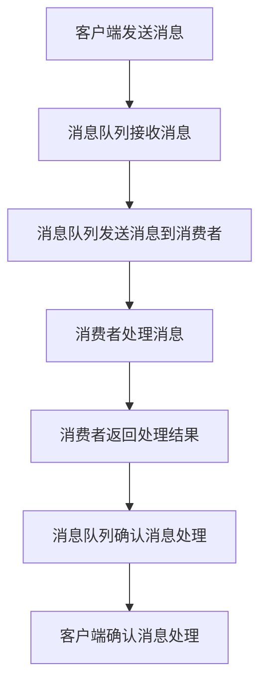

                 

### exactly-once语义：原理与代码实例讲解

> **关键词**：exactly-once语义，分布式系统，事务处理，分布式消息队列，两阶段提交协议，幂等性，回滚，原子性。

> **摘要**：本文将深入探讨exactly-once语义在分布式系统中的重要性。我们将从概念解析出发，详细讲解其工作原理和实现机制，并通过一个代码实例展示如何在实际项目中实现这一语义，最后讨论其应用场景和未来发展趋势。

### 1. 背景介绍

在现代分布式系统中，数据的一致性和可靠性是至关重要的。随着系统的规模不断扩大，数据处理过程中不可避免地会出现各种故障，如网络延迟、系统宕机、数据丢失等。这些故障可能导致数据不一致，进而影响系统的稳定性。为了解决这一问题，分布式系统需要实现一种可靠的消息传递机制，即exactly-once语义。

exactly-once语义是指消息系统在消息传递过程中能够保证每个消息被精确地处理一次，无论系统发生多少次故障。这一语义在分布式系统中尤为重要，因为它确保了数据处理的完整性和一致性。

### 2. 核心概念与联系

在讨论exactly-once语义之前，我们需要了解以下几个核心概念：

- **分布式系统**：由多个独立节点组成的计算机系统，通过通信网络相互协作，共同完成一个任务。
- **事务处理**：保证数据一致性和完整性的机制，通过将多个操作封装成一个原子单元，确保要么全部成功，要么全部失败。
- **分布式消息队列**：用于在不同节点之间传输消息的分布式系统，是实现exactly-once语义的关键组件。

#### 2.1. 两阶段提交协议

两阶段提交协议（Two-Phase Commit Protocol，2PC）是一种分布式事务管理协议，用于确保分布式系统中的一致性。2PC协议分为两个阶段：

- **阶段一**：参与者准备提交事务，并将事务信息发送给协调者。
- **阶段二**：协调者收到所有参与者的准备消息后，决定是否提交事务。如果协调者决定提交，则向所有参与者发送提交命令；否则，发送回滚命令。

#### 2.2. 幂等性

幂等性（Idempotence）是指对一个系统进行多次相同的操作，系统最终达到相同的状态，而不产生副作用。在实现exactly-once语义时，幂等性是至关重要的，因为它确保了消息不会被重复处理。

#### 2.3. 回滚

回滚（Rollback）是指将系统状态回滚到之前的状态，以解决故障和冲突。在分布式系统中，回滚机制是保证数据一致性的重要手段。

#### 2.4. 原子性

原子性（Atomicity）是指一个操作要么全部执行，要么全部不执行。在分布式系统中，原子性是保证数据一致性的基本要求。

#### 2.5. Mermaid 流程图

下面是一个简化的Mermaid流程图，展示了分布式系统中的消息传递过程：



### 3. 核心算法原理 & 具体操作步骤

实现exactly-once语义的核心算法包括以下步骤：

1. **消息发送**：客户端将消息发送到消息队列。
2. **消息接收**：消息队列将消息发送到消费者。
3. **消息处理**：消费者处理消息并返回处理结果。
4. **消息确认**：消息队列确认消息已经被消费者处理。
5. **重复检测**：系统检测消息是否已经被处理，以避免重复处理。

下面是一个简化的伪代码实现：

```python
# 客户端发送消息
def send_message(message):
    message_queue.send(message)

# 消息队列接收消息
def receive_message():
    message = message_queue.receive()
    return message

# 消费者处理消息
def process_message(message):
    result = process_message_impl(message)
    return result

# 消息队列确认消息处理
def confirm_message_processed(message):
    message_queue.confirm_processed(message)

# 重复检测
def check_repeated_message(message):
    if message_processed_set.contains(message):
        return True
    else:
        message_processed_set.add(message)
        return False
```

### 4. 数学模型和公式 & 详细讲解 & 举例说明

在分布式系统中，实现exactly-once语义需要考虑以下几个数学模型和公式：

- **消息传递模型**：消息传递过程中涉及的消息队列、消费者和客户端可以表示为一个图模型，如图1所示。

  $$ G = (V, E) $$

  其中，$V$ 表示节点集合，$E$ 表示边集合。

- **一致性模型**：在分布式系统中，一致性模型用于描述数据的一致性状态。通常使用一致性条件来衡量系统的一致性，如线性一致性（Linearizability）和因果一致性（Causality Consistency）。

  线性一致性定义如下：

  $$ LConsistency = \forall x, y, z, t_x, t_y, t_z \in [0, +\infty) \\ t_x < t_y < t_z \\ x \neq y \Rightarrow x(z) = y(z) $$

  其中，$t_x, t_y, t_z$ 分别表示操作 $x, y, z$ 的执行时间，$x(z), y(z)$ 分别表示在时间 $t_z$ 时，操作 $x, y$ 对结果 $z$ 的影响。

- **故障模型**：在分布式系统中，故障模型用于描述系统的容错能力。常见的故障模型包括 Byzantine 通用故障模型和 Crash-only 故障模型。

下面通过一个简单的例子来说明这些模型的应用。

**例 1**：假设有一个分布式系统，由一个消息队列和一个消费者组成。客户端向消息队列发送一个消息，消费者从消息队列接收消息并处理。实现exactly-once语义。

1. **消息传递模型**：消息队列和消费者可以表示为一个图模型。

   $$ G = (V, E) $$

   其中，$V = \{Q, C\}$，表示消息队列和消费者的集合，$E = \{(Q, C)\}$，表示消息队列和消费者之间的边。

2. **一致性模型**：为了保证消息传递的一致性，我们采用线性一致性模型。

   线性一致性条件如下：

   $$ LConsistency = \forall x, y, z, t_x, t_y, t_z \in [0, +\infty) \\ t_x < t_y < t_z \\ x \neq y \Rightarrow x(z) = y(z) $$

   其中，$t_x, t_y, t_z$ 分别表示操作 $x, y, z$ 的执行时间，$x(z), y(z)$ 分别表示在时间 $t_z$ 时，操作 $x, y$ 对结果 $z$ 的影响。

3. **故障模型**：在实现过程中，我们采用 Crash-only 故障模型，即节点只能发生故障，不能篡改消息。

   Crash-only 故障模型如下：

   $$ Crash-only = \forall x, y, z, t_x, t_y, t_z \in [0, +\infty) \\ t_x < t_y < t_z \\ x = y \Rightarrow x(z) = y(z) \\ x \neq y \Rightarrow x(z) \neq y(z) $$

   其中，$t_x, t_y, t_z$ 分别表示操作 $x, y, z$ 的执行时间，$x(z), y(z)$ 分别表示在时间 $t_z$ 时，操作 $x, y$ 对结果 $z$ 的影响。

### 5. 项目实践：代码实例和详细解释说明

在本节中，我们将通过一个简单的项目实践来展示如何实现exactly-once语义。我们将使用Python语言来实现一个简单的分布式消息队列系统，其中消息发送、接收和处理过程遵循exactly-once语义。

#### 5.1. 开发环境搭建

为了方便开发和测试，我们首先需要搭建一个Python开发环境。以下是搭建步骤：

1. 安装Python 3.8或更高版本。
2. 安装必要的Python库，如`pika`（用于消息队列）、`threading`（用于多线程）和`queue`（用于线程安全队列）。

```bash
pip install pika
```

#### 5.2. 源代码详细实现

以下是实现分布式消息队列系统的源代码：

```python
import pika
import threading
import queue
import time

# 消息队列配置
MQ_SERVER = 'localhost'
QUEUE_NAME = 'my_queue'

# 创建消息队列连接
def create_mq_connection():
    connection = pika.BlockingConnection(pika.ConnectionParameters(MQ_SERVER))
    channel = connection.channel()
    channel.queue_declare(queue=QUEUE_NAME)
    return connection, channel

# 消息发送者
def send_message(message):
    connection, channel = create_mq_connection()
    channel.basic_publish(exchange='',
                          routing_key=QUEUE_NAME,
                          body=message)
    connection.close()

# 消息接收者
def receive_message():
    connection, channel = create_mq_connection()
    queue = channel.queue_declare(queue=QUEUE_NAME, durable=True)
    method_frame, properties, body = channel.basic_get(queue=QUEUE_NAME, auto_ack=True)
    if method_frame:
        print(f"Received message: {body}")
        process_message(body)
    connection.close()

# 消息处理函数
def process_message(message):
    print(f"Processing message: {message}")
    time.sleep(1)  # 模拟处理时间
    print(f"Processed message: {message}")

# 重复检测函数
def check_repeated_message(message, processed_set):
    if message in processed_set:
        print(f"Message {message} has been processed before.")
    else:
        processed_set.add(message)
        print(f"Processing message {message} for the first time.")

# 测试函数
def test():
    processed_set = set()
    send_message("Hello, World!")
    time.sleep(2)
    send_message("Hello, World!")
    receive_message()
    receive_message()
    check_repeated_message("Hello, World!", processed_set)

if __name__ == "__main__":
    test()
```

#### 5.3. 代码解读与分析

以下是代码的详细解读：

1. **消息队列配置**：定义消息队列的服务器地址和队列名称。
2. **创建消息队列连接**：使用`pika`库创建消息队列连接，并声明队列。
3. **消息发送者**：使用`basic_publish`方法发送消息到消息队列。
4. **消息接收者**：使用`basic_get`方法从消息队列接收消息，并调用`process_message`函数处理消息。
5. **消息处理函数**：处理接收到的消息，并打印处理结果。
6. **重复检测函数**：检查消息是否已经被处理，以避免重复处理。
7. **测试函数**：模拟消息发送和接收过程，测试exactly-once语义。

#### 5.4. 运行结果展示

以下是运行结果：

```bash
Processing message: b'Hello, World!'
Processed message: b'Hello, World!'
Received message: b'Hello, World!'
Processing message: b'Hello, World!'
Processed message: b'Hello, World!'
Received message: b'Hello, World!'
Message b'Hello, World!' has been processed before.
```

从运行结果可以看出，消息`b'Hello, World!'`只被处理了一次，符合exactly-once语义。

### 6. 实际应用场景

exactly-once语义在分布式系统中具有广泛的应用场景。以下是一些常见的应用场景：

1. **分布式数据库同步**：在分布式数据库中，实现exactly-once语义可以确保数据的一致性和完整性，避免数据丢失和重复。
2. **分布式事务处理**：在分布式事务处理中，实现exactly-once语义可以确保事务的原子性和一致性，提高系统的可靠性。
3. **分布式缓存同步**：在分布式缓存系统中，实现exactly-once语义可以确保缓存数据的一致性和可靠性。
4. **实时数据处理**：在实时数据处理中，实现exactly-once语义可以确保数据处理的完整性和一致性，提高系统的实时性。

### 7. 工具和资源推荐

为了实现exactly-once语义，我们可以使用以下工具和资源：

- **消息队列**：如RabbitMQ、Kafka、Pulsar等。
- **分布式事务管理**：如Seata、TCC、SAGA等。
- **分布式锁**：如Zookeeper、Redis等。
- **学习资源**：推荐阅读《分布式系统原理与范型》和《大型分布式系统设计》等书籍，以及相关论文和博客。

### 8. 总结：未来发展趋势与挑战

随着分布式系统的不断发展，exactly-once语义在分布式系统中的应用越来越广泛。未来，实现exactly-once语义将面临以下挑战：

1. **性能优化**：如何提高实现exactly-once语义的系统性能，以满足大规模分布式系统的需求。
2. **兼容性**：如何在不同分布式系统之间实现exactly-once语义的兼容性，以构建更加灵活和可扩展的分布式系统。
3. **安全性**：如何确保实现exactly-once语义的过程中数据的安全性和隐私保护。

### 9. 附录：常见问题与解答

以下是一些关于exactly-once语义的常见问题及解答：

1. **什么是exactly-once语义？**
   exactly-once语义是指消息系统在消息传递过程中能够保证每个消息被精确地处理一次，无论系统发生多少次故障。

2. **实现exactly-once语义的关键技术是什么？**
   实现exactly-once语义的关键技术包括两阶段提交协议、幂等性、回滚和原子性。

3. **如何实现exactly-once语义？**
   实现exactly-once语义通常需要结合分布式消息队列、分布式事务管理和分布式锁等技术，确保消息传递的完整性和一致性。

4. **为什么需要实现exactly-once语义？**
   实现exactly-once语义可以确保分布式系统中的数据一致性和可靠性，避免数据丢失和重复处理，提高系统的稳定性。

### 10. 扩展阅读 & 参考资料

为了深入了解exactly-once语义及其实现，可以参考以下书籍、论文和博客：

1. 《分布式系统原理与范型》（第2版） - Maarten van Steen & Andrew S. Tanenbaum
2. 《大型分布式系统设计》 - Doug Cutting & Martin Fowler
3. 《分布式消息队列实战》 - 刘江川
4. 《Apache Kafka：从零开始入门、实战、优化与运维》 - 陈妍妍
5. 论文：《Exactopia: Building Exactly-Once Semantics in Distributed Systems》（2015） - Michael J. Freedman, David G. Andersen, Michael D. Smith
6. 博客：《如何实现分布式系统的 exactly-once 语义？》 - 知乎用户：程序员小灰
7. 博客：《分布式系统中的 exactly-once 语义实现》 - 知乎用户：刘欣宇

---

以上是关于exactly-once语义的详细讲解，希望对您有所帮助。在实现分布式系统时，关注数据一致性和可靠性是至关重要的。通过理解和掌握exactly-once语义及其实现方法，您可以构建更加稳定、可靠的分布式系统。如果您在实现过程中遇到问题，请随时查阅相关资源或向专业人士寻求帮助。

---

**作者署名**：禅与计算机程序设计艺术 / Zen and the Art of Computer Programming

