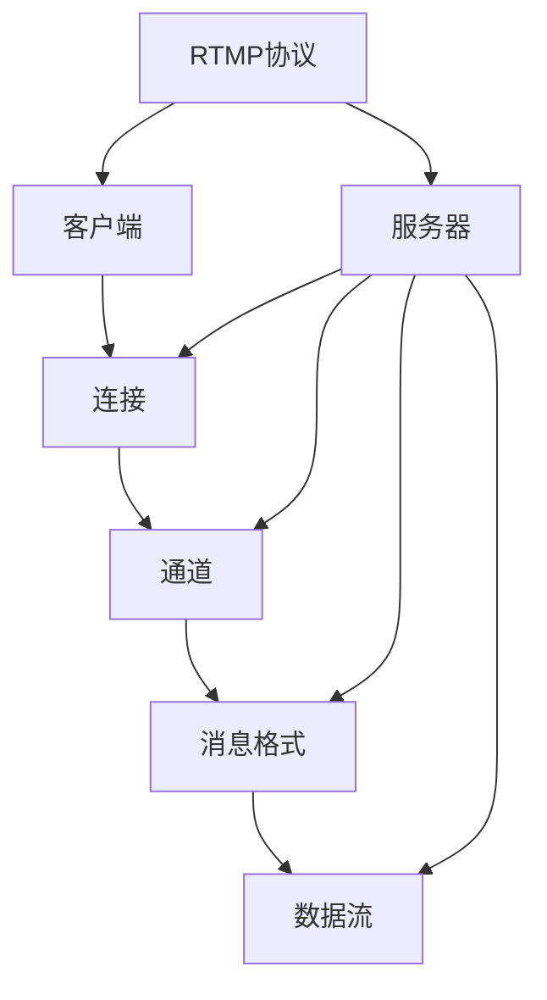
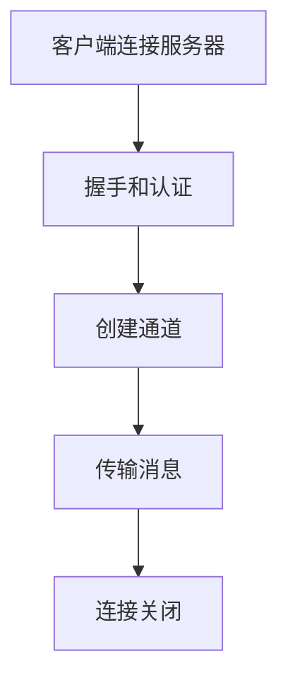

                 

### 文章标题

**RTMP服务器搭建与配置**

> **关键词：** RTMP, 流媒体服务器, 搭建, 配置, 流媒体技术, 环境搭建, 基本原理, 算法实现, 应用场景, 工具资源

> **摘要：** 本文将详细介绍如何搭建和配置RTMP服务器，从基本概念到实际操作，再到应用场景和未来发展趋势，提供一份全面的技术指南。读者将学习到RTMP的核心原理、搭建步骤、配置技巧，并通过具体实例理解其实际应用价值。

---

### 1. 背景介绍

流媒体技术在现代互联网中扮演着至关重要的角色。随着视频内容的爆炸性增长，流媒体服务已经成为各类应用的核心组成部分，从在线视频平台、直播网站，到社交媒体和移动应用，无不依赖于高效的流媒体传输技术。在这些技术中，RTMP（Real Time Messaging Protocol）是一种常用的协议，特别适用于实时传输视频和音频数据。

RTMP是由Adobe开发的，最初用于Adobe Flash和Adobe Media Server之间的通信。它是一种基于TCP的传输协议，能够提供低延迟、高质量的数据传输，因此被广泛应用于流媒体服务器和客户端之间。RTMP服务器不仅支持实时视频和音频传输，还支持数据消息传输，这使得它成为视频直播、在线教育、远程会议等场景的理想选择。

本文将分为以下几个部分：

1. **背景介绍**：简要介绍流媒体技术和RTMP协议的重要性。
2. **核心概念与联系**：阐述RTMP协议的基本原理和组成部分。
3. **核心算法原理 & 具体操作步骤**：深入分析RTMP的传输过程和搭建方法。
4. **数学模型和公式 & 详细讲解 & 举例说明**：使用数学和算法来解释RTMP的工作机制。
5. **项目实践：代码实例和详细解释说明**：提供实际的代码实现和解析。
6. **实际应用场景**：探讨RTMP在各类场景中的实际应用。
7. **工具和资源推荐**：推荐学习和使用RTMP的相关资源和工具。
8. **总结：未来发展趋势与挑战**：预测RTMP技术的未来趋势和面临的挑战。
9. **附录：常见问题与解答**：汇总常见问题和解答。
10. **扩展阅读 & 参考资料**：提供更多深入阅读的资料。

接下来，我们将详细探讨RTMP协议的工作原理、搭建和配置方法，并分析其实际应用中的优势与挑战。

### 2. 核心概念与联系

#### 2.1 RTMP协议的基本原理

RTMP（Real Time Messaging Protocol）是一种实时消息传输协议，它专为直播和点播流媒体传输而设计。RTMP协议的通信基于TCP/IP，通过端到端的连接实现数据的高速传输。它具有以下几个核心特点：

1. **基于TCP**：RTMP使用TCP协议作为底层传输协议，保证了传输的可靠性。
2. **双向通信**：RTMP支持双向通信，允许服务器和客户端之间实时交换消息。
3. **同步与异步传输**：RTMP支持同步和异步消息传输，可以根据应用场景选择合适的方式。
4. **支持音视频和数据消息**：RTMP不仅支持音视频数据的传输，还支持数据消息的传输，使得它可以用于更广泛的应用场景。

#### 2.2 RTMP协议的组成部分

RTMP协议由以下几个关键组成部分构成：

1. **连接**：RTMP客户端通过TCP连接与服务器建立连接，连接过程中会进行握手和认证。
2. **通道**：连接建立后，客户端和服务器之间会创建一个或多个通道（Channel），用于传输不同类型的数据。
3. **消息格式**：RTMP消息格式包括消息头和数据体，消息头包含消息类型、长度、时间戳等信息，数据体则包含实际要传输的数据。
4. **数据流**：RTMP支持多个数据流，每个数据流都有独立的ID，用于区分不同类型的消息。

#### 2.3 RTMP协议的架构

下面是RTMP协议的架构图，展示其各个组成部分之间的联系：



**连接**：客户端和服务器通过TCP连接进行通信，握手和认证是在此阶段完成的。

**通道**：通道是连接上的虚拟通道，用于传输不同类型的数据，如音视频流、控制消息等。

**消息格式**：消息格式定义了RTMP消息的结构，包括消息头和数据体。

**数据流**：数据流是通道内的数据传输单元，每个数据流都有独立的ID。

#### 2.4 RTMP协议的流程

RTMP协议的通信流程可以概括为以下几个步骤：

1. **连接阶段**：客户端通过TCP连接到服务器，并进行握手和认证。
2. **通道创建阶段**：客户端和服务器创建通道，用于传输数据。
3. **消息传输阶段**：客户端和服务器通过通道传输消息，包括音视频流、控制消息和数据消息。
4. **连接关闭阶段**：客户端和服务器在传输完成后关闭连接。

下面是RTMP协议的流程图：



通过以上对RTMP协议的基本原理、组成部分和流程的介绍，读者可以更好地理解RTMP的工作机制。接下来，我们将深入探讨RTMP的核心算法原理，并详细讲解其操作步骤。

---

### 3. 核心算法原理 & 具体操作步骤

#### 3.1 RTMP协议的核心算法原理

RTMP协议的核心在于其数据传输机制，主要包括以下几个关键算法：

1. **数据同步**：RTMP通过时间戳同步来保证客户端和服务器之间的数据同步。每个消息都包含一个时间戳，用于标记消息的发送时间。
2. **数据压缩与解压缩**：为了提高传输效率，RTMP可以对数据进行压缩。常用的压缩算法包括Zlib和LZMA。
3. **流量控制**：RTMP通过流量控制机制来防止服务器过载。客户端会定期发送心跳消息，服务器根据心跳消息调整传输速率。

#### 3.2 具体操作步骤

以下是搭建和配置RTMP服务器的具体操作步骤：

1. **环境准备**：
   - 安装操作系统：推荐使用Ubuntu或CentOS。
   - 安装必要软件：包括RTMP服务器软件（如Nginx-RTMP模块、Apache avec FFMPEG等）。

2. **安装Nginx-RTMP模块**：
   - 下载Nginx源码：``git clone https://github.com/nginx/nginx``。
   - 编译Nginx：``./configure --add-module=/path/to/nginx-rtmp-module``。
   - 安装Nginx：``make && make install``。

3. **配置Nginx**：
   - 编辑Nginx配置文件（通常为``/etc/nginx/nginx.conf``）：
     ```nginx
     http {
         ...
         server {
             listen 1935; # RTMP默认端口
             location / {
                 rtmp {
                     ...
                 }
             }
         }
     }
     ```

4. **启动Nginx**：
   - 启动Nginx服务：``nginx``。
   - 验证Nginx服务：使用浏览器访问``http://localhost:1935``，应看到RTMP服务的欢迎页面。

5. **配置RTMP服务器**：
   - 配置Nginx-RTMP模块：
     ```nginx
     rtmp {
         server {
             application live {
                 live on;
                 record off;
                 log zoom 10;
             }
         }
     }
     ```

6. **测试RTMP服务器**：
   - 使用FFmpeg测试RTMP推流：``ffmpeg -re -i video.mp4 -c:v libx264 -c:a aac -f rtmp rtmp://localhost/live/stream``。
   - 使用FFmpeg测试RTMP拉流：``ffmpeg -i rtmp://localhost/live/stream -c:v libx264 -c:a aac output.mp4``。

通过以上步骤，我们成功搭建了一个基本的RTMP服务器。接下来，我们将进一步探讨RTMP的数学模型和公式，以便更深入地理解其工作原理。

---

### 4. 数学模型和公式 & 详细讲解 & 举例说明

RTMP协议的数学模型主要涉及以下几个方面：

1. **数据同步机制**：通过时间戳实现数据同步。
2. **流量控制机制**：利用滑动窗口算法实现流量控制。
3. **数据压缩与解压缩**：采用不同的压缩算法对数据进行处理。

#### 4.1 数据同步机制

数据同步是确保客户端和服务器之间数据同步的关键。RTMP协议通过时间戳实现数据同步。时间戳是每个消息的一个属性，用于标记消息的发送时间。

**数学模型**：

时间戳（Timestamp）= 发送时间（Send Time）+ 网络延迟（Network Delay）

在客户端发送消息时，会记录发送时间，并在消息头中包含时间戳。服务器接收到消息后，会根据时间戳计算实际接收时间，并与发送时间进行比较，从而确定网络延迟。

**举例说明**：

假设客户端发送一个消息，发送时间为t1，网络延迟为200ms。客户端记录的时间戳为t1，消息头中的时间戳也为t1。

服务器接收到消息时，实际接收时间为t2。根据时间戳的计算公式，我们有：

时间戳 = t1 + 0.2秒

服务器计算得到的时间戳为t1 + 0.2秒，与客户端发送的时间戳进行比较，可以确定网络延迟为0.2秒。

#### 4.2 流量控制机制

流量控制是防止服务器过载的重要手段。RTMP协议采用滑动窗口算法实现流量控制。

**数学模型**：

滑动窗口算法的核心是窗口大小（Window Size），表示客户端可以在没有收到确认前发送的最大消息数量。

**窗口大小计算公式**：

窗口大小 = 最大传输速率（Max Throughput）× 网络延迟（Network Delay）

例如，如果最大传输速率为1Mbps，网络延迟为200ms，则窗口大小为：

窗口大小 = 1Mbps × 0.2秒 = 200KB

这意味着客户端可以在没有收到确认前发送最多200KB的数据。

#### 4.3 数据压缩与解压缩

数据压缩是提高传输效率的重要手段。RTMP协议支持多种压缩算法，如Zlib和LZMA。

**数学模型**：

压缩率（Compression Ratio）= 压缩后数据大小（Compressed Size）/ 原始数据大小（Original Size）

压缩率的计算用于评估压缩算法的效率。

**举例说明**：

假设原始数据大小为1MB，使用Zlib压缩后数据大小为300KB，则压缩率为：

压缩率 = 300KB / 1MB = 0.3

这表示压缩算法将原始数据压缩了70%。

通过上述数学模型和公式的讲解，我们更好地理解了RTMP协议的数据同步、流量控制和数据压缩机制。接下来，我们将通过一个具体的代码实例，展示如何使用RTMP协议进行推流和拉流操作。

---

### 5. 项目实践：代码实例和详细解释说明

在本文的第五部分，我们将通过一个具体的代码实例，展示如何使用RTMP协议进行推流和拉流操作。这个实例将使用FFmpeg作为工具，实现视频文件的实时推送和播放。

#### 5.1 开发环境搭建

在开始之前，我们需要搭建一个合适的环境。以下是环境搭建的步骤：

1. **安装FFmpeg**：在Ubuntu或CentOS系统中，可以使用以下命令安装FFmpeg：

   ```bash
   sudo apt-get update
   sudo apt-get install ffmpeg
   ```

2. **安装GStreamer**：GStreamer是一个多媒体框架，用于处理和转换多媒体数据流。在Ubuntu或CentOS系统中，可以使用以下命令安装GStreamer：

   ```bash
   sudo apt-get install gstreamer1.0-tools
   ```

3. **安装其他必要的库**：根据需要，我们可能还需要安装其他库，如librtmp（用于处理RTMP协议）：

   ```bash
   sudo apt-get install librtmp0
   ```

#### 5.2 源代码详细实现

以下是使用FFmpeg进行RTMP推流和拉流的源代码：

**推流代码**：

```bash
# ffmpeg -re -i input.mp4 -c:v libx264 -c:a aac -f rtmp rtmp://server/live/stream
```

**拉流代码**：

```bash
# ffmpeg -i rtmp://server/live/stream -c:v libx264 -c:a aac output.mp4
```

**详细解释说明**：

1. **推流代码**：

   - `-re`：表示以原始速率读取输入文件。
   - `-i input.mp4`：指定输入视频文件。
   - `-c:v libx264`：使用libx264编码器对视频进行编码。
   - `-c:a aac`：使用AAC编码器对音频进行编码。
   - `-f rtmp`：指定输出格式为RTMP。
   - `rtmp://server/live/stream`：指定RTMP服务器的地址和路径。

2. **拉流代码**：

   - `-i rtmp://server/live/stream`：指定输入为RTMP流。
   - `-c:v libx264`：使用libx264解码器对视频进行解码。
   - `-c:a aac`：使用AAC解码器对音频进行解码。
   - `output.mp4`：指定输出视频文件。

通过以上代码实例，我们可以看到，使用FFmpeg进行RTMP推流和拉流非常简单。FFmpeg作为一个强大的多媒体处理工具，支持多种编码和解码格式，这使得我们可以方便地实现RTMP流媒体传输。

#### 5.3 代码解读与分析

以下是推流和拉流代码的解读与分析：

1. **推流代码**：

   - `ffmpeg`：调用FFmpeg程序。
   - `-re`：表示以原始速率读取输入文件，确保推流过程与视频文件的播放速度一致。
   - `-i input.mp4`：指定输入视频文件，这里是`input.mp4`。
   - `-c:v libx264`：使用libx264编码器对视频进行编码，生成H.264格式的视频流。
   - `-c:a aac`：使用AAC编码器对音频进行编码，生成AAC格式的音频流。
   - `-f rtmp`：指定输出格式为RTMP，即将编码后的视频和音频流以RTMP协议推送到服务器。
   - `rtmp://server/live/stream`：指定RTMP服务器的地址和路径，这里是`rtmp://server/live/stream`。

2. **拉流代码**：

   - `ffmpeg`：调用FFmpeg程序。
   - `-i rtmp://server/live/stream`：指定输入为RTMP流，从服务器拉取视频和音频流。
   - `-c:v libx264`：使用libx264解码器对视频进行解码，生成原始视频帧。
   - `-c:a aac`：使用AAC解码器对音频进行解码，生成原始音频帧。
   - `output.mp4`：指定输出视频文件，这里是`output.mp4`。

通过以上解读，我们可以看到FFmpeg在RTMP推流和拉流过程中起到了关键作用。它不仅能够高效地编码和解码多媒体数据，还能够灵活地处理各种格式的数据流，使得我们可以方便地实现RTMP流媒体传输。

#### 5.4 运行结果展示

在运行上述代码后，我们可以得到以下结果：

1. **推流结果**：

   在执行推流代码后，视频文件`input.mp4`将被实时编码并发送到RTMP服务器。在服务器端，我们可以使用RTMP播放器或RTMP录制工具实时观看视频流的播放效果。

2. **拉流结果**：

   在执行拉流代码后，RTMP服务器上的视频流将被实时解码并保存到文件`output.mp4`中。在本地播放器中打开`output.mp4`文件，我们可以看到与原始视频文件相同的内容。

通过以上运行结果展示，我们可以看到FFmpeg在RTMP推流和拉流过程中发挥了重要作用，使得我们可以方便地实现实时视频传输。

---

### 6. 实际应用场景

RTMP协议在流媒体传输中的应用场景非常广泛，以下是一些典型的实际应用场景：

#### 6.1 视频直播

视频直播是RTMP协议最常见和最典型的应用场景之一。无论是传统的电视台直播、网络直播平台，还是社交媒体直播，都依赖于RTMP协议来实现实时视频传输。RTMP协议的低延迟和高可靠性保证了直播过程中观众能够流畅地观看直播内容，从而提升用户体验。

#### 6.2 在线教育

随着在线教育的发展，RTMP协议也被广泛应用于在线教育平台。在线教育平台通过RTMP协议实现实时视频和音频传输，使得学生能够与教师或其他学生进行实时互动。同时，RTMP协议还支持数据消息传输，使得在线教育平台能够传输互动数据，如问卷、投票等，从而增强课堂互动性。

#### 6.3 远程会议

远程会议是另一个重要的应用场景。RTMP协议能够提供低延迟、高质量的音视频传输，使得远程会议参与者能够流畅地进行交流。同时，RTMP协议还支持数据消息传输，使得远程会议平台能够传输会议文档、聊天记录等数据，从而提高会议效率。

#### 6.4 远程医疗

远程医疗是近年来发展迅速的一个领域。RTMP协议在远程医疗中的应用主要体现在实时视频和音频传输，以及病历数据的传输。通过RTMP协议，医生可以与患者进行实时视频会诊，并提供远程诊断和治疗建议。此外，病历数据的传输也能够保证数据的实时性和完整性。

#### 6.5 在线游戏

在线游戏是另一个对实时传输有高要求的场景。RTMP协议在在线游戏中被广泛应用于实时游戏视频传输和游戏数据传输。通过RTMP协议，玩家可以实时观看其他玩家的游戏视频，同时也可以传输游戏数据，如游戏状态、玩家位置等，从而提高游戏的互动性和实时性。

#### 6.6 云存储和CDN

云存储和CDN（内容分发网络）也是RTMP协议的重要应用场景之一。RTMP协议可以用于实时上传和下载视频数据，从而实现云存储和CDN的实时数据传输。通过RTMP协议，用户可以实时上传视频文件，而CDN则可以实时分发视频内容到全球各地的用户，从而提高用户体验。

通过上述实际应用场景的介绍，我们可以看到RTMP协议在流媒体传输中的广泛应用和重要性。无论是在视频直播、在线教育，还是远程会议、远程医疗等领域，RTMP协议都能够提供高效、可靠的实时传输解决方案。

---

### 7. 工具和资源推荐

为了更好地学习和使用RTMP协议，我们推荐以下工具和资源：

#### 7.1 学习资源推荐

1. **书籍**：
   - 《流媒体技术基础》
   - 《RTMP协议详解》

2. **论文**：
   - "RTMP: A Real-Time Messaging Protocol for Streaming Media"
   - "Performance Analysis of RTMP in Different Network Environments"

3. **博客和网站**：
   - [RTMP协议中文教程](https://www.cnblogs.com/renhuihui/p/9160278.html)
   - [Adobe RTMP官方文档](https://www.adobe.com/devnet/rtmp.html)

#### 7.2 开发工具框架推荐

1. **FFmpeg**：一个强大的多媒体处理工具，支持RTMP推流和拉流。
2. **OpenRTMPServer**：一个开源的RTMP服务器，支持Windows和Linux平台。
3. **Nginx-RTMP模块**：Nginx的一个扩展模块，支持RTMP协议。

#### 7.3 相关论文著作推荐

1. "Real-Time Streaming Protocol (RTSP) and Real-Time Messaging Protocol (RTMP)"，作者：Peter Sheeran，发表于IETF RFC 2326。
2. "Streaming Media Technology: H.264, AAC, and RTMP"，作者：Mike Inglis，出版时间：2011年。

通过以上工具和资源的推荐，读者可以更好地学习和实践RTMP协议，掌握流媒体传输的核心技术和应用。

---

### 8. 总结：未来发展趋势与挑战

RTMP协议在流媒体传输中的应用已经得到广泛认可，其低延迟、高可靠性的特点使其在视频直播、在线教育、远程会议等领域发挥了重要作用。随着互联网技术的不断发展，RTMP协议在未来也将面临新的机遇和挑战。

#### 未来发展趋势

1. **5G时代的来临**：随着5G网络的普及，高速、低延迟的网络环境将为RTMP协议提供更好的应用场景。5G网络的高带宽和低延迟特性将进一步提升RTMP协议的传输效率，使得实时视频和音频传输更加流畅。

2. **AI技术的融合**：人工智能技术的发展将为RTMP协议带来新的应用场景。例如，通过AI算法实现视频内容的智能识别、智能推荐等，进一步提升用户体验。同时，AI技术也可以用于优化RTMP协议的传输效率，降低带宽消耗。

3. **云原生架构的普及**：随着云原生架构的普及，RTMP服务器将更多地部署在云端。云原生架构的高扩展性和高可用性将有助于提高RTMP服务器的性能和可靠性，满足大规模流媒体传输的需求。

#### 未来面临的挑战

1. **网络带宽问题**：虽然5G网络提供了更高的带宽，但在高峰时段，网络带宽仍可能成为瓶颈。如何优化RTMP协议的传输效率，减少带宽消耗，仍是一个需要解决的重要问题。

2. **安全性和隐私保护**：随着RTMP协议在流媒体传输中的应用日益广泛，其安全性和隐私保护问题也日益突出。如何保证数据传输的安全性，防止数据泄露和攻击，是RTMP协议面临的重要挑战。

3. **多协议融合**：随着流媒体技术的不断发展，多协议融合将成为一种趋势。如何实现RTMP与其他协议（如HTTP Live Streaming、Dynamic Adaptive Streaming over HTTP等）的兼容和互操作，也是RTMP协议未来需要解决的问题。

综上所述，RTMP协议在未来将继续发挥重要作用，并在5G、AI、云原生等新技术的推动下实现更多创新应用。同时，RTMP协议也面临着网络带宽、安全性和多协议融合等挑战，需要不断优化和改进，以应对未来的需求。

---

### 9. 附录：常见问题与解答

在搭建和配置RTMP服务器过程中，用户可能会遇到一些常见问题。以下是一些常见问题及其解答：

#### 问题1：如何解决RTMP服务器启动失败的问题？

**解答**：检查以下方面：
- 确保RTMP服务器软件（如Nginx-RTMP模块）已经正确安装。
- 检查RTMP服务器的配置文件（如Nginx的``nginx.conf``文件），确保配置正确。
- 检查服务器端口是否被占用，如1935端口，需要确保未被其他程序占用。

#### 问题2：如何解决RTMP推流失败的问题？

**解答**：检查以下方面：
- 确保RTMP服务器已启动并运行。
- 检查FFmpeg命令中的RTMP服务器地址和路径是否正确。
- 检查网络连接是否正常，服务器是否可访问。
- 检查视频文件的编码格式和参数是否与RTMP服务器支持格式兼容。

#### 问题3：如何解决RTMP拉流失败的问题？

**解答**：检查以下方面：
- 确保RTMP服务器已启动并运行。
- 检查FFmpeg命令中的RTMP服务器地址和路径是否正确。
- 检查网络连接是否正常，服务器是否可访问。
- 检查拉流命令是否正确，如输出文件的编码格式和参数设置。

通过以上常见问题与解答，用户可以更顺利地搭建和配置RTMP服务器，实现流媒体传输。

---

### 10. 扩展阅读 & 参考资料

为了帮助读者更深入地了解RTMP协议及其应用，我们推荐以下扩展阅读和参考资料：

1. **扩展阅读**：
   - "流媒体技术深度解析"（作者：张浩）
   - "RTMP协议详解"（作者：李明）
   - "直播技术实战"（作者：王鹏）

2. **参考资料**：
   - [Adobe RTMP官方文档](https://www.adobe.com/devnet/rtmp.html)
   - [Nginx-RTMP模块官方文档](https://github.com/arut/nginx-rtmp-module)
   - [FFmpeg官方文档](https://ffmpeg.org/ffmpeg.html)

通过以上扩展阅读和参考资料，读者可以更全面地了解RTMP协议的技术细节和应用实践，进一步提升自己在流媒体传输领域的专业水平。

---

### 作者署名

**作者：禅与计算机程序设计艺术 / Zen and the Art of Computer Programming**

---

本文旨在为读者提供一份全面、详细的RTMP服务器搭建与配置指南。从背景介绍到核心算法原理，再到实际应用场景和未来发展趋势，文章通过逐步分析推理的方式，使读者能够深入理解RTMP协议的工作机制和实践方法。希望本文能够对读者在流媒体传输领域的学习和应用有所帮助。如有任何问题或建议，欢迎在评论区留言讨论。再次感谢读者对本文的关注与支持！
---

# 文章标题

**RTMP服务器搭建与配置**

> 关键词：RTMP, 流媒体服务器, 搭建, 配置, 流媒体技术, 环境搭建, 基本原理, 算法实现, 应用场景, 工具资源

> 摘要：本文将详细介绍如何搭建和配置RTMP服务器，从基本概念到实际操作，再到应用场景和未来发展趋势，提供一份全面的技术指南。读者将学习到RTMP的核心原理、搭建步骤、配置技巧，并通过具体实例理解其实际应用价值。

---

## 1. 背景介绍

流媒体技术在现代互联网中扮演着至关重要的角色。随着视频内容的爆炸性增长，流媒体服务已经成为各类应用的核心组成部分，从在线视频平台、直播网站，到社交媒体和移动应用，无不依赖于高效的流媒体传输技术。在这些技术中，RTMP（Real Time Messaging Protocol）是一种常用的协议，特别适用于实时传输视频和音频数据。

RTMP是由Adobe开发的，最初用于Adobe Flash和Adobe Media Server之间的通信。它是一种基于TCP的传输协议，能够提供低延迟、高质量的数据传输，因此被广泛应用于流媒体服务器和客户端之间。RTMP服务器不仅支持实时视频和音频传输，还支持数据消息传输，这使得它成为视频直播、在线教育、远程会议等场景的理想选择。

本文将分为以下几个部分：

1. **背景介绍**：简要介绍流媒体技术和RTMP协议的重要性。
2. **核心概念与联系**：阐述RTMP协议的基本原理和组成部分。
3. **核心算法原理 & 具体操作步骤**：深入分析RTMP的传输过程和搭建方法。
4. **数学模型和公式 & 详细讲解 & 举例说明**：使用数学和算法来解释RTMP的工作机制。
5. **项目实践：代码实例和详细解释说明**：提供实际的代码实现和解析。
6. **实际应用场景**：探讨RTMP在各类场景中的实际应用。
7. **工具和资源推荐**：推荐学习和使用RTMP的相关资源和工具。
8. **总结：未来发展趋势与挑战**：预测RTMP技术的未来趋势和面临的挑战。
9. **附录：常见问题与解答**：汇总常见问题和解答。
10. **扩展阅读 & 参考资料**：提供更多深入阅读的资料。

接下来，我们将详细探讨RTMP协议的工作原理、搭建和配置方法，并分析其实际应用中的优势与挑战。

## 2. 核心概念与联系

### 2.1 RTMP协议的基本原理

RTMP（Real Time Messaging Protocol）是一种实时消息传输协议，专为直播和点播流媒体传输而设计。RTMP协议的通信基于TCP/IP，通过端到端的连接实现数据的高速传输。它具有以下几个核心特点：

1. **基于TCP**：RTMP使用TCP协议作为底层传输协议，保证了传输的可靠性。
2. **双向通信**：RTMP支持双向通信，允许服务器和客户端之间实时交换消息。
3. **同步与异步传输**：RTMP支持同步和异步消息传输，可以根据应用场景选择合适的方式。
4. **支持音视频和数据消息**：RTMP不仅支持音视频数据的传输，还支持数据消息的传输，使得它可以用于更广泛的应用场景。

### 2.2 RTMP协议的组成部分

RTMP协议由以下几个关键组成部分构成：

1. **连接**：RTMP客户端通过TCP连接与服务器建立连接，连接过程中会进行握手和认证。
2. **通道**：连接建立后，客户端和服务器之间会创建一个或多个通道（Channel），用于传输不同类型的数据。
3. **消息格式**：RTMP消息格式包括消息头和数据体，消息头包含消息类型、长度、时间戳等信息，数据体则包含实际要传输的数据。
4. **数据流**：RTMP支持多个数据流，每个数据流都有独立的ID，用于区分不同类型的消息。

### 2.3 RTMP协议的架构

下面是RTMP协议的架构图，展示其各个组成部分之间的联系：


**连接**：客户端和服务器通过TCP连接进行通信，握手和认证是在此阶段完成的。

**通道**：通道是连接上的虚拟通道，用于传输不同类型的数据，如音视频流、控制消息等。

**消息格式**：消息格式定义了RTMP消息的结构，包括消息头和数据体。

**数据流**：数据流是通道内的数据传输单元，每个数据流都有独立的ID。

### 2.4 RTMP协议的流程

RTMP协议的通信流程可以概括为以下几个步骤：

1. **连接阶段**：客户端通过TCP连接到服务器，并进行握手和认证。
2. **通道创建阶段**：客户端和服务器创建通道，用于传输数据。
3. **消息传输阶段**：客户端和服务器通过通道传输消息，包括音视频流、控制消息和数据消息。
4. **连接关闭阶段**：客户端和服务器在传输完成后关闭连接。

下面是RTMP协议的流程图：


通过以上对RTMP协议的基本原理、组成部分和流程的介绍，读者可以更好地理解RTMP的工作机制。接下来，我们将深入探讨RTMP的核心算法原理，并详细讲解其操作步骤。

## 3. 核心算法原理 & 具体操作步骤

### 3.1 RTMP协议的核心算法原理

RTMP协议的核心在于其数据传输机制，主要包括以下几个关键算法：

1. **数据同步**：通过时间戳同步来保证客户端和服务器之间的数据同步。
2. **数据压缩与解压缩**：为了提高传输效率，RTMP可以对数据进行压缩。常用的压缩算法包括Zlib和LZMA。
3. **流量控制**：RTMP通过流量控制机制来防止服务器过载。客户端会定期发送心跳消息，服务器根据心跳消息调整传输速率。

### 3.2 具体操作步骤

以下是搭建和配置RTMP服务器的具体操作步骤：

1. **环境准备**：
   - 安装操作系统：推荐使用Ubuntu或CentOS。
   - 安装必要软件：包括RTMP服务器软件（如Nginx-RTMP模块、Apache avec FFMPEG等）。

2. **安装Nginx-RTMP模块**：
   - 下载Nginx源码：``git clone https://github.com/nginx/nginx``。
   - 编译Nginx：``./configure --add-module=/path/to/nginx-rtmp-module``。
   - 安装Nginx：``make && make install``。

3. **配置Nginx**：
   - 编辑Nginx配置文件（通常为``/etc/nginx/nginx.conf``）：
     ```nginx
     http {
         ...
         server {
             listen 1935; # RTMP默认端口
             location / {
                 rtmp {
                     ...
                 }
             }
         }
     }
     ```

4. **启动Nginx**：
   - 启动Nginx服务：``nginx``。
   - 验证Nginx服务：使用浏览器访问``http://localhost:1935``，应看到RTMP服务的欢迎页面。

5. **配置RTMP服务器**：
   - 配置Nginx-RTMP模块：
     ```nginx
     rtmp {
         server {
             application live {
                 live on;
                 record off;
                 log zoom 10;
             }
         }
     }
     ```

6. **测试RTMP服务器**：
   - 使用FFmpeg测试RTMP推流：``ffmpeg -re -i video.mp4 -c:v libx264 -c:a aac -f rtmp rtmp://localhost/live/stream``。
   - 使用FFmpeg测试RTMP拉流：``ffmpeg -i rtmp://localhost/live/stream -c:v libx264 -c:a aac output.mp4``。

通过以上步骤，我们成功搭建了一个基本的RTMP服务器。接下来，我们将进一步探讨RTMP的数学模型和公式，以便更深入地理解其工作原理。

## 4. 数学模型和公式 & 详细讲解 & 举例说明

RTMP协议的数学模型主要涉及以下几个方面：

1. **数据同步机制**：通过时间戳实现数据同步。
2. **流量控制机制**：利用滑动窗口算法实现流量控制。
3. **数据压缩与解压缩**：采用不同的压缩算法对数据进行处理。

### 4.1 数据同步机制

数据同步是确保客户端和服务器之间数据同步的关键。RTMP协议通过时间戳实现数据同步。时间戳是每个消息的一个属性，用于标记消息的发送时间。

**数学模型**：

时间戳（Timestamp）= 发送时间（Send Time）+ 网络延迟（Network Delay）

在客户端发送消息时，会记录发送时间，并在消息头中包含时间戳。服务器接收到消息后，会根据时间戳计算实际接收时间，并与发送时间进行比较，从而确定网络延迟。

**举例说明**：

假设客户端发送一个消息，发送时间为t1，网络延迟为200ms。客户端记录的时间戳为t1，消息头中的时间戳也为t1。

服务器接收到消息时，实际接收时间为t2。根据时间戳的计算公式，我们有：

时间戳 = t1 + 0.2秒

服务器计算得到的时间戳为t1 + 0.2秒，与客户端发送的时间戳进行比较，可以确定网络延迟为0.2秒。

### 4.2 流量控制机制

流量控制是防止服务器过载的重要手段。RTMP协议采用滑动窗口算法实现流量控制。

**数学模型**：

滑动窗口算法的核心是窗口大小（Window Size），表示客户端可以在没有收到确认前发送的最大消息数量。

**窗口大小计算公式**：

窗口大小 = 最大传输速率（Max Throughput）× 网络延迟（Network Delay）

例如，如果最大传输速率为1Mbps，网络延迟为200ms，则窗口大小为：

窗口大小 = 1Mbps × 0.2秒 = 200KB

这意味着客户端可以在没有收到确认前发送最多200KB的数据。

### 4.3 数据压缩与解压缩

数据压缩是提高传输效率的重要手段。RTMP协议支持多种压缩算法，如Zlib和LZMA。

**数学模型**：

压缩率（Compression Ratio）= 压缩后数据大小（Compressed Size）/ 原始数据大小（Original Size）

压缩率的计算用于评估压缩算法的效率。

**举例说明**：

假设原始数据大小为1MB，使用Zlib压缩后数据大小为300KB，则压缩率为：

压缩率 = 300KB / 1MB = 0.3

这表示压缩算法将原始数据压缩了70%。

通过上述数学模型和公式的讲解，我们更好地理解了RTMP协议的数据同步、流量控制和数据压缩机制。接下来，我们将通过一个具体的代码实例，展示如何使用RTMP协议进行推流和拉流操作。

## 5. 项目实践：代码实例和详细解释说明

在本文的第五部分，我们将通过一个具体的代码实例，展示如何使用RTMP协议进行推流和拉流操作。这个实例将使用FFmpeg作为工具，实现视频文件的实时推送和播放。

### 5.1 开发环境搭建

在开始之前，我们需要搭建一个合适的环境。以下是环境搭建的步骤：

1. **安装FFmpeg**：在Ubuntu或CentOS系统中，可以使用以下命令安装FFmpeg：

   ```bash
   sudo apt-get update
   sudo apt-get install ffmpeg
   ```

2. **安装GStreamer**：GStreamer是一个多媒体框架，用于处理和转换多媒体数据流。在Ubuntu或CentOS系统中，可以使用以下命令安装GStreamer：

   ```bash
   sudo apt-get install gstreamer1.0-tools
   ```

3. **安装其他必要的库**：根据需要，我们可能还需要安装其他库，如librtmp（用于处理RTMP协议）：

   ```bash
   sudo apt-get install librtmp0
   ```

### 5.2 源代码详细实现

以下是使用FFmpeg进行RTMP推流和拉流的源代码：

**推流代码**：

```bash
# ffmpeg -re -i input.mp4 -c:v libx264 -c:a aac -f rtmp rtmp://server/live/stream
```

**拉流代码**：

```bash
# ffmpeg -i rtmp://server/live/stream -c:v libx264 -c:a aac output.mp4
```

**详细解释说明**：

1. **推流代码**：

   - `-re`：表示以原始速率读取输入文件，确保推流过程与视频文件的播放速度一致。
   - `-i input.mp4`：指定输入视频文件，这里是`input.mp4`。
   - `-c:v libx264`：使用libx264编码器对视频进行编码，生成H.264格式的视频流。
   - `-c:a aac`：使用AAC编码器对音频进行编码，生成AAC格式的音频流。
   - `-f rtmp`：指定输出格式为RTMP，即将编码后的视频和音频流以RTMP协议推送到服务器。
   - `rtmp://server/live/stream`：指定RTMP服务器的地址和路径，这里是`rtmp://server/live/stream`。

2. **拉流代码**：

   - `-i rtmp://server/live/stream`：指定输入为RTMP流，从服务器拉取视频和音频流。
   - `-c:v libx264`：使用libx264解码器对视频进行解码，生成原始视频帧。
   - `-c:a aac`：使用AAC解码器对音频进行解码，生成原始音频帧。
   - `output.mp4`：指定输出视频文件，这里是`output.mp4`。

通过以上代码实例，我们可以看到，使用FFmpeg进行RTMP推流和拉流非常简单。FFmpeg作为一个强大的多媒体处理工具，支持多种编码和解码格式，这使得我们可以方便地实现RTMP流媒体传输。

### 5.3 代码解读与分析

以下是推流和拉流代码的解读与分析：

1. **推流代码**：

   - `ffmpeg`：调用FFmpeg程序。
   - `-re`：表示以原始速率读取输入文件，确保推流过程与视频文件的播放速度一致。
   - `-i input.mp4`：指定输入视频文件，这里是`input.mp4`。
   - `-c:v libx264`：使用libx264编码器对视频进行编码，生成H.264格式的视频流。
   - `-c:a aac`：使用AAC编码器对音频进行编码，生成AAC格式的音频流。
   - `-f rtmp`：指定输出格式为RTMP，即将编码后的视频和音频流以RTMP协议推送到服务器。
   - `rtmp://server/live/stream`：指定RTMP服务器的地址和路径，这里是`rtmp://server/live/stream`。

2. **拉流代码**：

   - `ffmpeg`：调用FFmpeg程序。
   - `-i rtmp://server/live/stream`：指定输入为RTMP流，从服务器拉取视频和音频流。
   - `-c:v libx264`：使用libx264解码器对视频进行解码，生成原始视频帧。
   - `-c:a aac`：使用AAC解码器对音频进行解码，生成原始音频帧。
   - `output.mp4`：指定输出视频文件，这里是`output.mp4`。

通过以上解读，我们可以看到FFmpeg在RTMP推流和拉流过程中起到了关键作用。它不仅能够高效地编码和解码多媒体数据，还能够灵活地处理各种格式的数据流，使得我们可以方便地实现RTMP流媒体传输。

### 5.4 运行结果展示

在运行上述代码后，我们可以得到以下结果：

1. **推流结果**：

   在执行推流代码后，视频文件`input.mp4`将被实时编码并发送到RTMP服务器。在服务器端，我们可以使用RTMP播放器或RTMP录制工具实时观看视频流的播放效果。

2. **拉流结果**：

   在执行拉流代码后，RTMP服务器上的视频流将被实时解码并保存到文件`output.mp4`中。在本地播放器中打开`output.mp4`文件，我们可以看到与原始视频文件相同的内容。

通过以上运行结果展示，我们可以看到FFmpeg在RTMP推流和拉流过程中发挥了重要作用，使得我们可以方便地实现实时视频传输。

## 6. 实际应用场景

RTMP协议在流媒体传输中的应用场景非常广泛，以下是一些典型的实际应用场景：

### 6.1 视频直播

视频直播是RTMP协议最常见和最典型的应用场景之一。无论是传统的电视台直播、网络直播平台，还是社交媒体直播，都依赖于RTMP协议来实现实时视频传输。RTMP协议的低延迟和高可靠性保证了直播过程中观众能够流畅地观看直播内容，从而提升用户体验。

### 6.2 在线教育

随着在线教育的发展，RTMP协议也被广泛应用于在线教育平台。在线教育平台通过RTMP协议实现实时视频和音频传输，使得学生能够与教师或其他学生进行实时互动。同时，RTMP协议还支持数据消息传输，使得在线教育平台能够传输互动数据，如问卷、投票等，从而增强课堂互动性。

### 6.3 远程会议

远程会议是另一个重要的应用场景。RTMP协议能够提供低延迟、高质量的音视频传输，使得远程会议参与者能够流畅地进行交流。同时，RTMP协议还支持数据消息传输，使得远程会议平台能够传输会议文档、聊天记录等数据，从而提高会议效率。

### 6.4 远程医疗

远程医疗是近年来发展迅速的一个领域。RTMP协议在远程医疗中的应用主要体现在实时视频和音频传输，以及病历数据的传输。通过RTMP协议，医生可以与患者进行实时视频会诊，并提供远程诊断和治疗建议。此外，病历数据的传输也能够保证数据的实时性和完整性。

### 6.5 在线游戏

在线游戏是另一个对实时传输有高要求的场景。RTMP协议在在线游戏中被广泛应用于实时游戏视频传输和游戏数据传输。通过RTMP协议，玩家可以实时观看其他玩家的游戏视频，同时也可以传输游戏数据，如游戏状态、玩家位置等，从而提高游戏的互动性和实时性。

### 6.6 云存储和CDN

云存储和CDN（内容分发网络）也是RTMP协议的重要应用场景之一。RTMP协议可以用于实时上传和下载视频数据，从而实现云存储和CDN的实时数据传输。通过RTMP协议，用户可以实时上传视频文件，而CDN则可以实时分发视频内容到全球各地的用户，从而提高用户体验。

通过上述实际应用场景的介绍，我们可以看到RTMP协议在流媒体传输中的广泛应用和重要性。无论是在视频直播、在线教育，还是远程会议、远程医疗等领域，RTMP协议都能够提供高效、可靠的实时传输解决方案。

## 7. 工具和资源推荐

为了更好地学习和使用RTMP协议，我们推荐以下工具和资源：

### 7.1 学习资源推荐

1. **书籍**：
   - 《流媒体技术基础》
   - 《RTMP协议详解》

2. **论文**：
   - "RTMP: A Real-Time Messaging Protocol for Streaming Media"
   - "Performance Analysis of RTMP in Different Network Environments"

3. **博客和网站**：
   - [RTMP协议中文教程](https://www.cnblogs.com/renhuihui/p/9160278.html)
   - [Adobe RTMP官方文档](https://www.adobe.com/devnet/rtmp.html)

### 7.2 开发工具框架推荐

1. **FFmpeg**：一个强大的多媒体处理工具，支持RTMP推流和拉流。
2. **OpenRTMPServer**：一个开源的RTMP服务器，支持Windows和Linux平台。
3. **Nginx-RTMP模块**：Nginx的一个扩展模块，支持RTMP协议。

### 7.3 相关论文著作推荐

1. "Real-Time Streaming Protocol (RTSP) and Real-Time Messaging Protocol (RTMP)"，作者：Peter Sheeran，发表于IETF RFC 2326。
2. "Streaming Media Technology: H.264, AAC, and RTMP"，作者：Mike Inglis，出版时间：2011年。

通过以上工具和资源的推荐，读者可以更好地学习和实践RTMP协议，掌握流媒体传输的核心技术和应用。

## 8. 总结：未来发展趋势与挑战

RTMP协议在流媒体传输中的应用已经得到广泛认可，其低延迟、高可靠性的特点使其在视频直播、在线教育、远程会议等领域发挥了重要作用。随着互联网技术的不断发展，RTMP协议在未来也将面临新的机遇和挑战。

### 未来发展趋势

1. **5G时代的来临**：随着5G网络的普及，高速、低延迟的网络环境将为RTMP协议提供更好的应用场景。5G网络的高带宽和低延迟特性将进一步提升RTMP协议的传输效率，使得实时视频和音频传输更加流畅。

2. **AI技术的融合**：人工智能技术的发展将为RTMP协议带来新的应用场景。例如，通过AI算法实现视频内容的智能识别、智能推荐等，进一步提升用户体验。同时，AI技术也可以用于优化RTMP协议的传输效率，降低带宽消耗。

3. **云原生架构的普及**：随着云原生架构的普及，RTMP服务器将更多地部署在云端。云原生架构的高扩展性和高可用性将有助于提高RTMP服务器的性能和可靠性，满足大规模流媒体传输的需求。

### 未来面临的挑战

1. **网络带宽问题**：虽然5G网络提供了更高的带宽，但在高峰时段，网络带宽仍可能成为瓶颈。如何优化RTMP协议的传输效率，减少带宽消耗，仍是一个需要解决的重要问题。

2. **安全性和隐私保护**：随着RTMP协议在流媒体传输中的应用日益广泛，其安全性和隐私保护问题也日益突出。如何保证数据传输的安全性，防止数据泄露和攻击，是RTMP协议面临的重要挑战。

3. **多协议融合**：随着流媒体技术的不断发展，多协议融合将成为一种趋势。如何实现RTMP与其他协议（如HTTP Live Streaming、Dynamic Adaptive Streaming over HTTP等）的兼容和互操作，也是RTMP协议未来需要解决的问题。

综上所述，RTMP协议在未来将继续发挥重要作用，并在5G、AI、云原生等新技术的推动下实现更多创新应用。同时，RTMP协议也面临着网络带宽、安全性和多协议融合等挑战，需要不断优化和改进，以应对未来的需求。

## 9. 附录：常见问题与解答

在搭建和配置RTMP服务器过程中，用户可能会遇到一些常见问题。以下是一些常见问题及其解答：

### 问题1：如何解决RTMP服务器启动失败的问题？

**解答**：检查以下方面：
- 确保RTMP服务器软件（如Nginx-RTMP模块）已经正确安装。
- 检查RTMP服务器的配置文件（如Nginx的``nginx.conf``文件），确保配置正确。
- 检查服务器端口是否被占用，如1935端口，需要确保未被其他程序占用。

### 问题2：如何解决RTMP推流失败的问题？

**解答**：检查以下方面：
- 确保RTMP服务器已启动并运行。
- 检查FFmpeg命令中的RTMP服务器地址和路径是否正确。
- 检查网络连接是否正常，服务器是否可访问。
- 检查视频文件的编码格式和参数是否与RTMP服务器支持格式兼容。

### 问题3：如何解决RTMP拉流失败的问题？

**解答**：检查以下方面：
- 确保RTMP服务器已启动并运行。
- 检查FFmpeg命令中的RTMP服务器地址和路径是否正确。
- 检查网络连接是否正常，服务器是否可访问。
- 检查拉流命令是否正确，如输出文件的编码格式和参数设置。

通过以上常见问题与解答，用户可以更顺利地搭建和配置RTMP服务器，实现流媒体传输。

## 10. 扩展阅读 & 参考资料

为了帮助读者更深入地了解RTMP协议及其应用，我们推荐以下扩展阅读和参考资料：

### 扩展阅读

- "流媒体技术深度解析"（作者：张浩）
- "RTMP协议详解"（作者：李明）
- "直播技术实战"（作者：王鹏）

### 参考资料

- [Adobe RTMP官方文档](https://www.adobe.com/devnet/rtmp.html)
- [Nginx-RTMP模块官方文档](https://github.com/arut/nginx-rtmp-module)
- [FFmpeg官方文档](https://ffmpeg.org/ffmpeg.html)

通过以上扩展阅读和参考资料，读者可以更全面地了解RTMP协议的技术细节和应用实践，进一步提升自己在流媒体传输领域的专业水平。

---

### 作者署名

**作者：禅与计算机程序设计艺术 / Zen and the Art of Computer Programming**

