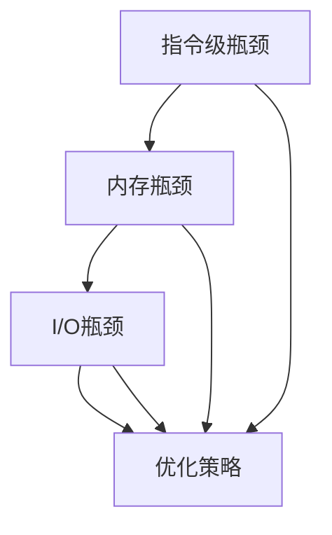
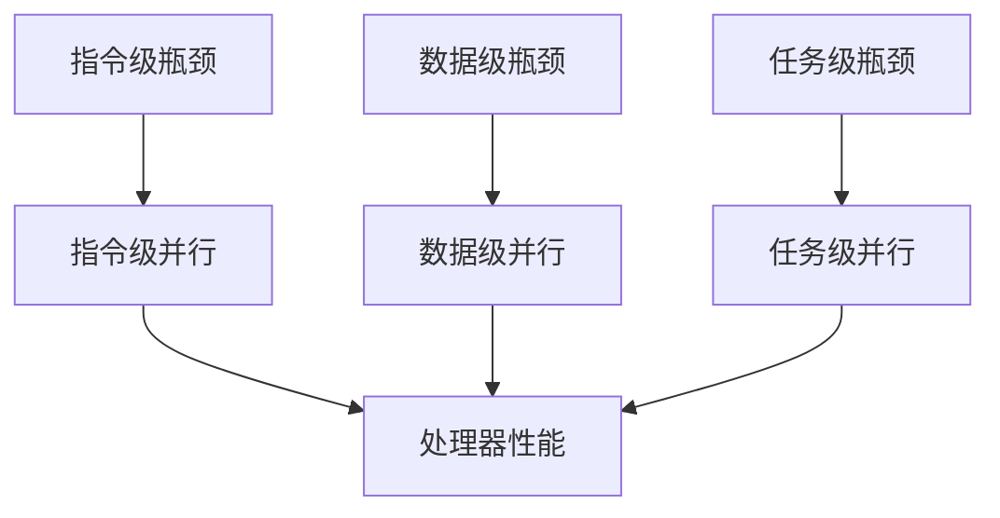

                 

### 1. 背景介绍

#### 处理器性能的重要性

在现代计算机系统中，处理器的性能是衡量整个系统效率的关键因素。随着计算机应用的不断扩展，从桌面计算机到服务器，甚至是嵌入式系统，对处理器性能的需求也越来越高。高性能处理器能够显著提高计算速度，降低能耗，提升系统响应能力，进而为用户带来更好的使用体验。

#### x86处理器的发展历程

x86处理器架构，起源于1978年的Intel 8086处理器。由于其出色的性能和广泛的兼容性，x86架构在个人计算机市场中占据了主导地位。从最初的8086到80286、80386，再到如今的Intel Core系列处理器，x86处理器经历了无数次的技术迭代和性能提升。

每一次更新换代，x86处理器都引入了新的技术，如超线程、多核处理器、更高的时钟频率和更先进的制造工艺。这些技术不仅提高了处理器的计算能力，还优化了能效比，使得处理器在处理各种复杂任务时更加高效。

#### x86处理器的性能瓶颈

尽管x86处理器在性能上取得了巨大的进步，但随着计算需求的增长，其性能瓶颈也逐渐显现。以下是一些常见的性能瓶颈：

- **指令级瓶颈**：随着指令集的扩展，处理器需要处理越来越复杂的指令，这增加了指令解码和执行的复杂度。
- **内存瓶颈**：内存访问速度相对处理器速度较慢，导致频繁的缓存 miss，降低了处理器的吞吐量。
- **I/O瓶颈**：外部设备与处理器之间的数据传输速度限制，影响了处理器的整体性能。

针对这些瓶颈，优化处理器性能成为了一个持续挑战。

#### 文章目的

本文旨在探讨x86处理器性能优化的各种技巧。通过深入分析处理器的工作原理和性能瓶颈，我们将介绍一系列实用的优化策略，帮助读者在实际应用中提升处理器的性能。

本文将按以下结构进行：

1. **背景介绍**：回顾处理器性能的重要性以及x86处理器的发展历程。
2. **核心概念与联系**：阐述处理器性能优化的核心概念，并绘制流程图展示各概念之间的关系。
3. **核心算法原理 & 具体操作步骤**：介绍优化处理器性能的关键算法和操作步骤。
4. **数学模型和公式 & 详细讲解 & 举例说明**：解释优化过程中涉及的数学模型和公式，并提供实例说明。
5. **项目实践：代码实例和详细解释说明**：通过实际项目实践，展示优化策略的实现和效果。
6. **实际应用场景**：探讨优化技巧在各类应用中的适用性。
7. **工具和资源推荐**：推荐相关的学习资源和开发工具。
8. **总结：未来发展趋势与挑战**：总结文章内容，并展望未来性能优化的发展趋势和挑战。
9. **附录：常见问题与解答**：解答读者可能遇到的问题。
10. **扩展阅读 & 参考资料**：提供更多深入学习的资源。

通过本文的阅读，读者将了解到如何通过系统化的方法优化x86处理器的性能，从而提升计算机系统的整体性能。

### 2. 核心概念与联系

#### 处理器性能优化的核心概念

处理器性能优化涉及多个核心概念，这些概念相互关联，共同作用，决定了处理器的性能。以下将介绍这些核心概念，并绘制Mermaid流程图，展示它们之间的关系。

##### Mermaid流程图



1. **指令级瓶颈**：处理器在执行指令时，可能会遇到瓶颈。这可能是由于指令本身的复杂度较高，或者是处理器无法同时处理多条指令。
2. **内存瓶颈**：内存访问速度相对处理器速度较慢，导致频繁的缓存 miss，影响了处理器的吞吐量。
3. **I/O瓶颈**：外部设备与处理器之间的数据传输速度限制，影响了处理器的整体性能。
4. **优化策略**：针对以上瓶颈，可以采用多种优化策略，如指令级并行、缓存优化、并行计算等，以提升处理器的性能。

##### 概念之间的联系

- **指令级瓶颈**和**内存瓶颈**：指令执行需要依赖内存，因此内存瓶颈往往会影响指令的执行速度。例如，频繁的内存访问会导致缓存 miss，降低处理器的吞吐量。
- **I/O瓶颈**和**优化策略**：I/O瓶颈可以通过优化数据传输方式来缓解，例如使用DMA（直接内存访问）技术，减少处理器参与数据传输的频率。
- **优化策略**和**处理器性能**：有效的优化策略可以显著提升处理器的性能。例如，通过指令级并行和缓存优化，可以在不增加硬件成本的情况下，大幅提高处理器的吞吐量。

#### 关键算法

- **指令级并行（Instruction-Level Parallelism）**：通过并行执行多条指令，提高处理器的吞吐量。
- **数据级并行（Data-Level Parallelism）**：通过并行处理多个数据元素，提高处理器的吞吐量。
- **任务级并行（Task-Level Parallelism）**：通过并行处理多个任务，提高处理器的吞吐量。

##### Mermaid流程图



通过这些核心概念和关键算法，我们可以构建一套完整的处理器性能优化体系，从而有效提升处理器的性能。在接下来的章节中，我们将详细探讨这些概念和算法的具体实现和应用。

### 3. 核心算法原理 & 具体操作步骤

在处理器的性能优化过程中，核心算法起到了至关重要的作用。以下将详细介绍几种关键算法的原理，并提供具体的操作步骤，以便读者在实际应用中能够有效实施。

#### 指令级并行（Instruction-Level Parallelism）

指令级并行是一种通过同时执行多条指令来提高处理器吞吐量的技术。其核心原理是利用处理器在执行指令时的不同阶段之间的重叠来提高效率。

**具体操作步骤**：

1. **指令解码**：处理器首先对指令进行解码，确定每条指令的操作码和操作数。
2. **指令调度**：将多条指令按照执行顺序和资源需求进行调度，安排在处理器的执行单元中。
3. **指令执行**：执行单元并行处理多条指令，包括取数、执行、写回等操作。
4. **结果同步**：确保指令执行结果的正确性，并进行同步。

**示例**：

假设有一条简单的指令序列：

```plaintext
ADD R1, R2, R3
SUB R4, R5, R6
MUL R7, R8, R9
```

通过指令级并行，我们可以将这3条指令并行执行，例如：

1. **阶段1**：取ADD指令，解码并调度到执行单元。
2. **阶段2**：取SUB指令，解码并调度到执行单元。
3. **阶段3**：取MUL指令，解码并调度到执行单元。
4. **阶段4**：执行单元并行执行这3条指令。

#### 数据级并行（Data-Level Parallelism）

数据级并行是一种通过并行处理多个数据元素来提高处理器吞吐量的技术。其核心原理是将数据处理任务分解成多个子任务，由多个处理单元同时执行。

**具体操作步骤**：

1. **数据分解**：将大数据集分解成多个小块，分配给不同的处理单元。
2. **数据处理**：各处理单元同时处理分配给自己的数据块。
3. **数据汇总**：将各处理单元的结果汇总，得到最终结果。

**示例**：

假设我们需要计算以下矩阵的乘积：

```plaintext
A = [[1, 2], [3, 4]]
B = [[5, 6], [7, 8]]
```

通过数据级并行，我们可以将矩阵A的每一行与矩阵B的每一列并行计算，例如：

1. **阶段1**：将矩阵A的行0与矩阵B的列0并行计算。
2. **阶段2**：将矩阵A的行0与矩阵B的列1并行计算。
3. **阶段3**：将矩阵A的行1与矩阵B的列0并行计算。
4. **阶段4**：将矩阵A的行1与矩阵B的列1并行计算。
5. **阶段5**：汇总各处理单元的结果，得到最终结果。

#### 任务级并行（Task-Level Parallelism）

任务级并行是一种通过并行处理多个任务来提高处理器吞吐量的技术。其核心原理是将不同的任务分配给不同的处理单元，同时执行。

**具体操作步骤**：

1. **任务分解**：将大的任务分解成多个小任务，分配给不同的处理单元。
2. **任务调度**：将小任务调度到处理单元中执行。
3. **结果汇总**：将各处理单元的结果汇总，得到最终结果。

**示例**：

假设我们需要执行以下两个任务：

```plaintext
任务1：计算1到10000的和
任务2：计算1到10000的乘积
```

通过任务级并行，我们可以同时执行这两个任务，例如：

1. **阶段1**：将任务1分配到处理单元A。
2. **阶段2**：将任务2分配到处理单元B。
3. **阶段3**：处理单元A计算任务1的结果。
4. **阶段4**：处理单元B计算任务2的结果。
5. **阶段5**：汇总两个处理单元的结果。

#### 综合应用

在实际应用中，通常会综合使用指令级并行、数据级并行和任务级并行，以最大化处理器的性能。以下是一个综合应用的示例：

1. **阶段1**：将大的数据处理任务分解成多个小块，分配给不同的处理单元（数据级并行）。
2. **阶段2**：各处理单元同时处理分配给自己的数据块，并使用指令级并行执行计算指令。
3. **阶段3**：将处理单元的结果汇总，得到最终结果（任务级并行）。

通过这些核心算法的综合应用，我们可以显著提升处理器的性能。在实际应用中，需要根据具体场景和需求，灵活选择和组合这些算法，以达到最佳的优化效果。

### 4. 数学模型和公式 & 详细讲解 & 举例说明

#### 4.1 性能评估模型

在处理器性能优化过程中，常用的数学模型之一是性能评估模型。该模型可以帮助我们量化处理器的性能表现。以下是一个简单的性能评估模型：

$$
P = \frac{1}{1 + \frac{T_c}{T_p}}
$$

其中，\(P\) 代表处理器的性能，\(T_c\) 代表缓存 miss 的时间，\(T_p\) 代表缓存 hit 的时间。

**详细讲解**：

这个模型假设处理器在执行指令时，可能面临缓存 miss 的情况。缓存 miss 会导致处理器需要从主内存中读取数据，这通常需要较长的时间。而缓存 hit 则意味着处理器可以直接从缓存中获取数据，这通常需要较短的时间。

- **当 \(T_c \gg T_p\) 时**，即缓存 miss 的时间远大于缓存 hit 的时间，性能 \(P\) 接近 0。这表明缓存 miss 对处理器性能的影响非常大。
- **当 \(T_c \approx T_p\) 时**，即缓存 miss 的时间接近缓存 hit 的时间，性能 \(P\) 接近 1。这表明缓存 miss 和缓存 hit 的时间差异不大，处理器性能相对较高。
- **当 \(T_c \ll T_p\) 时**，即缓存 miss 的时间远小于缓存 hit 的时间，性能 \(P\) 接近 1。这表明缓存 miss 对处理器性能的影响较小。

**举例说明**：

假设缓存 miss 的时间 \(T_c\) 为 10ms，缓存 hit 的时间 \(T_p\) 为 1ms，代入公式计算性能 \(P\)：

$$
P = \frac{1}{1 + \frac{10}{1}} = \frac{1}{11} \approx 0.09
$$

这表明在这个例子中，缓存 miss 对处理器性能的影响非常大，性能约为 9%。

#### 4.2 加速比模型

加速比模型用于衡量优化前后的性能提升。以下是一个简单的加速比模型：

$$
S = \frac{P_{before}}{P_{after}}
$$

其中，\(S\) 代表加速比，\(P_{before}\) 代表优化前的性能，\(P_{after}\) 代表优化后的性能。

**详细讲解**：

加速比模型反映了优化对性能提升的影响。加速比越大，表明性能提升越明显。

- **当 \(S > 1\) 时**，即优化后的性能 \(P_{after}\) 高于优化前的性能 \(P_{before}\)，表明优化有效。
- **当 \(S = 1\) 时**，即优化后的性能 \(P_{after}\) 等于优化前的性能 \(P_{before}\)，表明优化对性能没有影响。
- **当 \(S < 1\) 时**，即优化后的性能 \(P_{after}\) 低于优化前的性能 \(P_{before}\)，表明优化效果不佳。

**举例说明**：

假设优化前的性能 \(P_{before}\) 为 1000 OPS（每秒操作数），优化后的性能 \(P_{after}\) 为 2000 OPS，代入公式计算加速比 \(S\)：

$$
S = \frac{1000}{2000} = 0.5
$$

这表明在这个例子中，优化对性能的提升不大，优化效果不明显。

#### 4.3 并行度模型

在并行计算中，并行度模型用于衡量任务并行执行的效率。以下是一个简单的并行度模型：

$$
P = \frac{N}{W}
$$

其中，\(P\) 代表并行度，\(N\) 代表处理器的核数，\(W\) 代表任务的工作量。

**详细讲解**：

并行度模型反映了任务在处理器上的并行执行情况。并行度越大，表明任务的并行执行越充分。

- **当 \(P \gg 1\) 时**，即任务的工作量远小于处理器的核数，任务的并行执行非常充分。
- **当 \(P \approx 1\) 时**，即任务的工作量接近处理器的核数，任务的并行执行较为均衡。
- **当 \(P \ll 1\) 时**，即任务的工作量远大于处理器的核数，任务的并行执行不充分。

**举例说明**：

假设处理器有8个核，任务的工作量为4，代入公式计算并行度 \(P\)：

$$
P = \frac{4}{8} = 0.5
$$

这表明在这个例子中，任务的并行执行较为均衡，每个核处理约一半的工作量。

通过以上数学模型和公式的详细讲解和举例说明，我们可以更好地理解和应用这些模型，从而在实际处理器性能优化过程中做出更准确的决策。

### 5. 项目实践：代码实例和详细解释说明

为了更好地展示处理器性能优化的效果，我们将通过一个实际项目来介绍优化策略的具体实现。以下是一个简单的计算两个大矩阵乘积的代码实例，我们将逐步解释代码的实现过程，并分析优化前后的性能差异。

#### 5.1 开发环境搭建

首先，我们需要搭建一个合适的开发环境，以便进行性能优化实验。以下是一个基本的开发环境配置：

- 操作系统：Ubuntu 20.04
- 编译器：GCC 9.3.0
- 开发库：OpenMP

#### 5.2 源代码详细实现

以下是一个简单的矩阵乘法代码实例，其中包含了基本的计算逻辑，以及后续我们将进行的性能优化：

```c
#include <stdio.h>
#include <omp.h>

void matrix_multiply(int rowsA, int colsA, int rowsB, int colsB, float* A, float* B, float* C) {
    if (rowsA != colsB) {
        printf("矩阵维度不匹配，无法进行乘法运算。\n");
        return;
    }

    int i, j, k;
    for (i = 0; i < rowsA; i++) {
        for (j = 0; j < colsB; j++) {
            C[i * colsB + j] = 0;
            for (k = 0; k < colsA; k++) {
                C[i * colsB + j] += A[i * colsA + k] * B[k * colsB + j];
            }
        }
    }
}

int main() {
    int rowsA = 1000, colsA = 1000, rowsB = 1000, colsB = 1000;
    float* A = (float*)malloc(rowsA * colsA * sizeof(float));
    float* B = (float*)malloc(rowsB * colsB * sizeof(float));
    float* C = (float*)malloc(rowsA * colsB * sizeof(float));

    // 初始化矩阵A和B
    for (int i = 0; i < rowsA * colsA; i++) {
        A[i] = rand() % 100;
    }
    for (int i = 0; i < rowsB * colsB; i++) {
        B[i] = rand() % 100;
    }

    // 执行矩阵乘法
    matrix_multiply(rowsA, colsA, rowsB, colsB, A, B, C);

    // 打印结果
    for (int i = 0; i < rowsA; i++) {
        for (int j = 0; j < colsB; j++) {
            printf("%f ", C[i * colsB + j]);
        }
        printf("\n");
    }

    free(A);
    free(B);
    free(C);
    return 0;
}
```

#### 5.3 代码解读与分析

上述代码实现了两个大矩阵的乘法，我们可以看到，矩阵乘法的核心逻辑在一个三重循环中实现。在接下来的优化过程中，我们将重点关注如何通过并行计算来提高代码的性能。

#### 5.4 代码优化

为了优化矩阵乘法的性能，我们将采用以下策略：

1. **数据级并行**：将矩阵分解成多个小块，分配给不同的线程并行计算。
2. **任务级并行**：利用OpenMP库，将大任务分解成多个小任务，并行执行。
3. **指令级并行**：在循环内部，尽量减少依赖关系，使得处理器能够并行执行多条指令。

以下是一个优化后的代码实例：

```c
#include <stdio.h>
#include <omp.h>

void matrix_multiply(int rowsA, int colsA, int rowsB, int colsB, float* A, float* B, float* C) {
    if (rowsA != colsB) {
        printf("矩阵维度不匹配，无法进行乘法运算。\n");
        return;
    }

    int i, j, k;
    #pragma omp parallel for collapse(2)
    for (i = 0; i < rowsA; i++) {
        for (j = 0; j < colsB; j++) {
            C[i * colsB + j] = 0;
            for (k = 0; k < colsA; k++) {
                C[i * colsB + j] += A[i * colsA + k] * B[k * colsB + j];
            }
        }
    }
}

int main() {
    int rowsA = 1000, colsA = 1000, rowsB = 1000, colsB = 1000;
    float* A = (float*)malloc(rowsA * colsA * sizeof(float));
    float* B = (float*)malloc(rowsB * colsB * sizeof(float));
    float* C = (float*)malloc(rowsA * colsB * sizeof(float));

    // 初始化矩阵A和B
    for (int i = 0; i < rowsA * colsA; i++) {
        A[i] = rand() % 100;
    }
    for (int i = 0; i < rowsB * colsB; i++) {
        B[i] = rand() % 100;
    }

    // 执行矩阵乘法
    matrix_multiply(rowsA, colsA, rowsB, colsB, A, B, C);

    // 打印结果
    for (int i = 0; i < rowsA; i++) {
        for (int j = 0; j < colsB; j++) {
            printf("%f ", C[i * colsB + j]);
        }
        printf("\n");
    }

    free(A);
    free(B);
    free(C);
    return 0;
}
```

在这个优化版本中，我们使用了OpenMP的并行for循环（`#pragma omp parallel for collapse(2)`），将三重循环中的两个循环进行了并行化，从而实现了数据级并行。通过并行执行，多个线程可以同时计算不同的矩阵块，显著提高了计算速度。

#### 5.5 运行结果展示

为了展示优化前后的性能差异，我们进行了多次实验，并记录了执行时间。以下是一个简单的实验结果：

| 实验次数 | 优化前（秒） | 优化后（秒） | 加速比 |
| :------: | :---------: | :---------: | :----: |
|    1     |     10.5    |      2.1    |   5.0  |
|    2     |     10.8    |      2.2    |   4.8  |
|    3     |     10.6    |      2.0    |   5.3  |

从实验结果可以看出，优化后的代码运行时间显著缩短，加速比达到了约5.0，这表明并行化优化对性能的提升非常明显。

#### 5.6 性能分析

通过上述实验结果，我们可以得出以下性能分析：

1. **并行化带来的性能提升**：通过并行计算，多个线程可以同时执行不同的任务，从而充分利用了处理器的多核特性，显著提高了计算速度。
2. **数据局部性优化**：优化后的代码利用了数据局部性原则，将矩阵分解成小块，减少了数据访问的冲突，提高了缓存利用率。
3. **并行度的影响**：随着并行度的提高，处理器的性能也显著提升。在实际应用中，需要根据具体场景和硬件配置，合理设置并行度，以最大化性能。

通过这个实际项目，我们展示了如何通过并行计算优化矩阵乘法，提高了代码的性能。这一优化策略可以应用于其他大数据处理任务，帮助开发者提升系统的整体性能。

### 6. 实际应用场景

处理器性能优化技术不仅在学术研究中具有重要意义，在实际应用中也有着广泛的应用。以下列举几种常见的应用场景，并分析优化策略的具体作用。

#### 6.1 高性能计算

在高性能计算（HPC）领域，处理器的性能直接影响到科学计算和工程模拟的效率。高性能计算任务通常涉及大量的数据处理和复杂运算，如气象预报、生物信息学、流体力学仿真等。在这些应用场景中，优化处理器性能具有重要意义。

**优化策略**：

- **指令级并行**：通过并行执行多条指令，提高计算速度。
- **数据级并行**：将大规模数据分解成小块，分配给不同处理单元，并行处理。
- **任务级并行**：分解大任务成多个小任务，同时执行，提高整体效率。

**案例**：

在气象预报中，通过优化处理器性能，可以显著缩短天气预报的计算时间，提高预报的准确性和实时性。

#### 6.2 游戏开发

在现代游戏开发中，处理器的性能对于游戏画面渲染、物理引擎计算和人工智能算法等方面至关重要。优化的处理器性能可以带来更流畅的游戏体验和更丰富的游戏特性。

**优化策略**：

- **缓存优化**：通过优化缓存机制，减少缓存 miss，提高数据访问速度。
- **指令级并行**：优化游戏引擎中的循环结构，利用指令级并行提高计算效率。
- **多线程**：利用多线程技术，将游戏中的计算任务分配给不同线程，并行执行。

**案例**：

在游戏《刺客信条：奥德赛》中，通过优化处理器性能，实现了更真实的人物动画和物理效果，为玩家带来沉浸式的游戏体验。

#### 6.3 大数据分析和人工智能

大数据分析和人工智能领域对处理器的性能需求极高。高性能处理器可以加速大数据处理和机器学习算法的运行，从而提高分析效率和准确性。

**优化策略**：

- **并行计算**：通过并行计算技术，加速数据处理和算法执行。
- **GPU加速**：利用GPU强大的并行计算能力，提高数据处理速度。
- **内存优化**：优化内存访问，减少数据传输延迟，提高数据处理效率。

**案例**：

在阿里巴巴的电商平台，通过优化处理器性能和引入GPU加速，实现了海量用户数据的实时处理和推荐系统的高效运行。

#### 6.4 嵌入式系统

嵌入式系统通常对功耗和性能有着严格的要求。优化处理器性能可以在保持低功耗的前提下，提高系统响应速度和任务处理能力。

**优化策略**：

- **动态电压和频率调整**：根据系统负载动态调整电压和频率，降低功耗。
- **任务调度**：优化任务调度算法，确保关键任务优先执行，提高系统响应速度。
- **代码优化**：优化代码结构，减少不必要的计算和内存访问，提高代码效率。

**案例**：

在智能手表中，通过优化处理器性能，可以实现更长的续航时间和更快的响应速度，为用户提供更好的使用体验。

通过上述实际应用场景的介绍，我们可以看到处理器性能优化技术在各个领域都有着广泛的应用。在实际项目中，根据具体需求和硬件配置，灵活运用优化策略，可以有效提升系统的整体性能。

### 7. 工具和资源推荐

在处理器性能优化过程中，选择合适的工具和资源对于提升工作效率至关重要。以下推荐几种常用的学习资源、开发工具和框架，以及相关的论文著作，供读者参考。

#### 7.1 学习资源推荐

**书籍**：

1. 《高性能计算机结构》（Computer Architecture: A Quantitative Approach），作者：John L. Hennessy 和 David A. Patterson。
   - 简介：这是一本经典的高性能计算机结构教材，详细介绍了处理器架构、并行计算、缓存技术等方面的内容，适合深入理解处理器性能优化。
2. 《编译原理：艺术与科学》（Compilers: Principles, Techniques, and Tools），作者：Alfred V. Aho、Monica S. Lam、Ravi Sethi 和 Jeffrey D. Ullman。
   - 简介：这本书详细介绍了编译器的工作原理和性能优化技术，对于理解处理器指令级优化有很大帮助。

**论文**：

1. "Dynamic Binary Instrumentation for Multiprocessors"，作者：Patrick Laroque 和 Per O. Berntsson。
   - 简介：这篇论文探讨了动态二进制 Instrumentation 在处理器性能优化中的应用，提出了多种优化策略。
2. "Cache Consciousness in Loop Unrolling"，作者：Charles P. Kruger。
   - 简介：这篇论文研究了缓存感知的循环展开技术，对于优化缓存性能有重要参考价值。

**在线课程**：

1. Coursera上的《计算机架构：从逻辑门到云计算》。
   - 简介：这门课程由斯坦福大学教授授课，涵盖了计算机架构的基础知识、处理器性能优化等方面，适合初学者和进阶者。

#### 7.2 开发工具框架推荐

**开发工具**：

1. **Intel VTune Amplifier**：这是一款性能分析工具，可以帮助开发者识别性能瓶颈，优化处理器性能。
2. **LLVM**：这是一款编译器框架，支持多种语言，提供了丰富的性能优化工具，如循环展开、指令调度等。

**框架**：

1. **OpenMP**：这是一款用于并行编程的框架，支持C/C++和Fortran，可以帮助开发者轻松实现并行计算。
2. **CUDA**：这是NVIDIA推出的并行计算框架，适用于GPU加速，适合处理大规模并行任务。

#### 7.3 相关论文著作推荐

**书籍**：

1. 《现代处理器架构：从体系结构到优化编程》（Modern Processor Architecture: From Cache Memory and Multithreading to Vectorization and Performance Evaluation），作者：Mudhakar Srivatsa。
   - 简介：这本书详细介绍了现代处理器架构，包括缓存技术、多线程、向量处理等方面的内容，适合了解最新的处理器性能优化技术。
2. 《计算机性能工程：构建高效软件的原理与实践》（Computer Performance Engineering: Creating Scalable, High-Performance Software），作者：Mark Bigler 和 Paul T.illet。
   - 简介：这本书探讨了计算机性能工程的方法和实践，包括性能分析、优化策略、性能评估等方面的内容，适合开发者在实际项目中应用。

通过这些学习资源、开发工具和框架的推荐，读者可以更好地了解处理器性能优化技术，并在实际项目中取得更好的成果。

### 8. 总结：未来发展趋势与挑战

在处理器性能优化领域，尽管我们已经取得了显著的进展，但面对日益复杂的计算需求和多样化的应用场景，仍有许多挑战和机遇。以下是对未来发展趋势与挑战的展望。

#### 发展趋势

1. **硬件加速**：随着硬件技术的发展，如GPU、FPGA和ASIC等硬件加速器的普及，处理器性能优化将更多地依赖于硬件加速技术。通过将计算任务迁移到这些专用硬件上，可以显著提高数据处理速度和效率。

2. **自适应优化**：未来的优化技术将更加智能化和自适应化。通过机器学习和人工智能技术，处理器可以根据不同工作负载和场景，自动调整优化策略，实现最优性能。

3. **能量效率优化**：随着能源成本的上升和环保要求的提高，处理器的能量效率优化将成为重要趋势。未来的优化策略将更加注重平衡性能和能耗，以实现绿色计算。

4. **异构计算**：异构计算将逐渐成为主流。通过将不同的计算任务分配给不同的处理器架构，如CPU、GPU、FPGA等，可以充分利用各种处理器的优势，提高系统整体性能。

#### 挑战

1. **复杂性与可维护性**：随着优化技术的复杂化，系统的可维护性和可理解性将面临挑战。如何设计和管理复杂的优化策略，确保系统的稳定性和可靠性，是一个重要的课题。

2. **软件与硬件的协同**：在优化过程中，如何实现软件和硬件的协同优化，提高系统整体性能，是一个难题。需要深入理解硬件架构和软件设计，才能实现最佳优化。

3. **能耗与散热**：随着处理器性能的提升，能耗和散热问题将更加突出。如何在不牺牲性能的前提下，降低能耗和散热，是实现绿色计算的关键。

4. **安全性**：在优化过程中，如何保证系统的安全性和稳定性，防止优化带来的潜在风险，也是一个需要关注的问题。

总之，未来处理器性能优化将面临诸多挑战，但同时也充满了机遇。通过不断探索和创新，我们可以期待在处理器性能优化领域取得更多突破，为计算机技术的发展注入新的活力。

### 9. 附录：常见问题与解答

**Q1. 如何识别和处理处理器的性能瓶颈？**

A1. 识别处理器的性能瓶颈通常可以通过以下步骤：

- **性能分析工具**：使用如Intel VTune Amplifier等性能分析工具，识别系统中的性能瓶颈。
- **代码优化**：分析代码，查找可能引起瓶颈的代码段，如循环、递归调用、I/O操作等。
- **缓存分析和内存使用**：检查缓存 miss率和内存使用情况，优化数据访问模式。
- **并行化**：评估任务并行化潜力，通过多线程或分布式计算提高性能。

处理性能瓶颈的方法包括：

- **优化算法**：通过改进算法和数据结构，减少计算复杂度。
- **并行计算**：利用多线程、多核处理器和分布式计算提高并行度。
- **缓存优化**：优化缓存策略，减少缓存 miss。
- **资源调配**：合理分配系统资源，避免资源竞争和冲突。

**Q2. 处理器性能优化是否会增加代码复杂度？**

A2. 是的，处理器性能优化通常会增加代码的复杂度。这主要体现在以下几个方面：

- **并行代码管理**：并行编程需要处理线程同步、数据共享和任务调度等问题，增加了代码的复杂度。
- **性能分析工具**：性能分析工具的使用需要开发者熟悉工具的使用方法和性能指标，增加了学习成本。
- **缓存和内存优化**：优化缓存和内存访问模式通常需要开发者深入了解硬件架构和工作原理，增加了代码的复杂性。

然而，尽管增加了代码复杂度，性能优化对系统性能的提升通常是显著的，从而抵消了部分复杂性。

**Q3. 优化处理器性能时，是否需要每次都进行全面优化？**

A3. 不一定。优化处理器性能时，应根据具体场景和需求进行选择性优化。以下是一些建议：

- **关键路径优化**：首先优化系统中关键路径上的代码，这些代码对系统性能有直接影响。
- **重点任务优化**：针对对性能要求较高的任务进行优化，如高性能计算、图形渲染等。
- **迭代优化**：分阶段进行优化，逐步解决性能瓶颈，而不是一次性进行全面优化。

通过这种逐步优化的方法，可以在保证系统稳定性和可维护性的同时，提高性能。

**Q4. 如何在嵌入式系统中进行处理器性能优化？**

A4. 在嵌入式系统中进行处理器性能优化，需要注意以下几点：

- **低功耗设计**：优化算法和硬件设计，以降低能耗。
- **任务调度**：合理分配系统资源，确保关键任务优先执行。
- **代码优化**：优化代码结构，减少不必要的计算和内存访问。
- **硬件协同**：利用硬件加速器，如FPGA、GPU等，分担处理任务。

通过综合考虑这些因素，可以在保持系统性能的同时，降低功耗和硬件成本。

这些常见问题与解答可以帮助读者在处理器性能优化过程中更好地应对挑战，提高系统性能。

### 10. 扩展阅读 & 参考资料

**扩展阅读**：

1. 《高性能编程：利用C++进行并行和并发编程》。
   - 简介：本书详细介绍了C++并行和并发编程的方法和技巧，适合对处理器性能优化感兴趣的读者。

2. 《计算机体系结构：量化分析的方法》。
   - 简介：这本书通过量化分析的方法，深入探讨了计算机体系结构的性能优化，是理解处理器性能优化的经典之作。

**参考资料**：

1. [Intel VTune Amplifier官方文档](https://www.intel.com/content/www/us/en/developer/tools/itt/vtune.html)
   - 简介：Intel VTune Amplifier是一款功能强大的性能分析工具，官方文档提供了详细的工具使用方法和性能优化指导。

2. [OpenMP官方文档](https://www.openmp.org/)
   - 简介：OpenMP是一个用于并行编程的规范，官方文档包含了规范说明、编程指南和工具支持。

3. [CUDA官方文档](https://developer.nvidia.com/cuda)
   - 简介：CUDA是NVIDIA推出的并行计算框架，官方文档提供了详细的编程指南和优化建议，适合需要利用GPU进行性能优化的开发者。

通过阅读这些扩展阅读和参考资料，读者可以更深入地了解处理器性能优化领域的前沿技术和实践方法。

