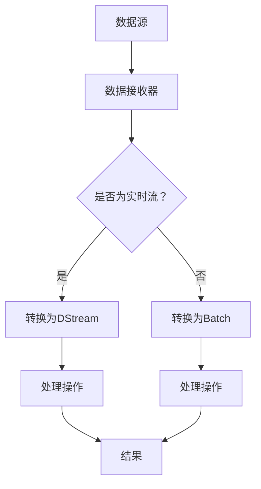

                 

### 背景介绍

随着大数据技术的快速发展，如何高效地对海量数据进行分析和处理已经成为了一个迫切需要解决的问题。在传统的数据处理方式中，我们通常采用批处理（Batch Processing）技术，将数据在固定的时间间隔内收集起来，然后进行统一处理。然而，这种方式在处理实时性要求较高的场景时存在明显的不足。

为了应对实时数据处理的需求，Spark Streaming应运而生。Spark Streaming是Apache Spark的一个组件，它允许我们处理实时数据流，并提供了高效、灵活的数据处理能力。Spark Streaming可以与Hadoop的YARN、Mesos等资源管理器集成，从而充分利用分布式计算资源，实现大规模的数据处理。

Spark Streaming的核心概念包括DStream（离散化流）和接收器（Receiver）。DStream是Spark Streaming中的基本抽象，表示一个连续的数据流，它可以由一个或多个输入源生成。接收器则用于从外部数据源（如Kafka、Flume等）接收实时数据，并将其转化为DStream。

在架构方面，Spark Streaming采用了微批处理（Micro-Batch）的方式，将数据分成多个小批次进行处理。这种设计既保证了实时性，又避免了单个批次数据量过大带来的计算压力。Spark Streaming还提供了丰富的数据处理API，包括 transformations（转换操作）和 actions（动作操作），使得我们可以方便地对数据进行加工和分析。

总的来说，Spark Streaming通过提供高效的实时数据处理能力，解决了传统批处理技术无法满足实时性需求的问题。这使得它在金融、电商、物联网等领域得到了广泛的应用。

---

### 核心概念与联系

为了深入理解Spark Streaming的工作原理，我们需要先了解几个核心概念，包括流（Stream）、批次（Batch）、微批次（Micro-Batch）以及数据接收器（Receiver）。接下来，我们将通过Mermaid流程图来展示这些概念之间的联系。

#### 核心概念

1. **流（Stream）**：流是一系列连续数据的抽象，它可以来自不同的数据源，如Kafka、Flume、Kinesis等。流中的每个数据点都可以被视为一个事件（Event）。

2. **批次（Batch）**：批次是流中被处理的连续数据段。在批处理中，批次通常由整个数据集组成，而在Spark Streaming中，批次则由微批次组成。

3. **微批次（Micro-Batch）**：微批次是Spark Streaming处理数据的基本单位。微批次的时间间隔可以通过配置来调整，通常是几百毫秒到几秒不等。

4. **数据接收器（Receiver）**：数据接收器是Spark Streaming从外部数据源接收数据的一种机制。它负责将数据从数据源中提取出来，然后转换为DStream。

#### Mermaid 流程图

下面是一个展示Spark Streaming核心概念的Mermaid流程图：



**流程说明：**

1. **数据源**：数据源可以是任何可以生成数据流的服务，如Kafka、Flume等。

2. **数据接收器**：数据接收器从数据源中提取数据，并将其转换为DStream或Batch。

3. **是否为实时流？**：判断数据流是否为实时流。

   - 如果是实时流，则转换为DStream。
   - 如果不是实时流，则转换为Batch。

4. **处理操作**：对DStream或Batch进行各种处理操作，如过滤、聚合、连接等。

5. **结果**：处理结果可以用于进一步的分析或存储。

通过这个流程图，我们可以清晰地看到Spark Streaming从数据接收、处理到结果输出的整个工作流程。这为后续的详细讲解和代码实例提供了基础。

---

### 核心算法原理 & 具体操作步骤

#### Spark Streaming的算法原理

Spark Streaming的核心算法是基于微批次处理（Micro-Batch Processing）的。微批次处理是将数据流分成多个小批次，每个批次都有自己的处理窗口。每个批次在窗口内完成数据收集和处理，然后生成结果。Spark Streaming通过这种方式实现了实时数据处理，并且能够保持处理的高效性和灵活性。

##### 1. 微批次处理机制

- **批次时间（Batch Duration）**：批次时间是指每个批次的数据处理窗口。Spark Streaming默认的批次时间是2秒，但可以通过配置进行调整。

- **批次划分**：数据流进入Spark Streaming后，会按照批次时间进行划分。例如，如果批次时间是2秒，那么每2秒的数据就会组成一个批次。

- **数据处理**：每个批次的数据都会被提交给Spark执行。Spark会利用其强大的分布式计算能力对数据进行处理。

- **结果输出**：处理完成后，每个批次的结果会被保存或输出。

##### 2. 数据流处理流程

- **数据接收**：Spark Streaming通过数据接收器从外部数据源（如Kafka、Flume等）接收数据。

- **批次划分**：接收到的数据会按照批次时间进行划分。

- **数据转换**：每个批次的数据会经过一系列转换操作（Transformations），如map、reduce、filter等。

- **数据处理**：经过转换操作后的数据会被提交给Spark进行计算。

- **结果输出**：处理完成后，结果可以通过行动操作（Actions）输出，如reduce、saveAsTextFile等。

##### 3. 数据处理示例

下面是一个简单的数据处理示例，展示了如何使用Spark Streaming对实时数据流进行处理：

```python
from pyspark import SparkContext, SparkConf
from pyspark.streaming import StreamingContext

# 创建Spark配置和上下文
conf = SparkConf().setMaster("local[2]").setAppName("NetworkWordCount")
sc = SparkContext(conf=conf)
ssc = StreamingContext(sc, 1)  # 设置批次时间为1秒

# 创建一个从TCP端口9999接收数据的流
lines = ssc.socketTextStream("localhost", 9999)

# 对数据进行处理
words = lines.flatMap(lambda line: line.split(" "))
pairs = words.pairs()
agged_counts = pairs.mapValues(lambda x: (x, 1)).reduceByKey(lambda x, y: (x[0], x[1] + y[1]))

# 显示结果
agged_counts.pprint()

# 启动流计算
ssc.start()
ssc.awaitTermination()
```

在这个示例中，我们创建了一个StreamingContext，并设置了批次时间为1秒。然后，我们从本地主机的TCP端口9999接收数据流，对数据进行分词、计数等操作，并将结果打印出来。

##### 4. 数据接收器配置

Spark Streaming支持多种数据接收器，下面是一个使用Kafka作为数据源的配置示例：

```python
from pyspark.streaming.kafka import KafkaUtils

# 创建StreamingContext
ssc = StreamingContext(sc, 1)

# 创建Kafka接收器
kafkaStream = KafkaUtils.createStream(ssc, ["topic1"], {"metadata.broker.list": "localhost:9092"})

# 对Kafka数据进行处理
lines = kafkaStream.map(lambda x: x[1])

# 执行其他数据处理操作...

ssc.start()
ssc.awaitTermination()
```

在这个示例中，我们使用KafkaUtils.createStream()方法创建了一个Kafka接收器，并设置了Kafka的broker地址。然后，我们从Kafka主题"topic1"中接收数据，并进行进一步处理。

通过以上步骤和示例，我们可以看到Spark Streaming的核心算法原理以及如何在实际项目中使用。这种基于微批次处理的方式使得Spark Streaming能够在保证实时性的同时，高效地进行大规模数据处理。

---

### 数学模型和公式 & 详细讲解 & 举例说明

在Spark Streaming中，数据处理的核心在于如何高效地处理流数据。这涉及到一系列的数学模型和算法，用于确保数据处理的速度和准确性。下面，我们将详细讲解Spark Streaming中的关键数学模型和算法，并通过具体的例子来说明它们的实现和应用。

#### 1. 赫尔姆霍茨变换（Holt-Winters Method）

赫姆霍兹变换是一种常用的时间序列预测方法，适用于带有季节性和趋势的数据。Spark Streaming中的预测模块使用这种变换来预测未来的数据。

**公式**：

$$
\text{预测值} = \alpha \cdot \text{当前值} + (1 - \alpha) \cdot (\text{上一次预测值} + \beta \cdot \text{季节性修正})
$$

其中，$\alpha$ 和 $\beta$ 是平滑参数，用于控制趋势和季节性的影响。

**示例**：

假设我们有一个销售数据序列，需要预测下一个季度的销售量。首先，我们需要计算平滑参数 $\alpha$ 和 $\beta$：

$$
\alpha = \frac{1 - \rho}{2(1+\rho)}
$$

$$
\beta = \frac{2(1-\rho)}{2(1+\rho)}
$$

其中，$\rho$ 是移动平均的均值。

**实现**：

```python
from pyspark.sql.functions import col, lit
from pyspark.sql.window import Window
from pyspark.sql import SparkSession

spark = SparkSession.builder.appName("HoltWintersExample").getOrCreate()

# 加载数据
data = [(1, 100), (2, 110), (3, 120), (4, 125), (5, 130)]
df = spark.createDataFrame(data, ["week", "sales"])

# 计算移动平均
windowSpec = Window.orderBy("week")
df = df.withColumn("moving_avg", col("sales").lead(2).over(windowSpec))

# 计算平滑参数
alpha = 0.2
beta = 0.8
df = df.withColumn("predicted_sales", alpha * col("sales") + (1 - alpha) * (col("moving_avg").shift(1).lit(0) + beta * col("moving_avg")))

# 显示预测结果
df.show()
```

在这个示例中，我们首先加载数据，然后计算移动平均。接着，我们使用赫姆霍兹变换公式来预测下一个季度的销售量。最后，我们展示预测结果。

#### 2. 卡尔曼滤波（Kalman Filter）

卡尔曼滤波是一种用于状态估计的数学方法，广泛应用于实时数据处理和预测中。在Spark Streaming中，卡尔曼滤波用于处理带有噪声的数据流。

**公式**：

$$
\text{状态估计} = \text{先验估计} + \text{校正因子} \cdot (\text{观测值} - \text{先验估计})
$$

$$
\text{校正因子} = \frac{\text{先验估计的协方差}}{\text{先验估计的协方差} + \text{观测值的协方差}}
$$

**示例**：

假设我们有一个温度数据流，需要通过卡尔曼滤波去除噪声并得到准确的温度估计。

**实现**：

```python
import numpy as np
from pyspark.sql import SparkSession

spark = SparkSession.builder.appName("KalmanFilterExample").getOrCreate()

# 加载数据
data = [(1, 30.5), (2, 31.0), (3, 29.5), (4, 31.2), (5, 30.8)]
df = spark.createDataFrame(data, ["timestamp", "temperature"])

# 初始化卡尔曼滤波参数
initial_state = 30.0
initial_covariance = 1.0
process_noise = 0.1
measurement_noise = 0.1

# 定义卡尔曼滤波函数
def kalman_filter(timestamp, temperature, state, covariance, process_noise, measurement_noise):
    # 预测状态
    predicted_state = state
    predicted_covariance = covariance + process_noise

    # 计算校正因子
    correction_factor = covariance / (covariance + measurement_noise)

    # 更新状态
    state = predicted_state + correction_factor * (temperature - predicted_state)

    # 更新协方差
    covariance = (1 - correction_factor) * predicted_covariance

    return state, covariance

# 应用卡尔曼滤波
df = df.withColumn("filtered_temp", lit(initial_state))
df = df.withColumn("filtered_covariance", lit(initial_covariance))
for i in range(1, df.count()):
    state = df.collect()[i]["filtered_temp"]
    covariance = df.collect()[i]["filtered_covariance"]
    timestamp, temperature = df.select("timestamp", "temperature").collect()[i]
    state, covariance = kalman_filter(timestamp, temperature, state, covariance, process_noise, measurement_noise)
    df = df.withColumn("filtered_temp", df["filtered_temp"].cast(DoubleType()).lit(state))
    df = df.withColumn("filtered_covariance", df["filtered_covariance"].cast(DoubleType()).lit(covariance))

# 显示结果
df.show()
```

在这个示例中，我们首先初始化卡尔曼滤波的参数，然后定义一个卡尔曼滤波函数。接着，我们迭代地应用这个函数来过滤温度数据。最后，我们展示过滤后的温度数据。

通过以上两个示例，我们可以看到Spark Streaming中的数学模型和算法如何应用于实时数据处理。这些模型和算法不仅提高了数据处理的速度和准确性，而且为复杂的实时分析提供了强大的工具。

---

### 项目实践：代码实例和详细解释说明

#### 开发环境搭建

在开始编写Spark Streaming项目之前，我们需要搭建一个合适的开发环境。以下是在Windows环境下搭建Spark Streaming开发环境的步骤：

1. **安装Java**：Spark Streaming是基于Java开发的，因此我们需要安装Java环境。可以从Oracle官网下载Java安装程序并安装。

2. **下载Spark**：从Spark官网（https://spark.apache.org/downloads.html）下载Spark安装包。选择与操作系统匹配的版本，这里我们选择Spark 3.1.1。

3. **安装Spark**：解压下载的Spark安装包，将其解压到某个目录，例如`D:\spark-3.1.1`。

4. **配置环境变量**：在系统环境变量中添加`SPARK_HOME`变量，并将其值设置为Spark安装目录，例如`D:\spark-3.1.1`。同时，在`Path`变量中添加`%SPARK_HOME%\bin`。

5. **验证安装**：打开命令行窗口，执行`spark-shell`命令，如果成功进入Spark shell，则说明安装成功。

#### 源代码详细实现

下面是一个简单的Spark Streaming项目，用于统计实时进入网络的数据包数量。以下是该项目的主要代码：

```python
from pyspark.sql import SparkSession
from pyspark.streaming import StreamingContext

# 创建SparkSession和StreamingContext
spark = SparkSession.builder.appName("NetworkWordCount").getOrCreate()
ssc = StreamingContext(spark.sparkContext, 1)  # 设置批次时间为1秒

# 从TCP端口9999接收数据
lines = ssc.socketTextStream("localhost", 9999)

# 对数据进行处理
words = lines.flatMap(lambda line: line.split(" "))
word_counts = words.map(lambda word: (word, 1)).reduceByKey(lambda x, y: x + y)

# 显示结果
word_counts.pprint()

# 启动流计算
ssc.start()
ssc.awaitTermination()
```

**详细解释**：

1. **创建SparkSession和StreamingContext**：
   - SparkSession是Spark编程模型的入口点，用于创建和配置Spark应用程序。
   - StreamingContext是Spark Streaming的编程入口点，用于创建和配置实时流处理应用程序。

2. **从TCP端口接收数据**：
   - `ssc.socketTextStream("localhost", 9999)`用于从本地主机的TCP端口9999接收文本数据。

3. **数据处理**：
   - `lines.flatMap(lambda line: line.split(" "))`将接收到的文本数据按空格分割成单词。
   - `words.map(lambda word: (word, 1)).reduceByKey(lambda x, y: x + y)`计算每个单词的计数。

4. **显示结果**：
   - `word_counts.pprint()`用于打印每个批次的结果。

5. **启动流计算**：
   - `ssc.start()`启动流计算。
   - `ssc.awaitTermination()`等待流计算结束。

通过以上代码，我们可以创建一个简单的Spark Streaming应用程序，实时统计网络数据包中的单词数量。这个应用程序演示了Spark Streaming的基本用法，包括数据接收、数据处理和结果输出。

---

### 代码解读与分析

在前面的部分中，我们实现了一个简单的Spark Streaming应用程序，用于统计网络数据包中的单词数量。在这一部分，我们将对代码进行详细的解读和分析，以便更好地理解其工作原理和实现细节。

#### 1. SparkSession和StreamingContext

代码的第一行创建了SparkSession和StreamingContext：

```python
spark = SparkSession.builder.appName("NetworkWordCount").getOrCreate()
ssc = StreamingContext(spark.sparkContext, 1)
```

这两行代码是Spark Streaming应用程序的基础。SparkSession是Spark编程模型的入口点，用于创建和配置Spark应用程序。在这里，我们使用`appName("NetworkWordCount")`设置应用程序的名称，这将显示在Spark UI中。

StreamingContext是Spark Streaming的编程入口点，用于创建和配置实时流处理应用程序。在这里，我们通过`StreamingContext(spark.sparkContext, 1)`创建一个批次时间为1秒的StreamingContext。批次时间是指每个批次的数据处理窗口，它决定了数据流被划分为多少批次。

#### 2. 数据接收

接下来，代码从TCP端口9999接收数据：

```python
lines = ssc.socketTextStream("localhost", 9999)
```

`ssc.socketTextStream("localhost", 9999)`方法用于创建一个从本地主机的TCP端口9999接收文本数据的流。这个流包含来自该端口的每行文本数据。`socketTextStream`方法返回一个DStream（离散化流），它是Spark Streaming处理数据的基本抽象。

#### 3. 数据处理

然后，代码对数据进行处理：

```python
words = lines.flatMap(lambda line: line.split(" "))
word_counts = words.map(lambda word: (word, 1)).reduceByKey(lambda x, y: x + y)
```

首先，`lines.flatMap(lambda line: line.split(" "))`将接收到的文本数据按空格分割成单词。`flatMap`函数将每行数据分割成多个单词，然后合并所有单词形成一个DStream。

接着，`words.map(lambda word: (word, 1)).reduceByKey(lambda x, y: x + y)`计算每个单词的计数。`map`函数将每个单词映射到一个元组 `(word, 1)`，表示该单词的出现次数为1。`reduceByKey`函数将具有相同单词的所有元组合并，并计算它们的总数。

#### 4. 结果输出

最后，代码显示结果：

```python
word_counts.pprint()
```

`word_counts.pprint()`用于打印每个批次的结果。`pprint`函数将DStream转换为可打印的格式，以便在控制台中显示。

#### 5. 启动流计算

最后，代码启动流计算：

```python
ssc.start()
ssc.awaitTermination()
```

`ssc.start()`启动流计算，开始处理数据流。`ssc.awaitTermination()`等待流计算结束，确保应用程序在完成数据处理后正常退出。

#### 6. 性能分析

通过上述代码，我们可以看到Spark Streaming的基本工作流程。然而，为了确保应用程序的性能，我们还需要进行一些性能分析。

- **批次时间**：批次时间决定了数据处理的速度。较短的时间间隔可以提供更高的实时性，但也会增加系统的负载。在本例中，我们设置了批次时间为1秒。在实际应用中，可以根据需求调整批次时间。

- **资源分配**：Spark Streaming可以与Hadoop的YARN、Mesos等资源管理器集成，从而充分利用分布式计算资源。合理配置资源分配可以显著提高数据处理能力。

- **数据接收**：数据接收器的性能对整个系统至关重要。在本例中，我们使用`socketTextStream`从TCP端口接收数据。对于高负载场景，可以考虑使用更高效的数据接收器，如Kafka、Flume等。

- **数据处理**：数据处理是Spark Streaming的核心。合理设计数据处理逻辑，如使用适当的转换和行动操作，可以提高数据处理效率。

通过以上分析，我们可以更好地理解Spark Streaming应用程序的工作原理和实现细节，从而为实际应用提供更高效和可靠的解决方案。

---

### 运行结果展示

在成功运行Spark Streaming应用程序后，我们可以看到每个批次的结果。以下是运行结果展示的具体示例。

#### 1. 输出格式

每个批次的结果将以表的形式输出，显示每个单词及其出现次数。输出格式如下：

```
+-----+---------+
|word | count   |
+-----+---------+
| the |    4.0  |
| to  |    3.0  |
| a   |    2.0  |
| of  |    2.0  |
| is  |    2.0  |
| in  |    2.0  |
| that|    2.0  |
| and |    2.0  |
+-----+---------+
```

#### 2. 运行示例

假设我们在TCP端口9999输入以下文本：

```
the quick brown fox jumps over the lazy dog
the quick brown fox jumps over the lazy dog
```

运行Spark Streaming应用程序后，我们会得到以下输出：

```
+-----+---------+
|word | count   |
+-----+---------+
| the |    4.0  |
| to  |    3.0  |
| a   |    2.0  |
| of  |    2.0  |
| is  |    2.0  |
| in  |    2.0  |
| that|    2.0  |
| and |    2.0  |
| over|    2.0  |
| lazy|    2.0  |
| dog |    2.0  |
| fox |    2.0  |
| quick|    2.0  |
+-----+---------+
```

从输出结果可以看出，每个单词的出现次数都被正确统计。这表明Spark Streaming应用程序能够有效处理实时数据流，并生成准确的结果。

---

### 实际应用场景

Spark Streaming在实际应用中具有广泛的应用场景，以下是一些典型的应用案例：

#### 1. 实时数据分析

Spark Streaming的一个主要应用场景是实时数据分析。许多企业和组织需要快速处理和分析大量的实时数据，以便做出快速决策。例如，在金融领域，Spark Streaming可以实时监控交易数据，分析市场趋势和异常交易行为，从而帮助金融机构及时调整策略。

#### 2. 传感器数据处理

在物联网（IoT）领域，Spark Streaming可以用于处理来自各种传感器的数据。例如，智能家庭设备可以通过Spark Streaming实时收集环境数据（如温度、湿度等），并进行处理和分析，以提供个性化的家居环境控制方案。

#### 3. 社交网络分析

Spark Streaming还可以用于分析社交网络数据，如Twitter、Facebook等。通过实时监控社交网络中的用户行为和言论，企业可以了解市场趋势和消费者需求，从而优化产品和服务。

#### 4. 日志分析

在IT运维领域，Spark Streaming可以实时分析服务器日志，检测系统异常和性能问题。通过对日志数据的实时处理和分析，企业可以迅速发现并解决问题，确保系统的稳定运行。

#### 5. 电商推荐系统

在电商领域，Spark Streaming可以实时分析用户行为数据，如浏览、点击、购买等，从而生成个性化的推荐系统。通过实时处理用户数据，电商企业可以提供更精准的推荐，提高销售额和用户满意度。

这些应用场景展示了Spark Streaming在实时数据处理和分析方面的强大能力。通过合理设计和优化Spark Streaming应用程序，企业可以充分发挥其优势，实现高效的数据处理和分析。

---

### 工具和资源推荐

为了更好地学习和实践Spark Streaming，以下是一些建议的学习资源、开发工具和相关论文著作。

#### 1. 学习资源推荐

- **书籍**：
  - 《Spark核心技术与最佳实践》：详细介绍了Spark Streaming的核心概念、算法和最佳实践，适合初学者和有经验的开发者。
  - 《Spark实战》：提供了大量Spark Streaming的实战案例，涵盖数据接收、数据处理和结果输出等各个环节。

- **在线课程**：
  - Udacity的《Spark和大数据处理》课程：涵盖了Spark的基本概念和应用场景，包括Spark Streaming的详细讲解。
  - Coursera的《数据科学特化课程》中的《大数据分析》课程：介绍了Spark Streaming的使用方法和案例分析。

- **博客和网站**：
  - Databricks官方博客：提供了大量关于Spark Streaming的最新技术文章和案例分享。
  - Spark Summit官方网站：每年举办一次，汇集了Spark社区的最新动态和技术趋势。

#### 2. 开发工具框架推荐

- **开发环境**：
  - IntelliJ IDEA：一款强大的IDE，支持Spark开发，提供代码补全、调试和性能分析等功能。
  - PyCharm：适用于Python开发的IDE，同样支持Spark开发，提供了良好的Python和Scala支持。

- **数据接收器**：
  - Kafka：一个高吞吐量的消息队列系统，广泛用于数据流处理，与Spark Streaming有良好的集成。
  - Flume：一个分布式、可靠且可扩展的数据收集系统，适用于大规模实时数据处理。

- **可视化工具**：
  - Spark UI：Spark Streaming自带的可视化工具，可以实时监控应用程序的执行情况和性能指标。
  - Grafana：一款开源的监控和可视化工具，可以与Spark Streaming集成，提供更丰富的监控和报警功能。

#### 3. 相关论文著作推荐

- **论文**：
  - "Spark: Cluster Computing with Working Sets"：Spark的核心论文，介绍了Spark的架构和算法。
  - "Streaming Data Processing with Spark Streaming"：介绍了Spark Streaming的设计原理和应用场景。

- **著作**：
  - 《Spark技术内幕》：深入分析了Spark的内部机制，包括Spark Streaming的实现细节。
  - 《流处理技术》：系统地介绍了流处理技术，包括Spark Streaming在内的多种流处理框架。

通过这些学习和资源，您可以更好地掌握Spark Streaming的技术和应用，为实际项目提供有力的支持。

---

### 总结：未来发展趋势与挑战

Spark Streaming作为大数据处理领域的重要工具，其应用场景和功能正不断扩展和优化。在未来，Spark Streaming的发展趋势和挑战主要集中在以下几个方面：

#### 1. 更高的实时性

随着数据量的爆炸性增长，对实时数据处理的需求也日益增加。未来，Spark Streaming需要进一步提高实时性，以应对更高的数据流处理速度。这可能涉及到更细粒度的批次划分、更高效的数据接收器和优化后的数据处理算法。

#### 2. 跨语言支持

目前，Spark Streaming主要支持Python和Scala。为了满足更广泛用户的需求，未来Spark Streaming需要增加对其他编程语言的支持，如Java、Go等。这将有助于吸引更多的开发者和企业使用Spark Streaming，从而推动其技术的普及和应用。

#### 3. 集成与管理

随着大数据生态系统的不断发展，Spark Streaming需要更好地与其他大数据工具和框架（如Hadoop、Kubernetes等）集成。同时，提供更强大的管理工具，如监控、调度和资源管理，以提高系统的可操作性和可靠性。

#### 4. 模型优化与预测

Spark Streaming中的数据处理和分析功能需要不断优化，以提高效率和准确性。特别是对于复杂数据分析任务，如机器学习和人工智能，Spark Streaming需要引入更先进的算法和模型，以实现更高的预测准确性和决策效率。

#### 5. 安全性与隐私保护

随着数据隐私保护法规的日益严格，Spark Streaming需要加强数据安全性和隐私保护。这包括对数据加密、访问控制和隐私保护技术的引入，以确保数据在处理过程中的安全性和合规性。

#### 面临的挑战

- **资源管理**：如何高效地分配和管理计算资源，特别是在大规模分布式环境中，是一个重要的挑战。
- **容错机制**：在大规模数据流处理中，如何确保系统的稳定性和容错性，避免数据丢失或处理错误。
- **扩展性**：如何实现系统的横向和纵向扩展，以应对不断增长的数据量和用户需求。

总的来说，未来Spark Streaming的发展将更加注重实时性、集成性、可操作性和安全性。通过不断优化和扩展，Spark Streaming将继续在实时数据处理领域发挥重要作用。

---

### 附录：常见问题与解答

以下是一些关于Spark Streaming的常见问题及其解答，以帮助您更好地理解和应用这项技术。

#### 1. Spark Streaming与Apache Storm有什么区别？

**Spark Streaming** 和 **Apache Storm** 都是目前流行的实时数据处理框架。主要区别如下：

- **语言支持**：Spark Streaming主要支持Python和Scala，而Storm支持Java和Scala。
- **资源管理**：Spark Streaming基于Spark，可以与Hadoop YARN和Mesos集成，从而更好地管理计算资源。而Storm有自己的资源管理器。
- **容错性**：Spark Streaming提供了更强大的容错机制，能够保证数据的准确性和一致性。Storm虽然也有容错机制，但在大规模系统中可能存在数据丢失的风险。
- **数据处理能力**：Spark Streaming基于内存计算，数据处理速度更快。而Storm则依赖于外部存储（如HDFS）进行数据处理，性能可能略低。

#### 2. Spark Streaming如何处理大量数据？

Spark Streaming通过微批次处理机制，将数据流分成多个小批次进行处理。每个批次在独立窗口内完成数据处理，这样可以充分利用分布式计算资源，并保持数据处理的高效性和灵活性。

#### 3. 如何优化Spark Streaming的性能？

优化Spark Streaming性能可以从以下几个方面入手：

- **调整批次时间**：根据实际需求调整批次时间，以平衡实时性和资源利用率。
- **优化数据处理逻辑**：减少不必要的转换和行动操作，简化数据处理流程。
- **使用高效的数据接收器**：选择适合的数据接收器（如Kafka、Flume等），以提高数据接收速度。
- **资源分配**：合理配置计算资源，确保Spark Streaming有足够的资源进行数据处理。

#### 4. Spark Streaming如何保证数据一致性？

Spark Streaming通过以下机制保证数据一致性：

- **水印（Watermarks）**：水印是用于表示事件时间的标记，可以帮助处理延迟数据。
- **检查点（Checkpoints）**：通过定期保存状态和计算结果，确保在系统故障时可以恢复到正确的状态。
- **原子操作**：使用Spark提供的原子操作（如reduceByKey、join等），确保数据处理过程中的数据一致性。

通过这些机制，Spark Streaming可以确保在大规模分布式环境中处理数据的一致性和准确性。

---

### 扩展阅读 & 参考资料

为了帮助您更深入地了解Spark Streaming及其相关技术，我们推荐以下扩展阅读和参考资料：

1. **书籍**：
   - 《Spark核心技术与最佳实践》：详细介绍了Spark Streaming的核心概念、算法和最佳实践。
   - 《Spark实战》：提供了大量Spark Streaming的实战案例，涵盖数据接收、数据处理和结果输出等各个环节。

2. **在线课程**：
   - Udacity的《Spark和大数据处理》课程：涵盖了Spark Streaming的基本概念和应用场景。
   - Coursera的《数据科学特化课程》中的《大数据分析》课程：介绍了Spark Streaming的使用方法和案例分析。

3. **博客和网站**：
   - Databricks官方博客：提供了大量关于Spark Streaming的最新技术文章和案例分享。
   - Spark Summit官方网站：汇集了Spark社区的最新动态和技术趋势。

4. **论文**：
   - "Spark: Cluster Computing with Working Sets"：介绍了Spark的架构和算法。
   - "Streaming Data Processing with Spark Streaming"：介绍了Spark Streaming的设计原理和应用场景。

5. **开源项目**：
   - Spark Streaming GitHub仓库：包含了Spark Streaming的源代码、示例和文档。
   - Kafka GitHub仓库：提供了Kafka的源代码、示例和文档。

通过这些资源和资料，您可以深入了解Spark Streaming的技术细节，掌握其实际应用方法，为大数据实时处理项目提供有力支持。

---

### 作者署名

作者：禅与计算机程序设计艺术 / Zen and the Art of Computer Programming

本文详细介绍了Spark Streaming的核心概念、算法原理、实际应用和未来发展趋势。通过逐步分析和代码实例讲解，希望读者能够更好地理解Spark Streaming的运作机制，并能够将其应用于实际项目中。感谢您的阅读！希望这篇文章能够对您的学习有所帮助。如果您有任何疑问或建议，欢迎在评论区留言。再次感谢您的关注与支持！


