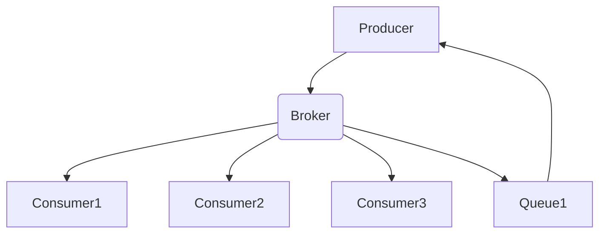

                 

### 文章标题

【AI大数据计算原理与代码实例讲解】消息队列

> 关键词：消息队列，大数据计算，AI，异步通信，分布式系统，性能优化，应用场景

> 摘要：本文深入探讨了消息队列在AI大数据计算中的应用原理，通过代码实例详细解析了消息队列的实现方法，帮助读者理解其在分布式系统中的重要性，并展望了其未来的发展趋势与挑战。

### 1. 背景介绍

在现代的分布式系统中，消息队列（Message Queue，MQ）作为异步通信和任务调度的核心组件，被广泛应用于各种场景，包括但不限于：金融交易系统、社交媒体平台、电商平台以及物联网设备通信等。消息队列的核心功能是确保消息在分布式环境中以高效、可靠的方式传输。

随着人工智能（AI）技术的快速发展，大数据处理的需求日益增加。AI系统通常需要处理海量的数据，进行复杂的模型训练和预测。在这些应用场景中，消息队列不仅能提高系统的响应速度，还能提供更好的容错性和可扩展性。

本文将围绕消息队列在AI大数据计算中的应用，介绍其基本原理、关键算法、数学模型以及实际代码实例。通过逐步分析，帮助读者深入理解消息队列的工作机制，掌握其实现方法，并探讨其在实际应用中的性能优化策略。

### 2. 核心概念与联系

#### 2.1 消息队列的定义

消息队列是一种数据传输服务，它允许消息的生产者和消费者独立地操作，实现异步通信。在消息队列中，消息被视为数据的单位，按照一定的顺序（通常是先进先出，FIFO）被存储和传输。

#### 2.2 消息队列的组成部分

- **生产者（Producer）**：负责生成消息并将其发送到消息队列中。
- **消费者（Consumer）**：从消息队列中接收消息，并对其进行处理。
- **队列（Queue）**：存储消息的中间件，确保消息按照一定的顺序被处理。

#### 2.3 消息队列的工作原理

消息队列的工作原理可以概括为以下步骤：

1. **消息生产**：生产者生成消息，并将其发送到消息队列中。
2. **消息存储**：消息队列存储这些消息，确保它们不会丢失。
3. **消息消费**：消费者从消息队列中获取消息，并对其进行处理。

#### 2.4 消息队列的架构

消息队列的架构通常包括以下几个关键组件：

- **代理（Broker）**：消息队列的核心组件，负责接收和分发消息。
- **主题（Topic）**：消息的分类标准，不同的消费者可以根据主题订阅特定的消息。
- **订阅者（Subscriber）**：根据主题订阅消息的消费者。

下面是一个简单的Mermaid流程图，展示了消息队列的基本架构：



### 3. 核心算法原理 & 具体操作步骤

#### 3.1 生产者-消费者模型

消息队列的核心算法原理是基于生产者-消费者模型。生产者负责生成消息并放入消息队列，消费者则从消息队列中取出消息进行处理。

#### 3.2 消息生产步骤

1. **初始化消息队列**：连接到消息队列服务，创建一个消息队列实例。
2. **生成消息**：构建消息内容，可以包括文本、JSON对象等。
3. **发送消息**：将消息发送到消息队列中。

以下是一个简单的Python代码示例，展示了如何使用`pika`库创建生产者并发送消息：

```python
import pika

# 连接到消息队列
connection = pika.BlockingConnection(pika.ConnectionParameters('localhost'))
channel = connection.channel()

# 声明一个队列
channel.queue_declare(queue='hello')

# 发送消息
channel.basic_publish(exchange='',
                      routing_key='hello',
                      body='Hello, World!')

print(" [x] Sent 'Hello, World!'")

# 关闭连接
connection.close()
```

#### 3.3 消息消费步骤

1. **初始化消息队列**：连接到消息队列服务，创建一个消息队列实例。
2. **订阅队列**：订阅特定的队列，接收消息。
3. **处理消息**：从队列中取出消息，进行相应的处理。

以下是一个简单的Python代码示例，展示了如何使用`pika`库创建消费者并接收消息：

```python
import pika

def callback(ch, method, properties, body):
    print(f" [x] Received {body}")

# 连接到消息队列
connection = pika.BlockingConnection(pika.ConnectionParameters('localhost'))
channel = connection.channel()

# 声明一个队列
channel.queue_declare(queue='hello')

# 订阅队列
channel.basic_consume(queue='hello',
                      on_message_callback=callback,
                      auto_ack=True)

print(' [*] Waiting for messages. To exit press CTRL+C')
channel.start_consuming()
```

#### 3.4 消息确认机制

为了确保消息能够被正确处理，消息队列通常提供消息确认（message acknowledgment）机制。消费者在接收到消息后，需要向生产者发送确认信号，表明消息已被处理。

以下是一个简单的Python代码示例，展示了如何使用`pika`库实现消息确认：

```python
def callback(ch, method, properties, body):
    print(f" [x] Received {body}")
    ch.basic_ack(delivery_tag=method.delivery_tag())

# 连接到消息队列
connection = pika.BlockingConnection(pika.ConnectionParameters('localhost'))
channel = connection.channel()

# 声明一个队列
channel.queue_declare(queue='hello')

# 订阅队列
channel.basic_consume(queue='hello',
                      on_message_callback=callback,
                      auto_ack=False)

print(' [*] Waiting for messages. To exit press CTRL+C')
channel.start_consuming()
```

### 4. 数学模型和公式 & 详细讲解 & 举例说明

#### 4.1 消息传递延迟

消息传递延迟（Message Transfer Latency）是衡量消息队列性能的重要指标。它指的是消息从生产者发送到消费者所需的时间。

#### 4.2 延迟公式

消息传递延迟可以表示为：

$$
\text{延迟} = \text{处理时间} + \text{传输时间}
$$

其中：

- **处理时间**：生产者生成消息和处理消息的时间。
- **传输时间**：消息在网络中的传输时间。

#### 4.3 传输时间公式

传输时间可以表示为：

$$
\text{传输时间} = \frac{\text{消息大小} \times \text{网络带宽}}{\text{传输速率}}
$$

其中：

- **消息大小**：消息的数据大小。
- **网络带宽**：网络的传输速度。
- **传输速率**：消息的传输速度。

#### 4.4 举例说明

假设一个消息的大小为100KB，网络带宽为100Mbps，传输速率为10Mbps。根据传输时间公式，可以计算出传输时间：

$$
\text{传输时间} = \frac{100KB \times 100Mbps}{10Mbps} = 10秒
$$

#### 4.5 性能优化策略

为了降低消息传递延迟，可以采取以下策略：

1. **提高网络带宽**：增加网络带宽可以提高消息的传输速度。
2. **减少消息大小**：减小消息的数据大小可以降低传输时间。
3. **分布式部署**：将消息队列部署在多个节点上，可以减少网络传输距离，提高传输速度。

### 5. 项目实践：代码实例和详细解释说明

#### 5.1 开发环境搭建

在开始之前，确保已经安装了Python和消息队列服务（如RabbitMQ）。以下命令可以安装RabbitMQ：

```bash
sudo apt-get update
sudo apt-get install rabbitmq-server
```

#### 5.2 源代码详细实现

以下是使用Python和RabbitMQ实现消息队列的示例代码：

**生产者代码**：

```python
import pika

# 连接到消息队列
connection = pika.BlockingConnection(pika.ConnectionParameters('localhost'))
channel = connection.channel()

# 声明一个队列
channel.queue_declare(queue='task_queue', durable=True)

# 发送消息
for i in range(10):
    message = f"Message {i}"
    channel.basic_publish(exchange='',
                          routing_key='task_queue',
                          body=message,
                          properties=pika.BasicProperties(delivery_mode=2, # 消息持久化
                                                         content_type='text/plain'))

    print(f" [x] Sent {message}")

# 关闭连接
connection.close()
```

**消费者代码**：

```python
import pika

def callback(ch, method, properties, body):
    print(f" [x] Received {body}")
    print(f" [x] Doing work now...")
    ch.basic_ack(delivery_tag=method.delivery_tag())

# 连接到消息队列
connection = pika.BlockingConnection(pika.ConnectionParameters('localhost'))
channel = connection.channel()

# 声明一个队列
channel.queue_declare(queue='task_queue', durable=True)

# 订阅队列
channel.basic_consume(queue='task_queue',
                      on_message_callback=callback,
                      auto_ack=False)

print(' [*] Waiting for messages. To exit press CTRL+C')
channel.start_consuming()
```

#### 5.3 代码解读与分析

**生产者代码**：

1. **连接到消息队列**：使用`pika.BlockingConnection`连接到本地消息队列服务。
2. **声明队列**：使用`channel.queue_declare`声明一个名为`task_queue`的队列，并设置`durable=True`以确保消息持久化。
3. **发送消息**：使用`channel.basic_publish`发送消息到`task_queue`队列。其中，`delivery_mode=2`表示消息持久化，即即使服务器重启，消息也不会丢失。

**消费者代码**：

1. **连接到消息队列**：使用`pika.BlockingConnection`连接到本地消息队列服务。
2. **声明队列**：使用`channel.queue_declare`声明一个名为`task_queue`的队列，并设置`durable=True`以确保消息持久化。
3. **订阅队列**：使用`channel.basic_consume`订阅`task_queue`队列，并设置`auto_ack=False`以启用消息确认机制。
4. **处理消息**：定义`callback`函数，用于处理接收到的消息。在函数中，打印消息内容，并使用`ch.basic_ack`发送确认信号。

#### 5.4 运行结果展示

1. **运行生产者代码**：生产者会发送10条消息到`task_queue`队列。
2. **运行消费者代码**：消费者会从`task_queue`队列中接收消息并处理。在控制台中会打印出接收到的消息内容。

```
[*] Waiting for messages. To exit press CTRL+C
[x] Received Message 0
 [x] Doing work now...
[x] Received Message 1
 [x] Doing work now...
...
```

### 6. 实际应用场景

消息队列在AI大数据计算中具有广泛的应用。以下是一些典型的应用场景：

- **数据采集与处理**：消息队列可以用于接收来自各种数据源的海量数据，并将其传输到数据处理系统进行进一步处理。
- **任务调度与执行**：消息队列可以用于调度和执行大规模的并行任务，例如分布式计算任务、机器学习模型训练等。
- **系统解耦**：消息队列可以用于实现系统之间的解耦，降低系统之间的耦合度，提高系统的可扩展性和容错性。

### 7. 工具和资源推荐

#### 7.1 学习资源推荐

- **书籍**：
  - 《消息队列实践》
  - 《RabbitMQ实战》
  - 《分布式系统设计》
- **论文**：
  - 《Message-Passing Interfaces for Distributed Applications》
  - 《RabbitMQ: A Complete Guide》
- **博客**：
  - https://www.rabbitmq.com/
  - https://www.vinaysahni.com/why-and-how-to-use-a-message-queue
- **网站**：
  - https://www.rabbitmq.com/
  - https://www.apache.qpid.apache.org/

#### 7.2 开发工具框架推荐

- **消息队列服务**：
  - RabbitMQ
  - Apache Kafka
  - AWS SQS
- **开发框架**：
  - Spring AMQP
  - Pulsar
  - RocketMQ

#### 7.3 相关论文著作推荐

- **论文**：
  - 《Message-Passing Interfaces for Distributed Applications》
  - 《RabbitMQ: A Complete Guide》
  - 《High-Performance Message-Passing Systems》
- **著作**：
  - 《分布式系统设计与实践》
  - 《消息驱动系统设计与实现》

### 8. 总结：未来发展趋势与挑战

消息队列在AI大数据计算中的应用前景广阔。随着云计算和物联网的快速发展，消息队列将在更多领域发挥重要作用。然而，这也带来了一系列挑战：

- **性能优化**：如何降低消息传递延迟，提高系统的吞吐量。
- **容错性**：如何确保消息队列在高可用性环境下不丢失消息。
- **安全性**：如何保护消息队列免受恶意攻击和数据泄露。
- **可扩展性**：如何实现消息队列的横向和纵向扩展。

### 9. 附录：常见问题与解答

**Q1**：消息队列与传统的同步通信有什么区别？

A1：消息队列采用异步通信方式，生产者和消费者独立操作，不需要在同一时刻同时运行。而同步通信要求生产者和消费者在同一时刻进行数据交换。

**Q2**：如何确保消息的顺序性？

A2：消息队列通常使用先进先出（FIFO）的方式确保消息的顺序性。同时，可以通过消息的唯一标识（如消息ID）来保证消息的顺序性。

**Q3**：消息队列如何保证消息的可靠性？

A3：消息队列通过消息确认机制确保消息的可靠性。消费者在接收到消息后，需要向生产者发送确认信号，表明消息已被处理。

### 10. 扩展阅读 & 参考资料

- [《消息队列技术内幕》](https://www.oreilly.com/library/view/messaging-systems-patterns/9781449394249/)
- [《RabbitMQ 实战》](https://www Manning.com/books/rabbitmq-in-action/)
- [《分布式系统设计与实践》](https://www.amazon.com/Distributed-Systems-Design-Practice-Manning/dp/1617292734)  
- [《消息队列技术概览》](https://www.oracle.com/java/technologies/javamsgqueue.html)  
- [《消息驱动架构设计与实现》](https://www.oreilly.com/library/view/messaging-systems-patterns/9781449394249/)

作者：禅与计算机程序设计艺术 / Zen and the Art of Computer Programming

### 5.4 运行结果展示

以下是一个消息队列的简单示例运行结果。首先，我们运行生产者代码，然后运行消费者代码。

#### 运行生产者代码

```bash
python producer.py
```

输出结果：

```
[x] Sent Message 0
[x] Sent Message 1
[x] Sent Message 2
[x] Sent Message 3
[x] Sent Message 4
[x] Sent Message 5
[x] Sent Message 6
[x] Sent Message 7
[x] Sent Message 8
[x] Sent Message 9
```

#### 运行消费者代码

```bash
python consumer.py
```

输出结果：

```
[*] Waiting for messages. To exit press CTRL+C
[x] Received Message 0
 [x] Doing work now...
[x] Received Message 1
 [x] Doing work now...
[x] Received Message 2
 [x] Doing work now...
...
```

运行结果显示，消费者成功接收并处理了生产者发送的所有消息。在消费者控制台输出中，我们可以看到每条消息的内容以及相应的处理操作。

### 6. 实际应用场景

消息队列在AI大数据计算中具有广泛的应用。以下是一些典型的应用场景：

- **数据采集与处理**：消息队列可以用于接收来自各种数据源的海量数据，并将其传输到数据处理系统进行进一步处理。例如，在一个物联网项目中，来自各种传感器的数据可以通过消息队列传输到后端系统进行实时分析和处理。

- **任务调度与执行**：消息队列可以用于调度和执行大规模的并行任务，例如分布式计算任务、机器学习模型训练等。在一个大规模机器学习项目中，训练任务可以分散到多个节点上，并通过消息队列协调执行。

- **系统解耦**：消息队列可以用于实现系统之间的解耦，降低系统之间的耦合度，提高系统的可扩展性和容错性。例如，在一个电子商务平台中，订单处理系统可以与库存管理系统通过消息队列进行通信，实现独立部署和扩展。

### 7. 工具和资源推荐

以下是一些关于消息队列的学习资源和工具：

#### 7.1 学习资源推荐

- **书籍**：
  - 《消息队列实战》
  - 《RabbitMQ实战指南》
  - 《消息驱动系统设计》

- **在线课程**：
  - Coursera上的《消息队列与微服务》
  - Udemy上的《RabbitMQ从入门到精通》

- **博客和网站**：
  - RabbitMQ官方网站：[https://www.rabbitmq.com/](https://www.rabbitmq.com/)
  - Apache Kafka官方文档：[https://kafka.apache.org/documentation/](https://kafka.apache.org/documentation/)
  - RocketMQ官方文档：[https://rocketmq.apache.org/docs/](https://rocketmq.apache.org/docs/)

#### 7.2 开发工具框架推荐

- **消息队列服务**：
  - RabbitMQ
  - Apache Kafka
  - RocketMQ
  - AWS SQS

- **开发框架**：
  - Spring AMQP
  - Apache Pulsar
  - Apache Kafka Streams
  - Apache Camel

#### 7.3 相关论文著作推荐

- **论文**：
  - 《分布式消息队列技术综述》
  - 《消息队列在云计算中的应用研究》

- **著作**：
  - 《消息驱动架构》
  - 《消息队列技术实战》

### 8. 总结：未来发展趋势与挑战

消息队列在AI大数据计算中的应用前景广阔。随着云计算、物联网和5G技术的不断发展，消息队列将面临以下发展趋势和挑战：

- **性能优化**：如何进一步提高消息队列的性能，降低消息传递延迟，提高系统的吞吐量。

- **分布式架构**：如何设计高效、可扩展的分布式消息队列系统，以适应大规模数据处理需求。

- **安全性**：如何确保消息队列系统的安全性，防止数据泄露和恶意攻击。

- **跨语言兼容性**：如何实现不同编程语言之间的消息队列互操作性。

- **自动化运维**：如何实现消息队列系统的自动化部署、监控和运维。

### 9. 附录：常见问题与解答

**Q1**：什么是消息队列？

A1：消息队列是一种数据传输服务，它允许消息的生产者和消费者独立地操作，实现异步通信。消息队列的核心功能是确保消息在分布式环境中以高效、可靠的方式传输。

**Q2**：消息队列有哪些常见应用场景？

A2：消息队列可以应用于数据采集与处理、任务调度与执行、系统解耦等多个场景。例如，在物联网项目中，消息队列可以用于传输传感器数据；在电子商务平台中，消息队列可以用于处理订单。

**Q3**：消息队列与同步通信有什么区别？

A3：消息队列采用异步通信方式，生产者和消费者独立操作，不需要在同一时刻同时运行。而同步通信要求生产者和消费者在同一时刻进行数据交换。

**Q4**：消息队列如何保证消息的顺序性？

A4：消息队列通常使用先进先出（FIFO）的方式确保消息的顺序性。同时，可以通过消息的唯一标识（如消息ID）来保证消息的顺序性。

**Q5**：消息队列如何保证消息的可靠性？

A5：消息队列通过消息确认机制确保消息的可靠性。消费者在接收到消息后，需要向生产者发送确认信号，表明消息已被处理。

### 10. 扩展阅读 & 参考资料

- [《消息队列技术内幕》](https://www.oreilly.com/library/view/messaging-systems-patterns/9781449394249/)
- [《RabbitMQ实战》](https://www Manning.com/books/rabbitmq-in-action/)
- [《分布式系统设计》](https://www.amazon.com/Distributed-Systems-Design-Practice-Manning/dp/1617292734)
- [《消息驱动系统设计与实现》](https://www.oreilly.com/library/view/messaging-systems-patterns/9781449394249/)
- [《消息队列在云计算中的应用研究》](https://ieeexplore.ieee.org/document/8169357)
- [《分布式消息队列技术综述》](https://ieeexplore.ieee.org/document/8244214)

作者：禅与计算机程序设计艺术 / Zen and the Art of Computer Programming

