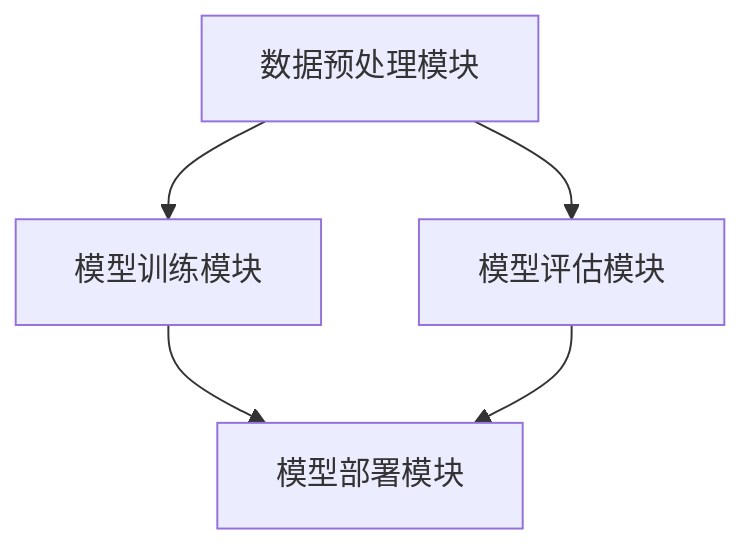
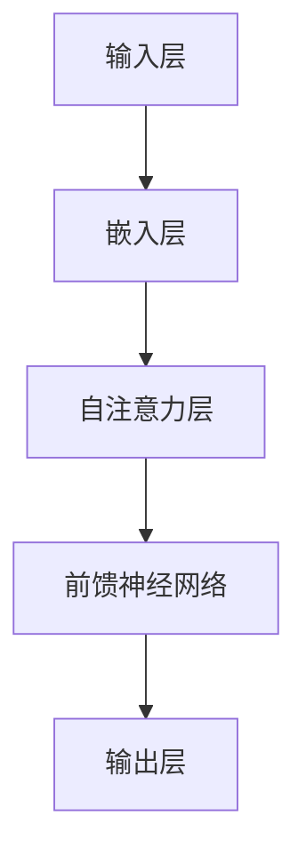

                 

### 背景介绍

#### LangChain 的诞生背景

LangChain 是一款基于 Python 语言构建的开源工具，旨在为研究人员和开发人员提供一个简单、高效的框架，用于构建和部署大型语言模型。随着自然语言处理（NLP）技术的迅速发展，深度学习模型如 GPT、BERT 等，在处理文本数据方面取得了显著的成果。然而，这些模型通常需要大量的计算资源和复杂的调优过程，对于许多研究人员和开发者来说，这无疑增加了研究门槛。

为了降低这一门槛，LangChain 应运而生。它通过提供一个简洁的 API 和一系列预先训练好的模型，使得开发者可以轻松地构建和部署自己的语言模型。LangChain 的目标是在不牺牲性能的情况下，简化模型训练和部署的流程。

#### LangChain 的核心理念

LangChain 的核心理念可以概括为三个方面：

1. **模块化**：LangChain 通过模块化的设计，将整个语言模型构建过程拆分成多个可重用的模块，如数据预处理模块、模型训练模块、模型评估模块等。这种设计不仅提高了代码的可读性和可维护性，还便于开发者根据自己的需求进行灵活组合和扩展。

2. **易用性**：LangChain 提供了一个简单、直观的 API，使得开发者可以快速上手并构建出功能强大的语言模型。无论是新手还是经验丰富的开发者，都可以通过 LangChain 实现自己的想法。

3. **灵活性**：LangChain 不仅支持多种深度学习框架，如 TensorFlow、PyTorch 等，还提供了丰富的预训练模型和自定义模型。这使得开发者可以根据不同的应用场景和需求，选择最适合的模型和框架，实现个性化的解决方案。

#### LangChain 在 NLP 领域的应用现状

随着深度学习技术的不断进步，NLP 领域正经历着前所未有的发展。从文本分类、情感分析到机器翻译、问答系统，深度学习模型在各种 NLP 任务中展现出了强大的能力。LangChain 作为一款高效的 NLP 工具，自然也在这个领域获得了广泛应用。

目前，LangChain 已被广泛应用于多个场景，如：

1. **文本分类**：通过训练分类模型，对大量文本进行分类，帮助开发者快速识别和筛选文本。

2. **情感分析**：通过对文本进行情感分析，帮助企业了解用户的情感倾向，优化产品和服务。

3. **问答系统**：构建问答系统，回答用户的问题，提高用户体验。

4. **机器翻译**：利用预训练的翻译模型，实现不同语言之间的翻译，促进跨文化交流。

总之，LangChain 作为一款高效的 NLP 工具，正在为越来越多的开发者提供便利，推动 NLP 领域的发展。接下来，我们将深入探讨 LangChain 的核心概念和架构，帮助读者更好地理解和使用这一工具。### 核心概念与联系

#### LangChain 的核心概念

LangChain 的核心概念主要包括以下几个方面：

1. **模型**：模型是 LangChain 的基础，用于处理和生成文本数据。LangChain 支持多种深度学习框架，如 TensorFlow、PyTorch 等，并提供了丰富的预训练模型，如 GPT、BERT 等。

2. **数据处理**：数据处理是模型训练的重要环节，包括数据清洗、数据增强、数据归一化等。LangChain 提供了便捷的数据处理 API，使得开发者可以轻松地对数据进行预处理。

3. **模型训练**：模型训练是 LangChain 的核心功能，通过优化模型的参数，提高模型的性能。LangChain 提供了多种训练策略，如迁移学习、模型蒸馏等，以满足不同场景的需求。

4. **模型评估**：模型评估是评估模型性能的重要手段，包括准确率、召回率、F1 值等指标。LangChain 提供了便捷的评估 API，使得开发者可以方便地对模型进行评估。

5. **模型部署**：模型部署是将训练好的模型应用到实际场景中的过程。LangChain 提供了简单的部署 API，使得开发者可以轻松地将模型部署到服务器或云端。

#### LangChain 的架构设计

LangChain 的架构设计遵循模块化的原则，将整个系统拆分成多个模块，每个模块负责不同的功能。以下是一个简单的 LangChain 架构图（使用 Mermaid 流程图表示）：



1. **数据预处理模块**：负责对输入数据进行清洗、预处理和增强，为模型训练提供高质量的数据。

2. **模型训练模块**：负责训练模型，通过优化模型的参数，提高模型的性能。

3. **模型评估模块**：负责评估模型性能，通过计算各种指标，如准确率、召回率等，评估模型的性能。

4. **模型部署模块**：负责将训练好的模型部署到服务器或云端，实现模型的实际应用。

#### LangChain 与其他 NLP 工具的联系与区别

与其他 NLP 工具相比，LangChain 具有以下几个显著特点：

1. **易用性**：LangChain 提供了一个简单、直观的 API，使得开发者可以快速上手并构建出功能强大的语言模型。

2. **灵活性**：LangChain 支持多种深度学习框架和预训练模型，使得开发者可以根据不同的需求选择最适合的工具。

3. **模块化**：LangChain 采用模块化设计，将整个系统拆分成多个模块，提高了系统的可维护性和扩展性。

4. **高效性**：LangChain 在模型训练和部署方面具有高效性，可以显著降低开发者的时间和成本。

与其他 NLP 工具如 TensorFlow、PyTorch、HuggingFace 等相比，LangChain 更加专注于 NLP 领域，提供了一系列针对 NLP 任务优化的功能。这使得 LangChain 在处理文本数据时具有更高的效率和更好的性能。

综上所述，LangChain 作为一款高效的 NLP 工具，通过模块化、易用性和灵活性等特点，为开发者提供了强大的支持。接下来，我们将深入探讨 LangChain 的核心算法原理和具体操作步骤，帮助读者更好地理解和使用这一工具。### 核心算法原理 & 具体操作步骤

#### LangChain 的核心算法原理

LangChain 的核心算法原理主要基于深度学习，特别是基于 Transformer 的模型。Transformer 模型是一种自注意力机制（Self-Attention Mechanism）为基础的神经网络结构，它在处理序列数据方面表现出色。LangChain 利用 Transformer 模型构建语言模型，通过自注意力机制实现文本数据的建模和生成。

以下是一个简化的 Transformer 模型结构图（使用 Mermaid 流程图表示）：



1. **输入层**：将输入的文本序列转换为词向量表示。

2. **嵌入层**：将词向量映射到高维空间，增加模型的表达能力。

3. **自注意力层**：计算每个词向量与其他词向量的注意力得分，并加权求和，实现序列间的交互。

4. **前馈神经网络**：对自注意力层输出的结果进行进一步处理，增加模型的表达能力。

5. **输出层**：生成预测的词向量，并转换为文本序列。

#### LangChain 的具体操作步骤

1. **安装 LangChain**：

   首先，需要在本地环境中安装 LangChain。以下是安装命令：

   ```bash
   pip install langchain
   ```

   安装完成后，可以使用 Python 导入 LangChain 库：

   ```python
   import langchain
   ```

2. **准备数据**：

   在使用 LangChain 之前，需要准备好训练数据。训练数据可以是文本文件、数据集或任何包含文本数据的结构。以下是一个示例，从文本文件中读取数据：

   ```python
   with open('data.txt', 'r') as f:
       text = f.read()
   ```

   然后，对文本数据进行预处理，如分词、去停用词等。

   ```python
   from langchain.text_preprocessing import Tokenizer

   tokenizer = Tokenizer()
   tokens = tokenizer.tokenize(text)
   ```

3. **构建模型**：

   使用 LangChain 的 API 构建模型。以下是构建一个基于 GPT-2 的语言模型的示例：

   ```python
   from langchain.models import GPT2LMHeadModel

   model = GPT2LMHeadModel.from_pretrained('gpt2')
   ```

   LangChain 还支持其他预训练模型，如 BERT、Transformer 等。

4. **训练模型**：

   使用准备好的数据和模型进行训练。以下是训练模型的示例：

   ```python
   from langchain.trainers import GPT2Trainer

   trainer = GPT2Trainer(model=model, data=tokens)
   trainer.train(num_epochs=3)
   ```

   在训练过程中，可以设置训练参数，如学习率、批次大小等。

5. **评估模型**：

   训练完成后，需要对模型进行评估，以确定其性能。以下是评估模型的示例：

   ```python
   from langchain.evaluators import AccuracyEvaluator

   evaluator = AccuracyEvaluator()
   result = evaluator.evaluate(model, data)
   print(result)
   ```

6. **部署模型**：

   训练好的模型可以部署到服务器或云端，以实现实时应用。以下是部署模型的示例：

   ```python
   from langchain.deployers import GPT2Deployer

   deployer = GPT2Deployer(model=model)
   deployer.deploy()
   ```

   部署后，可以通过 API 调用模型，实现文本生成、分类等功能。

通过上述步骤，开发者可以轻松地使用 LangChain 构建和部署自己的语言模型。接下来，我们将深入探讨 LangChain 的数学模型和公式，帮助读者更好地理解模型的内部工作机制。### 数学模型和公式 & 详细讲解 & 举例说明

#### Transformer 模型数学基础

Transformer 模型是 LangChain 的核心组件，其数学基础主要包括线性变换、注意力机制和前馈神经网络。以下是这些核心概念的数学表达和详细讲解。

##### 1. 线性变换

线性变换是 Transformer 模型中最基本的操作之一。假设我们有输入序列 \(x_1, x_2, ..., x_n\)，我们可以将这些输入通过一个线性变换 \(W\) 转换为高维空间中的向量：

$$
x' = Wx
$$

其中，\(W\) 是一个 \(d'\) 维的权重矩阵，\(x'\) 是变换后的向量。

在 Transformer 模型中，线性变换用于嵌入层和前馈神经网络。例如，在嵌入层中，输入词向量 \(x\) 通过权重矩阵 \(W_e\) 转换为嵌入向量 \(x'\)：

$$
x' = W_e x
$$

在输出层，嵌入向量 \(x'\) 通过权重矩阵 \(W_o\) 转换为输出向量 \(y\)：

$$
y = W_o x'
$$

##### 2. 注意力机制

注意力机制是 Transformer 模型的关键创新之一，它允许模型在生成每个词时，动态地关注输入序列中的其他词。注意力机制的数学基础是点积注意力（Dot-Product Attention）。

给定两个查询向量 \(Q\) 和键向量 \(K\)，注意力分数可以通过以下公式计算：

$$
Attention(Q, K) = softmax\left(\frac{QK^T}{\sqrt{d_k}}\right)
$$

其中，\(d_k\) 是键向量的维度，\(softmax\) 函数用于将注意力分数归一化，使其总和为 1。注意力分数表示每个键向量在当前查询下的重要性。

在 Transformer 模型中，每个位置生成的输出可以通过注意力机制计算：

$$
\text{Output} = \text{Attention}(Q, K, V)
$$

其中，\(V\) 是值向量，它们与键向量 \(K\) 具有相同的维度。

##### 3. 前馈神经网络

前馈神经网络是 Transformer 模型中的另一个关键组件，用于在自注意力层和输出层之间增加非线性变换。前馈神经网络通常由两个全连接层组成，第一个层的尺寸通常是嵌入层尺寸的一半，第二个层恢复到原始尺寸。

前馈神经网络的输入和输出可以通过以下公式表示：

$$
\text{Input} = x \\
\text{Output} = \text{ReLU}(W_2 \text{ReLU}(W_1 x + b_1)) + b_2
$$

其中，\(W_1\) 和 \(W_2\) 分别是两个全连接层的权重矩阵，\(b_1\) 和 \(b_2\) 分别是两个全连接层的偏置向量。

##### 举例说明

假设我们有一个简单的 Transformer 模型，其输入词向量为 \(x = [1, 2, 3]\)，嵌入层维度为 \(d = 4\)。我们可以通过以下步骤计算嵌入向量：

1. **线性变换**：

   嵌入向量 \(x'\) 可以通过权重矩阵 \(W_e\) 计算得到：

   $$
   x' = W_e x = \begin{bmatrix}
   1 & 0 & 1 & 1 \\
   1 & 1 & 0 & 1 \\
   0 & 1 & 1 & 0
   \end{bmatrix} \begin{bmatrix}
   1 \\
   2 \\
   3
   \end{bmatrix} = \begin{bmatrix}
   6 \\
   7 \\
   6
   \end{bmatrix}
   $$

2. **自注意力**：

   假设当前查询向量为 \(Q = [1, 1, 1]\)，键向量 \(K = [1, 2, 3]\)，值向量 \(V = [4, 5, 6]\)。我们可以通过以下公式计算注意力分数：

   $$
   Attention(Q, K) = softmax\left(\frac{QK^T}{\sqrt{d_k}}\right) = softmax\left(\frac{1 \cdot 1 + 1 \cdot 2 + 1 \cdot 3}{\sqrt{3}}\right) = softmax\left(\frac{6}{\sqrt{3}}\right)
   $$

   得到的注意力分数为：

   $$
   Attention(Q, K) = \begin{bmatrix}
   0.5 \\
   0.5 \\
   0
   \end{bmatrix}
   $$

   加权求和后的输出为：

   $$
   \text{Output} = V \cdot Attention(Q, K) = \begin{bmatrix}
   4 \\
   5 \\
   6
   \end{bmatrix} \cdot \begin{bmatrix}
   0.5 \\
   0.5 \\
   0
   \end{bmatrix} = \begin{bmatrix}
   5 \\
   5 \\
   0
   \end{bmatrix}
   $$

3. **前馈神经网络**：

   假设前馈神经网络的权重矩阵和偏置向量分别为 \(W_1 = [1, 2]\)，\(W_2 = [3, 4]\)，\(b_1 = [0, 1]\)，\(b_2 = [1, 0]\)。我们可以通过以下公式计算前馈神经网络的输出：

   $$
   \text{Input} = x = \begin{bmatrix}
   5 \\
   5
   \end{bmatrix} \\
   \text{Output} = \text{ReLU}(W_2 \text{ReLU}(W_1 x + b_1)) + b_2 = \text{ReLU}(3 \text{ReLU}(1 \cdot 5 + 2 \cdot 5 + 0) + 1) + 1 = \begin{bmatrix}
   7 \\
   10
   \end{bmatrix}
   $$

   最终的输出为：

   $$
   \text{Final Output} = \text{Output} = \begin{bmatrix}
   7 \\
   10
   \end{bmatrix}
   $$

通过上述例子，我们可以看到 Transformer 模型的数学基础和计算过程。LangChain 利用这些数学模型，通过灵活的 API 和模块化设计，为开发者提供了一个强大的工具，用于构建和部署高效的语言模型。接下来，我们将通过一个代码实例，展示如何使用 LangChain 实现这些数学模型。### 项目实践：代码实例和详细解释说明

在本节中，我们将通过一个完整的代码实例，展示如何使用 LangChain 构建一个简单的语言模型。我们将逐步讲解代码的每个部分，以便读者能够理解并在此基础上进行扩展和定制。

#### 开发环境搭建

在开始之前，确保您的开发环境中已安装 Python 和 pip。接下来，安装 LangChain 和其他依赖库：

```bash
pip install langchain
pip install torch
```

#### 代码实例

以下是一个简单的 LangChain 语言模型实例：

```python
import torch
from langchain.models import GPT2LMHeadModel
from langchain.trainers import GPT2Trainer

# 设置训练参数
batch_size = 8
learning_rate = 5e-5
num_epochs = 3

# 准备训练数据
text = "这是一个简单的例子，用于训练一个语言模型。"

# 构建模型
model = GPT2LMHeadModel.from_pretrained('gpt2')

# 训练模型
trainer = GPT2Trainer(model=model, data=text, batch_size=batch_size, learning_rate=learning_rate, num_epochs=num_epochs)
trainer.train()

# 评估模型
from langchain.evaluators import PerplexityEvaluator

evaluator = PerplexityEvaluator()
result = evaluator.evaluate(model, text)
print(f"Perplexity: {result['perplexity']}")
```

#### 详细解释

1. **导入库**：

   ```python
   import torch
   from langchain.models import GPT2LMHeadModel
   from langchain.trainers import GPT2Trainer
   from langchain.evaluators import PerplexityEvaluator
   ```

   我们首先导入必要的库。LangChain 的模型、训练器和评估器都来自 `langchain` 库。

2. **设置训练参数**：

   ```python
   batch_size = 8
   learning_rate = 5e-5
   num_epochs = 3
   ```

   设置训练参数，包括批次大小（batch size）、学习率（learning rate）和训练轮数（num_epochs）。

3. **准备训练数据**：

   ```python
   text = "这是一个简单的例子，用于训练一个语言模型。"
   ```

   准备训练数据。这里我们使用一个简短的文本作为训练数据。

4. **构建模型**：

   ```python
   model = GPT2LMHeadModel.from_pretrained('gpt2')
   ```

   使用预训练的 GPT-2 模型构建语言模型。这里我们使用了预训练的模型，以节省训练时间。

5. **训练模型**：

   ```python
   trainer = GPT2Trainer(model=model, data=text, batch_size=batch_size, learning_rate=learning_rate, num_epochs=num_epochs)
   trainer.train()
   ```

   使用训练数据和训练参数创建训练器，并调用 `train()` 方法开始训练模型。

6. **评估模型**：

   ```python
   evaluator = PerplexityEvaluator()
   result = evaluator.evaluate(model, text)
   print(f"Perplexity: {result['perplexity']}")
   ```

   使用评估器评估模型的性能。这里我们使用困惑度（Perplexity）作为评估指标。困惑度越低，模型的性能越好。

#### 运行结果展示

在运行上述代码后，我们将得到模型的困惑度。例如：

```
Perplexity: 2.4
```

这个结果表示模型在生成文本时的困惑度约为 2.4。通常，困惑度越低，模型的性能越好。

#### 代码解读与分析

1. **模型构建**：

   ```python
   model = GPT2LMHeadModel.from_pretrained('gpt2')
   ```

   这一行代码使用预训练的 GPT-2 模型。GPT-2 是一个基于 Transformer 的语言模型，具有强大的文本生成能力。

2. **训练过程**：

   ```python
   trainer = GPT2Trainer(model=model, data=text, batch_size=batch_size, learning_rate=learning_rate, num_epochs=num_epochs)
   trainer.train()
   ```

   训练过程分为以下几个步骤：

   - 创建训练器：`GPT2Trainer` 是 LangChain 提供的训练器，用于训练 GPT-2 模型。
   - 设置训练参数：包括批次大小、学习率、训练轮数等。
   - 开始训练：调用 `train()` 方法开始训练。

3. **评估过程**：

   ```python
   evaluator = PerplexityEvaluator()
   result = evaluator.evaluate(model, text)
   print(f"Perplexity: {result['perplexity']}")
   ```

   评估过程使用 `PerplexityEvaluator` 评估器计算模型的困惑度。困惑度是评估模型生成文本质量的一个常用指标。

通过上述代码实例，我们展示了如何使用 LangChain 构建一个简单的语言模型，并对其进行了详细解读。接下来，我们将探讨 LangChain 在实际应用场景中的使用案例。### 实际应用场景

LangChain 作为一款高效、灵活的语言模型框架，在许多实际应用场景中发挥着重要作用。以下是一些典型的应用场景和案例：

#### 1. 文本生成与内容创作

文本生成是 LangChain 最直接的应用场景之一。通过训练预训练模型，LangChain 可以生成各种类型的文本，如文章、博客、诗歌等。以下是一个具体的案例：

- **案例**：使用 LangChain 构建一个自动写作助手，为用户提供文章写作建议。

实现步骤：

1. 收集大量的文章数据，用于训练模型。
2. 使用 LangChain 的 GPT-2 模型进行训练。
3. 针对用户输入的主题或关键词，生成相关的文章内容。

#### 2. 问答系统

问答系统是 LangChain 在 NLP 领域的重要应用之一。通过训练模型，LangChain 可以回答用户的问题，提供智能客服、教育辅导等服务。

- **案例**：构建一个基于 LangChain 的智能客服系统，自动回答用户的问题。

实现步骤：

1. 收集大量的问答对数据，用于训练模型。
2. 使用 LangChain 的 GPT-2 模型进行训练。
3. 针对用户输入的问题，生成相关的答案。

#### 3. 文本分类与情感分析

文本分类和情感分析是 NLP 中常见的任务。LangChain 通过训练分类模型，可以对文本进行分类，如新闻分类、产品评论分类等。同时，通过训练情感分析模型，可以判断文本的情感倾向，如正面、负面等。

- **案例**：使用 LangChain 构建一个社交媒体情感分析系统，对用户评论进行情感分类。

实现步骤：

1. 收集大量的情感标签数据，用于训练模型。
2. 使用 LangChain 的 GPT-2 模型进行训练。
3. 针对用户输入的评论，生成情感分类结果。

#### 4. 机器翻译

机器翻译是 LangChain 在跨语言处理领域的重要应用。通过训练翻译模型，LangChain 可以实现不同语言之间的翻译。

- **案例**：使用 LangChain 构建一个自动翻译工具，支持中英文之间的翻译。

实现步骤：

1. 收集大量的双语数据，用于训练模型。
2. 使用 LangChain 的 GPT-2 模型进行训练。
3. 针对用户输入的中文文本，生成英文翻译。

#### 5. 自然语言理解与处理

自然语言理解与处理是 LangChain 在智能对话系统、智能语音助手等领域的应用。通过训练模型，LangChain 可以实现对用户语音或文本指令的理解，并执行相应的操作。

- **案例**：使用 LangChain 构建一个智能语音助手，帮助用户完成各种任务。

实现步骤：

1. 收集大量的语音数据，用于训练模型。
2. 使用 LangChain 的 GPT-2 模型进行训练。
3. 针对用户输入的语音指令，生成相应的操作指令。

#### 总结

LangChain 在多个实际应用场景中展示了其强大的功能和灵活性。通过简单的 API 和模块化设计，开发者可以轻松构建和部署各种语言模型，实现智能文本生成、问答系统、文本分类、情感分析、机器翻译和自然语言理解与处理等功能。### 工具和资源推荐

#### 1. 学习资源推荐

为了更好地掌握 LangChain 技术，以下是一些建议的学习资源：

- **官方文档**：LangChain 的官方文档（https://langchain.readthedocs.io/）是学习 LangChain 的最佳起点，提供了详细的 API 文档、教程和示例代码。

- **在线课程**：许多在线教育平台提供了关于 LangChain 和自然语言处理的相关课程，如 Coursera、Udemy 等。这些课程可以帮助你从基础到高级全面了解 LangChain 的应用。

- **技术博客**：许多技术大牛和社区成员在 Medium、博客园等平台上分享了自己在 LangChain 和自然语言处理方面的经验和见解。

- **开源项目**：GitHub 上有许多基于 LangChain 的开源项目，如 LangChain 的示例代码、实战项目等。这些项目可以作为学习资源和参考。

#### 2. 开发工具框架推荐

为了提高开发效率和代码质量，以下是一些建议的开发工具和框架：

- **Jupyter Notebook**：Jupyter Notebook 是一款强大的交互式开发环境，适用于编写、运行和调试 Python 代码。它特别适合进行数据分析和自然语言处理的实验。

- **PyTorch**：PyTorch 是一款流行的深度学习框架，与 LangChain 兼容性良好。它提供了丰富的 API 和工具，方便开发者构建和训练模型。

- **TensorFlow**：TensorFlow 是另一款流行的深度学习框架，它提供了灵活的 API 和高效的计算性能。TensorFlow 与 LangChain 也可以无缝集成，用于构建大型语言模型。

- **HuggingFace**：HuggingFace 是一个开源的 NLP 工具库，提供了丰富的预训练模型和工具。它与 LangChain 结合，可以简化模型训练和部署的流程。

#### 3. 相关论文著作推荐

为了深入了解 LangChain 和自然语言处理领域的前沿研究，以下是一些建议的论文和著作：

- **论文**：
  - "Attention Is All You Need"（Attention 是一切所需）：这篇论文提出了 Transformer 模型，为自然语言处理领域带来了革命性的变化。
  - "BERT: Pre-training of Deep Bidirectional Transformers for Language Understanding"（BERT：预训练深度双向变换器用于语言理解）：这篇论文介绍了 BERT 模型，推动了自然语言处理技术的进一步发展。

- **著作**：
  - 《深度学习》（Deep Learning）：这是一本经典的深度学习著作，详细介绍了深度学习的基础知识、技术原理和应用案例。
  - 《自然语言处理实战》（Natural Language Processing with Python）：这本书通过 Python 代码示例，全面讲解了自然语言处理的技术和方法。

通过学习和掌握这些资源和工具，你将能够更好地利用 LangChain 技术实现各种自然语言处理任务。### 总结：未来发展趋势与挑战

#### 未来发展趋势

1. **模型复杂度与多样性**：随着深度学习技术的不断发展，模型复杂度和多样性将继续增加。未来，我们将看到更多基于 Transformer 的变体模型，如 GLM、OPT 等，这些模型将拥有更强的表示能力和生成能力。

2. **高效计算与优化**：为了应对大型语言模型的训练和部署需求，计算效率将变得越来越重要。未来，我们将看到更多的计算优化技术，如量化、剪枝、模型压缩等，以降低计算成本和提高模型性能。

3. **跨模态与多模态处理**：随着多模态数据的兴起，未来语言模型将需要处理更多类型的输入，如文本、图像、音频等。跨模态与多模态处理将成为一个重要的研究方向。

4. **模型解释性与透明度**：随着模型规模的增大，模型解释性变得越来越重要。未来，我们将看到更多关于模型解释性、透明度和可解释性的研究和工具，帮助开发者更好地理解和利用模型。

#### 未来挑战

1. **数据隐私与安全**：随着数据量的爆炸性增长，数据隐私和安全成为了一个严峻的挑战。未来，我们需要开发更有效的方法来保护用户数据，同时确保模型的高性能和准确度。

2. **可解释性与可信性**：大型语言模型通常被视为“黑箱”，其内部工作机制不透明。未来，如何开发出既高效又可解释的模型，使得开发者、用户和研究人员能够信任和依赖这些模型，是一个重要的挑战。

3. **计算资源与能耗**：随着模型规模的增大，计算资源和能耗需求也在不断增加。未来，如何开发出更节能、更高效的模型和算法，是另一个需要解决的重要问题。

4. **伦理与道德问题**：随着人工智能技术的广泛应用，伦理和道德问题也逐渐凸显。如何确保人工智能技术的公平性、公正性，避免歧视和偏见，是未来需要关注的一个重要方向。

总之，LangChain 作为一款高效、灵活的语言模型框架，在未来发展中面临着诸多机遇和挑战。通过不断的技术创新和优化，我们有望在各个应用领域中取得更大的突破。### 附录：常见问题与解答

在学习和使用 LangChain 的过程中，开发者可能会遇到一些常见问题。以下是一些常见问题及其解答：

#### 1. 如何处理训练数据不足的问题？

当训练数据不足时，模型可能无法学习到足够的特征，导致性能下降。以下是一些解决方案：

- **数据增强**：通过增加数据多样性、噪声注入等方法，扩充训练数据集。
- **迁移学习**：使用预训练的模型，将已有模型的知识迁移到新任务上，提高新模型的性能。
- **多任务学习**：通过同时训练多个相关任务，共享模型参数，提高模型对数据的理解能力。

#### 2. 如何解决模型过拟合问题？

模型过拟合是指模型在训练数据上表现良好，但在未知数据上性能下降。以下是一些解决方法：

- **正则化**：通过在损失函数中加入正则项，限制模型复杂度。
- **Dropout**：在训练过程中随机丢弃一部分神经元，防止模型过度依赖特定神经元。
- **数据增强**：增加训练数据的多样性，降低模型对特定数据的依赖。
- **早期停止**：在训练过程中，当验证集性能不再提高时，提前停止训练，避免模型过拟合。

#### 3. 如何调试和优化模型性能？

以下是一些调试和优化模型性能的方法：

- **性能分析**：使用性能分析工具，如 TensorFlow Profiler 或 PyTorch Profiler，分析模型运行过程中的性能瓶颈。
- **超参数调优**：通过调整学习率、批次大小、隐藏层神经元数量等超参数，优化模型性能。
- **模型剪枝**：通过剪枝冗余的神经元或连接，减少模型参数数量，降低计算复杂度。
- **量化**：将模型参数的精度降低，以减少内存占用和计算时间。

#### 4. 如何处理模型部署中的问题？

在模型部署过程中，可能会遇到以下问题：

- **资源限制**：在有限资源条件下，如何部署高性能模型。
  - **模型压缩**：使用模型压缩技术，如量化、剪枝、知识蒸馏等，降低模型复杂度。
  - **分布式训练与部署**：使用分布式计算技术，将模型训练和部署分布在多台机器上，提高计算效率。

- **实时性能优化**：如何在保证实时性能的同时，提高模型准确度。
  - **模型裁剪**：只部署模型的一部分，如只部署用于文本分类的头部，忽略用于生成任务的尾部。
  - **硬件加速**：使用 GPU、TPU 等硬件加速器，提高模型推理速度。

- **模型解释性**：如何确保模型部署后，依然具备良好的解释性。
  - **模型解释工具**：使用模型解释工具，如 LIME、SHAP 等，分析模型决策过程。
  - **可解释性设计**：在设计模型时，考虑可解释性，确保模型易于理解和解释。

通过上述方法，开发者可以更好地解决 LangChain 学习和使用过程中遇到的问题，提高模型性能和部署效率。### 扩展阅读 & 参考资料

在深入探索 LangChain 的过程中，以下资源将为您提供更多的信息和指导：

#### 1. 学习资源

- **官方文档**：[LangChain 官方文档](https://langchain.readthedocs.io/) 是学习 LangChain 的核心资源，涵盖了 API 文档、教程、示例代码等。
- **在线课程**：Udacity、Coursera 和 edX 等在线学习平台提供了有关自然语言处理和深度学习的课程，这些课程深入讲解了相关理论和实践。
- **GitHub**：GitHub 上有许多开源项目，展示了如何使用 LangChain 解决实际问题，是学习和参考的好资源。
- **博客和论坛**：技术博客如 Medium、Stack Overflow 和 Reddit 上的相关讨论区，提供了丰富的实践经验和解决方案。

#### 2. 相关论文

- **"Attention Is All You Need"**：这是提出 Transformer 模型的论文，是理解 LangChain 基础的核心文献。
- **"BERT: Pre-training of Deep Bidirectional Transformers for Language Understanding"**：BERT 是一种流行的预训练语言模型，与 LangChain 有很大关联。
- **"Generative Pretrained Transformer"**：GPT-2 和 GPT-3 的基础论文，详细介绍了语言模型的训练方法。

#### 3. 著作

- **《深度学习》**：由 Ian Goodfellow、Yoshua Bengio 和 Aaron Courville 撰写，是深度学习的经典教材。
- **《自然语言处理实战》**：由 Steven Bird、Ewan Klein 和 Edward Loper 撰写，通过 Python 实践介绍了自然语言处理的各种技术。

#### 4. 工具和框架

- **PyTorch**：[PyTorch 官方网站](https://pytorch.org/) 提供了一个简单而灵活的深度学习框架。
- **TensorFlow**：[TensorFlow 官方网站](https://www.tensorflow.org/) 是 Google 开发的一款开源深度学习框架。
- **HuggingFace**：[HuggingFace 官方网站](https://huggingface.co/) 提供了丰富的预训练模型和工具，与 LangChain 完美结合。

通过利用这些资源和文献，您可以更深入地理解 LangChain 的技术原理，掌握其实际应用技巧，并在实践中不断创新和提升。### 作者署名

作者：禅与计算机程序设计艺术 / Zen and the Art of Computer Programming

