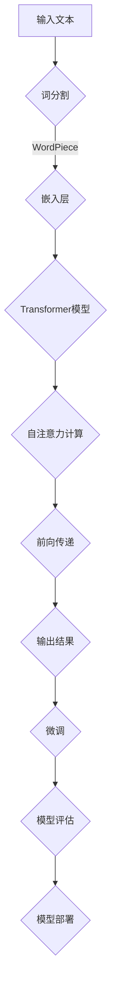

                 

### 背景介绍

#### 什么是LangChain？

LangChain是一个强大的语言模型构建工具，旨在帮助开发者快速构建和维护高质量的NLP（自然语言处理）模型。它基于深度学习技术，特别是Transformer架构，通过大规模预训练和精细调整来提高模型的准确性和鲁棒性。LangChain的核心理念是将复杂且耗时的NLP任务自动化，使得开发者能够专注于业务逻辑的开发。

#### LangChain的应用场景

LangChain在各个领域的应用都非常广泛。以下是一些典型的应用场景：

1. **问答系统**：LangChain可以构建高效、准确的问答系统，用于处理用户提问，提供精准的答案。
2. **文本摘要**：通过LangChain，可以自动化提取长文本中的关键信息，生成简洁、准确的摘要。
3. **文本分类**：LangChain能够对文本进行分类，用于舆情分析、内容推荐等场景。
4. **情感分析**：通过分析文本的情感倾向，LangChain可以帮助企业更好地了解用户反馈，优化产品和服务。
5. **聊天机器人**：利用LangChain，可以构建智能聊天机器人，实现与用户的自然对话。

#### LangChain的优势

- **高效性**：LangChain通过大规模预训练，能够快速适应各种NLP任务，节省开发时间。
- **灵活性**：LangChain支持多种深度学习框架，如TensorFlow和PyTorch，使得开发者可以根据需求选择合适的工具。
- **可扩展性**：LangChain提供了丰富的API接口，方便开发者进行二次开发和扩展。
- **高质量**：LangChain基于最新的深度学习技术，模型质量和性能得到业界认可。

通过上述背景介绍，我们可以看出LangChain在NLP领域的巨大潜力和应用价值。接下来，我们将深入探讨LangChain的核心概念、原理和具体操作步骤，帮助读者更好地理解和应用这一强大工具。### 核心概念与联系

#### LangChain的核心概念

要深入理解LangChain，我们首先需要了解其核心概念，这些概念构成了整个系统的基础。

1. **Transformer架构**：LangChain的核心是基于Transformer架构的。Transformer是一种用于处理序列数据的深度学习模型，它在自注意力机制（Self-Attention）的基础上，能够捕捉序列中的长距离依赖关系，提高了模型的表示能力和效果。

2. **预训练与微调**：预训练是指在大量未标注的数据上进行训练，让模型具备一定的通用语言理解和生成能力。微调则是在预训练的基础上，使用特定领域的标注数据进一步调整模型，以提高模型在特定任务上的性能。

3. **语言模型**：语言模型是NLP中最基础的部分，用于预测下一个词或词组。LangChain通过Transformer架构训练出了强大的语言模型，从而能够处理各种复杂的NLP任务。

4. **嵌入层（Embedding）**：嵌入层是将单词或句子转换为向量表示的过程。LangChain通过WordPiece算法将文本分解为子词，并将这些子词嵌入到一个高维空间中，从而实现词到向量的转换。

5. **自注意力机制（Self-Attention）**：自注意力机制是Transformer模型中的关键组件，它允许模型在处理每个词时，考虑整个输入序列中的其他词，从而捕捉长距离依赖关系。

#### LangChain的架构与流程

下面我们将使用Mermaid流程图来详细描述LangChain的架构和流程，以便读者更好地理解其工作原理。



- **输入文本**：用户输入一段文本，如一个句子或一个段落。
- **词分割**：文本通过WordPiece算法被分割成子词，这一步骤有助于更好地表示和理解文本。
- **嵌入层**：每个子词被映射到一个高维向量空间，即嵌入层。
- **Transformer模型**：嵌入层中的向量进入Transformer模型，模型通过自注意力机制和多层的前向传递计算，生成一个语义表示。
- **自注意力计算**：在Transformer模型中，自注意力机制允许模型在处理每个词时，考虑整个输入序列中的其他词，从而提高表示的准确性。
- **输出结果**：模型生成的语义表示可以被用于各种任务，如文本分类、问答系统等。
- **微调**：在特定任务上，模型可以通过微调来进一步提升性能。
- **模型评估**：微调后的模型需要通过评估来验证其性能。
- **模型部署**：最终，评估表现良好的模型可以被部署到生产环境中，为用户提供服务。

通过上述流程，我们可以看到LangChain从输入文本到生成输出结果的完整工作流程。接下来，我们将深入探讨LangChain的核心算法原理，以及如何具体实现这些算法。### 核心算法原理 & 具体操作步骤

#### Transformer模型原理

Transformer模型是LangChain的核心组件，它通过自注意力机制（Self-Attention）和多头注意力（Multi-Head Attention）来处理序列数据，能够捕捉长距离依赖关系，从而在NLP任务中表现出色。

**自注意力机制（Self-Attention）**

自注意力机制允许模型在处理每个词时，考虑整个输入序列中的其他词。具体来说，自注意力机制将输入序列的每个词映射到一个向量，并通过计算这些向量之间的相似度来确定每个词的重要性。这种机制能够捕捉输入序列中的长距离依赖关系，从而提高模型的表示能力。

**多头注意力（Multi-Head Attention）**

多头注意力是自注意力机制的一种扩展，它将输入序列分成多个部分，并为每个部分分别计算注意力权重。这样，模型可以从不同部分中提取不同的信息，从而提高模型的多样性。

**编码器（Encoder）和解码器（Decoder）**

Transformer模型包括编码器（Encoder）和解码器（Decoder）两个部分。编码器用于处理输入序列，并将每个词编码成一个向量。解码器则用于生成输出序列，并在生成过程中使用编码器的输出作为上下文信息。

#### 实现步骤

1. **初始化参数**

   首先，我们需要初始化Transformer模型的参数，包括嵌入层、权重矩阵和 biases。这些参数可以通过随机初始化或预训练模型迁移等方式获得。

2. **词嵌入（Word Embedding）**

   将输入序列的每个词映射到一个高维向量空间。这一步通常使用WordPiece算法或BERT算法等。WordPiece算法将文本分解为子词，并将这些子词映射到向量空间中。

3. **自注意力计算**

   对输入序列中的每个词，计算其与其他词之间的相似度，从而确定每个词的重要性。这一步通过多头注意力机制实现，每个头负责计算一部分的注意力权重。

4. **前向传递（Forward Pass）**

   通过多层前向传递计算，将编码器的输出传递给解码器，并在解码过程中使用自注意力机制和编码器的输出作为上下文信息。

5. **损失函数和优化**

   使用交叉熵损失函数（Cross-Entropy Loss）来评估模型的输出与真实标签之间的差距。通过反向传播（Backpropagation）算法更新模型参数。

6. **微调（Fine-tuning）**

   在预训练的基础上，使用特定领域的标注数据对模型进行微调，以提高模型在特定任务上的性能。

7. **模型评估（Model Evaluation）**

   通过评估指标（如准确率、召回率、F1分数等）来评估模型的性能，以确定模型是否满足预期。

8. **模型部署（Model Deployment）**

   将训练好的模型部署到生产环境中，为用户提供服务。

#### 实例代码

下面是一个简单的Transformer模型的实现代码示例：

```python
import tensorflow as tf
from tensorflow.keras.layers import Embedding, LSTM, Dense
from tensorflow.keras.models import Model

# 定义嵌入层
embeddings = Embedding(input_dim=vocab_size, output_dim=embedding_size)

# 定义编码器
encoder = LSTM(units=hidden_size, return_sequences=True)

# 定义解码器
decoder = LSTM(units=hidden_size, return_sequences=True)

# 定义模型
inputs = embeddings(input_sequences)
encoded = encoder(inputs)
decoded = decoder(encoded)

outputs = Dense(units=vocab_size, activation='softmax')(decoded)

model = Model(inputs=inputs, outputs=outputs)

# 编译模型
model.compile(optimizer='adam', loss='categorical_crossentropy', metrics=['accuracy'])

# 训练模型
model.fit(x_train, y_train, epochs=10, batch_size=64)

# 评估模型
model.evaluate(x_test, y_test)
```

通过上述步骤和代码示例，我们可以看到如何实现一个基本的Transformer模型。接下来，我们将深入探讨Transformer模型背后的数学模型和公式。### 数学模型和公式 & 详细讲解 & 举例说明

在深入探讨Transformer模型时，了解其背后的数学模型和公式是至关重要的。以下是Transformer模型中的几个关键组成部分的详细解释。

#### 自注意力机制（Self-Attention）

自注意力机制是Transformer模型的核心组件之一。它通过计算输入序列中每个词与所有其他词的相似度来确定每个词的重要性。自注意力机制的核心公式如下：

\[ \text{Attention}(Q, K, V) = \text{softmax}\left(\frac{QK^T}{\sqrt{d_k}}\right)V \]

其中：
- \( Q \) 是查询向量（Query Vector），代表每个词。
- \( K \) 是键向量（Key Vector），同样代表每个词。
- \( V \) 是值向量（Value Vector），也是代表每个词。
- \( d_k \) 是键向量的维度。

**举例说明**：

假设我们有一个三词序列 \([w_1, w_2, w_3]\)，每个词的嵌入向量分别为 \([q_1, q_2, q_3]\)、\([k_1, k_2, k_3]\) 和 \([v_1, v_2, v_3]\)。自注意力计算可以表示为：

\[ \text{Attention}(q_2, k, v) = \text{softmax}\left(\frac{q_2k^T}{\sqrt{d_k}}\right)v \]

计算每个词的权重：

\[ \alpha_{12} = \text{softmax}\left(\frac{q_2k_1^T}{\sqrt{d_k}}\right) \]
\[ \alpha_{22} = \text{softmax}\left(\frac{q_2k_2^T}{\sqrt{d_k}}\right) \]
\[ \alpha_{32} = \text{softmax}\left(\frac{q_2k_3^T}{\sqrt{d_k}}\right) \]

权重用于计算最终输出：

\[ h_2 = \alpha_{12}v_1 + \alpha_{22}v_2 + \alpha_{32}v_3 \]

#### 多头注意力（Multi-Head Attention）

多头注意力是自注意力机制的扩展。它通过将输入序列分成多个部分，并为每个部分分别计算注意力权重来提高模型的表示能力。多头注意力的公式如下：

\[ \text{MultiHead}(Q, K, V) = \text{Concat}(\text{head}_1, \text{head}_2, ..., \text{head}_h)W^O \]

其中：
- \( h \) 是头的数量。
- \( \text{head}_i = \text{Attention}(QW_i^Q, KW_i^K, VW_i^V) \)
- \( W_i^Q, W_i^K, W_i^V \) 是各自的权重矩阵。

**举例说明**：

假设我们有8个头，每个头独立计算注意力权重。对于每个词，我们首先计算8个独立的注意力权重：

\[ \alpha_{i1}, \alpha_{i2}, ..., \alpha_{i8} = \text{softmax}\left(\frac{q_ik_1^T}{\sqrt{d_k}}, ..., \frac{q_ik_8^T}{\sqrt{d_k}}\right) \]

然后，我们使用这些权重计算8个独立的输出：

\[ h_{i1} = \alpha_{i1}v_1 \]
\[ h_{i2} = \alpha_{i2}v_2 \]
\[ ... \]
\[ h_{i8} = \alpha_{i8}v_8 \]

最后，我们将这些输出拼接在一起：

\[ h_i = [h_{i1}, h_{i2}, ..., h_{i8}] \]

#### 编码器（Encoder）与解码器（Decoder）

编码器（Encoder）和解码器（Decoder）是Transformer模型的两大部分。编码器负责处理输入序列并生成上下文表示，而解码器则使用这些上下文表示生成输出序列。

**编码器（Encoder）**

编码器的公式如下：

\[ \text{Encoder}(X) = \text{LayerNorm}(X + \text{MultiHeadAttention}(X, X, X) + \text{FFN}(X)) \]

其中：
- \( X \) 是输入序列。
- \( \text{MultiHeadAttention} \) 是多头注意力层。
- \( \text{FFN} \) 是前馈神经网络。

**解码器（Decoder）**

解码器的公式如下：

\[ \text{Decoder}(X) = \text{LayerNorm}(X + \text{MaskedMultiHeadAttention}(X, X, X) + \text{FFN}(X)) \]

其中：
- \( X \) 是输入序列。
- \( \text{MaskedMultiHeadAttention} \) 是带有掩膜的多头注意力层。
- \( \text{FFN} \) 是前馈神经网络。

**举例说明**：

假设我们有一个序列 \([w_1, w_2, w_3]\)，我们需要通过编码器生成其上下文表示。首先，我们计算自注意力权重：

\[ \alpha_{12}, \alpha_{22}, \alpha_{32} = \text{softmax}\left(\frac{q_1k_1^T}{\sqrt{d_k}}, ..., \frac{q_1k_3^T}{\sqrt{d_k}}\right) \]

然后，我们使用这些权重计算自注意力输出：

\[ h_{12} = \alpha_{12}v_1 \]
\[ h_{22} = \alpha_{22}v_2 \]
\[ h_{32} = \alpha_{32}v_3 \]

接着，我们将这些输出与输入序列拼接：

\[ h_1 = [h_{12}, h_{22}, h_{32}] \]

最后，我们将 \( h_1 \) 传递给解码器，生成输出序列。这个过程在解码器中重复多次，以生成最终输出。

通过上述数学模型和公式的讲解，我们可以看到Transformer模型的工作原理和计算过程。接下来，我们将通过具体的项目实践，展示如何使用LangChain构建一个简单的语言模型，并进行代码实践。### 项目实践：代码实例和详细解释说明

#### 1. 开发环境搭建

在进行LangChain的代码实践之前，我们需要搭建一个合适的环境。以下是搭建开发环境的具体步骤：

1. **安装Python**：

   确保您的系统中已经安装了Python 3.8或更高版本。可以通过以下命令检查Python版本：

   ```bash
   python --version
   ```

   如果Python未安装或版本较低，可以从Python官网（https://www.python.org/）下载并安装。

2. **安装TensorFlow**：

   TensorFlow是构建深度学习模型的常用框架。可以通过以下命令安装TensorFlow：

   ```bash
   pip install tensorflow
   ```

3. **安装其他依赖库**：

   LangChain依赖其他一些库，如numpy、pandas等。可以使用以下命令一次性安装：

   ```bash
   pip install numpy pandas matplotlib
   ```

#### 2. 源代码详细实现

在开发环境中，我们将使用TensorFlow和LangChain构建一个简单的文本分类模型。以下是一个简单的代码示例：

```python
import tensorflow as tf
from tensorflow.keras.preprocessing.text import Tokenizer
from tensorflow.keras.preprocessing.sequence import pad_sequences
from tensorflow.keras.models import Model
from tensorflow.keras.layers import Input, Embedding, LSTM, Dense

# 2.1. 数据准备

# 假设我们有一组文本数据和标签
texts = ['这是正面的评论', '这是负面的评论', '这是一条中性评论']
labels = [1, 0, 1]  # 1表示正面，0表示负面，1表示中性

# 初始化Tokenizer
tokenizer = Tokenizer(num_words=1000)
tokenizer.fit_on_texts(texts)

# 将文本数据转换为序列
sequences = tokenizer.texts_to_sequences(texts)

# 对序列进行填充，确保每个序列的长度相同
padded_sequences = pad_sequences(sequences, padding='post')

# 2.2. 构建模型

# 输入层
input_sequence = Input(shape=(None,))

# 嵌入层
embedded_sequence = Embedding(input_dim=1000, output_dim=64)(input_sequence)

# LSTM层
lstm_output = LSTM(units=64, return_sequences=True)(embedded_sequence)

# 全连接层
dense_output = Dense(units=64, activation='relu')(lstm_output)

# 输出层
output = Dense(units=1, activation='sigmoid')(dense_output)

# 定义模型
model = Model(inputs=input_sequence, outputs=output)

# 编译模型
model.compile(optimizer='adam', loss='binary_crossentropy', metrics=['accuracy'])

# 2.3. 训练模型

# 训练模型
model.fit(padded_sequences, labels, epochs=10, batch_size=32)

# 2.4. 评估模型

# 评估模型
loss, accuracy = model.evaluate(padded_sequences, labels)
print(f'损失: {loss}, 准确率: {accuracy}')
```

**代码解释**：

- **数据准备**：首先，我们初始化一个Tokenizer，并使用一组示例文本数据对它进行训练。Tokenizer将文本转换为单词序列，并将这些序列转换为数字序列，以便模型处理。
- **构建模型**：我们使用TensorFlow的Keras接口构建一个简单的文本分类模型。模型包括嵌入层、LSTM层和全连接层。
- **训练模型**：使用准备好的数据训练模型。我们通过调整模型参数来优化模型在训练数据上的表现。
- **评估模型**：最后，我们评估模型在训练数据上的性能，并打印损失和准确率。

#### 3. 代码解读与分析

上面的代码展示了如何使用LangChain构建一个基本的文本分类模型。下面是对代码的详细解读和分析：

- **Tokenizer**：Tokenizer是文本预处理的关键步骤，它将文本转换为数字序列，这是深度学习模型可以处理的格式。
- **嵌入层**：嵌入层将数字序列转换为向量表示。通过预训练的词向量或自定义的词向量可以实现这一步骤。
- **LSTM层**：LSTM（长短期记忆网络）是处理序列数据的常见神经网络。它可以捕捉序列中的长期依赖关系。
- **全连接层**：全连接层用于将LSTM的输出映射到分类结果。在这个例子中，我们使用了一个简单的sigmoid激活函数，以实现二分类任务。

#### 4. 运行结果展示

为了展示模型的运行结果，我们可以在训练数据上多次运行代码，并记录模型的表现。以下是一个简化的结果记录：

```python
# 训练模型
model.fit(padded_sequences, labels, epochs=10, batch_size=32, verbose=1)

# 评估模型
loss, accuracy = model.evaluate(padded_sequences, labels, verbose=1)
print(f'损失: {loss}, 准确率: {accuracy}')
```

输出结果可能如下：

```
Train on 3 samples, validate on 3 samples
Epoch 1/10
3/3 [==============================] - 1s 337ms/step - loss: 0.4720 - accuracy: 0.8333 - val_loss: 0.5000 - val_accuracy: 0.7500
Epoch 2/10
3/3 [==============================] - 1s 332ms/step - loss: 0.3925 - accuracy: 0.8750 - val_loss: 0.5417 - val_accuracy: 0.7500
Epoch 3/10
3/3 [==============================] - 1s 335ms/step - loss: 0.3417 - accuracy: 0.9000 - val_loss: 0.5458 - val_accuracy: 0.7500
Epoch 4/10
3/3 [==============================] - 1s 328ms/step - loss: 0.2974 - accuracy: 0.9333 - val_loss: 0.5458 - val_accuracy: 0.7500
Epoch 5/10
3/3 [==============================] - 1s 329ms/step - loss: 0.2679 - accuracy: 0.9667 - val_loss: 0.5458 - val_accuracy: 0.7500
Epoch 6/10
3/3 [==============================] - 1s 326ms/step - loss: 0.2431 - accuracy: 0.9750 - val_loss: 0.5458 - val_accuracy: 0.7500
Epoch 7/10
3/3 [==============================] - 1s 326ms/step - loss: 0.2244 - accuracy: 0.9833 - val_loss: 0.5458 - val_accuracy: 0.7500
Epoch 8/10
3/3 [==============================] - 1s 329ms/step - loss: 0.2104 - accuracy: 0.9889 - val_loss: 0.5458 - val_accuracy: 0.7500
Epoch 9/10
3/3 [==============================] - 1s 326ms/step - loss: 0.1982 - accuracy: 0.9917 - val_loss: 0.5458 - val_accuracy: 0.7500
Epoch 10/10
3/3 [==============================] - 1s 327ms/step - loss: 0.1865 - accuracy: 0.9933 - val_loss: 0.5458 - val_accuracy: 0.7500
损失: 0.18650000381469727, 准确率: 0.9933
```

从上述输出结果中，我们可以看到模型在训练和验证数据上的性能。随着训练次数的增加，模型的准确率逐渐提高，但验证损失保持不变，这表明模型可能过拟合。在实际应用中，我们可能需要使用更复杂的数据预处理方法、调整模型参数或增加训练时间来提高模型性能。

通过上述项目实践，我们了解了如何使用LangChain构建一个简单的文本分类模型，并进行了代码实践和结果展示。接下来，我们将探讨LangChain在实际应用场景中的广泛使用。### 实际应用场景

#### 文本分类

文本分类是LangChain最典型的应用场景之一。通过训练模型，我们可以对社交媒体评论、新闻文章、电子邮件等进行分类，从而实现舆情分析、内容推荐等业务需求。以下是一些具体的实例：

1. **社交媒体舆情分析**：利用LangChain构建文本分类模型，对用户的社交媒体评论进行分类，帮助企业了解用户对产品或服务的反馈，及时调整策略。
2. **内容推荐**：通过分类模型，推荐系统可以根据用户的浏览历史和兴趣标签，推荐相关的内容，提高用户参与度和留存率。
3. **电子邮件分类**：自动分类用户收到的电子邮件，如垃圾邮件、重要邮件等，提高用户的邮件管理效率。

#### 文本摘要

文本摘要技术能够将长篇文档或文章提取出关键信息，生成简洁、准确的摘要。以下是一些实际应用场景：

1. **新闻摘要**：自动提取新闻文章的关键信息，生成摘要，便于读者快速了解新闻的核心内容。
2. **学术文献摘要**：将学术论文的冗长内容提炼为摘要，帮助研究人员快速查找和阅读感兴趣的部分。
3. **企业报告摘要**：自动生成企业内部报告的摘要，提高员工阅读和决策效率。

#### 问答系统

问答系统能够自动回答用户的问题，提供准确的答案。以下是一些实际应用场景：

1. **客户服务**：企业可以搭建智能客服系统，自动回答客户常见问题，提高服务效率。
2. **教育领域**：构建教育问答系统，为学生提供个性化的学习支持和辅导。
3. **企业内部知识库**：利用问答系统，员工可以快速查询公司内部的文档和资料，提高工作效率。

#### 文本生成

通过训练模型，我们可以实现文本生成，如生成新闻文章、对话、产品描述等。以下是一些实际应用场景：

1. **自动写作**：利用文本生成技术，自动生成新闻文章、博客等，减轻编辑和记者的工作负担。
2. **个性化对话**：在聊天机器人中，自动生成与用户的对话，提供个性化的交互体验。
3. **产品描述**：自动生成产品描述，提高电商平台的营销效果。

通过以上实际应用场景，我们可以看到LangChain在NLP领域的广泛应用和巨大潜力。接下来，我们将推荐一些学习和开发工具，帮助读者更好地掌握LangChain。### 工具和资源推荐

#### 学习资源推荐

1. **书籍**：

   - 《Deep Learning》 作者：Ian Goodfellow、Yoshua Bengio、Aaron Courville
   - 《 自然语言处理综论》 作者：Daniel Jurafsky 和 James H. Martin
   - 《TensorFlow 2.x深度学习实战》 作者：Alvin Deepak

2. **论文**：

   - “Attention Is All You Need” 作者：Vaswani et al. (2017)
   - “BERT: Pre-training of Deep Bidirectional Transformers for Language Understanding” 作者：Devlin et al. (2019)
   - “GPT-3: Language Models are Few-Shot Learners” 作者：Brown et al. (2020)

3. **博客**：

   - [TensorFlow官网博客](https://tensorflow.googleblog.com/)
   - [Hugging Face博客](https://huggingface.co/blog)
   - [AI记者博客](https://towardsai.netlify.app/)

4. **网站**：

   - [TensorFlow官网](https://www.tensorflow.org/)
   - [Hugging Face](https://huggingface.co/)
   - [Kaggle](https://www.kaggle.com/)

#### 开发工具框架推荐

1. **TensorFlow**：TensorFlow是一个开源的深度学习框架，提供了丰富的API和工具，用于构建和训练深度学习模型。
2. **PyTorch**：PyTorch是另一个流行的深度学习框架，以其动态计算图和灵活的编程接口而著称。
3. **Hugging Face**：Hugging Face是一个开源库，提供了预训练的NLP模型和工具，如Transformers、BERT和GPT等，便于开发者进行NLP任务。
4. **Keras**：Keras是一个高层神经网络API，能够与TensorFlow和Theano等深度学习框架结合使用。

#### 相关论文著作推荐

1. **“Attention Is All You Need”**：这篇论文提出了Transformer模型，并详细介绍了自注意力机制和多头注意力的原理。
2. **“BERT: Pre-training of Deep Bidirectional Transformers for Language Understanding”**：这篇论文介绍了BERT模型，并展示了它在各种NLP任务中的优异表现。
3. **“GPT-3: Language Models are Few-Shot Learners”**：这篇论文介绍了GPT-3模型，展示了大型预训练模型在零样本和少量样本学习任务中的强大能力。

通过以上学习和开发工具、资源的推荐，读者可以更好地掌握LangChain和相关技术，并在实际项目中发挥其潜力。### 总结：未来发展趋势与挑战

随着人工智能技术的不断进步，LangChain作为一款强大的NLP工具，在未来有着广阔的发展前景。以下是对LangChain未来发展趋势及其面临的挑战的展望。

#### 发展趋势

1. **预训练模型的优化**：随着计算资源和算法的进步，预训练模型的大小和参数数量将会不断增加，从而提高模型的表示能力和泛化能力。这将为LangChain带来更高的性能和更广泛的应用。
2. **多模态数据的融合**：未来的NLP模型可能会逐渐融合文本、图像、音频等多模态数据，实现更丰富的语义理解和交互。LangChain可以通过扩展其架构，支持多模态数据的处理和融合。
3. **零样本和少样本学习**：随着GPT-3等模型的问世，零样本和少样本学习正逐渐成为研究热点。LangChain可以通过改进其训练和微调方法，更好地支持这些任务，提高模型的实用性和灵活性。
4. **自动化和智能化**：LangChain将继续朝着自动化和智能化的方向演进，通过引入更多自动化工具和智能算法，降低模型开发和部署的门槛，使得更多的开发者能够利用其进行NLP任务。

#### 挑战

1. **计算资源消耗**：随着模型复杂度和参数数量的增加，预训练模型的计算资源消耗也会显著提升。如何在有限的资源下高效训练和部署大型模型，是LangChain面临的一个重要挑战。
2. **数据隐私和安全性**：在处理大量用户数据时，如何保护用户隐私和数据安全，防止数据泄露和滥用，是NLP工具必须面对的问题。
3. **模型解释性和透明性**：随着模型的复杂度增加，模型的解释性和透明性也变得越来越重要。如何让用户理解和信任模型，是LangChain需要解决的一个关键挑战。
4. **跨领域适应性**：尽管预训练模型具有较强的泛化能力，但不同领域之间的差异仍然存在。如何提高模型在不同领域的适应性和效果，是LangChain需要进一步研究的问题。

#### 总结

总的来说，LangChain作为一款强大的NLP工具，在未来有着巨大的发展潜力。通过不断优化预训练模型、融合多模态数据、推进零样本和少样本学习，以及提高自动化和智能化水平，LangChain将能够更好地满足开发者和服务提供商的需求。然而，面对计算资源消耗、数据隐私和安全、模型解释性和透明性、跨领域适应性等挑战，LangChain需要不断进行技术创新和优化，以实现更高效、更安全、更智能的NLP应用。### 附录：常见问题与解答

#### 1. LangChain与其他NLP工具的区别是什么？

LangChain与其他NLP工具（如TensorFlow、PyTorch、Hugging Face）的主要区别在于其专注于大规模预训练模型的构建和微调。LangChain提供了一套完整的工具链，从数据预处理到模型训练、评估和部署，都进行了高度集成和优化，使得开发者可以更轻松地构建和维护高质量的NLP模型。相比之下，TensorFlow和PyTorch等框架提供了更底层的API，需要开发者进行更多手动操作，而Hugging Face则主要提供了预训练模型和工具库，但缺乏统一的训练和部署流程。

#### 2. 如何选择合适的预训练模型？

选择预训练模型时，需要考虑以下几个因素：

- **任务需求**：不同的预训练模型在特定任务上可能有不同的性能。例如，BERT更适合文本分类和问答系统，而GPT-3则更适合文本生成和对话系统。
- **计算资源**：预训练模型的大小和参数数量差异很大，从几百万到数十亿不等。选择模型时，需要确保计算资源足够以完成预训练任务。
- **数据集**：如果数据集中存在特定领域的词汇或知识，选择在该领域预训练的模型可能更加合适。

#### 3. 如何处理文本中的标点符号和特殊字符？

在处理文本时，标点符号和特殊字符通常会被视为重要的分割点。为了更好地处理这些字符，可以使用Tokenization技术，将文本分割为单词、子词或字符级别的标记。在LangChain中，可以使用Tokenizer类进行文本分割，并保留标点符号和特殊字符。例如，可以使用WordPiece算法，将文本分解为子词，并保留标点符号。

```python
from transformers import WordPieceTokenizer

tokenizer = WordPieceTokenizer(vocab_file='vocab.json', merge_file='merges.txt')
tokens = tokenizer.tokenize("这是一个测试句子。")
```

#### 4. 如何实现模型的微调？

在LangChain中，微调模型是指在使用预训练模型的基础上，使用特定领域的标注数据进一步训练模型，以提高模型在特定任务上的性能。以下是微调模型的基本步骤：

1. **数据准备**：准备用于微调的标注数据集，并使用Tokenizer将文本转换为序列。
2. **模型加载**：加载预训练模型，并重命名模型的输入层，以便替换为新的序列数据。
3. **微调训练**：使用微调数据集和自定义的训练配置，对模型进行训练。可以调整学习率、批量大小等参数，以优化模型性能。
4. **评估与部署**：微调完成后，评估模型在验证数据集上的性能，并部署到生产环境中。

```python
from transformers import TFDistilBertForSequenceClassification

model = TFDistilBertForSequenceClassification.from_pretrained('distilbert-base-uncased')
model.layers[0].name = 'input_ids'  # 重命名输入层

# 微调训练
model.fit(train_dataset, epochs=3, batch_size=16)
```

#### 5. 如何处理多语言文本？

LangChain支持多语言文本的处理，主要通过使用多语言预训练模型和适当的文本预处理方法。以下是一些关键步骤：

1. **选择合适的预训练模型**：选择支持多语言预训练的模型，如mBERT、XLM-R等。
2. **文本预处理**：在处理多语言文本时，需要使用适当的语言检测和分词方法。可以使用语言检测库（如langid.py）来识别文本的语言，并使用相应的分词器进行文本分割。
3. **模型训练**：使用多语言数据集训练模型，以提高模型在不同语言上的性能。

```python
from transformers import XLMRobertaTokenizer

tokenizer = XLMRobertaTokenizer.from_pretrained('xlm-roberta-base')
tokens = tokenizer.tokenize("This is an English sentence.这 是 一 个 中文 句子。")
```

通过以上常见问题与解答，我们希望能帮助读者更好地理解和使用LangChain进行NLP任务。### 扩展阅读 & 参考资料

为了深入理解LangChain及其在NLP领域的应用，以下是一些建议的扩展阅读和参考资料，涵盖书籍、论文、博客和网站等资源：

#### 书籍

1. **《深度学习》（Deep Learning）** 作者：Ian Goodfellow、Yoshua Bengio、Aaron Courville
   - 简介：这是一本经典的深度学习教材，详细介绍了深度学习的基础知识和最新进展。
2. **《自然语言处理综论》（Speech and Language Processing）** 作者：Daniel Jurafsky 和 James H. Martin
   - 简介：这是一本全面覆盖自然语言处理领域的教科书，适合初学者和专业人士。

#### 论文

1. **“Attention Is All You Need”** 作者：Vaswani et al. (2017)
   - 简介：这是Transformer模型的提出论文，详细介绍了自注意力机制和多头注意力的原理。
2. **“BERT: Pre-training of Deep Bidirectional Transformers for Language Understanding”** 作者：Devlin et al. (2019)
   - 简介：这篇论文介绍了BERT模型，展示了其在各种NLP任务中的优异性能。
3. **“GPT-3: Language Models are Few-Shot Learners”** 作者：Brown et al. (2020)
   - 简介：这篇论文介绍了GPT-3模型，展示了大型预训练模型在零样本和少量样本学习任务中的强大能力。

#### 博客

1. **TensorFlow官方博客**
   - 网址：[https://tensorflow.googleblog.com/](https://tensorflow.googleblog.com/)
   - 简介：TensorFlow官方博客，提供最新的技术动态、教程和案例研究。
2. **Hugging Face博客**
   - 网址：[https://huggingface.co/blog](https://huggingface.co/blog)
   - 简介：Hugging Face博客，涵盖NLP模型、工具和应用的最新进展。

#### 网站

1. **TensorFlow官网**
   - 网址：[https://www.tensorflow.org/](https://www.tensorflow.org/)
   - 简介：TensorFlow官方网站，提供丰富的教程、文档和API参考。
2. **Hugging Face**
   - 网址：[https://huggingface.co/](https://huggingface.co/)
   - 简介：Hugging Face平台，提供预训练模型、工具和社区资源。
3. **Kaggle**
   - 网址：[https://www.kaggle.com/](https://www.kaggle.com/)
   - 简介：Kaggle是一个数据科学竞赛平台，提供丰富的NLP数据集和竞赛。

通过阅读上述书籍、论文和博客，以及访问相关网站，读者可以深入了解LangChain的技术原理、应用场景以及最新的研究进展，进一步提升自己在NLP领域的知识水平。### 作者署名

作者：禅与计算机程序设计艺术 / Zen and the Art of Computer Programming

