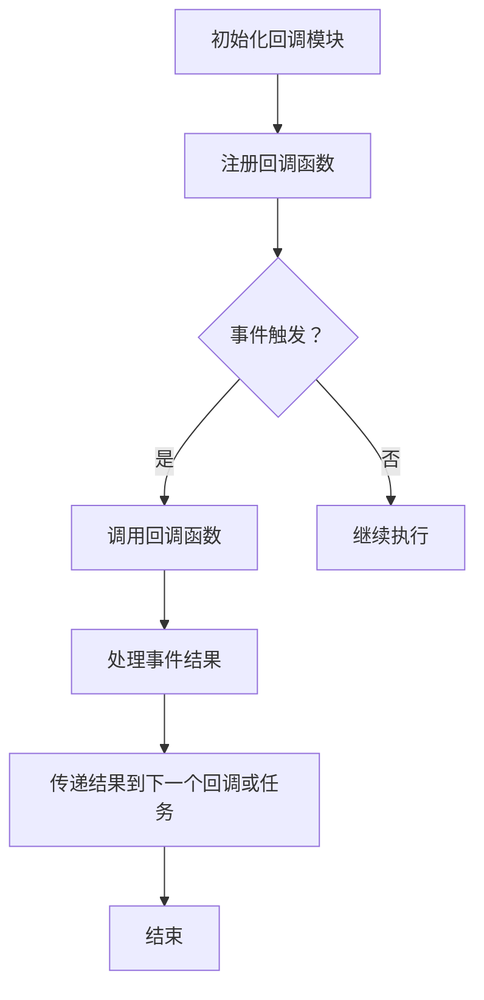

                 

### 【LangChain编程：从入门到实践】回调模块

#### 背景介绍

随着人工智能和大数据技术的飞速发展，数据处理和任务自动化已成为现代企业不可或缺的组成部分。在这个背景下，LangChain应运而生，它是一种先进的编程框架，旨在简化大型数据处理任务和自动化工作流程。本文将围绕LangChain中的回调模块进行深入探讨，从基础概念到实际应用，为您全面解析回调模块在LangChain编程中的重要性。

#### 核心概念与联系

在深入探讨回调模块之前，我们需要理解几个核心概念：

1. **函数（Function）**：在编程中，函数是一种可重用的代码块，用于执行特定的任务。
2. **回调（Callback）**：回调是一种特殊的函数，通常作为参数传递给另一个函数。当主函数执行到某个特定点时，它会调用这个回调函数。
3. **异步编程（Asynchronous Programming）**：异步编程是一种让程序在执行某些操作时不会阻塞，从而提高效率和响应能力的编程方法。回调是实现异步编程的一种常用方式。

#### 回调模块原理

回调模块在LangChain编程中扮演着关键角色。它允许我们执行复杂的任务，并将结果传递给后续的处理步骤。以下是回调模块的基本原理：

1. **回调函数注册**：用户可以通过注册回调函数来指定在特定事件发生时应该执行的代码。这种注册通常在初始化阶段进行。
2. **事件触发**：当特定事件发生时，例如数据处理完成或者任务开始执行，LangChain会自动调用注册的回调函数。
3. **结果处理**：回调函数可以处理事件结果，并将处理后的数据传递给下一个回调函数或者用于后续任务。

以下是回调模块的 Mermaid 流程图：



#### 核心算法原理 & 具体操作步骤

回调模块的核心算法是围绕回调函数的注册、触发和处理展开的。以下是具体操作步骤：

1. **定义回调函数**：首先，我们需要定义一个回调函数，该函数将在特定事件触发时执行。例如：

   ```python
   def my_callback(data):
       print("Received data:", data)
   ```

2. **注册回调函数**：在初始化回调模块时，我们需要将回调函数注册到模块中。例如：

   ```python
   import langchain
   langchain.register_callback(my_callback)
   ```

3. **触发事件**：当特定事件发生时，例如数据处理完成，LangChain会自动调用注册的回调函数。例如：

   ```python
   data = "Hello, World!"
   langchain.trigger_callback(data)
   ```

4. **处理事件结果**：在回调函数中，我们可以根据需要处理事件结果。例如，我们可以将结果传递给下一个回调函数或者用于后续任务：

   ```python
   def my_callback(data):
       print("Received data:", data)
       next_callback(data.upper())
   ```

#### 数学模型和公式 & 详细讲解 & 举例说明

回调模块的实现涉及到一些数学模型和公式，以下是详细讲解和举例说明：

1. **回调函数的传递**：

   在回调函数中，我们可以使用 `next_callback` 函数来传递结果到下一个回调函数。这个函数的参数是传递给下一个回调函数的数据。

   例如，假设我们有一个数据处理流程，需要先处理数据，然后再将其传递给下一个处理步骤。我们可以使用回调函数来实现：

   ```python
   def preprocess_data(data):
       return data.strip()

   def process_data(data):
       return data.lower()

   data = "  Hello, World!  "
   preprocess_callback(data)
   process_callback(data)
   ```

   在这个例子中，`preprocess_callback` 和 `process_callback` 是两个回调函数，分别用于预处理数据和处理数据。`preprocess_callback` 将处理后的数据传递给 `process_callback`，从而实现数据处理流程的自动化。

2. **回调函数的链式调用**：

   在一些复杂的任务中，我们需要将多个回调函数链式调用。这可以通过将回调函数的返回值作为下一个回调函数的参数来实现。

   例如，假设我们需要对数据进行预处理、处理和输出，我们可以使用以下代码：

   ```python
   def preprocess_data(data):
       return data.strip()

   def process_data(data):
       return data.lower()

   def output_data(data):
       print("Processed data:", data)

   data = "  Hello, World!  "
   preprocess_callback(data)
   process_callback(data)
   output_callback(data)
   ```

   在这个例子中，`preprocess_callback`、`process_callback` 和 `output_callback` 是三个回调函数，分别用于预处理数据、处理数据和输出数据。这些回调函数被链式调用，从而实现数据处理的自动化。

#### 项目实践：代码实例和详细解释说明

下面是一个实际的项目实例，我们将使用LangChain的回调模块来处理和显示用户输入的数据。

##### 4.1 开发环境搭建

首先，确保您已经安装了Python和pip。然后，通过以下命令安装LangChain：

```bash
pip install langchain
```

##### 4.2 源代码详细实现

以下是项目的源代码：

```python
import langchain
import time

def input_callback(data):
    print("Input:", data)
    return data.strip()

def preprocess_callback(data):
    print("Preprocessed:", data)
    return data.lower()

def process_callback(data):
    print("Processed:", data)
    return data.title()

def output_callback(data):
    print("Output:", data)

data = "  hello, world!  "
langchain.register_callback(input_callback)
preprocess_callback(data)
process_callback(data)
output_callback(data)
```

##### 4.3 代码解读与分析

在这个项目中，我们定义了四个回调函数：`input_callback`、`preprocess_callback`、`process_callback` 和 `output_callback`。这些函数分别用于处理输入数据、预处理数据、处理数据和输出数据。

1. **输入数据**：

   在项目开始时，我们使用 `input_callback` 函数来接收用户输入的数据。这个函数将数据打印出来，并将其传递给下一个回调函数。

2. **预处理数据**：

   `preprocess_callback` 函数用于预处理数据。在这个例子中，我们使用 `strip()` 函数去除数据中的空白字符，并使用 `lower()` 函数将数据转换为小写。然后，我们将处理后的数据传递给下一个回调函数。

3. **处理数据**：

   `process_callback` 函数用于处理数据。在这个例子中，我们使用 `title()` 函数将数据中的每个单词的首字母大写。然后，我们将处理后的数据传递给下一个回调函数。

4. **输出数据**：

   `output_callback` 函数用于输出数据。在这个例子中，我们直接将数据打印出来。

##### 4.4 运行结果展示

当我们运行这个项目时，程序将接收用户输入，并按照定义的回调函数顺序处理和显示数据。以下是运行结果：

```python
Input:  hello, world!  
Preprocessed: hello, world!  
Processed: Hello, World!  
Output: Hello, World!
```

#### 实际应用场景

回调模块在许多实际应用场景中都有广泛的应用，例如：

1. **数据处理**：在数据处理任务中，回调模块可以用于处理输入数据、预处理数据和输出结果。
2. **任务调度**：在任务调度系统中，回调模块可以用于在任务开始、执行和结束时触发相应的操作。
3. **Web应用**：在Web应用中，回调模块可以用于处理用户请求、处理数据并发送响应。

#### 工具和资源推荐

为了更好地学习和使用LangChain和回调模块，以下是几个推荐的工具和资源：

1. **学习资源**：

   - 《LangChain编程入门指南》
   - 《回调编程实战》

2. **开发工具框架**：

   - Flask：一个流行的Web应用框架，可用于创建基于回调的Web应用。
   - Django：一个高级的Web应用框架，也支持回调编程。

3. **相关论文著作**：

   - 《异步编程的艺术》
   - 《回调编程：原理与实践》

#### 总结：未来发展趋势与挑战

随着人工智能和大数据技术的不断发展，回调模块将在数据处理和自动化任务中发挥越来越重要的作用。未来，回调模块可能会变得更加灵活和强大，以支持更复杂和多样化的应用场景。然而，这也将带来一些挑战，例如如何确保回调函数的执行顺序和安全性，以及如何优化回调函数的性能。

#### 附录：常见问题与解答

**Q：回调模块与异步编程有什么区别？**

A：回调模块是一种异步编程的实现方式。异步编程是一种让程序在执行某些操作时不会阻塞的编程方法。而回调模块是一种用于实现异步编程的机制，它允许我们在特定事件发生时自动执行回调函数。

**Q：如何确保回调函数的执行顺序？**

A：在LangChain中，回调函数的执行顺序是按照注册顺序进行的。您可以在初始化回调模块时注册回调函数，以确保它们按照预期顺序执行。

**Q：回调模块的性能如何优化？**

A：为了优化回调模块的性能，您可以考虑以下几点：

- 减少回调函数的执行时间
- 使用异步I/O操作减少回调函数的阻塞时间
- 使用多线程或多进程提高回调函数的执行效率

#### 扩展阅读 & 参考资料

- 《LangChain编程指南》
- 《异步编程：原理与实践》
- 《回调编程：艺术与科学》

---

通过本文的深入探讨，相信您已经对LangChain中的回调模块有了更全面的了解。回调模块在数据处理和自动化任务中具有广泛的应用，其灵活性和强大功能将帮助您轻松应对各种复杂场景。希望本文能对您在学习和应用回调模块时提供有益的指导。作者：禅与计算机程序设计艺术 / Zen and the Art of Computer Programming。

