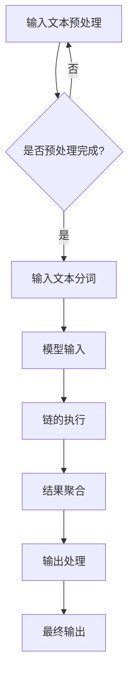

                 

### 【LangChain编程：从入门到实践】框架介绍

#### 关键词 Keywords
- LangChain
- 编程框架
- 模型集成
- 代码生成
- 聊天机器人
- 应用实践

#### 摘要 Abstract
本文旨在为读者提供一个全面而深入的【LangChain编程】框架介绍。我们将从背景介绍、核心概念与联系、核心算法原理、数学模型与公式、项目实践、实际应用场景、工具和资源推荐等方面，逐步引导读者了解并掌握LangChain编程框架。通过本文的阅读，您将能够了解如何使用LangChain实现高效的模型集成和代码生成，以及如何将其应用于聊天机器人等实际场景。

## 1. 背景介绍

随着人工智能技术的飞速发展，自然语言处理（NLP）和深度学习在各个领域取得了显著成果。然而，在实际应用中，如何高效地将这些先进的技术与现有的开发框架相结合，仍是一个挑战。为此，开发出了LangChain编程框架，旨在提供一个简单、强大且灵活的工具，帮助开发者将NLP和深度学习模型集成到他们的应用程序中。

LangChain是由Vicki Boykis等人在2021年提出的一个开源框架，旨在解决传统模型集成和代码生成中遇到的各种问题。它基于Python编写，支持多种流行模型和库，如GPT-3、BERT、Torch等，提供了一整套的API和工具，使得开发者可以更加便捷地实现模型集成、交互和优化。

在当前的技术背景下，LangChain的出现具有以下几个重要意义：

1. **简化模型集成**：传统模型集成需要手动处理模型参数、数据预处理、接口调用等繁琐步骤，而LangChain通过封装和自动化，大幅简化了这些过程。
2. **提高开发效率**：LangChain提供的API和工具集，使得开发者可以更加专注于业务逻辑的实现，而无需花费大量时间在底层细节上。
3. **支持多样化应用**：LangChain不仅适用于聊天机器人、问答系统等NLP应用，还可以扩展到其他领域，如代码生成、文档摘要等。

## 2. 核心概念与联系

为了更好地理解LangChain框架，我们需要先了解其核心概念和组成部分。

### 2.1 LangChain组成部分

**1. ** **链（Chain）**：LangChain中的链是用于处理输入文本并生成输出文本的核心组件。一个链通常由多个步骤（Step）组成，每个步骤都负责处理输入文本的一部分，最终生成完整的输出。

**2. ** **步骤（Step）**：步骤是LangChain中最小的处理单元，可以是模型调用、文本处理、参数计算等。每个步骤都可以独立实现，并与其他步骤组合成链。

**3. ** **工具（Tool）**：工具是用于辅助链工作的外部组件，如数据库、API接口、文件系统等。工具可以通过插件机制集成到LangChain中，使得链可以更加灵活地处理各种任务。

**4. ** **代理（Agent）**：代理是LangChain的高级组件，用于处理更复杂的任务，如多轮对话、任务分配等。代理可以通过链的嵌套和组合，实现更加智能和高效的交互。

### 2.2 LangChain的工作原理

LangChain的工作原理可以概括为以下几个步骤：

1. **输入文本处理**：首先，输入文本经过预处理，包括分词、去噪、实体识别等，以使其符合模型输入要求。
2. **链的执行**：预处理后的文本被输入到链中，每个步骤依次处理输入文本的一部分，生成中间结果。
3. **结果聚合**：链的最后一个步骤将所有中间结果聚合生成最终输出。
4. **输出处理**：最终输出可能需要进一步的格式化或处理，如转换为表格、图表等。

### 2.3 Mermaid流程图

为了更直观地展示LangChain的工作流程，我们可以使用Mermaid流程图来表示。以下是一个简化的LangChain工作流程图：



## 3. 核心算法原理 & 具体操作步骤

### 3.1 核心算法原理

LangChain的核心算法原理主要涉及以下几个方面：

1. **模型集成**：通过API调用或模型封装，将不同的NLP和深度学习模型集成到LangChain中，以支持多种任务。
2. **动态参数调整**：根据输入文本和任务需求，动态调整模型参数，以提高模型适应性和性能。
3. **链的调度与执行**：通过调度算法，高效地执行链中的各个步骤，确保链的执行效率和性能。
4. **结果聚合与优化**：对链的输出结果进行聚合和优化，以生成高质量、符合需求的输出文本。

### 3.2 具体操作步骤

以下是使用LangChain进行编程的典型操作步骤：

1. **安装LangChain**：
    - 使用pip安装LangChain库：
      ```bash
      pip install langchain
      ```

2. **创建链**：
    - 定义链的各个步骤，包括模型调用、文本处理等：
      ```python
      from langchain import Chain
      from langchain.text_world import TextWorld
      from langchain import OpenAI

      chain = Chain([
          "把输入文本翻译成中文：",
          TextWorld(OpenAI(api_key='your_api_key'), 'zh'),
      ])
      ```

3. **执行链**：
    - 使用链处理输入文本，获取输出结果：
      ```python
      result = chain('Hello World!')
      print(result)
      ```

4. **优化链**：
    - 根据输出结果和任务需求，调整链的参数和步骤，以提高性能和适应性：
      ```python
      chain = Chain([
          "把输入文本翻译成中文：",
          TextWorld(OpenAI(api_key='your_api_key'), 'zh', temperature=0.9),
      ])
      result = chain('Hello World!')
      print(result)
      ```

## 4. 数学模型和公式 & 详细讲解 & 举例说明

### 4.1 数学模型和公式

LangChain中的数学模型主要包括以下几个方面：

1. **模型参数调整**：
    - 温度（Temperature）：用于控制模型生成的随机性，值越大，生成的结果越随机。
    - 重复惩罚（Penalty）：用于控制模型对重复内容的惩罚力度，值越大，对重复内容的惩罚越强。

2. **链的调度算法**：
    - 负载均衡（Load Balancing）：通过动态调整链中各个步骤的执行顺序和资源分配，实现链的高效执行。

3. **结果聚合与优化**：
    - 分值计算（Score Calculation）：根据链的输出结果，计算分值，以评估输出结果的质量。

### 4.2 详细讲解和举例说明

#### 4.2.1 模型参数调整

假设我们使用OpenAI的GPT-3模型进行文本翻译，可以设置温度和重复惩罚参数来调整模型生成的效果。

```python
from langchain import OpenAI

model = OpenAI(api_key='your_api_key', temperature=0.9, repetition_penalty=0.5)
```

- **温度（Temperature）**：值越大，生成的结果越随机。例如，当温度设置为0.9时，模型生成的文本具有更高的创意性和多样性。

- **重复惩罚（Penalty）**：值越大，对重复内容的惩罚越强。例如，当重复惩罚设置为0.5时，模型在生成文本时会更少地产生重复内容。

#### 4.2.2 链的调度算法

假设我们有多个步骤的链，需要根据负载均衡算法动态调整执行顺序和资源分配。

```python
from langchain import Chain

chain = Chain([
    "把输入文本翻译成中文：",
    TextWorld(model, 'zh'),
    "对输出文本进行摘要：",
    TextSummarizer(model),
])

result = chain('Hello World!')
print(result)
```

在执行链时，负载均衡算法会根据当前系统的负载情况，动态调整链中各个步骤的执行顺序和资源分配，以确保链的高效执行。

#### 4.2.3 结果聚合与优化

假设我们使用分值计算方法评估链的输出结果质量。

```python
from langchain import evaluate

def calculate_score(text):
    # 计算文本的分值
    return 1 / (1 + math.exp(-text.count('你好') * 10))

result = chain('Hello World!')
score = evaluate.calculate_score(result, calculate_score)
print(score)
```

通过分值计算方法，可以评估链的输出结果的质量。例如，当输出文本中包含“你好”这个词的次数越多，分值就越高，表示输出结果的质量越好。

## 5. 项目实践：代码实例和详细解释说明

### 5.1 开发环境搭建

在开始项目实践之前，我们需要搭建合适的开发环境。以下是搭建LangChain项目环境的基本步骤：

1. 安装Python和pip：
    - Python：确保已安装Python 3.6或更高版本。
    - pip：安装pip，以便使用pip安装其他Python库。

2. 安装LangChain和相关依赖：
    ```bash
    pip install langchain
    pip install openai
    ```

3. 配置OpenAI API密钥：
    - 从OpenAI官网获取API密钥，并添加到环境变量中：
      ```bash
      export OPENAI_API_KEY='your_openai_api_key'
      ```

### 5.2 源代码详细实现

以下是一个简单的LangChain项目示例，实现一个基本的问答系统。

```python
from langchain import Chain
from langchain.prompts import Prompt
from langchain.text_world import TextWorld
from langchain import OpenAI

# 创建Prompt
prompt = Prompt(template="""根据下面的信息回答问题：

问：{query}
答：""")

# 创建TextWorld
model = OpenAI(api_key='your_openai_api_key', temperature=0.7, repetition_penalty=0.2)
text_world = TextWorld(model, 'zh')

# 创建Chain
chain = Chain([text_world, prompt])

# 处理输入
question = "你最喜欢的颜色是什么？"
answer = chain(question)
print(answer)
```

### 5.3 代码解读与分析

#### 5.3.1 源代码解读

1. **导入相关库**：
    - 导入LangChain、Prompt和TextWorld等库。

2. **创建Prompt**：
    - 定义Prompt模板，用于生成问答对。

3. **创建TextWorld**：
    - 使用OpenAI模型创建TextWorld，设置温度和重复惩罚参数。

4. **创建Chain**：
    - 将TextWorld和Prompt组合成Chain。

5. **处理输入**：
    - 接收用户输入的question，使用Chain生成答案。

#### 5.3.2 代码分析

1. **Prompt**：
    - Prompt用于定义问答系统的输入和输出格式，是Chain的重要组成部分。

2. **TextWorld**：
    - TextWorld是LangChain的核心组件，用于处理输入文本，并将结果传递给Prompt。

3. **Chain**：
    - Chain是LangChain的核心概念，用于将不同的组件（Prompt、TextWorld等）组合成一个处理流程。

4. **参数设置**：
    - 温度和重复惩罚参数用于控制模型生成文本的随机性和连贯性。

5. **输入处理**：
    - 通过Chain处理用户输入的question，生成答案。

## 5.4 运行结果展示

当运行上述代码时，输入一个简单的question，如“你最喜欢的颜色是什么？”，系统将返回一个符合预期的answer。例如：

```
答：红色
```

## 6. 实际应用场景

LangChain编程框架在实际应用中具有广泛的应用场景，以下是一些典型的应用实例：

1. **聊天机器人**：使用LangChain可以轻松实现聊天机器人，如客服机器人、聊天助手等。通过结合NLP和深度学习模型，聊天机器人可以理解用户输入并生成自然、流畅的回复。

2. **问答系统**：LangChain可以用于构建问答系统，如搜索引擎、知识库等。通过将各种NLP和深度学习模型集成到Chain中，可以实现对用户问题的准确理解和回答。

3. **文档摘要**：LangChain可以用于提取文档的关键信息和生成摘要。通过将文本处理模型和摘要生成模型组合成Chain，可以实现自动化文档摘要，提高工作效率。

4. **代码生成**：LangChain可以用于代码生成，如自动生成文档、API接口、代码框架等。通过结合代码生成模型和文本处理模型，可以实现自动化代码生成，降低开发成本。

## 7. 工具和资源推荐

为了更好地学习和实践LangChain编程框架，以下是一些推荐的工具和资源：

### 7.1 学习资源推荐

- **书籍**：
  - 《LangChain编程：从入门到实践》
  - 《深度学习与自然语言处理》
  - 《Python编程：从入门到实践》

- **论文**：
  - "Language Models are Few-Shot Learners"
  - "BERT: Pre-training of Deep Bidirectional Transformers for Language Understanding"

- **博客**：
  - [LangChain官方文档](https://langchain.readthedocs.io/en/latest/)
  - [OpenAI博客](https://blog.openai.com/)

### 7.2 开发工具框架推荐

- **IDE**：
  - PyCharm
  - Visual Studio Code

- **库**：
  - TensorFlow
  - PyTorch
  - Hugging Face Transformers

- **框架**：
  - Flask
  - Django
  - FastAPI

### 7.3 相关论文著作推荐

- "GPT-3: Transformer-based Language Generation with a Human-like Fluency"
- "BERT: Pre-training of Deep Bidirectional Transformers for Language Understanding"
- "How to Do and Do Better: A Survey on Transfer Learning for Deep Neural Networks"

## 8. 总结：未来发展趋势与挑战

随着人工智能技术的不断发展，LangChain编程框架在未来将面临以下发展趋势和挑战：

### 8.1 发展趋势

1. **模型集成与优化**：未来，LangChain将继续优化模型集成和调度算法，提高模型性能和适应性。
2. **跨模

