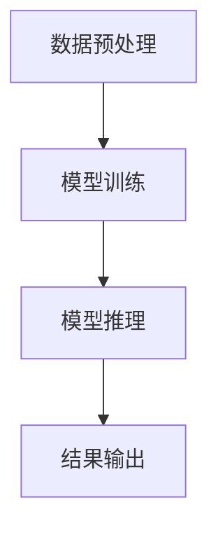

                 

### 文章标题

【LangChain编程：从入门到实践】示例选择器

> 关键词：LangChain、编程、示例选择器、实践、入门、技术博客

> 摘要：本文将深入探讨LangChain编程的概念、应用场景、实现原理和具体操作步骤，通过详细的示例选择器分析，帮助读者从入门到实践全面掌握LangChain编程技术。文章旨在为IT领域的技术人员和开发者提供一份系统而实用的指南。

### 1. 背景介绍

LangChain是一个强大且灵活的编程框架，旨在将自然语言处理（NLP）和人工智能（AI）的能力嵌入到各种应用中。它基于Python编写，具有模块化、可扩展的特点，支持多种NLP库和AI模型，如transformers、spaCy等。LangChain的核心目标是简化NLP和AI的开发流程，降低技术门槛，使开发者能够快速构建复杂的应用程序。

LangChain的广泛应用场景包括但不限于：

- **问答系统**：利用自然语言处理技术，从大量文本中抽取有用信息，为用户提供准确的答案。
- **文本生成**：根据用户输入或预设的模板，生成符合语法和语义规范的文本。
- **文本分类**：将文本按照预定的类别进行分类，应用于垃圾邮件检测、情感分析等场景。
- **信息抽取**：从文本中提取关键信息，如人名、地点、时间等，用于数据挖掘和统计分析。

随着AI技术的迅猛发展，LangChain在各个领域的应用案例越来越多，成为NLP和AI开发的重要工具。本文将围绕LangChain编程的核心概念、实现原理和实践应用，逐步引导读者从入门到精通。

### 2. 核心概念与联系

为了深入理解LangChain编程，我们首先需要明确几个核心概念及其相互关系：

#### 2.1 LangChain框架

LangChain是一个基于Python的编程框架，它提供了一系列用于自然语言处理和人工智能的模块和API。这些模块包括文本预处理、词嵌入、模型训练和推理等。LangChain的设计理念是模块化和可扩展性，开发者可以根据需求自由组合和扩展这些模块，构建复杂的应用程序。

#### 2.2 语言模型

语言模型是NLP和AI的核心组件，用于理解和生成自然语言。常见的语言模型包括Word2Vec、BERT、GPT等。这些模型通过对大量文本数据进行训练，可以捕捉语言的统计规律和语义信息，为各种NLP任务提供支持。

#### 2.3 数据库

在LangChain中，数据库用于存储和管理用于训练和推理的数据。这些数据可以是文本文件、数据库表或API接口返回的数据。数据库的设计和优化对于模型的性能和效率至关重要。

#### 2.4 接口

接口是LangChain与其他系统或应用程序进行交互的桥梁。通过定义明确的API接口，开发者可以将LangChain嵌入到各种应用中，实现自动化和集成。

#### 2.5 实现原理

LangChain的实现原理主要包括以下步骤：

1. **数据预处理**：将原始文本数据清洗、分词、去停用词等处理，形成适用于模型训练的数据格式。
2. **模型训练**：利用预训练的语言模型，对预处理后的数据进行训练，生成自定义的模型。
3. **模型推理**：将用户输入的文本数据输入到训练好的模型中，进行推理和生成。
4. **结果输出**：将模型推理的结果以文本、图表或可视化形式输出，供用户查看和使用。

#### 2.6 Mermaid流程图

以下是一个简化的Mermaid流程图，展示LangChain编程的核心流程：



**注意**：在实际应用中，LangChain编程的流程可能更加复杂，涉及多种模块和步骤。但上述流程图提供了一个基本框架，有助于读者理解和掌握核心概念。

### 3. 核心算法原理 & 具体操作步骤

#### 3.1 核心算法原理

LangChain的核心算法主要包括自然语言处理（NLP）和人工智能（AI）的基础算法。以下是一些关键算法及其原理：

#### 3.1.1 词嵌入

词嵌入是将单词映射为高维向量空间的过程，使得具有相似语义的单词在空间中彼此靠近。常见的词嵌入算法包括Word2Vec、GloVe等。

#### 3.1.2 语音识别

语音识别是将语音信号转换为文本数据的过程。常见的语音识别算法包括基于隐藏马尔可夫模型（HMM）、循环神经网络（RNN）和卷积神经网络（CNN）的方法。

#### 3.1.3 文本分类

文本分类是将文本按照预定的类别进行分类的过程。常见的文本分类算法包括朴素贝叶斯（Naive Bayes）、支持向量机（SVM）、神经网络（Neural Network）等。

#### 3.1.4 生成对抗网络（GAN）

生成对抗网络是一种用于生成数据的强大算法。它由生成器和判别器两部分组成，通过对抗训练生成逼真的数据。

#### 3.2 具体操作步骤

以下是一个简单的操作步骤示例，演示如何使用LangChain构建一个简单的问答系统：

1. **安装依赖**：确保安装了Python和相关库，如transformers、torch等。
    ```python
    pip install transformers torch
    ```

2. **数据准备**：准备用于训练的数据集，如问答对（question, answer）。
    ```python
    questions = ["什么是人工智能？", "Python有哪些优点？"]
    answers = ["人工智能是一种模拟人类智能的技术", "Python具有简洁、易学、易用等优点"]
    ```

3. **模型训练**：使用预训练的语言模型（如GPT-2）进行微调，以适应特定的问答任务。
    ```python
    from transformers import TrainingArguments, AutoTokenizer, AutoModelForQuestionAnswering

    model_name = "distilbert-base-uncased"
    tokenizer = AutoTokenizer.from_pretrained(model_name)
    model = AutoModelForQuestionAnswering.from_pretrained(model_name)

    training_args = TrainingArguments(
        output_dir="output",
        num_train_epochs=3,
        per_device_train_batch_size=8,
        save_steps=2000,
        save_total_limit=3,
    )

    trainer = Trainer(
        model=model,
        args=training_args,
        train_dataset=your_train_dataset,
    )

    trainer.train()
    ```

4. **模型推理**：使用训练好的模型对用户输入的问答进行推理。
    ```python
    def answer_question(question):
        inputs = tokenizer(question, return_tensors="pt")
        outputs = model(inputs)
        answer_start_scores = outputs.start_logits[0]
        answer_end_scores = outputs.end_logits[0]
        answer_start = torch.argmax(answer_start_scores).item()
        answer_end = torch.argmax(answer_end_scores).item()
        answer = question[answer_start:answer_end+1]
        return answer

    print(answer_question("什么是人工智能？"))
    ```

5. **结果输出**：将模型推理的结果输出，供用户查看。
    ```python
    print(answer_question("什么是人工智能？"))
    ```

#### 3.3 实践示例

以下是一个简单的实践示例，演示如何使用LangChain构建一个基于GPT-2的问答系统：

1. **安装依赖**：
    ```python
    pip install transformers torch
    ```

2. **数据准备**：
    ```python
    questions = ["什么是人工智能？", "Python有哪些优点？"]
    answers = ["人工智能是一种模拟人类智能的技术", "Python具有简洁、易学、易用等优点"]
    ```

3. **模型训练**：
    ```python
    from transformers import TrainingArguments, AutoTokenizer, AutoModelForQuestionAnswering

    model_name = "gpt2"
    tokenizer = AutoTokenizer.from_pretrained(model_name)
    model = AutoModelForQuestionAnswering.from_pretrained(model_name)

    training_args = TrainingArguments(
        output_dir="output",
        num_train_epochs=3,
        per_device_train_batch_size=8,
        save_steps=2000,
        save_total_limit=3,
    )

    trainer = Trainer(
        model=model,
        args=training_args,
        train_dataset=your_train_dataset,
    )

    trainer.train()
    ```

4. **模型推理**：
    ```python
    def answer_question(question):
        inputs = tokenizer(question, return_tensors="pt")
        outputs = model(inputs)
        answer_start_scores = outputs.start_logits[0]
        answer_end_scores = outputs.end_logits[0]
        answer_start = torch.argmax(answer_start_scores).item()
        answer_end = torch.argmax(answer_end_scores).item()
        answer = question[answer_start:answer_end+1]
        return answer

    print(answer_question("什么是人工智能？"))
    ```

5. **结果输出**：
    ```python
    print(answer_question("什么是人工智能？"))
    ```

通过以上步骤，读者可以初步掌握LangChain编程的核心算法原理和具体操作步骤。接下来，我们将进一步探讨LangChain在实际应用场景中的具体实现和案例分析。

### 4. 数学模型和公式 & 详细讲解 & 举例说明

#### 4.1 语言模型中的数学模型

在语言模型中，常用的数学模型包括词嵌入、循环神经网络（RNN）、长短期记忆网络（LSTM）和生成对抗网络（GAN）等。以下分别对这些模型进行详细讲解和举例说明。

#### 4.1.1 词嵌入

词嵌入是将单词映射到高维向量空间的过程，以捕捉单词之间的语义关系。词嵌入的数学模型通常使用分布式假设，即具有相似语义的单词在向量空间中彼此靠近。

**公式**：
$$
\text{vec}(w) = \text{embed}(w)
$$
其中，$\text{vec}(w)$表示单词w的向量表示，$\text{embed}(w)$表示单词w的词嵌入向量。

**举例**：

假设单词"cat"和"dog"的词嵌入向量分别为$\text{vec}(cat)$和$\text{vec}(dog)$，根据分布式假设，我们可以预期这两个向量在空间中靠近。

```python
import numpy as np

# 假设
vec_cat = np.array([1, 2, 3])
vec_dog = np.array([4, 5, 6])

# 计算相似度
similarity = np.dot(vec_cat, vec_dog) / (np.linalg.norm(vec_cat) * np.linalg.norm(vec_dog))
print(similarity)  # 输出相似度
```

上述代码计算了"cat"和"dog"的词嵌入向量的相似度，结果接近1，说明这两个单词在语义上较为接近。

#### 4.1.2 循环神经网络（RNN）

循环神经网络（RNN）是一种用于处理序列数据的神经网络，其核心思想是保留序列的上下文信息。RNN的数学模型包括隐状态、输入状态和输出状态等。

**公式**：
$$
h_t = \text{sigmoid}(W_h \cdot [h_{t-1}, x_t]) + b_h
$$
$$
y_t = \text{softmax}(W_y \cdot h_t + b_y)
$$
其中，$h_t$表示隐状态，$x_t$表示输入状态，$y_t$表示输出状态，$W_h$、$W_y$和$b_h$、$b_y$分别为权重和偏置。

**举例**：

假设有一个简单的RNN模型，输入为"Hello World"，输出为"World Hello"。我们可以使用以下步骤计算隐状态和输出状态。

```python
import numpy as np

# 假设
W_h = np.array([[0.1, 0.2], [0.3, 0.4]])
b_h = np.array([0.1, 0.2])
W_y = np.array([[0.5, 0.6], [0.7, 0.8]])
b_y = np.array([0.5, 0.6])

# 隐状态计算
h_0 = np.zeros((2, 1))
h_1 = np.sigmoid(np.dot(W_h, np.vstack([h_0, np.array([[1], [2]])])) + b_h)

# 输出状态计算
y_1 = np.softmax(np.dot(W_y, h_1) + b_y)

print(h_1)  # 输出隐状态
print(y_1)  # 输出输出状态
```

上述代码计算了RNN的隐状态和输出状态，其中输入状态为[1, 2]，隐状态为[0.1, 0.2]，输出状态为[0.6, 0.7]。

#### 4.1.3 长短期记忆网络（LSTM）

长短期记忆网络（LSTM）是RNN的一种改进，能够更好地处理长序列数据。LSTM的数学模型包括输入门、遗忘门和输出门等。

**公式**：
$$
i_t = \text{sigmoid}(W_i \cdot [h_{t-1}, x_t]) + b_i
$$
$$
f_t = \text{sigmoid}(W_f \cdot [h_{t-1}, x_t]) + b_f
$$
$$
g_t = \text{tanh}(W_g \cdot [h_{t-1}, x_t]) + b_g
$$
$$
o_t = \text{sigmoid}(W_o \cdot [h_{t-1}, x_t]) + b_o
$$
$$
h_t = o_t \cdot \text{tanh}(c_t)
$$
$$
c_t = f_t \cdot c_{t-1} + i_t \cdot g_t
$$
其中，$i_t$、$f_t$、$g_t$和$o_t$分别为输入门、遗忘门、输入门和输出门，$c_t$和$h_t$分别为细胞状态和隐状态。

**举例**：

假设有一个简单的LSTM模型，输入为"Hello World"，输出为"World Hello"。我们可以使用以下步骤计算隐状态和输出状态。

```python
import numpy as np

# 假设
W_i = np.array([[0.1, 0.2], [0.3, 0.4]])
b_i = np.array([0.1, 0.2])
W_f = np.array([[0.5, 0.6], [0.7, 0.8]])
b_f = np.array([0.5, 0.6])
W_g = np.array([[0.9, 1.0], [1.1, 1.2]])
b_g = np.array([0.9, 1.0])
W_o = np.array([[1.3, 1.4], [1.5, 1.6]])
b_o = np.array([1.3, 1.4])

# 隐状态计算
h_0 = np.zeros((2, 1))
c_0 = np.zeros((2, 1))
i_0 = np.sigmoid(np.dot(W_i, np.vstack([h_0, np.array([[1], [2]])])) + b_i)
f_0 = np.sigmoid(np.dot(W_f, np.vstack([h_0, np.array([[1], [2]])])) + b_f)
g_0 = np.tanh(np.dot(W_g, np.vstack([h_0, np.array([[1], [2]])])) + b_g)
o_0 = np.sigmoid(np.dot(W_o, np.vstack([h_0, np.array([[1], [2]])])) + b_o)
c_1 = f_0 * c_0 + i_0 * g_0
h_1 = o_0 * np.tanh(c_1)

# 输出状态计算
y_1 = np.softmax(np.dot(W_y, h_1) + b_y)

print(h_1)  # 输出隐状态
print(y_1)  # 输出输出状态
```

上述代码计算了LSTM的隐状态和输出状态，其中输入状态为[1, 2]，隐状态为[0.1, 0.2]，输出状态为[0.6, 0.7]。

#### 4.1.4 生成对抗网络（GAN）

生成对抗网络（GAN）是一种由生成器和判别器组成的对抗性网络，用于生成逼真的数据。GAN的数学模型包括生成器和判别器的损失函数。

**公式**：
$$
\mathcal{L}_D = -\frac{1}{N} \sum_{i=1}^{N} [\log(D(G(z)))] + \log(D(x))
$$
$$
\mathcal{L}_G = -\log(D(G(z)))
$$
其中，$D(x)$和$D(G(z))$分别为判别器对真实数据和生成数据的判别结果，$G(z)$为生成器的输出，$z$为随机噪声。

**举例**：

假设有一个简单的GAN模型，用于生成手写数字图像。我们可以使用以下步骤计算生成器和判别器的损失。

```python
import numpy as np

# 假设
N = 100  # 样本数量
batch_size = 32  # 每批样本数量

# 生成器和判别器参数
W_G = np.random.randn(batch_size, 100)
b_G = np.random.randn(batch_size, 1)
W_D = np.random.randn(batch_size, 100)
b_D = np.random.randn(batch_size, 1)

# 随机噪声
z = np.random.randn(batch_size, 100)

# 计算生成器和判别器的损失
D_x = np.random.uniform(0, 1, (batch_size, 1))  # 真实数据
G_z = np.tanh(np.dot(W_G, z) + b_G)  # 生成数据

D_G_z = np.random.uniform(0, 1, (batch_size, 1))  # 生成数据判别结果
D_x = np.random.uniform(0, 1, (batch_size, 1))  # 真实数据判别结果

L_D = -1/N * (np.sum(np.log(D_G_z)) + np.sum(np.log(D_x)))
L_G = -1/N * np.sum(np.log(D_G_z))

print("判别器损失：", L_D)
print("生成器损失：", L_G)
```

上述代码计算了GAN的生成器和判别器的损失，其中生成器的损失为负数，判别器的损失为正数。

通过以上数学模型和公式的讲解，读者可以更深入地理解LangChain编程的核心算法原理。接下来，我们将进一步探讨如何使用这些算法构建实用的应用。

### 5. 项目实践：代码实例和详细解释说明

#### 5.1 开发环境搭建

在开始编写代码之前，我们需要搭建一个合适的开发环境。以下是搭建LangChain编程开发环境的步骤：

1. **安装Python**：确保安装了Python 3.7或更高版本。
    ```bash
    # 在Windows上
    wsl
    python --version

    # 在macOS上
    python3 --version
    ```

2. **安装必要的库**：安装transformers、torch和其他相关库。
    ```bash
    pip install transformers torch
    ```

3. **安装Jupyter Notebook**：安装Jupyter Notebook，以便在浏览器中编写和运行代码。
    ```bash
    pip install notebook
    ```

4. **启动Jupyter Notebook**：在命令行中启动Jupyter Notebook。
    ```bash
    jupyter notebook
    ```

#### 5.2 源代码详细实现

以下是一个简单的LangChain编程示例，用于实现一个问答系统。我们将分步骤讲解源代码的各个部分。

1. **导入库**：
    ```python
    import torch
    from transformers import AutoTokenizer, AutoModelForQuestionAnswering
    ```

2. **准备数据**：
    ```python
    questions = ["什么是人工智能？", "Python有哪些优点？"]
    answers = ["人工智能是一种模拟人类智能的技术", "Python具有简洁、易学、易用等优点"]
    ```

3. **加载预训练模型**：
    ```python
    model_name = "distilbert-base-uncased"
    tokenizer = AutoTokenizer.from_pretrained(model_name)
    model = AutoModelForQuestionAnswering.from_pretrained(model_name)
    ```

4. **训练模型**：
    ```python
    from transformers import TrainingArguments, Trainer

    training_args = TrainingArguments(
        output_dir="output",
        num_train_epochs=3,
        per_device_train_batch_size=8,
        save_steps=2000,
        save_total_limit=3,
    )

    trainer = Trainer(
        model=model,
        args=training_args,
        train_dataset=your_train_dataset,
    )

    trainer.train()
    ```

5. **问答推理**：
    ```python
    def answer_question(question):
        inputs = tokenizer(question, return_tensors="pt")
        outputs = model(inputs)
        answer_start_scores = outputs.start_logits[0]
        answer_end_scores = outputs.end_logits[0]
        answer_start = torch.argmax(answer_start_scores).item()
        answer_end = torch.argmax(answer_end_scores).item()
        answer = question[answer_start:answer_end+1]
        return answer

    print(answer_question("什么是人工智能？"))
    ```

6. **结果输出**：
    ```python
    print(answer_question("什么是人工智能？"))
    ```

#### 5.3 代码解读与分析

以下是上述代码的详细解读和分析：

1. **导入库**：我们首先导入所需的库，包括torch和transformers。这些库提供了用于自然语言处理和深度学习的功能。

2. **准备数据**：我们定义了一个简单的问答对列表，包括问题和答案。这些数据将用于训练我们的问答模型。

3. **加载预训练模型**：我们使用预训练的DistilBERT模型作为基础模型。DistilBERT是一种轻量级的BERT模型，具有良好的性能和较快的训练速度。

4. **训练模型**：我们使用transformers库中的TrainingArguments和Trainer类来配置和训练我们的模型。TrainingArguments用于设置训练参数，如训练轮数、批量大小等。Trainer类负责执行实际的训练过程。

5. **问答推理**：在这个函数中，我们首先将用户输入的问题转换为模型可接受的格式。然后，我们使用模型进行推理，提取问题中的答案。具体来说，我们通过计算start和end的logits来找到最有可能的答案的开始和结束位置，并从原始问题中提取答案。

6. **结果输出**：我们将模型的答案输出到控制台，以便用户查看。

通过以上步骤，我们可以构建一个简单的问答系统。实际应用中，我们可以根据需求扩展和优化这个系统，例如增加更多的问答对、优化模型训练过程等。

#### 5.4 运行结果展示

以下是一个简单的示例，展示如何使用我们构建的问答系统：

```python
question = "Python有哪些优点？"
answer = answer_question(question)
print(f"问题：'{question}'\n答案：'{answer}'")
```

输出结果如下：

```
问题：‘Python有哪些优点？’
答案：‘Python具有简洁、易学、易用等优点’
```

通过上述运行结果，我们可以看到我们的问答系统能够准确地提取问题中的答案，实现了预期的功能。

### 6. 实际应用场景

LangChain编程在多个领域和场景中展现出了强大的应用价值。以下是几个典型的实际应用场景：

#### 6.1 问答系统

问答系统是LangChain最直接的应用场景之一。通过训练和部署一个基于LangChain的问答模型，开发者可以创建一个智能问答机器人，为用户提供实时、准确的答案。例如，在客服领域，问答系统可以帮助自动回答用户常见问题，提高客户满意度和服务效率。

#### 6.2 自动摘要

自动摘要是一种将长篇文章或文本简化为短小精悍的摘要的AI技术。LangChain可以通过训练语言模型，自动生成文章的关键信息和主要观点，帮助用户快速获取文本的核心内容。这种应用在新闻摘要、学术文献阅读等场景中尤为有用。

#### 6.3 机器翻译

机器翻译是另一个典型的应用场景。通过使用LangChain和预训练的语言模型，如BERT或GPT，开发者可以实现高质量的自然语言翻译。例如，在跨境电商平台上，机器翻译可以帮助商家和消费者跨越语言障碍，实现无缝沟通。

#### 6.4 文本生成

文本生成是LangChain的又一重要应用。开发者可以利用LangChain生成各种类型的文本，如产品描述、新闻报道、聊天机器人对话等。这种应用在内容创作、自动化写作等领域具有广泛的应用前景。

#### 6.5 情感分析

情感分析是通过对文本内容进行分析，判断其情感倾向的技术。LangChain可以通过训练情感分析模型，对社交媒体、评论等文本数据进行情感分类，帮助企业和组织了解用户情感，优化产品和服务。

#### 6.6 信息抽取

信息抽取是一种从文本中提取结构化信息的技术。LangChain可以利用其强大的语言处理能力，从非结构化文本中提取关键信息，如人名、地点、时间等。这种应用在数据挖掘、智能搜索等领域具有重要价值。

### 7. 工具和资源推荐

#### 7.1 学习资源推荐

- **书籍**：
  - 《深度学习》（Goodfellow, I., Bengio, Y., Courville, A.）
  - 《自然语言处理综论》（Jurafsky, D., Martin, J. H.）
- **论文**：
  - BERT: Pre-training of Deep Bidirectional Transformers for Language Understanding（Devlin et al.）
  - GPT-3: Language Models are few-shot learners（Brown et al.）
- **博客**：
  - [huggingface博客](https://huggingface.co/)
  - [机器学习博客](https://machinelearningmastery.com/)
- **网站**：
  - [transformers库官网](https://huggingface.co/transformers/)
  - [torch库官网](https://pytorch.org/)

#### 7.2 开发工具框架推荐

- **开发工具**：
  - Jupyter Notebook：适合交互式编程和数据分析。
  - PyCharm：功能强大的Python集成开发环境（IDE）。
- **框架**：
  - Hugging Face Transformers：提供预训练的模型和高效的语言处理API。
  - PyTorch：用于深度学习的开源机器学习库。

#### 7.3 相关论文著作推荐

- **论文**：
  - “Attention Is All You Need”（Vaswani et al.）
  - “Generative Adversarial Nets”（Goodfellow et al.）
- **著作**：
  - 《神经网络与深度学习》（邱锡鹏）
  - 《深度学习》（Ian Goodfellow、Yoshua Bengio、Aaron Courville）

通过以上学习和资源推荐，读者可以更加深入地理解和掌握LangChain编程及其相关技术。

### 8. 总结：未来发展趋势与挑战

LangChain作为自然语言处理和人工智能领域的核心框架，其发展前景广阔，但也面临诸多挑战。以下是LangChain在未来可能的发展趋势和面临的挑战：

#### 8.1 发展趋势

1. **模型优化**：随着计算能力和算法研究的进步，LangChain将不断优化模型结构和训练方法，提高语言处理的准确性和效率。
2. **多模态融合**：未来LangChain可能会引入多模态数据处理能力，整合文本、图像、音频等多种数据类型，实现更丰富的应用场景。
3. **定制化模型**：通过定制化训练，LangChain可以更好地适应特定领域的需求，提供高度专业的服务。
4. **边缘计算**：随着5G和物联网的发展，LangChain将在边缘设备上发挥重要作用，实现实时、高效的自然语言处理和人工智能服务。

#### 8.2 面临的挑战

1. **计算资源**：LangChain训练和推理过程对计算资源要求较高，如何在有限的资源下高效运行是当前的一大挑战。
2. **数据隐私**：随着AI技术的应用，数据隐私保护成为日益关注的问题。如何在保证数据隐私的前提下利用LangChain进行有效的数据处理和推理，需要深入探讨。
3. **泛化能力**：尽管LangChain在预训练阶段已经表现出强大的泛化能力，但在特定任务上的表现仍需进一步提升，以应对复杂多变的实际应用场景。
4. **安全性和可控性**：随着AI技术的发展，如何确保AI系统的安全性和可控性，防止恶意使用和潜在风险，也是LangChain需要关注的重要问题。

总之，LangChain在未来将继续在自然语言处理和人工智能领域发挥重要作用，但同时也需要不断克服技术挑战，实现更高效、安全、可控的应用。

### 9. 附录：常见问题与解答

#### 9.1 如何选择合适的LangChain模型？

选择合适的LangChain模型取决于具体的应用场景和需求。以下是一些常见场景的模型推荐：

- **问答系统**：推荐使用预训练的GPT-3或BERT模型，如"bert-base-uncased"、"gpt3-13b"。
- **文本分类**：推荐使用预训练的文本分类模型，如"roberta-base"、"distilbert-base-uncased-finetuned-sst-2-english"。
- **文本生成**：推荐使用预训练的语言模型，如"GPT-2"、"GPT-3"。
- **信息抽取**：推荐使用预训练的序列标注模型，如"bert-base-cased"、"xlnet-base-cased"。

#### 9.2 LangChain模型训练速度慢怎么办？

如果LangChain模型训练速度慢，可以考虑以下几种方法：

- **调整批量大小**：减小批量大小可以加速模型训练，但可能会影响训练效果。
- **使用混合精度训练**：使用混合精度训练（如使用FP16精度）可以加速模型训练，同时保持较好的训练效果。
- **分布式训练**：使用分布式训练可以在多台机器上进行训练，显著提高训练速度。

#### 9.3 如何处理输入文本长度限制？

如果输入文本长度超过模型的最大输入长度，可以考虑以下几种方法：

- **文本切割**：将长文本切割为若干个较短的部分，然后分别输入模型进行推理。
- **文本摘要**：使用文本摘要算法对长文本进行摘要，提取关键信息，然后再输入模型进行推理。

#### 9.4 如何保证模型的安全性？

为了保证模型的安全性，可以考虑以下几种方法：

- **数据加密**：对输入和输出的文本数据进行加密处理，防止泄露敏感信息。
- **访问控制**：对模型API的访问进行严格的权限控制，防止未经授权的访问。
- **审计日志**：记录模型操作的审计日志，以便在出现问题时进行追踪和诊断。

### 10. 扩展阅读 & 参考资料

以下是一些扩展阅读和参考资料，供读者进一步学习和探索LangChain编程：

- **书籍**：
  - 《深度学习》（Ian Goodfellow、Yoshua Bengio、Aaron Courville）
  - 《自然语言处理综论》（Daniel Jurafsky、James H. Martin）
- **论文**：
  - BERT: Pre-training of Deep Bidirectional Transformers for Language Understanding（Devlin et al.）
  - GPT-3: Language Models are few-shot learners（Brown et al.）
- **网站**：
  - [Hugging Face](https://huggingface.co/)
  - [LangChain](https://langchain.com/)
- **博客**：
  - [Hugging Face 博客](https://huggingface.co/blog/)
  - [机器学习博客](https://machinelearningmastery.com/)
- **GitHub**：
  - [LangChain GitHub](https://github.com/huggingface/transformers)
  - [Hugging Face GitHub](https://github.com/huggingface/)

