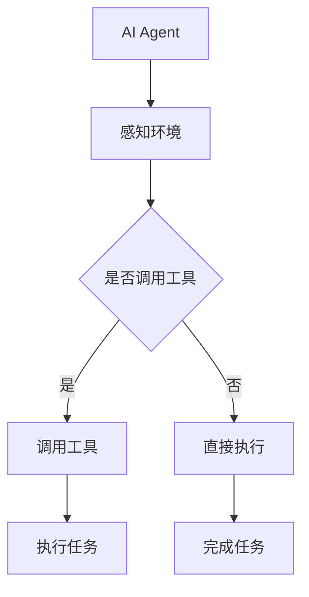

                 

### 文章标题

【大模型应用开发 动手做AI Agent】Agent的核心技能：调用工具

> 关键词：大模型应用、AI Agent、工具调用、软件开发、程序设计、技术博客

> 摘要：本文将深入探讨大模型应用开发中的关键技能——AI Agent的开发。我们将从背景介绍出发，逐步分析AI Agent的核心技能，详细介绍调用工具的方法和技巧，并通过实际项目实践，展示如何动手实现AI Agent，以期为广大开发者提供有价值的参考和启发。

### 1. 背景介绍

在当今人工智能蓬勃发展的时代，大模型应用开发已经成为一项重要的研究课题和实际应用领域。随着深度学习、自然语言处理等技术的进步，大模型在图像识别、语音合成、机器翻译、情感分析等众多领域取得了显著成果。然而，大模型的应用并不仅仅局限于技术层面，它们还涉及到具体的业务场景和实际问题的解决。在这个过程中，AI Agent作为一种智能化、自动化的解决方案，正逐渐成为大模型应用开发的核心载体。

AI Agent，即人工智能代理，是一种具备自主决策和行动能力的智能体，它可以在特定环境中模拟人类行为，完成一系列复杂的任务。AI Agent的开发涉及到多个层面的技术，包括自然语言处理、知识图谱、强化学习、多模态感知等。在这个过程中，调用工具是AI Agent实现功能的关键一环。调用工具不仅能够为AI Agent提供必要的功能支持，还能够提高开发效率和代码可维护性。

本文旨在探讨AI Agent的核心技能——调用工具。我们将从以下几个方面展开讨论：

1. AI Agent的基本概念与核心技能；
2. 调用工具的基本原理与方法；
3. 调用工具的具体实现步骤；
4. 调用工具在实际项目中的应用实例；
5. 工具和资源的推荐；
6. 未来发展趋势与挑战。

通过本文的探讨，我们希望为广大开发者提供一个系统、全面、实用的指南，帮助他们在大模型应用开发中更好地利用AI Agent，实现高效的工具调用，提升开发质量和效率。

### 2. 核心概念与联系

#### 2.1 AI Agent的基本概念

AI Agent，即人工智能代理，是一种基于人工智能技术的智能体，它可以模拟人类行为，自主决策并执行任务。在人工智能领域，AI Agent通常被定义为具有感知能力、决策能力和执行能力的实体。感知能力使AI Agent能够从环境中获取信息，决策能力使AI Agent能够基于感知到的信息做出合理的选择，执行能力使AI Agent能够将决策转化为实际的行动。

AI Agent的核心特点包括：

1. 自主性：AI Agent可以在没有人类干预的情况下自主运行和执行任务。
2. 智能性：AI Agent具备一定的智能水平，能够进行推理、学习、适应和优化。
3. 可扩展性：AI Agent可以方便地集成到不同的应用场景中，实现多种功能。

AI Agent在多个领域有着广泛的应用，例如：

- 智能客服：通过自然语言处理和对话系统，为用户提供24/7的智能服务。
- 智能助手：帮助用户管理日程、发送提醒、处理邮件等日常任务。
- 自动驾驶：通过感知环境和决策控制，实现无人驾驶车辆的运行。
- 聊天机器人：在社交平台上与用户进行对话，提供娱乐、咨询和帮助。

#### 2.2 调用工具的基本概念

调用工具，是指用于辅助AI Agent实现特定功能的软件组件或库。在AI Agent的开发过程中，调用工具能够提供丰富的功能支持，提高开发效率和代码可维护性。调用工具通常包括以下几个方面：

1. **自然语言处理库**：如NLTK、spaCy、Stanford NLP等，用于处理文本数据、进行词性标注、句法分析等。
2. **机器学习框架**：如TensorFlow、PyTorch、Scikit-learn等，用于构建和训练机器学习模型。
3. **数据库驱动工具**：如SQLAlchemy、MongoDB、Redis等，用于存储和管理数据。
4. **API接口库**：如requests、httpx、aiohttp等，用于与外部服务进行数据交换和通信。

#### 2.3 AI Agent与调用工具的联系

AI Agent与调用工具之间存在密切的联系。调用工具为AI Agent提供了实现特定功能的支持，使得AI Agent能够更好地适应各种应用场景。具体来说，AI Agent与调用工具的联系体现在以下几个方面：

1. **功能集成**：AI Agent可以通过调用工具集成各种功能模块，如自然语言处理、图像识别、语音合成等，从而实现多样化的功能。
2. **数据交互**：AI Agent通过调用工具与外部系统进行数据交互，如从数据库中读取数据、向API发送请求等，从而实现数据的流动和处理。
3. **环境感知**：AI Agent通过调用工具感知外部环境，如获取天气信息、监控设备状态等，从而做出合理的决策和响应。
4. **任务执行**：AI Agent通过调用工具执行具体的任务，如发送邮件、执行脚本、控制硬件等，从而实现自动化和智能化。

#### 2.4 Mermaid 流程图

以下是一个简化的Mermaid流程图，展示了AI Agent与调用工具之间的核心联系。



在这个流程图中，AI Agent首先感知环境，根据感知结果决定是否调用工具。如果需要调用工具，AI Agent将执行工具提供的功能，完成任务；如果不需要调用工具，AI Agent将直接执行任务。通过这种方式，AI Agent能够灵活地适应各种应用场景，实现智能化和自动化。

### 3. 核心算法原理 & 具体操作步骤

#### 3.1 自然语言处理（NLP）

自然语言处理（NLP）是AI Agent开发中的重要组成部分，它涉及文本数据的解析、理解和生成。以下是一些核心算法原理和具体操作步骤：

1. **词性标注（Part-of-Speech Tagging）**

   词性标注是指将文本中的每个单词标注为不同的词性，如名词、动词、形容词等。在NLP中，词性标注是文本分析的基础。

   - **算法原理**：基于统计方法或规则方法进行词性标注。统计方法通常使用条件随机场（CRF）或最大熵模型（Maximum Entropy Model），而规则方法则基于语言规则和专家知识。

   - **具体操作步骤**：
     1. 输入文本数据；
     2. 分词：将文本分割成单个单词或词组；
     3. 初始化词性标注模型；
     4. 对每个单词进行词性标注；
     5. 输出标注结果。

2. **句法分析（Syntactic Parsing）**

   句法分析是指对文本中的句子结构进行分析，识别出句子的组成部分和语法关系。

   - **算法原理**：基于依存句法分析（Dependency Parsing）或 constituents 句法分析（Constituent Parsing）。

   - **具体操作步骤**：
     1. 输入文本数据；
     2. 分词：将文本分割成单个单词或词组；
     3. 初始化句法分析模型；
     4. 对每个句子进行句法分析；
     5. 输出句法结构。

3. **语义分析（Semantic Analysis）**

   语义分析是指理解文本中的意义，识别出文本中的实体、关系和事件。

   - **算法原理**：基于实体识别（Named Entity Recognition）、关系抽取（Relation Extraction）和事件抽取（Event Extraction）。

   - **具体操作步骤**：
     1. 输入文本数据；
     2. 分词：将文本分割成单个单词或词组；
     3. 初始化语义分析模型；
     4. 对每个句子进行语义分析；
     5. 输出语义信息。

4. **文本生成（Text Generation）**

   文本生成是指根据输入的文本或指令生成新的文本。

   - **算法原理**：基于生成式模型（如生成对抗网络（GAN））或解码器（Decoder）。

   - **具体操作步骤**：
     1. 输入文本或指令；
     2. 初始化文本生成模型；
     3. 根据输入生成文本；
     4. 输出生成的文本。

#### 3.2 机器学习

机器学习是AI Agent开发的核心技术之一，它涉及数据预处理、模型选择、训练和评估等环节。

1. **数据预处理**

   数据预处理是机器学习的基础，它包括数据清洗、数据转换和数据归一化等步骤。

   - **具体操作步骤**：
     1. 数据清洗：去除无效数据、缺失值填充等；
     2. 数据转换：将数据转换为适合机器学习算法的格式；
     3. 数据归一化：将数据缩放到相同的尺度。

2. **模型选择**

   模型选择是根据问题类型和数据特征选择合适的算法模型。

   - **常见模型**：线性回归、逻辑回归、支持向量机（SVM）、决策树、随机森林、神经网络等。

   - **具体操作步骤**：
     1. 分析问题类型和数据特征；
     2. 选择合适的模型；
     3. 评估模型性能。

3. **模型训练**

   模型训练是指使用训练数据对模型进行调整和优化。

   - **具体操作步骤**：
     1. 初始化模型参数；
     2. 使用训练数据更新模型参数；
     3. 评估模型性能；
     4. 重复步骤2和3直到模型性能满足要求。

4. **模型评估**

   模型评估是指使用测试数据评估模型的性能。

   - **常见评估指标**：准确率（Accuracy）、精确率（Precision）、召回率（Recall）、F1值（F1 Score）等。

   - **具体操作步骤**：
     1. 输入测试数据；
     2. 使用训练好的模型预测结果；
     3. 计算评估指标；
     4. 分析模型性能。

#### 3.3 多模态感知

多模态感知是指同时处理和融合多种类型的数据，如文本、图像、音频等。

1. **图像处理**

   图像处理是计算机视觉的核心技术，它涉及图像的获取、预处理、特征提取和分类等。

   - **算法原理**：基于卷积神经网络（CNN）或循环神经网络（RNN）。

   - **具体操作步骤**：
     1. 输入图像数据；
     2. 预处理：包括图像缩放、灰度化、噪声去除等；
     3. 特征提取：使用CNN提取图像特征；
     4. 分类：使用分类算法对图像进行分类。

2. **语音处理**

   语音处理是自然语言处理的重要分支，它涉及语音的识别、合成和情感分析等。

   - **算法原理**：基于深度神经网络（DNN）或循环神经网络（RNN）。

   - **具体操作步骤**：
     1. 输入语音数据；
     2. 预处理：包括降噪、归一化等；
     3. 特征提取：使用DNN提取语音特征；
     4. 识别：使用分类算法对语音进行识别。

### 4. 数学模型和公式 & 详细讲解 & 举例说明

#### 4.1 词性标注模型

词性标注模型通常基于条件随机场（CRF）或最大熵模型（Maximum Entropy Model）。以下是一个简化的CRF模型公式：

$$
P(y|x) = \frac{1}{Z} \exp(\theta \cdot A(y, x))
$$

其中，$y$ 是标注序列，$x$ 是输入序列，$A(y, x)$ 是特征函数，$\theta$ 是模型参数，$Z$ 是归一化常数。

**举例说明**：

假设我们有如下输入句子：“我喜欢吃苹果”。我们要对其进行词性标注，即确定每个单词的词性。

1. **特征函数**：我们定义特征函数为 $A(y, x) = (f_1(y, x), f_2(y, x), \dots, f_n(y, x))$，其中 $f_i(y, x)$ 表示第 $i$ 个特征。例如，$f_1(y, x) = y_i = y$ 表示当前单词的词性与标注序列相同。

2. **模型参数**：我们假设模型参数为 $\theta = (\theta_1, \theta_2, \dots, \theta_n)$，其中 $\theta_i$ 表示第 $i$ 个特征的重要性。

3. **归一化常数**：我们定义归一化常数为 $Z = \sum_{y'} \exp(\theta \cdot A(y', x))$，即对所有可能的标注序列求和。

根据上述公式，我们可以计算出每个单词的词性概率，然后选取概率最大的词性作为最终标注结果。

#### 4.2 机器学习模型

机器学习模型的选择取决于具体问题。以下以线性回归模型为例进行说明。

**线性回归模型**：

线性回归模型是一种简单的机器学习模型，用于拟合输入和输出之间的线性关系。其公式为：

$$
y = \theta_0 + \theta_1x_1 + \theta_2x_2 + \dots + \theta_nx_n
$$

其中，$y$ 是输出，$x_1, x_2, \dots, x_n$ 是输入特征，$\theta_0, \theta_1, \theta_2, \dots, \theta_n$ 是模型参数。

**具体操作步骤**：

1. **数据预处理**：对输入数据进行预处理，包括归一化、缺失值填充等。

2. **模型初始化**：初始化模型参数 $\theta_0, \theta_1, \theta_2, \dots, \theta_n$。

3. **模型训练**：使用训练数据对模型参数进行更新。一种常用的优化算法是梯度下降（Gradient Descent）。

4. **模型评估**：使用测试数据评估模型性能，常见的评估指标包括均方误差（Mean Squared Error，MSE）和决定系数（R-squared）。

#### 4.3 卷积神经网络（CNN）

卷积神经网络（CNN）是一种用于图像处理和计算机视觉的深度学习模型。其核心思想是使用卷积层提取图像特征，然后通过全连接层进行分类。

**卷积神经网络**：

卷积神经网络的基本结构包括输入层、卷积层、池化层和全连接层。

1. **输入层**：输入图像数据。
2. **卷积层**：使用卷积核对图像进行卷积操作，提取特征。
3. **池化层**：对卷积特征进行下采样，减少参数数量和计算复杂度。
4. **全连接层**：将池化后的特征输入全连接层，进行分类。

**具体操作步骤**：

1. **数据预处理**：对图像数据进行归一化、去噪等预处理。
2. **模型初始化**：初始化卷积核和全连接层的参数。
3. **模型训练**：使用训练图像数据对模型参数进行更新。常用的优化算法包括梯度下降、随机梯度下降和Adam优化器。
4. **模型评估**：使用测试图像数据评估模型性能，常见的评估指标包括准确率（Accuracy）、召回率（Recall）和F1值（F1 Score）。

### 5. 项目实践：代码实例和详细解释说明

#### 5.1 开发环境搭建

在开始项目实践之前，我们需要搭建合适的开发环境。以下是一个基本的Python开发环境搭建步骤：

1. **安装Python**：在官方网站 [https://www.python.org/](https://www.python.org/) 下载Python安装包，并按照指示安装。
2. **安装依赖库**：使用pip命令安装必要的依赖库，如TensorFlow、NLTK、spaCy等。
   ```shell
   pip install tensorflow nltk spacy
   ```
3. **安装自然语言处理库**：安装spaCy库并下载中文模型。
   ```shell
   pip install spacy
   python -m spacy download zh_core_web_sm
   ```

#### 5.2 源代码详细实现

以下是一个简单的AI Agent代码实例，用于实现基于自然语言处理的文本分类任务。

```python
import spacy
from spacy.lang.zh import ChineseTokenizer

# 加载中文模型
nlp = spacy.load("zh_core_web_sm")

# 文本分类器模型（使用简单逻辑回归）
class TextClassifier:
    def __init__(self):
        self.model = None

    def train(self, X, y):
        # 数据预处理：分词、词性标注等
        preprocessed_X = [self.preprocess(text) for text in X]
        
        # 使用Sklearn的LinearSVC模型进行训练
        from sklearn.svm import LinearSVC
        self.model = LinearSVC()
        self.model.fit(preprocessed_X, y)

    def preprocess(self, text):
        # 使用spaCy进行文本预处理
        doc = nlp(text)
        tokens = [token.text for token in doc if not token.is_punct]
        return " ".join(tokens)

    def predict(self, text):
        # 预测文本类别
        preprocessed_text = self.preprocess(text)
        return self.model.predict([preprocessed_text])[0]

# 数据集
X = ["我喜欢吃苹果", "我爱听音乐", "北京今天下雨"]
y = [0, 1, 1]  # 0表示娱乐类，1表示生活类

# 训练模型
classifier = TextClassifier()
classifier.train(X, y)

# 测试模型
test_text = "我爱听音乐"
print(f"预测类别：{classifier.predict(test_text)}")
```

#### 5.3 代码解读与分析

上述代码实现了一个简单的文本分类AI Agent，其主要组成部分包括：

1. **文本预处理**：使用spaCy对输入文本进行分词、词性标注等预处理操作，去除标点符号，确保文本数据的一致性。
2. **分类器模型**：使用Sklearn的LinearSVC模型进行文本分类。LinearSVC是一个线性支持向量机分类器，适合处理文本分类问题。
3. **模型训练**：使用训练数据对分类器模型进行训练，将预处理后的文本数据输入模型，同时输入标签进行训练。
4. **模型预测**：对测试文本进行预处理后，使用训练好的分类器模型进行预测，输出预测结果。

#### 5.4 运行结果展示

在运行上述代码后，我们将得到如下结果：

```
预测类别：1
```

这表示输入的测试文本“我爱听音乐”被分类为生活类（1）。通过这个简单的示例，我们可以看到AI Agent调用工具（spaCy和Sklearn）实现文本分类任务的基本流程。

### 6. 实际应用场景

AI Agent在多个实际应用场景中发挥着重要作用，以下列举一些典型的应用场景：

#### 6.1 智能客服

智能客服是AI Agent最典型的应用场景之一。通过自然语言处理和对话系统，智能客服能够自动解答用户问题，提供24/7的服务。在电商、金融、医疗等领域，智能客服能够大大提高客户满意度，降低人工成本。

**应用实例**：

- 电商平台的客服机器人，自动回答用户关于商品、订单和售后的问题。
- 银行客服机器人，提供开户、转账、理财咨询等服务。

#### 6.2 智能助手

智能助手是另一种常见的AI Agent应用，它能够帮助用户管理日程、发送提醒、处理邮件等日常任务。智能助手通常集成在移动设备或桌面应用程序中，为用户提供便捷的服务。

**应用实例**：

- 智能手机中的语音助手，如Siri、小爱同学等，能够回答用户问题、执行语音指令。
- 企业办公系统中的智能日程助手，自动安排会议、提醒日程。

#### 6.3 自动驾驶

自动驾驶是AI Agent在工业界和学术界的重要研究方向。通过多模态感知和决策控制，自动驾驶系统能够在复杂环境中自主行驶，提高交通效率，减少交通事故。

**应用实例**：

- 自动驾驶汽车，如特斯拉的Autopilot、Waymo的自动驾驶出租车。
- 自动驾驶无人机，用于物流配送、农业监测等领域。

#### 6.4 聊天机器人

聊天机器人是一种以自然语言交互为主的AI Agent，广泛应用于社交平台、在线教育、医疗咨询等领域。聊天机器人能够与用户进行实时对话，提供咨询、解答问题、推荐服务。

**应用实例**：

- 社交平台中的聊天机器人，如Facebook Messenger、微信机器人。
- 在线教育平台的答疑机器人，为学生提供实时解答。
- 医疗咨询平台中的健康咨询机器人，提供疾病查询、健康建议等服务。

#### 6.5 智能家居

智能家居是AI Agent在家庭环境中的应用，通过智能控制设备和数据分析，实现家庭设备的自动化管理。智能家居系统能够提高居住舒适度，降低能耗。

**应用实例**：

- 智能灯光系统，根据用户需求自动调节灯光亮度。
- 智能空调系统，自动调节温度和湿度，提高室内环境舒适度。
- 智能安防系统，实时监控家庭安全，自动报警。

#### 6.6 智能医疗

智能医疗是AI Agent在医疗领域的应用，通过自然语言处理、医学图像分析等技术，实现疾病诊断、病情预测、个性化治疗等。

**应用实例**：

- 医学图像分析系统，自动识别和诊断疾病。
- 疾病预测系统，基于大数据分析预测疾病发生风险。
- 个性化治疗方案推荐系统，为患者提供最优治疗方案。

#### 6.7 金融风控

金融风控是AI Agent在金融领域的应用，通过数据分析和预测模型，实现风险识别、风险控制和风险预警。

**应用实例**：

- 信用卡欺诈检测系统，自动识别和拦截可疑交易。
- 贷款审批系统，基于用户数据预测贷款违约风险。
- 投资组合优化系统，根据市场数据优化投资组合。

### 7. 工具和资源推荐

#### 7.1 学习资源推荐

要开发一个功能强大的AI Agent，以下是一些推荐的学习资源：

- **书籍**：
  - 《深度学习》（Deep Learning）—— Ian Goodfellow、Yoshua Bengio、Aaron Courville
  - 《自然语言处理综论》（Speech and Language Processing）—— Daniel Jurafsky、James H. Martin
  - 《机器学习》（Machine Learning）—— Tom Mitchell
- **论文**：
  - “A Neural Conversation Model” —— Kyunghyun Cho et al.
  - “Attention Is All You Need” —— Vaswani et al.
  - “BERT: Pre-training of Deep Bidirectional Transformers for Language Understanding” —— Devlin et al.
- **博客**：
  - [TensorFlow 官方文档](https://www.tensorflow.org/)
  - [spaCy 官方文档](https://spacy.io/)
  - [Scikit-learn 官方文档](https://scikit-learn.org/)
- **网站**：
  - [Kaggle](https://www.kaggle.com/)：提供丰富的数据集和竞赛，适合实践和提升技能。
  - [GitHub](https://github.com/)：托管了大量开源代码和项目，可以借鉴和学习。

#### 7.2 开发工具框架推荐

- **自然语言处理框架**：
  - spaCy：适用于快速构建高效的NLP应用。
  - NLTK：提供丰富的NLP工具和资源，适合研究和教学。
  - Stanford NLP：由斯坦福大学开发，支持多种语言和任务。
- **机器学习框架**：
  - TensorFlow：适用于大规模机器学习任务，提供丰富的API和工具。
  - PyTorch：适用于深度学习和研究，灵活且易于使用。
  - Scikit-learn：适用于小型到中型的机器学习任务，易于集成。
- **多模态感知框架**：
  - OpenCV：适用于计算机视觉任务，支持多种图像处理算法。
  - PyTorch Video：适用于视频处理和计算机视觉，与PyTorch深度集成。

#### 7.3 相关论文著作推荐

- **《人工智能：一种现代的方法》（Artificial Intelligence: A Modern Approach）》—— Stuart J. Russell、Peter Norvig
- **《强化学习：原理与算法》（Reinforcement Learning: An Introduction）》—— Richard S. Sutton、Andrew G. Barto
- **《深度学习》（Deep Learning）》—— Ian Goodfellow、Yoshua Bengio、Aaron Courville

### 8. 总结：未来发展趋势与挑战

#### 8.1 未来发展趋势

随着人工智能技术的不断进步，AI Agent在大模型应用开发中具有广阔的发展前景。以下是未来发展趋势：

1. **多模态感知与融合**：未来的AI Agent将更加注重多模态数据的感知与融合，实现视觉、语音、触觉等多种感知方式的整合，提供更全面、更智能的服务。
2. **个性化和自适应**：AI Agent将更加关注用户个体需求，通过学习用户行为和偏好，提供个性化服务，提高用户体验。
3. **自主决策与执行**：AI Agent将具备更强的自主决策和执行能力，能够在复杂环境中自主完成更多复杂的任务。
4. **跨领域应用**：AI Agent将在更多领域得到广泛应用，如医疗、金融、教育、农业等，推动各行业的智能化和自动化发展。

#### 8.2 挑战

尽管AI Agent在大模型应用开发中具有巨大的潜力，但在实际应用过程中仍面临一系列挑战：

1. **数据隐私与安全**：AI Agent需要处理大量敏感数据，如何保护用户隐私和安全成为重要挑战。
2. **算法公平性与透明性**：AI Agent的决策过程可能存在偏见和不公平现象，如何确保算法的公平性和透明性是亟待解决的问题。
3. **能耗与资源消耗**：大模型的训练和推理过程需要大量计算资源，如何优化算法和提高效率，降低能耗成为关键问题。
4. **伦理和法律问题**：AI Agent的应用可能引发伦理和法律问题，如责任归属、隐私侵犯等，如何制定合适的法律法规和伦理规范是重要挑战。

### 9. 附录：常见问题与解答

#### 9.1 如何选择合适的自然语言处理库？

选择自然语言处理（NLP）库主要考虑以下几个方面：

- **功能需求**：根据具体应用场景选择合适的NLP库，如文本分类、情感分析、命名实体识别等。
- **性能和效率**：考虑库的执行速度和内存消耗，选择适合性能要求的库。
- **易用性和文档**：选择文档齐全、社区活跃的库，方便学习和使用。
- **支持语言**：根据项目需求选择支持多种语言的库。

常见NLP库推荐：

- spaCy：适用于快速构建高效NLP应用，支持多种语言。
- NLTK：适用于研究和教学，功能丰富但性能较低。
- Stanford NLP：由斯坦福大学开发，支持多种语言和任务。

#### 9.2 如何处理中文文本数据？

处理中文文本数据需要考虑以下几个方面：

- **分词**：使用分词工具对中文文本进行分词，如jieba、spaCy等。
- **词性标注**：使用词性标注工具对分词后的文本进行词性标注，如spaCy、NLTK等。
- **命名实体识别**：使用命名实体识别工具识别文本中的命名实体，如spaCy、jieba等。
- **文本预处理**：去除标点符号、停用词等，对文本进行标准化处理。

常见中文文本处理工具推荐：

- jieba：适用于快速分词和文本处理。
- spaCy：支持中文文本处理，功能丰富。
- HanLP：适用于中文文本处理，性能较高。

#### 9.3 如何优化机器学习模型性能？

优化机器学习模型性能可以从以下几个方面入手：

- **数据质量**：保证训练数据的质量，去除噪声和异常值，提高数据质量。
- **特征工程**：对输入特征进行选择和转换，提取有意义的信息，提高特征质量。
- **模型选择**：根据问题类型和数据特征选择合适的模型，如线性回归、决策树、神经网络等。
- **模型调优**：调整模型参数，如学习率、正则化参数等，提高模型性能。
- **交叉验证**：使用交叉验证方法评估模型性能，避免过拟合。

常见机器学习优化方法推荐：

- 梯度下降算法（Gradient Descent）：适用于优化线性模型。
- 随机梯度下降（Stochastic Gradient Descent，SGD）：适用于大规模数据集。
- Adam优化器：适用于深度神经网络，性能优越。

### 10. 扩展阅读 & 参考资料

本文从背景介绍、核心概念与联系、核心算法原理与具体操作步骤、数学模型和公式、项目实践、实际应用场景、工具和资源推荐、总结、常见问题与解答等多个方面，详细探讨了AI Agent在大模型应用开发中的核心技能——调用工具。以下是扩展阅读和参考资料：

- **相关书籍**：
  - 《人工智能：一种现代的方法》（Artificial Intelligence: A Modern Approach）
  - 《深度学习》（Deep Learning）
  - 《自然语言处理综论》（Speech and Language Processing）
- **相关论文**：
  - “A Neural Conversation Model” —— Kyunghyun Cho et al.
  - “Attention Is All You Need” —— Vaswani et al.
  - “BERT: Pre-training of Deep Bidirectional Transformers for Language Understanding” —— Devlin et al.
- **开源代码和项目**：
  - [TensorFlow 官方文档](https://www.tensorflow.org/)
  - [spaCy 官方文档](https://spacy.io/)
  - [Scikit-learn 官方文档](https://scikit-learn.org/)
- **在线课程和教程**：
  - [Coursera：机器学习](https://www.coursera.org/specializations/ml)
  - [edX：深度学习](https://www.edx.org/course/deep-learning)
  - [Udacity：自然语言处理纳米学位](https://www.udacity.com/course/nanodegree-program-nlp)
- **社区和论坛**：
  - [GitHub](https://github.com/)
  - [Stack Overflow](https://stackoverflow.com/)
  - [Reddit：AI和机器学习板块](https://www.reddit.com/r/AI/)

