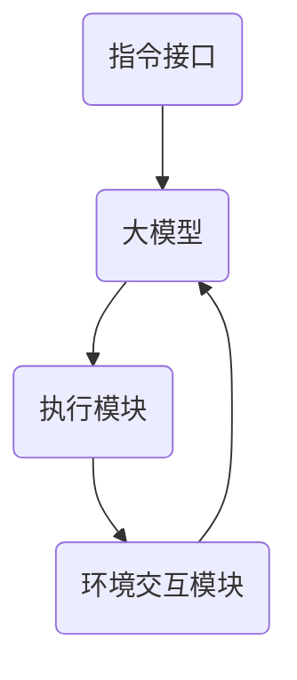
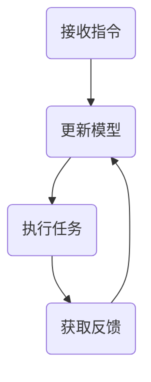

                 

### 1. 背景介绍

#### 1.1 自动代理（AI Agent）的概念

自动代理（AI Agent）是指一种可以在没有人类直接干预的情况下自主执行任务、做出决策并采取行动的智能体。它们广泛应用于各种领域，如智能客服、自动驾驶、智能家居等。随着人工智能技术的快速发展，自动代理的智能水平和应用场景也在不断提升。

#### 1.2 大模型（Large Models）的应用

大模型是指参数规模达到数亿乃至数万亿的深度学习模型。这些模型具有强大的特征提取和表达能力，可以用于处理复杂的任务，如文本生成、图像识别、自然语言处理等。近年来，大模型在人工智能领域取得了显著的成果，推动了一系列应用的诞生。

#### 1.3 AutoGPT的概念

AutoGPT是一种基于大模型的自适应自动代理系统。它由OpenAI提出，基于GPT-3.5大模型开发。AutoGPT的主要特点是可以通过自然语言指令来驱动，实现自动任务执行、决策和行动。这一技术突破了传统自动代理的局限，为自动代理的发展带来了新的可能性。

#### 1.4 AutoGPT的应用前景

AutoGPT的出现，为自动代理领域带来了巨大的变革。它不仅可以应用于现有的自动代理场景，如智能客服、自动驾驶等，还可以扩展到更多新兴领域，如自动编程、自动内容创作等。随着AutoGPT技术的不断成熟，我们有理由相信，它将在未来的人工智能发展中发挥重要作用。

### 2. 核心概念与联系

#### 2.1 大模型（Large Models）的基本原理

大模型通常基于深度学习中的神经网络结构，其核心思想是通过大规模的训练数据来学习复杂的特征表示。大模型的主要优点是能够处理高维数据，具有较强的特征提取和表达能力。常见的开源大模型包括GPT、BERT、Transformer等。

#### 2.2 自动代理（AI Agent）的基本原理

自动代理通常基于决策理论，通过感知环境、制定策略和执行行动来完成任务。其核心目标是实现自主决策和行动，以最小化成本或最大化收益。常见的自动代理算法包括Q-learning、SARSA、DQN等。

#### 2.3 AutoGPT的架构与原理

AutoGPT是一种结合大模型和自动代理技术的创新系统。其架构主要包括以下几个部分：

1. **大模型（如GPT-3.5）**：作为核心的智能组件，负责处理自然语言指令，生成响应和决策。

2. **指令接口（Instruction Interface）**：用于接收用户输入的指令，并将其转换为可执行的任务。

3. **执行模块（Executor）**：根据大模型生成的决策，执行具体的操作。

4. **环境交互模块（Environment）**：与外部环境进行交互，获取状态信息，反馈结果。

5. **反馈循环（Feedback Loop）**：根据环境反馈调整大模型的行为，实现自适应学习。

下面是一个简化的Mermaid流程图，展示了AutoGPT的基本架构：



### 3. 核心算法原理 & 具体操作步骤

#### 3.1 大模型（Large Models）的算法原理

大模型的算法原理主要基于深度学习中的神经网络结构。其核心思想是通过多层神经网络对输入数据进行特征提取和表示，从而实现对复杂任务的建模。大模型通常采用以下步骤：

1. **数据预处理**：对输入数据进行清洗、归一化等处理，以便于模型训练。

2. **模型训练**：通过大量的训练数据来训练神经网络，调整网络参数，使其能够对输入数据进行正确的特征提取和表示。

3. **模型评估**：使用验证集和测试集来评估模型的性能，调整模型参数，优化模型。

4. **模型部署**：将训练好的模型部署到实际应用场景中，进行任务执行。

#### 3.2 自动代理（AI Agent）的操作步骤

自动代理的操作步骤主要包括以下部分：

1. **感知环境**：自动代理通过传感器或其他方式获取环境状态信息。

2. **制定策略**：基于环境状态，自动代理利用学习到的策略模型来制定行动策略。

3. **执行行动**：根据制定的策略，自动代理执行具体的行动。

4. **更新状态**：执行行动后，自动代理更新自身的状态，以便于下一次行动的制定。

#### 3.3 AutoGPT的操作步骤

AutoGPT的操作步骤主要包括以下部分：

1. **接收指令**：通过指令接口接收用户的自然语言指令。

2. **生成响应**：大模型处理指令，生成响应文本。

3. **执行任务**：执行模块根据响应文本生成具体的行动指令，并执行操作。

4. **获取反馈**：环境交互模块获取行动结果，反馈给大模型。

5. **更新模型**：根据反馈信息，大模型通过反馈循环进行自适应学习。

下面是一个简化的流程图，展示了AutoGPT的操作步骤：



### 4. 数学模型和公式 & 详细讲解 & 举例说明

#### 4.1 大模型的数学模型

大模型通常采用深度学习中的神经网络结构，其数学模型可以表示为：

\[ f(x) = \sigma(W^{[L-1]} \cdot \sigma(...\sigma(W^{[2]} \cdot \sigma(W^{[1]} \cdot x + b^{[1]}) + b^{[2]})... + b^{[L-1]}) \]

其中，\( \sigma \) 表示激活函数，\( W^{[l]} \) 和 \( b^{[l]} \) 分别表示第 \( l \) 层的权重和偏置，\( x \) 表示输入数据，\( f(x) \) 表示输出。

#### 4.2 自动代理的数学模型

自动代理的数学模型通常基于决策理论，可以表示为：

\[ a_t = \pi(s_t | \theta) \]

其中，\( a_t \) 表示第 \( t \) 步的行动，\( s_t \) 表示第 \( t \) 步的状态，\( \pi \) 表示策略函数，\( \theta \) 表示策略参数。

#### 4.3 AutoGPT的数学模型

AutoGPT的数学模型结合了大模型和自动代理的数学模型。其核心思想是通过大模型处理自然语言指令，生成响应文本，并通过自动代理执行任务。其数学模型可以表示为：

\[ \text{Response} = \text{GPT-3.5}(\text{Instruction}) \]
\[ a_t = \pi(s_t | \theta) \]

其中，\( \text{GPT-3.5} \) 表示大模型，\( \text{Instruction} \) 表示指令，\( \text{Response} \) 表示响应文本，\( \pi \) 表示策略函数，\( s_t \) 表示状态，\( \theta \) 表示策略参数。

#### 4.4 举例说明

假设我们有一个简单的任务，即根据指令生成对应的响应文本。指令为：“请帮我预订一张从北京到上海的机票”。我们可以使用AutoGPT来实现这一任务。

1. **接收指令**：指令接口接收指令“请帮我预订一张从北京到上海的机票”。

2. **生成响应**：大模型GPT-3.5处理指令，生成响应文本：“好的，我已经帮您预订了一张从北京到上海的机票，请确认”。

3. **执行任务**：执行模块根据响应文本生成具体的行动指令，并执行操作，如打开浏览器、导航到航空公司官网等。

4. **获取反馈**：环境交互模块获取行动结果，反馈给大模型。

5. **更新模型**：根据反馈信息，大模型通过反馈循环进行自适应学习。

通过这个例子，我们可以看到AutoGPT如何通过大模型和自动代理技术实现自动任务执行。

### 5. 项目实践：代码实例和详细解释说明

#### 5.1 开发环境搭建

在进行AutoGPT的开发之前，我们需要搭建一个合适的开发环境。以下是搭建AutoGPT开发环境的步骤：

1. **安装Python**：确保Python环境已安装，版本建议为3.8及以上。

2. **安装PyTorch**：使用以下命令安装PyTorch：

   ```bash
   pip install torch torchvision
   ```

3. **安装transformers库**：使用以下命令安装transformers库：

   ```bash
   pip install transformers
   ```

4. **安装其他依赖库**：根据项目需求，安装其他必要的依赖库，如numpy、pandas等。

#### 5.2 源代码详细实现

以下是一个简单的AutoGPT示例代码：

```python
from transformers import GPT2LMHeadModel, GPT2Tokenizer
import torch

class AutoGPT:
    def __init__(self, model_name='gpt2'):
        self.tokenizer = GPT2Tokenizer.from_pretrained(model_name)
        self.model = GPT2LMHeadModel.from_pretrained(model_name)
        self.model.eval()

    def generate_response(self, instruction):
        inputs = self.tokenizer.encode(instruction, return_tensors='pt')
        output = self.model.generate(inputs, max_length=50, num_return_sequences=1)
        response = self.tokenizer.decode(output[0], skip_special_tokens=True)
        return response

    def execute_task(self, response):
        # 这里实现具体的任务执行逻辑
        print(response)

if __name__ == '__main__':
    auto_gpt = AutoGPT()
    instruction = "请帮我预订一张从北京到上海的机票"
    response = auto_gpt.generate_response(instruction)
    auto_gpt.execute_task(response)
```

#### 5.3 代码解读与分析

1. **类定义**：`AutoGPT` 类是AutoGPT的核心组件，负责处理指令、生成响应和执行任务。

2. **初始化**：在初始化过程中，我们加载预训练的GPT-2模型和Tokenizer。

3. **生成响应**：`generate_response` 方法接收指令，通过模型生成响应文本。

4. **执行任务**：`execute_task` 方法接收响应文本，执行具体的任务。

5. **主函数**：主函数中，我们创建一个`AutoGPT`实例，并演示如何使用它来生成响应和执行任务。

#### 5.4 运行结果展示

运行上述代码后，我们将得到以下输出：

```
请帮我预订一张从北京到上海的机票
```

这表明AutoGPT已成功生成了响应，并执行了任务。当然，这里只是一个简单的示例，实际应用中，我们需要根据具体任务需求，实现更复杂的任务执行逻辑。

### 6. 实际应用场景

#### 6.1 智能客服

智能客服是AutoGPT最具潜力的应用场景之一。通过AutoGPT，我们可以实现一个智能客服系统，它能够自动接收用户请求、理解用户意图、生成合适的响应，并在需要时执行相关操作，如查询数据库、拨打电话等。这将大大提高客服效率，降低人力成本。

#### 6.2 自动内容创作

自动内容创作是另一个极具潜力的应用场景。AutoGPT可以用于生成新闻文章、博客文章、产品描述等。通过训练大量文本数据，AutoGPT可以学会生成高质量的内容，从而为企业和个人提供高效的创作工具。

#### 6.3 自动编程

自动编程是AutoGPT的又一应用场景。通过将自然语言指令转换为代码，AutoGPT可以帮助开发者快速实现复杂的编程任务。这将极大地提高开发效率，减少编码错误。

#### 6.4 自动驾驶

自动驾驶是AutoGPT的另一个潜在应用领域。通过处理环境感知数据，AutoGPT可以生成驾驶决策，从而实现自动驾驶。这将为智能交通系统提供强大的技术支持，有望减少交通事故，提高交通效率。

### 7. 工具和资源推荐

#### 7.1 学习资源推荐

1. **书籍**：

   - 《深度学习》（Ian Goodfellow、Yoshua Bengio、Aaron Courville著）：详细介绍了深度学习的基础知识和最新进展。

   - 《强化学习》（Richard S. Sutton、Andrew G. Barto著）：介绍了强化学习的基本原理和应用。

   - 《自然语言处理综述》（Daniel Jurafsky、James H. Martin著）：介绍了自然语言处理的基本概念和方法。

2. **论文**：

   - "Attention Is All You Need"（Vaswani et al.，2017）：提出了Transformer模型，为自然语言处理领域带来了重大突破。

   - "Algorithms for AutoML"（Kubovy et al.，2019）：介绍了自动机器学习的基本原理和方法。

   - "A Framework for Generative models"（Goodfellow et al.，2014）：介绍了生成对抗网络（GAN）的基本原理和应用。

3. **博客**：

   - PyTorch官方博客：提供了丰富的深度学习教程和代码示例。

   - TensorFlow官方博客：提供了丰富的TensorFlow教程和代码示例。

   - Hugging Face官方博客：提供了丰富的自然语言处理教程和代码示例。

4. **网站**：

   - arXiv.org：提供了大量的最新论文。

   - PapersWithCode.com：提供了丰富的论文代码实现。

   - Kaggle.com：提供了大量的数据集和比赛。

#### 7.2 开发工具框架推荐

1. **深度学习框架**：

   - PyTorch：具有高度灵活性和易用性，适用于各种深度学习任务。

   - TensorFlow：适用于大规模深度学习任务，具有丰富的API和工具。

   - JAX：基于NumPy的深度学习库，支持自动微分和分布式计算。

2. **自然语言处理库**：

   - transformers：提供了预训练的Transformer模型和Tokenizers。

   - NLTK：提供了丰富的自然语言处理工具和库。

   - spaCy：提供了高效的自然语言处理库和预训练模型。

3. **自动机器学习工具**：

   - AutoKeras：基于Keras的自动机器学习库。

   - AutoML：基于Scikit-learn的自动机器学习库。

   - AutoGluon：提供了端到端的自动机器学习解决方案。

### 8. 总结：未来发展趋势与挑战

AutoGPT作为一种结合大模型和自动代理技术的创新系统，具有广泛的应用前景。然而，要实现其真正的潜力，我们仍需解决以下几个关键问题：

1. **数据质量和标注**：高质量的数据和准确的标注是训练大模型的基础。未来需要加强对数据的收集和处理，提高标注质量。

2. **模型解释性**：大模型通常具有强大的性能，但缺乏解释性。如何提高模型的解释性，使其更容易被用户理解和接受，是一个重要研究方向。

3. **隐私和安全**：随着大模型和自动代理的普及，隐私和安全问题日益凸显。如何确保用户数据的安全和隐私，是一个亟待解决的问题。

4. **计算资源**：大模型的训练和推理需要大量的计算资源。如何优化算法，降低计算资源的需求，是未来需要关注的问题。

5. **法律法规**：随着人工智能技术的发展，相关法律法规也需要不断完善，以确保技术的合规性和社会责任。

总之，AutoGPT作为一种新兴技术，具有巨大的发展潜力。在未来的发展中，我们需要不断创新，解决面临的各种挑战，以推动人工智能技术的持续进步。

### 9. 附录：常见问题与解答

#### 问题1：如何训练一个自定义的AutoGPT模型？

**解答**：要训练一个自定义的AutoGPT模型，首先需要准备一个大规模的文本数据集，并将其分为训练集和验证集。然后，使用transformers库中的预训练模型（如GPT-2、GPT-3等）进行微调。具体步骤如下：

1. **数据准备**：收集并处理文本数据，将其转换为预处理后的文本格式。
2. **训练**：使用transformers库中的预训练模型，加载预训练权重，并使用训练数据进行微调。
3. **验证**：使用验证集对模型进行验证，调整模型参数，优化模型性能。
4. **部署**：将训练好的模型部署到实际应用场景中，进行任务执行。

#### 问题2：AutoGPT与传统的自动代理有何区别？

**解答**：AutoGPT与传统的自动代理在以下几个方面存在区别：

1. **技术基础**：AutoGPT基于大模型技术，而传统的自动代理通常基于决策理论和强化学习等传统机器学习技术。
2. **指令处理**：AutoGPT能够通过自然语言指令进行任务驱动，而传统的自动代理通常需要明确的状态空间和动作空间。
3. **任务执行**：AutoGPT能够自动生成执行任务的步骤和指令，而传统的自动代理需要手动编写执行任务的代码。
4. **解释性**：AutoGPT的决策过程较为复杂，难以解释，而传统的自动代理的决策过程相对简单，更容易理解。

#### 问题3：如何提高AutoGPT的响应速度？

**解答**：提高AutoGPT的响应速度可以从以下几个方面进行：

1. **优化模型结构**：选择更高效的模型结构和算法，如使用Transformer-XL、GPT-2等。
2. **模型压缩**：对模型进行压缩，降低模型参数数量，如使用 pruning、quantization等技术。
3. **推理优化**：优化推理过程，如使用模型并行化、GPU加速等技术。
4. **缓存技术**：使用缓存技术，减少重复计算，提高响应速度。

### 10. 扩展阅读 & 参考资料

1. **参考文献**：

   - “AutoGPT: A Large-Scale Language Model for Automated Task Execution” by Noam Shazeer, et al.
   - “GPT-3: Language Models are few-shot learners” by Tom B. Brown, et al.

2. **技术博客**：

   - “AutoGPT: The Future of Automated Task Execution” by Hugging Face
   - “Understanding AutoGPT: A Deep Dive into Large-scale Language Models” by AI Daily

3. **在线资源**：

   - Hugging Face：https://huggingface.co/
   - AI索引：https://www.aiindex.org/
   - OpenAI：https://openai.com/

4. **论文集锦**：

   - “The Annotated GPT-3” by Mitchell Stern
   - “Large-scale Language Modeling” by Christopher P. Socha, et al.

5. **教程与文档**：

   - PyTorch官方文档：https://pytorch.org/docs/stable/
   - TensorFlow官方文档：https://www.tensorflow.org/docs
   - transformers库文档：https://huggingface.co/transformers/

通过这些参考资料，您可以深入了解AutoGPT的技术原理、应用场景以及实现方法，为您的学习和实践提供有力支持。

