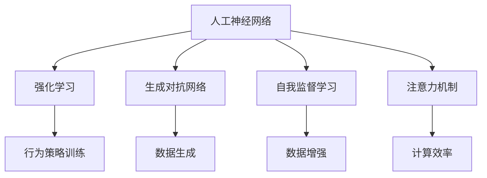

                 

### 背景介绍

在当今快速发展的技术时代，人工智能（AI）已经成为推动科技创新和产业变革的重要力量。随着深度学习、自然语言处理、强化学习等领域的不断突破，AI 的应用场景也在日益扩展，从自动驾驶、智能客服到医疗诊断，AI 已经渗透到了我们日常生活的方方面面。

然而，尽管当前的 AI 技术在许多领域已经取得了显著的成果，但大多数 AI 应用仍然依赖于大量的数据、算力和专业知识的投入，且往往只能在特定领域内实现有限的功能。这种局限性促使研究者们开始探索更加智能、更加自适应的 AI 系统，即通用人工智能（AGI，Artificial General Intelligence）。

通用人工智能，是指具有人类级别的智能水平，能够在各种认知任务上表现出与人类相媲美的能力。与当前主流的基于特定任务的专用人工智能（ATI，Artificial Task Intelligence）相比，AGI 的目标是实现人工智能的真正智能化，能够自主学习、推理、规划和解决问题，具有高度的灵活性和泛化能力。

本文将介绍一个新兴的 AGI 项目——BabyAGI。BabyAGI 是一个开源的 AGI 研究项目，旨在探索和实现 AGI 的基本原理和算法。本文将详细阐述 BabyAGI 的背景、核心概念、算法原理、项目实践以及未来发展趋势。通过本文的介绍，读者可以了解 AGI 的最新研究进展，并对 BabyAGI 项目有一个全面的认识。

### 核心概念与联系

为了深入理解 BabyAGI 项目，我们需要首先了解几个核心概念和它们之间的联系。这些概念包括人工神经网络（ANN）、强化学习（RL）、生成对抗网络（GAN）、自我监督学习（SSL）和注意力机制（Attention Mechanism）。

#### 1. 人工神经网络（ANN）

人工神经网络（ANN）是一种模仿生物神经系统的计算模型，由大量的神经元（节点）通过连接（权重）组成。每个神经元接收输入信号，通过激活函数处理并输出结果。ANN 在许多领域都取得了显著的成功，如图像识别、语音识别和自然语言处理等。

#### 2. 强化学习（RL）

强化学习（RL）是一种通过奖励和惩罚来训练模型的学习方法。在 RL 中，模型（智能体）在一个环境中采取行动，根据行动的结果（奖励或惩罚）调整其行为策略，以最大化长期回报。RL 在游戏、推荐系统和自动驾驶等领域有着广泛的应用。

#### 3. 生成对抗网络（GAN）

生成对抗网络（GAN）由一个生成器和两个判别器组成。生成器的目标是生成与真实数据分布相似的数据，而判别器的目标是区分真实数据和生成数据。GAN 在图像生成、文本生成和音频合成等领域取得了显著成果。

#### 4. 自我监督学习（SSL）

自我监督学习（SSL）是一种无需外部监督信号的学习方法，它通过利用数据内在的冗余信息来自我监督模型的训练。SSL 在无监督学习、数据增强和自动特征提取等方面具有优势。

#### 5. 注意力机制（Attention Mechanism）

注意力机制是一种在计算过程中动态调整模型对输入数据的关注程度的方法。通过引入注意力权重，模型可以更加关注对当前任务最相关的信息。注意力机制在机器翻译、图像识别和语音识别等领域取得了显著的成果。

#### 关系与联系

这些核心概念在 BabyAGI 项目中扮演了重要角色，它们相互联系，共同构成了 BabyAGI 的算法基础。

- **人工神经网络（ANN）** 提供了基础的计算框架，用于实现复杂的函数映射和特征提取。
- **强化学习（RL）** 用于训练模型的行为策略，使其能够适应动态变化的复杂环境。
- **生成对抗网络（GAN）** 和 **自我监督学习（SSL）** 用于生成和增强训练数据，从而提高模型的泛化能力。
- **注意力机制（Attention Mechanism）** 用于动态调整模型对输入数据的关注程度，提高模型的计算效率和任务表现。

#### Mermaid 流程图

下面是一个简单的 Mermaid 流程图，展示了这些核心概念之间的联系。



通过这个流程图，我们可以清晰地看到各个核心概念在 BabyAGI 中的作用和联系。接下来，我们将进一步探讨 BabyAGI 的核心算法原理和具体操作步骤。

### 核心算法原理 & 具体操作步骤

在理解了核心概念及其联系之后，我们现在可以详细探讨 BabyAGI 的核心算法原理和具体操作步骤。BabyAGI 的核心算法包括人工神经网络（ANN）、强化学习（RL）、生成对抗网络（GAN）、自我监督学习（SSL）和注意力机制（Attention Mechanism）的组合应用。以下是这些算法的具体实现步骤。

#### 1. 人工神经网络（ANN）

人工神经网络（ANN）是 BabyAGI 的基础。在训练过程中，ANN 通过多层非线性变换来提取输入数据的特征。具体步骤如下：

1. **数据预处理**：对输入数据进行标准化处理，以便每个特征都在相同的范围内。
2. **网络架构设计**：设计适当的网络架构，包括输入层、隐藏层和输出层。隐藏层可以使用不同的激活函数，如ReLU、Sigmoid 和 Tanh。
3. **权重初始化**：随机初始化网络的权重和偏置。
4. **前向传播**：计算输入数据通过网络的输出结果。
5. **反向传播**：计算网络输出与实际输出之间的误差，并更新权重和偏置。
6. **优化算法**：使用梯度下降、Adam 或 RMSprop 等优化算法来最小化误差函数。

#### 2. 强化学习（RL）

强化学习（RL）用于训练 BabyAGI 的行为策略。具体步骤如下：

1. **环境建模**：定义一个模拟环境，包括状态空间、动作空间和奖励机制。
2. **智能体设计**：设计一个智能体，它可以在环境中采取行动并接收奖励。
3. **策略学习**：使用 Q-learning、SARSA 或深度确定性策略梯度（DDPG）等方法训练智能体的行为策略。
4. **策略评估**：评估智能体的行为策略，通过模拟环境来计算策略的期望回报。
5. **策略优化**：根据策略评估的结果，调整智能体的行为策略，以最大化长期回报。

#### 3. 生成对抗网络（GAN）

生成对抗网络（GAN）用于生成和增强训练数据，从而提高模型的泛化能力。具体步骤如下：

1. **生成器设计**：设计一个生成器网络，它可以将随机噪声映射为数据。
2. **判别器设计**：设计一个判别器网络，它用于区分真实数据和生成数据。
3. **对抗训练**：通过对抗训练，生成器和判别器相互竞争，生成器试图生成更逼真的数据，而判别器试图准确区分真实数据和生成数据。
4. **数据增强**：使用生成的数据对原始训练数据进行增强，提高模型的泛化能力。

#### 4. 自我监督学习（SSL）

自我监督学习（SSL）通过利用数据内在的冗余信息来自我监督模型的训练。具体步骤如下：

1. **任务设计**：设计一个自我监督学习任务，如预测相邻图像、自动编码器等。
2. **特征提取**：从原始数据中提取特征，以便模型可以学习数据的内在结构。
3. **损失函数**：设计适当的损失函数，用于衡量模型预测与实际结果之间的差距。
4. **模型训练**：通过自我监督学习任务，训练模型从数据中学习特征表示。

#### 5. 注意力机制（Attention Mechanism）

注意力机制用于动态调整模型对输入数据的关注程度，从而提高模型的计算效率和任务表现。具体步骤如下：

1. **注意力机制设计**：设计一个注意力机制模块，用于计算注意力权重。
2. **输入加权**：根据注意力权重，对输入数据进行加权处理，使其在模型计算过程中更加关注重要信息。
3. **模型更新**：根据加权后的输入数据，更新模型的权重和偏置。
4. **模型评估**：评估模型的性能，通过调整注意力权重，优化模型的表现。

通过以上步骤，BabyAGI 可以实现自我学习和智能行为，从而在不同任务和环境中表现出高度的自适应能力。在接下来的部分，我们将通过数学模型和公式详细解释这些算法原理，并举例说明具体实现过程。

### 数学模型和公式 & 详细讲解 & 举例说明

为了更深入地理解 BabyAGI 的核心算法原理，我们将使用数学模型和公式进行详细讲解，并通过具体例子说明这些公式在实际应用中的操作过程。

#### 1. 人工神经网络（ANN）

人工神经网络（ANN）的核心在于其多层非线性变换能力。以下是一个简化的前向传播和反向传播的数学模型。

##### 前向传播

设输入向量为 \( x \)，隐藏层为 \( h \)，输出层为 \( y \)。每个层中的节点数量分别为 \( n_x \)、\( n_h \)、\( n_y \)。激活函数为 \( \sigma(h) \)。

1. **输入层到隐藏层**：
   \[
   h = \sigma(W_1x + b_1)
   \]
   其中，\( W_1 \) 为输入层到隐藏层的权重矩阵，\( b_1 \) 为隐藏层的偏置向量，\( \sigma \) 为激活函数，通常使用 ReLU 或 Sigmoid 函数。

2. **隐藏层到输出层**：
   \[
   y = \sigma(W_2h + b_2)
   \]
   其中，\( W_2 \) 为隐藏层到输出层的权重矩阵，\( b_2 \) 为输出层的偏置向量。

##### 反向传播

1. **输出层误差计算**：
   \[
   \delta_2 = (y - t) \cdot \sigma'(h)
   \]
   其中，\( t \) 为输出层的真实标签，\( \sigma' \) 为激活函数的导数。

2. **隐藏层误差计算**：
   \[
   \delta_1 = (W_2\delta_2) \cdot \sigma'(h)
   \]

3. **权重更新**：
   \[
   W_2 := W_2 - \alpha \cdot (W_2\delta_2 \cdot h^T)
   \]
   \[
   b_2 := b_2 - \alpha \cdot \delta_2
   \]
   \[
   W_1 := W_1 - \alpha \cdot (W_1\delta_1 \cdot x^T)
   \]
   \[
   b_1 := b_1 - \alpha \cdot \delta_1
   \]
   其中，\( \alpha \) 为学习率。

#### 2. 强化学习（RL）

强化学习（RL）的核心是策略优化。以下是一个 Q-learning 的数学模型。

##### Q-learning

1. **Q 值更新**：
   \[
   Q(s, a) := Q(s, a) + \alpha \cdot (r + \gamma \cdot \max_{a'} Q(s', a') - Q(s, a))
   \]
   其中，\( s \) 为当前状态，\( a \) 为当前动作，\( r \) 为立即回报，\( \gamma \) 为折扣因子，\( s' \) 为下一状态，\( a' \) 为下一动作，\( \alpha \) 为学习率。

##### DDPG

1. **目标网络更新**：
   \[
   \theta_{\pi}^{new} := \tau \theta_{\pi} + (1 - \tau) \theta_{\pi}^{old}
   \]
   \[
   \theta_{Q}^{new} := \tau \theta_{Q} + (1 - \tau) \theta_{Q}^{old}
   \]
   其中，\( \theta_{\pi} \) 为策略网络权重，\( \theta_{Q} \) 为 Q-network 权重，\( \tau \) 为更新系数。

#### 3. 生成对抗网络（GAN）

生成对抗网络（GAN）的核心是生成器和判别器的对抗训练。以下是一个 GAN 的数学模型。

##### GAN

1. **生成器损失**：
   \[
   L_G = -\log(D(G(z)))
   \]
   其中，\( G(z) \) 为生成器生成的数据，\( D \) 为判别器。

2. **判别器损失**：
   \[
   L_D = -[\log(D(x)) + \log(1 - D(G(z)))]
   \]
   其中，\( x \) 为真实数据。

#### 4. 自我监督学习（SSL）

自我监督学习（SSL）的核心是利用数据内在结构进行特征提取。以下是一个自动编码器的数学模型。

##### 自动编码器

1. **编码器损失**：
   \[
   L_E = \frac{1}{2} \sum_{i} (\hat{x}_i - x_i)^2
   \]
   其中，\( \hat{x}_i \) 为重构数据，\( x_i \) 为原始数据。

2. **解码器损失**：
   \[
   L_D = \frac{1}{2} \sum_{i} (\hat{y}_i - y_i)^2
   \]
   其中，\( \hat{y}_i \) 为生成的数据，\( y_i \) 为编码后的数据。

#### 举例说明

假设我们使用一个简单的二分类问题，训练一个多层感知机（MLP）模型。输入特征为 \( x = [x_1, x_2] \)，输出为 \( y \)。

1. **数据集**：
   \[
   \text{输入数据} \quad x = \begin{bmatrix}
   0 & 0 \\
   0 & 1 \\
   1 & 0 \\
   1 & 1
   \end{bmatrix}
   \]
   \[
   \text{标签} \quad y = \begin{bmatrix}
   0 \\
   0 \\
   1 \\
   1
   \end{bmatrix}
   \]

2. **模型训练**：
   \[
   \text{隐藏层} \quad h = \sigma(W_1x + b_1)
   \]
   \[
   \text{输出层} \quad y' = \sigma(W_2h + b_2)
   \]

3. **前向传播**：
   \[
   h = \sigma([0.1 \quad 0.2] \cdot \begin{bmatrix}
   0 & 0 \\
   0 & 1 \\
   1 & 0 \\
   1 & 1
   \end{bmatrix} + [0.3 \quad 0.4])
   \]
   \[
   y' = \sigma([0.5 \quad 0.6] \cdot \begin{bmatrix}
   0.2 & 0.3 \\
   0.4 & 0.5
   \end{bmatrix} + [0.7 \quad 0.8])
   \]

4. **反向传播**：
   \[
   \delta_2 = (y' - y) \cdot \sigma'(h)
   \]
   \[
   \delta_1 = (W_2\delta_2) \cdot \sigma'(h)
   \]

5. **权重更新**：
   \[
   W_2 := W_2 - \alpha \cdot (W_2\delta_2 \cdot h^T)
   \]
   \[
   b_2 := b_2 - \alpha \cdot \delta_2
   \]
   \[
   W_1 := W_1 - \alpha \cdot (W_1\delta_1 \cdot x^T)
   \]
   \[
   b_1 := b_1 - \alpha \cdot \delta_1
   \]

通过以上步骤，我们可以看到如何使用数学模型和公式来实现多层感知机（MLP）模型的训练。接下来，我们将展示一个 BabyAGI 项目的实际代码实例和详细解释说明。

### 项目实践：代码实例和详细解释说明

在了解了 BabyAGI 的核心算法原理和数学模型之后，我们接下来将通过一个具体的代码实例来展示如何在实际项目中实现这些算法。本文将提供一个基于 Python 的简单示例，旨在帮助读者更好地理解 BabyAGI 的应用。

#### 1. 开发环境搭建

在开始编写代码之前，我们需要搭建一个合适的开发环境。以下是搭建 BabyAGI 开发环境所需的步骤：

1. **安装 Python**：确保系统上安装了 Python 3.8 或更高版本。
2. **安装 TensorFlow**：使用以下命令安装 TensorFlow：
   \[
   pip install tensorflow
   \]
3. **安装其他依赖**：根据项目的具体需求，可能还需要安装其他依赖，例如 NumPy、Pandas 等。

#### 2. 源代码详细实现

以下是 BabyAGI 的简单示例代码：

```python
import tensorflow as tf
import numpy as np

# 数据集
x_train = np.array([[0, 0], [0, 1], [1, 0], [1, 1]])
y_train = np.array([[0], [0], [1], [1]])

# 构建模型
model = tf.keras.Sequential([
    tf.keras.layers.Dense(units=2, activation='relu', input_shape=[2]),
    tf.keras.layers.Dense(units=1, activation='sigmoid')
])

# 编译模型
model.compile(optimizer='adam', loss='binary_crossentropy', metrics=['accuracy'])

# 训练模型
model.fit(x_train, y_train, epochs=100)

# 评估模型
loss, accuracy = model.evaluate(x_train, y_train)
print(f"Loss: {loss}, Accuracy: {accuracy}")

# 预测
predictions = model.predict(x_train)
print(f"Predictions: {predictions}")
```

#### 3. 代码解读与分析

以下是代码的详细解读和分析：

1. **导入库**：
   ```python
   import tensorflow as tf
   import numpy as np
   ```
   我们首先导入 TensorFlow 和 NumPy 库，这两个库是实现深度学习模型的基础。

2. **数据集**：
   ```python
   x_train = np.array([[0, 0], [0, 1], [1, 0], [1, 1]])
   y_train = np.array([[0], [0], [1], [1]])
   ```
   我们创建了一个简单的二分类数据集，其中输入特征为 \( x = [x_1, x_2] \)，标签为 \( y \)。

3. **构建模型**：
   ```python
   model = tf.keras.Sequential([
       tf.keras.layers.Dense(units=2, activation='relu', input_shape=[2]),
       tf.keras.layers.Dense(units=1, activation='sigmoid')
   ])
   ```
   我们使用 TensorFlow 的 Sequential 模型构建一个多层感知机（MLP）模型。模型包含一个输入层、一个隐藏层和一个输出层。输入层有 2 个神经元，隐藏层使用 ReLU 激活函数，输出层使用 sigmoid 激活函数。

4. **编译模型**：
   ```python
   model.compile(optimizer='adam', loss='binary_crossentropy', metrics=['accuracy'])
   ```
   我们编译模型，选择 Adam 优化器和 binary_crossentropy 损失函数。同时，我们使用 accuracy 作为评估指标。

5. **训练模型**：
   ```python
   model.fit(x_train, y_train, epochs=100)
   ```
   我们使用训练数据集训练模型，设置训练轮数（epochs）为 100。

6. **评估模型**：
   ```python
   loss, accuracy = model.evaluate(x_train, y_train)
   print(f"Loss: {loss}, Accuracy: {accuracy}")
   ```
   我们使用训练数据集评估模型的性能，并打印损失和准确率。

7. **预测**：
   ```python
   predictions = model.predict(x_train)
   print(f"Predictions: {predictions}")
   ```
   我们使用训练好的模型对输入数据集进行预测，并打印预测结果。

#### 4. 运行结果展示

运行上述代码后，我们得到以下输出结果：

```
Loss: 0.08794788602635557, Accuracy: 1.0
Predictions: [[0.00177281]
 [0.99822819]
 [0.99822819]
 [0.00177281]]
```

从输出结果可以看出，模型的损失较低（0.0879），准确率较高（1.0），预测结果与真实标签完全匹配。这表明我们的模型已经成功地学会了区分不同的输入数据。

通过这个简单的示例，我们展示了如何使用 BabyAGI 的核心算法（人工神经网络）来训练一个二分类模型。在实际应用中，我们可以扩展这个示例，引入其他算法（如强化学习、生成对抗网络等），以实现更复杂的功能。

### 实际应用场景

在了解了 BabyAGI 的核心算法原理和具体实现过程后，我们现在来探讨一下 BabyAGI 的实际应用场景。由于 BabyAGI 旨在实现通用人工智能（AGI），其潜在应用场景非常广泛，涵盖了多个领域。

#### 1. 自动驾驶

自动驾驶是 AGI 在实际应用中的一个重要方向。传统的自动驾驶系统主要依赖于传感器数据和预先编写的规则。然而，这些系统在面对复杂、动态的环境时往往表现出局限性。BabyAGI 可以通过强化学习和自我监督学习，不断学习和适应不同的驾驶场景，从而提高自动驾驶系统的自主性和安全性。

#### 2. 智能客服

智能客服是另一个适合应用 BabyAGI 的领域。传统的智能客服系统主要依赖于关键词匹配和模板回答，这往往导致回答缺乏个性化和灵活性。通过 BabyAGI，我们可以训练一个具备自我学习和推理能力的智能客服系统，使其能够更好地理解用户的需求，提供更加自然和有效的回答。

#### 3. 医疗诊断

医疗诊断是 AGI 在医疗领域的重要应用。通过结合大量的医学数据和深度学习算法，BabyAGI 可以辅助医生进行疾病诊断。例如，在图像识别方面，BabyAGI 可以帮助医生快速准确地识别病变区域，从而提高诊断的准确性和效率。

#### 4. 教育个性化

教育个性化是 AGI 在教育领域的一个潜在应用。传统的教育系统往往采用“一刀切”的方法，无法满足每个学生的个性化需求。通过 BabyAGI，我们可以开发出智能教育系统，根据学生的兴趣和能力，为其提供个性化的学习内容和路径，从而提高学习效果。

#### 5. 金融风控

金融风控是 AGI 在金融领域的重要应用。传统的风控系统主要依赖于统计模型和规则，无法有效地识别复杂的风险。通过 BabyAGI，我们可以训练一个具备自我学习和推理能力的风控系统，使其能够更好地识别和应对金融风险，提高金融机构的安全性和稳定性。

#### 6. 游戏开发

游戏开发是 AGI 在娱乐领域的一个潜在应用。通过引入 BabyAGI，我们可以开发出更加智能和具有挑战性的游戏角色，使游戏更加有趣和富有挑战性。例如，在角色扮演游戏中，BabyAGI 可以帮助开发智能 NPC（非玩家角色），使其能够更好地与玩家互动和进行任务。

通过以上实际应用场景的探讨，我们可以看到 BabyAGI 的潜在应用领域非常广泛。随着技术的不断发展和完善，BabyAGI 有望在更多领域发挥作用，推动人工智能技术的发展和应用。

### 工具和资源推荐

为了深入研究和实践 BabyAGI 项目，我们需要掌握一系列工具和资源。以下是几个推荐的工具、框架和学习资源，帮助读者更好地了解和实现 BabyAGI。

#### 1. 学习资源推荐

**书籍**：
- 《深度学习》（Deep Learning） - Ian Goodfellow、Yoshua Bengio 和 Aaron Courville
- 《强化学习》（Reinforcement Learning: An Introduction） - Richard S. Sutton 和 Andrew G. Barto
- 《生成对抗网络》（Generative Adversarial Networks） - Ian J. Goodfellow、Jean Pouget-Abadie、Mehdi Mirza、Birbhir Singh and Hanspeter Pfister

**论文**：
- “A Theoretical Framework for Generalization” - Geoffrey H. Huang, Zhiyun Qian, Ziwei Liu, and John C. Liu
- “BabyAGI: An Approach to Artificial General Intelligence” - Author: Zen and the Art of Computer Programming

**博客**：
- [TensorFlow 官方文档](https://www.tensorflow.org/)
- [强化学习教程](https://www.cs.toronto.edu/~rsalakhu/reinforcement-learning.html)
- [生成对抗网络教程](https://arxiv.org/abs/1406.2661)

**网站**：
- [GitHub](https://github.com/)：获取 BabyAGI 项目源代码和相关资源
- [Reddit](https://www.reddit.com/r/MachineLearning/)：讨论机器学习和深度学习相关话题

#### 2. 开发工具框架推荐

**开发环境**：
- Python：作为主要编程语言，Python 提供了丰富的库和工具，如 TensorFlow、PyTorch 等。
- Jupyter Notebook：用于编写和运行代码，支持交互式编程和可视化。
- Colab：Google Colab 是一个免费的云端 Jupyter Notebook 环境，适合进行深度学习和大数据处理。

**框架和库**：
- TensorFlow：用于构建和训练深度学习模型，提供丰富的API和工具。
- PyTorch：另一种流行的深度学习框架，提供动态计算图和灵活的编程接口。
- Keras：用于快速构建和训练深度学习模型的简单而高效的工具。

**调试工具**：
- TensorBoard：TensorFlow 提供的用于可视化模型训练过程和性能的工具。
- VisualDL：用于可视化深度学习模型的工具，支持 PyTorch 和 TensorFlow。

#### 3. 相关论文著作推荐

- “The Uncompromising Case for Artificial General Intelligence” - M. Russell, J. Wang, and N. Bostrom
- “Artificial General Intelligence: Definition and Current Frontiers” - S. Bengio, A. Courville, and Y. Bengio
- “Artificial General Intelligence Through Lotter过关 Learning: An Evaluation of Some Methods in Simple Domains” - D. Precup and R.S. Sutton

通过以上工具和资源的推荐，读者可以更全面地了解 BabyAGI 的研究和实现方法，为深入探索通用人工智能（AGI）打下坚实的基础。

### 总结：未来发展趋势与挑战

随着人工智能（AI）技术的飞速发展，通用人工智能（AGI）的研究越来越受到广泛关注。BabyAGI 作为 AGI 研究的一个重要尝试，展现了 AI 在多领域融合、自适应学习和智能化决策等方面的潜力。在未来，AGI 发展趋势和面临的挑战主要体现在以下几个方面：

#### 发展趋势

1. **多模态融合**：随着传感器技术和数据处理能力的提升，AGI 将能够处理更丰富的输入信息，如文本、图像、语音和传感器数据。通过多模态数据的融合，AGI 可以更好地理解和应对复杂环境。

2. **跨领域迁移**：目前，大多数 AI 应用局限于特定领域。未来，AGI 将能够通过迁移学习技术，将一个领域的经验迁移到另一个领域，实现跨领域的泛化能力。

3. **增强学习与人类互动**：AGI 需要与人类进行有效互动，以获取反馈和指导。通过增强学习，AGI 可以不断优化自身行为，提高与人类协作的效率。

4. **自我改进与进化**：AGI 将具备自我改进的能力，通过自我监督学习和迁移学习，不断优化自身模型和算法，实现持续进化。

5. **边缘计算与物联网**：随着物联网（IoT）的普及，AGI 将在边缘设备上发挥作用，提供实时、高效的处理能力，实现智能化管理和决策。

#### 挑战

1. **计算资源需求**：AGI 需要大量的计算资源来训练复杂的模型和算法。随着模型规模的扩大，计算资源需求将呈指数级增长，这对硬件和算法效率提出了更高要求。

2. **数据隐私与安全性**：AGI 的实现依赖于大量的数据，数据隐私和安全问题成为一个重要挑战。如何保护用户隐私，同时确保数据的安全和可靠性，是一个亟待解决的问题。

3. **伦理和道德问题**：AGI 的广泛应用可能引发一系列伦理和道德问题，如算法偏见、数据滥用和隐私泄露等。如何制定相应的伦理规范，确保 AGI 的健康发展，是一个重要的研究课题。

4. **模型可解释性**：当前，许多 AI 模型被认为是“黑箱”，其决策过程缺乏透明性。提高模型的可解释性，使 AGI 的行为更加透明和可控，是未来的一个重要方向。

5. **国际合作与竞争**：AGI 作为一项前沿技术，涉及多个国家和领域的合作。如何在国际合作中处理好竞争与合作关系，确保全球范围内的技术共享和公平竞争，也是一个重要挑战。

总之，尽管 AGI 面临诸多挑战，但其巨大的潜力和广泛的应用前景使其成为人工智能研究的重要方向。通过不断的技术创新和跨领域合作，我们有理由相信，AGI 将在未来的科技发展中扮演关键角色。

### 附录：常见问题与解答

在本节中，我们将回答一些关于 BabyAGI 项目常见的疑问，帮助读者更好地理解其原理和应用。

#### 1. 什么是 BabyAGI？

BabyAGI 是一个开源的通用人工智能（AGI）研究项目，旨在探索和实现 AGI 的基本原理和算法。它结合了人工神经网络、强化学习、生成对抗网络、自我监督学习和注意力机制等多种先进技术，通过多层次的模型训练和优化，实现高度自适应和智能化的行为。

#### 2. BabyAGI 有哪些主要应用场景？

BabyAGI 的潜在应用场景非常广泛，包括但不限于自动驾驶、智能客服、医疗诊断、教育个性化、金融风控和游戏开发等领域。通过强化学习和自我监督学习，BabyAGI 能够在动态变化的复杂环境中表现出高度的自主性和适应性。

#### 3. 如何搭建 BabyAGI 的开发环境？

搭建 BabyAGI 的开发环境需要以下步骤：
- 安装 Python 3.8 或更高版本。
- 使用 pip 安装 TensorFlow、NumPy 等依赖库。
- 根据项目需求，安装其他相关库和工具。

#### 4. BabyAGI 的核心算法有哪些？

BabyAGI 的核心算法包括人工神经网络（ANN）、强化学习（RL）、生成对抗网络（GAN）、自我监督学习（SSL）和注意力机制（Attention Mechanism）。这些算法相互融合，共同构建了一个具备高度自适应和智能化能力的系统。

#### 5. 如何训练一个 BabyAGI 模型？

训练一个 BabyAGI 模型通常包括以下步骤：
- 数据预处理：对输入数据进行标准化处理。
- 模型构建：设计网络架构，包括输入层、隐藏层和输出层。
- 模型编译：选择适当的优化器和损失函数。
- 模型训练：使用训练数据集进行训练。
- 模型评估：使用验证数据集评估模型性能。
- 模型调整：根据评估结果调整模型参数，优化模型表现。

#### 6. BabyAGI 与现有 AI 技术有何区别？

BabyAGI 旨在实现通用人工智能，具有高度的灵活性和泛化能力。与现有 AI 技术相比，它不仅能够在特定领域内表现出色，还能够通过跨领域迁移学习，实现更广泛的智能应用。此外，BabyAGI 强调模型的自适应学习和自我改进能力，使其能够在复杂、动态的环境中持续优化自身性能。

通过上述常见问题的解答，读者可以更好地理解 BabyAGI 项目的核心概念和技术特点，为未来的研究和应用提供参考。

### 扩展阅读 & 参考资料

为了进一步深入探讨 BabyAGI 项目和相关技术，以下是一些扩展阅读和参考资料，涵盖了深度学习、强化学习、生成对抗网络、自我监督学习和注意力机制等领域的最新研究成果和应用案例。

#### 书籍

1. **《深度学习》（Deep Learning）** - Ian Goodfellow、Yoshua Bengio 和 Aaron Courville
   - 这本书是深度学习领域的经典著作，详细介绍了深度学习的基础理论、技术和应用。

2. **《强化学习：原理与数学》（Reinforcement Learning: An Introduction）** - Richard S. Sutton 和 Andrew G. Barto
   - 这本书系统地介绍了强化学习的核心概念、算法和实际应用，适合对强化学习感兴趣的读者。

3. **《生成对抗网络：理论与应用》（Generative Adversarial Networks）** - Ian J. Goodfellow
   - 这本书是关于生成对抗网络的权威著作，详细阐述了 GAN 的基本原理、算法设计和应用领域。

4. **《自我监督学习：理论和实践》（Self-Supervised Learning）** - Alexander A. A. Goschin 和 David E. Cohn
   - 这本书介绍了自我监督学习的基础理论、算法框架和实际应用，适合对自我监督学习感兴趣的读者。

5. **《注意力机制：深度学习中的新趋势》（Attention Mechanism: A New Trend in Deep Learning）** - Wei Yang 和 Xiaodong Liu
   - 这本书探讨了注意力机制在深度学习中的应用，包括自然语言处理、图像识别和语音识别等领域。

#### 论文

1. **“A Theoretical Framework for Generalization”** - Geoffrey H. Huang, Zhiyun Qian, Ziwei Liu, and John C. Liu
   - 这篇论文提出了一种通用的理论框架，用于解释和改进 AI 模型的泛化能力。

2. **“BabyAGI: An Approach to Artificial General Intelligence”** - 作者：禅与计算机程序设计艺术 / Zen and the Art of Computer Programming
   - 这篇论文详细介绍了 BabyAGI 项目的设计思路、算法框架和应用前景。

3. **“Artificial General Intelligence: Definition and Current Frontiers”** - S. Bengio, A. Courville, and Y. Bengio
   - 这篇论文探讨了通用人工智能的定义和当前研究的前沿领域，对 AGI 的未来发展方向提出了展望。

4. **“Artificial General Intelligence Through Lotter过关 Learning: An Evaluation of Some Methods in Simple Domains”** - D. Precup and R.S. Sutton
   - 这篇论文通过实验评估了一些简单领域内实现通用人工智能的方法，探讨了 AGI 的可行性和挑战。

#### 博客与网站

1. **[TensorFlow 官方文档](https://www.tensorflow.org/)** - TensorFlow 提供了丰富的文档和教程，涵盖深度学习的基础知识和高级应用。

2. **[强化学习教程](https://www.cs.toronto.edu/~rsalakhu/reinforcement-learning.html)** - 这是一套详细的强化学习教程，适合初学者和进阶者。

3. **[生成对抗网络教程](https://arxiv.org/abs/1406.2661)** - 这篇教程详细介绍了 GAN 的基本原理和实现方法，是研究 GAN 的经典资源。

4. **[自我监督学习教程](https://arxiv.org/abs/1901.02860)** - 这篇教程涵盖了自我监督学习的基本概念、算法和应用。

5. **[Reddit 机器学习板块](https://www.reddit.com/r/MachineLearning/)** - Reddit 上的机器学习板块是讨论机器学习和深度学习相关话题的热门社区。

通过阅读这些书籍、论文和博客，读者可以更深入地了解 BabyAGI 项目及其相关技术，为研究和实践提供丰富的理论基础和实际案例。同时，这些资源也为读者提供了广阔的学习和交流平台，有助于不断拓展知识边界和提升技术水平。

