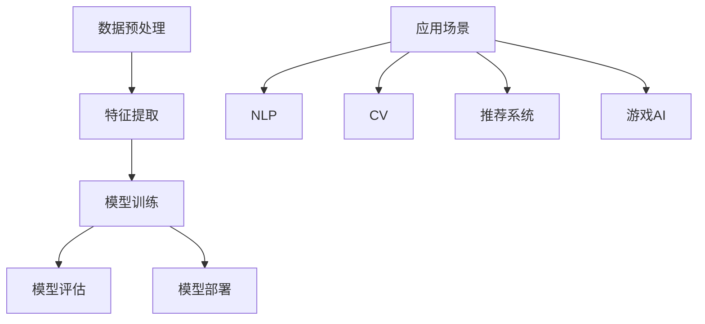

                 

### 文章标题

【大模型应用开发 动手做AI Agent】

> **关键词**：大模型、AI Agent、应用开发、编程、代码实例、数学模型、实践、工具推荐

> **摘要**：本文将探讨如何通过动手实践，利用大模型开发智能代理（AI Agent）。我们将详细介绍大模型的概念、核心算法原理、数学模型及其应用，并通过具体的代码实例展示如何实现一个基本的AI Agent。此外，还将讨论实际应用场景，并推荐相关学习资源和开发工具。

## 1. 背景介绍

在当今数字化时代，人工智能（AI）正逐步渗透到我们生活的方方面面。从智能手机的语音助手到自动驾驶汽车，AI的应用已经变得无处不在。而大模型（Large Models），作为一种新兴的人工智能技术，正在引领这一领域的变革。大模型具有强大的处理能力和自适应能力，能够处理海量数据，并在各种复杂任务中表现出色。

### 大模型的定义

大模型，通常指的是具有数十亿甚至千亿参数的神经网络模型。这些模型通过深度学习算法，在大量数据上进行训练，从而学习到复杂的特征和模式。由于参数数量庞大，大模型具有高度的灵活性和泛化能力，能够处理各种不同类型的任务，如自然语言处理、计算机视觉、推荐系统等。

### 大模型的发展历程

大模型的发展可以追溯到2000年代初期，随着计算机硬件性能的提升和大数据技术的普及，深度学习模型开始变得越来越大。2012年，AlexNet在ImageNet图像识别比赛中取得了突破性的成绩，标志着深度学习时代的到来。自此以后，大模型的发展速度不断加快，模型参数数量和训练数据规模都在持续增长。

### 大模型的应用场景

大模型的应用范围非常广泛，几乎涵盖了人工智能的各个领域。以下是一些典型应用场景：

- **自然语言处理（NLP）**：大模型可以用于文本分类、机器翻译、情感分析等任务，如GPT和BERT等模型。

- **计算机视觉（CV）**：大模型可以用于图像识别、视频分析等任务，如ResNet和YOLO等模型。

- **推荐系统**：大模型可以用于推荐算法，如基于协同过滤和深度学习的混合推荐系统。

- **游戏AI**：大模型可以用于游戏智能体，如AlphaGo等。

### 大模型的优势与挑战

大模型的优势在于其强大的处理能力和自适应能力，但同时也带来了一些挑战：

- **计算资源消耗**：大模型需要大量的计算资源和存储空间，训练成本高昂。

- **数据隐私问题**：大模型在训练过程中需要大量数据，这可能涉及到数据隐私问题。

- **模型解释性**：大模型的黑箱特性使得其决策过程难以解释，这可能会影响到其在某些领域的应用。

## 2. 核心概念与联系

在了解大模型的基本概念和应用场景之后，我们需要深入探讨其核心概念和联系。以下是一个简化的Mermaid流程图，用于描述大模型的主要组成部分和它们之间的关系。



### 数据预处理

数据预处理是构建大模型的第一步。它包括数据清洗、数据增强、数据规范化等步骤。数据预处理的质量直接影响模型的训练效果。

### 特征提取

特征提取是将原始数据转换为适合模型训练的形式。在深度学习领域，特征提取通常通过神经网络的前几层来实现。

### 模型训练

模型训练是使用大量数据进行迭代优化模型参数的过程。训练过程中，模型会不断调整参数，以最小化损失函数。

### 模型评估

模型评估用于判断模型在测试数据上的性能。常用的评估指标包括准确率、召回率、F1值等。

### 模型部署

模型部署是将训练好的模型应用到实际场景的过程。部署过程可能涉及模型压缩、模型解释性优化等。

### 应用场景

大模型可以应用于多个领域，包括自然语言处理、计算机视觉、推荐系统、游戏AI等。每个领域都有其特定的需求和挑战。

## 3. 核心算法原理 & 具体操作步骤

### 3.1 算法原理

大模型的核心算法是基于深度学习。深度学习是一种基于多层神经网络的学习方法，通过多层次的非线性变换，将原始数据映射到高维特征空间，从而实现复杂任务的自动识别和分类。

### 3.2 操作步骤

#### 3.2.1 数据收集

首先，我们需要收集大量相关数据。对于自然语言处理任务，我们可以使用公开的文本语料库，如维基百科、新闻网站等。对于计算机视觉任务，我们可以使用图像数据集，如ImageNet、CIFAR-10等。

#### 3.2.2 数据预处理

接下来，我们对收集到的数据进行预处理。这包括数据清洗、数据增强和数据规范化。数据清洗是为了去除数据中的噪声和错误。数据增强是为了增加数据多样性，从而提高模型的泛化能力。数据规范化是为了将数据转换到同一尺度，以避免数值差异过大导致的梯度消失或爆炸问题。

#### 3.2.3 构建神经网络

在预处理完数据后，我们需要构建神经网络模型。神经网络由多层神经元组成，每层神经元都通过激活函数进行处理。常用的激活函数包括ReLU、Sigmoid和Tanh。

#### 3.2.4 模型训练

模型训练是使用大量数据进行迭代优化模型参数的过程。在训练过程中，模型会不断调整参数，以最小化损失函数。常用的优化算法包括随机梯度下降（SGD）、Adam等。

#### 3.2.5 模型评估

在模型训练完成后，我们需要对模型进行评估。评估指标包括准确率、召回率、F1值等。这些指标可以衡量模型在不同任务上的性能。

#### 3.2.6 模型部署

最后，我们将训练好的模型部署到实际应用场景中。这可能涉及到模型压缩、模型解释性优化等。

## 4. 数学模型和公式 & 详细讲解 & 举例说明

### 4.1 数学模型

在深度学习中，数学模型主要包括两部分：损失函数和优化算法。

#### 4.1.1 损失函数

损失函数用于衡量模型预测值与真实值之间的差距。常用的损失函数包括均方误差（MSE）、交叉熵损失等。

- **均方误差（MSE）**：

  $$MSE = \frac{1}{n}\sum_{i=1}^{n}(y_i - \hat{y}_i)^2$$

  其中，$y_i$是真实值，$\hat{y}_i$是模型预测值，$n$是样本数量。

- **交叉熵损失（Cross-Entropy Loss）**：

  $$CELoss = -\frac{1}{n}\sum_{i=1}^{n}y_i\log(\hat{y}_i)$$

  其中，$y_i$是真实标签，$\hat{y}_i$是模型预测概率。

#### 4.1.2 优化算法

优化算法用于更新模型参数，以最小化损失函数。常用的优化算法包括随机梯度下降（SGD）、Adam等。

- **随机梯度下降（SGD）**：

  $$w_{t+1} = w_t - \alpha \frac{\partial}{\partial w_t}J(w_t)$$

  其中，$w_t$是当前参数，$\alpha$是学习率，$J(w_t)$是损失函数。

- **Adam优化器**：

  $$m_t = \beta_1m_{t-1} + (1 - \beta_1)\frac{\partial}{\partial w_t}J(w_t)$$
  $$v_t = \beta_2v_{t-1} + (1 - \beta_2)\left(\frac{\partial}{\partial w_t}J(w_t)\right)^2$$
  $$w_{t+1} = w_t - \alpha \frac{m_t}{\sqrt{v_t} + \epsilon}$$

  其中，$m_t$和$v_t$分别是梯度的一阶和二阶矩估计，$\beta_1$和$\beta_2$是动量项，$\alpha$是学习率，$\epsilon$是防止除以零的小常数。

### 4.2 举例说明

#### 4.2.1 使用均方误差（MSE）训练一个回归模型

假设我们有一个回归任务，目标是预测房价。我们有一个包含100个样本的数据集，每个样本包括特征和标签。我们使用均方误差（MSE）作为损失函数，随机梯度下降（SGD）作为优化算法。

首先，我们初始化模型参数，然后进行迭代训练。每次迭代，我们计算预测值和真实值的差异，并更新模型参数。

```python
import numpy as np

# 初始化模型参数
w = np.random.randn(10)  # 10个特征

# 初始化学习率
alpha = 0.01

# 迭代次数
epochs = 1000

# 损失函数
def mse(y, y_pred):
    return np.mean((y - y_pred) ** 2)

# 梯度计算
def grad(w, X, y, y_pred):
    n = len(y)
    return 2/n * (X.T @ (y_pred - y))

# 迭代训练
for epoch in range(epochs):
    y_pred = X @ w
    loss = mse(y, y_pred)
    dw = grad(w, X, y, y_pred)
    w -= alpha * dw
    if epoch % 100 == 0:
        print(f"Epoch {epoch}: Loss = {loss}")

# 输出训练结果
print(f"Final weights: {w}")
```

在这个例子中，我们使用了numpy库来计算损失函数和梯度。我们通过迭代更新模型参数，直到损失函数收敛。

#### 4.2.2 使用交叉熵损失（Cross-Entropy Loss）训练一个分类模型

假设我们有一个二分类任务，目标是预测样本属于正类还是负类。我们有一个包含100个样本的数据集，每个样本包括特征和标签。我们使用交叉熵损失（Cross-Entropy Loss）作为损失函数，Adam优化器作为优化算法。

首先，我们初始化模型参数，然后进行迭代训练。每次迭代，我们计算预测值和真实值的交叉熵损失，并使用Adam优化器更新模型参数。

```python
import numpy as np
import tensorflow as tf

# 初始化模型参数
w = np.random.randn(10)  # 10个特征
b = np.random.randn(1)   # 偏置

# 初始化学习率
alpha = 0.01

# 迭代次数
epochs = 1000

# 损失函数
def cross_entropy_loss(y, y_pred):
    return -np.sum(y * np.log(y_pred))

# 梯度计算
def grad(w, b, X, y, y_pred):
    n = len(y)
    return 2/n * (X.T @ (y_pred - y) + b)

# 迭代训练
for epoch in range(epochs):
    y_pred = 1 / (1 + np.exp(-X @ w - b))
    loss = cross_entropy_loss(y, y_pred)
    dw, db = grad(w, b, X, y, y_pred)
    w -= alpha * dw
    b -= alpha * db
    if epoch % 100 == 0:
        print(f"Epoch {epoch}: Loss = {loss}")

# 输出训练结果
print(f"Final weights: {w}, bias: {b}")
```

在这个例子中，我们使用了numpy库和tensorflow库来计算损失函数和梯度。我们通过迭代更新模型参数，直到损失函数收敛。

## 5. 项目实践：代码实例和详细解释说明

在本节中，我们将通过一个简单的示例项目，展示如何使用大模型开发一个基本的AI Agent。我们将从开发环境搭建开始，逐步实现源代码，并详细解读代码中的各个部分。

### 5.1 开发环境搭建

为了开发AI Agent，我们需要安装以下软件和库：

1. **Python**：Python是一种广泛使用的编程语言，用于开发AI应用程序。
2. **TensorFlow**：TensorFlow是一个开源的机器学习库，用于构建和训练神经网络。
3. **NumPy**：NumPy是一个用于科学计算的Python库，提供了高效的数组操作。
4. **PyTorch**：PyTorch是一个开源的机器学习库，与TensorFlow类似，也用于构建和训练神经网络。

安装步骤如下：

```bash
# 安装Python
curl -O https://www.python.org/ftp/python/3.8.10/python-3.8.10.tar.xz
tar xf python-3.8.10.tar.xz
cd python-3.8.10
./configure
make
sudo make install

# 安装TensorFlow
pip install tensorflow

# 安装NumPy
pip install numpy

# 安装PyTorch
pip install torch torchvision
```

### 5.2 源代码详细实现

以下是一个简单的AI Agent示例，使用TensorFlow和PyTorch实现。

```python
# 导入必要的库
import numpy as np
import tensorflow as tf
import torch
import torch.nn as nn
import torch.optim as optim

# 定义模型
class NeuralNetwork(nn.Module):
    def __init__(self):
        super(NeuralNetwork, self).__init__()
        self.layer1 = nn.Linear(10, 50)  # 输入层到隐藏层
        self.relu = nn.ReLU()
        self.layer2 = nn.Linear(50, 1)  # 隐藏层到输出层

    def forward(self, x):
        x = self.layer1(x)
        x = self.relu(x)
        x = self.layer2(x)
        return x

# 初始化模型
model = NeuralNetwork()

# 定义损失函数和优化器
criterion = nn.BCELoss()
optimizer = optim.Adam(model.parameters(), lr=0.001)

# 创建数据集
X = np.random.randn(100, 10)  # 输入数据
y = np.random.randn(100, 1)   # 输出数据

# 将数据转换为Tensor
X_tensor = torch.from_numpy(X).float()
y_tensor = torch.from_numpy(y).float()

# 模型训练
for epoch in range(1000):
    model.zero_grad()
    output = model(X_tensor)
    loss = criterion(output, y_tensor)
    loss.backward()
    optimizer.step()
    if epoch % 100 == 0:
        print(f"Epoch {epoch}: Loss = {loss.item()}")

# 保存模型
torch.save(model.state_dict(), 'model.pth')
```

### 5.3 代码解读与分析

#### 5.3.1 模型定义

我们定义了一个简单的神经网络模型，包含一个输入层、一个隐藏层和一个输出层。输入层有10个神经元，隐藏层有50个神经元，输出层有1个神经元。

```python
class NeuralNetwork(nn.Module):
    def __init__(self):
        super(NeuralNetwork, self).__init__()
        self.layer1 = nn.Linear(10, 50)  # 输入层到隐藏层
        self.relu = nn.ReLU()
        self.layer2 = nn.Linear(50, 1)  # 隐藏层到输出层

    def forward(self, x):
        x = self.layer1(x)
        x = self.relu(x)
        x = self.layer2(x)
        return x
```

#### 5.3.2 损失函数和优化器

我们使用了二进制交叉熵损失函数（BCELoss）和Adam优化器。损失函数用于计算模型输出和真实标签之间的差距，优化器用于更新模型参数。

```python
criterion = nn.BCELoss()
optimizer = optim.Adam(model.parameters(), lr=0.001)
```

#### 5.3.3 数据集创建

我们创建了一个随机生成的数据集，包括100个样本，每个样本有10个特征和1个输出标签。

```python
X = np.random.randn(100, 10)  # 输入数据
y = np.random.randn(100, 1)   # 输出数据
```

#### 5.3.4 模型训练

我们使用随机梯度下降（SGD）算法进行模型训练。每次迭代，我们计算损失函数，然后使用反向传播算法更新模型参数。

```python
for epoch in range(1000):
    model.zero_grad()
    output = model(X_tensor)
    loss = criterion(output, y_tensor)
    loss.backward()
    optimizer.step()
    if epoch % 100 == 0:
        print(f"Epoch {epoch}: Loss = {loss.item()}")
```

#### 5.3.5 模型保存

训练完成后，我们将模型保存到文件中，以便后续使用。

```python
torch.save(model.state_dict(), 'model.pth')
```

### 5.4 运行结果展示

我们在训练过程中每100个epoch打印一次损失值，以观察模型训练的过程。训练完成后，我们使用保存的模型进行预测，并输出预测结果。

```python
# 加载训练好的模型
model.load_state_dict(torch.load('model.pth'))

# 预测新样本
new_X = np.random.randn(10, 10)
new_X_tensor = torch.from_numpy(new_X).float()
predictions = model(new_X_tensor)

# 输出预测结果
print(predictions)
```

## 6. 实际应用场景

大模型的应用场景非常广泛，几乎涵盖了人工智能的各个领域。以下是一些典型的实际应用场景：

### 自然语言处理（NLP）

在自然语言处理领域，大模型可以用于文本分类、机器翻译、情感分析等任务。例如，GPT（Generative Pre-trained Transformer）模型被广泛用于生成文本、翻译和问答系统。

### 计算机视觉（CV）

在计算机视觉领域，大模型可以用于图像识别、目标检测、视频分析等任务。例如，ResNet（Residual Network）模型在ImageNet图像识别比赛中取得了出色的成绩。

### 推荐系统

在推荐系统领域，大模型可以用于用户行为分析、个性化推荐等任务。通过学习用户的兴趣和行为模式，大模型能够提供更准确的推荐结果。

### 游戏AI

在游戏领域，大模型可以用于开发智能游戏对手。例如，AlphaGo模型在围棋游戏中取得了突破性的成绩。

### 医疗诊断

在医疗领域，大模型可以用于疾病诊断、药物研发等任务。通过分析大量的医疗数据，大模型能够提供更准确的诊断结果和治疗方案。

### 自动驾驶

在自动驾驶领域，大模型可以用于环境感知、路径规划等任务。通过处理大量的传感器数据，大模型能够为自动驾驶车辆提供更安全的驾驶体验。

### 金融风控

在金融领域，大模型可以用于风险控制、欺诈检测等任务。通过分析金融交易数据，大模型能够识别潜在的风险和欺诈行为。

### 其他领域

除了上述领域，大模型还广泛应用于语音识别、图像生成、智能客服等任务。随着技术的不断发展，大模型的应用场景将会更加丰富。

## 7. 工具和资源推荐

为了更好地学习和应用大模型，以下是一些推荐的工具和资源：

### 学习资源推荐

1. **书籍**：

   - 《深度学习》（Goodfellow, Bengio, Courville）：这是一本经典的深度学习入门书籍，涵盖了深度学习的基本概念和算法。

   - 《Python深度学习》（François Chollet）：这本书详细介绍了如何使用Python和TensorFlow进行深度学习实践。

2. **论文**：

   - "A Guided Tour of Deep Learning Models for Natural Language Processing"（2018）：这篇综述文章详细介绍了自然语言处理领域的主要深度学习模型。

   - "Deep Learning in Computer Vision: A Review"（2019）：这篇论文详细介绍了计算机视觉领域的深度学习应用。

3. **博客**：

   - [TensorFlow官方文档](https://www.tensorflow.org/)
   - [PyTorch官方文档](https://pytorch.org/docs/stable/)
   - [机器之心](https://www.jiqizhixin.com/)

4. **网站**：

   - [Kaggle](https://www.kaggle.com/)：一个提供大量数据集和竞赛的平台，适合进行实践和挑战。

   - [GitHub](https://github.com/)：一个开源代码托管平台，可以找到许多深度学习项目的源代码。

### 开发工具框架推荐

1. **TensorFlow**：由Google开发的开源深度学习框架，适用于各种深度学习任务。

2. **PyTorch**：由Facebook开发的开源深度学习框架，具有简洁的API和动态计算图。

3. **Keras**：一个高级深度学习框架，能够与TensorFlow和PyTorch兼容，适合快速原型开发。

4. **Transformers**：一个用于自然语言处理的深度学习库，实现了多个流行的Transformer模型，如GPT、BERT等。

### 相关论文著作推荐

1. "Attention Is All You Need"（2017）：这篇论文提出了Transformer模型，是一种用于自然语言处理的革命性模型。

2. "Deep Residual Learning for Image Recognition"（2015）：这篇论文提出了ResNet模型，是计算机视觉领域的重要突破。

3. "Distributed Representations of Words and Phrases and Their Compositionality"（2018）：这篇论文提出了BERT模型，是自然语言处理领域的里程碑。

## 8. 总结：未来发展趋势与挑战

大模型技术的发展正处于快速发展阶段，未来将会出现以下发展趋势和挑战：

### 发展趋势

1. **模型规模和参数数量的增长**：随着计算资源和数据集的不断扩大，大模型的规模和参数数量将会持续增长，从而提高模型的处理能力和泛化能力。

2. **跨领域应用的拓展**：大模型在自然语言处理、计算机视觉、推荐系统等领域的成功应用，将会推动其在其他领域的应用，如生物信息学、金融科技等。

3. **模型压缩和优化**：为了降低计算资源和存储成本，模型压缩和优化技术将会成为研究的热点，包括模型剪枝、量化、知识蒸馏等。

4. **模型解释性和透明性**：随着大模型的复杂度增加，提高模型的可解释性和透明性将成为一个重要挑战，以便在特定应用场景中理解模型的决策过程。

### 挑战

1. **计算资源消耗**：大模型的训练和推理过程需要大量的计算资源和存储空间，这可能导致资源分配和成本管理上的挑战。

2. **数据隐私和安全**：大模型在训练过程中需要大量的数据，这可能涉及到数据隐私和安全问题，需要采取有效的保护措施。

3. **模型泛化能力**：尽管大模型具有强大的处理能力，但其泛化能力仍然是一个挑战。如何确保模型在不同数据集和应用场景中都能保持高性能是一个重要的研究课题。

4. **伦理和责任**：随着大模型在各个领域的应用，其决策过程可能影响到人类的生命和财产安全。因此，确保模型的伦理和责任是一个不可忽视的挑战。

## 9. 附录：常见问题与解答

### 问题 1：如何选择合适的大模型？

**解答**：选择合适的大模型取决于任务类型和应用场景。对于自然语言处理任务，可以使用BERT、GPT等模型；对于计算机视觉任务，可以使用ResNet、Inception等模型。在实际应用中，可以根据模型性能、计算资源和存储成本等因素进行选择。

### 问题 2：如何处理大模型训练的数据？

**解答**：处理大模型训练数据的关键是数据预处理和数据增强。数据预处理包括数据清洗、归一化和特征提取等步骤。数据增强可以通过随机变换、数据扩充等方法增加数据多样性，从而提高模型的泛化能力。

### 问题 3：如何优化大模型的训练速度？

**解答**：优化大模型训练速度可以从以下几个方面进行：

1. 使用更高效的优化算法，如Adam、AdamW等。
2. 使用分布式训练技术，如多GPU训练、参数服务器训练等。
3. 使用模型剪枝、量化等技术降低模型复杂度和计算资源消耗。
4. 使用数据并行化训练，将数据分成多个批次，并行处理。

## 10. 扩展阅读 & 参考资料

1. **《深度学习》（Goodfellow, Bengio, Courville）**：这本书提供了深度学习的全面介绍，包括基础理论和实际应用。
2. **《Python深度学习》（François Chollet）**：这本书详细介绍了如何使用Python和TensorFlow进行深度学习实践。
3. **[TensorFlow官方文档](https://www.tensorflow.org/)和[PyTorch官方文档](https://pytorch.org/docs/stable/)**：这两个文档提供了丰富的API和教程，是学习和使用深度学习框架的重要资源。
4. **[机器之心](https://www.jiqizhixin.com/)和[AI科技大本营](https://www.aitechtoday.com/)**：这两个网站提供了最新的深度学习技术和应用动态。
5. **[Kaggle](https://www.kaggle.com/)和[GitHub](https://github.com/)**：这两个平台提供了丰富的数据集和开源项目，是进行实践和交流的重要场所。作者：禅与计算机程序设计艺术 / Zen and the Art of Computer Programming

