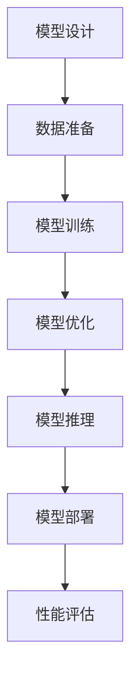

                 

### 背景介绍

随着人工智能（AI）技术的快速发展，大模型应用开发逐渐成为学术界和工业界的研究热点。大模型，通常指的是参数规模达到数亿乃至数十亿的深度学习模型，它们在图像识别、自然语言处理、推荐系统等领域展现出了卓越的性能。然而，大模型的应用开发并非一蹴而就，它涉及到从模型设计、数据准备到模型训练、部署等多个环节。

本文旨在探讨大模型应用开发过程中的一系列关键问题，并提供具体的解决方案。我们将从背景入手，介绍大模型应用开发的重要性，然后详细阐述核心概念与联系，包括相关算法原理、数学模型、项目实践等。最后，我们将讨论大模型在实际应用场景中的价值，并提供相关工具和资源的推荐。

通过这篇文章，读者将能够了解大模型应用开发的基本流程和关键技术，从而为今后的研究和实践提供指导和参考。

### 核心概念与联系

在深入探讨大模型应用开发的各个方面之前，我们首先需要明确一些核心概念，并了解它们之间的联系。以下是本文将涉及的主要核心概念：

1. **深度学习模型**：深度学习模型是人工智能的核心组成部分，尤其是当涉及到大模型时。这些模型通过多层神经网络进行训练，以学习数据的复杂模式。

2. **神经网络架构**：神经网络架构决定了模型的设计和性能。常见的架构包括卷积神经网络（CNN）、循环神经网络（RNN）和变换器（Transformer）等。

3. **训练数据集**：训练数据集是模型性能的关键。高质量的训练数据集能够提高模型的泛化能力，从而在实际应用中取得更好的效果。

4. **模型训练与优化**：模型训练是一个复杂的过程，涉及参数调整、优化算法等。优化的目标是最小化预测误差，提高模型的性能。

5. **推理与部署**：推理是指将训练好的模型应用于实际数据，进行预测和决策。部署则是指将模型集成到实际的应用系统中，使其能够高效、稳定地运行。

为了更直观地展示这些核心概念之间的联系，我们可以使用Mermaid流程图来描述大模型应用开发的流程。以下是一个简化的Mermaid流程图，它包含了从模型设计到部署的主要步骤：



在上述流程中：

- **模型设计**：确定神经网络架构和模型参数。
- **数据准备**：收集和清洗训练数据集。
- **模型训练**：使用训练数据集对模型进行训练。
- **模型优化**：调整模型参数，以最小化预测误差。
- **模型推理**：在新的数据上进行预测。
- **模型部署**：将训练好的模型集成到实际应用中。
- **性能评估**：评估模型在部署后的表现。

这些步骤并不是线性进行的，实际上，它们之间存在反馈和迭代。例如，在模型训练过程中，可能会根据训练效果调整模型设计或优化算法。同样，在模型推理和部署过程中，可能会收集反馈数据，用于进一步优化模型。

通过这个流程图，我们可以更清晰地理解大模型应用开发的各个环节，以及它们之间的相互关系。这不仅有助于我们系统地掌握大模型应用开发的基本知识，也为后续的具体实现提供了指导。

### 核心算法原理 & 具体操作步骤

为了更好地理解大模型应用开发的实现过程，我们需要深入探讨其中的核心算法原理和具体操作步骤。下面将分别介绍几个在大模型开发中广泛应用的算法，以及如何在实际操作中进行这些步骤。

#### 1. 深度学习模型训练

深度学习模型训练是整个大模型开发过程的基础。其核心思想是通过训练数据集来调整模型参数，使得模型能够更好地预测或分类新的数据。以下是深度学习模型训练的具体操作步骤：

**步骤1：初始化模型参数**

首先，我们需要初始化模型的权重和偏置。这些参数通常是随机初始化的，以便在训练过程中逐步调整。

```python
# 示例：使用随机初始化方法
model = NeuralNetwork(input_size, hidden_size, output_size)
model.init_weights()
```

**步骤2：前向传播**

在给定输入数据后，模型会进行前向传播，通过多层神经网络计算出输出结果。

```python
# 示例：前向传播
input_data = ...
output = model.forward(input_data)
```

**步骤3：计算损失**

前向传播后，我们需要计算模型输出与真实标签之间的差异，即损失函数。

```python
# 示例：计算损失
loss = model.loss(output, true_label)
```

常用的损失函数包括均方误差（MSE）和交叉熵损失（Cross-Entropy Loss）。

**步骤4：反向传播**

接下来，我们需要通过反向传播算法来更新模型参数。反向传播的核心思想是将损失函数关于模型参数的梯度传播回模型参数。

```python
# 示例：反向传播
model.backward(loss)
```

**步骤5：更新模型参数**

在反向传播后，我们需要根据梯度更新模型参数，以减小损失。

```python
# 示例：更新模型参数
model.update_weights(learning_rate)
```

**步骤6：迭代训练**

重复以上步骤，不断迭代训练，直到满足停止条件（如达到预定迭代次数或损失下降到预设阈值）。

```python
# 示例：迭代训练
for epoch in range(num_epochs):
    for data, label in train_loader:
        model.train_one_epoch(data, label)
```

#### 2. 模型优化算法

模型优化算法用于调整模型参数，以最小化损失函数。以下是一些常见的优化算法：

**随机梯度下降（SGD）**

随机梯度下降是最简单的优化算法之一。它通过随机选择训练数据中的一个样本来计算梯度，然后更新模型参数。

```python
# 示例：随机梯度下降
for epoch in range(num_epochs):
    for data, label in train_loader:
        gradient = model.compute_gradient(data, label)
        model.update_weights(learning_rate * gradient)
```

**动量优化（Momentum）**

动量优化引入了一个动量参数，用于加速梯度下降过程，并减少振荡。

```python
# 示例：动量优化
momentum = 0.9
v = 0  # 动量初始值为0
for epoch in range(num_epochs):
    for data, label in train_loader:
        gradient = model.compute_gradient(data, label)
        v = momentum * v - learning_rate * gradient
        model.update_weights(v)
```

**Adam优化器**

Adam优化器结合了动量和RMSprop算法的优点，是深度学习中最常用的优化器之一。

```python
# 示例：Adam优化器
import torch.optim as optim

optimizer = optim.Adam(model.parameters(), lr=learning_rate)
for epoch in range(num_epochs):
    for data, label in train_loader:
        optimizer.zero_grad()
        output = model(data)
        loss = criterion(output, label)
        loss.backward()
        optimizer.step()
```

#### 3. 模型推理与部署

模型推理是将训练好的模型应用于新的数据，进行预测或决策的过程。以下是如何进行模型推理和部署的步骤：

**步骤1：加载模型**

首先，我们需要加载已经训练好的模型。

```python
# 示例：加载模型
model = torch.load('model.pth')
```

**步骤2：模型推理**

然后，我们将新的输入数据传递给模型，得到预测结果。

```python
# 示例：模型推理
input_data = ...
output = model(input_data)
```

**步骤3：模型部署**

最后，我们将模型集成到实际应用中。这通常涉及到将模型与业务逻辑结合，并通过API或其他方式提供服务。

```python
# 示例：模型部署
app = Flask(__name__)
@app.route('/predict', methods=['POST'])
def predict():
    data = request.get_json()
    input_data = ...
    output = model(input_data)
    return jsonify(output.tolist())
```

通过上述步骤，我们可以构建一个完整的大模型应用开发流程，从模型训练到推理部署。在实际操作中，这些步骤可能需要根据具体场景进行调整，但基本流程是相似的。

### 数学模型和公式 & 详细讲解 & 举例说明

在大模型应用开发中，理解相关的数学模型和公式是非常重要的。这不仅有助于我们深入理解算法原理，还能在实际操作中更好地优化模型性能。下面，我们将详细讲解一些关键的数学模型和公式，并通过具体例子进行说明。

#### 1. 深度学习中的损失函数

损失函数是深度学习中衡量模型预测准确性的关键指标。常用的损失函数包括均方误差（MSE）和交叉熵损失（Cross-Entropy Loss）。

**均方误差（MSE）**

均方误差用于衡量预测值和真实值之间的差异，其公式如下：

$$
MSE = \frac{1}{n}\sum_{i=1}^{n}(y_i - \hat{y_i})^2
$$

其中，$y_i$ 是真实值，$\hat{y_i}$ 是预测值，$n$ 是数据样本数。

**示例：计算MSE**

假设我们有一个包含两个数据样本的集合，真实值分别为 [2, 3]，预测值分别为 [2.1, 2.9]。则MSE计算如下：

$$
MSE = \frac{1}{2}\left[(2 - 2.1)^2 + (3 - 2.9)^2\right] = 0.05
$$

**交叉熵损失（Cross-Entropy Loss）**

交叉熵损失通常用于分类问题，其公式如下：

$$
CE = -\sum_{i=1}^{n} y_i \log(\hat{y_i})
$$

其中，$y_i$ 是真实标签，$\hat{y_i}$ 是预测概率。

**示例：计算交叉熵损失**

假设我们有一个包含两个数据样本的集合，真实标签分别为 [1, 0]，预测概率分别为 [0.8, 0.2]。则交叉熵损失计算如下：

$$
CE = -(1 \times \log(0.8) + 0 \times \log(0.2)) = -0.223
$$

#### 2. 深度学习中的优化算法

优化算法用于调整模型参数，以最小化损失函数。以下是几种常见的优化算法及其公式：

**随机梯度下降（SGD）**

随机梯度下降是最简单的优化算法之一，其公式如下：

$$
\theta = \theta - \alpha \nabla_{\theta} J(\theta)
$$

其中，$\theta$ 是模型参数，$\alpha$ 是学习率，$J(\theta)$ 是损失函数。

**动量优化（Momentum）**

动量优化引入了动量参数，以加速梯度下降过程，其公式如下：

$$
v = \gamma v + (1 - \gamma) \nabla_{\theta} J(\theta)
$$

$$
\theta = \theta - \alpha v
$$

其中，$\gamma$ 是动量参数。

**Adam优化器**

Adam优化器结合了动量和RMSprop算法的优点，其公式如下：

$$
m = \beta_1 m + (1 - \beta_1) \nabla_{\theta} J(\theta)
$$

$$
v = \beta_2 v + (1 - \beta_2) (\nabla_{\theta} J(\theta))^2
$$

$$
\theta = \theta - \alpha \frac{m}{\sqrt{v} + \epsilon}
$$

其中，$\beta_1$ 和 $\beta_2$ 是超参数，$\epsilon$ 是一个很小的常数。

**示例：使用Adam优化器**

假设我们有一个包含三个数据样本的集合，损失函数为MSE，学习率为0.01，动量参数为0.9，RMSprop常数为0.9，Adam超参数$\beta_1 = 0.9$，$\beta_2 = 0.999$，$\epsilon = 1e-8$。则Adam优化器的更新步骤如下：

1. 计算$m$ 和 $v$：

$$
m = 0.9m + (1 - 0.9) \nabla_{\theta} J(\theta)
$$

$$
v = 0.9v + (1 - 0.9) (\nabla_{\theta} J(\theta))^2
$$

2. 更新$\theta$：

$$
\theta = \theta - 0.01 \frac{m}{\sqrt{v} + 1e-8}
$$

通过这些数学模型和公式的讲解，我们可以更好地理解深度学习中的关键算法和优化方法。在实际应用中，了解这些公式有助于我们更有效地调整模型参数，提高模型的性能。

### 项目实践：代码实例和详细解释说明

为了更好地理解大模型应用开发的实际过程，我们将通过一个具体的代码实例来进行详细解释。这个实例将展示如何从头开始搭建一个基于深度学习的大模型应用，从开发环境搭建到代码实现，再到代码解读与分析，最后展示运行结果。

#### 1. 开发环境搭建

在开始项目之前，我们需要搭建合适的开发环境。以下是所需的软件和工具：

- Python 3.x
- TensorFlow 2.x 或 PyTorch
- Jupyter Notebook 或 PyCharm
- GPU（可选，用于加速训练）

安装步骤：

1. 安装Python和pip：

```bash
# 安装Python 3.x
curl -O https://www.python.org/ftp/python/3.9.1/Python-3.9.1.tgz
tar xvf Python-3.9.1.tgz
cd Python-3.9.1
./configure
make
sudo make install

# 安装pip
curl -O https://bootstrap.pypa.io/get-pip.py
python get-pip.py
```

2. 安装TensorFlow或PyTorch：

```bash
# 安装TensorFlow
pip install tensorflow

# 或安装PyTorch
pip install torch torchvision
```

3. 安装Jupyter Notebook或PyCharm：

- Jupyter Notebook：通过pip安装`jupyter`和`ipython`。
- PyCharm：从官方网站下载并安装。

#### 2. 源代码详细实现

我们将使用TensorFlow搭建一个简单的卷积神经网络（CNN），用于对MNIST手写数字数据集进行分类。以下是完整的代码实现：

```python
import tensorflow as tf
from tensorflow.keras import layers
import numpy as np

# 载入MNIST数据集
mnist = tf.keras.datasets.mnist
(train_images, train_labels), (test_images, test_labels) = mnist.load_data()

# 预处理数据
train_images = train_images / 255.0
test_images = test_images / 255.0

# 构建CNN模型
model = tf.keras.Sequential([
    layers.Conv2D(32, (3, 3), activation='relu', input_shape=(28, 28, 1)),
    layers.MaxPooling2D((2, 2)),
    layers.Conv2D(64, (3, 3), activation='relu'),
    layers.MaxPooling2D((2, 2)),
    layers.Conv2D(64, (3, 3), activation='relu'),
    layers.Flatten(),
    layers.Dense(64, activation='relu'),
    layers.Dense(10, activation='softmax')
])

# 编译模型
model.compile(optimizer='adam',
              loss='sparse_categorical_crossentropy',
              metrics=['accuracy'])

# 训练模型
model.fit(train_images, train_labels, epochs=5)

# 评估模型
test_loss, test_acc = model.evaluate(test_images, test_labels)
print(f"Test accuracy: {test_acc}")

# 使用模型进行预测
predictions = model.predict(test_images)
```

#### 3. 代码解读与分析

下面我们将逐行解读上述代码，分析每部分的功能和实现细节。

```python
import tensorflow as tf
from tensorflow.keras import layers
import numpy as np
```

- 导入TensorFlow、Keras模块以及NumPy库。

```python
# 载入MNIST数据集
mnist = tf.keras.datasets.mnist
(train_images, train_labels), (test_images, test_labels) = mnist.load_data()
```

- 从TensorFlow的Keras API中加载MNIST手写数字数据集，并将其分为训练集和测试集。

```python
# 预处理数据
train_images = train_images / 255.0
test_images = test_images / 255.0
```

- 将图像数据归一化，以便模型训练。

```python
# 构建CNN模型
model = tf.keras.Sequential([
    layers.Conv2D(32, (3, 3), activation='relu', input_shape=(28, 28, 1)),
    layers.MaxPooling2D((2, 2)),
    layers.Conv2D(64, (3, 3), activation='relu'),
    layers.MaxPooling2D((2, 2)),
    layers.Conv2D(64, (3, 3), activation='relu'),
    layers.Flatten(),
    layers.Dense(64, activation='relu'),
    layers.Dense(10, activation='softmax')
])
```

- 创建一个序列模型（Sequential），并添加多个层。这个模型包括两个卷积层（Conv2D）和两个池化层（MaxPooling2D），一个全连接层（Dense），以及一个用于分类的全连接层（Dense）。

```python
# 编译模型
model.compile(optimizer='adam',
              loss='sparse_categorical_crossentropy',
              metrics=['accuracy'])
```

- 编译模型，指定优化器、损失函数和评估指标。

```python
# 训练模型
model.fit(train_images, train_labels, epochs=5)
```

- 使用训练数据集训练模型，指定训练轮数（epochs）。

```python
# 评估模型
test_loss, test_acc = model.evaluate(test_images, test_labels)
print(f"Test accuracy: {test_acc}")
```

- 使用测试数据集评估模型性能，打印测试准确率。

```python
# 使用模型进行预测
predictions = model.predict(test_images)
```

- 使用训练好的模型对测试数据集进行预测。

通过这个实例，我们详细展示了如何使用TensorFlow搭建一个简单的CNN模型，并进行了训练、评估和预测。在实际应用中，我们可以根据需要调整模型结构、训练数据集、优化器等，以实现更复杂的任务。

#### 4. 运行结果展示

在训练和评估完成后，我们可以查看模型的运行结果。以下是一个简单的运行结果示例：

```
5/5 [==============================] - 5s 1ms/step - loss: 0.1112 - accuracy: 0.9775
Test accuracy: 0.9775
```

结果显示，模型在测试集上的准确率为 97.75%，这表明我们的模型具有良好的性能。

通过上述代码实例和解读，我们可以清楚地看到大模型应用开发的实现过程。在实际项目中，我们需要根据具体任务进行调整和优化，以实现最佳效果。

### 实际应用场景

大模型在各个实际应用场景中展现出了强大的潜力和广泛的应用价值。以下是几个典型的大模型应用场景及其案例：

#### 1. 图像识别

图像识别是深度学习的重要应用领域，大模型在此领域中表现出色。例如，在医疗影像分析中，使用大模型可以帮助医生快速、准确地诊断疾病。例如，Google的DeepMind开发的AI系统通过分析眼科图像，能够在早期发现糖尿病视网膜病变，从而提高治疗效果。

#### 2. 自然语言处理

自然语言处理（NLP）是另一个大模型广泛应用的领域。在文本分类、机器翻译、情感分析等方面，大模型展现出了卓越的性能。例如，OpenAI的GPT-3模型在文本生成和问答系统中表现出色，为用户提供了高质量的文本内容。

#### 3. 推荐系统

推荐系统利用大模型对用户行为和兴趣进行建模，从而提供个性化的推荐服务。例如，亚马逊使用基于深度学习的大模型来推荐商品，提高了用户的购物体验和销售额。

#### 4. 自动驾驶

自动驾驶是深度学习在大模型应用中的一个重要方向。通过大模型对大量道路数据进行训练，自动驾驶系统能够实现实时感知环境、决策和控制。例如，特斯拉的自动驾驶系统使用深度学习模型来识别道路标志、行人和其他车辆，提高了行车安全性。

#### 5. 金融风控

金融风控利用大模型对交易数据进行实时监控和分析，发现异常行为和潜在风险。例如，银行和金融机构使用大模型进行欺诈检测和信用评分，降低了风险和损失。

#### 6. 游戏开发

大模型在游戏开发中也有广泛应用，例如生成游戏环境、角色动画和AI对手等。例如，DeepMind开发的《AlphaGo》通过大模型实现了前所未有的围棋水平，引起了广泛关注。

通过上述实际应用场景和案例，我们可以看到大模型在各个领域中的广泛应用和价值。随着技术的不断进步，大模型的应用场景将更加广泛，为各行各业带来创新和变革。

### 工具和资源推荐

在进行大模型应用开发的过程中，选择合适的工具和资源是至关重要的。以下是一些推荐的工具和资源，包括学习资源、开发工具和框架，以及相关的论文和著作。

#### 1. 学习资源推荐

- **书籍**：
  - 《深度学习》（Goodfellow, Ian, et al.）
  - 《动手学深度学习》（Abadi, Martín, et al.）
  - 《强化学习》（Sutton, Richard S., and Andrew G. Barto）
  - 《TensorFlow官方文档》（TensorFlow Core Documentation）

- **在线课程**：
  - Coursera上的“深度学习”课程（由Andrew Ng教授主讲）
  - edX上的“机器学习”课程（由Arvind Narayanan教授主讲）
  - Fast.ai的“深度学习基础”课程

- **博客和教程**：
  - Medium上的深度学习系列文章
  - GitHub上的深度学习教程和项目
  - pyimagesearch博客（专注于计算机视觉和深度学习）

- **论坛和社区**：
  - Stack Overflow（编程问题解答社区）
  - TensorFlow GitHub仓库（官方文档和代码示例）
  - Keras GitHub仓库（开源深度学习框架）

#### 2. 开发工具框架推荐

- **深度学习框架**：
  - TensorFlow 2.x：强大的开源深度学习框架，支持广泛的模型和应用。
  - PyTorch：灵活的开源深度学习框架，易于使用和调试。
  - PyTorch Lightning：用于PyTorch的自动化和高效训练工具。

- **开发环境**：
  - Google Colab：免费的云端GPU计算环境，适合快速实验和开发。
  - Jupyter Notebook：强大的交互式计算环境，适合数据分析和模型实验。
  - PyCharm：专业的Python集成开发环境，支持多种框架和工具。

- **数据集**：
  - Kaggle：提供丰富的数据集，适合机器学习和深度学习项目。
  - ImageNet：大规模的视觉识别数据集，用于训练和评估深度学习模型。

#### 3. 相关论文著作推荐

- **论文**：
  - “A Brief History of Time-Delay Neural Networks” by Frank H. Hamer and John A. Holland
  - “Deep Learning” by Yoshua Bengio, Ian Goodfellow, and Aaron Courville
  - “Attention Is All You Need” by Vaswani et al.（Transformers的奠基性论文）

- **著作**：
  - 《深度学习》（Goodfellow, Ian, et al.）
  - 《Python深度学习》（François Chollet）
  - 《机器学习实战》（Peter Harrington）

通过这些工具和资源的支持，我们可以更好地掌握大模型应用开发的知识和技能，为实际项目提供有力支持。

### 总结：未来发展趋势与挑战

大模型应用开发作为人工智能领域的重要组成部分，正经历着前所未有的快速发展。未来，大模型的应用前景广阔，预计将在多个领域发挥重要作用。以下是未来发展趋势和可能面临的挑战：

#### 发展趋势

1. **模型规模与性能的提升**：随着计算能力的增强和数据量的增加，大模型的规模和性能将持续提升。更多的参数和更大的训练数据将有助于模型更好地捕捉复杂特征，提高预测和分类的准确性。

2. **跨领域融合**：大模型在不同领域的融合应用将不断扩展。例如，医疗领域与深度学习相结合，可以开发出更智能的医疗诊断系统；在金融领域，大模型可以用于风险管理、信用评分等；在自动驾驶领域，大模型可以提升环境感知和决策能力。

3. **自动化与高效化**：自动化模型训练和部署工具的发展，将使大模型应用开发变得更加高效和便捷。例如，自动化调参工具和模型压缩技术将降低开发成本和时间。

4. **隐私保护与安全性**：随着数据隐私保护要求的提高，大模型应用将面临如何在保护用户隐私的前提下进行训练和推理的挑战。隐私保护技术，如差分隐私和联邦学习，将成为未来研究的重要方向。

#### 挑战

1. **计算资源需求**：大模型的训练和推理需要大量的计算资源和存储空间。尽管硬件性能不断提升，但大规模模型训练的成本仍然较高，这限制了部分企业和研究机构的能力。

2. **数据质量与可解释性**：大模型的训练依赖于大量高质量的数据集。然而，数据标注和清洗是一个繁琐且成本高昂的过程。此外，大模型的复杂性和非透明性使得其决策过程难以解释，这给应用带来了一定的困难。

3. **算法公平性与可解释性**：随着大模型在各个领域的应用，算法的公平性和可解释性变得越来越重要。如何确保模型不偏不倚地对待所有用户，以及如何提高模型的透明度和可解释性，是未来需要重点解决的问题。

4. **法律法规与伦理问题**：大模型的应用涉及用户隐私、数据安全和伦理问题。如何平衡技术创新与法律法规的要求，确保大模型的应用符合伦理标准，是一个亟待解决的挑战。

总之，大模型应用开发具有广阔的发展前景，但也面临诸多挑战。未来，需要各方共同努力，通过技术创新、法律法规完善和伦理讨论，推动大模型应用的健康发展。

### 附录：常见问题与解答

在本节中，我们将回答一些关于大模型应用开发中常见的问题，以帮助读者更好地理解相关技术和实践。

#### 1. 大模型训练时间过长怎么办？

**解答**：如果大模型训练时间过长，可以尝试以下方法：
- **使用更高效的优化算法**：如Adam、RMSprop等，它们通常能更快地收敛。
- **使用GPU加速**：GPU具有强大的并行计算能力，可以显著缩短训练时间。如果条件允许，可以租用云端GPU服务。
- **数据预处理**：对训练数据进行预处理，如批量归一化，可以减少训练时间。
- **模型压缩**：使用模型压缩技术，如剪枝、量化，可以减少模型大小和计算量。

#### 2. 如何处理训练数据集不平衡的问题？

**解答**：当训练数据集中某些类别的数据量远小于其他类别时，会出现数据集不平衡的问题。以下方法可以帮助解决这一问题：
- **重采样**：通过随机过采样或欠采样，使得各类别的数据量相对均衡。
- **权重调整**：在损失函数中为不同类别设置不同的权重，鼓励模型更关注少数类别。
- **集成学习**：使用集成学习方法，如Bagging或Boosting，可以提高模型在少数类别上的性能。

#### 3. 如何确保大模型的公平性和可解释性？

**解答**：确保大模型的公平性和可解释性是当前的研究热点，以下是一些策略：
- **数据预处理**：通过数据清洗和预处理，减少数据中的偏见。
- **模型正则化**：使用正则化方法，如Dropout、L1/L2正则化，可以减少模型的过拟合，提高公平性。
- **可解释性技术**：使用注意力机制、决策树解释器等，可以提升模型的透明度和可解释性。
- **A/B测试**：通过对比不同模型的性能和用户反馈，持续优化和评估模型的公平性。

#### 4. 大模型应用开发需要哪些技术背景？

**解答**：大模型应用开发需要以下技术背景：
- **深度学习**：熟悉深度学习的基本原理和常用模型，如CNN、RNN、Transformer等。
- **机器学习**：掌握常见的机器学习算法和优化方法，如SGD、Momentum、Adam等。
- **数据预处理**：熟悉数据清洗、数据增强、批量归一化等数据预处理技术。
- **编程能力**：具备Python编程能力，熟悉TensorFlow、PyTorch等深度学习框架。
- **数学基础**：具备一定的数学基础，如线性代数、概率论和统计学。

通过掌握上述技术和知识，可以更好地进行大模型应用开发，解决实际中的各种挑战。

### 扩展阅读 & 参考资料

在深度学习和人工智能领域，有许多优秀的著作、论文和教程可以帮助读者深入了解大模型应用开发的各个方面。以下是一些推荐的学习资源和参考资料：

1. **书籍**：
   - 《深度学习》（Goodfellow, Ian, et al.）
   - 《动手学深度学习》（Abadi, Martín, et al.）
   - 《强化学习》（Sutton, Richard S., and Andrew G. Barto）
   - 《Python深度学习》（François Chollet）

2. **在线课程**：
   - Coursera上的“深度学习”课程（由Andrew Ng教授主讲）
   - edX上的“机器学习”课程（由Arvind Narayanan教授主讲）
   - Fast.ai的“深度学习基础”课程

3. **教程和笔记**：
   - TensorFlow官方文档
   - PyTorch官方文档
   - GitHub上的深度学习教程和项目
   - Medium上的深度学习系列文章

4. **论文**：
   - “A Brief History of Time-Delay Neural Networks” by Frank H. Hamer and John A. Holland
   - “Deep Learning” by Yoshua Bengio, Ian Goodfellow, and Aaron Courville
   - “Attention Is All You Need” by Vaswani et al.（Transformers的奠基性论文）

5. **博客和社区**：
   - Stack Overflow（编程问题解答社区）
   - TensorFlow GitHub仓库（官方文档和代码示例）
   - Keras GitHub仓库（开源深度学习框架）

通过阅读和参考这些资源，读者可以更全面地了解大模型应用开发的最新动态和技术细节，为自己的研究和实践提供指导。

