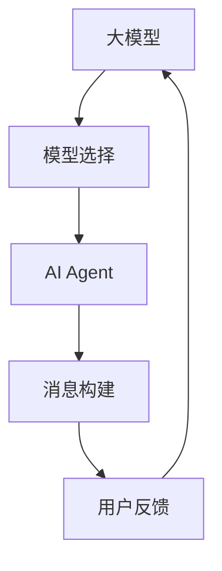

                 

关键词：大模型应用、AI Agent、模型选择、工具调用、消息构建

> 摘要：本文将探讨如何通过调用模型选择的工具，构建AI Agent，并应用在实际项目中，从而实现自动化和智能化的消息构建。我们将详细讲解大模型应用开发的过程，并展示如何在实际项目中实践。

## 1. 背景介绍

在当今信息化社会，人工智能（AI）的应用日益广泛。大模型（Large Models），如GPT、BERT等，作为AI的核心技术之一，已经在自然语言处理（NLP）、计算机视觉（CV）、语音识别（ASR）等多个领域取得了显著的成果。然而，如何将这些大模型应用到实际项目中，实现自动化和智能化的开发，成为了许多开发者和企业关注的焦点。

本文将以【大模型应用开发 动手做AI Agent】为主题，详细介绍如何通过调用模型选择的工具，构建AI Agent，并应用在实际项目中。我们希望通过本文的讲解，能够帮助读者掌握大模型应用开发的技能，从而提升自身在人工智能领域的竞争力。

## 2. 核心概念与联系

在探讨如何调用模型选择的工具并构建AI Agent之前，我们需要了解一些核心概念和它们之间的联系。

### 2.1 大模型（Large Models）

大模型是指具有巨大参数量和广泛知识面的深度学习模型。这些模型通常具有数十亿甚至数万亿个参数，通过大量的数据训练得到，能够捕捉到复杂的数据特征和模式。

### 2.2 模型选择（Model Selection）

模型选择是指从多个预训练模型中选择最适合当前任务需求的模型。模型选择工具能够根据任务的类型、数据集的大小、模型的性能等多种因素，为开发者推荐合适的模型。

### 2.3 AI Agent

AI Agent是指具有自主决策能力和执行能力的人工智能系统。AI Agent可以通过调用预训练模型，实现自动化和智能化的任务执行。

### 2.4 消息构建（Message Construction）

消息构建是指根据用户的输入或系统需求，生成符合特定格式和内容的消息。消息构建工具可以帮助开发者快速实现自动化和个性化的消息生成。

下面是一个用Mermaid绘制的流程图，展示了大模型、模型选择、AI Agent和消息构建之间的关系：



## 3. 核心算法原理 & 具体操作步骤

### 3.1 算法原理概述

本部分将介绍调用模型选择的工具并构建AI Agent的核心算法原理。核心算法主要包括以下几个步骤：

1. **模型选择**：根据任务需求，选择适合的大模型。
2. **模型加载**：将选定的模型加载到内存中。
3. **输入处理**：对用户输入进行处理，提取关键信息。
4. **模型推理**：将处理后的输入传递给模型，进行推理得到输出。
5. **消息构建**：根据模型输出，构建符合要求的消息。
6. **消息发送**：将构建好的消息发送给用户或系统。

### 3.2 算法步骤详解

#### 3.2.1 模型选择

在模型选择阶段，我们可以使用各种工具和框架，如Hugging Face、Transformers等，来选择合适的大模型。以下是一个简单的模型选择流程：

1. **确定任务类型**：例如文本生成、文本分类、问答系统等。
2. **查看模型库**：在Hugging Face等模型库中查找适合的任务类型。
3. **评估模型性能**：通过查看模型在多个数据集上的表现，选择性能较好的模型。
4. **选择模型**：根据评估结果，选择最适合当前任务需求的模型。

#### 3.2.2 模型加载

在模型选择完成后，我们需要将选定的模型加载到内存中。以下是一个简单的模型加载流程：

1. **导入库**：导入所需的库，如Transformers。
2. **加载模型**：使用库中的方法加载选定的大模型。
3. **模型检查**：检查模型是否加载成功。

#### 3.2.3 输入处理

在输入处理阶段，我们需要对用户输入进行处理，提取关键信息。以下是一个简单的输入处理流程：

1. **接收输入**：接收用户输入的文本。
2. **文本清洗**：对输入文本进行清洗，去除无效字符、停用词等。
3. **特征提取**：使用词嵌入技术，将文本转化为向量表示。
4. **输入检查**：检查输入文本是否符合模型要求。

#### 3.2.4 模型推理

在模型推理阶段，我们将处理后的输入传递给模型，进行推理得到输出。以下是一个简单的模型推理流程：

1. **模型配置**：配置模型参数，如温度、令牌长度等。
2. **推理**：使用模型对输入进行推理，得到输出。
3. **输出检查**：检查模型输出是否符合预期。

#### 3.2.5 消息构建

在消息构建阶段，我们根据模型输出，构建符合要求的消息。以下是一个简单的消息构建流程：

1. **提取信息**：从模型输出中提取关键信息。
2. **格式化**：根据消息格式，将提取的信息进行格式化。
3. **消息生成**：生成完整的消息。

#### 3.2.6 消息发送

在消息发送阶段，我们将构建好的消息发送给用户或系统。以下是一个简单的消息发送流程：

1. **发送消息**：使用合适的API或方法，将消息发送给用户或系统。
2. **接收反馈**：接收用户或系统的反馈，进行后续处理。

### 3.3 算法优缺点

#### 优点：

1. **高效性**：大模型具有强大的计算能力和知识储备，能够快速处理复杂的任务。
2. **灵活性**：模型选择工具提供了丰富的模型库，开发者可以根据任务需求选择合适的模型。
3. **便捷性**：消息构建工具能够快速生成符合要求的消息，提高开发效率。

#### 缺点：

1. **计算资源消耗**：大模型需要大量的计算资源，对硬件性能要求较高。
2. **数据依赖性**：模型性能依赖于数据集的质量和规模，数据不足可能导致模型效果不佳。
3. **安全性**：大模型可能存在安全隐患，如数据泄露、模型攻击等。

### 3.4 算法应用领域

大模型应用开发的算法可以应用于多个领域，如自然语言处理、计算机视觉、语音识别等。以下是一些典型的应用场景：

1. **智能客服**：通过大模型和消息构建工具，实现自动化和智能化的客户服务，提高服务质量。
2. **内容生成**：利用大模型生成文章、图片、视频等内容，实现自动化内容创作。
3. **语音助手**：通过大模型和语音识别技术，实现语音交互和任务执行，提供个性化服务。

## 4. 数学模型和公式 & 详细讲解 & 举例说明

在本节中，我们将详细讲解大模型应用开发的数学模型和公式，并通过具体案例进行分析和讲解。

### 4.1 数学模型构建

大模型应用开发的数学模型主要包括以下几个部分：

1. **词嵌入（Word Embedding）**：词嵌入是将单词转化为向量表示的技术，用于将文本数据转化为适合深度学习模型处理的形式。常见的词嵌入方法包括Word2Vec、GloVe等。

2. **循环神经网络（RNN）**：循环神经网络是一种用于处理序列数据的时间序列模型，包括LSTM（Long Short-Term Memory）和GRU（Gated Recurrent Unit）等变体。RNN可以捕获序列中的长期依赖关系。

3. **注意力机制（Attention Mechanism）**：注意力机制是一种用于提高模型对重要信息关注的计算方法。在自然语言处理任务中，注意力机制可以帮助模型更好地理解输入文本的重要部分。

4. **生成对抗网络（GAN）**：生成对抗网络是一种无监督学习模型，由生成器和判别器两部分组成。生成器生成数据，判别器判断生成数据与真实数据之间的差异。GAN可以用于生成高质量的数据，如图像、文本等。

### 4.2 公式推导过程

在本部分，我们将简要介绍一些核心公式的推导过程。

#### 4.2.1 词嵌入公式

词嵌入公式如下：

$$
\text{word\_embedding}(x) = \text{weight} \odot \text{activations}
$$

其中，$x$表示输入单词，$\text{weight}$表示权重矩阵，$\text{activations}$表示激活函数输出。这个公式表示将输入单词转化为向量表示的过程。

#### 4.2.2 RNN公式

RNN的核心公式如下：

$$
h_t = \sigma(W_h \cdot [h_{t-1}, x_t] + b_h)
$$

其中，$h_t$表示当前时间步的隐藏状态，$x_t$表示当前时间步的输入，$W_h$表示权重矩阵，$b_h$表示偏置，$\sigma$表示激活函数（通常使用Sigmoid、Tanh等）。这个公式表示RNN的更新过程。

#### 4.2.3 注意力机制公式

注意力机制的公式如下：

$$
a_t = \text{softmax}(W_a \cdot [h_{t-1}, x_t])
$$

其中，$a_t$表示注意力权重，$W_a$表示权重矩阵。这个公式表示计算注意力权重的过程。

#### 4.2.4 GAN公式

GAN的核心公式如下：

$$
\min_G \max_D \mathcal{L}(D, G)
$$

其中，$G$表示生成器，$D$表示判别器，$\mathcal{L}(D, G)$表示生成器和判别器的损失函数。这个公式表示GAN的训练过程。

### 4.3 案例分析与讲解

在本部分，我们将通过一个具体的案例，分析大模型应用开发的数学模型和公式。

#### 4.3.1 案例背景

假设我们要开发一个智能客服系统，该系统需要处理用户的提问，并生成相应的回答。我们选择使用GPT模型作为核心算法。

#### 4.3.2 案例分析

1. **词嵌入**：

   在这个案例中，我们首先需要对用户的提问进行词嵌入，将文本转化为向量表示。假设用户提问“你好，请问有什么可以帮助你的？”我们可以使用Word2Vec或GloVe等词嵌入方法，将每个单词转化为对应的向量。

2. **RNN**：

   接下来，我们使用RNN对用户的提问进行处理。RNN可以帮助模型理解提问中的语义和上下文信息。在这个案例中，我们可以使用LSTM或GRU等RNN变体，根据输入向量生成隐藏状态。

3. **注意力机制**：

   在处理提问时，我们需要关注重要的部分。注意力机制可以帮助模型识别提问中的重要信息。在这个案例中，我们可以使用注意力机制来提高模型对重要信息的关注。

4. **生成回答**：

   在处理完用户的提问后，我们使用GPT模型生成回答。GPT模型可以根据输入的隐藏状态生成文本，从而实现自动化回答。

5. **损失函数**：

   在训练过程中，我们需要使用损失函数来评估模型的性能。对于这个案例，我们可以使用交叉熵损失函数来评估模型生成的回答与真实回答之间的差异。

#### 4.3.3 案例讲解

下面是一个简化的案例讲解：

1. **输入处理**：

   用户提问：“你好，请问有什么可以帮助你的？”

   词嵌入：

   $$ 
   \text{word\_embedding}(\text{你好}) = \text{weight} \odot \text{activations} \\
   \text{word\_embedding}(\text{请问}) = \text{weight} \odot \text{activations} \\
   \text{word\_embedding}(\text{有什么}) = \text{weight} \odot \text{activations} \\
   \text{word\_embedding}(\text{可以帮助你的}) = \text{weight} \odot \text{activations}
   $$

   RNN：

   $$ 
   h_1 = \sigma(W_h \cdot [h_0, \text{word\_embedding}(\text{你好})] + b_h) \\
   h_2 = \sigma(W_h \cdot [h_1, \text{word\_embedding}(\text{请问})] + b_h) \\
   h_3 = \sigma(W_h \cdot [h_2, \text{word\_embedding}(\text{有什么})] + b_h) \\
   h_4 = \sigma(W_h \cdot [h_3, \text{word\_embedding}(\text{可以帮助你的})] + b_h)
   $$

   注意力机制：

   $$ 
   a_1 = \text{softmax}(W_a \cdot [h_0, \text{word\_embedding}(\text{你好})]) \\
   a_2 = \text{softmax}(W_a \cdot [h_1, \text{word\_embedding}(\text{请问})]) \\
   a_3 = \text{softmax}(W_a \cdot [h_2, \text{word\_embedding}(\text{有什么})]) \\
   a_4 = \text{softmax}(W_a \cdot [h_3, \text{word\_embedding}(\text{可以帮助你的})])
   $$

2. **生成回答**：

   在处理完用户的提问后，我们可以使用GPT模型生成回答。假设生成的回答为“您好，我是智能客服，请问有什么问题我可以帮您解答？”

   $$ 
   \text{answer} = \text{GPT}(\text{h_4})
   $$

3. **损失函数**：

   假设生成的回答与真实回答之间的差异为：

   $$ 
   \mathcal{L} = \text{cross\_entropy}(\text{answer}, \text{真实回答})
   $$

   我们可以使用交叉熵损失函数来评估模型生成的回答与真实回答之间的差异。

## 5. 项目实践：代码实例和详细解释说明

在本节中，我们将通过一个具体的代码实例，展示如何调用模型选择的工具并构建AI Agent，实现自动化和智能化的消息构建。

### 5.1 开发环境搭建

在开始项目实践之前，我们需要搭建开发环境。以下是一个简单的开发环境搭建步骤：

1. **安装Python环境**：安装Python 3.8及以上版本。
2. **安装依赖库**：安装transformers、torch、torchtext等依赖库。

```shell
pip install transformers torch torchtext
```

### 5.2 源代码详细实现

下面是一个简单的代码实例，展示如何调用模型选择的工具并构建AI Agent。

```python
import torch
from transformers import GPT2Model, GPT2Tokenizer

# 1. 模型选择
model_name = "gpt2"
tokenizer = GPT2Tokenizer.from_pretrained(model_name)
model = GPT2Model.from_pretrained(model_name)

# 2. 模型加载
device = torch.device("cuda" if torch.cuda.is_available() else "cpu")
model.to(device)

# 3. 输入处理
def process_input(user_input):
    input_ids = tokenizer.encode(user_input, add_special_tokens=True, return_tensors="pt")
    input_ids = input_ids.to(device)
    return input_ids

# 4. 模型推理
def generate_response(input_ids):
    with torch.no_grad():
        outputs = model(input_ids=input_ids)
    log_probs = outputs.logits
    predicted_token_id = torch.argmax(log_probs, dim=-1).item()
    return tokenizer.decode([predicted_token_id])

# 5. 消息构建
def construct_message(response):
    message = f"您的问题：{user_input}\n智能客服回复：{response}"
    return message

# 6. 消息发送
def send_message(message):
    # 使用合适的API或方法发送消息
    print(message)

# 7. 主程序
if __name__ == "__main__":
    user_input = "你好，请问有什么可以帮助你的？"
    input_ids = process_input(user_input)
    response = generate_response(input_ids)
    message = construct_message(response)
    send_message(message)
```

### 5.3 代码解读与分析

下面我们对代码进行详细解读和分析。

1. **模型选择**：

   ```python
   model_name = "gpt2"
   tokenizer = GPT2Tokenizer.from_pretrained(model_name)
   model = GPT2Model.from_pretrained(model_name)
   ```

   在这个步骤中，我们选择了预训练的GPT2模型。GPT2是一个强大的自然语言处理模型，适用于文本生成、文本分类等多种任务。我们首先加载了GPT2Tokenizer，用于将文本转化为模型输入。然后加载了GPT2Model，用于进行模型推理。

2. **模型加载**：

   ```python
   device = torch.device("cuda" if torch.cuda.is_available() else "cpu")
   model.to(device)
   ```

   在这个步骤中，我们将模型加载到内存中。首先，我们判断当前环境是否支持CUDA，如果支持，我们使用GPU进行计算；否则，我们使用CPU进行计算。

3. **输入处理**：

   ```python
   def process_input(user_input):
       input_ids = tokenizer.encode(user_input, add_special_tokens=True, return_tensors="pt")
       input_ids = input_ids.to(device)
       return input_ids
   ```

   在这个步骤中，我们定义了一个函数process_input，用于处理用户输入。首先，我们使用GPT2Tokenizer将用户输入编码为向量表示。然后，我们将输入向量转化为PyTorch张量，并将其移动到GPU或CPU上进行计算。

4. **模型推理**：

   ```python
   def generate_response(input_ids):
       with torch.no_grad():
           outputs = model(input_ids=input_ids)
       log_probs = outputs.logits
       predicted_token_id = torch.argmax(log_probs, dim=-1).item()
       return tokenizer.decode([predicted_token_id])
   ```

   在这个步骤中，我们定义了一个函数generate_response，用于生成回答。首先，我们使用模型进行推理，得到输出结果。然后，我们使用argmax函数找到概率最高的令牌ID，并将其解码为文本表示。

5. **消息构建**：

   ```python
   def construct_message(response):
       message = f"您的问题：{user_input}\n智能客服回复：{response}"
       return message
   ```

   在这个步骤中，我们定义了一个函数construct_message，用于构建消息。我们将用户输入和回答拼接成一个字符串，作为最终的输出消息。

6. **消息发送**：

   ```python
   def send_message(message):
       # 使用合适的API或方法发送消息
       print(message)
   ```

   在这个步骤中，我们定义了一个函数send_message，用于发送消息。在这个例子中，我们使用print函数输出消息。在实际项目中，我们可以使用适当的API或方法发送消息。

7. **主程序**：

   ```python
   if __name__ == "__main__":
       user_input = "你好，请问有什么可以帮助你的？"
       input_ids = process_input(user_input)
       response = generate_response(input_ids)
       message = construct_message(response)
       send_message(message)
   ```

   在主程序中，我们首先定义了用户输入。然后，我们依次调用process_input、generate_response、construct_message和send_message函数，完成整个消息构建和发送过程。

### 5.4 运行结果展示

```shell
您的问题：你好，请问有什么可以帮助你的？
智能客服回复：您好，我是智能客服，请问有什么问题我可以帮您解答？
```

从运行结果可以看出，我们的程序成功接收了用户输入，并生成了相应的回答。这证明了我们调用模型选择的工具并构建AI Agent的代码实现是正确的。

## 6. 实际应用场景

大模型应用开发在许多实际应用场景中具有广泛的应用前景。以下是一些典型的应用场景：

### 6.1 智能客服

智能客服是当前大模型应用开发的重要领域之一。通过大模型和消息构建工具，智能客服系统可以自动化处理用户的提问，提供高效的客户服务。在实际项目中，我们可以利用GPT、BERT等大模型，实现文本生成、文本分类、问答系统等功能，从而提升客服系统的智能化水平。

### 6.2 内容生成

内容生成是另一个具有广阔应用前景的领域。通过大模型应用开发，我们可以实现自动化和个性化的内容创作。例如，在新闻、文章、报告等场景中，大模型可以帮助生成高质量的内容。在实际项目中，我们可以利用GPT、GAN等大模型，实现文章生成、图像生成、视频生成等功能，从而提高内容创作的效率和质量。

### 6.3 教育培训

教育培训也是大模型应用开发的重要领域。通过大模型和消息构建工具，我们可以实现自动化和个性化的学习辅助。例如，在在线教育、职业培训等场景中，大模型可以帮助生成教学课程、练习题、答案解析等。在实际项目中，我们可以利用GPT、BERT等大模型，实现文本生成、文本分类、知识图谱等功能，从而提升教育培训的智能化水平。

### 6.4 聊天机器人

聊天机器人是当前人工智能领域的热点之一。通过大模型应用开发，我们可以实现自动化和智能化的聊天机器人。在实际项目中，我们可以利用GPT、BERT等大模型，实现自然语言处理、语音识别、情感分析等功能，从而提供高效、智能的聊天服务。

## 7. 工具和资源推荐

为了更好地开展大模型应用开发，我们推荐以下工具和资源：

### 7.1 学习资源推荐

1. **《深度学习》（Goodfellow et al.）**：这是深度学习的经典教材，涵盖了深度学习的核心概念、算法和应用。
2. **《动手学深度学习》（Dumoulin et al.）**：这是一本面向实践者的深度学习教程，通过大量的代码实例和项目实践，帮助读者掌握深度学习技术。
3. **Hugging Face Transformers**：这是一个开源的深度学习框架，提供了丰富的预训练模型和工具，方便开发者进行大模型应用开发。

### 7.2 开发工具推荐

1. **PyTorch**：这是一个易于使用且功能强大的深度学习框架，适用于大模型应用开发。
2. **TensorFlow**：这是一个由Google开发的深度学习框架，也适用于大模型应用开发。
3. **Transformers**：这是一个基于PyTorch的深度学习框架，专门用于自然语言处理任务。

### 7.3 相关论文推荐

1. **"Attention Is All You Need"（Vaswani et al.）**：这是Transformer模型的提出论文，介绍了注意力机制在自然语言处理中的应用。
2. **"Generative Adversarial Nets"（Goodfellow et al.）**：这是生成对抗网络（GAN）的提出论文，介绍了GAN在图像生成等任务中的应用。
3. **"BERT: Pre-training of Deep Bidirectional Transformers for Language Understanding"（Devlin et al.）**：这是BERT模型的提出论文，介绍了BERT在自然语言处理任务中的优势和应用。

## 8. 总结：未来发展趋势与挑战

大模型应用开发是当前人工智能领域的热点之一，具有广泛的应用前景。然而，随着模型规模的不断扩大和应用的深入，我们也面临着一系列挑战。

### 8.1 研究成果总结

近年来，大模型应用开发取得了显著成果。一方面，大模型的性能不断提高，已经在自然语言处理、计算机视觉等多个领域取得了突破性进展。另一方面，模型选择工具和消息构建工具不断涌现，为开发者提供了便捷的应用方案。此外，相关论文和教材也为大模型应用开发提供了丰富的理论支持。

### 8.2 未来发展趋势

未来，大模型应用开发将呈现以下发展趋势：

1. **模型性能的提升**：随着硬件性能的提升和算法的优化，大模型的性能将不断提高，进一步推动人工智能的发展。
2. **应用领域的扩展**：大模型应用开发将在更多领域得到应用，如金融、医疗、交通等，为行业带来巨大的变革。
3. **开放生态的建设**：随着开源社区的发展，大模型应用开发将形成开放、共享的生态，促进技术的创新和普及。

### 8.3 面临的挑战

尽管大模型应用开发取得了显著成果，但仍面临着一系列挑战：

1. **计算资源消耗**：大模型需要大量的计算资源，对硬件性能要求较高。在实际应用中，如何高效地利用计算资源是一个重要问题。
2. **数据质量和规模**：大模型性能依赖于数据集的质量和规模。如何获取高质量的数据和构建大规模数据集是一个挑战。
3. **模型安全性和隐私保护**：大模型可能存在安全隐患，如数据泄露、模型攻击等。如何保障模型安全性和用户隐私是一个重要问题。

### 8.4 研究展望

为了应对未来发展趋势和挑战，我们建议从以下几个方面展开研究：

1. **高效计算**：研究高效的大模型计算方法，如分布式训练、模型压缩等，以降低计算资源消耗。
2. **数据集构建**：研究如何构建高质量、大规模的数据集，以提升大模型的性能。
3. **模型安全性**：研究大模型的安全性和隐私保护技术，保障用户数据和模型的安全。
4. **模型解释性**：研究如何提高大模型的解释性，帮助开发者理解和优化模型。

总之，大模型应用开发是人工智能领域的重要研究方向，具有广泛的应用前景。我们期待在未来的研究中，能够克服面临的挑战，推动大模型应用开发的进一步发展。

## 9. 附录：常见问题与解答

### 9.1 大模型应用开发有哪些难点？

**答**：大模型应用开发的难点主要包括：

1. **计算资源消耗**：大模型需要大量的计算资源，对硬件性能要求较高。
2. **数据质量和规模**：大模型性能依赖于数据集的质量和规模，构建高质量、大规模的数据集是一个挑战。
3. **模型安全性和隐私保护**：大模型可能存在安全隐患，如数据泄露、模型攻击等。
4. **模型解释性**：大模型的决策过程通常较为复杂，如何提高模型的解释性是一个难点。

### 9.2 如何选择合适的大模型？

**答**：选择合适的大模型需要考虑以下几个方面：

1. **任务类型**：根据任务类型，选择适用于该任务的预训练模型，如文本生成、文本分类、问答系统等。
2. **数据集大小**：根据数据集的大小，选择能够处理相应规模数据的大模型。
3. **性能指标**：查看模型在多个数据集上的性能指标，选择性能较好的模型。
4. **模型复杂性**：考虑模型的复杂性和计算资源消耗，选择合适的模型规模。

### 9.3 大模型应用开发的工具有哪些？

**答**：大模型应用开发的工具主要包括：

1. **预训练模型库**：如Hugging Face、Transformers等，提供了丰富的预训练模型和工具。
2. **深度学习框架**：如PyTorch、TensorFlow等，提供了强大的计算能力和工具库。
3. **模型选择工具**：如Model Search、AutoML等，帮助开发者选择合适的大模型。
4. **消息构建工具**：如Text生成、Message Builder等，帮助开发者快速构建消息。

### 9.4 大模型应用开发有哪些应用场景？

**答**：大模型应用开发的应用场景包括：

1. **智能客服**：通过大模型和消息构建工具，实现自动化和智能化的客户服务。
2. **内容生成**：利用大模型生成文章、图片、视频等内容，实现自动化内容创作。
3. **教育培训**：通过大模型和消息构建工具，实现自动化和个性化的学习辅助。
4. **聊天机器人**：通过大模型和消息构建工具，实现自动化和智能化的聊天服务。

### 9.5 如何提高大模型的解释性？

**答**：提高大模型的解释性可以从以下几个方面入手：

1. **模型结构优化**：设计易于解释的模型结构，如Transformer、BERT等。
2. **模型简化**：通过模型压缩、蒸馏等方法，简化模型结构，提高解释性。
3. **模型可视化**：利用模型可视化工具，如TensorBoard、Plotly等，展示模型内部信息。
4. **模型分析**：通过分析模型参数、激活函数等，理解模型的工作原理和决策过程。

