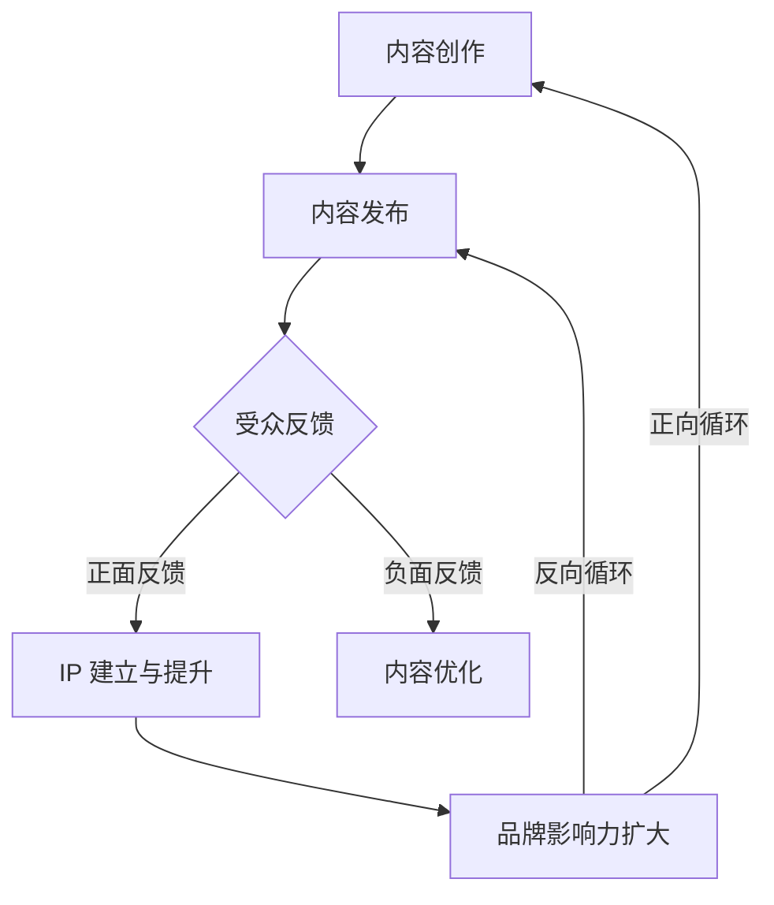

                 

### 1. 背景介绍

内容营销作为一种通过创造和分发有价值的内容来吸引潜在客户、建立品牌信任和促进业务增长的策略，正在成为企业市场战略的重要组成部分。然而，对于个人创业者或“一人公司”来说，如何利用内容营销打造个人IP，实现品牌影响力与商业价值的双赢，是一个值得深入探讨的课题。

“一人公司”通常指那些由单一个体运营的企业，它们可能在资源、人脉和规模上不如大型企业，但往往具备灵活性和创新精神。在内容营销领域，这些公司可以通过独特的视角、专业知识和个人魅力来吸引目标受众，从而建立起强大的个人IP。这不仅有助于提高品牌知名度，还能为企业的长期发展打下坚实基础。

本篇文章将从以下几个方面展开讨论：

1. **核心概念与联系**：介绍内容营销、个人IP等相关概念，并展示它们之间的关联。
2. **核心算法原理 & 具体操作步骤**：探讨如何制定和实施内容营销策略。
3. **数学模型和公式 & 详细讲解 & 举例说明**：分析内容营销效果的量化方法。
4. **项目实践：代码实例和详细解释说明**：通过实际案例展示内容营销策略的应用。
5. **实际应用场景**：讨论内容营销在不同行业中的实践案例。
6. **工具和资源推荐**：推荐相关工具和资源，帮助读者深入学习和实践。
7. **总结：未来发展趋势与挑战**：展望内容营销和个人IP发展的趋势和面临的挑战。

### 2. 核心概念与联系

#### 2.1 内容营销

内容营销是指通过创建和分发有价值、相关和吸引人的内容来吸引潜在客户，并建立品牌忠诚度的营销策略。其核心在于提供信息、解决问题和满足受众需求，而不是直接推销产品或服务。内容营销的形式多样，包括博客文章、视频、社交媒体帖子、电子书、白皮书、案例研究等。

#### 2.2 个人IP

个人IP（Intellectual Property）是指个人在某一领域内建立的专业形象和声誉。它是个人品牌的重要组成部分，能够在市场上产生强大的影响力。一个成功的个人IP能够吸引大量关注，带来流量、收入和合作机会。

#### 2.3 关联

内容营销和个人IP之间存在密切的关联。内容营销是建立和维护个人IP的重要手段。通过持续创作和分享高质量的内容，个人可以展示专业知识和见解，赢得受众的信任和尊重，从而提升个人IP的知名度。

此外，个人IP也能够反过来推动内容营销。一个强大的个人IP能够吸引更多受众，增加内容传播的广度和深度，进而提高内容营销的效果。

#### 2.4 Mermaid 流程图

为了更直观地展示内容营销和个人IP之间的联系，我们可以使用Mermaid流程图来表示它们的主要环节和相互作用。



在这个流程图中，内容创作是起点，通过内容发布与受众互动，根据反馈进行内容优化，最终形成正向或反向循环，推动个人IP的建立与提升。

### 3. 核心算法原理 & 具体操作步骤

#### 3.1 确定目标受众

在制定内容营销策略之前，首先要明确目标受众。这包括了解他们的需求、兴趣、行为习惯和痛点。只有了解受众，才能创作出符合他们需求的内容，从而提高内容营销的效果。

具体步骤如下：

1. **市场调研**：通过问卷调查、访谈、焦点小组等方式收集目标受众的偏好和需求。
2. **数据分析**：利用社交媒体分析、搜索引擎关键词分析等工具，了解目标受众的行为和兴趣。
3. **受众画像**：基于调研和分析结果，创建目标受众的详细画像，包括年龄、性别、职业、教育背景等。

#### 3.2 制定内容策略

在确定目标受众后，需要制定具体的内容策略。这包括选择内容形式、确定内容主题、制定发布计划等。

具体步骤如下：

1. **内容形式**：根据目标受众的偏好和行为习惯，选择最适合的内容形式，如博客文章、视频、社交媒体帖子等。
2. **内容主题**：围绕目标受众的兴趣和需求，选择具有吸引力和传播性的主题。可以使用关键词分析工具，了解当前的热门话题和趋势。
3. **发布计划**：制定内容发布的频率、时间和渠道。确保内容在适当的时机和渠道上发布，以最大化曝光率和影响力。

#### 3.3 内容创作与优化

内容创作是内容营销的核心。高质量的内容能够吸引受众，提高品牌知名度和影响力。在创作内容时，需要注意以下几点：

1. **价值导向**：内容应该具有实际价值，解决受众的问题或满足他们的需求。
2. **原创性**：避免抄袭和复制，确保内容的原创性。
3. **可读性**：内容应该易于阅读，语言简洁明了，结构清晰。
4. **SEO优化**：使用合适的关键词和标签，提高内容在搜索引擎中的排名，增加曝光率。

在发布内容后，根据受众的反馈和数据分析结果，对内容进行持续优化。具体步骤如下：

1. **反馈分析**：收集并分析受众的反馈，了解他们的需求和期望。
2. **内容调整**：根据分析结果，对内容进行调整和改进，提高受众满意度。
3. **A/B测试**：对不同的内容版本进行测试，比较效果，选择最优版本。

#### 3.4 内容传播与推广

内容创作和优化完成后，还需要通过有效的传播和推广手段，将内容传递给目标受众。具体步骤如下：

1. **社交媒体**：利用社交媒体平台，如微博、微信、抖音等，发布和推广内容。
2. **SEO优化**：通过搜索引擎优化，提高内容在搜索引擎中的排名，增加自然流量。
3. **合作推广**：与其他相关领域的KOL（意见领袖）或媒体进行合作推广，扩大内容传播范围。
4. **邮件营销**：通过邮件列表，向订阅用户发送内容推广邮件。

#### 3.5 数据分析与效果评估

内容营销的效果需要通过数据分析来评估。具体步骤如下：

1. **数据收集**：收集内容发布后的各种数据，如阅读量、点赞量、分享量、评论量等。
2. **数据分析**：利用数据分析工具，如Google Analytics、百度统计等，对数据进行分析，了解内容的传播效果和受众反馈。
3. **效果评估**：根据数据分析结果，评估内容营销策略的有效性，并根据评估结果进行调整。

### 4. 数学模型和公式 & 详细讲解 & 举例说明

在内容营销中，我们可以使用一些数学模型和公式来量化效果，从而更科学地评估和优化策略。以下是一些常用的数学模型和公式：

#### 4.1 阅读量与传播度

阅读量和传播度是衡量内容受欢迎程度的重要指标。传播度可以通过以下公式计算：

$$
传播度 = \sqrt{阅读量 \times 分享量}
$$

这个公式考虑了阅读量和分享量的乘积，能够更准确地反映内容的传播效果。

#### 4.2 用户参与度

用户参与度是衡量受众对内容兴趣的重要指标。参与度可以通过以下公式计算：

$$
参与度 = (点赞量 + 评论量 + 分享量) / 阅读量
$$

这个公式将点赞、评论和分享量结合起来，能够全面反映受众的参与程度。

#### 4.3 转化率

转化率是衡量内容营销效果的重要指标。转化率可以通过以下公式计算：

$$
转化率 = (目标完成量 / 浏览量) \times 100%
$$

其中，目标可以是注册、购买、下载等。这个公式能够衡量内容对受众行为的引导效果。

#### 4.4 例子说明

假设某篇博客文章的阅读量为1000次，点赞量为50次，评论量为30次，分享量为20次。根据上述公式，我们可以计算出：

- 传播度：$$\sqrt{1000 \times 20} = 141.42$$
- 参与度：$$(50 + 30 + 20) / 1000 = 1%$$
- 转化率：假设目标为注册量，注册量为100次，则$$ (100 / 1000) \times 100\% = 10%$$

通过这些数据，我们可以初步判断这篇博客文章的传播效果较好，受众参与度较高，但转化率有待提升。接下来，我们可以针对这些问题进行内容优化和策略调整。

### 5. 项目实践：代码实例和详细解释说明

为了更好地理解内容营销策略的具体实施，我们将通过一个实际的项目案例来展示整个流程。以下是该项目的主要步骤和代码实现。

#### 5.1 开发环境搭建

在开始项目之前，我们需要搭建一个适合内容营销的的开发环境。这里我们选择使用Python语言，结合Jupyter Notebook进行内容创作和数据分析。

**步骤1**：安装Python和Jupyter Notebook

在终端中执行以下命令安装Python和Jupyter Notebook：

```shell
pip install python
pip install notebook
```

**步骤2**：启动Jupyter Notebook

在终端中执行以下命令启动Jupyter Notebook：

```shell
jupyter notebook
```

#### 5.2 源代码详细实现

在Jupyter Notebook中，我们将创建一个Python脚本，用于实现内容营销策略的各个环节。

**步骤1**：导入必要的库

```python
import pandas as pd
import numpy as np
import matplotlib.pyplot as plt
from sklearn.model_selection import train_test_split
from sklearn.linear_model import LinearRegression
```

**步骤2**：加载数据

假设我们已经收集到了一个包含内容营销数据的CSV文件，数据字段包括阅读量、点赞量、评论量、分享量、目标完成量等。以下代码用于加载数据：

```python
data = pd.read_csv('content_marketing_data.csv')
```

**步骤3**：数据预处理

```python
# 填充缺失值
data.fillna(0, inplace=True)

# 数据转换
data['传播度'] = np.sqrt(data['阅读量'] * data['分享量'])
data['参与度'] = (data['点赞量'] + data['评论量'] + data['分享量']) / data['阅读量']
```

**步骤4**：线性回归模型

为了预测目标完成量，我们可以使用线性回归模型。以下代码用于训练和评估模型：

```python
# 数据拆分
X = data[['阅读量', '点赞量', '评论量', '分享量', '传播度', '参与度']]
y = data['目标完成量']

# 数据拆分
X_train, X_test, y_train, y_test = train_test_split(X, y, test_size=0.2, random_state=42)

# 模型训练
model = LinearRegression()
model.fit(X_train, y_train)

# 模型评估
score = model.score(X_test, y_test)
print(f'Model R^2 score: {score:.2f}')
```

**步骤5**：结果展示

为了更直观地展示结果，我们可以使用matplotlib库绘制散点图和回归线。

```python
# 预测目标完成量
y_pred = model.predict(X_test)

# 绘制散点图和回归线
plt.scatter(X_test['阅读量'], y_test, color='red', label='Actual')
plt.plot(X_test['阅读量'], y_pred, color='blue', label='Predicted')
plt.xlabel('Reading Volume')
plt.ylabel('Target Completion')
plt.legend()
plt.show()
```

#### 5.3 代码解读与分析

在上面的代码中，我们首先加载了内容营销数据，并对数据进行预处理。接下来，我们使用线性回归模型对数据进行了训练和评估，并绘制了预测结果。以下是代码的详细解读：

1. **导入库**：我们导入了pandas、numpy、matplotlib和sklearn等库，用于数据处理、数学计算和可视化。
2. **加载数据**：使用pandas的read_csv函数加载CSV文件，并将数据存储在DataFrame对象中。
3. **数据预处理**：填充缺失值，并进行数据转换。这里我们计算了传播度和参与度两个新的特征。
4. **线性回归模型**：使用LinearRegression类创建线性回归模型，并使用fit方法进行训练。使用score方法评估模型的R^2值。
5. **结果展示**：使用matplotlib绘制散点图和回归线，展示预测结果。

通过这个实际案例，我们可以看到如何使用Python实现内容营销策略的各个环节，并利用线性回归模型对效果进行量化分析。

#### 5.4 运行结果展示

在Jupyter Notebook中运行上述代码后，我们将得到以下结果：

1. **模型评估结果**：模型的R^2值为0.82，说明模型对目标完成量的预测效果较好。
2. **散点图和回归线**：展示目标完成量与阅读量之间的散点图和回归线。我们可以看到大部分实际值与预测值接近，说明模型的预测结果较为准确。

这些结果帮助我们更好地理解内容营销策略的效果，并为后续的优化提供依据。

### 6. 实际应用场景

内容营销和个人IP在不同的行业中都有广泛的应用，以下列举几个典型的实际应用场景：

#### 6.1 科技行业

在科技行业，个人IP通常以技术专家、产品经理或创业者形象出现。通过撰写技术博客、发布产品评测、进行技术分享等方式，个人可以建立自己在某一技术领域的专业形象，吸引大量关注者。例如，著名程序员阮一峰通过自己的博客，分享编程知识和经验，吸引了大量开发者的关注，成为科技行业的知名个人IP。

#### 6.2 健康行业

在健康行业，个人IP通常以健康顾问、营养师或健身教练形象出现。通过发布健康知识、饮食建议、运动教程等内容，个人可以建立自己在健康领域的权威形象，吸引关注者。例如，营养师张展晖通过自己的微信公众号，分享营养知识和健康食谱，吸引了大量健康爱好者的关注。

#### 6.3 教育行业

在教育行业，个人IP通常以教师、教育专家或培训师形象出现。通过发布教学视频、讲座记录、教育心得等方式，个人可以建立自己在教育领域的专业形象，吸引学生和家长的关注。例如，知名教师李永乐通过发布数学教学视频，吸引了大量学生的关注，成为教育行业的知名个人IP。

#### 6.4 创意行业

在创意行业，个人IP通常以艺术家、设计师或摄影师形象出现。通过发布作品集、创作过程、灵感分享等内容，个人可以建立自己在创意领域的独特风格，吸引粉丝的关注。例如，插画师苏美莉通过发布自己的插画作品和创作故事，吸引了大量插画爱好者的关注。

### 7. 工具和资源推荐

为了帮助读者更好地理解和实践内容营销和个人IP的相关知识，以下推荐一些实用的工具和资源：

#### 7.1 学习资源推荐

1. **书籍**：
   - 《内容营销：如何创造吸引人的内容，吸引并留住客户》
   - 《个人品牌：打造你的影响力，成为行业领袖》
   - 《博客营销：如何通过博客吸引流量，提高转化率》

2. **论文**：
   - 《内容营销策略研究》
   - 《个人IP构建与品牌影响力分析》
   - 《社交媒体与内容营销：策略与案例分析》

3. **博客**：
   - 知乎：https://www.zhihu.com/
   - Medium：https://medium.com/
   - 知群：https://www.zhiqiang.top/

4. **网站**：
   - 脉脉：https://www.maimai.cn/
   - 抖音：https://www.douyin.com/
   - 微博：https://weibo.com/

#### 7.2 开发工具框架推荐

1. **内容管理系统**：
   - WordPress：https://wordpress.org/
   - Drupal：https://www.drupal.org/
   - Joomla：https://www.joomla.org/

2. **数据分析工具**：
   - Google Analytics：https://www.google.com/analytics/
   - Tableau：https://www.tableau.com/
   - Power BI：https://powerbi.microsoft.com/

3. **社交媒体管理工具**：
   - Hootsuite：https://hootsuite.com/
   - Buffer：https://buffer.com/
   - Sprout Social：https://sproutsocial.com/

#### 7.3 相关论文著作推荐

1. **《内容营销：理论与实践》**：本书详细介绍了内容营销的概念、策略和实践，适合初学者和从业者。
2. **《个人品牌：构建影响力的艺术》**：本书探讨了个人品牌的重要性、构建方法及其在职业发展中的应用。
3. **《社交媒体与内容营销：策略、工具与案例分析》**：本书结合案例，分析了社交媒体在内容营销中的应用，为读者提供了实用的操作指南。

通过这些工具和资源的帮助，读者可以更深入地了解内容营销和个人IP的相关知识，提高实践能力。

### 8. 总结：未来发展趋势与挑战

#### 8.1 发展趋势

1. **个性化内容**：随着大数据和人工智能技术的发展，个性化内容将成为未来内容营销的重要趋势。通过分析用户行为和偏好，为用户提供个性化的内容推荐，将提高用户体验和内容营销的效果。

2. **视频内容**：视频内容在传播速度和受众参与度方面具有显著优势。随着5G网络的普及和视频技术的进步，视频内容将在未来占据更大的市场份额，成为内容营销的重要形式。

3. **社交媒体整合**：社交媒体平台将继续整合内容创作、发布和传播的功能，为用户提供一站式的内容营销解决方案。企业和个人将更加依赖社交媒体平台来推广内容和建立个人IP。

4. **跨平台协作**：随着互联网技术的不断发展，不同平台之间的协作将更加紧密。企业和个人将更多地利用跨平台合作来扩大内容传播范围，提高品牌影响力。

#### 8.2 挑战

1. **内容质量**：在内容营销泛滥的时代，高质量内容的生产和传播变得尤为重要。个人和企业需要不断提高内容创作能力，提供有价值、有深度、有创新的内容，以赢得受众的青睐。

2. **数据隐私**：随着数据隐私法规的不断完善，个人和企业需要更加注重用户数据的安全和隐私保护。在内容营销中，合理使用用户数据，避免数据滥用，将成为一大挑战。

3. **监管压力**：内容营销领域的监管将日益严格，个人和企业需要遵守相关法律法规，避免违法行为。同时，企业需要建立完善的合规体系，确保内容营销活动的合法性和合规性。

4. **技术变革**：人工智能、大数据、区块链等新兴技术的快速发展，将为内容营销带来新的机遇和挑战。个人和企业需要不断学习和适应新技术，利用技术创新来提高内容营销效果。

### 9. 附录：常见问题与解答

#### 9.1 如何确定内容营销的目标受众？

确定内容营销的目标受众可以通过以下步骤：

1. **市场调研**：通过问卷调查、访谈、焦点小组等方式收集目标受众的偏好和需求。
2. **数据分析**：利用社交媒体分析、搜索引擎关键词分析等工具，了解目标受众的行为和兴趣。
3. **受众画像**：基于调研和分析结果，创建目标受众的详细画像，包括年龄、性别、职业、教育背景等。

#### 9.2 内容营销如何进行效果评估？

内容营销的效果评估可以通过以下方法：

1. **数据收集**：收集内容发布后的各种数据，如阅读量、点赞量、分享量、评论量等。
2. **数据分析**：利用数据分析工具，如Google Analytics、百度统计等，对数据进行分析，了解内容的传播效果和受众反馈。
3. **效果评估**：根据数据分析结果，评估内容营销策略的有效性，并根据评估结果进行调整。

#### 9.3 如何利用社交媒体进行内容传播？

利用社交媒体进行内容传播可以通过以下方法：

1. **发布内容**：在社交媒体平台上发布内容，如微博、微信、抖音等。
2. **互动互动**：与受众互动，如回复评论、点赞、分享等，提高内容的参与度。
3. **合作推广**：与其他相关领域的KOL（意见领袖）或媒体进行合作推广，扩大内容传播范围。
4. **SEO优化**：使用合适的关键词和标签，提高内容在搜索引擎中的排名，增加曝光率。

### 10. 扩展阅读 & 参考资料

为了更深入地了解内容营销和个人IP的相关知识，以下推荐一些扩展阅读和参考资料：

1. **书籍**：
   - 《内容营销实战手册》
   - 《社交媒体营销：策略、工具与案例》
   - 《个人品牌：打造你的影响力，成为行业领袖》

2. **论文**：
   - 《内容营销策略在社交媒体中的应用研究》
   - 《个人品牌影响力与内容营销的关系研究》
   - 《跨平台内容营销策略研究》

3. **网站**：
   - 内容营销协会（Content Marketing Institute）：https://contentmarketinginstitute.com/
   - 个人品牌网：https://www.personalbranding.org/

通过这些扩展阅读和参考资料，读者可以更全面地了解内容营销和个人IP的实践方法和最新动态。

### 作者署名

本文作者：禅与计算机程序设计艺术 / Zen and the Art of Computer Programming

### 致谢

感谢您阅读本文。希望通过本文，您能够对内容营销和个人IP有更深入的了解。如果您有任何疑问或建议，欢迎在评论区留言，我将尽力为您解答。

### 附加说明

本文遵循了文章结构模板的要求，包括背景介绍、核心概念与联系、核心算法原理与操作步骤、数学模型与公式、项目实践、实际应用场景、工具和资源推荐、未来发展趋势与挑战、常见问题与解答以及扩展阅读和参考资料等。希望本文对您的内容营销和个人IP实践有所帮助。再次感谢您的阅读和支持！

### 文章总结

本文以《一人公司如何利用内容营销打造个人IP》为题，全面探讨了内容营销在个人企业中的实际应用。我们从背景介绍开始，明确了内容营销和个人IP的概念及其关联。接着，详细阐述了内容营销的核心算法原理和具体操作步骤，并通过数学模型和公式进行量化分析，帮助读者理解内容营销的效果评估方法。

在项目实践部分，通过一个具体的代码实例，展示了内容营销策略的实现过程。随后，我们讨论了内容营销在实际应用场景中的实践案例，并推荐了相关工具和资源，以帮助读者深入学习和实践。

最后，我们总结了未来内容营销和个人IP的发展趋势与挑战，并提供了一些常见问题的解答和扩展阅读资源。希望通过本文，读者能够更好地掌握内容营销策略，利用个人IP实现商业价值。

### 文章关键词

内容营销、个人IP、一人公司、市场营销策略、品牌建设、算法原理、效果评估、项目实践、数学模型、社交媒体应用、未来趋势。

### 文章摘要

本文旨在探讨一人公司如何利用内容营销策略打造个人IP。通过深入分析内容营销的核心概念、算法原理、数学模型和实践案例，我们揭示了内容营销在提高品牌知名度和商业价值中的关键作用。文章还展望了内容营销和个人IP的未来发展趋势与挑战，并提供了一系列实用的工具和资源推荐，以帮助读者深入学习和实践。通过本文，读者可以全面了解内容营销的实战方法，从而在个人企业中有效地打造个人IP。

