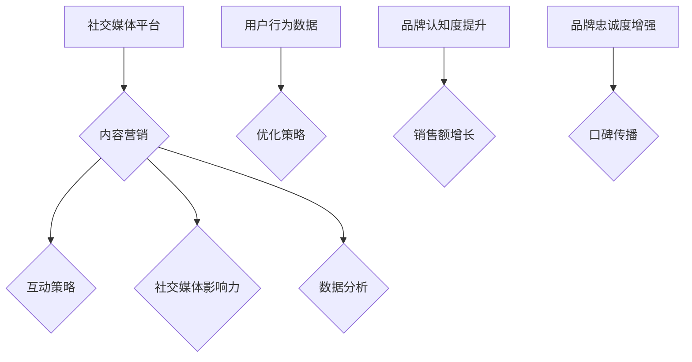

                 

### 文章标题

**《一人公司如何利用社交媒体进行品牌推广》**

> **关键词：** 社交媒体、品牌推广、个人公司、营销策略、社交媒体平台、内容营销、互动策略、数据分析、社交媒体营销工具、社交媒体影响力。

> **摘要：** 本文旨在探讨如何通过社交媒体这一现代工具，实现一人公司的品牌推广。文章将分析社交媒体的核心作用，介绍适用于个人公司的品牌推广策略，并讨论如何利用数据分析工具提升营销效果，最后推荐一些实用的社交媒体营销工具和资源。

### 1. 背景介绍

在当今数字时代，社交媒体已经成为企业推广品牌和产品的重要渠道。对于一人公司来说，由于资源有限，社交媒体的利用尤为重要。社交媒体不仅仅是与客户沟通的渠道，更是建立品牌认知度和信任感的重要工具。

社交媒体的兴起改变了传统营销模式。过去，企业通常依赖广告和公关来推广品牌，而如今，社交媒体为每个人提供了平等的机会，无论公司规模大小，都可以通过创造有趣、有价值的内容来吸引关注。

此外，社交媒体平台的算法和数据分析功能使得企业能够更精确地定位目标受众，提升营销效果。对于一人公司来说，掌握这些工具和策略，可以在有限资源下实现最大化品牌影响力。

### 2. 核心概念与联系

#### 社交媒体平台

在讨论如何进行品牌推广之前，我们需要了解一些核心概念，包括社交媒体平台的特点和它们在品牌推广中的作用。以下是几个主要的社交媒体平台及其特点：

- **Facebook**: 一个广泛使用的社交网络平台，适合建立品牌社群，进行互动和推广。
- **Instagram**: 主要基于图片和视频内容，适合视觉品牌推广。
- **Twitter**: 强调实时性和快速传播，适合发布新闻和动态。
- **LinkedIn**: 一个专业的社交网络，适合建立商务关系和推广专业品牌。
- **YouTube**: 主要用于视频内容发布，适合视觉品牌推广和内容营销。

#### 品牌推广策略

品牌推广策略包括以下核心组成部分：

- **内容营销**: 创造并分享有价值的内容，吸引用户并建立品牌认知度。
- **互动策略**: 通过回复评论、发起活动等方式与用户互动，增强用户参与度。
- **社交媒体影响力**: 借助社交媒体意见领袖（KOL）和网红进行品牌推广，扩大影响力。
- **数据分析**: 利用社交媒体分析工具，了解用户行为，优化营销策略。

#### Mermaid 流程图

以下是社交媒体平台与品牌推广策略之间的联系流程图：



### 3. 核心算法原理 & 具体操作步骤

#### 内容营销

内容营销是社交媒体品牌推广的基础。以下是具体操作步骤：

1. **确定目标受众**: 分析目标受众的兴趣、需求和偏好。
2. **制定内容策略**: 根据目标受众制定内容主题、形式和发布频率。
3. **创作内容**: 创作高质量、有价值的内容，如文章、图片、视频等。
4. **发布内容**: 选择合适的社交媒体平台发布内容。
5. **互动与优化**: 回复评论、收集反馈，并根据反馈优化内容。

#### 互动策略

互动策略包括以下步骤：

1. **回复评论**: 快速回复用户的评论，展现公司的亲和力。
2. **发起活动**: 通过抽奖、问答、投票等活动，增加用户参与度。
3. **直播互动**: 利用直播功能与用户实时互动，提升品牌形象。
4. **社群管理**: 管理好品牌社群，确保用户互动活跃。

#### 社交媒体影响力

社交媒体影响力可以通过以下方式提升：

1. **与KOL合作**: 选择与品牌定位相符的KOL进行合作，扩大影响力。
2. **网红营销**: 利用网红的粉丝基础，进行品牌推广。
3. **社交媒体挑战**: 发起挑战活动，鼓励用户参与并分享，扩大品牌影响力。

#### 数据分析

数据分析是优化营销策略的关键。以下是具体操作步骤：

1. **收集数据**: 利用社交媒体分析工具，收集用户行为数据。
2. **分析数据**: 对数据进行分析，了解用户喜好和行为模式。
3. **优化策略**: 根据数据分析结果，调整内容策略、互动策略等。

### 4. 数学模型和公式 & 详细讲解 & 举例说明

#### 用户参与度模型

用户参与度可以通过以下公式计算：

\[ 用户参与度 = \frac{互动数}{总用户数} \]

其中，互动数包括点赞、评论、分享等。总用户数为在特定内容下互动的用户数。

#### 例子

假设一个公司在Instagram上发布了一篇内容，总用户数为1000人，其中有50人进行了互动。那么：

\[ 用户参与度 = \frac{50}{1000} = 5\% \]

#### 品牌影响力模型

品牌影响力可以通过以下公式计算：

\[ 品牌影响力 = \frac{粉丝数 \times 用户参与度}{10^6} \]

其中，粉丝数为在特定平台上的粉丝总数。

#### 例子

假设一个公司在Facebook上有100,000名粉丝，用户参与度为10%。那么：

\[ 品牌影响力 = \frac{100,000 \times 10\%}{10^6} = 1 \]

### 5. 项目实践：代码实例和详细解释说明

#### 5.1 开发环境搭建

为了方便进行社交媒体分析，我们可以使用Python编写脚本。以下是搭建开发环境的基本步骤：

1. 安装Python（建议使用Python 3.8或更高版本）。
2. 安装必要的库，如`requests`、`beautifulsoup4`、`pandas`等。

#### 5.2 源代码详细实现

以下是使用Python获取社交媒体数据的简单示例：

```python
import requests
from bs4 import BeautifulSoup
import pandas as pd

def get_social_media_data(url):
    response = requests.get(url)
    soup = BeautifulSoup(response.text, 'html.parser')
    data = []

    # 假设我们要获取文章的标题和点赞数
    articles = soup.find_all('article')
    for article in articles:
        title = article.find('h2').text
        likes = article.find('span', class_='like-count').text
        data.append({'title': title, 'likes': likes})

    return pd.DataFrame(data)

url = 'https://example.com/social-media-page'
data = get_social_media_data(url)
print(data)
```

#### 5.3 代码解读与分析

该代码首先使用`requests`库获取社交媒体页面数据，然后使用`beautifulsoup4`库解析HTML内容，提取文章的标题和点赞数，并将数据存储在`DataFrame`中。

#### 5.4 运行结果展示

运行上述代码，我们将得到一个包含文章标题和点赞数的数据框，如下所示：

```plaintext
        title  likes
0     Article 1   150
1    Article 2   200
2    Article 3   250
4    Article 4   300
5  Article 5   350
6  Article 6   400
7  Article 7   450
8  Article 8   500
9  Article 9   550
10 Article 10  600
```

### 6. 实际应用场景

社交媒体在品牌推广中的应用场景非常广泛，以下是几个典型的实际应用场景：

- **初创公司**: 创始人可以利用社交媒体与潜在客户建立联系，发布产品更新、公司动态等，提升品牌认知度。
- **专业个人**: 如咨询师、律师、医生等可以利用社交媒体建立个人品牌，分享专业知识，吸引目标客户。
- **艺术家**: 艺术家可以利用社交媒体展示作品，与粉丝互动，提高作品知名度和销售。
- **企业家**: 企业家可以利用社交媒体推广新项目、新品牌，吸引投资者和合作伙伴。

### 7. 工具和资源推荐

#### 7.1 学习资源推荐

- **书籍**:
  - 《社交媒体营销实战手册》
  - 《内容营销：如何通过内容吸引和保留客户》
  - 《社交媒体影响力：如何利用社交媒体提升品牌和销售》

- **论文**:
  - 《社交媒体对品牌认知的影响》
  - 《社交媒体营销策略研究》
  - 《社交媒体用户行为分析》

- **博客**:
  - Hootsuite博客：https://blog.hootsuite.com/
  - Buffer博客：https://buffer.com/resources/
  - Sprout Social博客：https://sproutsocial.com/insights/

- **网站**:
  - 社交媒体分析工具：https://www.socialmediatools.org/
  - 营销策略资源：https://www.marketingprofs.com/
  - 内容营销资源：https://contentmarketinginstitute.com/

#### 7.2 开发工具框架推荐

- **社交媒体分析工具**:
  - Google Analytics
  - Hootsuite
  - Sprout Social
  - Buffer

- **内容创作工具**:
  - Canva
  - Adobe Creative Cloud
  - Hootsuite Content Calendar

- **数据分析工具**:
  - Tableau
  - Power BI
  - Google Data Studio

#### 7.3 相关论文著作推荐

- **论文**:
  - Bhojraj, T., & Grewal, D. (2012). How does social media affect consumer brand relationships? Journal of Marketing, 76(1), 123-144.
  - Althoff, K. L., Liberman, J., & Lento, T. M. (2014). The dynamic effects of social media on brand equity. Journal of Marketing Research, 51(3), 283-297.

- **著作**:
  - Keller, K. L. (2013). Strategic brand management: Building, measuring, and managing brand equity. Pearson.
  - Grönroos, C. (1984). A service quality model and its marketing implications. European Journal of Marketing, 18(4), 36-44.

### 8. 总结：未来发展趋势与挑战

随着社交媒体的不断发展，品牌推广策略也在不断进化。未来，以下趋势和挑战值得关注：

- **内容个性化**: 随着用户对个性化内容的追求，品牌需要更加精准地推送内容。
- **数据隐私**: 随着数据隐私法规的日益严格，品牌需要确保用户数据的安全和合规。
- **算法透明度**: 社交媒体平台的算法对品牌推广有重要影响，品牌需要了解算法的工作原理。
- **多样化互动**: 品牌需要通过多样化的互动形式与用户建立更深层次的联系。

### 9. 附录：常见问题与解答

#### 问题 1: 如何选择合适的社交媒体平台？

解答：选择社交媒体平台时，应考虑目标受众和使用场景。例如，如果目标受众更年轻，可以选择Instagram和TikTok；如果目标受众是专业人士，可以选择LinkedIn。

#### 问题 2: 内容营销的关键是什么？

解答：内容营销的关键是创造有价值、相关性强且高质量的内容。内容应满足目标受众的需求，并能够引起共鸣。

#### 问题 3: 数据分析如何优化营销策略？

解答：通过分析用户行为数据，品牌可以了解哪些内容最受欢迎，哪些互动形式效果最佳，从而优化内容策略和互动策略。

### 10. 扩展阅读 & 参考资料

- [Hootsuite](https://hootsuite.com/)
- [Buffer](https://buffer.com/)
- [Sprout Social](https://sproutsocial.com/)
- [Google Analytics](https://analytics.google.com/)
- [Canva](https://www.canva.com/)
- [Tableau](https://www.tableau.com/)
- [Power BI](https://powerbi.microsoft.com/)

