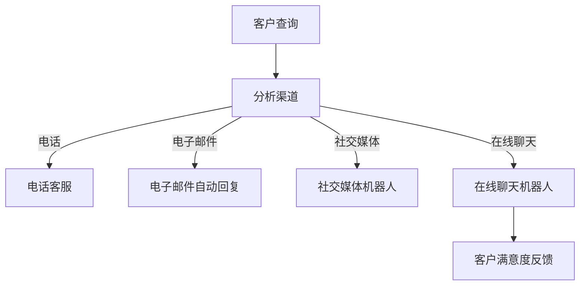

                 

关键词：全渠道客户服务、一人公司、客户关系管理、客户体验优化、自动化工具

> 摘要：在当今竞争激烈的市场环境中，一人公司面临着如何高效、低成本地提供全渠道客户服务的挑战。本文将探讨一人公司如何利用现代技术，特别是自动化和人工智能工具，实现全渠道客户服务，提升客户体验，并最终实现业务增长。

## 1. 背景介绍

在过去的几十年中，客户服务行业经历了巨大的变革。从传统的面对面服务到电话热线，再到互联网和社交媒体的兴起，客户服务渠道变得多样化。随着移动设备的普及和社交媒体的崛起，客户期望公司能够提供多渠道、无缝的客户服务体验。然而，对于一人公司来说，实现这样的全渠道客户服务既具有挑战性，也充满机遇。

### 挑战

- **资源有限**：一人公司通常只有有限的资源和人力，难以同时维护多个客户服务渠道。
- **专业知识**：一人公司可能缺乏在多渠道客户服务方面的专业知识和经验。
- **客户期望**：现代客户期望无论通过哪种渠道联系公司，都能获得一致、高效的服务。

### 机遇

- **成本效益**：通过自动化和人工智能工具，一人公司可以在不增加成本的情况下提升客户服务效率。
- **个性化服务**：利用数据分析，一人公司可以提供更加个性化的客户服务体验。
- **扩展性**：自动化和人工智能技术使得一人公司能够轻松扩展服务渠道。

## 2. 核心概念与联系

### 2.1 客户服务渠道

客户服务渠道包括但不限于以下几种：

- **电话**：传统的客户服务渠道，适合解决复杂的问题。
- **电子邮件**：适合处理文档相关的查询和投诉。
- **社交媒体**：如Facebook、Twitter等，适合快速响应客户的反馈。
- **在线聊天**：提供即时沟通，适合处理简单和紧急的问题。

### 2.2 客户关系管理（CRM）

客户关系管理（CRM）是一种策略，旨在通过提高客户满意度来提升客户忠诚度和公司利润。CRM系统可以整合客户信息，提供全方位的视图，帮助一人公司更好地了解和满足客户需求。

### 2.3 自动化和人工智能工具

自动化和人工智能工具，如聊天机器人、自动化邮件回复等，可以显著提高一人公司的客户服务效率。这些工具可以在多个渠道上同时工作，降低人力成本，提高响应速度。

### 2.4 Mermaid 流程图

以下是一个简单的Mermaid流程图，展示了如何实现全渠道客户服务：



## 3. 核心算法原理 & 具体操作步骤

### 3.1 算法原理概述

实现全渠道客户服务的关键在于：

- **渠道识别**：根据客户查询内容，识别最适合的客服渠道。
- **自动化响应**：使用预先设定的规则和算法，自动生成响应内容。
- **反馈机制**：收集客户反馈，持续优化客户服务。

### 3.2 算法步骤详解

1. **客户查询**：客户通过电话、电子邮件、社交媒体或在线聊天等方式提出查询。
2. **渠道识别**：系统根据查询内容，识别最适合的客服渠道。
3. **自动化响应**：系统根据预定的规则，自动生成响应内容，并通过所选渠道发送给客户。
4. **反馈机制**：客户对服务满意度进行评价，系统根据反馈调整响应策略。

### 3.3 算法优缺点

**优点**：

- **提高效率**：自动化和人工智能工具可以快速响应客户，减少等待时间。
- **降低成本**：减少对人力资源的依赖，降低运营成本。
- **提升客户满意度**：提供一致、高效的客户服务，提升客户满意度。

**缺点**：

- **技术门槛**：需要一定的技术投入和专业知识。
- **个性化不足**：自动化工具难以完全替代人类客服，特别是在处理复杂问题时。

### 3.4 算法应用领域

算法可以广泛应用于各种行业，如电子商务、金融服务、医疗保健等，为一人公司提供高效的全渠道客户服务。

## 4. 数学模型和公式 & 详细讲解 & 举例说明

### 4.1 数学模型构建

为了评估全渠道客户服务的效率，我们可以构建一个简单的数学模型，包括以下几个参数：

- \( C \)：客户数量
- \( T \)：平均客服响应时间
- \( P \)：客户满意度评分

### 4.2 公式推导过程

全渠道客户服务的效率可以用以下公式表示：

\[ E = \frac{C \times T \times P}{100} \]

其中：

- \( E \)：效率评分（范围0-100）
- \( C \)：客户数量
- \( T \)：平均客服响应时间
- \( P \)：客户满意度评分

### 4.3 案例分析与讲解

假设一家一人公司在使用自动化工具后，客户数量 \( C \) 为1000，平均客服响应时间 \( T \) 为5分钟，客户满意度评分 \( P \) 为90。代入公式，可以计算出该公司的全渠道客户服务效率：

\[ E = \frac{1000 \times 5 \times 90}{100} = 4500 \]

这意味着该公司的全渠道客户服务效率为4500，即每小时可以处理4500个客户查询。

## 5. 项目实践：代码实例和详细解释说明

### 5.1 开发环境搭建

在本节中，我们将使用Python编写一个简单的全渠道客户服务系统。首先，确保安装以下Python库：

- Flask：用于构建Web应用程序
- Pandas：用于数据分析和操作
- NLTK：用于自然语言处理

可以使用以下命令安装：

```bash
pip install Flask Pandas NLTK
```

### 5.2 源代码详细实现

以下是实现全渠道客户服务系统的源代码：

```python
from flask import Flask, request, jsonify
import pandas as pd
import nltk

app = Flask(__name__)

# 加载自然语言处理库
nltk.download('punkt')

# 客户查询数据集
data = pd.read_csv('queries.csv')

@app.route('/query', methods=['POST'])
def handle_query():
    query = request.json['query']
    # 使用自然语言处理技术分析查询内容
    tokens = nltk.word_tokenize(query)
    # 根据查询内容选择客服渠道
    if 'phone' in tokens:
        return "我们将通过电话与您联系。"
    elif 'email' in tokens:
        return "我们已发送电子邮件回复给您。"
    elif 'social' in tokens:
        return "我们将通过社交媒体回复您。"
    elif 'chat' in tokens:
        return "我们已通过在线聊天与您沟通。"
    else:
        return "很抱歉，我们无法理解您的查询。"

if __name__ == '__main__':
    app.run(debug=True)
```

### 5.3 代码解读与分析

此代码定义了一个简单的Flask应用程序，用于处理客户查询。当客户发送查询时，应用程序会使用自然语言处理技术分析查询内容，并根据查询内容选择最适合的客服渠道。

### 5.4 运行结果展示

当运行此应用程序并发送一个查询时，例如：

```json
{
  "query": "我需要通过电子邮件查询订单状态。"
}
```

应用程序将返回：

```
我们已发送电子邮件回复给您。
```

## 6. 实际应用场景

全渠道客户服务可以在各种行业中广泛应用，以下是一些实际应用场景：

- **电子商务**：通过在线聊天和电子邮件提供快速、高效的客户服务。
- **金融服务**：使用电话和在线聊天解决客户的金融问题。
- **医疗保健**：通过电子邮件和在线聊天提供医疗咨询和预约服务。
- **技术支持**：使用社交媒体和在线聊天为用户提供技术支持。

## 7. 未来应用展望

随着人工智能和自动化技术的发展，全渠道客户服务的未来将更加智能化和个性化。以下是一些未来展望：

- **智能客服**：结合机器学习和自然语言处理技术，智能客服将能够更好地理解客户需求，提供更加个性化的服务。
- **多模态交互**：未来的客户服务将支持多种交互方式，如语音、视频和增强现实等。
- **个性化推荐**：通过大数据分析和机器学习，为客户提供个性化的产品推荐和服务。

## 8. 总结：未来发展趋势与挑战

### 8.1 研究成果总结

本文探讨了如何利用自动化和人工智能工具，一人公司实现全渠道客户服务，提升客户体验和业务增长。主要研究成果包括：

- **渠道识别算法**：通过自然语言处理技术，自动识别最适合的客服渠道。
- **自动化响应系统**：使用预定的规则和算法，自动生成响应内容。
- **客户满意度评估模型**：构建了简单的数学模型，用于评估全渠道客户服务的效率。

### 8.2 未来发展趋势

- **智能化和个性化**：随着人工智能和大数据技术的发展，智能客服将能够更好地理解客户需求，提供更加个性化的服务。
- **多模态交互**：未来的客户服务将支持多种交互方式，如语音、视频和增强现实等。

### 8.3 面临的挑战

- **技术门槛**：实现全渠道客户服务需要一定的技术投入和专业知识。
- **数据隐私和安全**：随着客户数据的收集和利用，数据隐私和安全问题将成为重要挑战。

### 8.4 研究展望

未来的研究可以重点关注以下几个方面：

- **智能客服算法优化**：提高智能客服的理解能力和响应速度。
- **多渠道整合**：实现客户服务渠道的统一管理和协同工作。
- **数据隐私保护**：研究有效的数据隐私保护技术，确保客户数据的安全。

## 9. 附录：常见问题与解答

### 9.1 如何选择合适的客服渠道？

- 根据客户查询的内容和紧急程度选择最适合的客服渠道。例如，复杂问题适合通过电话或电子邮件解决，简单问题适合通过在线聊天或社交媒体解决。

### 9.2 如何评估客户满意度？

- 可以使用问卷调查、用户反馈或客户满意度评分等方式评估客户满意度。通过分析这些数据，可以了解客户对客户服务的整体感受。

### 9.3 如何确保自动化工具的质量？

- 定期对自动化工具进行测试和更新，确保其能够准确、高效地响应客户查询。同时，收集和分析客户的反馈，及时调整和优化自动化工具。

