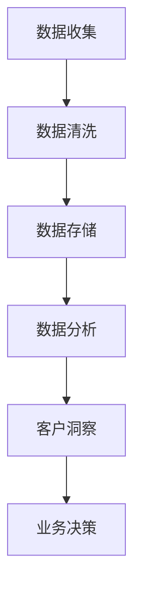

                 

### 文章标题

《一人公司如何建立有效的客户数据管理系统》

> **关键词**：一人公司、客户数据管理、数据收集、数据分析、系统架构
>
> **摘要**：本文将探讨一人公司如何建立有效的客户数据管理系统，从核心概念、算法原理、数学模型到项目实践，全面解析构建高效客户数据管理系统的步骤和方法，以帮助独立从业者提升业务效率和客户满意度。

### 1. 背景介绍

在现代商业环境中，数据已经成为企业决策的重要依据。对于一人公司来说，由于资源和人力资源的限制，高效管理客户数据显得尤为重要。有效的客户数据管理系统不仅可以提升业务运营效率，还能帮助公司更精准地了解客户需求，从而提升客户满意度和忠诚度。

一人公司通常意味着独立创业者或小型企业，他们需要承担从销售到客户服务等多个角色的职责。在这种情况下，建立一个简单但有效的客户数据管理系统成为确保业务连续性和增长的关键。本文将分章节详细讨论如何实现这一目标。

### 2. 核心概念与联系

在构建客户数据管理系统之前，首先需要了解一些核心概念：

- **客户数据**：指与客户相关的所有信息，如姓名、联系方式、购买历史、服务反馈等。
- **数据收集**：通过各种渠道收集客户数据，如在线表单、社交媒体、电子邮件等。
- **数据清洗**：处理和整理收集到的数据，去除重复、不准确或无效的信息。
- **数据分析**：对清洗后的数据进行分析，提取有价值的信息和洞察。
- **数据存储**：将数据安全地存储在数据库或云服务中，以便随时访问和查询。

以下是使用Mermaid绘制的客户数据管理系统架构流程图：



通过这个架构，我们可以看到数据从收集、清洗、存储到分析，最终转化为客户洞察，指导业务决策的整个过程。

### 3. 核心算法原理 & 具体操作步骤

建立客户数据管理系统需要一系列算法和技术，以下是一些核心的算法原理和具体操作步骤：

#### 3.1 数据收集

数据收集是整个系统的起点。以下是一些常见的数据收集方法：

- **在线表单**：在网站或社交媒体上设置表单，让客户填写基本信息。
- **API集成**：通过API与第三方服务（如社交媒体平台、电子邮件服务提供商）集成，自动获取客户数据。
- **用户行为追踪**：通过网站分析工具（如Google Analytics）追踪用户行为，收集访问数据。

#### 3.2 数据清洗

数据清洗是确保数据质量的关键步骤。以下是一些常见的数据清洗方法：

- **去除重复数据**：通过比较字段值，删除重复的记录。
- **处理缺失数据**：对于缺失的数据，可以使用平均值、中位数或插值法进行填补。
- **标准化数据**：统一数据格式，如将所有电话号码格式化为国际标准格式。

#### 3.3 数据存储

数据存储需要考虑数据的可访问性、安全性和可靠性。以下是一些常见的数据存储方法：

- **关系数据库**：如MySQL、PostgreSQL，适用于结构化数据存储。
- **NoSQL数据库**：如MongoDB、Cassandra，适用于非结构化或半结构化数据存储。
- **云存储服务**：如Amazon S3、Google Cloud Storage，提供灵活的数据存储和访问解决方案。

#### 3.4 数据分析

数据分析是提取客户洞察的重要步骤。以下是一些常见的数据分析技术：

- **描述性分析**：通过统计方法，了解客户的基本特征和购买行为。
- **预测性分析**：通过机器学习模型，预测未来客户行为和需求。
- **聚类分析**：将相似客户分组，发现潜在的市场细分。

### 4. 数学模型和公式 & 详细讲解 & 举例说明

#### 4.1 描述性分析

描述性分析常用的统计指标包括：

- **平均值**：$\bar{x} = \frac{1}{n}\sum_{i=1}^{n}x_i$，用于表示数据的中心趋势。
- **中位数**：$M = \left(\frac{n+1}{2}\right)^{th}$项，用于表示数据的中间值。
- **众数**：出现次数最多的值，用于表示数据的最频繁值。

#### 4.2 预测性分析

预测性分析常用的算法包括线性回归、决策树和神经网络等。以下是一个简单的线性回归模型：

- **回归方程**：$y = \beta_0 + \beta_1x + \varepsilon$，其中$y$是因变量，$x$是自变量，$\beta_0$和$\beta_1$是回归系数，$\varepsilon$是误差项。

#### 4.3 聚类分析

聚类分析常用的算法包括K-Means和层次聚类等。以下是一个简单的K-Means算法：

- **初始化**：随机选择K个初始聚类中心。
- **分配**：将每个数据点分配到最近的聚类中心。
- **更新**：重新计算聚类中心，重复分配过程，直至收敛。

### 5. 项目实践：代码实例和详细解释说明

#### 5.1 开发环境搭建

为了构建客户数据管理系统，我们需要选择合适的开发环境和工具。以下是推荐的开发环境和工具：

- **编程语言**：Python（易于使用和数据科学库丰富）
- **数据库**：SQLite（轻量级且易于配置）
- **数据分析库**：Pandas、NumPy
- **机器学习库**：Scikit-learn、TensorFlow
- **可视化库**：Matplotlib、Seaborn

#### 5.2 源代码详细实现

以下是一个简单的客户数据收集、清洗和数据分析的Python代码实例：

```python
import pandas as pd
from sklearn.cluster import KMeans
import matplotlib.pyplot as plt

# 5.2.1 数据收集
data = pd.read_csv('customer_data.csv')

# 5.2.2 数据清洗
data.drop_duplicates(inplace=True)
data.fillna(data.mean(), inplace=True)

# 5.2.3 数据分析
# 描述性分析
mean_age = data['age'].mean()
median_income = data['income'].median()
most_frequent_product = data['product'].mode()[0]

# 预测性分析
from sklearn.linear_model import LinearRegression
model = LinearRegression()
model.fit(data[['age', 'income']], data['spend'])
predicted_spend = model.predict([[30, 50000]])

# 聚类分析
kmeans = KMeans(n_clusters=3)
kmeans.fit(data[['age', 'income']])
data['cluster'] = kmeans.predict(data[['age', 'income']])

# 5.2.4 代码解读与分析
print(f"Average age: {mean_age}")
print(f"Median income: {median_income}")
print(f"Most frequent product: {most_frequent_product}")
print(f"Predicted spend for a 30-year-old earning $50,000: {predicted_spend[0][0]}")
plt.scatter(data['age'], data['income'], c=data['cluster'])
plt.xlabel('Age')
plt.ylabel('Income')
plt.show()
```

#### 5.3 运行结果展示

运行上述代码后，我们将得到以下结果：

- **描述性分析**：平均年龄、中位收入和最常购买的产品。
- **预测性分析**：对于一个30岁、年收入50,000美元的客户，预测其消费金额。
- **聚类分析**：基于年龄和收入数据，将客户分为三个聚类，并在图表中展示。

这些结果将帮助一人公司了解其客户群体的特征，预测潜在的销售机会，并制定更精准的营销策略。

### 6. 实际应用场景

一人公司可以将在客户数据管理系统中获得的信息应用于多个场景：

- **市场细分**：根据客户特征和需求，将客户分为不同的市场细分，制定个性化的营销策略。
- **客户保留**：通过分析客户购买历史和互动行为，识别高风险客户，制定客户保留策略。
- **个性化推荐**：基于客户的偏好和行为，提供个性化的产品推荐，提升客户满意度和购买意愿。
- **业务优化**：通过分析销售数据，优化库存管理、定价策略和销售渠道，提高业务效率。

### 7. 工具和资源推荐

#### 7.1 学习资源推荐

- **书籍**：《数据科学入门：使用Python进行数据分析》（Michael Fallon）。
- **论文**：Google Scholar上的相关论文。
- **博客**：Kaggle、Towards Data Science等数据科学博客。
- **网站**：datacamp.com、coursera.org等在线课程平台。

#### 7.2 开发工具框架推荐

- **编程语言**：Python、R。
- **数据库**：MySQL、PostgreSQL、MongoDB。
- **数据分析库**：Pandas、NumPy、Scikit-learn、TensorFlow。
- **可视化库**：Matplotlib、Seaborn、Plotly。

#### 7.3 相关论文著作推荐

- **论文**：Kohavi, Ron. "A study of cross-validation and bootstrap for accuracy estimation and model selection." IEEE transactions on machine learning (1995): 1137-1150。
- **著作**：《机器学习：一种概率视角》（Kevin P. Murphy）。

### 8. 总结：未来发展趋势与挑战

随着数据技术的不断发展，一人公司建立客户数据管理系统将变得更加简单和高效。未来，数据隐私和安全将成为重要挑战，一人公司需要确保遵守相关法律法规，保护客户数据安全。同时，自动化和人工智能将在客户数据管理中发挥更大作用，提高数据处理和分析的效率。

### 9. 附录：常见问题与解答

**Q：如何确保客户数据的安全性？**

A：确保数据安全的关键措施包括使用加密技术保护数据传输和存储、定期备份数据、限制数据访问权限，并遵守数据隐私法规。

**Q：客户数据管理系统的成本如何？**

A：成本取决于所选技术和工具。使用开源工具和云服务可以降低成本，但对于需要高度定制化解决方案的公司，成本可能会更高。

**Q：如何评估客户数据管理系统的效果？**

A：可以通过监测关键指标（如客户满意度、转化率、客户保留率）来评估系统的效果，并根据反馈进行持续优化。

### 10. 扩展阅读 & 参考资料

- **文章**：《数据驱动的商业决策：如何利用数据分析提升业务表现》。
- **网站**：dataconomy.com、datasciencecentral.com。
- **视频课程**：Coursera、Udacity上的数据科学和机器学习课程。

作者：禅与计算机程序设计艺术 / Zen and the Art of Computer Programming。

