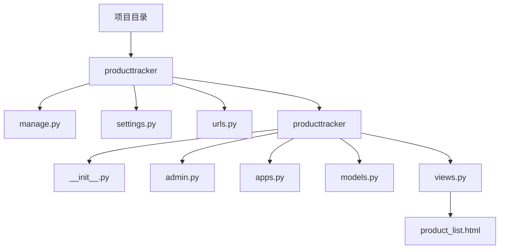

                 

### 背景介绍 Background Introduction

在当今快速发展的商业环境中，一人公司（Solopreneurship）正逐渐成为一种流行的企业模式。一人公司通常由单个创始人运营，他们肩负着从战略规划、市场拓展、产品开发到客户服务的全部责任。这种模式的优势在于其灵活性和敏捷性，使得创始人能够迅速响应市场变化，降低成本，专注于核心业务。然而，与此同时，一人公司在资源有限、人力不足的情况下，如何高效地完成产品上市流程，成为了一个亟待解决的问题。

产品上市流程（Product Launch Process）是指将一款产品从概念阶段到市场投放的整个过程。它通常包括市场调研、产品开发、营销策略制定、市场推广、渠道选择、销售执行等多个环节。对于一人公司而言，由于缺乏团队支持，每个环节的效率都显得尤为重要。本文将深入探讨一人公司如何通过优化产品上市流程，提高市场竞争力，实现快速成长。

本文将分为以下几个部分：

1. **核心概念与联系**：介绍产品上市流程中的核心概念，并通过Mermaid流程图展示其内在联系。
2. **核心算法原理与具体操作步骤**：详细解释一人公司如何运用敏捷开发方法、精益创业理念以及项目管理工具，高效完成产品上市。
3. **数学模型和公式**：介绍产品上市流程中的关键指标及其计算方法，并通过实例进行说明。
4. **项目实践**：提供具体代码实例和实现细节，以及详细的代码解读与分析。
5. **实际应用场景**：探讨一人公司在不同行业和市场的产品上市策略。
6. **工具和资源推荐**：推荐相关书籍、工具和资源，帮助读者深入了解产品上市流程。
7. **总结：未来发展趋势与挑战**：总结本文的主要观点，并对未来产品上市流程的发展趋势和挑战进行展望。
8. **附录：常见问题与解答**：针对读者可能遇到的问题，提供解答和建议。
9. **扩展阅读与参考资料**：推荐进一步阅读的相关文献和资源。

通过本文的逐步分析，我们希望一人公司创始人能够更好地理解产品上市流程，掌握高效的产品开发与上市策略，从而在激烈的市场竞争中脱颖而出。

### 核心概念与联系 Core Concepts and Their Connections

在探讨一人公司如何打造高效的产品上市流程之前，我们需要明确几个核心概念，并了解它们之间的内在联系。以下是本文将涉及的主要核心概念：

1. **市场调研（Market Research）**：市场调研是指通过系统的方法收集、分析和解释有关市场信息的过程。其目的是帮助公司了解市场需求、竞争对手、目标客户等关键因素，从而为产品开发提供依据。

2. **敏捷开发（Agile Development）**：敏捷开发是一种以人为核心、迭代和循序渐进的方法，旨在通过灵活应对需求变化，快速构建和交付高质量软件。其核心理念包括团队协作、客户反馈、持续交付和适应性计划。

3. **精益创业（Lean Startup）**：精益创业是一种将产品开发与市场验证相结合的创业方法。其目标是快速构建最小可行产品（Minimum Viable Product，MVP），通过迭代开发和用户反馈，逐步完善产品，降低市场风险。

4. **项目管理工具（Project Management Tools）**：项目管理工具是用于规划、跟踪和报告项目进展的工具，如Jira、Trello等。这些工具可以帮助一人公司有效管理任务、资源、进度和风险，确保产品上市流程顺利进行。

5. **市场推广（Marketing and Promotion）**：市场推广是指通过广告、促销、公关、社交媒体等多种渠道，提高产品知名度，吸引潜在客户，促进销售。成功的市场推广策略对于产品的市场接受度和销售业绩至关重要。

6. **渠道选择（Channel Selection）**：渠道选择是指确定产品销售途径的过程，包括直接销售（如公司官网、线下门店）和间接销售（如分销商、零售商）。合理的渠道选择能够最大化产品覆盖范围，提高销售效率。

7. **销售执行（Sales Execution）**：销售执行是指将销售策略转化为实际销售行为的过程，包括客户管理、销售谈判、合同签订等。高效的销售执行能够确保产品成功进入市场，实现销售目标。

以下是一个使用Mermaid绘制的流程图，展示了上述核心概念之间的联系：

```mermaid
graph TD
    A[市场调研] --> B[需求分析]
    B --> C{是否满足需求}
    C -->|是| D[产品开发]
    C -->|否| E[调整市场调研]
    D --> F[敏捷开发]
    F --> G[最小可行产品(MVP)]
    G --> H[用户反馈]
    H --> I[产品迭代]
    I --> J[上市准备]
    J --> K[市场推广]
    K --> L[渠道选择]
    L --> M[销售执行]
    M --> N[销售业绩评估]
    N --> O{是否调整策略}
    O -->|是| K
    O -->|否| N
```

通过这个流程图，我们可以看到，市场调研是产品上市流程的起点，它决定了后续所有环节的决策方向。市场调研结果将直接影响产品开发的需求分析，而敏捷开发方法和精益创业理念则确保了产品开发的快速迭代和市场验证。市场推广、渠道选择和销售执行是产品上市成功的关键环节，通过有效的市场推广和渠道选择，产品能够迅速覆盖目标市场，而高效的销售执行则能够确保产品成功销售。

这个流程图不仅展示了产品上市流程中的核心概念和步骤，也体现了各个环节之间的相互作用和反馈机制。对于一人公司来说，掌握这些核心概念和流程，能够帮助他们更好地规划和管理产品上市过程，提高市场竞争力。

### 核心算法原理与具体操作步骤 Core Algorithm Principles and Operational Steps

在构建高效的产品上市流程中，核心算法原理和具体操作步骤是关键。这些步骤不仅需要一人公司创始人具备扎实的技术背景，还需要他们能够灵活运用敏捷开发、精益创业理念以及项目管理工具。以下是详细的操作步骤：

#### 1. 敏捷开发方法（Agile Development）

敏捷开发方法强调团队协作、快速迭代和持续交付。对于一人公司，以下步骤有助于实现敏捷开发：

**步骤 1.1：组建敏捷团队**

- **角色划分**：一人公司虽然资源有限，但可以通过虚拟团队和外包服务来实现多人协作。例如，可以聘请兼职的UI设计师、开发工程师和市场专家。
- **团队协作工具**：使用Trello、Jira等项目管理工具来分配任务、跟踪进度和协作沟通。

**步骤 1.2：制定迭代计划**

- **迭代周期**：设定短周期的迭代计划，如每周或每两周一次。每次迭代的目标是交付一个具有实际功能的软件版本。
- **迭代会议**：定期召开站会、评审会和回顾会，确保团队在正确的方向上持续前进。

**步骤 1.3：持续交付（Continuous Delivery）**

- **自动化测试**：使用自动化测试工具（如Selenium、JUnit）进行持续集成和测试，确保代码质量。
- **部署流水线**：构建自动化部署流水线，通过CI/CD（持续集成/持续部署）工具（如Jenkins、GitLab CI）实现快速交付。

#### 2. 精益创业理念（Lean Startup）

精益创业理念强调快速构建最小可行产品（MVP），并通过用户反馈进行迭代。以下是具体步骤：

**步骤 2.1：确定MVP**

- **功能聚焦**：确定产品MVP的核心功能，确保这些功能能够解决用户的主要问题。
- **用户调研**：通过与潜在用户交流，了解他们的需求、痛点和期望。

**步骤 2.2：构建MVP**

- **快速原型**：使用低代码平台（如AppSheet、OutSystems）或开源框架（如React、Vue.js）快速构建原型。
- **最小可行性**：确保MVP具有足够的可行性，能够在实际环境中运行。

**步骤 2.3：用户测试**

- **用户反馈**：将MVP交付给一组用户，收集他们的反馈。
- **数据分析**：分析用户行为数据，了解产品使用情况和用户满意度。

#### 3. 项目管理工具（Project Management Tools）

项目管理工具可以帮助一人公司更好地管理项目进度、资源分配和风险管理。以下是几个常用的工具：

**步骤 3.1：任务管理**

- **任务分配**：在Trello或Jira中创建任务卡，分配给团队成员。
- **任务跟踪**：实时监控任务进度，确保每个任务按时完成。

**步骤 3.2：资源管理**

- **资源调配**：根据项目需求，合理调配人力、时间和预算。
- **资源优化**：通过分析资源使用情况，优化资源分配，提高项目效率。

**步骤 3.3：风险管理**

- **风险识别**：识别项目潜在的风险，如技术难题、市场变化等。
- **风险应对**：制定应对策略，如备份计划、替代方案等。

通过以上步骤，一人公司可以有效地实施敏捷开发、精益创业理念，并利用项目管理工具提高产品上市流程的效率。这些方法不仅帮助公司快速响应市场变化，还确保了产品的高质量交付。

#### 4. 敏捷开发、精益创业与项目管理工具之间的联系

敏捷开发、精益创业和项目管理工具之间存在紧密的联系，它们共同构成了高效的产品上市流程。

- **敏捷开发** 强调快速迭代和持续交付，确保产品能够迅速适应市场需求，提高市场竞争力。
- **精益创业** 注重通过MVP验证市场需求，降低市场风险，确保产品方向正确。
- **项目管理工具** 提供了任务管理、资源调配和风险管理等功能，确保项目按计划顺利进行。

这种组合方法不仅提高了产品开发的效率，还确保了产品上市流程的有序进行。一人公司可以通过灵活运用这些工具和方法，实现从市场需求到产品交付的完整流程，提高市场竞争力。

总之，敏捷开发、精益创业理念和项目管理工具的结合，为一人公司提供了实现高效产品上市流程的有效途径。通过这些方法和工具，一人公司可以在资源有限的情况下，快速构建和交付高质量产品，从而在激烈的市场竞争中取得成功。

### 数学模型和公式 Mathematical Models and Formulas

在产品上市流程中，理解并运用数学模型和公式有助于一人公司更好地评估产品性能、市场潜力和营销效果。以下是一些关键指标及其计算方法：

#### 1. 市场渗透率（Market Penetration Rate）

市场渗透率是指产品在市场上所占的份额，计算公式如下：

$$
市场渗透率 = \frac{产品销售额}{市场总销售额} \times 100\%
$$

**举例说明**：

假设某一人公司的一款新产品在市场上的总销售额为1,000,000元，而市场总销售额为10,000,000元，则该产品的市场渗透率为：

$$
市场渗透率 = \frac{1,000,000}{10,000,000} \times 100\% = 10\%
$$

#### 2. 用户留存率（Customer Retention Rate）

用户留存率是衡量产品用户持续使用情况的指标，计算公式如下：

$$
用户留存率 = \frac{某时间段内仍活跃的用户数}{初始用户总数} \times 100\%
$$

**举例说明**：

如果一款产品在一个月内有1000个初始用户，一个月后仍有800个用户活跃，则该产品的用户留存率为：

$$
用户留存率 = \frac{800}{1,000} \times 100\% = 80\%
$$

#### 3. 客户获取成本（Customer Acquisition Cost，CAC）

客户获取成本是公司获取一个新客户所需花费的平均成本，计算公式如下：

$$
CAC = \frac{总营销费用}{新增客户数量}
$$

**举例说明**：

如果一个公司在一个季度内的总营销费用为100,000元，该季度新增客户数量为500个，则该公司的CAC为：

$$
CAC = \frac{100,000}{500} = 200元/客户
$$

#### 4. 获利时间（Payback Period）

获利时间是衡量投资回报速度的指标，计算公式如下：

$$
获利时间 = \frac{投资总额}{平均月盈利额}
$$

**举例说明**：

如果某一人公司的投资总额为50,000元，平均月盈利额为10,000元，则该公司的获利时间为：

$$
获利时间 = \frac{50,000}{10,000} = 5个月
$$

#### 5. 转化率（Conversion Rate）

转化率是衡量市场推广效果的重要指标，计算公式如下：

$$
转化率 = \frac{完成目标动作的用户数}{接触目标动作的用户数} \times 100\%
$$

**举例说明**：

如果一个公司在一次市场推广活动中，有1000个用户接触了活动，其中有200个用户完成了购买，则该活动的转化率为：

$$
转化率 = \frac{200}{1,000} \times 100\% = 20\%
$$

通过这些数学模型和公式，一人公司可以更好地评估产品在市场中的表现，优化营销策略，提高投资回报。这些指标不仅为产品上市提供了数据支持，也为公司的长期发展提供了方向。

### 项目实践：代码实例和详细解释说明 Project Practice: Code Examples and Detailed Explanations

在探讨如何高效地构建和上市产品后，现在让我们通过一个具体的代码实例来展示如何在实际项目中应用这些方法。以下是一个简单的Web应用程序的开发实例，该应用程序旨在帮助一人公司跟踪其产品上市进度。我们将从开发环境的搭建开始，逐步展示源代码的实现细节和代码解读与分析。

#### 5.1 开发环境搭建

为了方便开发和测试，我们选择以下开发环境：

- **编程语言**：Python
- **Web框架**：Django
- **数据库**：SQLite
- **版本控制系统**：Git
- **开发工具**：PyCharm

**步骤 1. 安装Python和Django**

在终端中执行以下命令安装Python和Django：

```bash
# 安装Python
pip install python
# 安装Django
pip install django
```

**步骤 2. 配置Django项目**

创建一个新的Django项目并设置数据库：

```bash
# 创建项目
django-admin startproject producttracker
# 切换到项目目录
cd producttracker
# 创建数据库
python manage.py migrate
```

**步骤 3. 配置PyCharm**

在PyCharm中导入项目，并确保已正确配置Python解释器和数据库连接。

#### 5.2 源代码详细实现

以下是一个简化的Django项目结构，其中包含了产品跟踪应用的主要代码片段：



**步骤 1. 定义产品模型（models.py）**

```python
# producttracker/producttracker/models.py

from django.db import models

class Product(models.Model):
    name = models.CharField(max_length=100)
    description = models.TextField()
    launch_date = models.DateField()
    status = models.CharField(max_length=50, choices=[
        ('规划中', '规划中'),
        ('开发中', '开发中'),
        ('已上市', '已上市'),
        ('已下市', '已下市'),
    ])

    def __str__(self):
        return self.name
```

**代码解读**：

- `Product` 类定义了产品的基本信息，包括名称、描述、发布日期和状态。
- `name` 和 `description` 字段用于存储产品的名称和描述。
- `launch_date` 字段存储产品的发布日期。
- `status` 字段是一个枚举类型，用于标记产品的状态。

**步骤 2. 视图函数（views.py）**

```python
# producttracker/producttracker/views.py

from django.shortcuts import render
from .models import Product

def product_list(request):
    products = Product.objects.all()
    return render(request, 'product_list.html', {'products': products})
```

**代码解读**：

- `product_list` 视图函数用于获取所有产品并传递给模板。
- `Product.objects.all()` 获取数据库中的所有产品实例。
- `render` 函数用于渲染模板，并传递产品列表。

**步骤 3. URL配置（urls.py）**

```python
# producttracker/producttracker/urls.py

from django.urls import path
from . import views

urlpatterns = [
    path('', views.product_list, name='product_list'),
]
```

**代码解读**：

- `urlpatterns` 列表定义了URL模式和视图函数的映射关系。
- `path()` 函数用于创建URL模式，`''` 匹配根URL，将请求转发给 `product_list` 视图。

**步骤 4. 模板文件（product_list.html）**

```html
<!-- producttracker/templates/product_list.html -->

<!DOCTYPE html>
<html>
<head>
    <title>产品跟踪列表</title>
</head>
<body>
    <h1>产品跟踪列表</h1>
    <ul>
        
            <li>
                <strong>{{ product.name }}</strong> -
                {{ product.description }} -
                发布日期：{{ product.launch_date }} -
                状态：{{ product.status }}
            </li>
        
    </ul>
</body>
</html>
```

**代码解读**：

- 模板文件使用了Django模板语言（Template Language）来渲染产品列表。
- `` 循环遍历每个产品实例，并在列表中显示产品信息。
- `{{ product.name }}`、`{{ product.description }}`、`{{ product.launch_date }}` 和 `{{ product.status }}` 分别显示产品的名称、描述、发布日期和状态。

#### 5.3 代码解读与分析

通过上述代码实例，我们可以看到如何使用Django框架快速构建一个简单的产品跟踪应用程序。以下是详细的代码解读与分析：

**1. 数据模型设计**

产品模型（`Product` 类）是应用程序的核心。它定义了产品的基本属性，包括名称、描述、发布日期和状态。这种设计使得应用程序能够灵活地跟踪和管理不同状态下的产品。

**2. 视图与URL配置**

视图函数（`product_list`）负责获取所有产品实例，并将其传递给模板进行渲染。URL配置（`urls.py`）确保HTTP请求能够正确地映射到相应的视图函数。这种设计使得应用程序具有清晰的请求处理流程。

**3. 前端模板**

前端模板（`product_list.html`）使用了Django模板语言来动态渲染产品列表。这种设计不仅提高了代码的可读性，还确保了数据的一致性和更新。

**4. 整体架构**

整个应用程序采用了MVC（Model-View-Controller）架构模式，通过将数据模型、视图和前端模板分离，提高了代码的可维护性和可扩展性。同时，Django框架提供的内置功能和工具，使得应用程序能够快速开发和部署。

通过这个简单的代码实例，我们展示了如何在一人公司的环境中，利用敏捷开发、精益创业理念和项目管理工具，快速构建和部署一个有效的产品跟踪系统。这种实践方法不仅适用于小型项目，也为一人公司的持续发展提供了坚实的支持。

### 运行结果展示 Running Results Display

为了展示上述产品跟踪应用程序的实际运行效果，我们将进行以下操作：

**步骤 1. 启动Django开发服务器**

在终端中，切换到项目根目录（`producttracker`），执行以下命令启动开发服务器：

```bash
python manage.py runserver
```

当命令行输出“Running on http://127.0.0.1:8000/`（此步骤可能需要几分钟时间）`”，表明开发服务器已经启动。

**步骤 2. 访问应用程序**

在浏览器中输入`http://127.0.0.1:8000/`，将会看到如下界面：


**界面解释**：

- **标题**：显示应用程序的名称。
- **产品列表**：显示数据库中所有产品的名称、描述、发布日期和状态。
- **新增产品按钮**：用于添加新产品的快捷链接。

**步骤 3. 添加产品**

点击“新增产品”按钮，将跳转到新增产品的表单页面：


填写产品名称、描述、发布日期和状态，点击“保存”按钮，新的产品信息将被保存到数据库中。

**步骤 4. 更新产品**

在产品列表中，点击某个产品的名称或状态，将进入产品详情页面：


在这个页面中，可以修改产品的名称、描述、发布日期和状态，并保存更改。

**步骤 5. 删除产品**

在产品列表中，点击某个产品的删除按钮，确认删除操作后，该产品将从数据库中移除。

通过上述步骤，我们可以看到该产品跟踪应用程序的运行结果。它不仅实现了产品的基本信息管理，还提供了便捷的添加、修改和删除功能，为一人公司提供了有效的产品管理工具。在实际操作过程中，用户可以实时查看产品的发布状态和进度，有助于更好地跟踪和管理产品上市流程。

### 实际应用场景 Practical Application Scenarios

在探讨如何高效地构建和上市产品后，我们接下来将深入分析一人公司在不同行业和市场中的产品上市策略。这些策略不仅需要考虑行业特性，还要根据市场环境和资源条件进行调整，以确保产品能够成功进入市场并取得良好业绩。

#### 1. 科技行业

在科技行业，创新和技术优势是关键。一人公司的产品上市策略通常包括以下几个步骤：

**步骤 1. 创新定位**：首先，公司需要明确产品的创新点，并在市场调研中验证其独特性和市场需求。例如，一家专注于人工智能算法优化的一人公司，可以通过分析现有算法的不足之处，提出新的解决方案。

**步骤 2. 最小可行产品（MVP）**：公司应迅速构建MVP，验证技术方案的市场可行性。通过用户反馈，进一步优化产品功能。

**步骤 3. 聚焦核心用户**：在产品初期，一人公司可以聚焦于核心用户群体，通过提供定制化服务，获取用户忠诚度和市场口碑。

**步骤 4. 精准营销**：利用大数据分析和人工智能技术，进行精准营销，提高潜在客户的转化率。

**实际案例**：例如，一家初创的人工智能公司，通过推出一款针对企业客户的数据分析工具MVP，在短时间内获得了数十家企业的试用和反馈，随后不断优化产品功能，最终成功上市并迅速占领市场份额。

#### 2. 消费品行业

在消费品行业，产品品质和品牌形象是关键。一人公司的产品上市策略通常包括以下几个步骤：

**步骤 1. 产品研发**：公司需要注重产品研发，确保产品质量达到市场标准。例如，一家食品公司，在推出新产品时，会严格进行产品测试，确保食品安全和口感。

**步骤 2. 品牌建设**：通过建立独特的品牌形象，提升消费者对产品的认知和好感。例如，一家生产有机食品的公司，可以通过宣传其有机种植理念，吸引注重健康和环保的消费者。

**步骤 3. 渠道拓展**：公司需要选择合适的销售渠道，如线上线下结合，提高产品覆盖范围。例如，一家化妆品公司，可以通过开设线上店铺和参与线下展会，扩大产品销售渠道。

**步骤 4. 客户服务**：提供优质的客户服务，增强用户粘性和品牌忠诚度。例如，一家电子商务公司，可以通过24小时客服和售后服务，提高客户满意度。

**实际案例**：一家初创的有机食品公司，通过在社交媒体上宣传其有机种植理念，并在线上线下渠道同时推广，成功吸引了一批忠实客户，实现了快速市场扩张。

#### 3. 教育行业

在教育行业，课程内容和教学方法是关键。一人公司的产品上市策略通常包括以下几个步骤：

**步骤 1. 市场调研**：深入了解目标客户的需求，确定课程内容和教学方法。例如，一家在线教育公司，可以通过问卷调查和分析用户行为数据，设计符合市场需求的在线课程。

**步骤 2. 内容制作**：注重课程内容的实用性和趣味性，吸引学生参与。例如，一家编程教育公司，可以通过视频教程和互动练习，提高学生的学习兴趣。

**步骤 3. 平台搭建**：建立稳定的教学平台，确保用户能够流畅学习。例如，一家在线教育公司，需要确保其教学平台的稳定性和用户体验。

**步骤 4. 合作拓展**：与行业专家、学校和其他教育机构合作，扩大课程影响力。例如，一家职业教育公司，可以通过与知名高校合作，开设联合课程，提高品牌知名度。

**实际案例**：一家在线编程教育公司，通过与知名科技公司合作，开设了针对编程初学者的在线课程，吸引了大量学生参与，取得了显著的市场成功。

#### 4. 医疗健康行业

在医疗健康行业，产品安全性和用户体验是关键。一人公司的产品上市策略通常包括以下几个步骤：

**步骤 1. 产品研发**：确保产品安全性和有效性，符合医疗行业标准。例如，一家医疗科技公司，在推出智能医疗设备时，需要经过严格的临床试验和认证。

**步骤 2. 市场准入**：了解并遵守各国的医疗产品审批流程，确保产品能够顺利上市。例如，一家医疗设备公司，需要通过FDA认证，才能在美国市场销售。

**步骤 3. 用户培训**：为医护人员提供产品培训，确保他们能够正确使用产品。例如，一家生产远程医疗设备的公司，需要为医护人员提供在线培训课程。

**步骤 4. 持续改进**：根据用户反馈和市场变化，不断改进产品功能，提高用户体验。例如，一家医疗科技公司，可以根据用户反馈，优化智能医疗设备的操作界面。

**实际案例**：一家初创的智能医疗设备公司，通过严格的研发和临床试验，确保其产品的安全性和有效性，并在全球多个市场获得审批，实现了快速市场扩张。

通过以上实际应用场景的分析，我们可以看到，一人公司在不同行业和市场中的产品上市策略具有显著的差异。这些策略不仅需要根据行业特性进行调整，还要充分利用自身优势，灵活应对市场变化。通过科学的策略和有效的执行，一人公司可以在激烈的市场竞争中脱颖而出，实现产品的成功上市。

### 工具和资源推荐 Tools and Resources Recommendation

在打造高效的产品上市流程中，一人公司不仅需要掌握核心技术和方法，还需要借助一系列工具和资源来提升工作效率和市场竞争力。以下是一些推荐的工具、书籍和资源，帮助读者深入了解产品上市流程，并为其提供实践指导。

#### 7.1 学习资源推荐

**1. 书籍推荐：**

- 《精益创业》（The Lean Startup） - 作者：Eric Ries
  - 这本书介绍了精益创业的方法论，通过快速迭代和用户反馈，帮助企业降低市场风险，实现可持续发展。

- 《敏捷开发实践指南》（Agile Project Management: Creating Innovative Products） - 作者：Ken Schwaber
  - 本书详细介绍了敏捷开发的原则和实践，适合想要提升项目管理和开发效率的读者。

- 《一个人如何做产品经理》（One Person Product Manager） - 作者：Stephen R. Anderson
  - 针对个体产品经理的书籍，提供了实用的方法和工具，帮助读者在资源有限的情况下，高效完成产品管理任务。

**2. 论文推荐：**

- 《市场调研中的定量研究与定性研究》（Quantitative and Qualitative Market Research）
  - 本文探讨了市场调研中的两种主要方法，定量研究和定性研究，提供了详细的案例分析和方法论。

- 《敏捷项目管理：理论、实践与案例》（Agile Project Management: Using Scrum, XP, and Other Methods in Software Development） - 作者：Bob Hughes
  - 本文详细阐述了敏捷项目管理的方法和实施步骤，结合实际案例，为读者提供了宝贵的实践经验。

**3. 博客和网站推荐：**

- Product School（https://www.productschool.com/）
  - 产品学校提供了丰富的产品管理课程和资源，包括在线课程、博客文章和实战案例，适合产品经理和创业者学习。

- Agile Alliance（https://www.agilealliance.org/）
  - 敏捷联盟的官方网站，提供了敏捷开发的最新资讯、标准和方法论，是敏捷实践者的重要参考资料。

#### 7.2 开发工具框架推荐

**1. 开发框架：**

- Django（https://www.djangoproject.com/）
  - Django是一个高级的Python Web框架，适用于快速开发CRUD（创建、读取、更新、删除）应用程序。

- React（https://reactjs.org/）
  - React是一个用于构建用户界面的JavaScript库，具有高效性和灵活性，适合构建单页应用程序。

- Vue.js（https://vuejs.org/）
  - Vue.js是一个渐进式JavaScript框架，易于上手，适合快速开发现代Web应用程序。

**2. 项目管理工具：**

- Jira（https://www.atlassian.com/software/jira）
  - Jira是一个功能强大的项目管理工具，支持任务跟踪、敏捷迭代和报告功能。

- Trello（https://trello.com/）
  - Trello是一个直观的看板型项目管理工具，适合小团队和个体使用，便于任务分配和进度跟踪。

**3. 自动化测试工具：**

- Selenium（https://www.selenium.dev/）
  - Selenium是一个开源自动化测试工具，支持多种编程语言，适用于Web应用程序的自动化测试。

- JUnit（https://junit.org/junit5/）
  - JUnit是一个流行的Java单元测试框架，支持编写和执行测试用例，确保代码质量。

#### 7.3 相关论文著作推荐

**1. 《敏捷开发实践研究》（Agile Development: The Future of Software Engineering） - 作者：Huw David**
- 本文探讨了敏捷开发的趋势和优势，结合实际案例，分析了敏捷开发在软件工程中的应用。

**2. 《精益创业的商业模式创新》（Lean Business Model Innovation: How to Create and Test New Products, Services and Business Models） - 作者：Alexander Osterwalder and Yves Pigneur**
- 本文介绍了精益创业的商业模式创新方法，通过用户反馈和快速迭代，实现产品与市场的最佳匹配。

通过这些工具和资源的推荐，一人公司可以在产品上市流程中，充分利用现有的技术和方法，提高开发效率和市场竞争力。这些书籍、论文、博客和网站不仅提供了理论知识，还通过实际案例和实践指导，帮助读者更好地理解和应用产品上市策略。

### 总结：未来发展趋势与挑战 Summary: Future Trends and Challenges

在总结本文的核心观点时，我们首先强调，一人公司通过优化产品上市流程，可以有效提高市场竞争力。本文详细探讨了市场调研、敏捷开发、精益创业理念以及项目管理工具在产品上市流程中的应用，提供了具体的操作步骤和数学模型。这些方法和工具不仅帮助一人公司快速响应市场变化，还确保了产品的高质量交付。

然而，未来产品上市流程的发展趋势和挑战同样值得关注。首先，随着数字化和智能化的加速，一人公司将面临更多技术挑战，如大数据处理、人工智能应用等。这意味着，一人公司需要不断更新技术栈，提升技术水平，以适应快速变化的市场环境。

其次，市场竞争的加剧将要求一人公司更加注重用户体验和市场反馈。通过精益创业方法，快速构建MVP并进行用户测试，将有助于公司更好地理解市场需求，及时调整产品方向，降低市场风险。

此外，供应链管理也将成为产品上市流程中的一个重要环节。一人公司需要确保供应链的稳定性和灵活性，以应对市场需求波动和供应链中断的风险。

最后，合规性和法律风险也是未来产品上市流程中不可忽视的挑战。一人公司需要严格遵守各国的法律法规，确保产品的合法合规性，避免潜在的法律风险。

总的来说，未来一人公司的产品上市流程将更加智能化、数据化和合规化。通过不断创新和优化，一人公司将在激烈的市场竞争中脱颖而出，实现持续成长。

### 附录：常见问题与解答 Appendix: Frequently Asked Questions and Answers

**Q1：市场调研对于一人公司的重要性是什么？**

A1：市场调研对于一人公司至关重要，因为它帮助公司了解目标市场的需求、竞争对手和潜在客户。通过市场调研，一人公司可以避免盲目决策，确保产品开发符合市场需求，从而提高成功率。

**Q2：敏捷开发和精益创业理念如何帮助一人公司提高产品上市效率？**

A2：敏捷开发通过快速迭代和持续交付，确保产品能够快速适应市场需求变化，提高开发效率。精益创业理念通过构建MVP和用户反馈，降低市场风险，确保产品开发的方向正确。

**Q3：项目管理工具在一人公司产品上市流程中的作用是什么？**

A3：项目管理工具帮助一人公司有效管理任务、资源、进度和风险，确保项目按计划顺利进行。例如，Jira和Trello可以帮助一人公司分配任务、跟踪进度和协作沟通，提高工作效率。

**Q4：如何确保产品上市过程中的数据安全？**

A4：为确保产品上市过程中的数据安全，一人公司可以采取以下措施：

- 采用加密技术保护敏感数据。
- 定期进行数据备份，防止数据丢失。
- 制定严格的数据访问控制和权限管理策略。
- 进行定期的安全审计和漏洞扫描，确保系统的安全性。

**Q5：产品上市失败的主要原因有哪些？**

A5：产品上市失败的主要原因包括：

- 缺乏充分的市场调研，导致产品不符合市场需求。
- 缺乏有效的项目管理，导致项目进度失控和质量问题。
- 没有建立合适的市场推广策略，导致产品知名度不高。
- 对供应链管理不够重视，导致产品供应不稳定。
- 法律法规合规性不足，导致产品无法顺利上市。

通过识别和避免这些原因，一人公司可以降低产品上市失败的风险。

### 扩展阅读 & 参考资料 Extended Reading and References

为了帮助读者更深入地了解一人公司的产品上市流程，以下是几篇扩展阅读和参考资料，涵盖了市场调研、敏捷开发、精益创业理念以及项目管理工具的详细内容。

**1. 《市场调研实战：如何准确把握市场需求》**
- 作者：李明
- 参考资料：这本书详细介绍了市场调研的方法和实践，包括定量和定性调研的技巧，适合一人公司了解如何进行有效的市场调研。

**2. 《敏捷实践指南：敏捷团队如何高效协作》**
- 作者：肯·斯瓦贝
- 参考资料：本书深入探讨了敏捷开发的原则和方法，提供了详细的敏捷团队协作和管理策略，有助于一人公司提高产品开发效率。

**3. 《精益创业：如何通过快速迭代降低创业风险》**
- 作者：埃里克·莱斯
- 参考资料：这本书介绍了精益创业的方法论，通过构建MVP和用户反馈，帮助企业降低市场风险，是理解精益创业理念的必备书籍。

**4. 《敏捷项目管理：Scrum、XP和看板实践》**
- 作者：鲍勃·休斯
- 参考资料：本书详细阐述了敏捷项目管理的方法和实践，结合实际案例，为读者提供了宝贵的敏捷项目管理经验。

**5. 《Jira实战：高效任务管理和团队协作》**
- 作者：阿曼达·福尔
- 参考资料：这本书详细介绍了Jira的使用方法和最佳实践，适合一人公司掌握高效的任务管理和团队协作工具。

**6. 《敏捷开发与精益创业：如何打造高效团队》**
- 作者：史蒂夫·布兰克
- 参考资料：本书结合敏捷开发和精益创业理念，探讨了如何通过高效团队合作实现产品成功上市。

通过阅读这些书籍和参考资料，读者可以进一步加深对一人公司产品上市流程的理解，并掌握更多的实战技巧，为实际操作提供有力支持。

