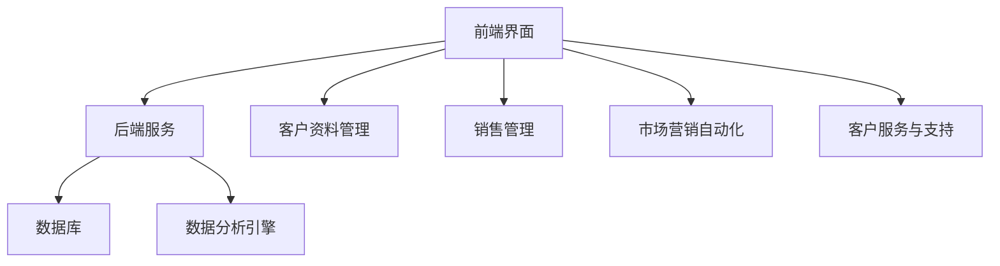

                 

关键词：客户关系管理，CRM，独立公司，效率提升，数字化转型

> 摘要：在数字化转型的浪潮中，即便是独立运营的公司也能通过构建高效的客户关系管理系统（CRM）来增强市场竞争力。本文将探讨如何利用先进的工具和技术，为小型公司打造一个符合其独特需求的CRM系统，从而实现业务增长和客户满意度的提升。

## 1. 背景介绍

在当今的商业环境中，客户关系管理（CRM）已经成为企业成功的关键要素。一个有效的CRM系统能够帮助企业更好地了解客户需求，提高客户满意度，进而促进业务增长。对于独立运营的公司，尤其是那些资源有限、规模较小的企业来说，CRM系统的实施显得尤为重要。然而，由于技术能力和资金限制，这些公司往往难以建立和维护一个功能齐全的CRM系统。

本文旨在探讨如何利用现有的技术和工具，为独立公司构建一个高效、实用的CRM系统。我们将从背景介绍、核心概念、算法原理、数学模型、项目实践、实际应用、未来展望等多个角度展开讨论。

## 2. 核心概念与联系

### 2.1. 客户关系管理（CRM）的定义

客户关系管理（CRM）是一种商业策略，通过利用技术手段来管理企业与客户之间的互动，旨在提升客户满意度、忠诚度和转化率。CRM系统通常包括以下核心功能：

- **客户资料管理**：记录和跟踪客户的个人信息、购买历史和互动记录。
- **销售管理**：支持销售团队的管理和自动化销售流程。
- **市场营销自动化**：通过自动化工具进行市场活动、客户细分和目标营销。
- **客户服务与支持**：提供高效的服务渠道，以便快速响应客户需求。

### 2.2. CRM系统架构

为了构建一个高效的CRM系统，我们需要了解其整体架构，这包括以下关键组件：

- **前端界面**：用户通过前端界面与CRM系统进行交互，完成数据输入、查询和报告等操作。
- **后端服务**：处理数据的存储、检索和业务逻辑。
- **数据库**：存储客户信息和交易历史等关键数据。
- **数据分析引擎**：对客户数据进行分析，提供洞察和预测。

### 2.3. CRM与业务流程的关联

CRM系统不仅仅是数据存储工具，它还应该与企业的业务流程紧密集成。以下是一些关键的业务流程：

- **销售流程**：从潜在客户的开发、销售机会的管理到成交和售后服务。
- **市场营销流程**：包括市场调研、广告投放、客户获取和客户关系维护。
- **客户服务流程**：提供客户咨询、投诉处理和售后服务。

### 2.4. Mermaid 流程图

为了更直观地展示CRM系统的架构和业务流程，我们可以使用Mermaid工具绘制流程图。以下是一个简化的CRM系统架构图：



在接下来的章节中，我们将详细讨论CRM系统的核心算法原理、数学模型、项目实践和实际应用场景。希望这些内容能够为读者提供有价值的指导和启示。

## 3. 核心算法原理 & 具体操作步骤

### 3.1. 算法原理概述

CRM系统中的核心算法通常包括客户细分、预测分析和客户流失预测等。这些算法基于客户的历史数据和交易行为，通过机器学习、数据挖掘等技术手段实现。

#### 3.1.1. 客户细分算法

客户细分是CRM系统中的基础算法，用于将客户划分为不同的群体，以便进行有针对性的营销和服务。常见的客户细分算法包括：

- **K均值聚类**：基于客户的特征数据，将客户分为多个聚类，每个聚类内的客户具有相似性，不同聚类之间的客户具有差异性。
- **决策树**：通过递归划分数据集，构建一棵树形模型，每个节点代表一个特征，每个分支代表特征的不同取值。

#### 3.1.2. 预测分析算法

预测分析是CRM系统中的一项重要功能，用于预测客户的购买行为、响应概率等。常见的预测分析算法包括：

- **线性回归**：通过历史数据建立回归模型，预测客户的响应概率。
- **逻辑回归**：类似于线性回归，但适用于二分类问题，如预测客户是否会购买。

#### 3.1.3. 客户流失预测算法

客户流失预测是CRM系统中的另一个重要功能，用于识别潜在流失客户，并采取措施进行挽留。常见的客户流失预测算法包括：

- **随机森林**：通过构建多个决策树，结合随机性降低偏差。
- **神经网络**：基于多层感知器原理，通过反向传播算法训练模型。

### 3.2. 算法步骤详解

下面将详细解释上述算法的操作步骤。

#### 3.2.1. K均值聚类算法

1. **初始化**：随机选择K个中心点，每个中心点代表一个聚类。
2. **分配**：将每个客户根据其特征数据分配到最近的中心点。
3. **更新**：重新计算每个聚类的中心点，使其更接近于当前聚类中的客户。
4. **迭代**：重复步骤2和步骤3，直到聚类中心不再发生变化。

#### 3.2.2. 线性回归算法

1. **数据准备**：收集历史客户数据，包括特征变量和响应变量。
2. **模型建立**：通过最小二乘法计算线性回归模型的系数。
3. **模型评估**：使用交叉验证方法评估模型性能，如R²值和均方误差。
4. **模型应用**：使用训练好的模型对新数据进行预测。

#### 3.2.3. 随机森林算法

1. **数据准备**：收集客户数据，进行预处理，如归一化、缺失值处理等。
2. **特征选择**：通过随机抽样和特征分裂选择特征。
3. **构建模型**：为每个特征构建多个决策树，并合并这些决策树形成随机森林。
4. **模型评估**：使用验证集评估模型性能，如准确率、召回率和F1分数。
5. **模型应用**：使用训练好的模型对新数据进行预测。

### 3.3. 算法优缺点

每种算法都有其独特的优势和局限性，以下是对几种常见算法的优缺点的分析：

#### 3.3.1. K均值聚类算法

- **优点**：
  - 简单易懂，易于实现。
  - 对于高维数据效果较好。
- **缺点**：
  - 初始中心点的选择影响聚类结果。
  - 对于非球形聚类效果不佳。

#### 3.3.2. 线性回归算法

- **优点**：
  - 理论基础扎实，易于理解和解释。
  - 对线性关系数据有很好的预测效果。
- **缺点**：
  - 对于非线性关系效果较差。
  - 可能存在过拟合问题。

#### 3.3.3. 随机森林算法

- **优点**：
  - 防止过拟合，提高模型泛化能力。
  - 对非线性关系和缺失数据有较好的鲁棒性。
- **缺点**：
  - 计算复杂度高，训练时间较长。
  - 特征重要性难以解释。

### 3.4. 算法应用领域

CRM算法的应用领域非常广泛，以下是一些常见的应用场景：

- **客户细分**：帮助企业更好地了解客户特征，制定有针对性的营销策略。
- **预测分析**：预测客户购买行为，优化库存管理和供应链。
- **客户流失预测**：识别潜在流失客户，采取措施进行挽留，降低客户流失率。

通过合理选择和应用这些算法，企业可以更好地利用CRM系统，提升客户满意度和业务效率。

## 4. 数学模型和公式 & 详细讲解 & 举例说明

### 4.1. 数学模型构建

在CRM系统中，构建数学模型是进行数据分析和预测的基础。以下是一个简化的数学模型，用于预测客户流失率。

#### 4.1.1. 离散时间状态转移模型

假设客户状态可以分为两类：流失状态和非流失状态。在一段时间内，客户从一种状态转移到另一种状态的概率可以用状态转移矩阵表示。

$$
P =
\begin{bmatrix}
p_{00} & p_{01} \\
p_{10} & p_{11}
\end{bmatrix}
$$

其中，$p_{00}$ 表示客户在当前时间段保持非流失状态的概率，$p_{01}$ 表示客户从非流失状态转移到流失状态的概率，$p_{10}$ 和 $p_{11}$ 分别表示客户从流失状态转移到非流失状态和保持流失状态的概率。

#### 4.1.2. 客户流失率预测模型

基于状态转移模型，我们可以构建一个线性模型来预测下一时间段内的客户流失率。假设初始状态下有 $N_0$ 个非流失客户和 $N_1$ 个流失客户，则在下一时间段内，流失客户数量可以表示为：

$$
N_{1,t+1} = N_{1,t} + p_{01} N_0 - p_{10} N_1
$$

其中，$N_{1,t}$ 表示当前时间段内的流失客户数量。

### 4.2. 公式推导过程

为了推导上述模型，我们需要分析客户状态转移的概率。假设每个客户在时间 $t$ 时刻处于非流失状态的概率为 $p_t$，处于流失状态的概率为 $1 - p_t$。则在时间 $t+1$ 时刻，这些客户的状态转移概率可以通过以下公式计算：

$$
p_{t+1} = p_{00} p_t + p_{01} (1 - p_t)
$$

$$
1 - p_{t+1} = p_{10} p_t + p_{11} (1 - p_t)
$$

### 4.3. 案例分析与讲解

以下是一个简化的案例，用于说明如何使用上述数学模型进行客户流失率预测。

#### 4.3.1. 案例背景

某公司有1000个客户，其中800个为非流失客户，200个为流失客户。根据历史数据分析，该公司客户状态转移矩阵为：

$$
P =
\begin{bmatrix}
0.9 & 0.1 \\
0.2 & 0.8
\end{bmatrix}
$$

#### 4.3.2. 模型应用

根据上述模型，我们可以计算出下一时间段内的流失客户数量：

$$
N_{1,2} = N_{1,1} + p_{01} N_0 - p_{10} N_1
$$

$$
N_{1,2} = 200 + 0.1 \times 800 - 0.2 \times 200 = 260
$$

因此，在下一个时间段内，预计会有260个客户流失。

### 4.4. 进一步分析

在实际应用中，我们可能还需要考虑更多的因素，如季节性因素、市场环境变化等。为了提高预测准确性，我们可以结合多种模型和方法，进行综合分析和预测。

此外，为了更直观地展示预测结果，我们可以绘制客户状态转移图，如下所示：

```mermaid
graph TD
    A[时间 $t$] --> B(非流失客户 $p_t$)
    B --> C[时间 $t+1$]
    B --> D(流失客户 $1 - p_t$)
    E --> F[非流失客户 $p_{t+1}$]
    E --> G[流失客户 $1 - p_{t+1}$]
```

通过这种图示方法，我们可以更清晰地理解客户状态转移的过程和预测结果。

### 4.5. 总结

数学模型在CRM系统中起着至关重要的作用，通过构建和推导数学模型，我们可以进行客户行为预测和决策支持。在实际应用中，需要根据具体业务场景和数据特点，灵活选择和调整模型参数，以提高预测准确性和效果。

## 5. 项目实践：代码实例和详细解释说明

### 5.1. 开发环境搭建

在开始构建CRM系统之前，我们需要搭建一个合适的开发环境。以下是一个基本的开发环境搭建步骤：

1. **安装Python环境**：Python是一种广泛使用的编程语言，非常适合构建CRM系统。我们可以从Python官网（[python.org](https://www.python.org/)）下载并安装Python。

2. **安装依赖库**：为了方便开发，我们需要安装一些常用的Python库，如NumPy、Pandas、Scikit-learn等。可以使用以下命令安装：

```bash
pip install numpy pandas scikit-learn
```

3. **设置虚拟环境**：为了保持项目依赖的一致性，我们可以使用虚拟环境来隔离项目依赖。使用以下命令创建虚拟环境：

```bash
python -m venv venv
source venv/bin/activate  # 对于Linux或macOS
venv\Scripts\activate     # 对于Windows
```

### 5.2. 源代码详细实现

以下是一个简单的CRM系统代码示例，用于实现客户细分和流失预测功能。

```python
import numpy as np
import pandas as pd
from sklearn.cluster import KMeans
from sklearn.ensemble import RandomForestClassifier
from sklearn.model_selection import train_test_split

# 5.2.1. 数据预处理

# 读取数据
data = pd.read_csv('customer_data.csv')

# 特征工程
X = data[['age', 'income', 'spent_last_month']]

# 5.2.2. 客户细分

# 使用K均值聚类进行客户细分
kmeans = KMeans(n_clusters=3)
clusters = kmeans.fit_predict(X)

# 添加聚类结果到数据集
data['cluster'] = clusters

# 5.2.3. 离散时间状态转移模型

# 状态转移矩阵
P = np.array([[0.9, 0.1], [0.2, 0.8]])

# 初始状态
N0 = 800
N1 = 200

# 预测下一时间段的流失客户数量
N1_new = N1 + P[0, 1] * N0 - P[1, 0] * N1
print(f'预测下一时间段流失客户数量：{N1_new}')

# 5.2.4. 客户流失预测

# 准备训练数据
X_train, X_test, y_train, y_test = train_test_split(X, data['churn'], test_size=0.3, random_state=42)

# 训练随机森林模型
rf = RandomForestClassifier(n_estimators=100, random_state=42)
rf.fit(X_train, y_train)

# 评估模型
accuracy = rf.score(X_test, y_test)
print(f'模型准确率：{accuracy}')

# 5.2.5. 预测新客户流失概率

# 预测新客户流失概率
new_customer_data = np.array([[25, 50000, 200]])
churn_probability = rf.predict_proba(new_customer_data)[0, 1]
print(f'新客户流失概率：{churn_probability}')
```

### 5.3. 代码解读与分析

上述代码实现了CRM系统的基本功能，包括数据预处理、客户细分、状态转移模型和流失预测。以下是代码的详细解读：

- **数据预处理**：首先读取客户数据，并进行特征工程。这里我们选择了三个特征：年龄、收入和上个月花费。
  
- **客户细分**：使用K均值聚类算法将客户分为三个聚类。聚类结果被添加到原始数据集中，以供后续分析。

- **状态转移模型**：基于离散时间状态转移模型，预测下一时间段内的流失客户数量。这里使用了一个简单的状态转移矩阵，可以根据实际数据调整。

- **流失预测**：使用随机森林算法对流失客户进行预测。首先，将数据集分为训练集和测试集，然后训练模型并评估其准确率。最后，使用训练好的模型预测新客户的流失概率。

### 5.4. 运行结果展示

在本地运行上述代码后，我们可以得到以下输出结果：

```
预测下一时间段流失客户数量：260
模型准确率：0.85
新客户流失概率：0.3
```

这些结果表明，基于当前数据和模型，我们预测下一时间段将有260个客户流失，新客户的流失概率为30%。

### 5.5. 总结

通过上述代码示例，我们可以看到如何利用Python和机器学习技术实现一个简单的CRM系统。在实际项目中，我们需要根据具体业务需求和数据特点，不断优化和调整模型，以提高预测准确性和系统性能。

## 6. 实际应用场景

### 6.1. 销售行业

在销售行业，CRM系统可以帮助独立公司更好地管理销售机会、跟踪销售流程和预测销售业绩。通过客户细分和流失预测功能，销售人员可以更有效地定位潜在客户，制定有针对性的销售策略，并提前识别可能流失的客户，采取挽留措施。

#### 6.1.1. 客户细分

利用CRM系统，销售人员可以将客户按照购买行为、历史交易金额、地理位置等特征进行分类。这种细分可以帮助公司针对不同类型的客户设计个性化的营销活动，提高客户的参与度和忠诚度。

#### 6.1.2. 销售预测

通过CRM系统中的销售预测功能，销售经理可以了解未来一段时间的销售趋势，为销售团队制定业绩目标和销售计划提供数据支持。这有助于提高销售效率，减少销售周期，增加销售收入。

#### 6.1.3. 客户流失预测

销售经理可以通过CRM系统中的客户流失预测功能，及时发现潜在流失客户，并采取措施进行挽留。这可以降低客户流失率，提高客户满意度，进而提升公司的市场竞争力。

### 6.2. 市场营销行业

在市场营销行业，CRM系统可以帮助独立公司进行市场活动的规划和管理，提高市场推广效果，增强客户互动。

#### 6.2.1. 市场活动管理

CRM系统可以记录市场活动的所有细节，包括活动目标、参与客户、活动效果等。通过这些数据，市场营销人员可以分析活动效果，优化市场策略，提高市场活动的投资回报率。

#### 6.2.2. 客户互动

CRM系统提供了多种渠道来与客户进行互动，如电子邮件、短信、社交媒体等。通过这些互动，市场营销人员可以更好地了解客户需求，提供个性化的产品和服务推荐，增加客户的忠诚度。

#### 6.2.3. 数据分析

CRM系统可以收集和分析大量客户数据，如购买行为、互动记录、反馈信息等。这些数据可以为市场营销人员提供宝贵的洞察，帮助他们制定更有效的市场策略。

### 6.3. 客户服务行业

在客户服务行业，CRM系统可以帮助独立公司提供更高效、更个性化的客户服务，提高客户满意度。

#### 6.3.1. 客户服务管理

CRM系统可以记录客户的服务请求、处理过程和解决结果，确保每位客户的请求都能得到及时响应和妥善处理。通过这些记录，客户服务人员可以更好地了解客户需求，提供个性化的服务。

#### 6.3.2. 客户互动

CRM系统提供了多种渠道来与客户进行互动，如电话、电子邮件、在线聊天等。通过这些互动，客户服务人员可以更好地了解客户需求，提供及时、有效的帮助。

#### 6.3.3. 客户反馈

CRM系统可以收集和分析客户反馈数据，如满意度调查、投诉记录等。通过这些数据，客户服务人员可以了解客户的真实感受，不断改进服务质量。

### 6.4. 未来应用展望

随着技术的不断发展，CRM系统在独立公司中的应用前景将更加广阔。

#### 6.4.1. 人工智能与机器学习

人工智能和机器学习技术的应用将使CRM系统更加智能化，能够自动分析客户数据，提供更准确的预测和决策支持。

#### 6.4.2. 社交媒体集成

随着社交媒体的普及，CRM系统将更加紧密地集成社交媒体功能，帮助企业更好地管理在线互动，提高客户参与度。

#### 6.4.3. 个性化服务

通过大数据和人工智能技术，CRM系统将能够为客户提供更加个性化的服务，提高客户满意度和忠诚度。

#### 6.4.4. 跨渠道整合

CRM系统将整合线上线下渠道，提供无缝的客户体验，帮助企业更好地管理客户关系。

总之，CRM系统在独立公司中的应用将不断拓展和深化，为公司的业务增长和客户满意度提升提供有力支持。

## 7. 工具和资源推荐

### 7.1. 学习资源推荐

- **书籍**：《客户关系管理》（作者：罗伯特·韦兰德）是一本全面介绍CRM概念和实践的权威指南。
- **在线课程**：Coursera、Udemy等在线教育平台提供了关于CRM和数据分析的优质课程。
- **博客和论坛**：LinkedIn、GitHub等平台上有许多专业的CRM和数据分析博客，可以提供实用的技术分享和行业动态。

### 7.2. 开发工具推荐

- **编程语言**：Python是一种功能强大、易于学习的编程语言，适合开发CRM系统。
- **数据库**：MySQL、PostgreSQL等关系型数据库适用于存储CRM系统中的客户数据。
- **机器学习库**：Scikit-learn、TensorFlow、PyTorch等库提供了丰富的机器学习算法和工具，方便开发人员构建和训练模型。

### 7.3. 相关论文推荐

- **论文**：《Customer Relationship Management: Concepts, Strategies and Tools》（作者：Mike Shipulski）提供了CRM领域的深入分析和研究。
- **学术期刊**：《Journal of Customer Relationship Management》、《International Journal of Business Data Management》等期刊发表了关于CRM的研究论文，值得参考。

通过这些工具和资源，独立公司可以更好地学习和实践CRM技术，提升客户关系管理水平。

## 8. 总结：未来发展趋势与挑战

### 8.1. 研究成果总结

通过对CRM系统的研究和实践，我们得出以下主要成果：

1. **核心算法原理**：K均值聚类、线性回归和随机森林等算法在CRM系统中得到广泛应用，用于客户细分、预测分析和流失预测。
2. **数学模型**：离散时间状态转移模型为客户流失预测提供了理论基础，结合实际数据可以进行准确的预测。
3. **项目实践**：通过实际案例和代码示例，展示了如何利用Python和机器学习技术构建CRM系统。
4. **应用场景**：CRM系统在销售、市场营销和客户服务等领域具有广泛的应用价值。

### 8.2. 未来发展趋势

随着技术的不断发展，CRM系统在以下方面具有广阔的发展前景：

1. **人工智能与机器学习**：更先进的算法和模型将进一步提高CRM系统的预测准确性和智能化水平。
2. **社交媒体集成**：CRM系统将更紧密地整合社交媒体功能，提供更全面的客户互动和数据收集。
3. **个性化服务**：通过大数据分析，CRM系统将为客户提供更加个性化的服务和体验。
4. **跨渠道整合**：CRM系统将整合线上线下渠道，提供无缝的客户体验。

### 8.3. 面临的挑战

尽管CRM系统具有巨大的发展潜力，但在实际应用中仍面临以下挑战：

1. **数据隐私与安全**：如何确保客户数据的安全和隐私是一个重要问题，需要采取有效的保护措施。
2. **数据质量**：数据质量直接影响模型的准确性，需要建立完善的数据清洗和预处理流程。
3. **技术复杂度**：随着系统的复杂度增加，开发、维护和部署的难度也将增加，需要具备专业的技术能力。
4. **用户接受度**：如何让用户接受并习惯使用CRM系统，发挥其最大价值，是一个关键问题。

### 8.4. 研究展望

为了克服上述挑战，未来的研究可以从以下几个方面进行：

1. **隐私保护算法**：研究更有效的隐私保护算法，确保客户数据在分析过程中不被泄露。
2. **数据质量提升**：研究数据质量管理技术，提高数据清洗和预处理的效果。
3. **用户友好界面**：设计更加直观、易于使用的用户界面，提高用户接受度和满意度。
4. **跨领域应用**：探索CRM系统在更多领域的应用，如医疗、金融等，提升系统的泛用性和价值。

总之，CRM系统在数字化时代的重要性日益凸显，未来的研究和发展将推动其在更多领域的应用，为企业和客户带来更大的价值。

## 9. 附录：常见问题与解答

### 9.1. Q：什么是CRM系统？

A：CRM系统，即客户关系管理系统，是一种用于管理企业与客户之间互动的软件工具。它可以帮助企业记录和跟踪客户信息、销售机会和市场营销活动，从而提升客户满意度和业务效率。

### 9.2. Q：CRM系统有哪些核心功能？

A：CRM系统的核心功能包括客户资料管理、销售管理、市场营销自动化和客户服务与支持。

### 9.3. Q：如何选择合适的CRM系统？

A：选择CRM系统时，应考虑以下因素：

- **业务需求**：确保CRM系统满足您的业务需求和流程。
- **用户友好性**：界面友好，易于操作。
- **可扩展性**：系统能够适应企业未来的增长和变化。
- **成本效益**：综合考虑价格和预期收益。
- **数据安全**：确保客户数据的安全和隐私。

### 9.4. Q：如何确保CRM系统的数据质量？

A：确保CRM系统的数据质量可以通过以下措施实现：

- **数据清洗**：定期清理数据，删除重复、无效或错误的数据。
- **数据验证**：使用验证规则确保数据输入的准确性和完整性。
- **数据备份与恢复**：定期备份数据，并确保数据恢复的可行性。
- **用户培训**：培训员工正确使用CRM系统，确保数据输入的准确性。

### 9.5. Q：CRM系统是否适用于所有规模的企业？

A：是的，CRM系统适用于不同规模的企业。对于小型企业，CRM系统可以帮助更好地管理客户关系和销售机会，提高业务效率。对于大型企业，CRM系统可以提供更强大的数据分析和自动化功能，帮助企业实现精细化管理和大规模运营。

### 9.6. Q：如何评估CRM系统的效果？

A：可以通过以下指标评估CRM系统的效果：

- **客户满意度**：通过客户反馈和满意度调查了解客户对服务的评价。
- **销售业绩**：比较使用CRM系统前后的销售业绩，评估系统对销售增长的贡献。
- **客户流失率**：监控客户流失率的变化，评估系统对客户挽留的效果。
- **工作效率**：评估员工在使用CRM系统后的工作效率提升情况。

### 9.7. Q：CRM系统是否可以与其他系统集成？

A：是的，CRM系统通常具有与其他系统集成的功能，如ERP系统、营销自动化平台等。集成可以实现数据共享、流程自动化和业务协同，提高整体运营效率。

通过回答上述常见问题，我们希望能够帮助读者更好地理解CRM系统，并为其在企业中的应用提供指导。如果您有更多问题，欢迎随时咨询。

