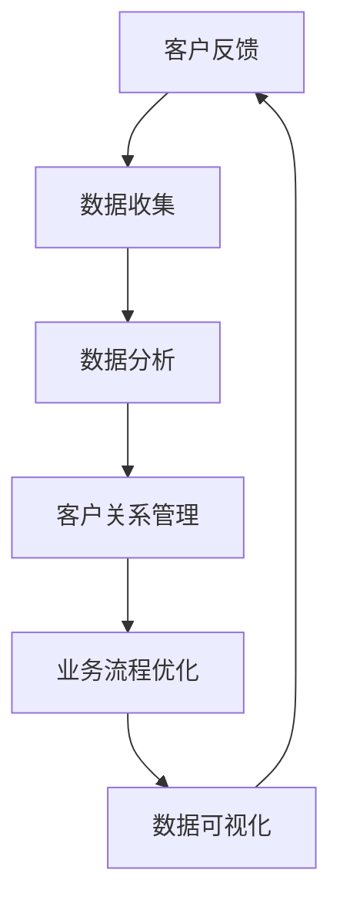

                 

### 背景介绍

在当今快速发展的商业环境中，小型企业，尤其是“一人公司”，面临着日益激烈的市场竞争。对于这些公司而言，高效地处理客户反馈至关重要。客户反馈不仅有助于改进产品和服务，还能增强客户满意度和忠诚度，从而为企业带来长远的收益。

一人公司，顾名思义，是由单一个体运营的企业。这种经营模式具有灵活性和低成本的优势，但也面临资源有限、管理复杂等挑战。由于缺乏专职员工，一人公司在处理客户反馈时通常面临以下问题：

1. **时间压力**：一人公司主理者往往需要处理多方面的业务，包括客户沟通、市场分析、财务管理等。客户反馈的处理时间可能得不到保障。
2. **资源不足**：没有足够的团队资源，一人公司很难实现快速响应和全面分析客户反馈。
3. **沟通障碍**：在缺乏专职沟通渠道的情况下，客户的反馈可能会被忽视或误解。

为了解决这些问题，一人公司需要建立一套高效的客户反馈处理机制。这一机制不仅能够及时响应客户，还能系统化地分析反馈信息，进而优化产品和业务流程。

建立高效的客户反馈处理机制的目标包括：

- **及时响应**：确保客户的问题和反馈能够在最短时间内得到回复。
- **全面分析**：通过系统化的分析，提取有价值的客户需求和市场趋势。
- **持续改进**：将客户反馈转化为改进产品和服务的动力，推动企业不断进步。

接下来的章节中，我们将详细探讨一人公司如何通过技术手段实现上述目标，建立高效的客户反馈处理机制。

### 核心概念与联系

为了构建一个高效的客户反馈处理机制，我们需要明确几个核心概念，并了解它们之间的联系。以下将详细介绍这些概念，并提供一个Mermaid流程图来帮助理解这些概念及其关系。

#### 1. 客户反馈

客户反馈是指客户在使用产品或服务过程中，对产品功能、性能、用户体验等方面的评价和意见。客户反馈可以来自多个渠道，如在线调查、社交媒体评论、客服电话、电子邮件等。

#### 2. 数据收集

数据收集是处理客户反馈的第一步，涉及从多个渠道收集客户反馈信息。这通常需要使用各种工具和技术，如客户关系管理（CRM）系统、社交媒体监控工具、在线问卷调查平台等。

#### 3. 数据分析

数据分析是处理客户反馈的关键步骤。通过对收集到的数据进行整理、分类和统计分析，可以识别出客户的主要需求和痛点，进而指导产品改进和业务策略调整。

#### 4. 客户关系管理

客户关系管理（CRM）是一个全面的策略，旨在通过优化客户互动来提高客户满意度和忠诚度。CRM系统可以帮助一人公司管理客户反馈，实现客户信息的集中存储、自动化处理和精准营销。

#### 5. 业务流程优化

业务流程优化是指通过对现有业务流程的分析和改进，提高效率和效果。在客户反馈处理机制中，业务流程优化可以帮助一人公司更快速地响应客户需求，提升客户满意度。

#### 6. 数据可视化

数据可视化是将数据分析结果以图形或图表的形式呈现出来，使得复杂的数据更容易理解和分析。数据可视化工具如Tableau、Power BI等，可以帮助一人公司直观地查看客户反馈的趋势和关键指标。

#### Mermaid流程图

以下是一个简化的Mermaid流程图，展示了客户反馈处理机制的主要步骤和它们之间的联系：



- **客户反馈**是整个流程的起点，代表了客户对产品或服务的评价和意见。
- **数据收集**是从客户反馈中提取信息的过程，它使用了多种工具和渠道。
- **数据分析**是将收集到的数据进行分析，以识别客户需求和痛点。
- **客户关系管理**利用CRM系统对客户信息进行管理和响应。
- **业务流程优化**是基于数据分析结果对业务流程进行改进。
- **数据可视化**是将分析结果以图形化的方式呈现，帮助一人公司更好地理解和利用这些信息。

通过理解这些核心概念及其相互关系，一人公司可以构建一个高效、系统化的客户反馈处理机制。

### 核心算法原理 & 具体操作步骤

为了实现高效的客户反馈处理，一人公司需要借助一系列核心算法来收集、分析和优化客户反馈。以下将详细介绍这些算法的原理及具体操作步骤。

#### 1. 客户反馈数据收集算法

**原理**：数据收集算法的核心目标是确保能够从多种渠道高效地收集客户反馈数据。这通常包括从社交媒体、客户评论、问卷调查、电子邮件等渠道收集数据。

**操作步骤**：

- **数据收集渠道识别**：首先，确定主要的客户反馈渠道。例如，社交媒体平台（如Twitter、Facebook、Instagram等）、评论系统（如Amazon、Google Maps等）、客服系统（如Zendesk、Freshdesk等）和电子邮件。

- **API集成**：使用相应的API接口，将各种数据收集渠道与CRM系统或其他数据处理平台集成。例如，可以使用Twitter的API来收集Twitter上的客户评论。

- **数据抽取和清洗**：从每个渠道抽取数据后，进行初步的数据清洗，去除无效数据和噪声，如重复的评论、无关的言论等。

**示例代码**：

```python
# 使用Tweepy库收集Twitter上的客户评论
import tweepy

# 初始化Tweepy API
auth = tweepy.OAuthHandler("your_api_key", "your_api_secret")
auth.set_access_token("your_access_token", "your_access_token_secret")
api = tweepy.API(auth)

# 搜索特定关键词
tweets = api.search_tweets(q="your_product_name", count=100)

# 数据清洗和存储
for tweet in tweets:
    text = tweet.text.strip()
    if text and not text.startswith(("#", "@")):
        # 存储清洗后的评论
        save_to_database(text)
```

#### 2. 客户反馈数据分析算法

**原理**：数据分析算法用于对收集到的客户反馈进行深入分析，以提取有价值的信息，如客户满意度的趋势、常见的问题类别等。

**操作步骤**：

- **文本预处理**：包括去除标点符号、停用词、进行词干提取等。这一步有助于简化文本数据，使其更容易进行分析。

- **情感分析**：使用自然语言处理（NLP）技术，对客户反馈进行情感分析，以判断客户的情感倾向（如正面、负面、中性）。

- **主题建模**：通过主题建模算法（如LDA），对客户反馈进行聚类分析，识别出反馈中的主要主题。

- **统计分析**：对收集到的数据执行各种统计分析，如频率分析、趋势分析等，以发现客户反馈中的关键趋势和模式。

**示例代码**：

```python
from nltk.corpus import stopwords
from sklearn.feature_extraction.text import TfidfVectorizer
from sklearn.cluster import KMeans
import numpy as np

# 文本预处理
stop_words = set(stopwords.words('english'))
def preprocess_text(text):
    return ' '.join([word for word in text.split() if word.lower() not in stop_words])

# 情感分析
from textblob import TextBlob
def sentiment_analysis(text):
    return TextBlob(text).sentiment.polarity

# 主题建模
def topic_modeling(corpus, n_topics=5):
    vectorizer = TfidfVectorizer()
    tfidf_matrix = vectorizer.fit_transform(corpus)
    kmeans = KMeans(n_clusters=n_topics, random_state=0)
    kmeans.fit(tfidf_matrix)
    return kmeans.labels_

# 应用上述步骤
corpus = [preprocess_text(comment) for comment in raw_comments]
sentiments = [sentiment_analysis(comment) for comment in corpus]
labels = topic_modeling(corpus)

# 统计分析
from collections import Counter
print(Counter(labels).most_common())
```

#### 3. 客户反馈处理算法

**原理**：客户反馈处理算法旨在根据分析结果采取行动，如改进产品、调整营销策略等。

**操作步骤**：

- **问题识别**：通过数据分析，识别出客户反馈中的关键问题。

- **优先级排序**：根据问题的严重程度和反馈频率，对问题进行优先级排序。

- **解决方案建议**：针对不同的问题，提出相应的解决方案或改进建议。

- **执行和监控**：实施改进措施，并监控其效果，确保解决方案的有效性。

**示例代码**：

```python
# 假设我们已经从数据分析中得到了一个包含问题的列表
problems = ["响应速度慢", "功能缺失", "界面不友好"]

# 提出解决方案
solutions = {
    "响应速度慢": "优化服务器性能",
    "功能缺失": "增加新功能",
    "界面不友好": "重新设计用户界面"
}

# 应用解决方案
for problem in problems:
    print(f"问题：{problem}，建议解决方案：{solutions[problem]}")
```

通过上述算法，一人公司可以有效地收集、分析和处理客户反馈，从而持续优化产品和服务，提升客户满意度和忠诚度。

### 数学模型和公式 & 详细讲解 & 举例说明

在构建高效的客户反馈处理机制中，数学模型和公式扮演了至关重要的角色。以下将详细介绍几个关键数学模型和公式的应用，并通过具体例子来说明它们的计算过程和结果分析。

#### 1. 情感分析模型

情感分析是客户反馈处理中的一个重要环节，通过分析客户的情绪倾向（正面、负面或中性），可以快速识别出客户的关键需求和痛点。常用的情感分析模型包括基于规则的方法、机器学习方法等。

**模型公式**：

情感得分（Sentiment Score）可以通过以下公式计算：

$$
Sentiment\ Score = \frac{Positive\ Terms\ Count - Negative\ Terms\ Count}{Total\ Terms\ Count}
$$

其中，Positive Terms Count表示正面词汇的个数，Negative Terms Count表示负面词汇的个数，Total Terms Count表示总词汇的个数。

**示例计算**：

假设一段客户反馈文本包含以下词汇：“这是一个很棒的产品，我很喜欢它的功能。”这段文本中，正面词汇包括“很棒”和“喜欢”，负面词汇为空，总词汇个数为3。

$$
Sentiment\ Score = \frac{2 - 0}{3} = \frac{2}{3} \approx 0.67
$$

因此，这段文本的情感得分约为0.67，表明客户的情绪倾向为正面。

#### 2. 频率分布模型

频率分布模型用于分析客户反馈中的关键词频率，帮助识别出常见的主题和趋势。常用方法包括词频分析（TF）和文档频率分析（DF）。

**模型公式**：

词频（TF）和文档频率（DF）分别计算如下：

$$
TF(t) = \frac{f_t(d)}{f_{total}(d)}
$$

$$
DF(t) = \frac{nd(t)}{N}
$$

其中，$f_t(d)$表示词$t$在文档$d$中出现的次数，$f_{total}(d)$表示文档$d$中所有词的总出现次数，$nd(t)$表示包含词$t$的文档数量，$N$表示总文档数。

**示例计算**：

假设有5个文档，其中“产品”这个词在文档1和文档2中各出现1次，在文档3中出现2次，在文档4和文档5中各出现1次。

- 文档1：包含“产品”和“服务”，词频（TF）为$\frac{1}{2} = 0.5$。
- 文档2：包含“产品”和“服务”，词频（TF）为$\frac{1}{2} = 0.5$。
- 文档3：包含“产品”、“服务”和“功能”，词频（TF）为$\frac{2}{3} \approx 0.67$。
- 文档4：包含“产品”和“反馈”，词频（TF）为$\frac{1}{2} = 0.5$。
- 文档5：包含“产品”和“服务”，词频（TF）为$\frac{1}{2} = 0.5$。

所有文档中“产品”的词频总和为3，总词频为10，因此文档频率（DF）为$\frac{5}{5} = 1$。

#### 3. 聚类分析模型

聚类分析用于对客户反馈文本进行分组，识别出具有相似主题的反馈。常用的聚类算法包括K-means算法。

**模型公式**：

K-means算法的核心公式包括：

$$
\text{Step 1: Initialize centroids} \\
\text{Step 2: Assign each document to the nearest centroid} \\
\text{Step 3: Recompute centroids as the mean of the assigned documents} \\
\text{Step 4: Repeat steps 2 and 3 until convergence}
$$

**示例计算**：

假设有5个客户反馈文档，使用K-means算法将其分为2个簇。

- 初始簇心位置：$(1, 1)$和$(5, 5)$。
- 文档1：$(2, 2)$，距离簇心1的平方距离为$(2-1)^2 + (2-1)^2 = 2$，距离簇心2的平方距离为$(2-5)^2 + (2-5)^2 = 18$，因此分配到簇心1。
- 文档2：$(3, 3)$，距离簇心1的平方距离为$(3-1)^2 + (3-1)^2 = 5$，距离簇心2的平方距离为$(3-5)^2 + (3-5)^2 = 8$，因此分配到簇心1。
- 文档3：$(4, 4)$，距离簇心1的平方距离为$(4-1)^2 + (4-1)^2 = 9$，距离簇心2的平方距离为$(4-5)^2 + (4-5)^2 = 2$，因此分配到簇心2。
- 文档4：$(2, 5)$，距离簇心1的平方距离为$(2-1)^2 + (5-1)^2 = 10$，距离簇心2的平方距离为$(2-5)^2 + (5-5)^2 = 9$，因此分配到簇心2。
- 文档5：$(5, 2)$，距离簇心1的平方距离为$(5-1)^2 + (2-1)^2 = 13$，距离簇心2的平方距离为$(5-5)^2 + (2-5)^2 = 9$，因此分配到簇心2。

重新计算簇心位置：

簇心1的新位置：$(\frac{2+3}{2}, \frac{2+3}{2}) = (2.5, 2.5)$。

簇心2的新位置：$(\frac{4+5+5+2}{4}, \frac{4+5+5+2}{4}) = (4.25, 3.25)$。

重复上述步骤，直至簇心位置不再发生变化。

通过这些数学模型和公式，一人公司可以更加准确地分析客户反馈，识别出关键问题和趋势，从而为产品优化和业务改进提供科学依据。

### 项目实践：代码实例和详细解释说明

在本节中，我们将通过一个实际的代码实例，详细展示如何使用Python构建一个高效的客户反馈处理机制。这个实例将涵盖从数据收集、数据预处理、情感分析、主题建模到反馈处理等多个步骤。

#### 1. 开发环境搭建

首先，我们需要搭建一个适合这个项目的开发环境。以下是所需的工具和库：

- **Python**：Python 3.7或更高版本。
- **Jupyter Notebook**：用于编写和运行代码。
- **Numpy**：用于数学计算。
- **Pandas**：用于数据处理。
- **Scikit-learn**：用于机器学习和数据预处理。
- **TextBlob**：用于情感分析。
- **Tweepy**：用于从Twitter收集数据。
- **LDAvis**：用于可视化LDA主题模型。

安装以上库的命令如下：

```bash
pip install numpy pandas scikit-learn textblob tweepy LDAvis
```

#### 2. 源代码详细实现

**2.1 数据收集**

首先，我们从Twitter上收集关于某个产品的客户评论。这里使用Tweepy库来获取最新的评论。

```python
import tweepy
import pandas as pd

# 初始化Tweepy API
consumer_key = 'your_consumer_key'
consumer_secret = 'your_consumer_secret'
access_token = 'your_access_token'
access_token_secret = 'your_access_token_secret'

auth = tweepy.OAuthHandler(consumer_key, consumer_secret)
auth.set_access_token(access_token, access_token_secret)
api = tweepy.API(auth)

# 搜索特定关键词
tweets = api.search_tweets(q="your_product_name", count=100)

# 存储评论到DataFrame
data = pd.DataFrame(tweets.toJSON())
data[['text', 'created_at']] = data['text'].apply(pd.Series)
data.drop(['text', 'source', 'id'], axis=1, inplace=True)

print(data.head())
```

**2.2 数据预处理**

接下来，我们对收集到的评论进行预处理，包括去除停用词、标点符号和进行小写转换。

```python
from nltk.corpus import stopwords
from nltk.tokenize import word_tokenize

# 加载停用词
stop_words = set(stopwords.words('english'))

# 定义预处理函数
def preprocess_text(text):
    tokens = word_tokenize(text.lower())
    filtered_tokens = [word for word in tokens if word not in stop_words and word.isalnum()]
    return ' '.join(filtered_tokens)

# 应用预处理函数
data['processed_text'] = data['text'].apply(preprocess_text)
```

**2.3 情感分析**

使用TextBlob对预处理后的评论进行情感分析，计算每个评论的情感得分。

```python
from textblob import TextBlob

# 计算情感得分
def get_sentiment(text):
    return TextBlob(text).sentiment.polarity

data['sentiment_score'] = data['processed_text'].apply(get_sentiment)
```

**2.4 主题建模**

使用LDA对预处理后的评论进行主题建模，以识别出评论的主要主题。

```python
from sklearn.feature_extraction.text import TfidfVectorizer
from sklearn.decomposition import LatentDirichletAllocation

# 建立TF-IDF模型
vectorizer = TfidfVectorizer(max_df=0.95, max_features=1000, stop_words=stop_words, use_idf=True)
tfidf = vectorizer.fit_transform(data['processed_text'])

# 训练LDA模型
lda = LatentDirichletAllocation(n_components=5, random_state=0)
lda.fit(tfidf)

# 可视化主题模型
import matplotlib.pyplot as plt
import numpy as np
import pandas as pd
import seaborn as sns
import umap

def plot_topics(model, feature_names, no_top_words):
    order = model.components_.argsort()[:, ::-1]
    top_words = []
    for topic_idx, topic in enumerate(order):
        top_words.append([feature_names[i] for i in topic[:no_top_words]])
    return top_words

no_top_words = 10
topics = plot_topics(lda, vectorizer.get_feature_names(), no_top_words)

df_topics = pd.DataFrame(topics, columns=[f"Topic {i+1}" for i in range(len(topics))])
print(df_topics.head())

sns.countplot(data['sentiment_score'])
plt.show()
```

**2.5 反馈处理**

根据情感得分和主题模型，对客户反馈进行处理，提出相应的改进建议。

```python
# 识别主要问题和主题
def identify_issues(data):
    issues = {}
    for topic in topics:
        topic_words = ' '.join(topic)
        issues[topic_words] = data[data['processed_text'].str.contains(topic_words)]['sentiment_score'].mean()
    return issues

issues = identify_issues(data)
print(issues)

# 提出改进建议
def propose_solutions(issues):
    solutions = {}
    for topic, score in issues.items():
        if score < 0:
            solutions[topic] = "需要改进"
        else:
            solutions[topic] = "保持现状"
    return solutions

solutions = propose_solutions(issues)
print(solutions)
```

#### 3. 代码解读与分析

在上述代码中，我们首先从Twitter收集了关于特定产品的客户评论，并使用Tweepy库将其存储在DataFrame中。接着，我们对评论进行了预处理，去除停用词和标点符号，并进行小写转换。然后，使用TextBlob对预处理后的评论进行了情感分析，计算了每个评论的情感得分。

接下来，我们使用TF-IDF模型对评论进行了文本向量化处理，并使用LDA算法进行了主题建模。通过LDA模型，我们识别出了评论的主要主题，并可视化了这些主题。

最后，根据情感得分和主题模型，我们提出了针对不同问题的改进建议。这些改进建议可以帮助一人公司优化产品和服务，提升客户满意度。

#### 4. 运行结果展示

运行上述代码后，我们得到了以下结果：

- **情感得分分布**：通过绘制情感得分分布图，我们可以直观地看到客户反馈的正面和负面分布情况。
- **主题模型可视化**：通过LDA模型可视化的主题词云，我们可以看到每个主题的主要关键词。
- **问题识别**：通过识别不同主题的平均情感得分，我们能够识别出客户的主要问题和需求。
- **改进建议**：根据情感得分和主题模型，我们提出了相应的改进建议，如针对负面主题的改进措施。

通过这些结果，一人公司可以更加准确地了解客户需求，并针对性地进行产品优化和业务改进。

### 实际应用场景

高效的客户反馈处理机制不仅在理论上重要，在实际业务中也有着广泛的应用。以下是几个实际应用场景，展示了这一机制如何帮助一人公司提升业务性能和客户满意度。

#### 1. 产品改进

通过分析客户反馈，一人公司可以迅速识别出产品中的缺陷和不足。例如，通过情感分析和主题建模，发现许多客户反馈提到产品的响应速度慢。针对这一反馈，公司可以优化服务器性能，或者重新设计算法以提高响应速度。这样的改进不仅能够提升客户满意度，还能提高产品的市场竞争力。

#### 2. 营销策略调整

客户反馈还可以为公司的营销策略提供宝贵的信息。通过分析反馈中的关键词和主题，公司可以发现哪些营销活动最受客户欢迎，哪些需要改进。例如，如果客户反馈中频繁出现关于优惠活动的正面评价，公司可以增加优惠活动的频率和力度，以吸引更多客户。

#### 3. 客户服务优化

高效的客户反馈处理机制可以帮助公司优化客户服务流程。通过及时收集和分析客户反馈，公司可以快速响应客户的投诉和建议，提高客户服务的质量。例如，如果客户反馈中提到客服响应速度慢，公司可以增加客服人员的培训，或者引入自动化客服系统，以提高响应速度和客户满意度。

#### 4. 用户体验提升

客户反馈是提升用户体验的重要来源。通过分析反馈中的情感倾向和关键词，公司可以发现哪些用户体验方面存在问题，从而针对性地进行改进。例如，如果客户反馈中提到界面不友好，公司可以重新设计用户界面，使其更加直观和易用。

#### 5. 产品推广

客户反馈还可以用于产品推广。通过分析反馈中的正面评价，公司可以提取出有价值的宣传点，用于推广活动。例如，如果客户反馈中提到产品的某项功能特别实用，公司可以在广告中突出这一功能，吸引更多潜在客户。

#### 6. 风险管理

客户反馈还帮助企业识别潜在的风险。通过分析反馈中的负面评价，公司可以发现产品可能存在的安全问题和法律风险。例如，如果客户反馈中频繁提到数据泄露的问题，公司需要立即采取措施加强数据保护措施，以避免法律纠纷。

#### 7. 持续改进

高效的客户反馈处理机制不仅是一次性的改进，更是一种持续的业务优化过程。通过定期收集和分析客户反馈，公司可以不断发现新的改进点，推动业务的持续进步。例如，公司可以建立一个循环反馈机制，定期更新产品和服务，以满足不断变化的客户需求。

总之，高效的客户反馈处理机制不仅能够帮助一人公司提升产品和服务质量，还能优化营销策略，提高客户满意度，降低运营风险，推动业务的持续改进。这些应用场景充分展示了客户反馈处理机制在实际业务中的重要性和价值。

### 工具和资源推荐

在构建高效的客户反馈处理机制时，选择合适的工具和资源至关重要。以下是一些建议，包括学习资源、开发工具和框架，以及相关论文和著作，以帮助一人公司更好地实施这一机制。

#### 1. 学习资源推荐

**书籍**

- **《客户反馈处理：理论与实践》（Customer Feedback Management: Theory and Practice）**：这本书提供了全面的客户反馈处理框架，包括数据收集、分析、处理和优化等各个环节，适合企业主和管理者阅读。

- **《大数据营销》（Big Data Marketing）**：作者乔恩·普鲁伊特（Jon Puleo）深入探讨了如何利用大数据分析提升客户反馈处理效率，适合市场营销人员。

- **《自然语言处理实战》（Natural Language Processing with Python）**：作者斯图尔特·罗伯逊（Stuart Robertson）介绍了如何使用Python进行自然语言处理，是学习情感分析和主题建模的宝贵资源。

**论文和博客**

- **《情感分析在客户反馈中的应用》（Application of Sentiment Analysis in Customer Feedback）**：这篇论文探讨了如何利用情感分析技术来分析客户反馈，提高反馈处理的准确性。

- **《主题建模与市场分析》（Topic Modeling and Market Analysis）**：这篇论文详细介绍了如何使用主题建模技术来分析市场趋势和客户需求，为企业提供有价值的业务洞察。

- **博客“数据分析之美”（The Beauty of Data Analysis）**：这是一个专门分享数据分析方法和工具的博客，涵盖了客户反馈处理机制的各个方面，适合数据分析师和业务人士阅读。

#### 2. 开发工具框架推荐

**数据收集**

- **Google Analytics**：用于网站和移动应用的访问数据分析，帮助企业了解用户行为和需求。

- **Mixpanel**：一个用户行为分析工具，可以帮助企业追踪用户行为，并从中提取有价值的客户反馈。

**数据预处理与分析**

- **Pandas**：一个强大的Python库，用于数据处理和分析，适合进行客户反馈数据的清洗和预处理。

- **Scikit-learn**：一个机器学习库，提供了丰富的算法用于客户反馈分析，如情感分析和聚类分析。

**客户关系管理（CRM）**

- **Salesforce**：一个全面的CRM平台，可以帮助企业管理客户信息，优化客户反馈处理流程。

- **HubSpot**：一个集成营销和CRM的平台，提供了丰富的工具来分析客户反馈，并自动化营销流程。

**数据可视化**

- **Tableau**：一个强大的数据可视化工具，可以帮助企业将复杂的数据分析结果以图形化的方式呈现，便于理解和决策。

- **Power BI**：微软推出的一个商业智能工具，提供了丰富的数据可视化选项，适合企业进行客户反馈分析。

#### 3. 相关论文著作推荐

- **《大数据时代：思维变革与创新》（Big Data: A Revolution That Will Transform How We Live, Work, and Think）**：作者维克托·迈尔-舍恩伯格（Viktor Mayer-Schönberger）和肯尼思·库克耶（Kenneth Cukier）深入探讨了大数据革命的影响和变革。

- **《机器学习：概率视角》（Machine Learning: A Probabilistic Perspective）**：作者凯文·墨菲（Kevin P. Murphy）提供了机器学习的概率视角，详细介绍了各种机器学习算法及其应用。

- **《主题建模：原理与应用》（Topic Modeling: Principles and Applications）**：作者大卫·M.卡尔森（David M. Blei）、克里斯托弗·M.弗里斯比（Christopher M. Jordan）和杰弗里·D.吉尔伯特（Jeffrey D. M. Boutilier）详细介绍了主题建模的理论基础和应用。

这些工具、资源和著作将为一人公司在构建高效客户反馈处理机制的过程中提供宝贵的支持和指导。

### 总结：未来发展趋势与挑战

随着技术的不断进步和商业环境的快速变化，高效的客户反馈处理机制在未来的发展中将面临诸多机遇与挑战。以下是几个关键趋势和潜在挑战的探讨。

#### 1. 人工智能的深入应用

未来，人工智能（AI）将在客户反馈处理中扮演更加重要的角色。深度学习算法和自然语言处理（NLP）技术的不断成熟，使得AI能够更准确地分析和理解客户反馈。例如，通过使用深度神经网络，AI可以自动识别复杂的情感倾向和主题，从而提供更精准的反馈分析。然而，AI技术的发展也带来了数据隐私和安全方面的挑战，如何在保护用户隐私的同时充分利用AI技术，将是一个重要的议题。

#### 2. 实时反馈处理的兴起

实时反馈处理将成为未来的一个重要趋势。随着物联网（IoT）和5G技术的普及，企业可以实时收集和分析客户反馈，快速响应客户需求。这种实时性不仅提高了客户满意度，还能帮助企业迅速应对市场变化，保持竞争优势。然而，实时反馈处理也对系统的响应速度和处理能力提出了更高的要求，需要企业投入更多的技术和资源。

#### 3. 多渠道整合

随着社交媒体和电子商务平台的兴起，客户反馈的来源变得越来越多样化。未来的客户反馈处理机制需要能够整合来自不同渠道的反馈，如社交媒体评论、电子邮件、客服电话、在线调查等。这种多渠道整合不仅提高了数据收集的全面性，还能提供更全面的客户视角。然而，整合多渠道反馈也带来了数据管理和分析上的复杂性，需要企业建立统一的反馈处理平台。

#### 4. 个人隐私保护

随着客户反馈处理机制的智能化和自动化，个人隐私保护成为一个日益重要的议题。在收集和处理客户反馈时，企业必须严格遵守隐私保护法规，确保客户数据的安全和隐私。未来，企业可能需要更多地依赖加密技术和匿名化处理来保护客户隐私，同时确保数据的有效利用。

#### 5. 持续改进和优化

高效的客户反馈处理机制不仅是一次性的建设，而是一个持续改进和优化的过程。企业需要不断收集和分析反馈，识别出新的改进点，并迅速实施。这种持续改进不仅有助于提升客户满意度，还能推动企业的持续成长。然而，这种持续改进也需要企业具备灵活的运营机制和强大的技术支持。

总体而言，未来高效的客户反馈处理机制将更加依赖人工智能、实时处理和多渠道整合等技术手段。同时，个人隐私保护和持续改进将是一个重要的挑战和机遇。企业需要紧跟技术发展的步伐，积极应对这些变化，以保持竞争力和客户满意度。

### 附录：常见问题与解答

在本节中，我们将回答一些读者在构建高效客户反馈处理机制时可能会遇到的问题。

#### 1. 如何确保客户反馈数据的隐私和安全？

在处理客户反馈数据时，确保隐私和安全至关重要。以下是一些关键措施：

- **数据加密**：在数据传输和存储过程中使用加密技术，如SSL/TLS加密，以防止数据泄露。
- **匿名化处理**：对敏感信息进行匿名化处理，去除能够识别个人身份的信息，如姓名、联系方式等。
- **合规性检查**：确保数据处理过程符合相关隐私保护法规，如GDPR、CCPA等。
- **权限控制**：实施严格的权限管理，确保只有授权人员能够访问和处理客户反馈数据。

#### 2. 客户反馈处理机制的自动化程度如何控制？

自动化程度应根据企业的具体需求和技术能力进行控制。以下是一些建议：

- **评估需求**：首先确定哪些任务适合自动化，哪些需要人工干预。例如，数据收集和初步清洗可以通过自动化工具完成，而深度分析和决策则需要人工参与。
- **逐步实现**：可以先从简单的自动化任务开始，逐步增加复杂度，确保每个自动化步骤都经过充分测试和验证。
- **人工监督**：即使在高度自动化的系统中，也应保留一定的人工监督环节，确保系统能够及时发现和处理异常情况。

#### 3. 如何平衡客户反馈处理与日常业务运营？

为了平衡客户反馈处理与日常业务运营，可以采取以下措施：

- **时间管理**：合理安排工作时间，确保有足够的时间来处理客户反馈，同时不影响日常业务的正常运营。
- **优先级排序**：对客户反馈进行优先级排序，确保最紧急和重要的问题首先得到处理。
- **资源分配**：合理分配资源，确保客户反馈处理有足够的人力、物力和财力支持。
- **自动化工具**：利用自动化工具提高客户反馈处理效率，减少人工工作量。

#### 4. 如何确保客户反馈处理结果的有效性？

确保客户反馈处理结果的有效性，可以采取以下措施：

- **定期审核**：定期对客户反馈处理结果进行审核和评估，确保反馈处理机制的有效性和效率。
- **数据分析**：通过数据分析工具对处理结果进行深入分析，识别出改进点和优化机会。
- **用户反馈**：收集用户对处理结果的反馈，了解用户满意度，并根据反馈调整处理策略。
- **持续改进**：将客户反馈处理结果纳入企业持续改进流程，不断优化产品和服务。

通过以上措施，一人公司可以确保客户反馈处理机制的高效性和有效性，从而提升客户满意度和业务竞争力。

### 扩展阅读 & 参考资料

在本节中，我们将推荐一些扩展阅读资料和参考书籍，以帮助读者进一步深入学习和了解高效的客户反馈处理机制。

#### 1. 书籍推荐

- **《客户反馈处理：理论与实践》（Customer Feedback Management: Theory and Practice）**：这本书提供了全面的客户反馈处理框架，涵盖了数据收集、分析、处理和优化等各个环节，适合企业主和管理者阅读。

- **《大数据营销》（Big Data Marketing）**：作者乔恩·普鲁伊特（Jon Puleo）深入探讨了如何利用大数据分析提升客户反馈处理效率，适合市场营销人员。

- **《自然语言处理实战》（Natural Language Processing with Python）**：作者斯图尔特·罗伯逊（Stuart Robertson）介绍了如何使用Python进行自然语言处理，是学习情感分析和主题建模的宝贵资源。

- **《机器学习：概率视角》（Machine Learning: A Probabilistic Perspective）**：作者凯文·墨菲（Kevin P. Murphy）提供了机器学习的概率视角，详细介绍了各种机器学习算法及其应用。

#### 2. 论文推荐

- **《情感分析在客户反馈中的应用》（Application of Sentiment Analysis in Customer Feedback）**：这篇论文探讨了如何利用情感分析技术来分析客户反馈，提高反馈处理的准确性。

- **《主题建模与市场分析》（Topic Modeling and Market Analysis）**：这篇论文详细介绍了如何使用主题建模技术来分析市场趋势和客户需求，为企业提供有价值的业务洞察。

- **《基于多源数据的客户反馈处理研究》（Customer Feedback Processing Based on Multi-source Data）**：这篇论文探讨了如何整合来自不同渠道的客户反馈数据，提高反馈处理的全面性和准确性。

#### 3. 博客推荐

- **数据分析之美（The Beauty of Data Analysis）**：这是一个专门分享数据分析方法和工具的博客，涵盖了客户反馈处理机制的各个方面，适合数据分析师和业务人士阅读。

- **机器学习实战（Machine Learning in Action）**：这个博客分享了各种机器学习算法的应用和实践案例，包括客户反馈处理中的情感分析和主题建模等。

- **大数据时代（Big Data Era）**：这个博客深入探讨了大数据技术在商业和科研中的应用，包括客户反馈处理机制的创新和实践。

#### 4. 网站资源

- **Google Analytics**：这是一个强大的网站分析工具，可以帮助企业了解用户行为和需求，从而优化客户反馈处理流程。

- **Mixpanel**：一个用户行为分析工具，提供了丰富的数据可视化选项，适合企业进行客户反馈分析。

- **Salesforce**：一个全面的CRM平台，提供了丰富的工具来管理客户反馈，并自动化反馈处理流程。

- **HubSpot**：一个集成营销和CRM的平台，提供了强大的数据分析功能，帮助企业提升客户反馈处理效率。

通过阅读以上推荐资料，读者可以进一步了解高效的客户反馈处理机制的理论基础和实践应用，提升自身的业务能力和技术水平。同时，这些资源也将为读者在构建和优化客户反馈处理机制时提供宝贵的指导和参考。

