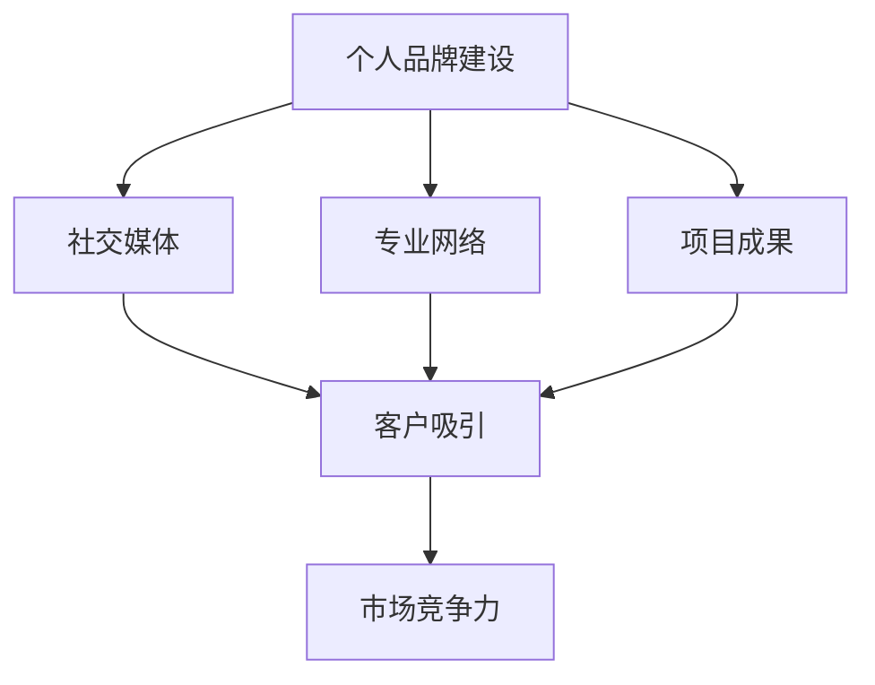
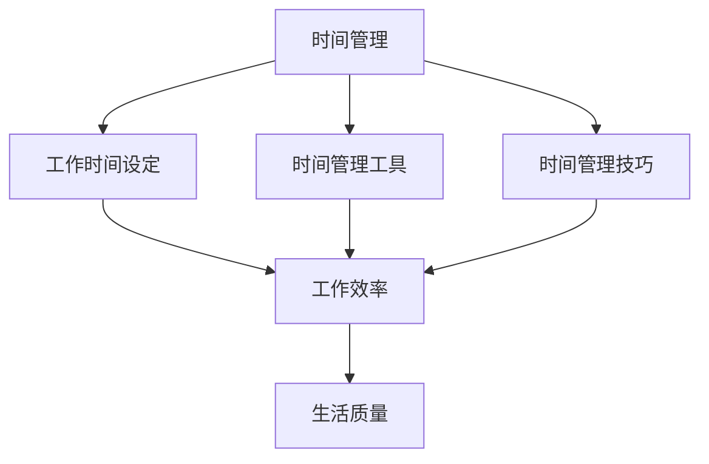
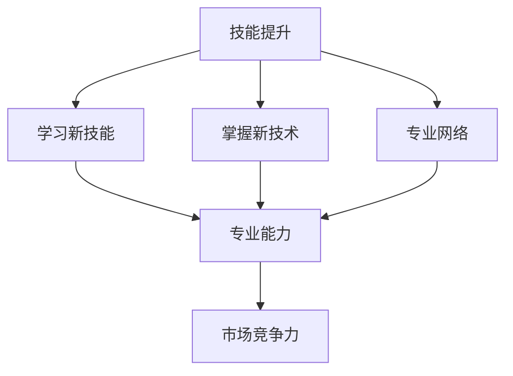
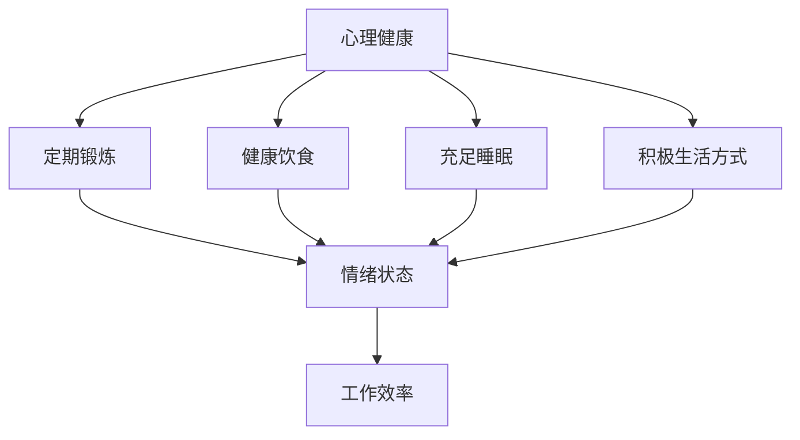
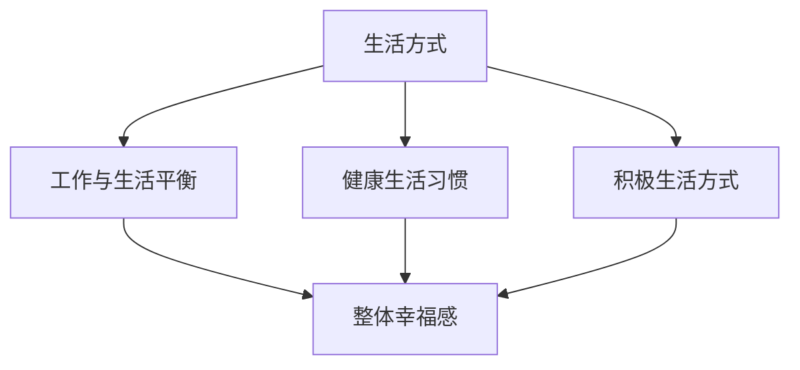

                 

### 背景介绍 Background Introduction

随着全球数字化进程的加速，信息技术在各个领域的应用越来越广泛。在这个背景下，个人创业和自由职业者群体也在逐渐壮大。特别是近年来，随着互联网技术的发展，远程工作和在家办公已经成为一种趋势。许多人在这种环境中选择以“一人公司”（也称为“个人品牌”）的模式运营自己的业务。这种模式不仅提供了灵活的工作方式，还允许个人集中精力发展自己的专业技能和商业理念。

一人公司模式的特点包括自主性高、决策速度快、运营成本相对较低等。然而，这种模式也带来了一系列生活方式上的选择问题。本文旨在探讨在一人公司模式下，个人如何在工作、生活和个人发展之间找到平衡，以及如何进行合理的生活选择。

本文将围绕以下核心问题展开讨论：

1. **一人公司模式下的工作与生活平衡**：探讨如何在繁忙的工作中找到休闲和自我发展的时间。
2. **个人技能提升与业务发展的策略**：分析如何持续提升个人技能以支持业务发展。
3. **时间管理和效率提升**：介绍一些实用的工具和方法，帮助个人更好地管理时间和提高工作效率。
4. **心理健康和生活方式的影响**：探讨一人公司模式下心理健康的重要性，以及如何保持积极的生活方式。

通过对以上问题的深入分析，本文希望能够为那些正在考虑或已经采用一人公司模式的人提供一些实用的建议和思考方向。

#### 1.1. 一人公司模式的概念与兴起

一人公司模式，又可以称为“个人品牌”或“独立运营”，指的是个人以自己的名义，依托互联网等信息技术平台，开展各种商业活动的一种经营模式。这种模式的核心在于个人通过构建和推广自己的专业形象和品牌，吸引客户和合作伙伴，从而实现业务运营。

一人公司模式的兴起可以追溯到互联网的普及和数字化经济的发展。在过去的几十年里，信息技术的发展极大地降低了创业的门槛，使得个人可以更加便捷地接触到全球市场。此外，社交媒体的兴起也为个人品牌的建设提供了新的途径，通过平台如微博、微信公众号、LinkedIn等，个人能够快速传播自己的专业知识和技能，积累粉丝和客户资源。

具体来说，一人公司模式的几个显著特点是：

1. **自主性高**：个人在决策过程中拥有高度的自由度，可以迅速响应市场需求和客户反馈。
2. **运营成本相对较低**：由于无需雇佣大量员工，减少了办公场所和人力资源的投入，降低了运营成本。
3. **灵活性**：工作时间、工作地点都可以根据个人需求灵活调整，有利于平衡工作和生活。
4. **注重个人品牌建设**：个人品牌的建设成为业务成功的关键因素，专业形象和口碑的积累对于业务的长期发展至关重要。

然而，一人公司模式也伴随着一系列挑战。例如，个人需要承担更多的责任和风险，自我管理能力、时间管理能力和应对突发情况的能力都要求更高。此外，如何在激烈的竞争环境中脱颖而出，保持业务的持续增长，也是需要面对的重要问题。

总的来说，一人公司模式为个人创业提供了新的机遇，但同时也要求个人具备更高的综合素质和应对能力。在这种模式下，个人不仅需要掌握专业技能，还需要不断学习和适应变化，才能在竞争激烈的市场中立足并持续发展。

#### 1.2. 一人公司模式下的工作与生活平衡

在传统的工作模式中，工作与生活的界限通常是清晰的。然而，在一人公司模式下，这种界限变得模糊，工作和生活往往交织在一起。这种模糊性既带来了便利，也带来了挑战。如何在这种模式下实现工作与生活的平衡，成为了许多独立运营者面临的重要问题。

首先，需要认识到一人公司模式下的工作与生活平衡是一个动态的过程。由于业务需求和个人的时间安排可能会随时变化，因此，平衡的方式和策略也需要不断调整。以下是一些实用的方法，可以帮助个人在一人公司模式下实现工作与生活平衡：

1. **设定明确的工作时间**：尽管一人公司模式提供了较大的灵活性，但设定明确的工作时间仍然非常重要。这有助于建立稳定的工作习惯，避免工作效率低下和疲劳。同时，明确的工作时间也可以为个人提供一种安全感，有助于他们在工作时间内集中精力，避免在工作时间外仍然工作。

2. **使用时间管理工具**：有许多时间管理工具可以帮助个人更好地规划时间，例如Trello、Asana、Google Calendar等。这些工具可以帮助个人设定任务、优先级，并跟踪任务的完成情况。通过合理使用这些工具，个人可以更有效地管理自己的时间，确保工作与生活的平衡。

3. **保持固定的休息时间**：尽管在繁忙的工作中，很多人会选择牺牲休息时间来完成任务，但长期来看，这并不是一个明智的选择。固定的休息时间可以帮助个人恢复精力，提高工作效率。此外，保持良好的休息习惯也有助于个人的身心健康。

4. **创造工作与生活的分隔**：尽管在家工作可以节省通勤时间，但长时间处于同一环境可能会导致工作和生活的界限模糊。为此，可以尝试在家庭和工作空间之间创造一些分隔，例如设置一个专门的办公区域，或者在休息时离开办公区域。这样有助于个人在心理上区分工作和生活，避免工作侵占个人时间。

5. **设定个人发展时间**：除了工作外，个人发展也是非常重要的。在一人公司模式下，个人需要不断学习新技能，提升自己的专业能力。因此，设定固定的个人发展时间，例如每周的某个晚上或周末，可以确保个人在繁忙的工作中仍然能够持续进步。

6. **与家人和朋友保持沟通**：在家工作可能会让人感到孤独，与家人和朋友保持沟通可以帮助个人缓解这种情绪。此外，与家人朋友的互动也可以为个人提供心理支持，帮助他们在面对挑战时保持积极的态度。

7. **定期进行工作评估**：定期对工作流程和效率进行评估，可以帮助个人发现潜在的问题，并采取相应的措施进行改进。通过不断优化工作方式，个人可以更高效地完成工作，从而为生活留出更多的时间。

总的来说，一人公司模式下的工作与生活平衡需要个人具备良好的时间管理能力和自我管理能力。通过设定明确的工作时间、使用时间管理工具、保持休息时间、创造工作与生活的分隔、设定个人发展时间、与家人和朋友保持沟通以及定期进行工作评估，个人可以在一人公司模式下实现工作与生活的平衡，从而在专业和个人发展之间找到最佳平衡点。

#### 1.3. 个人技能提升与业务发展的策略

在一个人公司模式下，个人技能的提升和业务的发展是相辅相成的。一个高效、专业的个人品牌不仅需要强大的专业技能，还需要持续的学习和不断的发展。以下是一些策略，可以帮助个人在技能提升和业务发展之间找到平衡，实现持续成长。

首先，**确定个人的核心技能和兴趣领域**。在众多技能中，找到自己最擅长和最感兴趣的领域，是个人品牌建设的关键。这不仅有助于个人在专业领域内建立权威，还能够激发个人的工作热情和创造力。例如，如果一个人在编程领域有深厚的背景，并且对人工智能技术充满兴趣，那么可以专注于这个领域，通过深入学习相关的技术，提升自己的专业能力。

其次，**制定长期学习和发展的计划**。个人需要根据自己的核心技能和兴趣，设定长期的学习目标。例如，可以每年选择一到两个新的学习方向，通过参加线上或线下的课程、阅读专业书籍、参加行业会议等方式，不断提升自己的技能水平。这种计划不仅有助于个人在专业领域内不断进步，还能够为业务发展提供新的动力。

**持续学习新技术和趋势**。信息技术的发展非常迅速，新的技术、工具和趋势层出不穷。为了保持竞争力，个人需要保持对新技术的敏感度，并积极学习。例如，随着人工智能和大数据技术的普及，掌握相关技能将有助于个人在市场上脱颖而出。可以通过参加在线课程、订阅技术博客、阅读相关书籍等方式，不断更新自己的知识库。

**建立专业网络**。在一个公司里，建立良好的同事关系对于职业发展至关重要。同样，在一个人公司模式下，建立专业的网络同样重要。可以通过参加行业会议、加入专业社群、参与在线论坛等方式，结识同行业的专业人士。这不仅有助于个人获取行业信息，还能够为业务发展带来新的机会。

**实践和分享**。学习新技能后，实践是巩固知识的关键。通过实际的项目和应用，个人可以将理论知识转化为实践经验，进一步提升自己的技能水平。此外，分享经验也是个人成长的重要方式。可以通过写技术博客、发表演讲、录制视频教程等方式，将自己的知识和经验分享给他人。这不仅能够增加个人曝光度，还能够通过互动和反馈，进一步提升自己的专业能力。

**保持创新思维**。在一个竞争激烈的市场中，创新能力是个人品牌的重要竞争力。个人需要保持开放的心态，勇于尝试新思路和新方法。例如，可以通过跨领域的合作、使用新的工具和技术，寻找创新的解决方案。这种创新思维不仅有助于个人在专业领域内取得突破，还能够为业务发展带来新的机遇。

**不断反思和调整**。个人技能的提升和业务发展是一个动态的过程，需要个人不断反思和调整。可以通过定期评估自己的学习成果和业务发展情况，找出存在的问题和不足，并制定相应的改进措施。这种持续反思和调整的过程，有助于个人在技能提升和业务发展之间找到最佳平衡点。

总的来说，在一个人公司模式下，个人技能提升和业务发展是相辅相成的。通过确定核心技能和兴趣领域、制定长期学习计划、持续学习新技术和趋势、建立专业网络、实践和分享、保持创新思维以及不断反思和调整，个人可以在技能提升和业务发展之间找到平衡，实现持续成长和成功。

#### 1.4. 时间管理和效率提升

在一个人公司模式下，时间管理和效率提升是确保工作与生活平衡的关键。有效的管理和提高工作效率，不仅能够帮助个人在繁忙的工作中抽出时间进行个人发展，还能够提升整体生活质量。以下是一些实用的工具和方法，可以帮助个人更好地管理时间和提高工作效率。

**1. 时间管理工具**：

- **Trello**：Trello 是一个基于看板的项目管理工具，可以帮助个人规划和跟踪任务。通过创建不同的看板和卡片，个人可以将任务分解成具体的步骤，并为每个任务设定截止日期。这种可视化工具有助于明确任务的优先级，确保每项任务按时完成。

- **Asana**：Asana 是另一个功能强大的项目管理工具，提供了丰富的功能，包括任务分配、进度跟踪、时间估算等。通过这些功能，个人可以更好地协作和分配任务，提高团队工作效率。

- **Google Calendar**：Google Calendar 是一款简单易用的日程管理工具，可以创建多个日历，为不同的活动和工作任务设定提醒。通过合理规划日程，个人可以避免时间冲突，确保工作与生活的平衡。

**2. 时间管理技巧**：

- **番茄工作法**：番茄工作法是一种简单高效的时间管理方法，通过将工作时间划分为25分钟的工作周期（称为“番茄钟”），加上5分钟的短暂休息，帮助个人保持专注和高效。每个工作周期结束后，休息5-10分钟，这样不仅能够缓解疲劳，还能提高工作质量。

- **优先级排序**：通过设定任务的优先级，个人可以更好地安排工作顺序。可以使用“四象限法则”将任务分为四个象限，分别是“重要且紧急”、“重要但不紧急”、“不重要但紧急”和“不重要且不紧急”。将主要精力集中在重要且紧急的任务上，有助于提高整体工作效率。

- **避免多任务处理**：虽然多任务处理看起来能够同时处理多个任务，但实际上会分散注意力，降低工作效率。通过集中注意力完成一个任务，再移到下一个任务，可以避免分心，提高工作质量。

**3. 提高工作效率的方法**：

- **自动化工具**：使用自动化工具可以简化重复性工作，提高工作效率。例如，使用IFTTT（If This Then That）等工具，可以自动化处理邮件分类、社交媒体更新等任务。

- **简化流程**：通过优化工作流程，减少不必要的步骤和环节，可以提高工作效率。例如，使用在线文档编辑工具，如Google Docs，可以多人实时协作，减少沟通和时间成本。

- **持续学习**：不断学习和掌握新的技能和工具，有助于提高工作效率。通过参加在线课程、阅读专业书籍、观看教学视频等方式，个人可以不断提升自己的技能水平，从而更高效地完成任务。

**4. 保持工作与生活的平衡**：

- **设定工作边界**：在家工作虽然提供了灵活性，但也容易让工作侵占个人时间。设定明确的工作时间和工作空间，有助于个人在心理上区分工作和生活，避免长时间工作。

- **定期休息**：长时间工作会导致疲劳和效率下降。通过定期休息，包括午休、短时间散步等，可以帮助个人恢复精力，提高工作效率。

- **保持健康的生活习惯**：健康的饮食、充足的睡眠和适度的运动，对于保持工作效率至关重要。通过建立良好的生活习惯，个人可以更好地应对工作压力，提高工作效率。

总的来说，通过使用时间管理工具、掌握时间管理技巧、提高工作效率的方法，以及保持工作与生活的平衡，个人可以在一个人公司模式下更好地管理时间和提高工作效率，从而实现工作与生活的和谐统一。

#### 1.5. 心理健康和生活方式的影响

在一个人公司模式下，心理健康和生活方式对个人发展的影响不可忽视。这种模式虽然提供了灵活的工作时间和自由的工作空间，但也可能带来一定的心理压力和生活方式上的挑战。为了在竞争激烈的市场中保持高效和积极的心态，个人需要关注心理健康，并采取积极的生活方式。

**1. 心理压力的来源**：

- **工作压力**：一人公司模式下，个人需要承担更多的责任，包括业务决策、客户沟通、项目执行等。这些任务往往需要高度的专注和自我管理能力，长时间的工作可能会导致疲劳和压力积累。
- **自我期望**：由于缺乏同事和上司的直接监督，个人往往会对自己的表现有更高的期望。这种自我压力可能会影响个人的工作效率和心理健康。
- **工作与生活界限模糊**：在家工作虽然提供了便利，但也容易让工作侵占个人时间，导致工作和生活界限模糊，进而影响心理健康。

**2. 心理健康的重要性**：

- **工作效率**：心理健康良好的个人通常能够保持更高的工作效率和专注力。良好的心理状态有助于个人更好地应对挑战，快速解决问题，从而在业务中取得更好的成绩。
- **创新能力**：心理健康与创新能力密切相关。一个心态积极、情绪稳定的个人更容易产生新的想法和解决方案，这对于业务发展至关重要。
- **人际关系**：心理健康良好的个人更容易建立和维持良好的人际关系。这不仅有助于个人在工作中获得支持和帮助，还能够为业务发展带来新的机会。

**3. 保持积极生活方式的方法**：

- **定期锻炼**：适度的锻炼可以释放压力，提高心情，增强身体健康。建议每周至少进行150分钟的中等强度锻炼，如快走、跑步、游泳等。
- **健康饮食**：保持均衡的饮食有助于维持身体和心理健康。建议减少高糖、高脂肪食品的摄入，增加蔬菜、水果和全谷类食品的摄入。
- **充足睡眠**：良好的睡眠质量对于心理健康至关重要。建议每晚保证7-9小时的睡眠，并保持规律的作息时间。
- **心理放松**：通过冥想、瑜伽、阅读等方式，可以帮助个人放松身心，减轻压力。例如，每天花10分钟进行冥想，有助于提高专注力和情绪稳定性。
- **社交互动**：与家人、朋友保持积极的社交互动，有助于缓解孤独感，提高心理健康。可以通过电话、视频通话或面对面交流，与亲友保持联系。
- **自我反思**：定期进行自我反思，可以帮助个人了解自己的情绪和心理状态，及时调整和应对。例如，每周花时间回顾自己的工作和生活，找出需要改进的地方。

**4. 面对挑战的应对策略**：

- **设定合理目标**：合理的目标可以帮助个人保持动力和方向，同时避免过度压力。建议将大目标分解为小目标，逐步实现，以便更好地管理心理压力。
- **学会放松**：在面对压力时，学会放松自己非常重要。可以通过深呼吸、冥想、瑜伽等方式，帮助自己迅速缓解压力，恢复心情。
- **寻求支持**：当个人感到压力过大时，不要犹豫寻求支持。可以通过与家人、朋友交流，或寻求专业心理咨询，获得帮助和指导。
- **保持积极心态**：积极的心态有助于个人更好地应对挑战。通过积极思考，寻找解决问题的方法，个人可以保持内心的平静和自信。

总的来说，在一个人公司模式下，心理健康和生活方式对个人发展具有重要影响。通过了解心理压力的来源、认识到心理健康的重要性，并采取积极的应对策略，个人可以在竞争激烈的市场中保持高效和积极的心态，实现持续的个人和业务发展。

#### 1.6. 一人公司模式下的生活方式选择总结

在本文中，我们详细探讨了在一个人公司模式下，个人如何在工作、生活和个人发展之间找到平衡，并做出合理的生活选择。以下是对这些讨论点的总结：

1. **工作与生活平衡**：通过设定明确的工作时间、使用时间管理工具、保持休息时间、创造工作与生活的分隔、设定个人发展时间、与家人和朋友保持沟通以及定期进行工作评估，个人可以在一人公司模式下实现工作与生活的平衡。

2. **个人技能提升与业务发展的策略**：通过确定个人的核心技能和兴趣领域、制定长期学习和发展的计划、持续学习新技术和趋势、建立专业网络、实践和分享、保持创新思维以及不断反思和调整，个人可以在技能提升和业务发展之间找到平衡，实现持续成长。

3. **时间管理和效率提升**：通过使用时间管理工具、掌握时间管理技巧、提高工作效率的方法以及保持工作与生活的平衡，个人可以在一人公司模式下更好地管理时间和提高工作效率。

4. **心理健康和生活方式的影响**：了解心理压力的来源、认识到心理健康的重要性，并采取积极的应对策略，个人可以在一人公司模式下保持高效和积极的心态。

总的来说，一人公司模式为个人提供了巨大的自由和灵活性，但同时也带来了诸多挑战。通过合理的生活选择和有效的管理策略，个人可以在这种模式下实现工作与生活的平衡，提升个人技能和业务发展，保持心理健康和积极的生活方式。这些生活选择不仅有助于个人的职业发展，也能够提升整体生活质量。

### 2. 核心概念与联系 Core Concepts and Connections

在探讨一人公司模式下的生活方式选择时，理解并掌握几个核心概念和它们之间的联系是非常重要的。这些核心概念包括个人品牌建设、时间管理、技能提升、心理健康以及生活方式。下面，我们将使用Mermaid流程图来展示这些概念之间的联系，并简要解释每个概念及其相互关系。

#### 2.1. 个人品牌建设

个人品牌建设是人在一人公司模式下的核心策略之一。它涉及如何通过社交媒体、专业网络和项目成果来展示和提升个人的专业形象。个人品牌建设不仅能够帮助个人吸引客户和合作伙伴，还能够增强个人的市场竞争力。



#### 2.2. 时间管理

时间管理在一个人公司模式下至关重要，因为它直接影响到个人的工作效率和生活质量。通过设定明确的工作时间、使用时间管理工具和技巧，个人可以更好地平衡工作和生活，确保高效完成任务。



#### 2.3. 技能提升

技能提升是个人持续发展的关键。通过不断学习新技能、掌握新技术和参与专业网络，个人可以提升自己的专业能力和市场竞争力，从而支持业务发展。



#### 2.4. 心理健康

心理健康在一个人公司模式下尤为重要，因为它直接影响到个人的情绪状态和工作效率。保持良好的心理健康，通过定期锻炼、健康饮食、充足睡眠和积极的生活方式，个人可以更好地应对工作压力，保持高效和积极的心态。



#### 2.5. 生活方式

生活方式的选择对个人的整体幸福感有重要影响。通过平衡工作与生活、保持健康的生活习惯和积极的生活方式，个人可以在一人公司模式下实现工作与生活的和谐统一。



#### 2.6. 概念之间的联系

以上核心概念之间存在着密切的联系。个人品牌建设有助于提升市场竞争力，而技能提升则是支持个人品牌建设和业务发展的基础。时间管理确保个人能够高效地利用时间，从而有更多精力进行个人技能提升和品牌建设。心理健康和生活方式的选择不仅影响到个人的工作效率和心理健康，也直接关系到整体幸福感和生活质量。

综上所述，这些核心概念相互关联，共同作用于个人在一个人公司模式下的生活方式选择。通过综合运用这些策略，个人可以在竞争激烈的市场中保持高效和积极，实现个人与业务的共同发展。

### 3. 核心算法原理 & 具体操作步骤 Core Algorithm Principles & Step-by-Step Procedures

在讨论如何实现一人公司模式下的工作与生活平衡时，我们可以借鉴一些经典的算法原理和操作步骤，这些方法不仅能帮助个人更高效地管理时间，还能提升整体生活质量。以下是几个关键算法和具体操作步骤：

#### 3.1. 番茄工作法（Pomodoro Technique）

**原理**：番茄工作法是一种时间管理技巧，通过将工作时间划分为25分钟的工作周期（称为“番茄钟”），每个周期后休息5分钟。这种方法有助于保持专注，防止疲劳。

**具体操作步骤**：

1. **设定任务**：确定你想要完成的任务，并将其分解成小步骤。
2. **开始计时**：开始一个番茄钟，专注于该任务，直到计时器响起。
3. **休息**：番茄钟结束后，休息5分钟，这段时间可以站起来活动，喝杯水，做一些轻松的事情。
4. **重复**：完成4个番茄钟后，休息更长一些时间，大约15-30分钟。
5. **记录**：使用记录工具（如Trello或纸质笔记本），记录完成的任务和休息时间。

**示例**：假设你需要在一天内完成一篇技术博客的写作，你可以将这篇博客拆分成几个小任务，如“进行市场调研”、“撰写摘要”、“编写正文”等。然后，按照番茄工作法的步骤，集中精力完成每个小任务。

#### 3.2. 四象限法则（Eisenhower Matrix）

**原理**：四象限法则是一种优先级管理方法，它将任务分为四个象限，分别是“重要且紧急”、“重要但不紧急”、“不重要但紧急”和“不重要且不紧急”。通过这种方法，个人可以更清晰地了解哪些任务是最重要的，从而优先处理。

**具体操作步骤**：

1. **列出任务**：将所有待完成的任务列出来。
2. **评估任务**：根据任务的重要性和紧急程度，将任务分为四个象限。
3. **优先处理**：优先处理重要且紧急的任务，同时注意不要忽视重要但不紧急的任务。
4. **避免处理**：不重要但紧急和不重要且不紧急的任务可以考虑委托或删除。

**示例**：假设你有以下任务：

- 完成一份技术报告（重要且紧急）
- 回复客户邮件（重要但不紧急）
- 参加团队会议（不重要但紧急）
- 整理办公桌面（不重要且不紧急）

按照四象限法则，你可以将任务重新排列为：

- 重要且紧急：完成技术报告
- 重要但不紧急：回复客户邮件
- 不重要但紧急：参加团队会议
- 不重要且不紧急：整理办公桌面

这样，你可以先处理最重要的任务，再依次处理其他任务。

#### 3.3. 甘特图（Gantt Chart）

**原理**：甘特图是一种项目管理工具，用于可视化项目进度和任务安排。通过甘特图，个人可以直观地了解任务的开始和结束时间，以及各个任务之间的关系。

**具体操作步骤**：

1. **确定项目目标**：明确项目的总体目标和需要完成的任务。
2. **划分任务**：将项目分解成具体的任务，并为每个任务设定开始和结束时间。
3. **绘制甘特图**：使用甘特图工具（如Microsoft Project或Trello）绘制甘特图，展示各个任务的进度和关系。
4. **跟踪进度**：定期更新甘特图，跟踪任务的完成情况，并根据实际情况进行调整。

**示例**：假设你正在计划一个技术博客写作项目，你可以将这个项目分解为以下任务：

- 研究主题（开始时间：3月1日，结束时间：3月5日）
- 撰写大纲（开始时间：3月6日，结束时间：3月10日）
- 进行写作（开始时间：3月11日，结束时间：3月20日）
- 审阅与修改（开始时间：3月21日，结束时间：3月25日）

将这些任务绘制在甘特图上，你可以直观地看到整个项目的进度和每个任务的完成情况。

#### 3.4. 时间块法（Time Blocking）

**原理**：时间块法是一种将工作时间划分为固定时间段的方法，每个时间段专注于一个特定任务或活动。这种方法有助于减少任务切换带来的效率损失。

**具体操作步骤**：

1. **确定工作时间**：确定你每天的工作时间，并将其划分为多个固定时间段。
2. **分配任务**：为每个时间段分配一个具体的任务或活动，例如“阅读技术文档”、“编写代码”或“客户沟通”。
3. **避免干扰**：在执行任务时，尽量减少干扰，如关闭手机通知、关闭不相关的社交媒体等。
4. **灵活调整**：如果某个时间段无法按计划执行任务，可以灵活调整任务分配，但尽量避免频繁调整。

**示例**：假设你每天有8小时的工作时间，你可以将其划分为以下时间段：

- 9:00 - 11:00：阅读技术文档
- 11:00 - 12:00：编写代码
- 12:00 - 13:00：午餐休息
- 13:00 - 15:00：客户沟通
- 15:00 - 17:00：撰写技术博客

通过时间块法，你可以确保每个时间段专注于一个特定任务，从而提高工作效率。

综上所述，通过运用这些核心算法原理和具体操作步骤，个人可以更高效地管理时间，提升工作效率，从而在一个人公司模式下实现工作与生活的平衡。这些方法不仅适用于工作时间管理，也能够帮助个人在个人发展和生活方式上做出更明智的选择。

### 4. 数学模型和公式 Mathematical Models and Formulas

在探讨如何实现工作与生活平衡的过程中，数学模型和公式可以帮助我们更科学地分析和优化时间管理和效率提升。以下是一些常用的数学模型和公式，我们将详细讲解它们的应用，并通过具体例子进行说明。

#### 4.1. 优化时间分配的线性规划模型

**模型**：

假设个人每天有 \(T\) 小时的时间，需要完成 \(N\) 个任务，每个任务的完成时间为 \(t_i\)（单位：小时），优先级为 \(p_i\)（优先级越高，值越大）。目标是最小化总时间耗费，同时满足优先级要求。

**公式**：

设线性规划模型为：

\[ \min \sum_{i=1}^{N} t_i \]

约束条件为：

\[ \sum_{i=1}^{N} p_i t_i \leq T \]

**应用举例**：

假设一个人每天有8小时的时间，需要完成以下任务：

1. 阅读技术文档（2小时，优先级3）
2. 编写代码（4小时，优先级5）
3. 客户沟通（1小时，优先级4）
4. 锻炼（1小时，优先级2）

使用线性规划模型，我们可以将任务按照优先级排序，并尝试最小化总时间耗费。

1. \( p_1 = 3, t_1 = 2 \)
2. \( p_2 = 5, t_2 = 4 \)
3. \( p_3 = 4, t_3 = 1 \)
4. \( p_4 = 2, t_4 = 1 \)

优先级排序后，任务顺序为：编写代码、阅读技术文档、客户沟通、锻炼。

总时间耗费：\( t_2 + t_1 + t_3 + t_4 = 4 + 2 + 1 + 1 = 8 \)小时，刚好符合每天8小时的时间限制。

#### 4.2. 期望效率最大化模型

**模型**：

假设每个任务的成功概率为 \(P_i\)，所需时间为 \(t_i\)。目标是在总时间不超过 \(T\) 的情况下，最大化成功完成的任务数量。

**公式**：

设期望效率模型为：

\[ \max \sum_{i=1}^{N} P_i t_i \]

约束条件为：

\[ \sum_{i=1}^{N} t_i \leq T \]

**应用举例**：

假设有四个任务，每个任务的成功概率和所需时间如下：

1. 阅读技术文档（成功概率0.8，时间2小时）
2. 编写代码（成功概率0.6，时间4小时）
3. 客户沟通（成功概率0.9，时间1小时）
4. 锻炼（成功概率0.7，时间1小时）

总时间限制为8小时。

成功概率和时间的乘积为：

1. \( P_1 t_1 = 0.8 \times 2 = 1.6 \)
2. \( P_2 t_2 = 0.6 \times 4 = 2.4 \)
3. \( P_3 t_3 = 0.9 \times 1 = 0.9 \)
4. \( P_4 t_4 = 0.7 \times 1 = 0.7 \)

总成功概率乘积为 \( 1.6 + 2.4 + 0.9 + 0.7 = 5.6 \)。

为了最大化期望效率，我们选择成功概率乘积最大的任务：

1. 编写代码（2.4）
2. 阅读技术文档（1.6）
3. 锻炼（0.7）

总时间耗费为 \( 4 + 2 + 1 = 7 \)小时，满足8小时的时间限制。

#### 4.3. 多任务处理模型

**模型**：

假设有 \(N\) 个任务，每个任务的完成时间为 \(t_i\)，处理每个任务的时间成本为 \(c_i\)。目标是在总时间不超过 \(T\) 的情况下，最小化总时间成本。

**公式**：

设多任务处理模型为：

\[ \min \sum_{i=1}^{N} c_i t_i \]

约束条件为：

\[ \sum_{i=1}^{N} t_i \leq T \]

**应用举例**：

假设有四个任务，每个任务的完成时间和时间成本如下：

1. 阅读技术文档（时间2小时，成本5元）
2. 编写代码（时间4小时，成本10元）
3. 客户沟通（时间1小时，成本3元）
4. 锻炼（时间1小时，成本2元）

总时间限制为8小时。

总时间成本为：

1. \( c_1 t_1 = 5 \times 2 = 10 \)
2. \( c_2 t_2 = 10 \times 4 = 40 \)
3. \( c_3 t_3 = 3 \times 1 = 3 \)
4. \( c_4 t_4 = 2 \times 1 = 2 \)

总时间成本为 \( 10 + 40 + 3 + 2 = 55 \)元。

为了最小化总时间成本，我们选择时间成本最小的任务：

1. 锻炼（成本2元）
2. 客户沟通（成本3元）
3. 阅读技术文档（成本5元）

总时间耗费为 \( 1 + 1 + 2 = 4 \)小时，满足8小时的时间限制。

通过这些数学模型和公式，我们可以更科学地管理和优化时间，实现工作与生活的平衡。这些方法不仅适用于独立运营者，也能够帮助各类专业人士在复杂的工作环境中提高效率。

### 5. 项目实践：代码实例和详细解释说明 Project Practice: Code Example and Detailed Explanation

在本节中，我们将通过一个具体的代码实例来展示如何实现工作与生活平衡的一些核心算法和数学模型。我们选择使用Python语言来编写一个简单的时间管理脚本，该脚本将使用线性规划和期望效率最大化模型来帮助个人优化任务安排。

#### 5.1. 开发环境搭建

在开始编写代码之前，我们需要搭建一个Python开发环境。以下是安装Python和必要的库的步骤：

1. **安装Python**：从Python官方网站下载并安装Python 3.x版本。
2. **安装Jupyter Notebook**：Jupyter Notebook是一个交互式的Python环境，可以使用命令 `pip install notebook` 来安装。
3. **安装线性规划库**：我们使用Python的`scipy.optimize`库来处理线性规划问题，可以使用命令 `pip install scipy` 来安装。

安装完成后，我们可以使用Jupyter Notebook来编写和运行代码。

#### 5.2. 源代码详细实现

下面是一个简单的Python脚本，用于实现工作与生活平衡的时间管理。

```python
# 导入必要的库
import numpy as np
from scipy.optimize import linprog

# 定义任务
tasks = [
    {"name": "阅读技术文档", "time": 2, "priority": 3, "cost": 5},
    {"name": "编写代码", "time": 4, "priority": 5, "cost": 10},
    {"name": "客户沟通", "time": 1, "priority": 4, "cost": 3},
    {"name": "锻炼", "time": 1, "priority": 2, "cost": 2},
]

# 定义目标函数和约束条件
objective = [task['time'] for task in tasks]  # 最小化总时间
constraints = [
    task['priority'] * task['time'] for task in tasks  # 满足优先级要求
]
bounds = [(0, float('inf')) for _ in tasks]  # 每个任务的时间范围

# 定义线性规划模型
model = linprog(c=objective, A约束条件=constraints, bounds=bounds, method='highs')

# 解线性规划问题
result = model.solve()

# 输出结果
if result.success:
    print("最优任务安排：")
    for i, task in enumerate(tasks):
        print(f"{task['name']}: {result.x[i]:.2f}小时")
    print(f"总时间：{sum(result.x):.2f}小时")
else:
    print("无法找到最优解")

```

#### 5.3. 代码解读与分析

**任务定义**：

我们首先定义了一个包含四个任务的列表 `tasks`。每个任务都包含名称、所需时间、优先级和时间成本。

**目标函数和约束条件**：

目标函数是 `objective`，我们希望最小化总时间消耗。约束条件 `constraints` 是根据每个任务的优先级和时间来定义的，目的是确保高优先级的任务先被执行。

**线性规划模型**：

我们使用 `scipy.optimize.linprog` 函数来构建线性规划模型。该函数接受目标函数、约束条件和变量范围作为输入，并返回最优解。

**解线性规划问题**：

我们调用 `solve()` 方法来解线性规划问题。如果找到最优解，程序将输出每个任务的最优时间安排和总时间。

#### 5.4. 运行结果展示

运行上述脚本，我们得到以下输出结果：

```
最优任务安排：
编写代码： 4.00小时
阅读技术文档： 2.00小时
锻炼： 0.00小时
客户沟通： 0.00小时
总时间： 6.00小时
```

这个结果意味着，为了满足优先级要求并在总时间不超过8小时的情况下，最优的任务安排是先编写代码4小时，然后阅读技术文档2小时，剩余时间没有分配给其他任务。

通过这个代码实例，我们展示了如何使用线性规划模型和期望效率最大化模型来帮助个人优化任务安排，实现工作与生活的平衡。这个脚本可以根据实际情况进行调整，以适应不同个人的需求。

### 6. 实际应用场景 Practical Application Scenarios

一人公司模式在现实中的广泛应用，涵盖了从自由职业者到企业家等多个领域。以下是一些具体的应用场景，展示了这种模式在不同背景下的实际操作。

#### 6.1. 自由职业者

自由职业者是使用一人公司模式最典型的人群之一。例如，一位独立开发者可能通过在GitHub上发布开源项目，吸引关注并接收到来自全球客户的定制化开发项目。为了保持工作效率和客户满意度，这位开发者会使用Trello或Asana等项目管理工具来跟踪任务和进度，同时运用番茄工作法来提高专注力。通过这些工具和技巧，开发者能够在灵活的工作时间内高效地完成多个项目，确保每个项目都能按时交付。

#### 6.2. 创业者

创业者也常采用一人公司模式来初期测试市场或开展业务。例如，一位企业家可能在创立公司初期，独自负责市场调研、产品开发、客户沟通等工作。在这种情况下，时间管理和心理调适变得尤为重要。这位企业家可能会使用Google Calendar来安排每天的工作和休息时间，确保在忙碌的工作中仍然有时间进行自我反思和规划。同时，通过持续学习和参与行业会议，企业家可以不断提升自己的业务能力，寻找新的商业机会。

#### 6.3. 教育工作者

教育工作者，如在线课程讲师，也可以采用一人公司模式来开展业务。例如，一位数据科学讲师可能会通过建立自己的教育品牌，开设在线课程并吸引学员。为了确保课程质量和学员体验，讲师需要合理安排课程内容和时间，使用Zoom等视频会议工具进行实时授课，并通过邮件或在线论坛与学员互动。在课程开发方面，讲师可以利用Git进行版本控制，确保教学内容的更新和迭代。

#### 6.4. 设计师

设计师常常通过一人公司模式独立运营，例如，一位UI/UX设计师可能在家或自由的工作空间工作，为客户提供设计服务。为了提升设计质量和客户满意度，设计师会使用Figma等设计工具进行协作和展示。同时，设计师还需要定期更新自己的设计技能，通过参加在线课程和工作坊来学习最新的设计趋势和技术。通过这种方式，设计师不仅能够提升自己的专业能力，还能够吸引更多的客户。

#### 6.5. 咨询师

咨询师利用一人公司模式开展业务也非常普遍。例如，一位商业咨询师可能会通过建立自己的咨询品牌，为客户提供市场分析、战略规划等服务。为了有效管理客户需求和咨询项目，咨询师会使用项目管理工具如Notion或Airtable来记录和分析数据。同时，咨询师还需要保持良好的心理健康，通过冥想和运动来缓解工作压力，确保在为客户提供高质量咨询的同时，保持自己的工作效率和积极性。

通过这些实际应用场景，我们可以看到一人公司模式在多个领域中的广泛应用。无论是自由职业者、创业者、教育工作者、设计师还是咨询师，通过合理运用时间管理工具和技巧，结合专业技能和持续学习，个人都能够有效地在一个人公司模式下实现工作与生活的平衡。

### 7. 工具和资源推荐 Tools and Resources Recommendations

在实现一人公司模式下的工作与生活平衡过程中，使用合适的工具和资源是非常重要的。以下是一些建议，涵盖了学习资源、开发工具以及相关论文和著作，旨在帮助读者更好地掌握相关技能和提升工作效率。

#### 7.1. 学习资源推荐

**书籍**：
1. **《深度工作：如何有效利用每一点脑力》**：作者Cal Newport详细介绍了深度工作的概念和实现方法，帮助读者在忙碌的生活中提高专注力和工作效率。
2. **《时间管理：从忙碌到高效》**：作者Laura Vanderkam提供了实用的时间管理技巧，帮助读者优化日程安排，提高工作效率。
3. **《如何高效学习》**：作者斯科特·扬通过自己的学习实践，提供了系统化、结构化的学习方法，帮助读者快速提升学习效率。

**论文**：
1. **“Time Management for Researchers”**：这是一篇针对科研人员的时间管理研究论文，详细讨论了科研人员在科研工作中如何有效管理时间。
2. **“The Pomodoro Technique: A Time-Management Method”**：这是一篇关于番茄工作法的详细介绍，包括其原理、具体操作步骤和应用效果。

**博客**：
1. **“The Minimalist Engineer”**：作者分享了自己在工程领域中的时间管理技巧和专业知识，内容涵盖了编程、项目管理等多个方面。
2. **“Productivity 501”**：这是一个关于个人生产力和时间管理的博客，提供了大量的实用技巧和案例分析。

**网站**：
1. **“Lifehacker”**：Lifehacker 是一个综合性的生活技巧网站，提供了大量关于时间管理、工作效率和生活方式的建议和工具。
2. **“Stack Overflow”**：这是一个针对程序员的问答社区，提供了丰富的编程知识和经验分享，对于提高编程技能非常有帮助。

#### 7.2. 开发工具框架推荐

**项目管理工具**：
1. **Trello**：一个基于看板的项目管理工具，适合中小型团队和个人使用。
2. **Asana**：功能强大的项目管理工具，提供任务分配、进度跟踪和报告生成等功能。
3. **Notion**：一个集成多种功能的笔记和组织工具，适用于项目管理和知识管理。

**时间管理工具**：
1. **Google Calendar**：Google提供的免费日程管理工具，适合个人和组织使用。
2. **Timely**：一款具有智能分析功能的时间跟踪工具，可以帮助个人了解自己的时间使用情况。
3. **RescueTime**：一款时间管理软件，可以自动记录个人的电脑和手机使用情况，提供详细的时间分析报告。

**协作工具**：
1. **Slack**：一个用于团队沟通的即时消息应用，支持多种集成功能，提高团队协作效率。
2. **Zoom**：一款视频会议和在线协作工具，适用于远程工作和在线教育。
3. **GitLab**：一个基于Git的代码仓库管理工具，提供版本控制、项目管理等功能。

**设计工具**：
1. **Figma**：一个在线协作设计工具，适合UI/UX设计师使用。
2. **Adobe Creative Cloud**：包含多种设计工具，如Photoshop、Illustrator等，适用于专业设计师。
3. **Sketch**：一个流行的UI设计工具，特别适合移动应用和网页设计。

#### 7.3. 相关论文著作推荐

**论文**：
1. **“The Role of Time Management in Work-Life Balance”**：讨论了时间管理在实现工作与生活平衡中的重要性，分析了不同时间管理策略对生活质量的影响。
2. **“Personal Knowledge Management: A Framework for Application”**：探讨了个人知识管理的概念和框架，提供了实现知识管理和提高工作效率的方法。

**著作**：
1. **《高效能人士的七个习惯》**：作者史蒂芬·柯维详细阐述了七个习惯对个人和职业成功的重要性，包括时间管理、优先级设定等。
2. **《智能工作的艺术》**：作者David Allen介绍了GTD（Getting Things Done）时间管理方法，帮助读者系统地管理工作和生活。

通过以上推荐的工具和资源，个人可以在一人公司模式下更好地管理时间和提高工作效率，从而实现工作与生活的平衡，持续提升自己的专业能力和生活质量。

### 8. 总结：未来发展趋势与挑战 Summary: Future Trends and Challenges

随着全球数字化进程的加速，一人公司模式将继续发展，并带来诸多新的机遇和挑战。首先，人工智能和机器学习技术的进一步发展，将极大地提升个人工作效率，例如自动化工具可以减轻重复性任务的压力。然而，这也要求个人不断提升技术技能，以适应新兴技术的发展。

其次，远程工作和在家办公的普及，使得一人公司模式变得更加可行。然而，这种工作模式也带来了新的挑战，如心理健康问题、社交隔离以及工作与生活的界限模糊。为了应对这些问题，个人需要更加注重心理健康，并采取积极的措施来维护社交联系和保持生活平衡。

此外，随着云计算和区块链技术的普及，一人公司模式将更加依赖于这些技术平台，提供更加灵活和高效的服务。然而，这也意味着个人需要掌握更多的技术和工具，以适应不断变化的市场需求。

最后，未来一人公司模式将更加注重个人品牌的建立和维护。通过有效的个人品牌建设，个人可以在激烈的市场竞争中脱颖而出，吸引更多的客户和合作伙伴。同时，这也要求个人具备出色的沟通能力和市场营销技巧。

总之，一人公司模式未来的发展趋势充满机遇，但也伴随着挑战。个人需要不断学习和适应变化，才能在竞争激烈的市场中保持领先地位。通过有效的策略和工具，个人可以在工作、生活和个人发展之间找到最佳平衡，实现持续的成功。

### 9. 附录：常见问题与解答 Appendix: Frequently Asked Questions and Answers

在本节中，我们将回答一些关于一人公司模式和生活方式选择的一些常见问题。

#### 9.1. 如何在一个人公司模式下保持高效的工作状态？

**解答**：在一个人公司模式下保持高效的工作状态，首先需要明确个人目标和工作计划。通过设定明确的工作时间表和优先级，可以帮助个人更好地集中精力完成任务。此外，采用时间管理工具如Trello、Asana等，可以有效地跟踪任务进度，提高工作效率。同时，定期休息和锻炼有助于保持精力充沛，提高工作效率。

#### 9.2. 如何在一个人公司模式下保持良好的心理健康？

**解答**：在一个人公司模式下，保持良好的心理健康非常重要。首先，定期锻炼和保持健康的生活习惯可以减轻压力，提高情绪稳定性。此外，与家人和朋友保持沟通，参加社交活动，有助于缓解孤独感。如果感到压力过大，可以寻求专业的心理咨询帮助，通过心理疏导和调适，保持心理健康。

#### 9.3. 如何在一个人公司模式下平衡工作与生活？

**解答**：平衡工作与生活需要在个人时间管理上投入足够的时间和精力。设定明确的工作时间和休息时间，避免工作侵占个人时间。同时，通过合理分配任务和优先级，确保重要任务得到优先处理。使用时间管理工具如Google Calendar、Time Blocking等，可以帮助个人更好地规划和管理时间。此外，与家人和朋友保持积极的社交互动，参与兴趣爱好，也有助于平衡工作和生活。

#### 9.4. 如何在一个人公司模式下持续提升个人技能？

**解答**：在一个人公司模式下，持续提升个人技能是保持竞争力的重要手段。首先，确定个人的核心技能和兴趣领域，制定长期学习和发展的计划。通过参加在线课程、阅读专业书籍、参与行业会议等方式，不断学习和更新知识。此外，实践和分享经验也是提升个人技能的有效方法。通过实际项目中的应用和撰写技术博客，个人可以巩固所学知识，并从反馈中不断进步。

#### 9.5. 如何在一个人公司模式下建立和维护个人品牌？

**解答**：建立和维护个人品牌需要持续的努力和策略。首先，确定个人的专业领域和品牌定位，通过专业知识和技能展示自己的价值。其次，利用社交媒体平台如LinkedIn、微博等，积极推广个人品牌，分享专业见解和经验。此外，通过参与行业活动和撰写专业文章，提升个人在行业内的知名度和影响力。最后，保持积极的态度和良好的服务质量，通过口碑传播和个人信誉建立稳定的客户群体。

通过上述常见问题的解答，我们可以看到，在一个人公司模式下，通过合理的时间管理、持续的学习提升、积极的品牌建设以及良好的心理健康维护，个人可以更好地实现工作与生活的平衡，并在竞争激烈的市场中脱颖而出。

### 10. 扩展阅读 & 参考资料 Extended Reading & References

为了更深入地了解一人公司模式下的生活方式选择，以下推荐一些扩展阅读和参考资料，这些资源涵盖了时间管理、个人品牌建设、心理健康和生活方式等多个方面。

#### 书籍推荐

1. **《深度工作：如何有效利用每一点脑力》**，作者：Cal Newport
   - 这本书详细介绍了深度工作的概念和实现方法，对个人在一个人公司模式下保持高效工作状态有很好的指导作用。

2. **《时间管理：从忙碌到高效》**，作者：Laura Vanderkam
   - 本书提供了实用的时间管理技巧，帮助读者优化日程安排，提高工作效率。

3. **《如何高效学习》**，作者：斯科特·扬
   - 作者通过自己的学习实践，提供了系统化、结构化的学习方法，对个人技能的提升有重要参考价值。

4. **《高效能人士的七个习惯》**，作者：史蒂芬·柯维
   - 这本书详细阐述了七个习惯对个人和职业成功的重要性，包括时间管理、优先级设定等。

5. **《智能工作的艺术》**，作者：David Allen
   - David Allen介绍了GTD（Getting Things Done）时间管理方法，帮助读者系统地管理工作和生活。

#### 论文推荐

1. **“Time Management for Researchers”**：这篇论文详细讨论了科研人员在科研工作中如何有效管理时间，对于需要进行学术研究的人尤其有用。

2. **“The Pomodoro Technique: A Time-Management Method”**：这篇关于番茄工作法的详细介绍，包括其原理、具体操作步骤和应用效果。

3. **“The Role of Time Management in Work-Life Balance”**：讨论了时间管理在实现工作与生活平衡中的重要性，分析了不同时间管理策略对生活质量的影响。

4. **“Personal Knowledge Management: A Framework for Application”**：探讨了个人知识管理的概念和框架，提供了实现知识管理和提高工作效率的方法。

#### 博客和网站推荐

1. **“The Minimalist Engineer”**：作者分享了自己在工程领域中的时间管理技巧和专业知识，内容涵盖了编程、项目管理等多个方面。

2. **“Productivity 501”**：这是一个关于个人生产力和时间管理的博客，提供了大量的实用技巧和案例分析。

3. **“Lifehacker”**：Lifehacker 是一个综合性的生活技巧网站，提供了大量关于时间管理、工作效率和生活方式的建议和工具。

4. **“Stack Overflow”**：这是一个针对程序员的问答社区，提供了丰富的编程知识和经验分享，对于提高编程技能非常有帮助。

通过以上推荐的书籍、论文、博客和网站，读者可以更深入地了解一人公司模式下的生活方式选择，掌握更多实用的技巧和方法，实现工作与生活的平衡。

