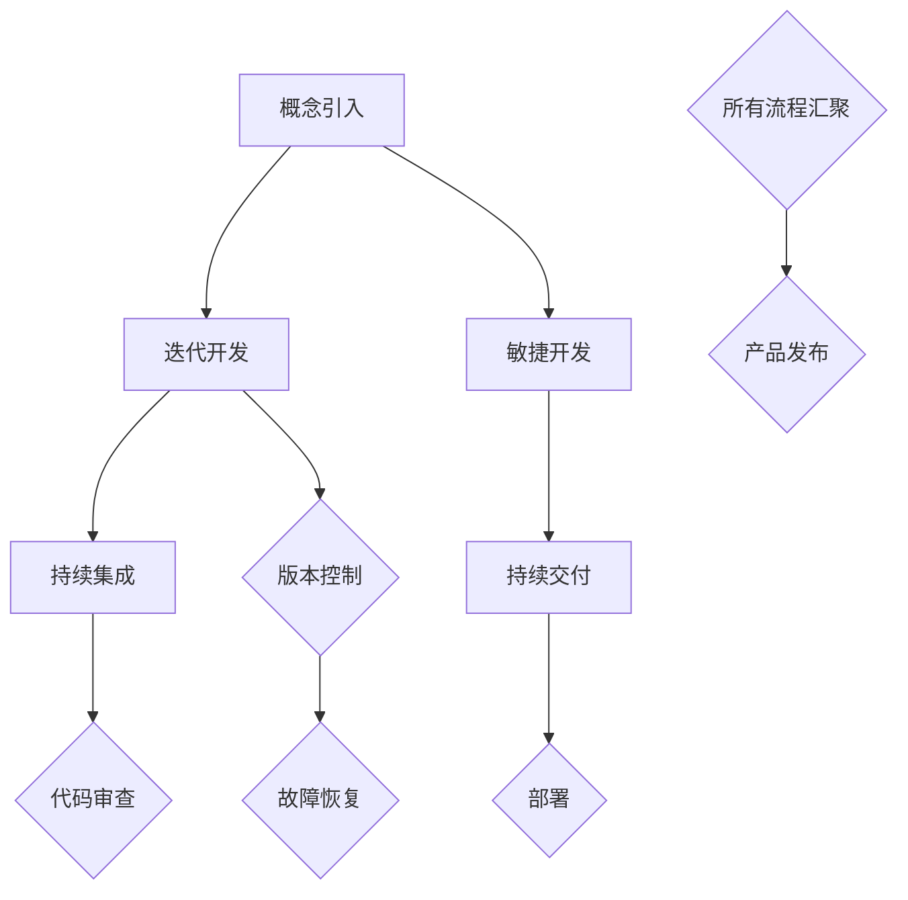
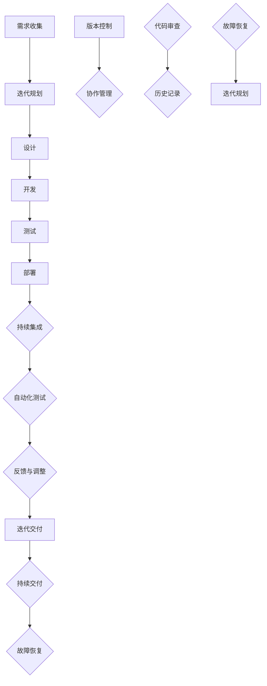
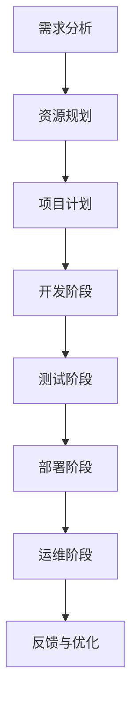
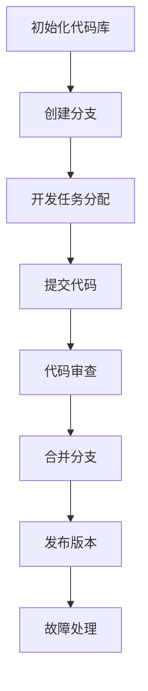
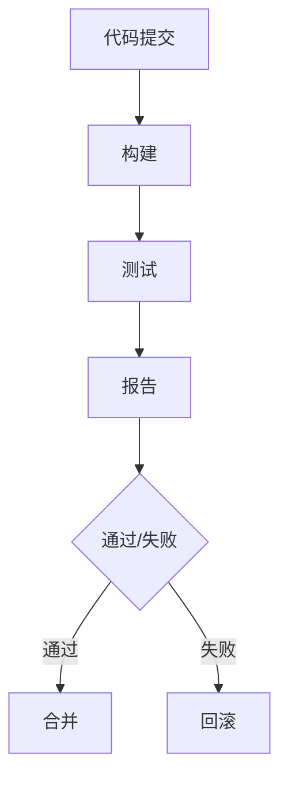

                 

### 背景介绍

在当今快速发展的信息技术时代，产品生命周期管理和版本控制已成为企业成功运营的关键要素。尤其是在小型公司和个人独立开发者的背景下，这两者的有效实施能够显著提升产品竞争力、维护团队协作以及确保软件的稳定性和安全性。

#### 产品生命周期管理

产品生命周期管理（Product Lifecycle Management，PLM）是一种系统化的方法，旨在规划、跟踪和控制产品的整个生命周期，从概念设计、开发、测试到部署和维护。对于一家小型公司或个人独立开发者而言，这意味着他们需要确保产品能够按时发布，同时保持高质量和可持续性。PLM帮助团队在各个阶段作出合理的决策，如确定资源分配、风险管理、质量控制和进度跟踪等。

#### 版本控制

版本控制（Version Control）是一种用于跟踪源代码或任何文件变化的技术，确保历史变更的可追溯性。这对于大型项目尤为重要，因为它可以帮助开发者在多个版本之间进行切换，并确保每个版本的稳定性。版本控制系统（VCS）如Git、Mercurial等，使得团队协作更加高效，同时也为故障恢复和代码审查提供了支持。

#### 关键概念与联系

为了更好地理解产品生命周期管理和版本控制，我们需要探讨以下几个关键概念：

1. **迭代开发（Iterative Development）**：这是一种逐步改进产品的方法，通过多次迭代逐步完善产品功能，每个迭代都会基于前一个迭代的结果进行优化。

2. **敏捷开发（Agile Development）**：敏捷开发是一种以用户需求为核心的软件开发方法，强调快速迭代和灵活响应变化。敏捷开发方法与产品生命周期管理和版本控制紧密相关。

3. **持续集成（Continuous Integration，CI）**：持续集成是一种开发实践，旨在通过频繁的代码合并和自动化测试来快速识别并解决集成问题。

4. **持续交付（Continuous Delivery，CD）**：持续交付是一种软件开发和部署方法，确保软件可以快速、安全地交付到生产环境。

#### 结构化的 Mermaid 流程图

以下是一个描述产品生命周期管理与版本控制相关概念和流程的Mermaid流程图：



通过上述流程图，我们可以看到产品生命周期管理与版本控制如何协同工作，共同确保产品的成功发布。

接下来，我们将深入探讨产品生命周期管理的核心概念和版本控制算法原理，以帮助读者更好地理解这两个领域。

### 核心概念与联系

在深入了解产品生命周期管理和版本控制之前，我们需要首先明确几个关键概念，并理解它们之间的联系。以下是几个核心概念及其相互关系：

#### 1. 迭代开发（Iterative Development）

迭代开发是一种逐步完善产品的方法，通过将开发过程划分为多个短周期的迭代，每个迭代都包含需求收集、设计、开发、测试和部署等阶段。这种方法的核心优势在于其灵活性，可以快速响应市场需求和用户反馈，从而提高产品质量和市场适应性。

**迭代开发与产品生命周期管理的联系：**

- **需求分析**：每个迭代开始时，团队会收集用户需求和市场趋势，将其转化为具体的功能需求。
- **设计**：基于需求分析，开发团队进行系统设计和详细设计。
- **开发**：开发阶段按照设计进行编码实现，同时确保代码的可维护性和可扩展性。
- **测试**：每个迭代都包含测试阶段，以确保新功能的质量和稳定性。
- **部署**：通过自动化部署工具，将每个迭代的新功能部署到生产环境中。

#### 2. 敏捷开发（Agile Development）

敏捷开发是一种以用户需求为核心，强调快速迭代和灵活响应变化的软件开发方法。其核心原则包括：

- **客户合作**：与客户紧密合作，确保开发的产品满足实际需求。
- **迭代交付**：每个迭代都提供可用的产品版本，从而快速获取用户反馈。
- **响应变化**：在项目进行过程中，随时准备调整计划和优先级，以应对变化。

**敏捷开发与产品生命周期管理的联系：**

- **敏捷方法**：敏捷开发方法为产品生命周期管理提供了具体的实践指南，如Scrum和Kanban等。
- **需求管理**：敏捷开发强调需求管理的灵活性，允许团队根据实际需求和资源进行优先级调整。
- **持续交付**：敏捷开发注重持续交付，确保每个迭代的产品版本都能够顺利部署。

#### 3. 持续集成（Continuous Integration，CI）

持续集成是一种通过频繁的代码合并和自动化测试来快速识别并解决集成问题的开发实践。其主要目标是减少集成过程中的风险和复杂度，提高代码质量。

**持续集成与产品生命周期管理的联系：**

- **集成频率**：持续集成强调频繁的代码集成，从而确保代码库的稳定性和一致性。
- **测试自动化**：自动化测试工具在持续集成过程中扮演关键角色，可以快速发现集成问题。
- **反馈机制**：持续集成通过持续反馈，帮助开发团队快速识别和解决问题。

#### 4. 持续交付（Continuous Delivery，CD）

持续交付是一种软件开发和部署方法，旨在确保软件可以快速、安全地交付到生产环境。持续交付的关键在于其自动化和安全性。

**持续交付与产品生命周期管理的联系：**

- **自动化部署**：持续交付依赖于自动化部署工具，确保每次迭代都可以无缝地部署到生产环境。
- **安全性和可靠性**：通过持续交付，团队可以确保每次部署都是经过严格测试和验证的。
- **快速响应**：持续交付使得团队能够快速响应用户反馈和市场需求。

#### 5. 版本控制（Version Control）

版本控制是一种用于跟踪源代码或任何文件变化的技术，确保历史变更的可追溯性。版本控制系统能够帮助团队协作，确保代码的稳定性和可靠性。

**版本控制与产品生命周期管理的联系：**

- **历史记录**：版本控制系统记录了所有代码变更的历史记录，便于追溯和审查。
- **协作管理**：版本控制系统能够协调多个开发者的工作，确保代码的一致性和可维护性。
- **故障恢复**：版本控制系统为故障恢复提供了强有力的支持，团队可以快速回滚到之前的稳定版本。

#### 结构化的 Mermaid 流程图

以下是一个描述产品生命周期管理与版本控制相关概念和流程的Mermaid流程图：



通过上述流程图，我们可以看到产品生命周期管理和版本控制如何相互协作，共同确保产品的成功发布。

#### 总结

在本节中，我们详细介绍了迭代开发、敏捷开发、持续集成、持续交付和版本控制等核心概念，并阐述了它们在产品生命周期管理中的联系和作用。理解这些概念有助于我们更好地掌握产品生命周期管理和版本控制的实际应用。

接下来，我们将深入探讨产品生命周期管理的核心算法原理和具体操作步骤，以帮助读者更全面地了解这一领域的实践方法。

### 核心算法原理 & 具体操作步骤

在深入探讨产品生命周期管理的核心算法原理和具体操作步骤之前，我们需要了解几个关键算法，这些算法在产品开发过程中起着至关重要的作用。

#### 1. 产品生命周期管理算法

产品生命周期管理算法主要关注产品的规划、开发、测试和部署等阶段，确保每个阶段的工作都能高效、有序地进行。以下是一个简化版的算法步骤：

**算法步骤：**



**具体操作步骤：**

1. **需求分析**：首先，团队需要与客户和市场沟通，收集和分析需求，确定产品的功能和技术要求。
2. **资源规划**：根据需求分析结果，规划所需的人力、技术和资源，确保项目能够顺利启动。
3. **项目计划**：制定详细的项目计划，包括时间表、任务分配和关键里程碑。
4. **开发阶段**：按照项目计划，进行编码实现和单元测试，确保代码的质量和可维护性。
5. **测试阶段**：进行集成测试和系统测试，确保产品功能齐全且稳定。
6. **部署阶段**：将产品部署到生产环境，确保其能够在实际使用中正常运行。
7. **运维阶段**：持续监控产品运行状态，进行故障排除和性能优化。
8. **反馈与优化**：收集用户反馈，对产品进行持续优化，确保其满足市场和客户的需求。

#### 2. 版本控制算法

版本控制算法主要用于跟踪和管理代码库的版本变化，确保团队协作的一致性和代码库的完整性。以下是一个简化版的版本控制算法步骤：

**算法步骤：**



**具体操作步骤：**

1. **初始化代码库**：创建一个新的代码库，为项目建立基础。
2. **创建分支**：根据项目需求，为不同的功能模块或任务创建独立的分支。
3. **开发任务分配**：将开发任务分配给团队成员，确保每个任务都有专人负责。
4. **提交代码**：团队成员在各自的分支上开发代码，并定期将代码提交到版本控制系统。
5. **代码审查**：对提交的代码进行审查，确保其符合质量标准和团队规范。
6. **合并分支**：在确保分支上的代码质量后，将分支合并到主分支，确保代码库的一致性。
7. **发布版本**：将合并后的主分支发布为新的版本，供用户使用。
8. **故障处理**：在版本发布后，持续监控产品的运行状态，及时发现并处理故障。

#### 3. 持续集成算法

持续集成算法主要用于自动化构建和测试代码，确保每次代码提交都能快速集成并发现潜在问题。以下是一个简化版的持续集成算法步骤：

**算法步骤：**



**具体操作步骤：**

1. **代码提交**：开发者将代码提交到版本控制系统。
2. **构建**：持续集成服务器自动构建代码，生成可执行的二进制文件。
3. **测试**：运行自动化测试脚本，确保代码的功能和性能符合预期。
4. **报告**：生成测试报告，列出所有测试结果和潜在的故障。
5. **通过/失败**：根据测试结果，决定是否将代码合并到主分支。
   - 如果测试通过，代码将被合并到主分支。
   - 如果测试失败，开发者需要回滚代码，修复故障后重新提交。

#### 总结

在本节中，我们详细介绍了产品生命周期管理的核心算法原理和具体操作步骤，包括需求分析、资源规划、项目计划、开发阶段、测试阶段、部署阶段、运维阶段、代码提交、代码审查、分支合并、构建、测试、报告和故障处理等。这些算法和步骤为产品开发提供了系统的指导和保障，确保产品能够高效、稳定地推进和发布。

接下来，我们将深入探讨产品生命周期管理中的数学模型和公式，以及如何将这些理论应用到实际项目中。

### 数学模型和公式 & 详细讲解 & 举例说明

在产品生命周期管理中，数学模型和公式被广泛应用于需求分析、资源规划、风险管理和进度跟踪等方面。以下是一些关键的数学模型和公式，以及它们的详细讲解和实际应用示例。

#### 1. 需求分析模型

需求分析是产品生命周期管理的首要环节，其核心目标是明确产品的功能和技术要求。以下是一个常用的需求分析模型：

**Elder需求模型：**

\[ D = F(A \times R) + C \times (1 - R) \]

其中：
- \( D \) 表示需求值
- \( F \) 表示功能重要性
- \( A \) 表示应用场景重要性
- \( R \) 表示风险值
- \( C \) 表示成本值

**详细讲解：**

该模型通过功能重要性、应用场景重要性和风险值的乘积，计算出每个功能的需求值。同时，通过成本值与（1 - 风险值）的乘积，计算出每个功能的成本。最终，需求值和成本值的和决定了功能的需求优先级。

**举例说明：**

假设一个产品需要实现以下三个功能：
- 功能A：用户注册，功能重要性 \( F(A) = 0.8 \)，应用场景重要性 \( A(A) = 0.9 \)，风险值 \( R(A) = 0.1 \)，成本值 \( C(A) = 1000 \)
- 功能B：订单管理，功能重要性 \( F(B) = 0.7 \)，应用场景重要性 \( A(B) = 0.9 \)，风险值 \( R(B) = 0.2 \)，成本值 \( C(B) = 1500 \)
- 功能C：库存管理，功能重要性 \( F(C) = 0.6 \)，应用场景重要性 \( A(C) = 0.8 \)，风险值 \( R(C) = 0.3 \)，成本值 \( C(C) = 1200 \)

根据Elder需求模型，我们可以计算每个功能的需求值：

\[ D(A) = 0.8 \times 0.9 \times 0.1 + 1000 \times (1 - 0.1) = 0.72 + 900 = 1022 \]
\[ D(B) = 0.7 \times 0.9 \times 0.2 + 1500 \times (1 - 0.2) = 0.126 + 1200 = 1326 \]
\[ D(C) = 0.6 \times 0.8 \times 0.3 + 1200 \times (1 - 0.3) = 0.144 + 840 = 984 \]

由此可见，功能B的需求值最高，其次是功能A，功能C最低。因此，团队应该优先开发功能B。

#### 2. 资源规划模型

资源规划是确保项目能够按时、按质完成的关键环节。以下是一个常用的资源规划模型：

**帕累托最优模型：**

\[ R_{opt} = \frac{R_{total}}{n} \]

其中：
- \( R_{opt} \) 表示最优资源分配
- \( R_{total} \) 表示总资源
- \( n \) 表示团队成员数量

**详细讲解：**

该模型通过将总资源除以团队成员数量，计算出每个团队成员的最优资源分配。这种方法可以最大化团队的效率和产出。

**举例说明：**

假设一个项目需要10名团队成员，总资源为100人天。根据帕累托最优模型，每个团队成员的最优资源分配为：

\[ R_{opt} = \frac{100}{10} = 10 \text{ 人天} \]

这意味着每个团队成员需要分配10人天的工作量，以确保项目能够高效推进。

#### 3. 风险管理模型

风险管理是产品生命周期管理中不可或缺的一部分。以下是一个常用的风险管理模型：

**贝叶斯风险模型：**

\[ P(R|E) = \frac{P(E|R) \times P(R)}{P(E)} \]

其中：
- \( P(R|E) \) 表示在事件E发生的条件下风险R的概率
- \( P(E|R) \) 表示在风险R发生的条件下事件E的概率
- \( P(R) \) 表示风险R的概率
- \( P(E) \) 表示事件E的概率

**详细讲解：**

贝叶斯风险模型通过条件概率计算，评估特定风险在特定事件发生的条件下的概率。这种方法可以帮助团队更好地理解风险，并采取相应的预防措施。

**举例说明：**

假设一个项目在开发阶段遇到了技术难题，根据历史数据，技术难题发生的概率为 \( P(R) = 0.2 \)。在技术难题发生的情况下，项目延误的概率为 \( P(E|R) = 0.6 \)。而项目延误的总概率为 \( P(E) = 0.1 \)。根据贝叶斯风险模型，我们可以计算在项目延误的条件下技术难题发生的概率：

\[ P(R|E) = \frac{P(E|R) \times P(R)}{P(E)} = \frac{0.6 \times 0.2}{0.1} = 0.6 \]

这意味着在项目延误的条件下，技术难题发生的概率为60%。因此，团队需要高度重视技术难题，并采取有效的预防措施。

#### 4. 进度跟踪模型

进度跟踪是确保项目按时完成的重要手段。以下是一个常用的进度跟踪模型：

**甘特图模型：**

\[ T_{total} = \sum_{i=1}^{n} T_i + \sum_{i<j} C_{ij} \]

其中：
- \( T_{total} \) 表示总工期
- \( T_i \) 表示第 \( i \) 个任务的工期
- \( C_{ij} \) 表示第 \( i \) 个任务和第 \( j \) 个任务之间的协作时间

**详细讲解：**

甘特图模型通过计算所有任务的工期和协作时间，得出项目的总工期。这种方法可以直观地展示项目的进度和关键路径。

**举例说明：**

假设一个项目包含以下任务和协作时间：
- 任务1：2周
- 任务2：3周
- 任务3：2周
- 任务1和任务2之间的协作时间：1周
- 任务2和任务3之间的协作时间：2周

根据甘特图模型，项目的总工期为：

\[ T_{total} = 2 + 3 + 2 + 1 + 2 = 10 \text{ 周} \]

这意味着项目需要10周时间才能完成。

#### 总结

在本节中，我们详细介绍了需求分析模型、资源规划模型、风险管理模型和进度跟踪模型等数学模型和公式，并提供了详细的讲解和实际应用示例。这些模型和公式为产品生命周期管理提供了有力的理论支持，帮助团队更好地进行需求分析、资源规划、风险管理和进度跟踪。在接下来的章节中，我们将进一步探讨项目实践中的具体实现方法和技巧。

### 项目实践：代码实例和详细解释说明

在实际项目开发中，产品生命周期管理和版本控制是确保项目成功的关键要素。本节我们将通过一个具体的代码实例，详细解释如何在实际项目中应用这些技术和方法。

#### 开发环境搭建

首先，我们需要搭建一个适合项目开发的环境。以下是搭建环境的基本步骤：

1. **安装Git**：Git是一个开源的分布式版本控制系统，用于跟踪源代码和历史变化。在大多数Linux发行版和Windows上，可以通过包管理器轻松安装Git。

   ```bash
   # Linux
   sudo apt-get install git
   
   # Windows
   https://git-scm.com/downloads
   ```

2. **安装代码编辑器**：选择一个合适的代码编辑器，如Visual Studio Code、Atom或Sublime Text等。这些编辑器提供了丰富的插件和功能，有助于提高开发效率。

3. **安装代码审查工具**：GitLab或GitHub等版本控制系统提供了内置的代码审查工具，用于团队协作和代码质量保证。

4. **安装持续集成工具**：如Jenkins、Travis CI或GitHub Actions等，用于自动化构建、测试和部署。

#### 源代码详细实现

以下是一个简单的Web应用程序的源代码实例，用于演示产品生命周期管理和版本控制的应用：

```javascript
// app.js
const http = require('http');

const server = http.createServer((req, res) => {
  res.writeHead(200, {'Content-Type': 'text/plain'});
  res.end('Hello, World!');
});

server.listen(8080, () => {
  console.log('Server running on http://localhost:8080/');
});
```

这是一个简单的HTTP服务器，用于演示基本的Web应用程序开发。

#### 代码解读与分析

1. **需求分析**：首先，我们需要确定这个应用程序的需求。例如，它需要提供一个Web服务器，能够在端口8080上监听HTTP请求，并返回一个简单的响应。

2. **资源规划**：根据需求分析，我们确定需要使用Node.js和HTTP模块来构建这个Web服务器。

3. **开发阶段**：在开发阶段，我们编写了上述的`app.js`代码，并使用代码编辑器进行代码编写和调试。

4. **测试阶段**：在测试阶段，我们运行以下命令来启动服务器，并使用浏览器访问`http://localhost:8080/`来验证服务器的响应。

   ```bash
   node app.js
   ```

5. **部署阶段**：在部署阶段，我们将这个应用程序部署到服务器或云平台，确保其能够对外提供服务。

#### 版本控制操作

1. **初始化代码库**：首先，我们在本地目录中初始化一个Git代码库。

   ```bash
   git init
   ```

2. **创建分支**：为了进行功能开发，我们创建一个名为`feature/user-auth`的分支。

   ```bash
   git checkout -b feature/user-auth
   ```

3. **开发任务分配**：团队成员可以在各自的分支上开发新的功能，如用户认证。

4. **提交代码**：每次开发完成后，将代码提交到Git代码库。

   ```bash
   git add .
   git commit -m "Add user authentication feature"
   ```

5. **代码审查**：在提交代码后，团队成员可以进行代码审查，确保代码质量。

6. **合并分支**：在确保分支上的代码质量后，将分支合并到主分支。

   ```bash
   git checkout main
   git merge feature/user-auth
   ```

7. **发布版本**：将合并后的主分支发布为新的版本。

   ```bash
   git tag -a v1.0.0
   git push origin v1.0.0
   ```

#### 运行结果展示

在完成上述步骤后，我们运行以下命令来启动服务器，并使用浏览器访问`http://localhost:8080/`来验证服务器的响应。

```bash
node app.js
```

此时，浏览器应显示“Hello, World!”，表示服务器运行正常。

#### 总结

通过上述代码实例和详细解释，我们可以看到如何在实际项目中应用产品生命周期管理和版本控制。从需求分析、资源规划、开发阶段、测试阶段、部署阶段到版本控制，每一步都至关重要。通过合理的管理和协作，我们可以确保项目的成功实施和持续发展。

接下来，我们将进一步探讨产品生命周期管理在实际应用场景中的具体实现，帮助读者更好地理解这一领域的实际应用价值。

### 实际应用场景

在产品生命周期管理（PLM）的实际应用中，我们经常遇到各种具体的场景，这些场景往往涉及到项目的规划、执行、监控和优化。以下是一些常见的应用场景，以及如何通过版本控制等工具来实现有效管理。

#### 1. 软件开发项目

在软件开发项目中，产品生命周期管理通过迭代和版本控制确保项目按计划推进。例如，在开发一个Web应用程序时，开发团队可以使用Git进行版本控制，确保每个功能模块的开发和集成都能在独立的分支上进行，然后通过合并和代码审查将功能合并到主分支。敏捷开发方法（如Scrum）结合持续集成（CI）和持续交付（CD），使得团队能够快速响应需求变化，同时保证代码质量和稳定性。

**应用示例：**
- **迭代规划**：团队根据用户需求和项目目标，制定每两周的迭代计划。
- **代码提交**：开发者将自己的功能代码提交到Git仓库，并执行自动化测试。
- **代码审查**：通过GitLab或GitHub的代码审查功能，团队成员可以审查和批准提交的代码。
- **合并分支**：在确保代码质量和测试通过后，将功能分支合并到主分支。
- **持续交付**：使用Jenkins或GitHub Actions自动化部署代码到测试或生产环境。

#### 2. 基础设施建设项目

在基础设施建设项目中，版本控制用于跟踪设计和施工文档的变化。例如，在建设一个数据中心时，设计团队可以使用Git来管理设计图纸和文档，确保每个阶段的文档都是最新和准确的。

**应用示例：**
- **设计阶段**：设计团队使用Git来存储和跟踪设计文档的变化，每个设计迭代都有独立的分支。
- **施工阶段**：施工团队根据设计文档进行施工，并将施工过程中的变更记录在Git仓库中。
- **文档管理**：通过Git的分支管理和合并功能，确保施工文档的一致性和可追溯性。

#### 3. 产品维护和更新

在产品的维护和更新过程中，版本控制用于管理不同版本的代码和更新内容。例如，对于一个在线购物平台，每次更新都需要确保系统的稳定性和安全性。

**应用示例：**
- **更新计划**：产品经理制定更新计划，包括新功能的添加和漏洞修复。
- **代码开发**：开发团队在每个分支上开发新的功能和修复漏洞。
- **测试和发布**：在测试通过后，通过Git的合并和发布功能将更新推送到生产环境。
- **版本跟踪**：通过Git的标签功能，为每个发布版本打上标签，便于历史记录和故障排除。

#### 4. 团队协作

在团队协作中，版本控制用于协调多个开发者的工作，确保代码的一致性和可维护性。例如，在一个大型项目中，多个开发者可能同时工作在不同的模块上。

**应用示例：**
- **分支管理**：每个开发者都有自己的开发分支，确保工作不会互相干扰。
- **代码审查**：在提交代码前，其他开发者可以审查和提供反馈。
- **合并请求**：通过Git的合并请求（Pull Request）功能，确保代码合并和审查的透明性。

#### 5. 风险管理和故障恢复

在项目管理和故障恢复中，版本控制用于快速回滚到之前的稳定版本。例如，在系统发生故障时，可以迅速找到之前的稳定版本进行恢复。

**应用示例：**
- **版本备份**：定期备份当前版本的代码和配置，以便在发生故障时进行快速恢复。
- **回滚操作**：通过Git的回滚功能，将代码库恢复到之前的稳定版本。
- **故障排除**：在恢复到稳定版本后，分析故障原因，并修复问题以防止再次发生。

#### 总结

通过上述实际应用场景，我们可以看到产品生命周期管理和版本控制在不同领域和不同项目中的重要性。通过合理应用这些技术和方法，团队能够更高效地进行项目管理，确保产品的质量、稳定性和可持续性。在实际操作中，团队应根据项目的具体需求和特点，灵活运用这些工具和方法，以达到最佳效果。

### 工具和资源推荐

在产品生命周期管理和版本控制中，选择合适的工具和资源对于提高开发效率和项目成功至关重要。以下是一些推荐的工具和资源，包括学习资源、开发工具框架以及相关的论文和著作。

#### 1. 学习资源推荐

**书籍：**
- 《敏捷软件开发：实践指南》（《Agile Software Development: Principles, Patterns, and Practices》）
- 《持续交付：发布可靠软件的系统方法》（《Continuous Delivery: Reliable Software Releases through Build, Test, and Deployment Automation》）
- 《版本控制工作流程》（《Version Control with Git》）

**在线课程：**
- Coursera的《软件工程：基础》和《敏捷和Scrum软件工程》
- Udemy的《Git与GitHub：从入门到精通》

**博客和网站：**
- Atlassian的《版本控制入门指南》
- Martin Fowler的《持续集成》

#### 2. 开发工具框架推荐

**版本控制：**
- Git：开源分布式版本控制系统，广泛用于项目协作和代码管理。
- GitHub：Git的在线平台，提供代码托管、代码审查和项目管理功能。
- GitLab：开源Git平台，拥有与GitHub相似的功能，更适合企业内部使用。

**持续集成：**
- Jenkins：开源持续集成服务器，支持多种插件和集成工具。
- Travis CI：云服务持续集成平台，支持多种编程语言和代码仓库。
- GitHub Actions：GitHub内置的持续集成和持续交付服务。

**项目管理：**
- JIRA：Atlassian出品的项目管理和跟踪工具，支持敏捷开发方法。
- Trello：简单直观的项目管理工具，适合小型团队和个人项目。

**代码审查：**
- GitLab Code Review：GitLab内置的代码审查工具，支持多人协作和代码质量保证。
- Crucible：Bamboo公司出的代码审查工具，提供详细的代码审查流程。

#### 3. 相关论文著作推荐

**论文：**
- 《敏捷软件开发：一种更快的、持续的、更灵活的方式》（《Agile Software Development: A faster, more flexible approach to software development》）
- 《持续集成：一种软件开发实践》（《Continuous Integration: A Practice for Software Development》）

**著作：**
- 《敏捷宣言》：由17位敏捷开发倡导者共同撰写的宣言，阐述了敏捷开发的核心原则。
- 《敏捷实践指南》：详细介绍了敏捷开发方法的具体实践和应用。

#### 总结

选择合适的工具和资源对于成功实施产品生命周期管理和版本控制至关重要。上述推荐的书籍、在线课程、博客、网站、开发工具框架和论文著作，涵盖了从基础理论到实际操作的全方面内容，能够帮助读者系统学习和掌握这些关键技术和方法。

### 总结：未来发展趋势与挑战

随着技术的不断进步和市场竞争的加剧，产品生命周期管理和版本控制在未来将继续演进，面临新的发展趋势和挑战。

#### 发展趋势

1. **智能化与自动化**：随着人工智能和机器学习技术的应用，产品生命周期管理和版本控制将更加智能化和自动化。例如，通过AI技术，可以实现自动化的需求分析和风险评估，优化开发流程和资源分配。

2. **云原生与容器化**：云原生和容器化技术的普及，将使产品生命周期管理和版本控制更加灵活和高效。通过云原生平台，如Kubernetes，可以实现自动化部署、扩展和管理，从而加快产品的迭代速度。

3. **DevOps文化的普及**：DevOps文化的普及将促进产品生命周期管理和版本控制的深度融合。DevOps强调开发、运维和质量保证的协同工作，通过自动化和协作，实现更快的交付和更高的质量。

4. **区块链技术的应用**：区块链技术具有去中心化、不可篡改和透明性等特性，有望在未来应用于产品生命周期管理和版本控制中，提高数据的可信度和安全性。

#### 挑战

1. **数据隐私和安全**：随着数据量的增加和用户隐私保护要求的提升，如何在确保数据隐私和安全的同时，有效地进行产品生命周期管理和版本控制，是一个重要的挑战。

2. **项目管理复杂度**：随着项目规模的扩大和技术的复杂化，项目管理将变得更加复杂。如何有效地管理大型项目的生命周期，确保各个阶段的高效协同，是项目管理的一个挑战。

3. **持续集成和交付的挑战**：随着持续集成和交付的普及，如何确保每次交付都是可靠和高质量的，以及如何处理潜在的集成问题和故障，是持续集成和交付面临的主要挑战。

4. **团队协作与沟通**：在分布式团队中，如何确保团队成员之间的有效沟通和协作，是产品生命周期管理和版本控制的一个关键挑战。

#### 总结

未来，产品生命周期管理和版本控制将继续朝着智能化、自动化、云原生和DevOps方向发展，同时面临数据隐私、安全、项目管理复杂度、持续集成和交付、团队协作与沟通等方面的挑战。通过不断优化和创新，企业和开发者将能够更好地应对这些挑战，提高产品的竞争力。

### 附录：常见问题与解答

在讨论产品生命周期管理和版本控制的过程中，读者可能遇到一些常见问题。以下是一些常见问题及其解答：

#### 1. 什么是产品生命周期管理（PLM）？

**解答：** 产品生命周期管理（PLM）是一种系统化的方法，用于规划、跟踪和控制产品的整个生命周期，从概念设计、开发、测试到部署和维护。PLM的目标是确保产品能够按时发布，同时保持高质量和可持续性。

#### 2. 版本控制的主要作用是什么？

**解答：** 版本控制的主要作用是跟踪和管理源代码或文件的变化，确保历史变更的可追溯性。它帮助团队协作，确保代码的稳定性和可靠性，同时为故障恢复和代码审查提供支持。

#### 3. 如何选择适合的版本控制系统？

**解答：** 选择适合的版本控制系统应考虑团队规模、项目需求、协作方式等因素。Git是一个广泛使用的分布式版本控制系统，适用于大多数项目。其他选择还包括集中式系统如SVN和Mercurial。

#### 4. 什么是敏捷开发？

**解答：** 敏捷开发是一种软件开发方法，强调快速迭代和灵活响应变化。敏捷开发的核心原则包括客户合作、迭代交付和响应变化。它有助于提高产品的质量和市场适应性。

#### 5. 持续集成（CI）和持续交付（CD）有何区别？

**解答：** 持续集成（CI）是一种通过频繁的代码合并和自动化测试来快速识别和解决集成问题的开发实践。持续交付（CD）是一种确保软件可以快速、安全地交付到生产环境的方法。持续交付通常包括持续集成，但还包括自动化部署和测试。

#### 6. 什么是迭代开发？

**解答：** 迭代开发是一种逐步完善产品的方法，通过将开发过程划分为多个短周期的迭代，每个迭代都包含需求收集、设计、开发、测试和部署等阶段。这种方法可以提高产品的灵活性和适应性。

#### 7. 如何确保持续集成和交付的质量？

**解答：** 确保持续集成和交付的质量需要：
- 制定严格的代码规范和标准。
- 实施全面的自动化测试，包括单元测试、集成测试和端到端测试。
- 定期审查和优化自动化流程。
- 建立良好的反馈机制，快速识别和解决质量问题。

### 扩展阅读 & 参考资料

为了更深入地了解产品生命周期管理和版本控制，以下是推荐的一些扩展阅读和参考资料：

1. 《敏捷软件开发：实践指南》 - [Amazon](https://www.amazon.com/Agile-Software-Development-Principles-Practices/dp/0321473263)
2. 《持续交付：发布可靠软件的系统方法》 - [Amazon](https://www.amazon.com/Continuous-Delivery-Reliable-Software-Deployment-Automated/dp/0321532665)
3. 《版本控制工作流程》 - [Amazon](https://www.amazon.com/Version-Control-Workflows-Mastering-Development/dp/1449305351)
4. 《敏捷宣言》 - [Manifesto for Agile Software Development](https://www.agilemanifesto.org/)
5. 《持续集成：一种软件开发实践》 - [Martin Fowler's Website](https://martinfowler.com/articles/continuousIntegration.html)
6. 《Git权威指南》 - [Pro Git](https://git-scm.com/book/en/v2)
7. 《Jenkins：持续集成服务器的实战》 - [O'Reilly](https://www.oreilly.com/library/view/jenkins-the-definitive/9781449390566/)
8. 《Kubernetes权威指南》 - [O'Reilly](https://www.oreilly.com/library/view/kubernetes-up-and-running/9781449372281/)

通过阅读这些资料，读者可以更深入地了解产品生命周期管理和版本控制的原理和实践，提升自己在相关领域的专业水平。

