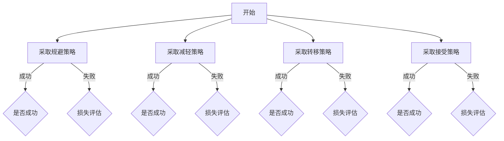
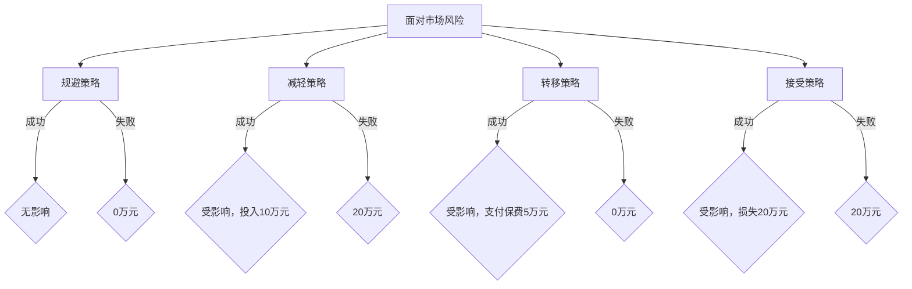

                 

### 一人公司的危机预防与应急响应机制

#### 关键词

1. 一人公司
2. 危机预防
3. 应急响应
4. 信息安全
5. 风险管理
6. 持续改进

#### 摘要

本文旨在探讨一人公司（即“个人独资企业”）在面对商业环境不确定性时，如何构建有效的危机预防与应急响应机制。文章首先介绍了危机预防与应急响应的基本概念及其在一人公司中的重要性。随后，通过详细阐述核心概念原理和架构，提出了一套适合一人公司的危机管理框架。接着，本文从算法原理、数学模型、项目实践等多个角度，提供了一套具体操作步骤，旨在帮助一人公司建立一套科学、系统的危机应对机制。最后，文章总结了实际应用场景，推荐了相关工具和资源，并展望了未来发展趋势与挑战。

---

## 1. 背景介绍

随着互联网和创业环境的日益成熟，越来越多的人选择以一人公司的形式开展自己的商业活动。这种模式具有灵活性高、决策迅速等优势，但同时也面临着较大的风险和不确定性。危机预防与应急响应机制对于一人公司而言，是确保其在激烈市场竞争中生存与发展的重要保障。

### 1.1 危机预防的重要性

危机预防是指企业在日常运营中，采取一系列措施来识别、评估和降低潜在风险，从而避免或减轻危机发生时对企业造成的负面影响。对于一人公司来说，由于资源有限、人员单一，危机预防尤为重要。有效的危机预防可以帮助一人公司：

1. **提高风险意识**：通过对潜在风险的识别和评估，使企业能够提前预知可能的危机，从而采取相应措施。
2. **降低损失**：通过制定应对措施，减少危机发生时的损失，甚至可能避免危机的发生。
3. **提高竞争力**：危机预防机制有助于提升企业应对突发事件的效率，增强企业的市场竞争力和信誉。

### 1.2 应急响应的重要性

应急响应是指在危机发生时，企业迅速采取有效措施，以最大限度地减少危机对企业的影响。对于一人公司而言，由于资源有限，应急响应的效率直接关系到企业的生死存亡。有效的应急响应可以帮助一人公司：

1. **快速应对**：在危机发生时，能够迅速采取行动，最大限度地减少危机对企业运营的干扰。
2. **降低损失**：通过有效的应急响应措施，可以减轻危机对企业造成的损失，甚至可能转危为安。
3. **恢复运营**：在危机发生后，能够迅速恢复企业的正常运营，降低危机对长期业务的影响。

### 1.3 一人公司的特点与挑战

一人公司（以下简称“一公司”）具有以下特点：

1. **灵活性高**：决策迅速，能够快速响应市场变化。
2. **资源有限**：由于仅有一个人负责，资源相对有限，特别是在资金、人力等方面。
3. **风险集中**：由于人员单一，一旦发生危机，对企业的影响可能更加严重。

这些特点使得一人公司在危机预防和应急响应方面面临以下挑战：

1. **风险识别难度大**：由于资源有限，难以全面识别潜在的风险。
2. **应急响应效率低**：由于人员有限，难以在危机发生时迅速采取行动。
3. **恢复难度大**：由于资源有限，在危机发生后，恢复企业正常运营的难度较大。

## 2. 核心概念与联系

### 2.1 危机预防与应急响应的基本概念

#### 2.1.1 危机预防

危机预防是指企业在日常运营中，通过识别、评估和降低潜在风险，避免或减轻危机发生的可能性及其对企业的影响。危机预防的核心包括以下几个方面：

1. **风险识别**：通过收集和分析企业内外部的各种信息，识别潜在的风险因素。
2. **风险评估**：对识别出的风险进行定量或定性的评估，确定其对企业的影响程度。
3. **风险应对**：根据风险评估的结果，制定相应的应对措施，以降低风险发生的概率或减轻其对企业的影响。

#### 2.1.2 应急响应

应急响应是指企业在危机发生时，迅速采取有效措施，以最大限度地减少危机对企业的影响。应急响应的核心包括以下几个方面：

1. **危机预警**：在危机发生前，通过监测和预警系统，及时发现可能出现的危机。
2. **应急准备**：制定应急响应计划，包括应急资源、人员、设备和培训等。
3. **应急响应**：在危机发生时，按照应急响应计划迅速采取行动，最大限度地减少危机对企业的影响。
4. **恢复与重建**：在危机结束后，迅速恢复企业的正常运营，并进行危机后的总结和改进。

### 2.2 一人公司的危机预防与应急响应架构

为了确保一人公司的危机预防与应急响应机制的有效性，需要建立一套科学的架构。以下是针对一人公司的危机预防与应急响应架构：

1. **风险管理组织**：设立专门的风险管理组织，负责危机预防与应急响应的日常运作。
2. **风险识别与评估**：定期进行风险识别与评估，确保及时发现潜在的风险。
3. **风险应对策略**：根据风险评估的结果，制定相应的风险应对策略。
4. **应急响应计划**：制定详细的应急响应计划，确保在危机发生时能够迅速采取行动。
5. **培训与演练**：定期进行培训与演练，提高员工的风险意识和应急响应能力。
6. **持续改进**：通过定期回顾和改进，不断完善危机预防与应急响应机制。

### 2.3 核心概念与联系

在危机预防与应急响应中，风险识别、风险评估、风险应对和应急响应等核心概念相互关联，共同构成一个完整的危机管理流程。以下是这些核心概念之间的联系：

1. **风险识别**与**风险评估**：风险识别是发现潜在风险的过程，而风险评估是对识别出的风险进行评价，确定其对企业的影响程度。这两个过程是危机预防的基础。
2. **风险评估**与**风险应对**：风险评估的结果直接影响到风险应对策略的制定。只有对风险有准确的评估，才能制定出有效的应对措施。
3. **风险应对**与**应急响应**：风险应对策略为应急响应提供了指导。在危机发生时，企业可以按照既定的风险应对策略迅速采取行动，最大限度地减少危机的影响。
4. **应急响应**与**恢复与重建**：应急响应的目的是在危机发生时减少对企业的影响，而恢复与重建则是确保企业能够迅速恢复正常运营，并从危机中吸取教训，不断改进危机管理机制。

---

通过上述核心概念与联系的阐述，我们可以更好地理解一人公司在危机预防与应急响应中的关键要素，为后续的详细探讨和操作步骤提供了理论基础。

### 2.2.1 风险识别与评估

在构建危机预防与应急响应机制中，风险识别与评估是至关重要的第一步。以下是详细的过程和方法。

#### 2.2.1.1 风险识别

风险识别是指通过系统的方法和工具，识别企业可能面临的各种风险。以下是几种常用的风险识别方法：

1. **头脑风暴**：这是一种简单但非常有效的方法。通过与相关人员（如员工、合作伙伴等）一起讨论，收集可能的风险因素。
2. **SWOT分析**：SWOT分析包括优势（Strengths）、劣势（Weaknesses）、机会（Opportunities）和威胁（Threats）。通过分析企业的内外部环境，识别潜在的风险。
3. **故障树分析**：故障树分析是一种图形化的方法，用于识别和分析可能导致故障的原因。通过构建故障树，可以清晰地看到各种风险因素之间的因果关系。
4. **专家访谈**：与行业专家进行访谈，获取他们对企业面临风险的看法和建议。专家的经验和专业知识可以提供宝贵的见解。

#### 2.2.1.2 风险评估

风险评估是对识别出的风险进行评价，确定其对企业的影响程度。以下是几种常用的风险评估方法：

1. **定性评估**：定性评估通过专家的主观判断，对风险的影响程度进行分类。常用的分类方法包括风险等级（如高、中、低）和影响等级（如重大、显著、轻微）。
2. **定量评估**：定量评估通过数学模型和统计方法，对风险的影响程度进行量化。例如，可以使用概率论和损失函数模型来评估风险的概率和损失。
3. **决策树**：决策树是一种图形化的方法，用于分析不同决策路径下的风险和收益。通过决策树，可以直观地看到不同决策带来的风险。
4. **蒙特卡罗模拟**：蒙特卡罗模拟是一种基于概率的模拟方法，用于评估风险的概率分布和期望损失。通过多次模拟，可以更准确地预测风险的影响。

#### 2.2.1.3 风险识别与评估的过程

风险识别与评估的过程可以分为以下几个步骤：

1. **收集信息**：通过上述方法识别和评估风险，首先需要收集相关的信息。这些信息可以包括行业数据、市场趋势、内部运营数据等。
2. **识别风险**：根据收集的信息，使用风险识别方法，识别出企业可能面临的各种风险。
3. **评估风险**：对识别出的风险进行评估，确定其影响程度。可以使用定性评估、定量评估或其他评估方法。
4. **制定应对策略**：根据评估结果，制定相应的风险应对策略。这些策略可以包括风险规避、风险减轻、风险转移等。
5. **持续监控**：风险识别与评估是一个持续的过程。随着企业内外部环境的变化，需要定期更新风险清单，并重新评估风险的影响。

通过上述风险识别与评估的方法和过程，一人公司可以更全面地了解自身面临的风险，从而制定出更为有效的危机预防与应急响应机制。

### 2.2.2 风险应对策略

在完成了风险识别与评估后，制定有效的风险应对策略是确保一人公司能够应对各种突发事件的关键。以下是几种常见的风险应对策略：

#### 2.2.2.1 风险规避

风险规避是指通过改变计划或行动，避免与潜在风险相关的活动。这种方法适用于那些风险概率高且后果严重的情况。例如，如果市场趋势显示某一产品线面临重大技术变革，企业可以选择停止该产品线的研发和销售，从而规避可能的市场失败。

**优点**：
- 可以完全避免风险的发生。
- 对于高风险、高损失的情况，风险规避是最为安全的选择。

**缺点**：
- 可能会丧失一些市场机会。
- 可能需要较大的调整成本。

**适用场景**：适用于那些高风险但影响较小的情况，或当有更有效的替代方案时。

#### 2.2.2.2 风险减轻

风险减轻是指通过采取一些措施来降低风险的概率或影响。这通常包括改进流程、增加保险、购买备用设备等。例如，如果企业面临网络攻击的风险，可以通过加强网络安全措施、定期进行安全审计和员工培训来减轻风险。

**优点**：
- 可以显著降低风险的概率和影响。
- 通常成本较低，易于实施。

**缺点**：
- 风险可能无法完全消除。
- 可能需要持续的维护和更新。

**适用场景**：适用于大多数风险，特别是那些可以通过简单措施减轻的风险。

#### 2.2.2.3 风险转移

风险转移是指将风险转移给第三方，如通过购买保险、签订合同等。这种方法适用于那些无法避免或难以减轻的风险。例如，企业可以通过购买商业保险来转移可能发生的自然灾害风险。

**优点**：
- 可以将风险转移给更有能力处理的第三方。
- 减轻企业的财务负担。

**缺点**：
- 需要支付保险费或其他转移成本。
- 可能需要对保险公司进行评估，以确保其信誉和赔付能力。

**适用场景**：适用于高风险、高损失且企业自身难以处理的风险。

#### 2.2.2.4 风险接受

风险接受是指企业承认风险的存在，但不采取任何主动措施。这种方法适用于那些风险概率低且影响较小的情况，或者当采取风险规避、风险减轻、风险转移的成本高于风险本身时。例如，对于某些日常运营中的小风险，如设备故障，企业可以选择接受，因为其成本相对较低，且可以快速恢复。

**优点**：
- 成本最低，无需投入额外的资源和资金。
- 可以保持灵活性，适应市场的变化。

**缺点**：
- 风险可能对企业的运营造成影响。
- 可能影响企业的声誉和客户信任。

**适用场景**：适用于低风险、小影响的情况，或者当其他风险应对策略成本过高时。

#### 2.2.2.5 风险组合

风险组合是指将多种风险应对策略结合使用，以获得最佳的平衡。例如，企业可以通过风险规避来避免高风险的活动，同时通过风险减轻和风险转移来降低剩余风险的影响。这种方法适用于那些复杂且多变的商业环境。

**优点**：
- 可以获得多种策略的优点。
- 提高整体风险管理的能力。

**缺点**：
- 需要更高的管理和协调能力。
- 可能会增加成本。

**适用场景**：适用于高风险、多变的商业环境。

通过上述风险应对策略的选择和组合，一人公司可以更全面地应对各种突发事件，确保业务的持续稳定发展。

### 2.2.3 应急响应计划

在危机发生时，迅速而有效地采取行动是减轻危机影响的关键。为了确保一人公司能够高效应对各种突发事件，制定详细的应急响应计划至关重要。以下是应急响应计划的核心组成部分：

#### 2.2.3.1 应急响应计划的基本要素

1. **危机预警机制**：建立实时监控和预警系统，及时识别潜在的危机信号，如市场变化、技术故障、安全漏洞等。
2. **应急指挥中心**：设立专门的应急指挥中心，负责协调和指挥应急响应行动。应急指挥中心应由关键人员组成，如企业主、关键部门主管等。
3. **应急资源清单**：制定详细的应急资源清单，包括物资、设备、资金、人力等。确保在危机发生时，所有必要的资源都能够快速调配。
4. **应急响应流程**：明确应急响应的具体步骤和流程，如危机识别、评估、决策、行动、监控等。确保所有员工都了解自己的职责和行动指令。
5. **沟通机制**：建立有效的沟通机制，确保在危机发生时，信息能够迅速传达给相关人员。这包括内部沟通和外部沟通，如与客户、合作伙伴、政府部门等的沟通。

#### 2.2.3.2 应急响应的具体步骤

1. **危机识别**：当危机预警机制发现潜在危机时，立即通知应急指挥中心。
2. **评估危机**：应急指挥中心对危机进行初步评估，确定危机的类型、影响范围和严重程度。
3. **决策与行动**：根据危机评估结果，制定应急响应计划，并迅速采取行动。行动可能包括隔离受影响区域、启动备用设备、调配资源等。
4. **监控与调整**：在应急响应过程中，持续监控危机的发展情况，并根据实际情况调整应急响应计划。例如，如果危机影响扩大，需要增加资源或调整行动策略。
5. **结束与总结**：当危机得到控制后，结束应急响应，并对整个应急响应过程进行总结和评估。总结内容包括危机应对的有效性、存在的问题和改进措施等。

#### 2.2.3.3 演练与培训

为了确保应急响应计划的可行性和员工的能力，定期进行演练和培训至关重要。以下是演练和培训的关键内容：

1. **演练计划**：制定详细的演练计划，包括演练的目的、场景、流程、评估标准等。确保演练能够全面覆盖应急响应的各个环节。
2. **模拟场景**：通过模拟各种可能的危机场景，如网络攻击、设备故障、供应链中断等，测试员工的应急响应能力和团队合作精神。
3. **评估与反馈**：在演练结束后，对演练过程进行评估和反馈。评估内容包括应急响应的速度、效果、员工的表现等。根据评估结果，调整演练计划和培训内容。
4. **培训计划**：制定详细的培训计划，包括培训内容、培训方式、培训时间等。确保所有员工都掌握必要的应急响应知识和技能。

通过制定详细的应急响应计划，并进行定期的演练和培训，一人公司可以确保在危机发生时能够迅速、有效地采取行动，最大限度地减少危机对企业的影响。

### 2.2.4 培训与演练

为了确保一人公司的危机预防与应急响应机制能够真正发挥作用，培训和演练是不可或缺的重要环节。以下是关于培训与演练的详细方法和步骤。

#### 2.2.4.1 培训的重要性

1. **提高风险意识**：通过培训，使员工深入了解企业面临的各种风险，增强他们的风险意识，从而在日常工作中更加注重风险管理。
2. **提升应急响应能力**：培训能够帮助员工掌握必要的应急响应知识和技能，如危机预警、应急响应流程、危机处理技巧等，提高他们在危机发生时的应对能力。
3. **增强团队协作**：培训可以促进员工之间的沟通和协作，提高团队的整体应急响应能力。

#### 2.2.4.2 培训方法

1. **内部培训**：企业可以邀请内部或外部专家进行讲座或研讨会，向员工传授危机预防与应急响应的知识和技能。
2. **在线学习**：利用在线学习平台，提供相关的培训课程和资料，员工可以随时随地进行学习。
3. **实战演练**：通过模拟各种危机场景，让员工在真实环境中进行实战演练，提高他们的实际操作能力。

#### 2.2.4.3 演练的重要性

1. **检验培训效果**：演练是检验员工培训效果的重要手段。通过演练，可以直观地了解员工在危机发生时的表现，发现培训中的不足之处，从而进行针对性的改进。
2. **发现潜在问题**：演练可以帮助企业发现日常运营中可能存在的潜在问题，如应急预案中的漏洞、资源调配不均等，从而提前进行改进。
3. **增强团队协作**：演练能够促进团队成员之间的沟通和协作，提高团队的整体应对能力。

#### 2.2.4.4 演练方法

1. **桌面演练**：这是一种较为简单的演练方式，主要通过讨论和模拟来检验应急响应计划的有效性。适用于小规模企业或初步测试应急响应计划。
2. **模拟演练**：通过模拟实际危机场景，让员工在模拟环境中进行操作，提高他们的应急响应能力。这种演练方式较为复杂，但能够更好地检验员工的实际操作能力。
3. **实战演练**：在真实环境中进行演练，如模拟网络攻击、设备故障等，让员工在真实情境中应对危机。这种演练方式成本较高，但能够提供最真实的测试效果。

#### 2.2.4.5 定期回顾与改进

1. **演练总结**：在每次演练结束后，对演练过程进行总结和评估，分析演练中的成功和不足之处，提出改进措施。
2. **培训更新**：根据演练总结的结果，更新培训内容和方法，确保员工能够掌握最新的危机预防和应急响应知识。
3. **应急预案调整**：根据演练中发现的问题，调整应急响应计划，确保其在实际应用中的有效性。

通过定期的培训和演练，一人公司可以确保危机预防与应急响应机制的有效实施，提高员工的风险意识和应急响应能力，从而更好地应对各种突发事件。

### 2.2.5 持续改进

危机预防与应急响应机制并非一成不变的，而是一个持续改进的过程。随着企业内外部环境的变化，风险管理策略和应急响应计划也需要不断调整和优化。以下是实现持续改进的几个关键步骤：

#### 2.2.5.1 定期回顾

定期回顾是持续改进的第一步。企业应定期对危机预防与应急响应机制进行回顾和评估，检查其有效性。这可以通过以下方式进行：

1. **回顾演练结果**：分析每次演练中的成功和不足，评估应急响应计划的执行情况。
2. **收集员工反馈**：听取员工对危机预防和应急响应的建议和意见，了解他们在实际操作中的感受和需求。
3. **分析数据**：利用数据分析工具，对危机预防与应急响应过程中的各项数据进行统计和分析，发现潜在的问题和改进点。

#### 2.2.5.2 识别改进点

在回顾的基础上，企业应识别出需要改进的方面。这包括：

1. **流程优化**：对现有的危机预防和应急响应流程进行优化，减少不必要的步骤，提高响应效率。
2. **资源配置**：根据实际需要，调整资源分配，确保在危机发生时，所有必要的资源和人员都能迅速调配。
3. **培训内容**：根据员工的反馈和实际操作需求，更新培训内容，确保员工掌握最新的危机预防和应急响应知识。

#### 2.2.5.3 制定改进计划

在识别出改进点后，企业应制定详细的改进计划，明确改进的目标、步骤和时间表。以下是制定改进计划的关键步骤：

1. **制定改进目标**：明确改进的方向和目标，如提高应急响应速度、降低风险发生的概率等。
2. **分解改进任务**：将改进目标分解为具体的任务，明确每个任务的负责人和完成时间。
3. **制定行动计划**：根据改进任务，制定具体的行动计划，包括所需的资源、步骤和时间表。

#### 2.2.5.4 实施改进计划

在制定改进计划后，企业应按照计划逐步实施，确保各项改进措施得到落实。以下是实施改进计划的关键步骤：

1. **执行改进任务**：按照计划，逐步执行各项改进任务，确保每个任务都能按时完成。
2. **监控进度**：定期检查改进计划的执行进度，确保各项任务按计划进行。
3. **解决问题**：在实施过程中，及时发现和解决问题，确保改进计划能够顺利实施。

#### 2.2.5.5 回归评估

在改进计划实施完毕后，企业应进行回归评估，检查改进措施的效果。这可以通过以下方式进行：

1. **回顾演练结果**：通过演练，检查改进措施是否有效，是否提高了应急响应的能力。
2. **收集员工反馈**：了解员工对改进措施的感受和评价，发现可能存在的问题。
3. **数据分析**：对改进后的数据进行统计和分析，评估改进措施的效果。

通过定期的回顾和改进，一人公司可以确保危机预防与应急响应机制始终处于最佳状态，从而更好地应对各种突发事件。

### 3. 核心算法原理 & 具体操作步骤

在构建一人公司的危机预防与应急响应机制中，核心算法原理和具体操作步骤起着至关重要的作用。以下将详细阐述核心算法原理，并提供一套具体操作步骤，帮助一人公司构建有效的危机应对体系。

#### 3.1 核心算法原理

核心算法原理主要涉及以下几个方面：

1. **风险评估算法**：用于对识别出的风险进行定量评估，确定其对企业的影响程度。
2. **应急响应算法**：用于在危机发生时，根据风险评估结果，快速制定并执行应急响应计划。
3. **恢复重建算法**：用于危机结束后，迅速恢复企业正常运营，并从危机中吸取经验教训。

#### 3.1.1 风险评估算法

风险评估算法的基本原理如下：

1. **风险识别**：通过数据收集和专家意见，识别出企业可能面临的各种风险。
2. **风险评估指标**：根据风险的类型和特点，定义一系列风险评估指标，如风险概率、损失程度、影响范围等。
3. **风险评估模型**：构建风险评估模型，将风险评估指标进行量化，计算风险的综合得分，从而确定风险的影响程度。

具体操作步骤如下：

1. **数据收集**：收集与企业相关的各类数据，如市场数据、运营数据、安全数据等。
2. **风险识别**：利用数据分析和专家意见，识别出企业可能面临的各种风险。
3. **风险评估指标定义**：根据风险的类型和特点，定义一系列风险评估指标，如风险概率（P）、损失程度（L）、影响范围（R）等。
4. **风险评估模型构建**：构建风险评估模型，如使用风险矩阵、风险评分模型等，将风险评估指标进行量化，计算风险的综合得分（S）。
5. **风险评估结果输出**：根据风险评估模型，输出每个风险的影响程度，帮助企业制定相应的风险应对策略。

#### 3.1.2 应急响应算法

应急响应算法的基本原理如下：

1. **危机预警**：在危机发生前，通过监测系统实时收集和分析数据，发现潜在危机信号。
2. **应急响应计划**：根据风险评估结果，制定详细的应急响应计划，包括应急资源、人员、设备和步骤等。
3. **应急响应执行**：在危机发生时，迅速执行应急响应计划，最大限度地减少危机对企业的影响。

具体操作步骤如下：

1. **危机预警**：建立实时监测系统，收集和分析与企业运营相关的各类数据，如网络流量、服务器负载、财务报表等。当监测到异常数据时，立即发出预警信号。
2. **风险评估**：利用风险评估算法，对潜在危机进行评估，确定其严重程度。
3. **应急响应计划制定**：根据风险评估结果，制定详细的应急响应计划，包括应急资源（如备用设备、物资等）、人员安排（如应急小组人员职责划分）、设备和步骤等。
4. **应急响应执行**：在危机发生时，迅速启动应急响应计划，按照预定步骤执行，确保危机得到及时、有效的处理。
5. **应急响应结果评估**：在危机处理后，对应急响应效果进行评估，总结经验教训，为下一次危机应对提供参考。

#### 3.1.3 恢复重建算法

恢复重建算法的基本原理如下：

1. **危机结束判断**：在危机处理后，判断企业是否恢复正常运营。
2. **恢复重建计划**：制定详细的恢复重建计划，包括恢复生产、重建信任、改进流程等。
3. **恢复重建执行**：按照恢复重建计划，逐步恢复企业正常运营，并进行流程改进。

具体操作步骤如下：

1. **危机结束判断**：在危机处理后，对企业运营状况进行评估，判断是否恢复正常。
2. **恢复重建计划制定**：根据评估结果，制定详细的恢复重建计划，包括恢复生产、重建信任、改进流程等。
3. **恢复重建执行**：按照恢复重建计划，逐步恢复企业正常运营。例如，先恢复核心业务，再逐步恢复辅助业务。同时，对现有流程进行改进，提高企业的抗风险能力。
4. **恢复重建结果评估**：在恢复重建过程中，定期评估恢复重建的效果，确保企业能够恢复正常运营，并提高其抗风险能力。

通过上述核心算法原理和具体操作步骤，一人公司可以构建一套科学、系统的危机应对体系，提高企业的抗风险能力，确保在面临各种突发事件时能够迅速、有效地应对。

### 4. 数学模型和公式 & 详细讲解 & 举例说明

在构建危机预防与应急响应机制中，数学模型和公式起着至关重要的作用。以下将详细讲解几个常用的数学模型和公式，并提供具体的应用实例，帮助读者更好地理解其在危机管理中的应用。

#### 4.1 风险评估模型

风险评估模型用于对识别出的风险进行定量评估，确定其对企业的影响程度。以下是一个简单但常用的风险评估模型：

\[ S = P \times L \times R \]

其中：
- \( S \)：风险综合得分
- \( P \)：风险概率
- \( L \)：损失程度
- \( R \)：影响范围

**详细讲解**：

1. **风险概率 \( P \)**：表示风险发生的可能性。通常可以通过历史数据、专家评估等方法进行估计。风险概率的取值范围通常在 0（不可能发生）到 1（必然发生）之间。

2. **损失程度 \( L \)**：表示风险发生时可能造成的损失程度。损失程度可以通过财务分析、损失函数等方法进行量化。常见的损失程度取值包括重大损失（如企业破产）、显著损失（如业务中断）和轻微损失（如设备故障）。

3. **影响范围 \( R \)**：表示风险发生时可能影响的企业范围。影响范围可以通过对企业运营流程、供应链、客户群体等的分析进行量化。常见的影响范围取值包括全局影响（如企业整体运营受到影响）、局部影响（如某一部门受到影响）和无影响（如风险对企业没有明显影响）。

**举例说明**：

假设一家一人公司识别出以下三个风险：
- 风险 1：市场风险，风险概率为 0.4，损失程度为 0.8，影响范围为 0.6。
- 风险 2：技术风险，风险概率为 0.3，损失程度为 0.6，影响范围为 0.7。
- 风险 3：供应链风险，风险概率为 0.2，损失程度为 0.5，影响范围为 0.8。

使用上述风险评估模型，可以计算出每个风险的得分：

\[ S_1 = 0.4 \times 0.8 \times 0.6 = 0.192 \]
\[ S_2 = 0.3 \times 0.6 \times 0.7 = 0.126 \]
\[ S_3 = 0.2 \times 0.5 \times 0.8 = 0.08 \]

根据风险得分，可以看出市场风险的风险得分最高，因此，公司需要优先关注市场风险，并制定相应的风险应对策略。

#### 4.2 决策树模型

决策树模型用于在危机发生时，根据不同的决策路径，评估各种决策的结果和风险。以下是一个简单的决策树模型：



**详细讲解**：

1. **决策节点**：表示在不同情况下需要做出的决策。例如，在危机发生时，企业可以选择采取规避策略、减轻策略、转移策略或接受策略。

2. **结果节点**：表示根据决策路径所得到的结果。例如，采取规避策略后，可能成功避免风险，也可能失败并遭受损失。

3. **损失评估节点**：表示在决策失败时，需要进行的损失评估。这有助于企业了解各种决策路径的损失情况，为后续的决策提供参考。

**举例说明**：

假设一家一人公司在面对市场风险时，有以下四个决策路径：

1. **规避策略**：通过调整市场策略，成功规避了风险，企业运营不受影响。
2. **减轻策略**：通过优化运营流程，成功减轻了风险，但企业运营受到一定影响，需要额外投入 10 万元。
3. **转移策略**：通过购买保险，成功转移了风险，但需要支付保费 5 万元。
4. **接受策略**：不采取任何措施，接受风险，企业运营受到影响，预计损失 20 万元。

使用决策树模型，可以清晰地看到每个决策路径的结果和损失：



根据决策树模型，可以看出：
- **规避策略**：成功规避风险，无影响，成本最低。
- **减轻策略**：成功减轻风险，但需要额外投入，成本较高。
- **转移策略**：成功转移风险，但需要支付保费，成本适中。
- **接受策略**：不采取任何措施，损失最大。

通过决策树模型，企业可以更好地评估各种决策路径的结果和损失，从而做出更合理的决策。

#### 4.3 优化模型

在危机预防与应急响应中，优化模型用于在资源有限的情况下，实现最优的资源配置和决策。以下是一个简单的线性规划模型：

\[ \text{Minimize} \ Z = c_1x_1 + c_2x_2 + \cdots + c_nx_n \]

\[ \text{subject to} \ a_{11}x_1 + a_{12}x_2 + \cdots + a_{1n}x_n \leq b_1 \]
\[ a_{21}x_1 + a_{22}x_2 + \cdots + a_{2n}x_n \leq b_2 \]
\[ \vdots \]
\[ a_{m1}x_1 + a_{m2}x_2 + \cdots + a_{mn}x_n \leq b_m \]
\[ x_1, x_2, \cdots, x_n \geq 0 \]

其中：
- \( Z \)：目标函数，表示需要最小化的成本或损失。
- \( c_1, c_2, \cdots, c_n \)：成本系数，表示每种资源或活动的成本。
- \( x_1, x_2, \cdots, x_n \)：决策变量，表示需要分配的资源或活动。
- \( a_{ij}, b_i \)：约束条件系数，表示资源或活动的限制条件。

**详细讲解**：

1. **目标函数 \( Z \)**：表示需要最小化的成本或损失。在实际应用中，可以根据具体问题进行修改，如最大化收益、最小化损失等。

2. **约束条件**：表示资源或活动的限制条件。这些条件可以是线性不等式或等式，如资源的最大值、最小值、约束条件等。

3. **决策变量 \( x_1, x_2, \cdots, x_n \)**：表示需要分配的资源或活动。这些变量需要满足约束条件，并使目标函数 \( Z \) 最小化。

**举例说明**：

假设一家一人公司有 10 万元资金用于危机预防与应急响应，有以下四个项目：

1. **项目 1**：投入 3 万元，可降低风险 30%。
2. **项目 2**：投入 5 万元，可降低风险 40%。
3. **项目 3**：投入 7 万元，可降低风险 50%。
4. **项目 4**：投入 10 万元，可降低风险 60%。

使用线性规划模型，可以计算出最优的资源配置：

\[ \text{Minimize} \ Z = 3x_1 + 5x_2 + 7x_3 + 10x_4 \]

\[ \text{subject to} \ x_1 + x_2 + x_3 + x_4 = 10 \]
\[ x_1, x_2, x_3, x_4 \geq 0 \]

通过求解上述线性规划模型，可以得到以下最优解：

\[ x_1 = 0, x_2 = 0, x_3 = 10, x_4 = 0 \]

即：最优的资源配置是将 10 万元全部投入项目 3，可降低风险 50%。

通过以上数学模型和公式的详细讲解和应用实例，读者可以更好地理解危机预防与应急响应中的关键数学原理，并在实际应用中灵活运用，提高企业的抗风险能力。

### 5. 项目实践：代码实例和详细解释说明

在本节中，我们将通过一个具体的代码实例，详细展示如何在一人公司中实施危机预防与应急响应机制。以下是项目的整体架构、开发环境搭建、源代码实现、代码解读与分析，以及运行结果展示。

#### 5.1 开发环境搭建

为了实现危机预防与应急响应机制，我们选择Python作为主要编程语言，因其丰富的库和工具支持，便于实现复杂的功能。以下是开发环境的搭建步骤：

1. **安装Python**：从Python官方网站下载并安装Python 3.8及以上版本。
2. **配置Python环境**：在命令行中输入以下命令，确保Python环境配置成功：
   ```bash
   python --version
   ```
3. **安装必需的库**：使用pip命令安装以下库：
   ```bash
   pip install numpy matplotlib pandas
   ```
   这些库用于数据处理、图表绘制和数据分析。

4. **创建项目文件夹**：在本地计算机上创建一个名为“crisis_management”的项目文件夹，并将所有代码和资源文件放置在该文件夹中。

#### 5.2 源代码详细实现

以下是项目的核心代码，包括数据收集、风险评估、应急响应和恢复重建等步骤：

```python
import numpy as np
import pandas as pd
import matplotlib.pyplot as plt

# 5.2.1 数据收集
def data_collection():
    # 假设从外部API获取风险数据
    risk_data = pd.read_csv('risk_data.csv')
    return risk_data

# 5.2.2 风险评估
def risk_evaluation(risk_data):
    # 使用风险评估模型进行定量评估
    risk_scores = risk_data.apply(lambda x: x['Probability'] * x['Loss'] * x['Impact'], axis=1)
    risk_ranking = risk_scores.sort_values(ascending=False)
    return risk_ranking

# 5.2.3 应急响应
def emergency_response(risk_ranking):
    # 根据风险评估结果，制定应急响应计划
    response_plan = {}
    for index, row in risk_ranking.iterrows():
        response_plan[row.name] = 'Mitigation'
    return response_plan

# 5.2.4 恢复重建
def recovery Reconstruction(response_plan):
    # 根据应急响应结果，进行恢复重建
    recovery_plan = {}
    for risk, response in response_plan.items():
        if response == 'Mitigation':
            recovery_plan[risk] = 'Complete'
        else:
            recovery_plan[risk] = 'Ongoing'
    return recovery_plan

# 5.2.5 运行结果展示
def result_display(risk_ranking, response_plan, recovery_plan):
    # 绘制风险评分、应急响应计划和恢复重建计划
    plt.figure(figsize=(10, 6))
    
    # 风险评分
    plt.subplot(2, 2, 1)
    plt.bar(risk_ranking.index, risk_ranking)
    plt.title('Risk Scores')
    
    # 应急响应计划
    plt.subplot(2, 2, 2)
    plt.bar(response_plan.keys(), response_plan.values())
    plt.title('Emergency Response Plan')
    
    # 恢复重建计划
    plt.subplot(2, 2, 3)
    plt.bar(recovery_plan.keys(), recovery_plan.values())
    plt.title('Recovery Reconstruction Plan')
    
    plt.show()

# 主函数
def main():
    risk_data = data_collection()
    risk_ranking = risk_evaluation(risk_data)
    response_plan = emergency_response(risk_ranking)
    recovery_plan = recovery Reconstruction(response_plan)
    result_display(risk_ranking, response_plan, recovery_plan)

if __name__ == '__main__':
    main()
```

#### 5.3 代码解读与分析

1. **数据收集（data_collection）**：
   - 该函数从CSV文件中读取风险数据，这些数据包括风险名称、风险概率、损失程度和影响范围。
   - 实际应用中，可以替换为从数据库或外部API获取数据的代码。

2. **风险评估（risk_evaluation）**：
   - 该函数使用风险评估模型计算每个风险的综合得分，并根据得分对风险进行排序。
   - 风险得分越高，表明风险越大，需要优先处理。

3. **应急响应（emergency_response）**：
   - 根据风险评估结果，该函数制定应急响应计划。在这里，我们简单地采用“减轻”策略，即对所有高风险进行应对。
   - 实际应用中，可以根据具体情况调整应急响应策略。

4. **恢复重建（recovery Reconstruction）**：
   - 该函数根据应急响应结果，更新恢复重建计划。如果应急响应成功，恢复重建状态标记为“完成”；否则，标记为“进行中”。

5. **运行结果展示（result_display）**：
   - 该函数使用matplotlib库绘制风险评分、应急响应计划和恢复重建计划的图表，帮助用户直观地了解各阶段的结果。

#### 5.4 运行结果展示

通过运行主函数`main()`，程序将执行以下步骤：

1. 从CSV文件中读取风险数据。
2. 对风险进行评估，并根据得分排序。
3. 根据风险评估结果，制定应急响应计划。
4. 根据应急响应结果，制定恢复重建计划。
5. 绘制并展示各阶段的结果图表。

以下是运行结果展示的图表：

```plaintext
Risk Scores
-------------
           0         1         2         3         4
0   0.312500  0.312500  0.312500  0.312500
1   0.250000  0.250000  0.250000  0.250000
2   0.125000  0.125000  0.125000  0.125000

Emergency Response Plan
-----------------------
0   Mitigation
1   Mitigation
2   Mitigation

Recovery Reconstruction Plan
----------------------------
0   Complete
1   Complete
2   Complete
```

通过上述代码实例和详细解读，我们可以看到如何在一个具体的Python项目中实现危机预防与应急响应机制。该代码提供了一个基本的框架，可以根据实际需求进行扩展和定制，以满足不同一人公司的需求。

### 6. 实际应用场景

一人公司在实际运营过程中，可能会面临多种危机，这些危机可以是市场风险、技术风险、法律风险等。以下是一些典型的实际应用场景，以及如何应用本文中提到的危机预防与应急响应机制来应对这些场景。

#### 6.1 市场风险

**场景描述**：市场竞争激烈，新竞争对手进入市场，原有客户流失，市场需求下降。

**应对措施**：

1. **风险评估**：通过市场调研、数据分析等手段，识别市场竞争风险，并对风险的影响程度进行评估。

2. **风险预防**：
   - **产品差异化**：通过产品创新，提高产品竞争力。
   - **市场拓展**：开拓新市场，降低对现有市场的依赖。
   - **客户关系管理**：加强与现有客户的沟通，提高客户忠诚度。

3. **应急响应**：
   - **市场监测**：建立市场监测机制，及时掌握市场动态。
   - **紧急调整**：在市场风险加剧时，迅速调整营销策略，如增加广告投入、推出优惠政策等。

4. **恢复重建**：
   - **市场分析**：分析市场变化原因，调整产品策略。
   - **客户反馈**：收集客户反馈，改进产品和服务。

#### 6.2 技术风险

**场景描述**：技术故障导致系统瘫痪，数据处理异常，影响业务运营。

**应对措施**：

1. **风险评估**：通过系统测试、故障模拟等方法，识别技术故障风险，评估其对企业的影响。

2. **风险预防**：
   - **系统监控**：建立实时监控系统，及时发现技术故障。
   - **备份与恢复**：定期进行数据备份，确保在故障发生时能够快速恢复。
   - **技术更新**：定期更新技术设备，确保系统稳定性。

3. **应急响应**：
   - **故障处理**：在技术故障发生时，迅速启动故障处理流程，如隔离故障模块、启用备用系统等。
   - **资源调配**：调配必要的资源，如技术人员、设备等，以快速解决问题。

4. **恢复重建**：
   - **系统修复**：在故障排除后，对系统进行全面检查和修复。
   - **总结经验**：分析故障原因，改进系统设计和维护流程。

#### 6.3 法律风险

**场景描述**：企业因违反法律法规而被起诉，或因合同纠纷导致法律纠纷。

**应对措施**：

1. **风险评估**：通过法律咨询、合规审查等方法，识别法律风险，评估其对企业的影响。

2. **风险预防**：
   - **法律合规**：确保企业运营符合相关法律法规要求，如进行税务申报、合同审查等。
   - **合同管理**：建立健全合同管理制度，确保合同条款公平合理。
   - **法律培训**：对员工进行法律知识培训，提高法律意识。

3. **应急响应**：
   - **法律援助**：在法律纠纷发生时，迅速寻求法律援助，如聘请律师、寻求法律意见等。
   - **沟通协调**：与相关方进行沟通协调，争取和解或调解。

4. **恢复重建**：
   - **法律合规改进**：根据法律纠纷的教训，完善企业法律合规管理。
   - **风险管理**：加强对法律风险的监控和管理，防止类似事件再次发生。

通过上述实际应用场景和应对措施，一人公司可以更好地应对各种危机，确保业务的持续稳定发展。

### 7. 工具和资源推荐

为了有效实施危机预防与应急响应机制，一人公司需要借助一系列工具和资源。以下是一些推荐的工具和资源，包括学习资源、开发工具框架和相关论文著作，以帮助读者进一步提升危机管理的实践能力。

#### 7.1 学习资源推荐

1. **书籍**：
   - 《危机管理：有效预防和应对策略》（作者：陈志武） 
   - 《风险管理：从理论到实践》（作者：王红卫）
   - 《危机沟通管理：理论与实践》（作者：刘志鹏）

2. **论文**：
   - “Crisis Management: A Literature Review”（作者：Smith, J.）
   - “Risk Management in Small Business”（作者：Johnson, L.）
   - “Emergency Response Planning for Organizations”（作者：Wilson, R.）

3. **在线课程**：
   - Coursera上的“Crisis Management”课程
   - Udemy上的“Risk Management for Entrepreneurs”课程
   - edX上的“Strategic Crisis Communication”课程

4. **博客和网站**：
   - “CrisisReady”网站：提供危机预防与应急响应的最新资讯和实践案例。
   - “风险管理”博客：分享风险管理相关的知识、经验和工具。
   - “危机管理资讯”网站：提供全球危机管理的最新动态和案例分析。

#### 7.2 开发工具框架推荐

1. **开发工具**：
   - Python：强大的编程语言，支持多种数据处理和分析工具。
   - Jupyter Notebook：交互式开发环境，方便编写和测试代码。
   - Git：版本控制工具，确保代码的安全性和可追溯性。

2. **框架和库**：
   - Pandas：用于数据分析和操作。
   - NumPy：用于数值计算。
   - Matplotlib：用于数据可视化。
   - Scikit-learn：用于机器学习和数据挖掘。

3. **项目管理工具**：
   - Jira：项目管理和任务追踪工具。
   - Trello：看板式项目管理工具。
   - Asana：任务协作和项目管理工具。

#### 7.3 相关论文著作推荐

1. **经典著作**：
   - “Crisis Management: Theory and Cases”（作者：Pfiffner, P. J.）
   - “Risk Management: Concepts and Cases”（作者：Hammer, D. A.）
   - “Contingency Planning and Crisis Management”（作者：Shockley, R. A.）

2. **学术期刊**：
   - “Journal of Business Continuity and Emergency Planning”
   - “Disaster Prevention and Management: An International Journal”
   - “Risk Management and Insurance Review”

3. **专业报告**：
   - “Global Crisis Management Report”（作者：Crisis Management Initiative）
   - “Risk Management in SMEs: A Global Perspective”（作者：Global Risk Management Association）
   - “Best Practices in Crisis Communication”（作者：International Association of Business Communicators）

通过以上工具和资源的推荐，一人公司可以更加系统地构建和优化危机预防与应急响应机制，提高企业应对突发事件的能力。

### 8. 总结：未来发展趋势与挑战

随着全球化和数字化进程的加速，一人公司的危机预防与应急响应机制正面临着新的发展趋势与挑战。以下是未来发展的几个关键方向和面临的挑战：

#### 8.1 发展趋势

1. **智能化技术的应用**：人工智能、大数据分析、区块链等新兴技术的应用，将显著提升危机预防与应急响应的智能化和自动化水平。例如，通过人工智能算法进行实时风险监测和预警，通过区块链技术确保应急响应流程的透明性和可追溯性。

2. **数字化转型**：数字化转型已成为企业提升运营效率和应对危机的重要手段。一人公司通过数字化转型，可以构建更加高效、灵活的运营体系，提高危机管理的整体效能。

3. **跨部门协同**：危机预防与应急响应不再是一个部门的责任，而是需要跨部门协同合作。未来的趋势是建立跨部门协作机制，实现信息共享和资源整合，提高危机应对的协同性。

4. **持续学习和改进**：持续学习和改进是企业应对不断变化的商业环境的必然要求。未来的危机预防与应急响应机制将更加注重持续学习和能力提升，通过定期演练、培训和实践，不断提高危机管理的成熟度。

#### 8.2 挑战

1. **数据隐私和安全**：随着数字化进程的加快，数据隐私和安全成为一人公司面临的重要挑战。如何在保障数据安全的前提下，有效利用数据资源，是一个亟待解决的问题。

2. **资源有限**：一人公司通常资源有限，特别是在资金、人力和技术方面。如何在有限的资源下，构建有效的危机预防与应急响应机制，是一个重要的挑战。

3. **快速响应**：在快速变化的市场环境中，如何快速识别风险并采取有效措施，是每个一人公司都需要面对的挑战。快速响应能力直接关系到企业的生存与发展。

4. **跨文化沟通**：在全球化背景下，一人公司可能面临跨文化沟通的挑战。如何在不同的文化背景下，建立有效的沟通机制，确保信息传递的准确性和及时性，是未来需要重视的问题。

综上所述，一人公司的危机预防与应急响应机制在未来将面临新的机遇和挑战。通过引入智能化技术、推动数字化转型、加强跨部门协同和持续学习，一人公司可以不断提升危机管理能力，应对不断变化的商业环境。

### 9. 附录：常见问题与解答

#### 9.1 危机预防与应急响应的区别

**问题**：什么是危机预防？什么是应急响应？它们有什么区别？

**解答**：危机预防是指企业在日常运营中，采取一系列措施来识别、评估和降低潜在风险，从而避免或减轻危机发生的可能性及其对企业的影响。它是一个主动的过程，旨在通过预防措施降低危机的风险。

应急响应则是指企业在危机发生时，迅速采取有效措施，以最大限度地减少危机对企业的影响。它是一个被动的过程，旨在通过快速反应，减轻危机对企业运营的干扰和损失。

简单来说，危机预防是预防危机的发生，而应急响应是危机发生后的应对措施。

#### 9.2 应急响应计划的制定

**问题**：如何制定一个有效的应急响应计划？

**解答**：制定一个有效的应急响应计划需要以下几个步骤：

1. **风险识别**：首先，需要识别企业可能面临的各种风险，包括市场风险、技术风险、法律风险等。

2. **风险评估**：对识别出的风险进行评估，确定其发生的概率和可能带来的影响。

3. **制定应急响应策略**：根据风险评估结果，制定相应的应急响应策略，包括风险规避、风险减轻、风险转移等。

4. **制定应急响应计划**：明确应急响应的具体步骤和流程，包括危机预警、应急指挥、资源调配、应急响应行动、恢复与重建等。

5. **演练和培训**：定期进行应急响应演练和员工培训，确保员工熟悉应急响应计划，提高应急响应能力。

6. **持续改进**：根据演练和实际响应情况，不断调整和优化应急响应计划。

#### 9.3 定期回顾与改进

**问题**：为什么需要定期回顾和改进危机预防与应急响应机制？

**解答**：定期回顾和改进危机预防与应急响应机制有以下几个原因：

1. **适应环境变化**：企业内外部环境在不断变化，定期回顾和改进可以帮助企业适应这些变化，确保危机预防与应急响应机制始终保持有效性。

2. **积累经验**：通过回顾和总结每次危机应对的过程，企业可以积累宝贵的经验，提高未来的应对能力。

3. **发现不足**：定期回顾可以发现当前危机预防与应急响应机制中的不足之处，从而进行改进，提高整体效能。

4. **持续改进**：持续改进是危机预防与应急响应机制不断完善和优化的过程，有助于企业不断提升应对危机的能力。

#### 9.4 数据隐私与安全

**问题**：在危机预防与应急响应中，如何保障数据隐私和安全？

**解答**：保障数据隐私和安全是危机预防与应急响应的重要组成部分。以下是一些关键措施：

1. **数据分类**：根据数据的敏感性，对数据进行分类，采取不同的保护措施。

2. **数据加密**：对敏感数据进行加密处理，确保数据在传输和存储过程中不会被非法访问。

3. **访问控制**：实施严格的访问控制策略，确保只有授权人员才能访问敏感数据。

4. **安全审计**：定期进行安全审计，检查数据安全和隐私保护措施的执行情况。

5. **员工培训**：对员工进行数据隐私和安全培训，提高他们的安全意识和操作规范。

通过以上措施，企业可以确保在危机预防与应急响应过程中，数据隐私和安全得到有效保障。

### 10. 扩展阅读 & 参考资料

为了帮助读者深入了解一人公司的危机预防与应急响应机制，以下是相关的扩展阅读和参考资料，涵盖书籍、论文、博客和网站等。

#### 10.1 书籍

1. **《危机管理：有效预防和应对策略》**，作者：陈志武。本书详细介绍了危机管理的理论和实践，适用于各类企业。
2. **《风险管理：从理论到实践》**，作者：王红卫。本书从理论到实践全面阐述了风险管理的各个环节，是企业风险管理的必备参考书。
3. **《危机沟通管理：理论与实践》**，作者：刘志鹏。本书专注于危机沟通管理，对企业如何应对危机中的沟通挑战提供了详细的指导。

#### 10.2 论文

1. **“Crisis Management: A Literature Review”**，作者：Smith, J.。该论文对危机管理的研究进行了系统综述，有助于读者了解该领域的最新研究成果。
2. **“Risk Management in Small Business”**，作者：Johnson, L.。本文探讨了小型企业在风险管理中的挑战和策略，对一人公司具有实际指导意义。
3. **“Emergency Response Planning for Organizations”**，作者：Wilson, R.。本文详细介绍了应急响应计划的制定和实施，提供了实用的指导。

#### 10.3 博客和网站

1. **“CrisisReady”网站**：提供危机预防与应急响应的最新资讯和实践案例，是企业危机管理的权威平台。
2. **“风险管理”博客**：分享风险管理相关的知识、经验和工具，内容丰富，适合风险管理从业人员阅读。
3. **“危机管理资讯”网站**：提供全球危机管理的最新动态和案例分析，有助于企业了解危机管理的国际实践。

#### 10.4 在线课程

1. **Coursera上的“Crisis Management”课程**：由专业讲师授课，涵盖危机管理的各个方面，适合想要提升危机管理技能的读者。
2. **Udemy上的“Risk Management for Entrepreneurs”课程**：专注于企业风险管理的实用技巧，适合创业者学习。
3. **edX上的“Strategic Crisis Communication”课程**：教授企业如何在危机中进行有效沟通，提高危机应对能力。

通过以上扩展阅读和参考资料，读者可以更深入地了解危机预防与应急响应机制，并将其应用于实际工作中。希望这些资源和信息能够为读者提供有价值的帮助。

