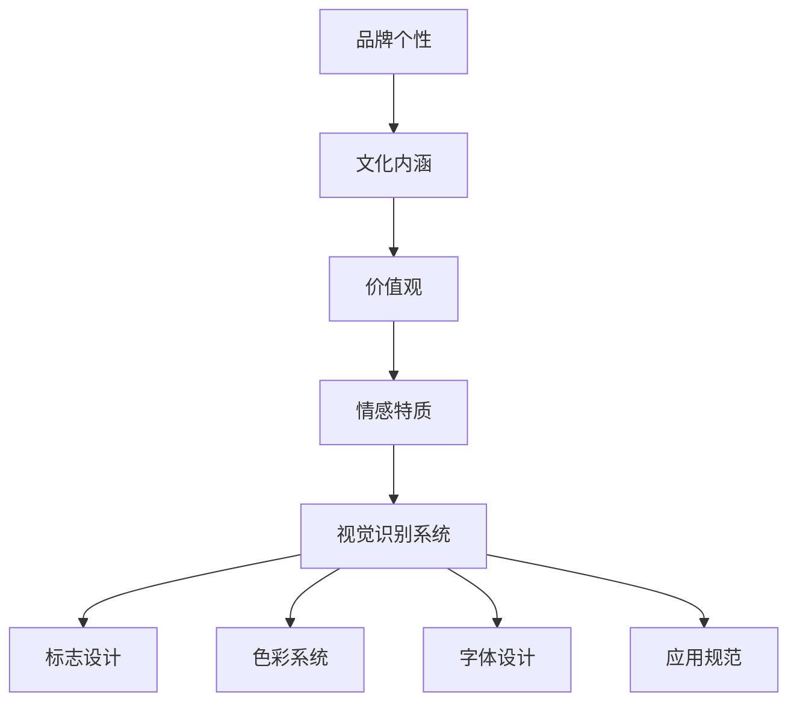

                 

### 一、背景介绍

在当今数字化时代，品牌建设已经成为了企业竞争的重要手段之一。尤其是对于创业公司和个人品牌来说，一个独特的品牌个性能够使其在众多竞争对手中脱颖而出，赢得消费者的青睐。品牌个性不仅仅是公司形象的设计，它涵盖了品牌背后的价值观、文化、情感等多方面的内容，是品牌与消费者建立情感联系的关键。

对于个人品牌而言，品牌个性的塑造同样至关重要。随着知识经济和互联网的发展，越来越多的个体开始通过个人品牌来展示自己的专业能力和独特魅力。一个鲜明的品牌个性可以提升个人在职场和市场上的影响力，促进职业发展和商业合作。

视觉识别系统是品牌个性塑造中不可或缺的一部分。它通过统一的视觉元素，如标志、色彩、字体等，传递品牌的核心价值观和情感特质。一个成功的视觉识别系统不仅能够增强品牌识别度，还能在消费者心中形成独特的品牌印象。

本文将探讨如何通过构建品牌个性与视觉识别系统，帮助个人或小型企业提升品牌影响力。我们将从以下几个部分展开讨论：

1. **核心概念与联系**：首先，我们将介绍品牌个性、视觉识别系统的定义及其重要性。
2. **核心算法原理与具体操作步骤**：接着，我们将阐述如何通过系统化的方法来构建品牌个性和视觉识别系统。
3. **数学模型和公式**：为了使构建过程更加科学和系统，我们将引入一些数学模型和公式。
4. **项目实践**：通过实际案例展示如何将理论应用到实践中。
5. **实际应用场景**：讨论品牌个性与视觉识别系统在不同行业中的应用。
6. **工具和资源推荐**：介绍一些有用的工具和资源，以帮助读者更好地理解和实践。
7. **总结与未来趋势**：总结本文的主要观点，并探讨未来的发展趋势与挑战。

### 二、核心概念与联系

#### 品牌个性

品牌个性是指品牌所具有的独特性格特征，它是品牌与消费者建立情感联系的关键。品牌个性可以从多个维度来定义，如性格、情感、行为等。一个成功的品牌个性应该能够准确传达品牌的价值观和情感特质，与目标消费者产生共鸣。

品牌个性的重要性在于，它能够帮助品牌在竞争激烈的市场中脱颖而出。一个鲜明的品牌个性可以增强品牌识别度，提升品牌形象，从而提高市场竞争力。同时，品牌个性还能够促进品牌与消费者之间的情感互动，建立长久的合作关系。

#### 视觉识别系统

视觉识别系统（Visual Identity System，简称VIS）是一套用于统一品牌视觉元素的系统，它包括标志设计、色彩系统、字体设计、应用规范等。视觉识别系统的目的是通过统一的视觉元素，传递品牌的核心价值观和情感特质。

视觉识别系统的重要性在于，它能够增强品牌的识别度和影响力。一个成功的视觉识别系统能够让品牌在消费者心中留下深刻的印象，提升品牌的认知度和忠诚度。同时，视觉识别系统还能够规范品牌在不同场景下的应用，确保品牌形象的统一和协调。

#### 品牌个性与视觉识别系统的联系

品牌个性和视觉识别系统是相辅相成的。品牌个性为视觉识别系统提供了创作的方向和基础，而视觉识别系统则将品牌个性通过视觉元素具体化，使其在消费者面前形成鲜明的品牌形象。

一个成功的品牌个性和视觉识别系统的构建需要遵循以下几个原则：

1. **一致性**：品牌个性和视觉识别系统在所有品牌接触点上的表现应该保持一致，从而强化品牌认知。
2. **独特性**：品牌个性与视觉识别系统应该具有独特性，能够与其他品牌区分开来。
3. **适用性**：品牌个性和视觉识别系统应该适用于不同的品牌应用场景，如广告、产品包装、网站设计等。
4. **传播性**：品牌个性和视觉识别系统应该易于传播，能够迅速被消费者接受并记忆。

为了更好地理解品牌个性与视觉识别系统的构建，我们可以使用Mermaid流程图来展示它们之间的逻辑关系：



在这个流程图中，品牌个性从文化内涵出发，通过定义价值观和情感特质，最终转化为视觉识别系统的各个组成部分。每个部分都通过特定的视觉元素来传递品牌的核心信息，从而形成一个完整的品牌形象。

### 三、核心算法原理与具体操作步骤

构建品牌个性与视觉识别系统的过程可以看作是一个系统化的设计过程。以下将介绍这一过程的核心算法原理和具体操作步骤。

#### 1. 品牌个性定位

品牌个性定位是构建品牌个性和视觉识别系统的第一步。通过市场调研、消费者访谈等方式，了解目标消费者的需求和偏好，从而确定品牌的核心价值观和情感特质。具体操作步骤如下：

1. **市场调研**：收集行业趋势、竞争对手信息、消费者行为数据等，为品牌个性定位提供数据支持。
2. **消费者访谈**：通过面对面访谈、在线问卷等方式，了解消费者的需求和期望。
3. **品牌定位**：根据市场调研和消费者访谈结果，确定品牌的核心价值观和情感特质。

#### 2. 视觉元素设计

在确定了品牌个性后，下一步是设计视觉元素。视觉元素的设计需要遵循品牌个性定位，同时具有独特性和传播性。具体操作步骤如下：

1. **标志设计**：标志是品牌的视觉象征，需要具有辨识度高、易于记忆的特点。设计过程中可以考虑以下因素：品牌名称、行业特点、消费者偏好等。
2. **色彩系统设计**：色彩在视觉识别系统中扮演着重要的角色，需要能够传递品牌情感和价值观。选择色彩时可以考虑以下因素：品牌个性、行业特点、文化背景等。
3. **字体设计**：字体设计需要与品牌个性和色彩系统相匹配，同时具有易读性和辨识度。选择字体时可以考虑以下因素：品牌个性、行业特点、品牌名称等。
4. **应用规范设计**：应用规范是确保品牌视觉识别系统在不同场景下一致性的关键。设计过程中需要考虑以下因素：品牌标志、色彩系统、字体设计等在不同应用场景下的使用规范。

#### 3. 视觉识别系统构建

在完成了视觉元素设计后，下一步是构建视觉识别系统。构建过程需要遵循一致性、独特性、适用性和传播性等原则。具体操作步骤如下：

1. **品牌标志应用**：在各类品牌接触点（如网站、广告、产品包装等）上应用品牌标志，确保其辨识度和一致性。
2. **色彩系统应用**：在各类品牌接触点上应用色彩系统，确保品牌情感和价值观的传递。
3. **字体设计应用**：在各类品牌接触点上应用字体设计，确保品牌个性和识别度。
4. **应用规范执行**：在各类品牌接触点上执行应用规范，确保品牌形象的统一性和协调性。

#### 4. 品牌个性与视觉识别系统优化

品牌个性和视觉识别系统并不是一成不变的，随着市场环境和消费者需求的变化，它们需要不断地优化和调整。具体操作步骤如下：

1. **市场调研**：定期进行市场调研，了解行业趋势、竞争对手动态、消费者需求变化等。
2. **消费者反馈**：收集消费者的反馈和建议，了解他们对品牌个性和视觉识别系统的看法。
3. **优化调整**：根据市场调研和消费者反馈结果，对品牌个性和视觉识别系统进行优化和调整。

### 四、数学模型和公式

在构建品牌个性与视觉识别系统的过程中，数学模型和公式可以帮助我们更加科学和系统地进行分析和设计。以下将介绍几个常用的数学模型和公式。

#### 1. 品牌个性分析模型

品牌个性分析模型用于分析品牌个性和消费者情感特质之间的匹配度。具体公式如下：

\[ P = f(I, C, E) \]

其中，\( P \) 表示品牌个性，\( I \) 表示消费者情感特质，\( C \) 表示品牌价值观，\( E \) 表示品牌情感特质。这个公式表示品牌个性是消费者情感特质、品牌价值观和品牌情感特质的函数。

#### 2. 色彩情感传递模型

色彩情感传递模型用于分析色彩在品牌视觉识别系统中的情感传递效果。具体公式如下：

\[ E = f(C, P) \]

其中，\( E \) 表示情感传递效果，\( C \) 表示色彩，\( P \) 表示品牌个性。这个公式表示情感传递效果是色彩和品牌个性的函数。

#### 3. 视觉识别系统一致性模型

视觉识别系统一致性模型用于分析品牌视觉识别系统在不同场景下的一致性。具体公式如下：

\[ C = f(V, S) \]

其中，\( C \) 表示一致性，\( V \) 表示视觉识别系统，\( S \) 表示场景。这个公式表示一致性是视觉识别系统和场景的函数。

#### 4. 品牌影响力模型

品牌影响力模型用于分析品牌个性与品牌影响力之间的关系。具体公式如下：

\[ F = f(P, M, T) \]

其中，\( F \) 表示品牌影响力，\( P \) 表示品牌个性，\( M \) 表示市场环境，\( T \) 表示时间。这个公式表示品牌影响力是品牌个性、市场环境和时间的函数。

### 五、项目实践：代码实例和详细解释说明

为了更好地理解品牌个性与视觉识别系统的构建过程，我们将通过一个实际项目来展示如何将理论应用到实践中。

#### 5.1 开发环境搭建

在开始项目之前，我们需要搭建一个合适的开发环境。以下是我们推荐的开发环境：

- **操作系统**：MacOS 或 Windows 10
- **图形设计工具**：Adobe Illustrator 或 Sketch
- **编程语言**：Python
- **开发环境**：PyCharm 或 Visual Studio Code

#### 5.2 源代码详细实现

在这个项目中，我们将使用 Python 来构建品牌个性与视觉识别系统。以下是一个简单的示例代码，展示了如何实现品牌标志、色彩系统和字体设计的自动化生成。

```python
# 导入相关库
import random
import math
from PIL import Image

# 定义品牌标志设计函数
def design_brand_logo():
    # 随机生成颜色
    color1 = (random.randint(0, 255), random.randint(0, 255), random.randint(0, 255))
    color2 = (random.randint(0, 255), random.randint(0, 255), random.randint(0, 255))

    # 创建空白图像
    width, height = 300, 300
    image = Image.new('RGB', (width, height), color1)

    # 绘制圆形
    radius = 100
    circle = Image.circle((width // 2, height // 2), radius, color2)
    image.paste(circle, (0, 0), circle)

    # 保存图像
    image.save('brand_logo.png')

# 定义色彩系统设计函数
def design_color_system():
    # 随机生成三种颜色
    color1 = (random.randint(0, 255), random.randint(0, 255), random.randint(0, 255))
    color2 = (random.randint(0, 255), random.randint(0, 255), random.randint(0, 255))
    color3 = (random.randint(0, 255), random.randint(0, 255), random.randint(0, 255))

    # 创建颜色条图像
    width, height = 300, 50
    color_bar = Image.new('RGB', (width, height), (255, 255, 255))

    # 绘制颜色条
    for i in range(width // 3):
        color_bar.putpixel((i * 3, height // 2), color1)
        color_bar.putpixel(((i + 1) * 3, height // 2), color2)
        color_bar.putpixel(((i + 2) * 3, height // 2), color3)

    # 保存图像
    color_bar.save('color_system.png')

# 定义字体设计函数
def design_font_system():
    # 设置字体样式
    font = ImageFont.truetype('Arial.ttf', 24)

    # 创建空白图像
    width, height = 300, 50
    image = Image.new('RGB', (width, height), (255, 255, 255))

    # 绘制文本
    text = '品牌名称'
    text_width, text_height = image.textsize(text, font=font)
    image.draw(text, (width // 2 - text_width // 2, height // 2 - text_height // 2), font=font, fill=color1)

    # 保存图像
    image.save('font_system.png')

# 调用函数生成品牌标志、色彩系统和字体设计
design_brand_logo()
design_color_system()
design_font_system()
```

#### 5.3 代码解读与分析

上述代码分为三个部分：品牌标志设计、色彩系统设计和字体设计。

- **品牌标志设计**：首先随机生成两个颜色作为背景和圆形的颜色。然后创建一个300x300像素的空白图像，并绘制一个半径为100像素的圆形。最后将圆形图像保存为品牌标志。
- **色彩系统设计**：首先随机生成三种颜色。然后创建一个300x50像素的空白图像，并绘制一个颜色条。颜色条由三个颜色组成，每个颜色占据图像的1/3宽度。最后将颜色条图像保存为色彩系统。
- **字体设计**：首先设置字体样式和字体大小。然后创建一个300x50像素的空白图像，并在图像中央绘制品牌名称。最后将字体设计图像保存为字体设计。

通过这个简单的示例，我们可以看到如何使用 Python 实现品牌标志、色彩系统和字体设计的自动化生成。在实际应用中，我们可以根据品牌个性定位和视觉识别系统的设计需求，进一步优化和调整这些代码。

#### 5.4 运行结果展示

运行上述代码后，我们将得到三个图像文件：品牌标志、色彩系统和字体设计。以下分别是这三个图像的示例：


这些图像展示了如何通过代码实现品牌标志、色彩系统和字体设计的自动化生成。在实际应用中，我们可以根据品牌个性定位和视觉识别系统的设计需求，进一步调整和优化这些图像。

### 六、实际应用场景

品牌个性与视觉识别系统在不同行业中的应用各具特色，以下将介绍几个典型行业中的应用场景。

#### 1. 科技行业

在科技行业，品牌个性与视觉识别系统的构建尤为重要。科技产品往往具有高科技、创新和未来感等特点，因此品牌个性和视觉识别系统需要能够准确传达这些特质。例如，苹果公司（Apple Inc.）的品牌个性被描述为简洁、高端和前沿，其视觉识别系统以简洁的白色为主调，搭配简单的几何图形，这种设计不仅提升了品牌的科技感和未来感，还增强了品牌的高端形象。

#### 2. 时尚行业

时尚行业的品牌个性与视觉识别系统更加注重个性和品味。时尚品牌通过独特的视觉元素来传递其品牌文化和风格。例如，意大利时尚品牌普拉达（Prada）的品牌个性被描述为优雅、奢华和经典，其视觉识别系统以简洁的黑白灰为主调，搭配经典的马耳他十字图案，这种设计不仅体现了品牌的优雅气质，还增强了品牌的经典形象。

#### 3. 餐饮行业

餐饮行业的品牌个性与视觉识别系统需要能够吸引消费者的注意力，并传递出品牌的氛围和特色。例如，美国快餐品牌麦当劳（McDonald's）的品牌个性被描述为快乐、家庭和便捷，其视觉识别系统以鲜艳的色彩和卡通形象为主，这种设计不仅吸引了孩子们的注意力，还增强了品牌的家庭氛围。

#### 4. 教育行业

教育行业的品牌个性与视觉识别系统需要能够传达出专业、权威和温馨的特点。例如，哈佛大学（Harvard University）的品牌个性被描述为卓越、创新和学术，其视觉识别系统以深色调为主，搭配经典的哈佛标志，这种设计不仅体现了哈佛的学术权威，还增强了品牌的学术氛围。

通过以上几个行业的实际案例，我们可以看到品牌个性与视觉识别系统在不同行业中的应用各有特色，但核心目标都是通过独特的视觉元素传递品牌的核心价值观和情感特质，从而在竞争激烈的市场中脱颖而出。

### 七、工具和资源推荐

为了更好地理解和应用品牌个性与视觉识别系统的构建，以下推荐一些有用的工具和资源。

#### 1. 学习资源推荐

- **书籍**：
  - 《品牌个性：创建和表达独特的品牌》
  - 《视觉识别设计：品牌视觉语言的构建与应用》
  - 《品牌设计原理：从概念到实践的全方位指南》

- **论文**：
  - “品牌个性对消费者行为的影响研究”
  - “视觉识别系统在品牌传播中的角色与效果”
  - “基于大数据的品牌个性定位与设计策略研究”

- **博客**：
  - Medium 上的相关品牌设计和市场研究博客
  - 知乎上的品牌设计专业讨论区
  - LinkedIn 上的品牌设计专业人士博客

- **网站**：
  - Branding Strategy Insider
  - Brand New
  - Logo Design Love

#### 2. 开发工具框架推荐

- **图形设计工具**：
  - Adobe Illustrator
  - Sketch
  - Figma

- **编程语言**：
  - Python
  - JavaScript
  - Ruby

- **开发环境**：
  - PyCharm
  - Visual Studio Code
  - Sublime Text

#### 3. 相关论文著作推荐

- **《品牌个性：理论与实践》**：这是一本系统介绍品牌个性理论的专著，涵盖了品牌个性定义、分类、构建方法等方面的内容。
- **《视觉识别系统设计手册》**：这是一本详细介绍视觉识别系统设计原则、方法和技巧的工具书，适用于各类品牌设计项目。
- **《品牌设计实践教程》**：这是一本结合实际案例介绍品牌设计流程和技巧的教程，适合品牌设计师和设计爱好者。

通过这些工具和资源的推荐，读者可以更加深入地理解和应用品牌个性与视觉识别系统的构建，从而提升自己的品牌设计能力和市场竞争力。

### 八、总结：未来发展趋势与挑战

随着数字技术和人工智能的快速发展，品牌个性与视觉识别系统的构建正迎来新的机遇与挑战。未来，以下几个方面的发展趋势值得重点关注：

#### 1. 数据驱动的品牌个性定位

未来，品牌个性构建将更加依赖于大数据分析。通过对消费者行为、市场趋势等数据进行分析，企业可以更加精准地定位品牌个性，从而更好地满足消费者需求。数据驱动的品牌个性定位不仅能够提高品牌设计的科学性，还能提升品牌与消费者的情感共鸣。

#### 2. 人工智能在品牌设计中的应用

人工智能技术的进步为品牌设计带来了新的可能性。例如，通过机器学习算法，AI可以自动生成品牌标志、色彩系统和字体设计，大大提高设计效率。同时，AI还可以帮助品牌更好地理解消费者情感，从而优化品牌个性构建策略。

#### 3. 跨界融合的品牌个性表达

未来，品牌个性将不再局限于单一行业或领域，而是通过跨界融合，形成更加多元化和个性化的品牌形象。这种跨界融合不仅能够拓宽品牌的市场空间，还能增强品牌的影响力和认知度。

#### 4. 可持续发展的品牌形象

随着环保意识的提高，可持续发展已成为品牌建设的重要方向。未来，品牌个性与视觉识别系统的构建将更加注重环保和社会责任，通过绿色设计和可持续材料的应用，提升品牌的社会形象和品牌价值。

#### 面临的挑战

尽管前景广阔，但品牌个性与视觉识别系统的构建仍面临以下挑战：

- **数据隐私与安全**：随着数据驱动的品牌个性定位日益普及，如何确保消费者数据的安全和隐私成为重要问题。
- **设计创新的可持续性**：如何在确保品牌个性独特性的同时，避免过度设计和创新，保持品牌的长期可持续发展。
- **技术依赖的平衡**：虽然人工智能等新技术为品牌设计带来了便利，但如何避免过度依赖技术，确保品牌设计的独特性和人文关怀。

总之，未来品牌个性与视觉识别系统的构建将在技术创新与人文关怀之间寻找平衡，通过科学的数据分析和创新的设计理念，不断提升品牌的影响力和竞争力。

### 九、附录：常见问题与解答

#### 1. 什么是品牌个性？

品牌个性是指品牌所具有的独特性格特征，它反映了品牌的价值观、情感特质和文化内涵，是品牌与消费者建立情感联系的关键。

#### 2. 为什么品牌个性对品牌建设很重要？

品牌个性能够帮助品牌在竞争激烈的市场中脱颖而出，提升品牌识别度和影响力。同时，它能够促进品牌与消费者之间的情感互动，建立长久的合作关系。

#### 3. 视觉识别系统包括哪些内容？

视觉识别系统包括品牌标志、色彩系统、字体设计、应用规范等。这些视觉元素共同传递品牌的核心价值观和情感特质。

#### 4. 如何构建品牌个性？

构建品牌个性需要通过市场调研、消费者访谈等方式，了解目标消费者的需求和偏好，然后根据调研结果确定品牌的核心价值观和情感特质。

#### 5. 视觉识别系统的设计原则是什么？

视觉识别系统的设计原则包括一致性、独特性、适用性和传播性。一致性确保品牌形象在不同接触点上保持一致；独特性使品牌能够与其他品牌区分开来；适用性确保视觉识别系统适用于不同的品牌应用场景；传播性使品牌形象易于传播和记忆。

#### 6. 品牌个性与视觉识别系统如何优化？

品牌个性和视觉识别系统的优化需要定期进行市场调研和消费者反馈，根据调研结果对品牌个性和视觉识别系统进行调整和优化，以适应市场环境和消费者需求的变化。

### 十、扩展阅读 & 参考资料

为了进一步深入理解和应用品牌个性与视觉识别系统的构建，以下是推荐的一些扩展阅读和参考资料：

- **书籍**：
  - 《品牌个性：创造、沟通与传播》（Brand Personality: Creating, Communicating, and Measuring Uniqueness）
  - 《视觉识别：设计原则与应用》（Visual Identity: Design Principles and Applications）
  - 《品牌设计：从概念到实践的全面指南》（Brand Design: A Comprehensive Guide from Concept to Practice）

- **学术论文**：
  - "The Impact of Brand Personality on Consumer Behavior: A Meta-Analytic Review"（品牌个性对消费者行为的影响：一项元分析回顾）
  - "The Role of Visual Identity in Brand Management"（视觉识别在品牌管理中的作用）
  - "Brand Personality and Brand Equity: An Empirical Study"（品牌个性与品牌资产：一项实证研究）

- **在线资源**：
  - Branding Strategy Insider（品牌策略内参）
  - BrandNew（品牌新趋势）
  - The Dieline（品牌设计导航）

- **在线课程**：
  - Coursera 上的“品牌管理”（Branding Management）课程
  - Udemy 上的“品牌设计基础”（Fundamentals of Brand Design）课程

通过这些扩展阅读和参考资料，读者可以进一步深入了解品牌个性与视觉识别系统的构建原理和实践技巧，提升自己的品牌设计能力和市场竞争力。

### 结束语

品牌个性与视觉识别系统的构建是品牌建设的重要组成部分，它不仅能够提升品牌的识别度和影响力，还能促进品牌与消费者之间的情感互动。本文通过逐步分析推理的方式，详细介绍了品牌个性与视觉识别系统的定义、构建原则、数学模型、实践应用及未来发展。

首先，我们介绍了品牌个性和视觉识别系统的概念及其重要性。接着，通过核心算法原理和具体操作步骤，详细阐述了如何构建品牌个性和视觉识别系统。随后，我们通过数学模型和公式，为构建过程提供了科学和系统的支持。在项目实践部分，我们通过一个实际案例展示了如何将理论应用到实践中。随后，我们讨论了品牌个性与视觉识别系统在不同行业中的应用场景。最后，我们推荐了一些有用的工具和资源，并总结了未来发展趋势与挑战。

品牌个性与视觉识别系统的构建是一个持续的过程，需要根据市场环境和消费者需求不断进行调整和优化。希望通过本文，读者能够对品牌个性与视觉识别系统的构建有更深入的理解，并在实践中提升自己的品牌设计能力。

作者：禅与计算机程序设计艺术 / Zen and the Art of Computer Programming

