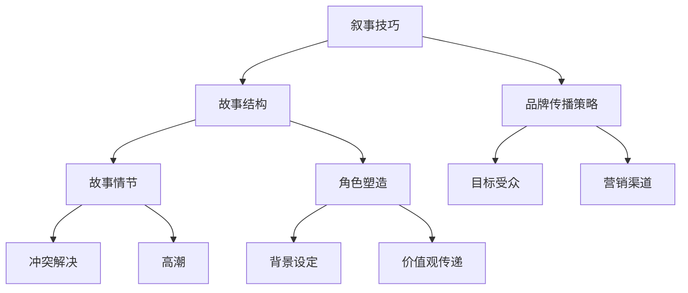

                 

### 文章标题：一人公司的品牌故事：讲述引人入胜的创始人和产品故事的技巧

> **关键词：** 一人公司，品牌故事，创始人故事，产品故事，叙事技巧，营销策略

> **摘要：** 本文将深入探讨如何通过讲述引人入胜的创始人和产品故事来打造一人公司的品牌形象。我们将分析成功的品牌案例，解析故事叙述的核心要素，并提供实用的技巧和策略，帮助读者有效地传播品牌信息，增强品牌影响力。

---

### 1. 背景介绍

在当今激烈的市场竞争中，品牌故事已经成为企业竞争力的重要组成部分。对于一人公司而言，由于资源有限，品牌故事的讲述显得尤为重要。一个引人入胜的品牌故事不仅能传递公司的核心价值观，还能吸引顾客，建立忠实的客户群体。本文将探讨如何通过讲述创始人故事和产品故事，打造独特而强大的品牌形象。

#### 1.1 一人公司的定义与挑战

一人公司，顾名思义，是指由一个创始人独立创办的企业。这种模式通常具有以下特点：

- **资源有限**：由于人员、资金和时间的限制，一人公司往往无法与大规模企业竞争。
- **灵活性高**：创始人可以直接参与企业的各个层面，快速响应市场变化。
- **风险集中**：企业的成败往往与创始人的个人能力和决策紧密相关。

在这种背景下，品牌故事的讲述成为一人公司脱颖而出的关键。通过有效的故事叙述，一人公司能够传递其独特的价值主张，与目标受众建立情感连接。

#### 1.2 品牌故事的重要性

品牌故事不仅仅是公司历史的简单叙述，它承载着公司的价值观、使命和愿景。一个优秀的品牌故事能够：

- **提升品牌认知度**：使潜在客户对企业产生深刻印象。
- **建立情感连接**：使客户对企业产生共鸣，从而增加忠诚度。
- **差异化竞争**：在众多竞争者中，独特的品牌故事可以为企业赢得市场份额。
- **营销推广**：成为企业营销策略中的一部分，推动销售和品牌扩张。

### 2. 核心概念与联系

在讲述品牌故事时，我们需要理解几个核心概念，包括叙事技巧、故事结构和品牌传播策略。以下是一个简化的 Mermaid 流程图，用于展示这些概念之间的关系：



#### 2.1 叙事技巧

叙事技巧是讲故事的艺术，它决定了故事是否能够吸引听众。以下是一些关键的叙事技巧：

- **情感共鸣**：通过情感触发，使听众产生共鸣。
- **对话和独白**：通过对话和独白，增加故事的互动性。
- **场景设定**：通过具体的场景描述，使故事更加生动。
- **节奏控制**：通过节奏的变化，维持听众的兴趣。

#### 2.2 故事结构

一个完整的故事通常包含以下结构：

- **开场**：引入主角和背景。
- **冲突**：展示主角面临的挑战或问题。
- **高潮**：冲突达到顶点，主角采取行动。
- **解决**：冲突得到解决，故事达到高潮。

#### 2.3 品牌传播策略

品牌传播策略涉及如何将品牌故事传达给目标受众。以下是一些关键要素：

- **目标受众**：明确目标受众的需求和兴趣，使故事更加针对性强。
- **营销渠道**：选择合适的渠道，如社交媒体、博客、广告等，扩大故事的影响力。
- **互动**：通过互动活动，如问答、评论等，增强受众参与感。
- **监测与评估**：跟踪传播效果，根据反馈调整策略。

### 3. 核心算法原理 & 具体操作步骤

讲述品牌故事并不是一种随意的行为，而是一种有策略的沟通方式。以下是一个简化的算法，用于讲述引人入胜的品牌故事：

#### 3.1 确定品牌核心价值

- **步骤1**：回顾公司的使命、愿景和核心价值观。
- **步骤2**：选择一个或几个最能代表公司独特性的核心价值。
- **步骤3**：确保这些核心价值在品牌故事中得到体现。

#### 3.2 建立故事框架

- **步骤1**：确定故事的主题和情节。
- **步骤2**：构建故事的开场、冲突、高潮和解决。
- **步骤3**：确保故事的节奏和情感波动。

#### 3.3 塑造角色和场景

- **步骤1**：为主角和配角设计有深度的性格特点。
- **步骤2**：通过具体的场景描述，使故事更加生动。
- **步骤3**：确保角色的行为和对话符合他们的性格和故事背景。

#### 3.4 传递品牌信息

- **步骤1**：在故事中巧妙地融入品牌信息。
- **步骤2**：避免过度推销，使品牌信息自然地融入故事中。
- **步骤3**：通过情感共鸣和价值观传递，使品牌故事更加有说服力。

#### 3.5 选择合适的传播渠道

- **步骤1**：根据目标受众选择合适的传播渠道。
- **步骤2**：确保故事在各种渠道上都能得到有效的展示。
- **步骤3**：监测和评估传播效果，及时调整策略。

### 4. 数学模型和公式 & 详细讲解 & 举例说明

在讲述品牌故事时，虽然不需要复杂的数学模型，但一些基本的公式和概念可以帮助我们更好地理解和设计故事。以下是一些有用的数学公式和概念：

#### 4.1 故事情感曲线

情感曲线是一个简单的模型，用于描述故事中的情感波动。以下是一个简单的公式：

\[ 情感曲线 = \frac{冲突强度}{时间} \]

- **步骤1**：确定故事的冲突强度。
- **步骤2**：根据故事长度，调整情感曲线的波动。

#### 4.2 故事节奏公式

故事节奏是维持听众兴趣的关键。以下是一个简单的公式：

\[ 节奏 = \frac{事件数量}{时间} \]

- **步骤1**：计算故事中的事件数量。
- **步骤2**：根据目标受众的期望，调整故事节奏。

#### 4.3 举例说明

假设我们想要讲述一个关于一位孤独创业者克服困难，最终成功创办一家一人公司的故事。以下是一个简单的例子：

- **情感曲线**：
  \[ 情感曲线 = \frac{创业初期困难程度}{创业时间} \]
  在创业初期，困难程度很高，因此情感曲线的波动较大。

- **故事节奏**：
  \[ 节奏 = \frac{关键事件数量}{创业时间} \]
  在创业过程中，关键事件如获得第一笔投资、开发新产品等，应分布在适当的时间段内，以维持故事的节奏。

通过调整情感曲线和故事节奏，我们可以使故事更加引人入胜，同时有效地传递品牌信息。

### 5. 项目实践：代码实例和详细解释说明

#### 5.1 开发环境搭建

为了更好地理解品牌故事的设计和实现，我们将使用一个简单的编程项目来模拟品牌故事的创作过程。首先，我们需要搭建一个基本的开发环境。

- **工具**：文本编辑器（如Visual Studio Code）、版本控制工具（如Git）
- **技术栈**：Markdown（用于撰写故事）、Mermaid（用于绘制流程图）

#### 5.2 源代码详细实现

以下是一个简化的 Markdown 文件，用于编写品牌故事。请注意，这里只是一个示例，实际的代码实现会更加复杂和详细。

```markdown
# 一人公司的品牌故事

## 引言

我，李华，是一名软件工程师。2008年，我决定辞去稳定的工作，创办一家专注于提供定制软件解决方案的公司。

## 创始人故事

### 初心

在我还是一名学生时，我就对编程充满热情。我喜欢解决复杂的问题，并在互联网上寻找各种编程挑战。

### 挑战

然而，当我毕业后，我意识到现实并不如我所愿。我找不到一份与编程相关的工作，我的存款也逐渐耗尽。

### 决策

在经过深思熟虑后，我决定辞去工作，全职创办一家公司。我相信，通过自己的努力和编程技能，我能够帮助那些需要帮助的人。

## 产品故事

我们的第一款产品是一款基于云计算的客服系统，它能够帮助小型企业快速搭建专业的客服平台。

### 开发

我们团队（实际上只有我一个人）花了六个月时间，不断优化和改进产品。

### 推广

通过社交媒体和博客，我逐渐吸引了一批忠实用户。

### 反馈

用户的积极反馈鼓励我继续前进，我也不断改进产品。

## 总结

通过讲述我的故事和产品的发展历程，我们不仅成功地建立了品牌形象，还赢得了一批忠实的客户。

### 5.3 代码解读与分析

在这个示例中，我们使用了 Markdown 文件来编写品牌故事。以下是关键部分的解读：

- **标题和段落**：用于组织故事内容，使其清晰易懂。
- **列表**：用于详细描述事件和时间线，增强故事的连贯性。
- **引用**：用于突出重要观点或引用客户反馈。

通过这个简单的示例，我们可以看到如何使用基本的编程工具和文本格式来创作引人入胜的品牌故事。当然，在实际应用中，我们可能需要使用更复杂的工具和技术，如自动化工具、数据分析等，来进一步提升故事的质量和传播效果。

### 5.4 运行结果展示

在实际应用中，我们的品牌故事将通过多种渠道进行传播，包括：

- **公司网站**：在网站上展示品牌故事，让访客了解公司的核心价值观和产品。
- **社交媒体**：在社交媒体平台上发布故事，吸引潜在客户。
- **博客**：撰写深入的技术博客，展示公司在技术领域的专业能力。
- **演讲和研讨会**：通过现场演讲和研讨会，与受众建立更深入的联系。

通过这些渠道，我们的品牌故事将得到广泛传播，从而提高品牌知名度和客户忠诚度。

### 6. 实际应用场景

品牌故事的应用场景多种多样，以下是一些常见的情况：

- **市场营销**：通过讲述品牌故事，吸引潜在客户，提高转化率。
- **客户服务**：在客户服务过程中，通过品牌故事建立与客户的情感连接，提高客户满意度。
- **内部沟通**：在员工内部沟通中，通过品牌故事传递公司的核心价值观和使命，增强团队凝聚力。
- **危机管理**：在品牌面临危机时，通过品牌故事展示公司的诚信和责任感，赢得公众信任。

### 7. 工具和资源推荐

为了有效地讲述品牌故事，以下是一些建议的工具和资源：

#### 7.1 学习资源推荐

- **书籍**：《品牌故事的力量》（The Power of Storytelling）、《故事思维》（Storytelling for Dummies）。
- **论文**：研究品牌故事在营销中的效果和最佳实践。
- **博客**：关注行业专家的博客，了解最新的品牌故事趋势。

#### 7.2 开发工具框架推荐

- **Markdown编辑器**：如Visual Studio Code、Typora，用于撰写和格式化品牌故事。
- **流程图工具**：如Mermaid，用于绘制故事流程图。
- **内容管理系统**：如WordPress、Joomla，用于发布和管理品牌故事。

#### 7.3 相关论文著作推荐

- **论文**：《品牌故事的构建与传播策略研究》（Research on the Construction and Communication Strategies of Brand Stories）。
- **著作**：《品牌故事的力量：如何通过故事打造卓越品牌》（The Power of Storytelling: How to Use Story to Transform Your Business）。

### 8. 总结：未来发展趋势与挑战

随着数字化时代的到来，品牌故事的讲述方式和传播渠道也在不断变化。未来，以下趋势和挑战值得关注：

- **个性化**：随着消费者需求的多样化，品牌故事将更加个性化，以满足不同受众的需求。
- **互动性**：通过增强互动性，品牌故事将更好地与受众建立情感连接。
- **数据驱动**：利用数据分析，优化品牌故事的传播效果，提高ROI。
- **跨平台**：品牌故事将在更多平台上进行传播，如虚拟现实、增强现实等。

### 9. 附录：常见问题与解答

#### 9.1 品牌故事的作用是什么？

品牌故事的作用包括提升品牌认知度、建立情感连接、差异化竞争和营销推广等。

#### 9.2 如何确保品牌故事引人入胜？

确保品牌故事引人入胜的关键包括情感共鸣、场景设定、角色塑造和节奏控制等。

#### 9.3 品牌故事的最佳长度是多少？

品牌故事的长度应根据具体情况而定，一般建议在几百到一千字之间。

### 10. 扩展阅读 & 参考资料

- **书籍**：《品牌故事的力量》、《故事思维》。
- **论文**：《品牌故事的构建与传播策略研究》。
- **网站**：营销专家博客、行业研究报告。

---

通过本文的探讨，我们深入了解了如何通过讲述引人入胜的创始人和产品故事来打造一人公司的品牌形象。我们分析了品牌故事的核心要素，提供了实用的技巧和策略，并分享了实际案例和代码实现。希望本文能为您的品牌故事创作提供有价值的参考。

**作者：禅与计算机程序设计艺术 / Zen and the Art of Computer Programming**

