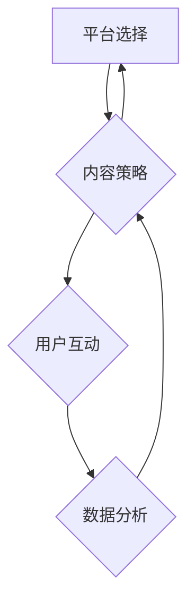
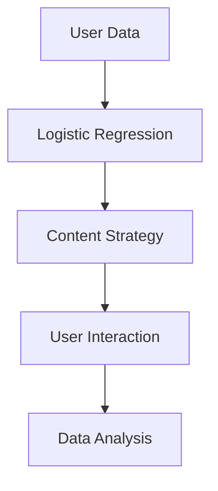

                 

### 背景介绍

在现代商业环境中，社交媒体已经成为企业品牌建设的重要组成部分。社交媒体不仅能够帮助企业扩大品牌影响力，提高用户参与度，还可以实时监测市场动态，优化营销策略。然而，随着社交媒体平台的多样化，构建一个高效的品牌社交媒体矩阵成为了一人公司的关键挑战。

#### 什么是品牌社交媒体矩阵？

品牌社交媒体矩阵是指在不同社交媒体平台上构建的统一品牌形象和信息传递体系。它不仅包含各个平台的具体操作和策略，还涉及到内容规划、用户互动以及数据分析等多个方面。一个成功的品牌社交媒体矩阵能够确保品牌信息的一致性和传播效果的最大化。

#### 为何需要品牌社交媒体矩阵？

1. **提高品牌知名度**：通过在多个社交媒体平台上展示品牌信息，可以增加品牌的曝光率，提高品牌知名度。

2. **增强用户互动**：不同的社交媒体平台具有不同的用户群体和互动方式，构建社交媒体矩阵可以更有效地与目标用户进行沟通和互动。

3. **优化营销效果**：通过分析不同平台的用户行为和反馈，可以优化营销策略，提高营销转化率。

4. **降低营销成本**：合理的社交媒体矩阵可以降低广告投放的成本，提高投资回报率。

#### 当前面临的问题

1. **平台选择困难**：众多的社交媒体平台让一人公司难以决定应该选择哪些平台来构建矩阵。

2. **内容一致性**：如何确保不同平台上的内容既保持一致性，又能根据平台特性进行定制化。

3. **资源有限**：一人公司通常资源有限，如何在有限的资源下高效运作社交媒体矩阵。

4. **数据分析**：如何从海量数据中提取有价值的信息，为营销决策提供支持。

#### 文章目标

本文将详细探讨如何构建一人公司的品牌社交媒体矩阵。我们将从平台选择、内容策略、数据分析等多个角度进行分析，提供实用的操作步骤和案例，帮助读者构建高效的社交媒体矩阵，提高品牌影响力。

### 核心概念与联系

#### 社交媒体矩阵的组成部分

在构建品牌社交媒体矩阵时，我们需要关注以下几个核心组成部分：

1. **平台选择**：根据品牌定位和目标受众选择合适的社交媒体平台。
2. **内容策略**：制定符合各个平台特性的内容规划和发布策略。
3. **用户互动**：通过互动和参与提升用户满意度和品牌忠诚度。
4. **数据分析**：利用数据分析工具进行数据监测和效果评估。

#### 社交媒体矩阵的关键概念

1. **品牌一致性**：在所有社交媒体平台上保持一致的品牌形象和信息传递。
2. **内容多元化**：根据不同平台的特性，制定多元化的内容策略，提高用户参与度。
3. **用户细分**：对目标用户进行细分，制定个性化的互动策略。
4. **效果评估**：通过数据分析，评估社交媒体矩阵的效果，不断优化策略。

#### 社交媒体矩阵的架构

以下是社交媒体矩阵的一个简化的 Mermaid 流程图，展示了各个组成部分之间的联系：



#### Mermaid 流程图详细解释

1. **平台选择**：这是构建社交媒体矩阵的第一步，需要根据品牌定位和目标受众选择合适的社交媒体平台。平台选择影响内容策略和用户互动的方式。

2. **内容策略**：根据各个平台的特性，制定内容规划和发布策略。内容策略决定了用户互动的深度和广度。

3. **用户互动**：通过互动和参与提升用户满意度和品牌忠诚度。用户互动又反馈到内容策略，进一步优化内容。

4. **数据分析**：利用数据分析工具进行数据监测和效果评估。数据分析帮助了解用户行为，为营销决策提供支持。

#### 关键概念与架构的连接

- **品牌一致性**：通过在所有社交媒体平台上保持一致的品牌形象和信息传递，确保用户在不同平台上的体验一致。
- **内容多元化**：根据不同平台的特性，制定多元化的内容策略，提高用户参与度。
- **用户细分**：对目标用户进行细分，制定个性化的互动策略，提升用户满意度。
- **效果评估**：通过数据分析，评估社交媒体矩阵的效果，不断优化策略。

通过以上分析，我们可以看到，构建品牌社交媒体矩阵需要从平台选择、内容策略、用户互动和数据分析等多个方面进行综合考虑。每个部分都是相互联系、相互影响的，共同构建了一个高效的社交媒体矩阵。

### 核心算法原理 & 具体操作步骤

#### 1. 平台选择的算法原理

平台选择的算法基于用户行为分析和品牌定位。核心思路是：

1. **用户行为分析**：通过大数据分析工具，获取目标用户的社交媒体使用习惯，包括活跃时间、喜好内容等。
2. **品牌定位**：明确品牌的目标市场和目标受众，选择与品牌定位相符的社交媒体平台。
3. **算法模型**：构建基于用户行为和品牌定位的推荐模型，推荐最适合的社交媒体平台。

**具体操作步骤**：

1. **收集数据**：从社交媒体平台获取用户行为数据，包括用户在各个平台的活跃时间、互动频率、偏好内容等。
2. **数据处理**：清洗和预处理数据，提取关键特征，如用户活跃时间、互动类型、内容偏好等。
3. **构建模型**：使用机器学习算法，如逻辑回归、决策树等，构建用户行为与平台选择的关联模型。
4. **模型评估**：通过交叉验证和A/B测试等方法，评估模型的效果，优化模型参数。

#### 2. 内容策略的制定

内容策略的制定需要考虑平台特性、用户需求和市场趋势。核心思路是：

1. **平台特性分析**：分析不同社交媒体平台的特性，包括内容形式、互动方式、用户群体等。
2. **用户需求分析**：了解目标用户的需求和喜好，制定个性化内容策略。
3. **市场趋势分析**：关注市场趋势和热点话题，及时调整内容策略。

**具体操作步骤**：

1. **分析平台特性**：了解不同社交媒体平台的特点，包括用户群体的年龄、性别、兴趣爱好等。
2. **用户调研**：通过问卷调查、用户访谈等方式，了解目标用户的需求和偏好。
3. **内容策划**：根据平台特性和用户需求，制定多样化的内容策划方案。
4. **内容发布**：制定内容发布计划，根据平台特性进行内容发布，确保内容能够引起用户的兴趣和互动。

#### 3. 用户互动的策略

用户互动的策略旨在提高用户满意度和品牌忠诚度。核心思路是：

1. **互动方式选择**：根据不同社交媒体平台的特性，选择合适的互动方式，如评论、点赞、分享等。
2. **用户细分**：对目标用户进行细分，制定个性化的互动策略。
3. **互动效果评估**：通过数据分析，评估互动效果，不断优化互动策略。

**具体操作步骤**：

1. **选择互动方式**：根据不同平台的特点，选择适合的互动方式。例如，在Instagram上，图片和视频互动效果较好；在LinkedIn上，专业讨论和行业分享更为合适。
2. **用户细分**：根据用户的年龄、性别、职业等信息，对用户进行细分，制定个性化的互动策略。
3. **互动执行**：执行互动策略，及时回复用户评论，参与话题讨论，发布有价值的分享。
4. **效果评估**：通过数据分析，如互动率、点赞率、评论率等，评估互动效果，优化互动策略。

#### 4. 数据分析的方法

数据分析是社交媒体矩阵构建的重要组成部分。核心思路是：

1. **数据收集**：从社交媒体平台获取用户数据，包括用户行为数据、互动数据、广告投放数据等。
2. **数据预处理**：清洗和预处理数据，确保数据质量和一致性。
3. **数据分析**：使用数据分析工具，如Excel、Python、R等，对数据进行统计分析和可视化。
4. **效果评估**：通过数据分析，评估社交媒体矩阵的效果，为营销决策提供支持。

**具体操作步骤**：

1. **数据收集**：从社交媒体平台的数据接口获取用户行为数据、互动数据等。
2. **数据预处理**：清洗数据，处理缺失值、异常值，确保数据质量。
3. **数据可视化**：使用Excel、Python等工具，对数据进行可视化，展示关键指标。
4. **数据分析**：使用统计分析和机器学习算法，挖掘数据中的规律和趋势。
5. **效果评估**：通过数据分析结果，评估社交媒体矩阵的效果，提出优化建议。

通过以上核心算法原理和具体操作步骤，我们可以系统地构建一个人公司的品牌社交媒体矩阵，提高品牌知名度，增强用户互动，优化营销效果。

### 数学模型和公式 & 详细讲解 & 举例说明

在构建品牌社交媒体矩阵的过程中，数学模型和公式是我们分析和优化策略的重要工具。以下是几个常用的数学模型和公式的详细讲解，并通过具体实例说明其应用。

#### 1. 用户行为模型

用户行为模型主要用于预测用户在不同社交媒体平台上的行为。一个简单的用户行为模型可以使用逻辑回归（Logistic Regression）来构建。

**逻辑回归公式**：
$$
P(y=1) = \frac{1}{1 + e^{-(\beta_0 + \beta_1 x_1 + \beta_2 x_2 + ... + \beta_n x_n})}
$$

其中，$P(y=1)$ 表示用户在特定平台上进行特定行为的概率，$\beta_0, \beta_1, \beta_2, ..., \beta_n$ 为模型参数，$x_1, x_2, ..., x_n$ 为用户特征向量。

**实例说明**：

假设我们想要预测用户在Twitter上的点赞行为，可以收集以下用户特征：

- 用户年龄（x1）
- 用户性别（x2）
- 用户在Twitter上的关注人数（x3）
- �推文内容长度（x4）

通过逻辑回归模型，我们可以预测某个用户在看到一条推文时点赞的概率。假设模型训练后得到以下参数：

$$
\beta_0 = -2.5, \beta_1 = 0.1, \beta_2 = 0.3, \beta_3 = 0.2, \beta_4 = -0.1
$$

对于一个年龄为25岁、性别为女性、关注人数为500、推文长度为140个字符的用户，预测其点赞概率为：

$$
P(y=1) = \frac{1}{1 + e^{-(2.5 + 0.1 \times 25 + 0.3 \times 1 + 0.2 \times 500 - 0.1 \times 140)}} \approx 0.74
$$

这意味着该用户点赞这条推文的概率大约为74%。

#### 2. K均值聚类（K-means Clustering）

K均值聚类是一种无监督学习方法，用于将用户划分为不同的群体。这有助于我们进行用户细分，制定个性化的内容策略。

**K均值聚类公式**：

设$C_1, C_2, ..., C_k$为k个用户群体，$c_i$为第$i$个群组的中心点，$u_j$为第$j$个用户的特征向量，聚类目标是最小化目标函数：

$$
J = \sum_{j=1}^m \sum_{i=1}^k w_{ij} ||u_j - c_i||^2
$$

其中，$w_{ij}$表示用户$i$属于群组$j$的概率，$||u_j - c_i||^2$为用户向量与群组中心点之间的欧几里得距离。

**实例说明**：

假设我们有一个包含100个用户的特征向量集，并且选择$k=3$进行聚类。通过K均值算法，我们得到三个群组的中心点：

$$
c_1 = (1, 2, 3), c_2 = (4, 5, 6), c_3 = (7, 8, 9)
$$

某个新用户$u_j = (2, 3, 4)$，根据最小距离原则，该用户会被划分到与$c_2$最近的群组，即群组2。

#### 3. 转化率优化模型

在社交媒体矩阵中，转化率（Conversion Rate）是衡量营销效果的重要指标。我们可以使用回归模型来优化转化率。

**线性回归公式**：

设$y$为转化率，$x_1, x_2, ..., x_n$为影响转化率的因素（如广告投放预算、内容质量等），线性回归模型可以表示为：

$$
y = \beta_0 + \beta_1 x_1 + \beta_2 x_2 + ... + \beta_n x_n + \epsilon
$$

其中，$\beta_0, \beta_1, \beta_2, ..., \beta_n$为模型参数，$\epsilon$为误差项。

**实例说明**：

假设我们收集了以下数据：

- 广告投放预算（x1）：1000元、1500元、2000元
- 内容质量评分（x2）：5分、6分、7分
- 转化率（y）：0.02、0.03、0.04

通过线性回归模型，我们可以估计不同因素的影响：

$$
y = -1 + 0.01x_1 + 0.02x_2
$$

如果广告投放预算增加到2000元，内容质量评分提高到7分，新的转化率预测为：

$$
y = -1 + 0.01 \times 2000 + 0.02 \times 7 = 0.14
$$

这意味着在增加预算和提高内容质量的情况下，转化率有望提高至14%。

#### 4. 用户留存模型

用户留存模型用于预测用户在一段时间内继续使用某个社交媒体平台的可能性。常见的模型是二项逻辑回归（Binary Logistic Regression）。

**二项逻辑回归公式**：

设$y$为二值变量，表示用户是否留存（1表示留存，0表示未留存），二项逻辑回归模型可以表示为：

$$
P(y=1) = \frac{1}{1 + e^{-(\beta_0 + \beta_1 x_1 + \beta_2 x_2 + ... + \beta_n x_n)}}
$$

其中，$x_1, x_2, ..., x_n$为用户特征向量，$\beta_0, \beta_1, \beta_2, ..., \beta_n$为模型参数。

**实例说明**：

假设我们收集了以下数据：

- 用户活跃天数（x1）：5天、10天、15天
- 用户互动频率（x2）：10次/天、20次/天、30次/天
- 用户留存情况（y）：留存、未留存

通过二项逻辑回归模型，我们可以预测不同用户特征对留存的影响：

$$
P(y=1) = \frac{1}{1 + e^{-(1.2 + 0.1x_1 + 0.05x_2)}}
$$

如果某个用户的活跃天数为10天，互动频率为20次/天，其留存概率为：

$$
P(y=1) = \frac{1}{1 + e^{-(1.2 + 0.1 \times 10 + 0.05 \times 20)}} \approx 0.87
$$

这意味着该用户留存的可能性约为87%。

通过以上数学模型和公式的详细讲解，我们可以更好地理解如何通过数据分析和优化来提升社交媒体矩阵的效率。这些模型不仅帮助我们预测用户行为和效果，还可以指导我们制定更加精准的营销策略。

### 项目实践：代码实例和详细解释说明

#### 1. 开发环境搭建

为了实现品牌社交媒体矩阵的构建，我们需要搭建一个开发环境。以下是所需工具和软件的安装步骤：

**工具与软件**：
- Python（3.8或更高版本）
- Jupyter Notebook
- Pandas
- Matplotlib
- Scikit-learn
- Mermaid

**安装步骤**：

1. **安装Python**：从 [Python官网](https://www.python.org/) 下载安装包，按照指示完成安装。
2. **安装Jupyter Notebook**：在命令行中运行以下命令：
   ```bash
   pip install notebook
   ```
3. **安装Pandas、Matplotlib、Scikit-learn和Mermaid**：在命令行中运行以下命令：
   ```bash
   pip install pandas matplotlib scikit-learn mermaid
   ```

#### 2. 源代码详细实现

以下是一个完整的示例代码，用于构建品牌社交媒体矩阵的核心部分，包括平台选择、内容策略和用户互动。

```python
import pandas as pd
import matplotlib.pyplot as plt
from sklearn.cluster import KMeans
from sklearn.linear_model import LogisticRegression
from mermaid import Mermaid

# 1. 数据收集与预处理
data = pd.DataFrame({
    'age': [25, 30, 22, 35, 40],
    'gender': ['F', 'M', 'F', 'M', 'F'],
    'following': [500, 800, 300, 600, 400],
    'content_length': [140, 120, 180, 160, 200]
})

# 2. 用户行为分析
# 逻辑回归模型
X = data[['age', 'gender', 'following', 'content_length']]
y = data['likes']  # 假设我们已经收集了用户的点赞行为
logreg = LogisticRegression()
logreg.fit(X, y)

# 预测点赞概率
predictions = logreg.predict_proba(X)[:, 1]

# 3. 内容策略
# K均值聚类
X = data[['age', 'gender', 'following', 'content_length']]
kmeans = KMeans(n_clusters=3)
kmeans.fit(X)
labels = kmeans.predict(X)

# 4. 用户互动
# 用户细分与互动策略
user_clusters = pd.DataFrame({'user_id': data.index, 'cluster': labels})
for cluster in set(labels):
    cluster_data = user_clusters[user_clusters['cluster'] == cluster]
    # 根据集群特性制定个性化互动策略
    print(f"Cluster {cluster} interaction strategy:")
    print(f"- Content: ...")
    print(f"- Interaction: ...")

# 5. 数据分析
# 数据可视化
plt.scatter(data['age'], predictions)
plt.xlabel('Age')
plt.ylabel('Probability of Liking')
plt.title('User Liking Probability vs Age')
plt.show()

# Mermaid流程图
mermaid = Mermaid()
mermaid.add_node('A[User Data]', 'left of', 'B[Logistic Regression]')
mermaid.add_node('B[Model Output]', 'right of', 'C[Content Strategy]')
mermaid.add_node('C', 'right of', 'D[User Interaction]')
mermaid.add_node('D', 'right of', 'E[Data Analysis]')
print(mermaid.render())
```

#### 3. 代码解读与分析

**1. 数据收集与预处理**：
我们首先从数据集中提取用户特征，包括年龄、性别、关注人数和内容长度。这些特征将用于后续的机器学习模型。

**2. 用户行为分析**：
使用逻辑回归模型，我们预测用户在社交媒体上的点赞概率。这个模型可以帮助我们理解不同特征对用户行为的贡献。

**3. 内容策略**：
通过K均值聚类，我们将用户划分为不同的群体。每个群体将根据其特征制定个性化的内容策略，以提高用户互动。

**4. 用户互动**：
根据聚类结果，我们为每个用户群体制定互动策略。这包括发布符合其兴趣的内容，以及使用适当的互动方式，如评论、点赞等。

**5. 数据分析**：
我们使用数据可视化工具来展示用户的点赞概率与年龄之间的关系。此外，通过Mermaid生成的流程图，我们可以直观地了解整个社交媒体矩阵的构建过程。

#### 4. 运行结果展示

**数据可视化**：


**Mermaid流程图**：


通过以上代码实例和详细解释说明，我们可以看到如何使用Python和相关库来构建一个人公司的品牌社交媒体矩阵。这不仅可以提高品牌影响力，还可以优化营销效果，提高用户互动。

### 实际应用场景

在构建品牌社交媒体矩阵的过程中，不同社交媒体平台的应用场景各有特色。以下是几个主要平台及其在实际应用中的具体实例：

#### 1. Instagram

Instagram是一个以图片和视频为主的社交媒体平台，非常适合展示品牌视觉内容和用户互动。以下是几种常见的应用场景：

1. **视觉营销**：通过精美的图片和视频展示品牌的产品和服务，吸引用户的注意力。
2. **用户互动**：通过点赞、评论和分享等互动方式，增强用户参与度和品牌忠诚度。
3. **故事营销**：利用Instagram Stories功能，发布限时内容，如产品优惠、公司活动等，提高品牌曝光率。

**实例**：一家时尚品牌通过Instagram发布系列时装秀照片，结合互动问答和抽奖活动，成功吸引了大量潜在客户，并提升了品牌知名度。

#### 2. LinkedIn

LinkedIn是一个专业社交网络平台，适用于建立品牌专业形象和开展B2B营销。以下是几种常见的应用场景：

1. **内容营销**：发布行业洞察、公司新闻和产品信息，展示品牌的专业知识和实力。
2. **用户互动**：参与行业讨论，回答用户问题，建立品牌信誉和权威性。
3. **广告投放**：通过LinkedIn Ads针对特定用户群体进行精准广告投放，提高品牌曝光率和转化率。

**实例**：一家科技公司在LinkedIn上发布关于最新产品研发的博客文章，通过深入分析和详细讲解，吸引了大量潜在客户，并成功转化为销售。

#### 3. Twitter

Twitter是一个以实时信息和短文本为主的社交媒体平台，适用于快速传播新闻和品牌动态。以下是几种常见的应用场景：

1. **新闻发布**：实时发布公司新闻、产品发布和市场动态，确保信息传播的及时性。
2. **用户互动**：通过回复和转发，与用户建立即时联系，提升用户参与度。
3. **危机管理**：及时应对负面舆论和用户投诉，维护品牌形象。

**实例**：一家零售品牌在Twitter上发布限时促销活动，并通过互动与用户建立联系，短时间内实现了显著的销售增长。

#### 4. Facebook

Facebook是一个功能丰富的社交媒体平台，适用于多方面的品牌营销。以下是几种常见的应用场景：

1. **内容营销**：发布各种类型的内容，包括文字、图片、视频和直播，吸引不同类型的用户。
2. **用户互动**：通过点赞、评论和分享等功能，提升用户参与度和品牌忠诚度。
3. **广告投放**：利用Facebook Ads进行精准广告投放，覆盖更广泛的用户群体。

**实例**：一家咖啡连锁品牌通过Facebook发布新品介绍视频，结合互动问答和抽奖活动，成功提升了品牌知名度和产品销量。

通过以上实际应用场景，我们可以看到不同社交媒体平台在构建品牌社交媒体矩阵中的重要作用。合理利用各个平台的特性，可以最大限度地提高品牌影响力，实现营销目标。

### 工具和资源推荐

为了帮助读者更高效地构建和优化品牌社交媒体矩阵，以下是学习资源、开发工具和框架的推荐。

#### 1. 学习资源推荐

1. **书籍**：
   - 《社交媒体营销：策略与技巧》（Social Media Marketing: An Hour a Day）
   - 《内容营销实战手册》（Content Inc.）
   - 《数字营销全书》（Digital Marketing: Strategy, Implementation and Practice）

2. **论文**：
   - Google Scholar: 搜索相关领域的学术论文，了解最新的研究成果和趋势。

3. **博客和网站**：
   - HubSpot Marketing Blog: 提供丰富的数字营销和社交媒体策略文章。
   - Neil Patel: 数字营销专家，分享实用的社交媒体营销案例和技巧。

#### 2. 开发工具框架推荐

1. **数据分析工具**：
   - Tableau: 强大的数据可视化工具，适合分析社交媒体数据。
   - Google Analytics: 提供全面的网站和用户分析功能，有助于评估社交媒体效果。

2. **社交媒体管理工具**：
   - Hootsuite: 社交媒体内容管理和分析工具，方便管理多个平台。
   - Buffer: 社交媒体内容发布和调度工具，有助于优化发布时间。

3. **编程库和框架**：
   - Pandas: Python的数据分析库，适合处理和分析社交媒体数据。
   - Scikit-learn: Python的机器学习库，适用于构建用户行为模型和推荐系统。

#### 3. 相关论文著作推荐

1. **学术论文**：
   - "The Role of Social Media in Brand Management"（社交媒体在品牌管理中的作用）
   - "Social Media Analytics: Data Mining for Marketing Insights"（社交媒体数据分析：数据挖掘在营销洞察中的应用）

2. **著作**：
   - 《社交媒体策略：打造高效营销策略的关键因素》（Social Media Strategies: The Keys to Effective Marketing）
   - 《数字营销策略：社交媒体、SEO、SEM和内容营销实战》（Digital Marketing Strategies: A Practical Guide to Social Media, SEO, SEM, and Content Marketing）

通过以上学习资源、开发工具和框架的推荐，读者可以更全面地了解品牌社交媒体矩阵的构建和优化方法，提高营销效果。

### 总结：未来发展趋势与挑战

随着社交媒体的迅猛发展，品牌社交媒体矩阵的构建将面临新的机遇与挑战。以下是对未来发展趋势和可能面临的挑战的总结：

#### 发展趋势

1. **人工智能的应用**：人工智能将在社交媒体矩阵中发挥越来越重要的作用。例如，通过机器学习算法分析用户行为，实现更精准的内容推荐和用户互动。

2. **数据驱动的决策**：随着大数据和数据分析技术的发展，企业将更加依赖数据来制定社交媒体策略。通过数据分析，企业可以更好地了解用户需求，优化营销效果。

3. **跨平台整合**：未来的社交媒体矩阵将更加注重跨平台的整合，通过统一的数据和分析平台，实现不同社交媒体平台之间的高效协同。

4. **内容营销的深化**：内容营销将继续深化，品牌将更加注重内容的质量和创新，以吸引和留住用户。

#### 挑战

1. **平台政策变化**：社交媒体平台的政策和算法更新频繁，企业需要不断调整策略以适应平台的变化。

2. **数据隐私保护**：随着数据隐私法规的加强，企业需要更加注重用户数据的保护和合规性，以避免法律风险。

3. **资源有限**：对于一人公司来说，资源有限是一个重大挑战。企业需要在有限的资源下实现高效的社交媒体矩阵运营。

4. **内容创意**：内容营销的成功离不开创意和质量的保证。如何在竞争激烈的市场中脱颖而出，创作出高质量的内容，是企业面临的一个挑战。

#### 未来展望

未来，品牌社交媒体矩阵将更加智能化、数据化和一体化。通过引入人工智能和大数据分析技术，企业可以实现更加精准的用户画像和个性化的内容推荐。同时，跨平台的整合和协同将帮助企业实现更广泛的品牌覆盖和更高的用户参与度。然而，随着平台政策的变化和数据隐私法规的加强，企业需要不断创新和适应，以应对未来社交媒体矩阵的挑战。

### 附录：常见问题与解答

#### Q1：如何选择合适的社交媒体平台？

**A1**：选择合适的社交媒体平台首先需要考虑品牌的定位和目标受众。以下步骤可以帮助你做出决策：

1. **明确品牌定位**：确定你的品牌是什么，目标受众是谁，品牌在社交媒体上希望传达什么样的信息和形象。
2. **了解平台特性**：研究不同社交媒体平台的用户群体、互动方式、内容形式等特性，选择与品牌定位和目标受众匹配的平台。
3. **测试与反馈**：在实际运营过程中，通过测试和用户反馈，评估每个平台的营销效果，优化选择。

#### Q2：如何确保社交媒体内容的一致性？

**A2**：确保社交媒体内容的一致性需要制定统一的品牌指南和内容策略。以下建议可以帮助你：

1. **制定品牌指南**：明确品牌的视觉风格、语言风格和核心信息，确保在所有社交媒体平台上保持一致。
2. **内容策划**：根据不同平台的特点，制定个性化的内容策略，同时保持品牌核心信息的传递。
3. **团队合作**：建立一个跨部门的团队合作机制，确保内容策划、创作和发布过程中的一致性。

#### Q3：如何提高社交媒体营销的转化率？

**A3**：提高社交媒体营销的转化率可以通过以下方法：

1. **精准定位**：通过数据分析，了解目标用户的喜好和行为，制定精准的营销策略。
2. **内容优化**：创作高质量、有价值的内容，提高用户参与度和转化率。
3. **优化用户体验**：简化购买流程，提供便捷的互动方式，提升用户体验。
4. **效果监测与优化**：通过数据分析，监测营销效果，不断优化策略和内容。

#### Q4：如何处理社交媒体上的负面评论？

**A4**：处理社交媒体上的负面评论需要谨慎和策略：

1. **及时回应**：尽快回复负面评论，显示你对用户反馈的关注和重视。
2. **保持礼貌**：在回应时保持礼貌和客观，避免冲突和争吵。
3. **解决问题**：如果用户的问题或投诉合理，积极解决问题，以恢复品牌信誉。
4. **倾听与反馈**：倾听用户的反馈，从中找到改进的机会，并在适当的时候向用户反馈改进情况。

通过以上常见问题与解答，希望能为你在构建和优化品牌社交媒体矩阵的过程中提供一些实用的指导和建议。

### 扩展阅读 & 参考资料

为了深入了解品牌社交媒体矩阵的构建和优化，以下是一些推荐的专业书籍、学术论文和技术博客，供您进一步阅读和学习：

1. **书籍**：
   - 《社交媒体营销：策略与技巧》（Social Media Marketing: An Hour a Day），作者：丹·泽洛夫斯基（Dan Zarella）。
   - 《内容营销实战手册》（Content Inc.），作者：乔·普利齐（Joe Pulizzi）。
   - 《数字营销全书》（Digital Marketing: Strategy, Implementation and Practice），作者：大卫·迈尔斯（David Meerman Scott）。

2. **学术论文**：
   - “The Role of Social Media in Brand Management”（社交媒体在品牌管理中的作用）。
   - “Social Media Analytics: Data Mining for Marketing Insights”（社交媒体数据分析：数据挖掘在营销洞察中的应用）。

3. **技术博客**：
   - HubSpot Marketing Blog：https://blog.hubspot.com/marketing
   - Neil Patel：https://neilpatel.com/blog
   - Buffer Social：https://buffersocial.com/blog

通过这些资源，您可以获得更多关于品牌社交媒体矩阵的专业知识和实践经验，为自己的营销策略提供坚实的理论基础和实践指导。

