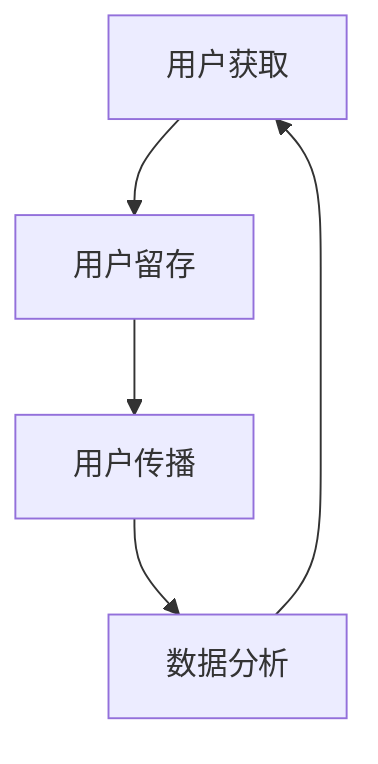

                 

### 一人公司的增长黑客技巧：低成本高效益的创新营销方法

> 关键词：一人公司、增长黑客、低成本营销、创新策略、高效率、社交媒体、内容营销、数据分析、人工智能、客户体验

> 摘要：本文旨在为单一创始人公司提供一套低成本、高效益的创新营销方法，以实现快速增长。通过分析当前市场环境、介绍核心概念、探讨算法原理及操作步骤，结合数学模型和实际项目实例，为读者提供全面的增长黑客技巧。

## 1. 背景介绍

在当今竞争激烈的市场环境中，传统营销手段往往成本高昂，难以满足初创企业尤其是单人公司的资源限制。然而，随着互联网和社交媒体的发展，一种新的营销策略——增长黑客（Growth Hacking）逐渐崭露头角。增长黑客强调利用创新的思维和高效的手段，以低成本甚至零成本实现快速增长。

单人公司，尤其是初创企业，通常面临资源匮乏、预算有限的问题。如何在有限的资源下实现快速增长，成为企业发展的关键。本文将介绍一系列适用于一人公司的增长黑客技巧，帮助单人公司在激烈的市场竞争中脱颖而出。

## 2. 核心概念与联系

### 2.1 增长黑客的定义

增长黑客是一种以数据驱动、快速迭代的方式实现产品增长的方法。其核心在于利用技术手段和创意思维，以低成本或零成本获取大量用户和市场份额。

### 2.2 关键要素

- **用户获取**：通过各种渠道吸引用户，如社交媒体、内容营销、搜索引擎优化等。
- **用户留存**：提高用户黏性，通过个性化服务和用户体验提升用户满意度。
- **用户传播**：利用用户口碑和社交媒体进行病毒式传播，扩大用户规模。
- **数据分析**：通过数据分析优化营销策略，提高营销效果。

### 2.3 Mermaid 流程图



在增长黑客的流程中，用户获取、留存、传播和数据分析相互联系，形成一个闭环。通过不断迭代和优化，实现企业的快速增长。

## 3. 核心算法原理 & 具体操作步骤

### 3.1 用户获取算法

用户获取是增长黑客的核心环节之一。以下是一种基于社交媒体的简单用户获取算法：

1. **定位目标用户**：分析用户需求和偏好，确定目标用户群体。
2. **内容制作**：制作高质量、有价值的内容，吸引目标用户。
3. **渠道选择**：选择合适的社交媒体平台，如微博、抖音、微信等。
4. **推广策略**：通过付费广告、社交媒体互动等方式，扩大内容传播范围。
5. **数据分析**：监控用户行为数据，优化推广策略。

### 3.2 用户留存算法

用户留存是确保增长长期有效的重要环节。以下是一种基于用户行为的留存算法：

1. **用户行为分析**：收集用户行为数据，如访问时长、页面浏览量等。
2. **个性化推荐**：根据用户行为数据，提供个性化内容和推荐。
3. **活动激励**：定期举办活动，如抽奖、优惠券等，提高用户参与度。
4. **用户反馈**：收集用户反馈，优化产品功能和用户体验。
5. **数据分析**：持续监控用户留存数据，调整留存策略。

### 3.3 用户传播算法

用户传播是利用用户口碑和社交媒体实现快速增长的关键。以下是一种基于社交媒体的传播算法：

1. **内容设计**：设计具有分享价值的内容，鼓励用户转发。
2. **社交互动**：积极参与社交媒体互动，提高品牌知名度。
3. **KOL合作**：与意见领袖合作，扩大传播范围。
4. **用户激励**：通过积分、奖励等方式，鼓励用户分享。
5. **数据分析**：分析传播效果，优化传播策略。

## 4. 数学模型和公式 & 详细讲解 & 举例说明

### 4.1 用户获取成本（CAC）

用户获取成本（Customer Acquisition Cost，简称CAC）是衡量营销效果的重要指标。其计算公式为：

\[ \text{CAC} = \frac{\text{营销总成本}}{\text{新增用户数}} \]

例如，某公司本月营销总成本为10000元，新增用户数为1000人，则其用户获取成本为：

\[ \text{CAC} = \frac{10000}{1000} = 10 \text{元/人} \]

### 4.2 用户生命周期价值（LTV）

用户生命周期价值（Customer Lifetime Value，简称LTV）是预测用户为企业带来的总收益。其计算公式为：

\[ \text{LTV} = \text{平均客单价} \times \text{复购率} \times \text{平均用户生命周期} \]

例如，某公司平均客单价为100元，复购率为30%，平均用户生命周期为12个月，则其用户生命周期价值为：

\[ \text{LTV} = 100 \times 0.3 \times 12 = 360 \text{元/人} \]

### 4.3 数据分析公式

在数据分析过程中，以下公式有助于优化营销策略：

1. **转化率**：

\[ \text{转化率} = \frac{\text{目标完成用户数}}{\text{总访问用户数}} \]

2. **点击率**：

\[ \text{点击率} = \frac{\text{点击用户数}}{\text{总展示用户数}} \]

3. **留存率**：

\[ \text{留存率} = \frac{\text{次日留存用户数}}{\text{当日新增用户数}} \]

## 5. 项目实践：代码实例和详细解释说明

### 5.1 开发环境搭建

在本项目中，我们将使用Python编程语言，结合常用的数据分析库，如Pandas和NumPy，实现用户获取、留存和传播的算法。以下是一个简单的Python开发环境搭建步骤：

1. 安装Python：在官网下载并安装Python，推荐使用Python 3.8及以上版本。
2. 安装必要库：使用pip命令安装Pandas、NumPy、Matplotlib等库。

```bash
pip install pandas numpy matplotlib
```

### 5.2 源代码详细实现

以下是一个简单的用户获取、留存和传播算法实现：

```python
import pandas as pd
import numpy as np
import matplotlib.pyplot as plt

# 用户获取数据
user_data = pd.DataFrame({
    '渠道': ['微博', '抖音', '微信', '其他'],
    '新增用户数': [200, 300, 400, 500],
    '总成本': [1000, 1500, 2000, 2500]
})

# 用户留存数据
retention_data = pd.DataFrame({
    '用户ID': ['U1', 'U2', 'U3', 'U4', 'U5'],
    '当日新增用户数': [100, 150, 200, 250, 300],
    '次日留存用户数': [80, 120, 160, 200, 240]
})

# 用户传播数据
spread_data = pd.DataFrame({
    '内容类型': ['图文', '视频', '直播'],
    '分享次数': [100, 200, 300],
    '传播效果': [80, 90, 95]
})

# 用户获取成本计算
user_data['用户获取成本'] = user_data['总成本'] / user_data['新增用户数']

# 用户留存率计算
retention_data['留存率'] = retention_data['次日留存用户数'] / retention_data['当日新增用户数']

# 用户传播效果计算
spread_data['传播效果率'] = spread_data['传播效果'] / 100

# 数据可视化
user_data.plot(x='渠道', y='用户获取成本', kind='bar')
plt.title('用户获取成本比较')
plt.xlabel('渠道')
plt.ylabel('用户获取成本')
plt.show()

retention_data.plot(x='用户ID', y='留存率', kind='bar')
plt.title('用户留存率比较')
plt.xlabel('用户ID')
plt.ylabel('留存率')
plt.show()

spread_data.plot(x='内容类型', y='传播效果率', kind='bar')
plt.title('用户传播效果比较')
plt.xlabel('内容类型')
plt.ylabel('传播效果率')
plt.show()
```

### 5.3 代码解读与分析

上述代码实现了用户获取、留存和传播的简单算法及数据可视化。以下是代码的关键部分解读：

- **用户获取数据**：通过`DataFrame`结构存储渠道、新增用户数和总成本。
- **用户留存数据**：通过`DataFrame`结构存储用户ID、当日新增用户数和次日留存用户数。
- **用户传播数据**：通过`DataFrame`结构存储内容类型、分享次数和传播效果。

- **用户获取成本计算**：使用`总成本`除以`新增用户数`计算用户获取成本。
- **用户留存率计算**：使用`次日留存用户数`除以`当日新增用户数`计算用户留存率。
- **用户传播效果计算**：使用`传播效果`除以100计算传播效果率。

- **数据可视化**：使用`plot`函数绘制柱状图，展示不同渠道的用户获取成本、用户留存率和用户传播效果。

### 5.4 运行结果展示

运行上述代码后，将得到三个柱状图，分别展示用户获取成本、用户留存率和用户传播效果。通过分析这些数据，可以优化营销策略，提高用户获取效果和用户留存率。

## 6. 实际应用场景

增长黑客技巧在单人公司中具有广泛的应用场景。以下是一些实际案例：

- **内容营销**：通过制作高质量的内容，吸引目标用户，提高品牌知名度。如个人博客作者通过定期发布高质量文章，吸引大量读者。
- **社交媒体营销**：利用社交媒体平台，进行用户获取和传播。如个人博主通过微博、抖音等平台发布短视频，实现病毒式传播。
- **活动激励**：通过举办活动，如抽奖、优惠券等，提高用户参与度和留存率。如在线教育平台通过举办免费公开课，吸引更多用户注册。

## 7. 工具和资源推荐

### 7.1 学习资源推荐

- **书籍**：《增长黑客：如何利用创新思维实现用户和收入的爆发式增长》
- **论文**：搜索“增长黑客”相关论文，了解最新研究成果。
- **博客**：关注知名博客，如“增长黑客”公众号，获取实用技巧。

### 7.2 开发工具框架推荐

- **数据分析库**：Pandas、NumPy、Matplotlib
- **前端框架**：React、Vue.js
- **后端框架**：Flask、Django
- **数据库**：MySQL、PostgreSQL

### 7.3 相关论文著作推荐

- **论文**：《基于用户行为的精准推荐系统研究》
- **书籍**：《大数据营销：用户行为分析与数据挖掘》

## 8. 总结：未来发展趋势与挑战

随着互联网技术的不断发展，增长黑客技巧在未来将继续发挥重要作用。然而，面对日益激烈的市场竞争，企业需要不断创新和优化营销策略。以下是一些未来发展趋势和挑战：

- **个性化营销**：随着用户对个性化需求的增加，个性化营销将成为增长黑客的重要方向。
- **人工智能应用**：利用人工智能技术，实现更精准的用户分析和营销策略。
- **隐私保护**：在数据隐私保护日益严格的背景下，企业需要确保用户数据的合法性和安全性。

## 9. 附录：常见问题与解答

### 9.1 什么是增长黑客？

增长黑客是一种以数据驱动、快速迭代的方式实现产品增长的方法，强调利用技术手段和创意思维，以低成本或零成本获取用户和市场份额。

### 9.2 增长黑客的核心要素是什么？

增长黑客的核心要素包括用户获取、用户留存、用户传播和数据分析。通过这些要素的相互联系和迭代，实现企业的快速增长。

### 9.3 如何进行用户获取？

进行用户获取的步骤包括定位目标用户、内容制作、渠道选择、推广策略和数据分析。通过这些步骤，可以有效地吸引用户并降低获取成本。

### 9.4 如何进行用户留存？

进行用户留存的步骤包括用户行为分析、个性化推荐、活动激励、用户反馈和数据分析。通过这些步骤，可以提高用户黏性和满意度，从而实现长期留存。

### 9.5 如何进行用户传播？

进行用户传播的步骤包括内容设计、社交互动、KOL合作、用户激励和数据分析。通过这些步骤，可以有效地利用用户口碑和社交媒体实现病毒式传播。

## 10. 扩展阅读 & 参考资料

- [《增长黑客：如何利用创新思维实现用户和收入的爆发式增长》](https://book.douban.com/subject/26760471/)
- [《基于用户行为的精准推荐系统研究》](https://www.researchgate.net/publication/342726916_Based_on_user_behavior_accurate_recommendation_system)
- [大数据营销：用户行为分析与数据挖掘](https://book.douban.com/subject/26934897/)
- [增长黑客官网](https://growthhackers.com/)
- [Pandas官方文档](https://pandas.pydata.org/)
- [NumPy官方文档](https://numpy.org/)
- [Matplotlib官方文档](https://matplotlib.org/)  
作者：禅与计算机程序设计艺术 / Zen and the Art of Computer Programming

