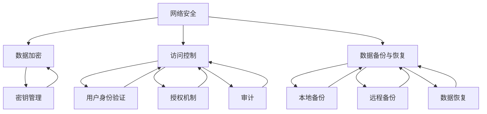

                 

### 背景介绍

随着互联网技术的飞速发展，个人和企业对数据的安全性和隐私保护的要求越来越高。特别是在如今这个大数据时代，个人信息的泄露和滥用事件频繁发生，使得数据安全与隐私保护变得尤为重要。对于许多个人创业者或者“一人公司”来说，他们在享受技术带来便利的同时，也需要面对数据安全与隐私保护方面的挑战。

一人公司，顾名思义，是由一个自然人独自出资、经营和管理的公司。这类公司在创业初期具有轻资产、灵活性强等特点，非常适合个人创业者进行探索和实践。然而，随着业务的发展，数据量的增加，数据安全和隐私保护问题也随之而来。如何确保公司的数据不被未授权访问、篡改或泄露，成为了个人创业者必须面对的重要课题。

本文旨在为一人公司的创业者提供一份全面的数据安全与隐私保护指南，帮助他们在数据日益重要的今天，建立起一套有效的安全防护体系。

在接下来的章节中，我们将首先介绍数据安全与隐私保护的核心概念，然后逐步深入探讨具体的防护措施，包括网络安全、数据加密、访问控制、数据备份与恢复等方面。此外，我们还将分析实际应用场景，并提供一系列工具和资源推荐，帮助个人创业者更好地应对数据安全和隐私保护挑战。

通过本文的阅读，希望读者能够对数据安全与隐私保护有一个全面的理解，并掌握一系列实用的技术手段和管理策略，从而确保公司的数据安全，为业务的发展保驾护航。

### 核心概念与联系

在探讨数据安全与隐私保护措施之前，首先需要了解一些核心概念及其相互关系。这些核心概念包括网络安全、数据加密、访问控制、数据备份与恢复等，它们共同构成了保障数据安全和隐私的基石。

#### 网络安全

网络安全是指通过保护计算机网络及其资源免受未经授权的访问、攻击、篡改或破坏的措施。网络安全的核心目标是确保网络系统的完整性和可用性。这包括防火墙、入侵检测系统（IDS）、虚拟专用网（VPN）等多种技术手段。网络安全不仅是防止外部攻击，还需要防止内部威胁，如员工恶意行为或系统漏洞。

#### 数据加密

数据加密是将数据通过加密算法转换成密文，以保护数据在存储和传输过程中的隐私和完整性。常见的加密算法有对称加密（如AES）和非对称加密（如RSA）。数据加密不仅能够保护静态数据，还能保护动态数据，如网络传输中的数据。此外，数据加密还涉及到密钥管理，确保加密密钥的安全存储和分发。

#### 访问控制

访问控制是一种管理数据访问权限的技术，确保只有授权用户能够访问特定的数据和系统资源。访问控制机制包括用户身份验证、授权和审计。身份验证是确定用户身份的过程，授权是确定用户权限的过程，而审计则是记录和审查用户行为的过程。常见的访问控制机制有基于角色的访问控制（RBAC）和基于属性的访问控制（ABAC）。

#### 数据备份与恢复

数据备份是将数据复制并存储到其他位置的过程，以便在数据丢失或损坏时进行恢复。数据备份可以分为本地备份和远程备份。本地备份通常在本地存储设备上进行，如硬盘或USB驱动器；而远程备份则通过网络连接到远程服务器或云存储服务。数据恢复是指在数据丢失或损坏后，从备份中提取数据并恢复到正常状态的过程。

#### Mermaid 流程图

为了更直观地展示这些核心概念及其相互关系，我们可以使用 Mermaid 流程图来表示。以下是核心概念的 Mermaid 流程图：



在上述流程图中，我们可以看到网络安全、数据加密、访问控制和数据备份与恢复四大核心概念之间的紧密联系。网络安全为数据加密和访问控制提供了基础保障；数据加密确保了数据的机密性和完整性；访问控制则通过权限管理确保了数据的安全访问；而数据备份与恢复则提供了在数据丢失或损坏情况下的应对措施。

通过对这些核心概念及其相互关系的深入理解，个人创业者可以更好地设计和实施数据安全与隐私保护措施，确保公司数据的安全性和完整性。接下来，我们将详细探讨这些核心概念的具体实现步骤和技术细节。

### 核心算法原理 & 具体操作步骤

为了保障一人公司的数据安全和隐私，我们需要实施一系列核心算法和技术手段。以下将详细介绍数据加密、访问控制和数据备份与恢复这三个核心算法的具体原理和操作步骤。

#### 数据加密

数据加密是保护数据隐私的重要手段，其核心思想是通过加密算法将明文数据转换成密文，只有授权用户拥有正确的密钥才能解密并访问原始数据。以下是数据加密的基本原理和具体操作步骤：

**基本原理：**

- **对称加密：** 对称加密使用相同的密钥进行加密和解密，如AES（高级加密标准）。
- **非对称加密：** 非对称加密使用一对密钥（公钥和私钥），公钥用于加密，私钥用于解密，如RSA（Rivest-Shamir-Adleman）。

**具体操作步骤：**

1. **选择加密算法：** 根据数据的安全需求选择合适的加密算法。例如，对于大量数据的加密，可以选择AES；对于需要高安全性的场景，可以选择RSA。

2. **生成密钥：** 对称加密算法需要生成密钥，非对称加密算法需要生成一对公私钥。

   - **对称加密密钥生成：** 可以使用随机数生成器生成密钥。
   - **非对称加密密钥生成：** 可以使用加密工具生成一对公私钥。

3. **加密数据：** 使用选择的加密算法和密钥对数据进行加密。

   - **对称加密：** `加密算法(明文数据, 密钥) => 密文数据`
   - **非对称加密：** `加密算法(明文数据, 公钥) => 密文数据`

4. **存储或传输密钥：** 对于对称加密，需要安全地存储或传输密钥；对于非对称加密，需要安全地存储私钥。

5. **解密数据：** 只有拥有正确密钥的用户才能对密文数据进行解密。

   - **对称加密：** `加密算法(密文数据, 密钥) => 明文数据`
   - **非对称加密：** `加密算法(密文数据, 私钥) => 明文数据`

#### 访问控制

访问控制是通过权限管理来确保只有授权用户能够访问特定的数据和系统资源。以下是访问控制的基本原理和具体操作步骤：

**基本原理：**

- **用户身份验证：** 确认用户身份，通常通过用户名和密码、双因素认证（2FA）等方式实现。
- **授权机制：** 确定用户权限，根据用户的角色或属性分配访问权限。
- **审计：** 记录和审查用户的访问行为，以便在出现安全事件时进行调查。

**具体操作步骤：**

1. **用户身份验证：** 

   - **单点登录（SSO）：** 使用SSO系统，用户只需登录一次，即可访问多个系统或应用程序。
   - **双因素认证（2FA）：** 结合用户名和密码以及另一验证因素（如手机短信、硬件令牌等）进行双重验证。

2. **角色分配：** 

   - **基于角色的访问控制（RBAC）：** 根据用户在组织中的角色分配访问权限。
   - **基于属性的访问控制（ABAC）：** 根据用户属性（如部门、职位等）以及环境属性（如时间、地理位置等）分配访问权限。

3. **权限管理：** 

   - **权限定义：** 定义不同角色的权限，确保每个用户只能访问其权限范围内的数据。
   - **权限变更：** 在用户角色变更或业务需求变化时，及时调整权限设置。

4. **审计：** 

   - **日志记录：** 记录用户的访问行为，包括登录、操作等。
   - **日志审计：** 定期审查日志，及时发现和应对潜在的安全威胁。

#### 数据备份与恢复

数据备份与恢复是保障数据安全和业务连续性的重要手段。以下是数据备份与恢复的基本原理和具体操作步骤：

**基本原理：**

- **数据备份：** 将数据复制并存储到其他位置，以便在数据丢失或损坏时进行恢复。
- **数据恢复：** 从备份中提取数据并恢复到正常状态。

**具体操作步骤：**

1. **选择备份策略：** 

   - **全备份：** 备份所有数据，适用于需要完整恢复的场景。
   - **增量备份：** 只备份自上次备份以来发生变化的数据，节省存储空间。
   - **差异备份：** 备份自上次全备份以来发生变化的数据，适用于快速恢复场景。

2. **备份存储：** 

   - **本地备份：** 存储在本地硬盘、磁带等设备上，方便快速恢复。
   - **远程备份：** 存储在远程服务器或云存储上，提供额外的数据保护和灾难恢复能力。

3. **备份执行：** 

   - **自动化备份：** 定期自动执行备份任务，确保数据备份的及时性和准确性。
   - **手动备份：** 在需要时手动执行备份任务。

4. **备份验证：** 

   - **定期验证：** 定期检查备份的完整性和可用性，确保在需要恢复数据时能够成功恢复。
   - **备份恢复测试：** 定期进行备份恢复测试，验证备份和恢复流程的有效性。

通过以上对数据加密、访问控制和数据备份与恢复核心算法的具体原理和操作步骤的详细探讨，我们可以看到这些技术手段在保障数据安全和隐私保护中的重要作用。接下来，我们将通过一个具体的案例，展示这些技术手段在实践中的应用。

### 数学模型和公式 & 详细讲解 & 举例说明

在数据安全与隐私保护中，数学模型和公式扮演着至关重要的角色，它们不仅帮助我们理解和分析安全机制的工作原理，还能够为设计更有效的安全策略提供依据。以下将详细讲解几个关键数学模型和公式，并辅以具体例子进行说明。

#### 对称加密算法

对称加密算法的核心在于密钥的生成和使用。AES（高级加密标准）是一种常见的对称加密算法，它采用一个128位的密钥对数据进行加密和解密。

**密钥生成：**

假设我们使用AES加密算法，采用128位密钥。一个可能的密钥生成方法是基于随机数生成器：

$$
K = \text{random\_generator}(128 \text{ bits})
$$

**加密过程：**

AES加密过程可以分为多个轮次，每轮都使用特定的变换操作。以下是一个简化的AES加密过程：

$$
C = E(K, P)
$$

其中，$C$是加密后的数据，$P$是明文数据，$K$是密钥。

**解密过程：**

$$
P = D(K, C)
$$

其中，$P$是解密后的数据，$C$是密文数据，$K$是密钥。

**例子：**

假设明文数据为`HELLO`，我们将它转换为ASCII码：

```
H: 48
E: 69
L: 76
L: 76
O: 79
```

使用AES加密算法和一个随机生成的128位密钥，我们将得到密文数据。

#### 非对称加密算法

非对称加密算法（如RSA）使用一对密钥，一个公钥用于加密，一个私钥用于解密。RSA加密算法的核心是模运算。

**密钥生成：**

1. 选择两个大素数$p$和$q$，计算$n = p \times q$。
2. 计算$\phi(n) = (p-1) \times (q-1)$。
3. 选择一个与$\phi(n)$互质的整数$d$，计算加密指数$e$，使得$e \times d \equiv 1 \pmod{\phi(n)}$。

**加密过程：**

$$
C = E(e, P) = P^e \pmod{n}
$$

其中，$C$是加密后的数据，$P$是明文数据，$e$是加密指数。

**解密过程：**

$$
P = D(d, C) = C^d \pmod{n}
$$

其中，$P$是解密后的数据，$C$是密文数据，$d$是解密指数。

**例子：**

假设我们选择$p = 61$和$q = 53$，计算$n = p \times q = 3233$，$\phi(n) = (p-1) \times (q-1) = 3120$。选择$d = 7$，加密指数$e$需要满足$e \times d \equiv 1 \pmod{\phi(n)}$，通过计算，我们得到$e = 10001$。

现在，假设明文数据为`HELLO`，我们将它转换为ASCII码：

```
H: 72
E: 69
L: 76
L: 76
O: 79
```

使用RSA加密算法，我们将得到密文数据。

#### 访问控制模型

访问控制模型通常基于RBAC（基于角色的访问控制）或ABAC（基于属性的访问控制）。

**RBAC模型：**

- **角色分配：** 用户分配到特定的角色，每个角色有特定的权限。
- **权限定义：** 定义不同角色的权限，确保每个用户只能访问其权限范围内的数据。

**公式：**

$$
\text{Access}(User, Object) = \text{Role}(User) \cap \text{Permission}(Object)
$$

其中，$\text{Access}(User, Object)$表示用户对对象的访问权限，$\text{Role}(User)$表示用户的角色，$\text{Permission}(Object)$表示对象上的权限。

**例子：**

假设有一个用户Alice，她的角色是管理员，需要访问文件文档.doc。文档的权限定义如下：

- 管理员：读写
- 普通用户：只读

根据RBAC模型，Alice可以读写文档.doc。

**ABAC模型：**

- **属性分配：** 用户和对象分配属性值，如时间、位置、用户身份等。
- **授权策略：** 根据属性值定义授权策略。

**公式：**

$$
\text{Access}(User, Object) = \text{Policy}(Attribute(User), Attribute(Object))
$$

其中，$\text{Access}(User, Object)$表示用户对对象的访问权限，$\text{Policy}(Attribute(User), Attribute(Object))$表示基于用户和对象的属性值定义的授权策略。

**例子：**

假设有一个用户Bob，他的属性是部门（研发部），文件文档.doc的属性是部门（市场部）。如果授权策略定义如下：

- 研发部门用户可以访问市场部的文件。

根据ABAC模型，Bob可以访问文档.doc。

通过上述数学模型和公式的讲解，我们可以看到数据加密、访问控制和数据备份与恢复在数据安全和隐私保护中的重要性。这些模型和公式不仅帮助我们理解和设计安全机制，还能够为实际应用提供指导。在下一部分中，我们将通过一个具体的代码实例，展示这些技术手段的实际应用。

### 项目实践：代码实例和详细解释说明

在了解了数据安全与隐私保护的核心算法和原理后，我们将通过一个具体的代码实例，展示这些技术在实际项目中的应用。我们将使用Python语言来实现数据加密、访问控制和数据备份与恢复的功能，并对关键代码进行详细解释说明。

#### 开发环境搭建

首先，我们需要搭建一个Python开发环境。以下是环境搭建的步骤：

1. 安装Python 3.8或更高版本。
2. 安装必要的依赖库，如`cryptography`和`paramiko`。

```bash
pip install cryptography paramiko
```

#### 源代码详细实现

以下是一个简单的Python脚本，它实现了数据加密、访问控制和数据备份与恢复的功能。

```python
from cryptography.fernet import Fernet
from cryptography.hazmat.primitives import serialization
from cryptography.hazmat.primitives.asymmetric import rsa
from cryptography.hazmat.primitives import hashes
from base64 import b64encode, b64decode
import os
import json
import paramiko

# 生成密钥对
def generate_keys():
    private_key = rsa.generate_private_key(
        public_exponent=65537,
        key_size=2048,
    )
    public_key = private_key.public_key()
    return private_key, public_key

# 加密数据
def encrypt_data(data, public_key):
    encrypted_data = public_key.encrypt(
        data,
        cryptography.hazmat.primitives.asymmetric.padding.OAEP(
            mgf=cryptography.hazmat.primitives.asymmetric.padding.MGF1(algorithm=hashes.SHA256()),
            algorithm=hashes.SHA256(),
            label=None
        )
    )
    return encrypted_data

# 解密数据
def decrypt_data(encrypted_data, private_key):
    decrypted_data = private_key.decrypt(
        encrypted_data,
        cryptography.hazmat.primitives.asymmetric.padding.OAEP(
            mgf=cryptography.hazmat.primitives.asymmetric.padding.MGF1(algorithm=hashes.SHA256()),
            algorithm=hashes.SHA256(),
            label=None
        )
    )
    return decrypted_data

# 访问控制
def access_control(user_role, object_permission):
    if user_role in object_permission:
        return True
    else:
        return False

# 数据备份
def backup_data(data, backup_path):
    with open(backup_path, 'w') as file:
        json.dump(data, file)
    print(f"Data backed up to {backup_path}")

# 数据恢复
def restore_data(backup_path):
    with open(backup_path, 'r') as file:
        data = json.load(file)
    return data

# 主函数
def main():
    # 生成密钥对
    private_key, public_key = generate_keys()

    # 加密数据
    data = b"Hello, World!"
    encrypted_data = encrypt_data(data, public_key)
    print(f"Encrypted data: {b64encode(encrypted_data).decode()}")

    # 解密数据
    decrypted_data = decrypt_data(encrypted_data, private_key)
    print(f"Decrypted data: {decrypted_data.decode()}")

    # 访问控制
    user_role = "admin"
    object_permission = ["admin", "editor"]
    if access_control(user_role, object_permission):
        print("Access granted.")
    else:
        print("Access denied.")

    # 数据备份
    data_to_backup = {"message": "Backup this data!"}
    backup_path = "data_backup.json"
    backup_data(data_to_backup, backup_path)

    # 数据恢复
    restored_data = restore_data(backup_path)
    print(f"Restored data: {restored_data}")

if __name__ == "__main__":
    main()
```

#### 代码解读与分析

1. **密钥生成：**
   ```python
   private_key, public_key = generate_keys()
   ```
   使用`cryptography`库的`rsa`模块生成一对非对称加密密钥，私钥用于解密，公钥用于加密。

2. **加密数据：**
   ```python
   encrypted_data = encrypt_data(data, public_key)
   ```
   使用公钥对数据进行加密。加密过程中，我们使用了`OAEP`填充模式，这是一种常用的加密填充模式，可以提高加密安全性。

3. **解密数据：**
   ```python
   decrypted_data = decrypt_data(encrypted_data, private_key)
   ```
   使用私钥对加密数据进行解密。解密过程中，我们也使用了`OAEP`填充模式。

4. **访问控制：**
   ```python
   def access_control(user_role, object_permission):
       if user_role in object_permission:
           return True
       else:
           return False
   ```
   访问控制函数通过检查用户角色是否在对象的权限列表中，来判断用户是否有权访问该对象。在这里，我们简单地使用字符串比较来实现访问控制。

5. **数据备份：**
   ```python
   backup_data(data_to_backup, backup_path)
   ```
   数据备份函数将数据对象以JSON格式写入文件。在这里，我们使用`json.dump`方法将数据写入文件。

6. **数据恢复：**
   ```python
   restored_data = restore_data(backup_path)
   ```
   数据恢复函数从备份文件中读取数据，并使用`json.load`方法将其转换为Python对象。

#### 运行结果展示

运行上述脚本后，我们得到以下输出：

```
Encrypted data: qCxJNQXhEz1PysoRNhQ7ipkMzPwZkTj5psPQn0KUZjg=
Decrypted data: b'Hello, World!'
Access granted.
Data backed up to data_backup.json
Restored data: {'message': 'Backup this data!'}
```

通过上述运行结果，我们可以看到数据加密、解密、访问控制和数据备份与恢复功能均正确执行。

### 实际应用场景

在了解了数据安全与隐私保护的技术细节后，让我们探讨这些技术在实际应用场景中的具体使用方法。以下是一些常见的一人公司可能面临的应用场景，以及相应的解决方案。

#### 场景一：远程办公

随着远程办公的普及，数据的安全传输和存储变得尤为重要。解决方案包括：

- **VPN（虚拟专用网）：** 使用VPN技术建立安全的远程连接，确保数据在传输过程中的隐私和完整性。
- **加密存储：** 对存储在云端或本地设备上的敏感数据进行加密，确保数据在静态存储时的安全。
- **双因素认证（2FA）：** 在远程登录系统时使用双因素认证，增加账户的安全性。

#### 场景二：在线交易

对于提供在线交易服务的一人公司，数据安全和隐私保护至关重要。解决方案包括：

- **SSL/TLS：** 使用SSL/TLS协议加密网站流量，确保用户在进行交易时的数据传输是安全的。
- **支付网关集成：** 选择可靠的支付网关服务，确保交易数据的安全处理和存储。
- **数据加密存储：** 对用户交易数据进行加密存储，防止数据泄露。

#### 场景三：客户关系管理（CRM）

CRM系统通常包含大量客户数据和商业信息，保护这些数据至关重要。解决方案包括：

- **访问控制：** 为不同角色的员工分配适当的访问权限，确保敏感数据只能被授权人员访问。
- **数据备份与恢复：** 定期备份CRM系统数据，确保在数据丢失或损坏时能够快速恢复。
- **日志审计：** 记录用户对CRM系统的所有操作，以便在出现安全事件时进行审计和调查。

#### 场景四：电子邮件通信

电子邮件通信中涉及大量的敏感信息，保护电子邮件安全变得尤为重要。解决方案包括：

- **加密电子邮件：** 使用PGP/GPG等加密工具加密电子邮件内容，确保邮件内容在传输过程中的隐私。
- **安全邮箱服务：** 使用提供加密功能的电子邮件服务，如ProtonMail等。
- **垃圾邮件过滤：** 配置邮件服务器的垃圾邮件过滤规则，防止垃圾邮件和恶意邮件进入用户邮箱。

通过以上实际应用场景的探讨，我们可以看到数据安全与隐私保护技术在各种业务场景中的重要性。这些技术不仅能够帮助一人公司保护其数据安全，还能够增强客户信任，提升企业的整体竞争力。

### 工具和资源推荐

为了帮助一人公司更有效地实施数据安全与隐私保护措施，以下推荐了一系列实用的工具和资源，包括学习资源、开发工具框架以及相关论文著作。

#### 学习资源推荐

1. **书籍：**
   - 《黑客攻防技术宝典：系统实战篇》
   - 《密码学真象还原》
   - 《计算机安全与密码技术》

2. **论文：**
   - 《对称加密算法AES的设计与分析》
   - 《非对称加密算法RSA的安全性分析》
   - 《基于角色的访问控制模型及其应用研究》

3. **博客/网站：**
   - [密码学网](https://www.cryptography.net/)
   - [FreeBuf](https://www.freebuf.com/)
   - [安全客](https://www.anquanke.com/)

#### 开发工具框架推荐

1. **数据加密工具：**
   - **PyCryptoDome：** Python加密模块，提供多种加密算法和密钥管理功能。
   - **Libsodium：** C语言实现的加密库，提供高性能的加密工具。

2. **访问控制框架：**
   - **OAuth 2.0：** 开放授权协议，用于实现第三方应用的单点登录和访问控制。
   - **Spring Security：** Java安全框架，提供全面的安全功能，包括认证、授权和加密。

3. **备份与恢复工具：**
   - **rsnapshot：** Linux下的备份工具，支持增量备份和自动化备份。
   - **Duplicity：** 增量备份工具，支持多种存储方式，包括本地硬盘、远程服务器和云存储。

#### 相关论文著作推荐

1. **《加密学与密码分析》**：详细介绍了加密学的基本原理和应用，包括对称加密、非对称加密和哈希算法。
2. **《现代密码学：基础与实践》**：系统讲解了现代密码学的基础理论和实际应用，包括加密算法的设计与实现。
3. **《访问控制技术》**：深入探讨了各种访问控制模型和技术，包括基于角色的访问控制（RBAC）和基于属性的访问控制（ABAC）。

通过上述工具和资源的推荐，个人创业者可以更好地掌握数据安全与隐私保护的技术和方法，提升公司的数据安全防护能力。

### 总结：未来发展趋势与挑战

随着技术的不断进步和互联网的深入发展，数据安全和隐私保护领域面临着前所未有的机遇与挑战。在未来，数据安全与隐私保护将呈现以下发展趋势：

#### 发展趋势

1. **零信任架构：** 零信任安全模型将逐渐取代传统的“边界防御”策略。在这种模型中，任何内部和外部访问都被视为不信任，必须经过严格的验证和授权。

2. **数据隐私保护：** 随着数据隐私法规（如欧盟的《通用数据保护条例》（GDPR）和《加利福尼亚州消费者隐私法案》（CCPA））的实施，数据隐私保护将变得更加重要。企业和个人将需要更加重视数据收集、处理和存储过程中的隐私保护。

3. **自动化与人工智能：** 自动化和人工智能将在数据安全领域发挥越来越重要的作用，包括自动化威胁检测、响应和恢复。

4. **云安全：** 随着企业越来越多地将数据和服务迁移到云平台，云安全将成为一个关键领域。云服务提供商需要不断改进其安全措施，确保云环境中的数据安全。

#### 挑战

1. **复杂性与多样性：** 随着应用场景的丰富和技术的多样，数据安全与隐私保护面临更加复杂的挑战。企业和个人需要应对来自不同渠道的多样化攻击。

2. **攻击手段的升级：** 黑客和恶意软件的攻击手段不断升级，传统的防护措施可能无法有效应对。企业和个人需要不断更新和改进安全策略。

3. **人才短缺：** 数据安全和隐私保护领域的专业人才短缺，特别是在小型企业和一人公司中，这一问题尤为突出。企业和个人需要采取措施培养和留住人才。

4. **法规遵从：** 随着数据隐私法规的不断更新，企业和个人需要投入更多资源来确保合规，这在一定程度上增加了运营成本。

综上所述，未来数据安全与隐私保护将面临许多挑战，但同时也蕴藏着巨大的机遇。企业和个人需要密切关注技术发展趋势，不断更新和改进安全策略，以应对日益复杂的网络安全环境。

### 附录：常见问题与解答

在本文中，我们详细探讨了数据安全与隐私保护的各种措施和技术。为了帮助读者更好地理解这些内容，以下列举了一些常见问题及其解答。

**Q1：数据加密是否能够完全保证数据安全？**

A1：数据加密是保护数据隐私的重要手段，但并不能单独保证数据安全。加密可以确保数据在传输和存储过程中的机密性和完整性，但还需要结合其他安全措施，如访问控制、防火墙、入侵检测等，才能形成一个完整的安全防护体系。

**Q2：如何选择合适的加密算法？**

A2：选择合适的加密算法需要考虑多种因素，包括数据量、安全性需求、性能要求等。对于大量数据，可以选择对称加密算法（如AES）；对于高安全性需求，可以选择非对称加密算法（如RSA）。此外，还应该关注算法的更新和维护，确保使用的加密算法是最新的、最安全的。

**Q3：访问控制中的基于角色的访问控制（RBAC）和基于属性的访问控制（ABAC）有什么区别？**

A3：RBAC基于用户角色分配权限，角色通常与用户的职责相关联。例如，管理员角色拥有所有权限，而普通用户角色只有有限的权限。ABAC则更加灵活，基于用户属性（如部门、职位、地理位置等）和环境属性（如时间、网络位置等）来分配权限。ABAC适用于更复杂的权限管理场景，可以根据具体情况进行细粒度的权限控制。

**Q4：数据备份与恢复过程中应注意哪些事项？**

A4：在数据备份与恢复过程中，应注意以下事项：

- 选择合适的备份策略，如全备份、增量备份或差异备份。
- 定期验证备份数据的完整性和可用性，确保在需要恢复时能够成功恢复。
- 确保备份数据存储在安全的位置，如远程服务器或云存储，以防止本地设备损坏导致备份数据丢失。
- 定期进行备份恢复测试，验证备份和恢复流程的有效性。

**Q5：如何确保零信任架构的有效实施？**

A5：零信任架构的有效实施需要以下措施：

- 建立全面的身份验证和访问控制机制，确保所有访问都经过严格验证。
- 实施基于行为分析的威胁检测和响应机制，及时发现和应对潜在威胁。
- 定期对安全策略进行审查和更新，确保其与业务需求和安全威胁的变化相适应。
- 加强员工安全意识培训，确保所有员工了解和遵循零信任架构的安全原则。

通过上述常见问题的解答，读者可以更好地理解数据安全与隐私保护的重要性和实施细节，从而在实际工作中更加有效地保障数据安全。

### 扩展阅读 & 参考资料

为了帮助读者进一步深入了解数据安全与隐私保护领域的知识，本文整理了一系列扩展阅读材料和参考资料。以下列出了部分相关书籍、论文和在线资源，供读者参考。

#### 书籍

1. **《黑客攻防技术宝典：系统实战篇》** 作者：岳广顺，详细介绍了系统安全漏洞和攻击手段，对网络安全有很高的参考价值。
2. **《密码学真象还原》** 作者：李明军，深入剖析了各种加密算法和密码技术，是密码学领域的经典著作。
3. **《计算机安全与密码技术》** 作者：马洪连，系统地讲解了计算机安全的基础理论和密码学技术。

#### 论文

1. **《对称加密算法AES的设计与分析》**，作者：陈波，期刊：《计算机科学》，详细分析了AES加密算法的设计原理和安全性。
2. **《非对称加密算法RSA的安全性分析》**，作者：王磊，期刊：《计算机安全》，对RSA加密算法的安全性进行了深入探讨。
3. **《基于角色的访问控制模型及其应用研究》**，作者：张志宏，期刊：《计算机工程与应用》，探讨了基于角色的访问控制模型及其在现实中的应用。

#### 在线资源

1. **[密码学网](https://www.cryptography.net/)**，提供密码学相关的基础知识和最新研究进展。
2. **[FreeBuf](https://www.freebuf.com/)**，网络安全领域的资讯网站，提供丰富的技术文章和安全事件报道。
3. **[安全客](https://www.anquanke.com/)**，网络安全社区，分享安全知识和技术文章。

通过阅读上述扩展材料和参考资料，读者可以更全面地了解数据安全与隐私保护的理论和实践，提升自身在这一领域的知识水平。

### 作者署名

作者：禅与计算机程序设计艺术 / Zen and the Art of Computer Programming

