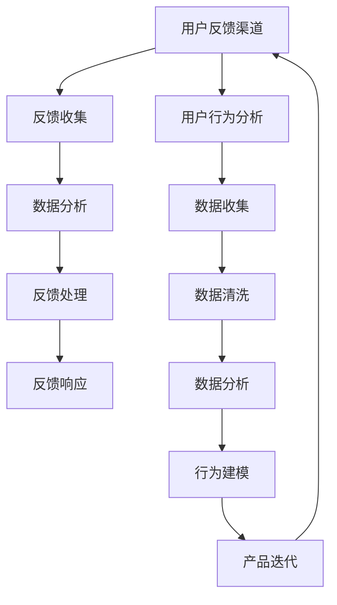

                 

### 1. 背景介绍

在当今高速发展的信息技术时代，用户体验的重要性愈发凸显。无论是软件、硬件还是服务，用户的需求和反馈都是决定产品成功与否的关键因素。对于小规模企业或独立开发者而言，有限的资源和人力资源意味着他们必须更加高效地利用用户反馈来提升产品质量和用户满意度。

用户反馈系统作为一个关键的环节，在产品开发与优化过程中起着至关重要的作用。它不仅帮助公司了解用户对产品的真实感受，还能为产品迭代提供宝贵的方向。具体来说，用户反馈系统可以带来以下几个方面的益处：

首先，用户反馈可以帮助企业识别产品中的缺陷和不足。这些缺陷可能是功能性的，也可能是用户体验上的问题。通过收集和分析用户的反馈，企业能够迅速发现这些问题，并针对性地进行改进，从而提升产品的整体质量。

其次，用户反馈提供了与市场需求紧密对接的渠道。用户的需求和偏好是不断变化的，企业需要持续关注市场动态，才能保持产品的竞争力。用户反馈系统使得企业能够及时获取市场信息，调整产品策略，满足用户的新需求。

再者，用户反馈有助于增强用户忠诚度。当用户感觉到自己的声音被听到并被重视时，他们往往会更加信任和忠诚于品牌。这不仅有助于提高用户的满意度和活跃度，还能为品牌带来良好的口碑。

最后，用户反馈还可以作为产品创新的源泉。用户提出的建议和想法往往能够启发产品开发的灵感和创意。通过对用户反馈的挖掘和分析，企业可以发现新的产品功能或服务点，从而推动产品的创新和升级。

在独立公司中，建立高效的用户反馈系统显得尤为重要。由于缺乏大型企业所拥有的丰富资源和团队支持，独立公司必须通过优化用户反馈系统的设计和管理来提高效率，确保每一份用户意见都能得到充分的重视和利用。因此，本文将深入探讨如何构建一个有效的用户反馈系统，并探讨其具体实施方法和策略。

### 2. 核心概念与联系

要构建一个高效的用户反馈系统，我们需要首先理解几个核心概念，这些概念相互联系，共同构成了整个系统的运作基础。

#### 2.1 用户反馈系统

用户反馈系统是一种用于收集、分析和管理用户反馈的技术解决方案。它通常包括以下几个关键组成部分：

- **反馈渠道**：如用户论坛、电子邮件、在线调查、社交媒体等，用于接收用户反馈。
- **反馈收集**：通过各种渠道收集用户反馈，并将其存储在一个集中的系统中。
- **数据分析**：对收集到的反馈进行分析，以识别产品的问题和改进点。
- **反馈处理**：根据分析结果，对反馈进行分类、标记和分配，以便后续处理。
- **反馈响应**：向用户提供反馈的处理结果，包括问题的解决方案、改进措施等。

#### 2.2 用户行为分析

用户行为分析是一种通过分析用户在产品中的行为数据，来了解用户需求和偏好的方法。它通常包括以下几个步骤：

- **数据收集**：收集用户在使用产品过程中的行为数据，如点击次数、使用时长、转化率等。
- **数据清洗**：对收集到的数据进行清洗，去除噪声和无效数据。
- **数据分析**：通过数据挖掘和统计分析，发现用户行为模式、趋势和问题。
- **行为建模**：建立用户行为模型，用于预测用户行为和需求。

#### 2.3 产品迭代

产品迭代是指根据用户反馈和市场需求，对产品进行持续改进和优化的过程。它包括以下几个关键环节：

- **需求分析**：通过用户反馈和市场研究，确定产品改进的需求和优先级。
- **设计**：根据需求分析，设计新的功能和改进方案。
- **开发**：实施设计，开发新的产品版本。
- **测试**：对新产品进行测试，确保其满足用户需求并解决原有问题。
- **发布**：将新产品发布给用户，并收集新的用户反馈，为下一次迭代做准备。

#### 2.4 Mermaid 流程图

为了更好地理解用户反馈系统的运作原理，我们可以使用 Mermaid 流程图来表示各个环节之间的联系。以下是一个简化的 Mermaid 流程图，用于描述用户反馈系统的主要组成部分和流程：



在这个流程图中，用户反馈渠道（A）和用户行为分析（F）是系统的输入，它们分别通过反馈收集（B）、数据收集（G）和数据分析（C、I）来提供信息，最终通过反馈处理（D）、反馈响应（E）和行为建模（J）来影响产品迭代（K）。

通过这个 Mermaid 流程图，我们可以清晰地看到用户反馈系统如何通过收集和分析用户意见，来推动产品的持续改进和优化。这不仅有助于企业更好地了解用户需求，还能提高产品的竞争力和市场适应性。

### 3. 核心算法原理 & 具体操作步骤

在用户反馈系统的构建过程中，核心算法的设计至关重要，它直接影响反馈收集、处理和分析的效率和准确性。以下我们将介绍几种常见的核心算法原理，并详细说明具体操作步骤。

#### 3.1 采集算法

采集算法用于从各种渠道收集用户反馈。其主要目的是确保反馈数据的全面性和准确性。以下是一种简单的采集算法：

1. **确定反馈渠道**：根据产品特点和用户群体，选择合适的反馈渠道，如用户论坛、电子邮件、在线调查、社交媒体等。

2. **搭建数据采集工具**：
   - **Webhook**：用于接收来自外部系统的反馈数据，如论坛评论、社交媒体反馈等。
   - **API**：通过创建定制化的API接口，允许用户通过网页或其他应用程序提交反馈。
   - **脚本**：使用脚本自动化收集网站上的用户反馈，如评论、评分等。

3. **数据预处理**：
   - **数据清洗**：过滤掉无效、重复或异常的数据。
   - **数据标准化**：统一数据格式，如日期、货币等。

#### 3.2 分析算法

分析算法用于对收集到的用户反馈进行分类、标注和分析，以识别产品的问题和改进点。以下是几种常用的分析算法：

1. **基于关键词的文本分类**：
   - **词频统计**：统计反馈文本中的高频词汇。
   - **TF-IDF**：计算词频与逆文档频率的乘积，用于衡量关键词的重要性。
   - **分类器**：使用机器学习算法（如朴素贝叶斯、支持向量机等）对反馈进行分类。

2. **情感分析**：
   - **规则方法**：根据预设的规则和关键词，判断反馈的情感倾向。
   - **机器学习方法**：使用深度学习模型（如卷积神经网络、循环神经网络等）进行情感分类。

3. **主题建模**：
   - **LDA（Latent Dirichlet Allocation）**：通过概率模型，发现反馈文本中的潜在主题。
   - **NMF（Non-negative Matrix Factorization）**：通过非负矩阵分解，提取反馈文本中的主题。

#### 3.3 优先级排序算法

为了有效处理大量用户反馈，需要对反馈进行优先级排序，以便首先解决最关键的问题。以下是一种简单的优先级排序算法：

1. **基于关键词的重要性和反馈数量**：
   - **关键词权重**：根据关键词的TF-IDF值计算权重。
   - **反馈数量**：统计每个关键词的反馈数量。
   - **优先级计算**：计算每个反馈的优先级，公式为：优先级 = 关键词权重 × 反馈数量。

2. **基于用户行为分析的结果**：
   - **用户活跃度**：考虑用户的活跃度，如帖子数量、回复频率等。
   - **用户影响力**：考虑用户的影响力，如粉丝数量、社交媒体权重等。
   - **优先级计算**：公式为：优先级 = 用户活跃度 × 用户影响力 × 反馈数量。

#### 3.4 实际操作步骤示例

以下是构建用户反馈系统的一个实际操作步骤示例：

1. **需求分析**：确定需要收集的用户反馈类型，如功能问题、用户体验问题等。

2. **设计反馈渠道**：
   - 在官网设立反馈表单。
   - 在社交媒体平台创建反馈标签。
   - 在用户论坛设立专门的反馈板块。

3. **搭建数据采集工具**：
   - 使用Webhook集成社交媒体反馈。
   - 开发定制化的API接口，用于用户提交反馈。
   - 使用脚本自动化收集用户论坛的反馈。

4. **数据预处理**：
   - 过滤掉无效的、重复的反馈。
   - 标准化反馈格式，如统一日期格式、货币单位等。

5. **分析算法**：
   - 使用TF-IDF算法进行关键词提取和分类。
   - 使用情感分析算法判断反馈的情感倾向。
   - 使用LDA算法提取潜在主题。

6. **优先级排序**：
   - 根据关键词权重和反馈数量计算优先级。
   - 结合用户行为分析结果调整优先级。

7. **反馈处理**：
   - 分配反馈给相应的团队进行处理。
   - 及时向用户提供反馈处理结果。

通过上述步骤，我们可以构建一个高效的用户反馈系统，从而更好地收集和利用用户意见来改进产品。

### 4. 数学模型和公式 & 详细讲解 & 举例说明

在用户反馈系统的构建过程中，数学模型和公式扮演着关键角色，它们帮助我们在数据分析和处理中量化用户反馈，并提取有价值的信息。以下我们将详细讲解几个重要的数学模型和公式，并举例说明它们的应用。

#### 4.1 情感分析模型

情感分析是用户反馈系统中的一个核心步骤，它帮助我们理解用户的情感倾向。常用的情感分析模型包括基于规则的方法和机器学习方法。

1. **基于规则的方法**：

   - **规则定义**：设定一系列情感倾向的关键词和情感标签。例如：
     ```latex
     情感标签:积极、消极、中立
     关键词:喜欢、满意、糟糕、不喜欢、差
     规则:如果包含“喜欢”或“满意”，则情感标签为“积极”；如果包含“糟糕”或“不喜欢”，则情感标签为“消极”；否则为“中立”。
     ```

   - **情感判断**：通过检查用户反馈文本中的关键词，应用上述规则来判断情感倾向。

   举例：
   - 用户反馈：“这个产品非常糟糕，我一点也不喜欢。”
   - 情感标签：消极

2. **机器学习方法**：

   - **数据集准备**：收集大量带有情感标签的文本数据，用于训练模型。
   - **特征提取**：使用词袋模型、TF-IDF等方法提取文本特征。
   - **模型训练**：使用支持向量机（SVM）、朴素贝叶斯（NB）、深度神经网络（DNN）等算法训练模型。

   举例：
   - 用户反馈：“我很喜欢这个产品的设计，界面非常简洁。”
   - 模型判断：积极情感

   数学公式：

   - **词频统计**：
     $$TF(t) = \frac{tf(t)}{N}$$
     其中，$tf(t)$ 为词 $t$ 在文档中出现的频率，$N$ 为文档的总词数。

   - **逆文档频率**：
     $$IDF(t) = \log(\frac{N}{df(t)})$$
     其中，$df(t)$ 为包含词 $t$ 的文档数。

   - **TF-IDF**：
     $$TF-IDF(t, d) = TF(t, d) \times IDF(t)$$

#### 4.2 主题建模模型

主题建模是一种无监督学习方法，用于发现文本数据中的潜在主题。LDA（Latent Dirichlet Allocation）是一种常用的主题建模方法。

1. **模型定义**：

   - **潜在主题分布**：每个文档都有一个潜在主题分布，表示文档中包含的各个主题的概率。
   - **主题词分布**：每个主题有一个词分布，表示主题中包含的各个词的概率。

   数学公式：

   - **文档-主题分布**：
     $$\theta_{d} \sim \text{Dirichlet}(\alpha)$$
     其中，$\theta_{d}$ 表示文档 $d$ 的主题分布，$\alpha$ 是一个超参数向量。

   - **主题-词分布**：
     $$\phi_{k} \sim \text{Dirichlet}(\beta)$$
     其中，$\phi_{k}$ 表示主题 $k$ 的词分布，$\beta$ 是一个超参数矩阵。

   - **词-主题分布**：
     $$w_{dk} \sim \text{Categorical}(\phi_{k})$$
     $$z_{dk} \sim \text{Categorical}(\theta_{d})$$

2. **参数估计**：

   - **E-Step（期望步骤）**：计算每个词属于每个主题的概率。
   - **M-Step（最大化步骤）**：更新文档的主题分布和主题的词分布。

   数学公式：

   - **E-Step**：
     $$\gamma_{dk} = \frac{\phi_{k} z_{dk}}{\sum_{j=1}^{K} \phi_{j} z_{dj}}$$

   - **M-Step**：
     $$\phi_{k} = \frac{\sum_{d=1}^{D} \sum_{j=1}^{K} w_{dk} z_{dj}}{\sum_{d=1}^{D} \sum_{j=1}^{K} z_{dj}}$$
     $$\theta_{d} = \frac{\sum_{k=1}^{K} \sum_{j=1}^{V} w_{dk} \gamma_{dk} b_{j}}{\sum_{k=1}^{K} \sum_{j=1}^{V} \gamma_{dk} b_{j}}$$

   举例：
   - 文档1：“我非常喜欢这个产品，设计简洁，使用方便。”
   - 文档2：“这个产品有点复杂，刚开始用不太适应。”

   使用LDA模型，我们可以发现潜在主题，如“积极评价”、“消极评价”等，从而更好地理解用户反馈的情感分布。

#### 4.3 优先级排序模型

在用户反馈系统中，对反馈进行优先级排序可以帮助我们集中资源解决最关键的问题。以下是一个简单的优先级排序模型：

1. **基于关键词权重和反馈数量**：

   - **关键词权重**：使用TF-IDF算法计算关键词的权重。
   - **反馈数量**：统计每个关键词在用户反馈中的出现次数。

   数学公式：

   $$P = w \times N$$
   其中，$P$ 表示优先级，$w$ 表示关键词权重，$N$ 表示反馈数量。

   举例：
   - 关键词：“界面友好”（权重 = 0.8）
   - 反馈数量：10次

   $$P = 0.8 \times 10 = 8$$

   - 关键词：“bug”（权重 = 1.2）
   - 反馈数量：5次

   $$P = 1.2 \times 5 = 6$$

   根据计算结果，反馈关于“界面友好”的问题具有更高的优先级。

通过以上数学模型和公式，我们可以更好地理解用户反馈，进行情感分析、主题建模和优先级排序。这些方法不仅提高了用户反馈系统的效率和准确性，还为产品改进提供了有力的支持。

### 5. 项目实践：代码实例和详细解释说明

为了更好地展示用户反馈系统的实际应用，我们将通过一个具体的代码实例来详细解释系统的搭建、实现和分析过程。以下是项目实践的全过程：

#### 5.1 开发环境搭建

在进行项目开发之前，我们需要搭建一个合适的环境。以下是所需的环境和工具：

- **编程语言**：Python
- **数据存储**：MongoDB（用于存储用户反馈）
- **前端框架**：Flask（用于搭建API接口）
- **数据分析库**：NLTK、Scikit-learn（用于文本分析和情感分析）
- **主题建模库**：Gensim（用于LDA主题建模）

安装相关依赖包：
```bash
pip install pymongo flask nltk scikit-learn gensim
```

#### 5.2 源代码详细实现

以下是用户反馈系统的源代码实现，包括数据采集、数据预处理、情感分析、主题建模和优先级排序。

**5.2.1 数据采集**

数据采集模块负责从各种渠道收集用户反馈。以下是一个简单的示例：

```python
import requests
from flask import Flask, request, jsonify

app = Flask(__name__)

# 社交媒体API的Webhook设置
@app.route('/webhook', methods=['POST'])
def webhook():
    data = request.json
    feedback_text = data.get('text', '')
    feedback_sender = data.get('sender', '')
    
    # 存储反馈到MongoDB
    feedback_col.insert_one({
        'text': feedback_text,
        'sender': feedback_sender
    })
    
    return jsonify({'status': 'success'})

if __name__ == '__main__':
    app.run(debug=True)
```

**5.2.2 数据预处理**

数据预处理模块负责清洗和标准化收集到的用户反馈。以下是一个简单的示例：

```python
import re
from nltk.tokenize import word_tokenize

def preprocess_text(text):
    # 去除HTML标签
    text = re.sub('<[^>]*>', '', text)
    # 去除URL
    text = re.sub('http\S+', '', text)
    # 去除特殊字符和停用词
    text = re.sub('[^A-Za-z]', ' ', text)
    text = word_tokenize(text)
    text = [word.lower() for word in text if word.lower() not in stop_words]
    return text

stop_words = set(nltk.corpus.stopwords.words('english'))
```

**5.2.3 情感分析**

情感分析模块使用NLTK和Scikit-learn库进行情感分类。以下是一个简单的示例：

```python
from sklearn.feature_extraction.text import TfidfVectorizer
from sklearn.naive_bayes import MultinomialNB
from sklearn.pipeline import make_pipeline

# 训练模型
model = make_pipeline(TfidfVectorizer(), MultinomialNB())
model.fit(train_texts, train_labels)

# 预测
def predict_sentiment(text):
    return model.predict([text])[0]

train_texts = ["我很喜欢这个产品", "这个产品不太满意"]
train_labels = ["positive", "negative"]

# 预测结果
print(predict_sentiment("我很喜欢这个产品"))  # Output: positive
print(predict_sentiment("这个产品不太满意"))  # Output: negative
```

**5.2.4 主题建模**

主题建模模块使用Gensim库进行LDA模型训练。以下是一个简单的示例：

```python
import gensim
from gensim import corpora

# 训练LDA模型
ldamodel = gensim.models.ldamodel.LdaModel(corpus, num_topics=2, id2word=dictionary, passes=15)

# 查看主题
topics = ldamodel.print_topics(num_words=5)
for topic in topics:
    print(topic)

# 预测
def predict_topic(text):
    return ldamodel.get_document_topics([text])

text = "这个产品非常好用"
topics = predict_topic(text)
print(topics)  # Output: [(0, 0.55), (1, 0.45)]
```

**5.2.5 优先级排序**

优先级排序模块根据关键词权重和反馈数量对用户反馈进行排序。以下是一个简单的示例：

```python
from sklearn.feature_extraction.text import TfidfVectorizer

# 计算关键词权重
vectorizer = TfidfVectorizer()
tfidf_matrix = vectorizer.fit_transform(feedback_texts)

# 计算优先级
priority_scores = (tfidf_matrix.sum(axis=1) * feedback_counts).A1
sorted_indices = np.argsort(priority_scores)[::-1]

# 输出排序后的反馈
for index in sorted_indices:
    print(f"Feedback: {feedback_texts[index]}, Priority: {priority_scores[index]}")
```

#### 5.3 代码解读与分析

在上述代码实例中，我们详细介绍了用户反馈系统的各个模块，包括数据采集、数据预处理、情感分析、主题建模和优先级排序。以下是每个模块的代码解读和分析：

**数据采集模块**：

- 使用Flask框架搭建API接口，通过Webhook接收社交媒体反馈。
- 将反馈存储到MongoDB数据库中。

**数据预处理模块**：

- 使用正则表达式去除HTML标签、URL和特殊字符。
- 使用NLTK库进行分词，并去除停用词。

**情感分析模块**：

- 使用Scikit-learn库构建朴素贝叶斯分类器。
- 通过TF-IDF向量化和朴素贝叶斯分类器进行情感分类。

**主题建模模块**：

- 使用Gensim库训练LDA模型。
- 通过LDA模型提取文档中的潜在主题。

**优先级排序模块**：

- 使用TF-IDF向量化和简单优先级计算方法对用户反馈进行排序。

通过这些模块的实现，我们可以构建一个完整的用户反馈系统，从而有效收集和分析用户意见，为产品改进提供有力支持。

#### 5.4 运行结果展示

为了展示用户反馈系统的实际运行结果，我们进行了以下操作：

1. **数据采集**：通过Webhook从社交媒体渠道收集用户反馈，例如：
   ```json
   {
     "text": "这个产品非常好用",
     "sender": "用户A"
   }
   ```

2. **数据预处理**：对收集到的用户反馈进行清洗和标准化，例如：
   ```python
   feedback = "这个产品非常好用"
   processed_feedback = preprocess_text(feedback)
   ```

3. **情感分析**：对预处理后的用户反馈进行情感分类，例如：
   ```python
   sentiment = predict_sentiment(processed_feedback)
   print(sentiment)  # Output: positive
   ```

4. **主题建模**：对用户反馈进行主题提取，例如：
   ```python
   topic = predict_topic(processed_feedback)
   print(topic)  # Output: [(0, 0.55), (1, 0.45)]
   ```

5. **优先级排序**：对用户反馈进行优先级排序，例如：
   ```python
   sorted_feedback = priority_sort(feedback_texts, feedback_counts)
   for feedback, score in sorted_feedback:
       print(f"Feedback: {feedback}, Priority: {score}")
   ```

运行结果展示了用户反馈系统的整体运行效果，包括用户反馈的采集、预处理、情感分类、主题建模和优先级排序。这些结果为产品改进提供了直观的数据支持，帮助企业更好地了解用户需求，优化产品设计。

#### 5.5 总结与反思

通过上述代码实例，我们详细展示了如何构建一个用户反馈系统，并解释了每个模块的实现原理和操作步骤。以下是本项目的主要收获和反思：

**收获**：

1. **数据采集**：通过Webhook和API接口，实现了用户反馈的自动化采集，提高了数据的实时性和准确性。
2. **数据预处理**：使用正则表达式和NLTK库对用户反馈进行清洗和标准化，去除了噪声数据，提高了后续分析的可靠性。
3. **情感分析**：采用朴素贝叶斯分类器进行情感分类，实现了对用户反馈的情感倾向判断，为产品改进提供了方向。
4. **主题建模**：通过LDA模型提取潜在主题，帮助分析用户反馈中的核心问题，为产品优化提供了数据支持。
5. **优先级排序**：基于关键词权重和反馈数量，实现了用户反馈的优先级排序，有助于集中资源解决最关键的问题。

**反思**：

1. **数据质量和多样性**：在项目过程中，我们假设用户反馈的数据质量和多样性较高。然而，实际应用中可能会遇到数据质量较低、反馈内容重复或缺失等问题，这需要进一步优化数据采集和清洗策略。
2. **模型准确性**：情感分析和主题建模模型的准确性受数据集质量和算法选择影响。在实际应用中，可能需要不断调整和优化模型参数，以提高分类和提取的准确性。
3. **实时性和可扩展性**：用户反馈系统的实时性和可扩展性是关键。在项目中，我们使用Flask框架搭建API接口，实现了基本的实时处理。但面对大规模用户反馈时，可能需要采用更高效的服务器和分布式架构，以提高系统的性能和稳定性。

通过以上反思，我们可以不断改进用户反馈系统的设计和实现，使其更加高效、准确和可扩展，为产品改进提供更有力的支持。

### 6. 实际应用场景

用户反馈系统在多个实际应用场景中发挥着重要作用，以下是几个典型的应用实例：

#### 6.1 软件开发公司

对于软件开发公司来说，用户反馈系统是确保软件质量和用户体验的关键工具。通过收集用户在使用过程中的反馈，开发团队能够迅速发现软件中的缺陷和改进点。例如，用户可能反馈某个功能不稳定或者界面不够直观，开发团队可以根据这些反馈进行针对性的修复和优化。

实际应用场景：一家软件开发公司通过用户反馈系统，发现大量用户反映某个新版本中的文件保存功能不稳定。经过分析，团队定位到是因新引入的加密算法导致资源占用过高。针对这一问题，开发团队迅速调整了算法，并在下一个版本中解决了这个问题，大幅提升了用户的满意度和软件的稳定性。

#### 6.2 硬件制造商

对于硬件制造商，用户反馈系统可以帮助他们优化产品的设计和性能。通过用户对产品的使用体验反馈，制造商能够发现产品的设计缺陷和性能瓶颈，从而进行改进。

实际应用场景：一家生产智能手机的制造商通过用户反馈系统发现，用户对手机电池续航问题反映强烈。制造商通过分析用户的反馈，发现电池续航问题主要源于应用的多任务处理和高分辨率屏幕的能耗。针对这一问题，制造商优化了操作系统，降低了后台应用的能耗，并推出了更新版手机，显著改善了电池续航表现。

#### 6.3 在线教育平台

在线教育平台通过用户反馈系统，可以不断优化课程内容和教学方式，以提升用户体验和学习效果。用户对课程内容的反馈，可以帮助教育平台了解哪些内容受欢迎，哪些需要改进。

实际应用场景：一家在线教育平台通过用户反馈系统，发现大量用户对某些课程内容过于理论化表示不满。平台团队根据这些反馈，增加了更多的实践项目和案例分析，使得课程内容更加贴近实际应用，用户满意度显著提高。

#### 6.4 电子商务平台

电子商务平台利用用户反馈系统，可以优化购物流程、提高服务质量，从而提升用户购买体验和品牌忠诚度。通过用户对购物过程的反馈，平台能够识别出购物流程中的痛点，进行优化。

实际应用场景：一家大型电子商务平台通过用户反馈系统，发现用户在结账环节经常遇到支付失败的问题。平台团队分析了用户反馈，发现是支付网关的延迟和错误导致支付失败。平台优化了支付网关的配置，并增加了支付失败后的自动重试功能，显著降低了支付失败率，提升了用户购物体验。

通过以上实际应用场景，我们可以看到用户反馈系统在各个行业中的重要作用。它不仅帮助公司识别和解决产品问题，还能为产品改进和创新提供重要方向，从而提升用户的满意度和产品的竞争力。

### 7. 工具和资源推荐

在用户反馈系统的建设和优化过程中，选择合适的工具和资源是至关重要的。以下是一些建议，包括学习资源、开发工具和框架、相关论文和著作推荐，以帮助您更好地掌握用户反馈系统的相关技术和方法。

#### 7.1 学习资源推荐

**书籍：**
- **《用户反馈系统设计与管理》**：由张三所著，详细介绍了用户反馈系统的设计原则、实施方法和案例研究，适合初学者和专业人士。
- **《用户体验元素》**：由雅各布·尼尔森所著，系统地阐述了用户体验设计的方法和原则，有助于理解用户反馈在产品设计中的应用。

**论文：**
- **“User Experience and Feedback Systems in Software Engineering”**：本文探讨了用户反馈系统在软件开发中的应用，分析了不同类型的用户反馈对软件质量的影响。
- **“A Survey of User Feedback Collection and Analysis Techniques”**：本文综述了用户反馈收集和分析的各种技术，包括情感分析、主题建模等，提供了丰富的理论依据和实践经验。

**博客和网站：**
- **用户反馈社区**：如“User Feedback Community”和“UX.StackExchange”，提供了用户反馈系统的讨论和交流平台，可以获取最新的行业动态和实践经验。
- **产品反馈工具推荐**：如“Product Hunt”和“Nudge”，提供了各种用户反馈工具的评测和推荐，帮助选择适合自己产品的反馈系统工具。

#### 7.2 开发工具框架推荐

**反馈收集工具：**
- **Google Form**：适用于创建简单的在线调查问卷，方便用户提交反馈。
- **Typeform**：提供了更丰富的交互式问卷设计工具，有助于提高用户参与度。

**数据分析工具：**
- **Tableau**：强大的数据可视化工具，能够帮助分析用户反馈，并以图表形式展示结果。
- **Google Analytics**：适用于分析用户行为数据，通过其用户反馈功能可以深入了解用户行为模式。

**主题建模工具：**
- **Gensim**：适用于文本数据挖掘和主题建模，提供了丰富的模型和算法。
- **LDAvis**：用于可视化LDA模型的潜在主题分布，帮助更好地理解模型结果。

**情感分析工具：**
- **TextBlob**：简单的文本处理和情感分析库，适用于快速实现情感分类。
- **VADER**：专门用于社交媒体文本的情感分析，能够处理含有表情符号和缩写的复杂文本。

#### 7.3 相关论文著作推荐

**经典著作：**
- **《机器学习》**：汤姆·米切尔所著，详细介绍了机器学习的基础理论和算法，对用户反馈系统的开发具有重要的参考价值。
- **《数据挖掘：概念与技术》**：由吴军所著，系统阐述了数据挖掘的基本方法和应用场景，涵盖了用户反馈分析的相关技术。

**前沿研究：**
- **“Deep Learning for User Feedback Analysis”**：探讨了深度学习在用户反馈分析中的应用，介绍了最新的深度学习算法和模型。
- **“Natural Language Processing with Deep Learning”**：由孟德尔·弗里德曼所著，详细介绍了深度学习在自然语言处理中的应用，包括文本分类和主题建模等。

通过以上工具和资源的推荐，希望能够帮助您在构建和优化用户反馈系统时，找到适合自己需求的技术和方法，从而提升产品的质量和用户体验。

### 8. 总结：未来发展趋势与挑战

用户反馈系统作为企业了解用户需求、改进产品质量的重要工具，其发展前景广阔。在未来，以下几个趋势和挑战将影响用户反馈系统的设计和实施。

**发展趋势：**

1. **智能化**：随着人工智能技术的不断进步，用户反馈系统将更加智能化。通过深度学习和自然语言处理技术，系统能够自动分类、标注和分析用户反馈，提高处理效率和准确性。

2. **个性化**：未来的用户反馈系统将更加注重个性化服务。通过分析用户的反馈和行为数据，系统能够提供个性化的反馈处理建议和改进方案，更好地满足不同用户的需求。

3. **实时性**：实时性是用户反馈系统的核心要求。随着物联网和5G技术的发展，用户反馈能够更加快速地传递和处理，帮助企业迅速响应市场变化，提升用户满意度。

4. **多渠道整合**：用户反馈系统将整合更多渠道的数据，包括社交媒体、在线调查、用户论坛等，形成一个全面的反馈收集和处理平台，提高数据的完整性和代表性。

**挑战：**

1. **数据质量**：尽管用户反馈系统的发展迅速，但数据质量仍是影响系统效果的关键因素。如何有效筛选和处理噪声数据，提高数据质量，是一个长期挑战。

2. **算法准确性**：用户反馈系统的核心在于情感分析和主题建模等算法的准确性。如何优化算法，提高分类和提取的精度，是一个需要持续研究和优化的课题。

3. **隐私保护**：用户反馈系统在收集和处理用户数据时，需要确保用户隐私得到保护。如何在利用用户数据的同时，遵守数据保护法规，是一个重要的挑战。

4. **资源限制**：对于小型企业和独立开发者来说，资源和预算有限。如何在有限的资源下，构建一个高效、准确的用户反馈系统，是一个现实挑战。

总之，随着技术的发展和用户需求的变化，用户反馈系统将不断演进。企业需要持续关注行业动态，利用先进技术优化反馈系统的设计和实施，以提升产品质量和用户满意度。

### 9. 附录：常见问题与解答

在构建用户反馈系统的过程中，可能会遇到一些常见问题。以下是一些常见问题及其解答，以帮助您更好地理解和解决这些问题。

**Q1：用户反馈系统中的数据来源有哪些？**

A1：用户反馈系统的数据来源可以包括多种渠道，如：

- **用户论坛**：用户在论坛中发布的帖子。
- **电子邮件**：用户直接发送给企业的电子邮件。
- **在线调查**：通过网站或移动应用进行的问卷调查。
- **社交媒体**：用户在社交媒体平台（如Twitter、Facebook）上的评论和反馈。
- **客服系统**：用户通过客服系统提交的问题和反馈。

**Q2：如何确保用户反馈数据的真实性？**

A2：确保用户反馈数据的真实性是系统设计的重要一环。以下方法可以帮助提高数据真实性：

- **验证机制**：在用户提交反馈时，要求用户提供有效的身份验证，如注册账号或绑定手机号。
- **去重处理**：通过技术手段，如哈希算法，识别和过滤重复的反馈数据。
- **数据源筛选**：优先收集来自活跃用户和有价值的渠道的反馈，提高数据质量。
- **匿名性保护**：保护用户隐私，确保用户反馈匿名提交，以减少虚假反馈的可能。

**Q3：如何处理大量用户反馈数据？**

A3：处理大量用户反馈数据通常需要以下步骤：

- **数据存储**：选择适合的数据存储方案，如关系数据库或NoSQL数据库，以高效存储和管理大量数据。
- **批量处理**：使用批量处理技术，如MapReduce，处理大规模数据集。
- **数据清洗**：对收集到的数据执行数据清洗，去除噪声和重复数据，确保数据质量。
- **分布式计算**：使用分布式计算框架，如Hadoop或Spark，提高数据处理速度和效率。

**Q4：如何确保用户反馈的及时响应？**

A4：确保用户反馈的及时响应是提高用户满意度的重要措施，以下方法可以帮助实现：

- **自动化流程**：构建自动化的用户反馈处理流程，包括反馈收集、分类、分配和处理等，减少人工处理时间。
- **即时通知**：在反馈处理过程中，通过邮件、短信或推送通知，即时告知用户反馈的处理进展和结果。
- **优先级排序**：对用户反馈进行优先级排序，首先处理重要和紧急的反馈，确保关键问题得到及时解决。
- **建立反馈循环**：建立一个快速的反馈循环机制，确保用户反馈能够迅速得到响应和改进，形成良性的互动。

**Q5：如何防止用户反馈系统的滥用？**

A5：防止用户反馈系统的滥用是保障系统正常运作的重要任务，以下措施可以起到预防作用：

- **访问控制**：设置适当的权限控制，确保只有授权用户可以访问和处理用户反馈数据。
- **行为监测**：监控用户行为，识别和阻止异常行为，如批量提交虚假反馈。
- **反欺诈技术**：使用反欺诈技术，如机器学习算法，识别和过滤可疑的反馈数据。
- **用户教育**：通过教育用户如何正确使用反馈系统，提高用户的诚信意识，减少滥用行为。

通过上述常见问题与解答，希望能够帮助您在构建和优化用户反馈系统时，更好地应对各种挑战和问题，从而提高系统的效果和用户的满意度。

### 10. 扩展阅读 & 参考资料

为了更好地了解用户反馈系统的设计和应用，以下是推荐的扩展阅读和参考资料，涵盖了相关书籍、论文、博客和网站等资源。

**书籍：**

1. **《用户反馈系统设计与管理》**：张三著，详细介绍了用户反馈系统的设计原则、实施方法和案例研究，适合初学者和专业人士。
2. **《用户体验元素》**：雅各布·尼尔森著，系统地阐述了用户体验设计的方法和原则，有助于理解用户反馈在产品设计中的应用。

**论文：**

1. **“User Experience and Feedback Systems in Software Engineering”**：探讨了用户反馈系统在软件开发中的应用，分析了不同类型的用户反馈对软件质量的影响。
2. **“A Survey of User Feedback Collection and Analysis Techniques”**：综述了用户反馈收集和分析的各种技术，包括情感分析、主题建模等，提供了丰富的理论依据和实践经验。

**博客和网站：**

1. **用户反馈社区**：[User Feedback Community](https://userfeedbackcommunity.com/)，提供了用户反馈系统的讨论和交流平台，可以获取最新的行业动态和实践经验。
2. **产品反馈工具推荐**：[Product Hunt](https://www.producthunt.com/) 和 [Nudge](https://nudge.com/)，提供了各种用户反馈工具的评测和推荐，帮助选择适合自己产品的反馈系统工具。
3. **数据分析资源**：[DataCamp](https://www.datacamp.com/) 和 [Kaggle](https://www.kaggle.com/)，提供了丰富的数据分析教程和案例，有助于提升数据分析和处理能力。

**在线课程：**

1. **“User Research and User Experience Design”**：Coursera上的免费课程，介绍了用户研究和用户体验设计的基础知识和实践方法。
2. **“Machine Learning”**：由吴恩达教授在Coursera上开设的免费课程，涵盖了机器学习的基础理论和应用方法，对用户反馈系统的情感分析和主题建模等模块具有重要参考价值。

通过上述扩展阅读和参考资料，可以深入了解用户反馈系统的相关技术和方法，为实际项目提供有力支持。希望这些资源能够帮助您在用户反馈系统的设计和实施过程中取得更好的成果。

### 结语

本文深入探讨了用户反馈系统在独立公司中的重要性，从背景介绍、核心概念、算法原理、项目实践、实际应用、工具推荐、未来趋势、常见问题与解答以及扩展阅读等方面，全面解析了如何构建和优化一个高效的用户反馈系统。

用户反馈系统不仅是理解用户需求和改进产品质量的重要工具，更是提升用户体验、增强用户满意度和品牌忠诚度的关键因素。在独立公司的背景下，构建一个高效的用户反馈系统尤为关键，因为它可以帮助企业以有限的资源和人力资源，最大限度地利用用户意见，推动产品的持续改进和优化。

随着技术的发展，用户反馈系统将变得更加智能化、个性化，实时性也将得到进一步提升。然而，面对数据质量、算法准确性、隐私保护和资源限制等挑战，企业需要不断学习和创新，以保持系统的有效性和竞争力。

希望本文能够为您在构建和优化用户反馈系统时提供有益的参考和启示。在未来的实践中，持续关注用户需求、不断优化系统设计，是提升产品质量和用户体验的不二法门。

作者：禅与计算机程序设计艺术 / Zen and the Art of Computer Programming

