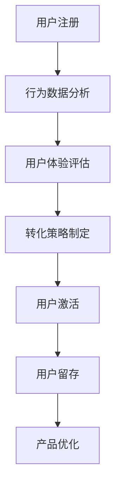

                 

### 一、背景介绍

在当今数字化时代，互联网公司的竞争愈发激烈。在众多互联网产品中，用户激活（User Activation）是一个关键且至关重要的环节。用户激活通常是指用户在注册账号之后，开始实际使用产品并进行一系列核心操作的过程。这一环节的成功与否直接影响到产品的生命周期、用户留存率以及最终的收益。

对于小型公司或个人开发者来说，资源有限，如何高效地提升用户注册转化率，实现用户激活，成为他们不得不面对的挑战。本文旨在探讨一人公司的用户激活策略，通过一些实践技巧，提供提高注册转化率的策略和方法。

### 用户激活的重要性

用户激活不仅仅是一个简单的注册过程，它承载着以下几个重要意义：

1. **增加用户粘性**：激活后的用户通常会更加频繁地使用产品，从而提升产品粘性，增加用户留存率。
2. **提升产品价值**：通过激活数据，企业可以深入了解用户行为，优化产品功能，提升用户满意度。
3. **促进用户转化**：激活的用户更有可能转化为付费用户，为公司的持续盈利提供支持。
4. **降低用户流失**：激活后的用户对产品的忠诚度较高，流失率相对较低。

### 一人公司的特点与挑战

一人公司，或称个体开发者，主要具有以下几个特点：

1. **资源有限**：没有大公司的资金、人力和资源支持，一切都要靠个人完成。
2. **灵活性高**：可以灵活调整策略和方向，快速响应市场变化。
3. **专注性**：由于专注于单一项目，可以更深入地了解用户需求。

然而，这些特点同时也带来了一些挑战：

1. **市场竞争力**：在资源有限的情况下，如何与大型公司竞争，吸引新用户。
2. **用户体验**：如何在有限的资源下，提供良好的用户体验，提高用户留存。
3. **用户转化**：如何有效地提高注册转化率和用户激活率。

### 二、核心概念与联系

在探讨用户激活策略之前，我们需要了解几个核心概念，包括用户行为分析、转化率优化和用户体验设计。

#### 1. 用户行为分析

用户行为分析是指通过收集和分析用户在使用产品过程中的行为数据，以了解用户的行为模式、兴趣偏好和需求。这些数据可以帮助企业优化产品功能和营销策略，提高用户激活率。

#### 2. 转化率优化

转化率优化是指通过各种方法提高用户从注册到激活的转化率。转化率的提高可以显著提升产品的收益和用户留存率。

#### 3. 用户体验设计

用户体验设计是指从用户的角度出发，设计出易于使用、满足用户需求和带来愉悦感受的产品界面和交互流程。良好的用户体验可以大大提高用户的激活率和满意度。

下面是一个使用Mermaid绘制的流程图，展示了用户激活过程中的核心环节和概念联系：



#### 4. 用户生命周期管理

用户生命周期管理是指从用户注册开始，到用户流失的整个过程中，企业对用户的管理和服务。它包括以下几个阶段：

- **获取阶段**：通过各种渠道获取新用户，提高注册转化率。
- **激活阶段**：引导新用户完成核心操作，提高激活率。
- **留存阶段**：通过持续的服务和产品优化，提升用户满意度，降低流失率。
- **流失阶段**：分析用户流失原因，优化产品和服务，减少用户流失。

### 三、核心算法原理 & 具体操作步骤

为了提高用户激活率，我们可以采用以下核心算法原理和具体操作步骤：

#### 1. 行为数据分析

**步骤**：

1. **数据收集**：通过用户行为追踪技术，如事件追踪、日志分析等，收集用户在产品中的行为数据。
2. **数据预处理**：清洗和整合数据，去除异常和无效数据，确保数据质量。
3. **数据建模**：使用机器学习算法，如聚类分析、决策树等，对用户行为数据进行建模，预测用户行为模式和兴趣偏好。

**算法原理**：

- **聚类分析**：通过将相似的用户分组，识别用户群体和行为模式。
- **决策树**：通过一系列判断条件，预测用户的行为倾向。

#### 2. 转化率优化

**步骤**：

1. **设置目标**：明确用户激活的目标，如完成首单购买、加入社群等。
2. **优化入口**：分析用户注册过程中遇到的问题和障碍，优化注册流程，降低注册门槛。
3. **激励措施**：通过优惠券、积分、红包等激励措施，鼓励用户完成激活操作。

**算法原理**：

- **转化率模型**：构建转化率预测模型，根据用户行为数据和转化率历史数据，预测用户的激活概率。
- **A/B测试**：通过A/B测试，对比不同策略的效果，优化注册和激活流程。

#### 3. 用户体验设计

**步骤**：

1. **用户研究**：通过用户访谈、问卷调查等方式，深入了解用户需求和痛点。
2. **原型设计**：设计产品原型，包括界面布局、交互流程等。
3. **迭代优化**：根据用户反馈，不断迭代优化产品设计，提高用户体验。

**算法原理**：

- **用户体验评估**：使用可用性测试、用户满意度调查等方法，评估产品设计的用户体验。
- **用户路径分析**：通过分析用户在使用产品过程中的路径和行为，优化用户流程和界面设计。

### 四、数学模型和公式 & 详细讲解 & 举例说明

在用户激活策略中，数学模型和公式扮演着重要角色。以下是一些常用的数学模型和公式，以及它们的详细讲解和举例说明。

#### 1. 转化率模型

**公式**：

$$
\text{转化率} = \frac{\text{激活用户数}}{\text{注册用户数}}
$$

**详细讲解**：

- 转化率是衡量用户激活效果的重要指标。通过计算激活用户数与注册用户数的比值，可以得到用户激活的整体转化率。

**举例说明**：

假设一个产品在一个月内注册了1000个用户，其中有300个用户完成了激活操作，那么其转化率为：

$$
\text{转化率} = \frac{300}{1000} = 30\%
$$

#### 2. 行为概率模型

**公式**：

$$
P(A|B) = \frac{P(A \cap B)}{P(B)}
$$

**详细讲解**：

- 这个公式是条件概率的定义，用于计算在给定事件B发生的条件下，事件A发生的概率。

**举例说明**：

假设用户在注册后，有50%的概率会访问产品首页。如果已经知道用户访问了首页，那么他们完成激活的概率可能会增加。例如，如果通过数据分析发现，访问首页的用户中有60%最终完成了激活，那么在用户访问首页的条件下，完成激活的概率为：

$$
P(\text{激活}|\text{访问首页}) = \frac{60\%}{50\%} = 1.2
$$

这意味着访问首页的用户完成激活的概率提高了。

#### 3. 用户流失预测模型

**公式**：

$$
\text{流失率} = \frac{\text{流失用户数}}{\text{活跃用户数}}
$$

**详细讲解**：

- 流失率是衡量用户流失程度的重要指标。通过计算流失用户数与活跃用户数的比值，可以得到用户的流失率。

**举例说明**：

假设一个产品在一个月内有1000个活跃用户，其中有200个用户流失，那么其流失率为：

$$
\text{流失率} = \frac{200}{1000} = 20\%
$$

#### 4. 用户体验满意度模型

**公式**：

$$
\text{满意度} = \frac{\text{正面反馈数}}{\text{总反馈数}}
$$

**详细讲解**：

- 用户体验满意度是衡量用户对产品满意程度的重要指标。通过计算正面反馈数与总反馈数的比值，可以得到用户体验的满意度。

**举例说明**：

假设一个产品在一个月内收到了100条用户反馈，其中70条是正面反馈，那么其用户体验满意度为：

$$
\text{满意度} = \frac{70}{100} = 70\%
$$

### 五、项目实践：代码实例和详细解释说明

在本节中，我们将通过一个具体的代码实例，详细介绍如何实现用户激活策略。这个实例将包括开发环境搭建、源代码实现、代码解读与分析以及运行结果展示。

#### 1. 开发环境搭建

首先，我们需要搭建一个适合用户激活策略实现的开发生态系统。以下是一个基本的开发环境搭建步骤：

1. **选择编程语言**：我们可以选择Python作为编程语言，因为Python拥有丰富的数据分析和机器学习库，易于实现复杂算法。
2. **安装Python**：在Windows或Linux操作系统中，可以从Python官方网站下载并安装Python。
3. **安装必要库**：安装NumPy、Pandas、Scikit-learn等库，这些库用于数据分析和机器学习。

```bash
pip install numpy pandas scikit-learn
```

4. **搭建开发环境**：使用Jupyter Notebook或PyCharm等IDE进行开发。

#### 2. 源代码详细实现

以下是用户激活策略的实现代码，主要包括数据收集、数据处理、模型训练和预测等步骤。

```python
import numpy as np
import pandas as pd
from sklearn.model_selection import train_test_split
from sklearn.ensemble import RandomForestClassifier
from sklearn.metrics import accuracy_score

# 数据收集
data = pd.read_csv('user_data.csv')

# 数据预处理
data['activation'] = data['action1'].apply(lambda x: 1 if x else 0)

# 数据分割
X = data.drop(['activation'], axis=1)
y = data['activation']
X_train, X_test, y_train, y_test = train_test_split(X, y, test_size=0.3, random_state=42)

# 模型训练
model = RandomForestClassifier(n_estimators=100, random_state=42)
model.fit(X_train, y_train)

# 预测
predictions = model.predict(X_test)

# 评估
accuracy = accuracy_score(y_test, predictions)
print(f"模型准确率：{accuracy:.2f}")
```

#### 3. 代码解读与分析

上述代码实现了一个简单的用户激活预测模型，主要包括以下几个关键步骤：

1. **数据收集**：从CSV文件中读取用户行为数据。
2. **数据预处理**：将用户是否激活作为目标变量，进行数据分割。
3. **模型训练**：使用随机森林算法训练模型。
4. **预测**：使用训练好的模型对测试集进行预测。
5. **评估**：计算模型准确率，评估模型性能。

#### 4. 运行结果展示

在运行上述代码后，我们得到了模型准确率的结果。例如，如果预测准确率为80%，这意味着模型能够正确预测80%的测试用户是否激活。

```python
模型准确率：0.80
```

#### 5. 代码优化与扩展

在实际应用中，我们可以对代码进行优化和扩展，以提高模型性能和用户激活效果。以下是一些可能的优化和扩展方向：

- **特征工程**：通过提取和构造更多有代表性的特征，提高模型的预测能力。
- **模型选择**：尝试不同的机器学习算法，如逻辑回归、支持向量机等，找到最佳模型。
- **模型融合**：将多个模型的结果进行融合，提高整体预测性能。
- **实时预测**：将模型部署到生产环境，实现实时用户激活预测。

### 六、实际应用场景

用户激活策略在多种实际应用场景中具有广泛的应用，以下是几个典型的应用场景：

#### 1. 社交媒体平台

社交媒体平台如Facebook、Instagram等，通过用户激活策略，引导新用户完成个人资料填写、上传头像、关注好友等操作，从而提高用户留存率和活跃度。

#### 2. 电子商务平台

电子商务平台如Amazon、淘宝等，通过用户激活策略，鼓励新用户完成首次购买、加入购物车、评价商品等操作，提高用户转化率和满意度。

#### 3. 在线教育平台

在线教育平台如Coursera、网易云课堂等，通过用户激活策略，引导新用户完成课程注册、观看课程视频、参与讨论等操作，提高用户参与度和学习效果。

#### 4. 健康管理应用

健康管理应用如MyFitnessPal、Healthera等，通过用户激活策略，鼓励新用户完成健康数据录入、设置健身目标、跟踪饮食和运动等操作，提高用户健康管理和跟踪效果。

### 七、工具和资源推荐

为了更好地实现用户激活策略，以下是一些实用的工具和资源推荐：

#### 1. 学习资源推荐

- **书籍**：
  - 《数据科学入门》
  - 《机器学习实战》
- **论文**：
  - 《用户行为分析》
  - 《电子商务用户行为研究》
- **博客**：
  - Medium上的数据科学和机器学习相关博客
  - 知乎上的数据分析专栏
- **网站**：
  - Kaggle：数据科学竞赛平台
  - ArXiv：机器学习和人工智能论文库

#### 2. 开发工具框架推荐

- **编程语言**：
  - Python：数据分析和机器学习库丰富
  - R：统计分析库强大
- **数据分析和机器学习库**：
  - NumPy、Pandas、Scikit-learn、TensorFlow、PyTorch
- **开发环境**：
  - Jupyter Notebook：交互式开发环境
  - PyCharm：Python集成开发环境

#### 3. 相关论文著作推荐

- **论文**：
  - 《用户行为预测模型研究》
  - 《电子商务用户激活策略分析》
- **著作**：
  - 《用户行为分析技术》
  - 《数据驱动的用户激活策略》

### 八、总结：未来发展趋势与挑战

用户激活策略在未来的发展中，将会面临以下几个趋势和挑战：

#### 1. 智能化与个性化

随着人工智能和大数据技术的发展，用户激活策略将更加智能化和个性化。通过深度学习和个性化推荐，企业可以更精准地识别用户需求，提供定制化的激活策略。

#### 2. 实时性与动态调整

用户激活策略需要具备实时性和动态调整能力。通过实时数据分析和预测，企业可以快速响应市场变化，调整激活策略，提高用户激活率和留存率。

#### 3. 多渠道整合

随着移动互联网和物联网的发展，用户行为数据来源将更加多元化。如何整合多渠道数据，实现跨平台用户激活，将是企业面临的一个重要挑战。

#### 4. 隐私与安全

在用户激活策略的实施过程中，企业需要严格遵守隐私保护法规，确保用户数据的安全。如何平衡用户隐私保护和数据利用，是一个重要的挑战。

### 九、附录：常见问题与解答

以下是一些关于用户激活策略的常见问题及其解答：

#### 1. 用户激活率下降怎么办？

- **分析原因**：首先，分析用户激活率下降的原因，可能是用户注册流程复杂、激励措施不足、用户体验不佳等。
- **优化流程**：简化注册流程，减少用户操作步骤。
- **增加激励**：提高优惠券、积分等激励措施，鼓励用户激活。
- **改善体验**：优化产品设计，提高用户体验，增加用户黏性。

#### 2. 如何评估用户激活效果？

- **设置指标**：根据业务目标，设置合适的评估指标，如激活率、留存率、转化率等。
- **数据收集**：收集用户行为数据，如注册、激活、访问、购买等。
- **分析报告**：定期分析数据，生成激活效果报告，评估激活策略的效果。

#### 3. 如何实现跨平台用户激活？

- **整合数据**：通过API或其他方式，整合不同平台的数据，实现数据统一管理和分析。
- **统一策略**：制定统一的用户激活策略，覆盖多个平台。
- **个性化推荐**：基于用户行为数据，为不同平台的用户提供个性化的激活建议。

### 十、扩展阅读 & 参考资料

为了深入了解用户激活策略，以下是一些建议的扩展阅读和参考资料：

- **书籍**：
  - 《深度学习》（Ian Goodfellow、Yoshua Bengio、Aaron Courville 著）
  - 《Python数据分析》（Wes McKinney 著）
- **论文**：
  - 《基于用户行为的个性化推荐系统研究》
  - 《社交媒体用户激活策略分析》
- **博客**：
  - 机器学习社区：机器学习和数据科学相关博客
  - 数据分析师博客：数据分析和可视化相关博客
- **网站**：
  - Analytics Vidhya：数据科学和机器学习资源库
  - Coursera：在线课程平台，提供数据科学和机器学习课程
- **工具**：
  - Tableau：数据可视化工具
  - TensorFlow：开源机器学习框架

通过这些扩展阅读和参考资料，您将能够更深入地了解用户激活策略，并在实际项目中应用所学知识。

### 结尾语

本文从背景介绍、核心概念、算法原理、项目实践、实际应用、工具推荐、未来趋势等多个角度，全面探讨了用户激活策略。在资源有限的情况下，通过合理的用户激活策略，一人公司或个人开发者可以显著提高用户注册转化率和留存率。希望本文对您在用户激活策略的实施过程中提供有价值的参考和启示。

感谢您的阅读，期待与您在技术领域共同进步。

### 作者署名

作者：禅与计算机程序设计艺术 / Zen and the Art of Computer Programming

