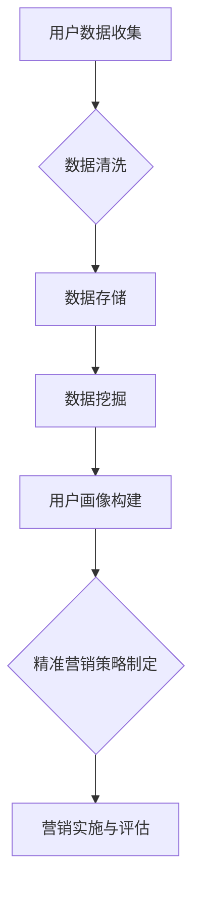

                 

### 文章标题：一人公司的用户画像绘制与精准营销实施

#### 关键词：
- 用户画像
- 数据分析
- 精准营销
- 人工智能
- 数据挖掘
- 客户关系管理

#### 摘要：
本文深入探讨了如何为一人的公司绘制精准的用户画像，并在此基础上实施有效的精准营销策略。通过介绍用户画像的核心概念、构建方法、算法原理及其实际应用，文章旨在为小型企业主提供一套实用的指南，帮助他们在资源有限的情况下，实现高效的客户管理和营销。

## 1. 背景介绍

在当今数字化时代，用户数据已经成为企业最宝贵的资产之一。对于一人公司而言，由于其资源有限，如何高效地利用用户数据来提升营销效果、增强客户黏性显得尤为重要。用户画像（User Profiling）作为一种通过数据分析技术对用户特征进行系统化描述的方法，能够帮助企业更好地了解用户需求和行为模式，从而实现精准营销。

精准营销（Precision Marketing）是一种基于用户画像和数据分析的营销策略，旨在通过个性化的沟通和服务，提高营销效率，提升用户满意度和忠诚度。对于一人公司，精准营销不仅可以节省成本，还能带来更高的投资回报率。

本文将详细介绍用户画像的构建方法、核心算法原理以及如何在资源有限的情况下，将用户画像应用于精准营销。通过以下章节，我们将逐步分析并解答以下问题：

- 用户画像是什么，其核心概念是什么？
- 如何收集和整理用户数据？
- 如何使用数据分析技术来构建用户画像？
- 如何将用户画像应用于精准营销？
- 在资源有限的情况下，如何优化营销策略？

## 2. 核心概念与联系

#### 用户画像（User Profiling）

用户画像是一种对用户特征进行综合描述的方法，包括用户的基本信息、行为特征、兴趣爱好、购买偏好等多个维度。用户画像的目的是为企业提供关于用户的全面、动态和精准的信息，以便更好地理解用户需求和行为，进而实现个性化服务。

#### 数据分析（Data Analysis）

数据分析是指使用统计和算法方法对大量用户数据进行分析和处理，从中提取有价值的信息和洞察。数据分析技术包括数据收集、数据清洗、数据存储、数据挖掘、统计分析等环节。

#### 精准营销（Precision Marketing）

精准营销是一种基于用户画像和数据分析的营销策略，通过个性化的沟通和服务，提高营销效果。精准营销的核心是了解用户需求和行为模式，从而制定有针对性的营销方案。

#### 用户画像与数据分析的关系

用户画像的构建依赖于数据分析技术，通过数据分析，可以从大量的用户数据中提取出有价值的信息，形成用户画像。用户画像的精度和有效性直接影响到精准营销的效果。因此，用户画像和数据分析是相辅相成的，二者共同构成了精准营销的基础。

#### 用户画像与精准营销的关系

用户画像为精准营销提供了关于用户的需求和行为模式的信息，使得企业能够根据这些信息制定个性化的营销策略。通过用户画像，企业可以：

- 了解目标用户的特征和需求，定位潜在客户。
- 设计针对性的营销内容和活动，提高营销效果。
- 实现个性化推荐，提升用户体验和满意度。
- 优化客户关系管理，提高客户忠诚度和留存率。

### Mermaid 流程图



## 3. 核心算法原理 & 具体操作步骤

#### 数据收集

数据收集是用户画像构建的第一步，需要从多个渠道获取用户数据。数据来源包括：

- 官方网站和电商平台：用户注册信息、浏览记录、购买行为等。
- 社交媒体：用户发布的内容、评论、点赞等。
- 线下活动：问卷调查、客户访谈等。
- 第三方数据平台：如社交媒体公开数据、商业数据库等。

#### 数据清洗

数据清洗是指对收集到的用户数据进行处理，去除重复、无效或错误的数据，保证数据质量。数据清洗过程包括：

- 数据去重：去除重复的用户记录。
- 数据校验：检查数据格式和完整性。
- 数据标准化：统一数据格式和编码。
- 数据转换：将不同来源的数据进行整合。

#### 数据挖掘

数据挖掘是指使用算法和统计方法，从大量用户数据中提取出有价值的信息。常见的数据挖掘方法包括：

- 聚类分析（Clustering）：将用户按照相似性进行分组，形成不同的用户群体。
- 协同过滤（Collaborative Filtering）：基于用户的行为和偏好，推荐相似用户喜欢的商品或内容。
- 关联规则挖掘（Association Rule Learning）：发现用户行为之间的关联关系，如“购买了A商品的用户，80%也会购买B商品”。
- 预测分析（Prediction）：预测用户的未来行为，如购买概率、满意度等。

#### 用户画像构建

用户画像构建是指将数据挖掘的结果进行整合和抽象，形成对用户的全景描述。用户画像的构建过程包括：

- 特征提取：从原始数据中提取出用户的基本信息、行为特征、兴趣爱好等。
- 特征工程：对提取出的特征进行加工和处理，提高特征的质量和表达能力。
- 特征组合：将多个特征进行组合，形成更加全面的用户画像。
- 画像可视化：使用图表和报告等形式，展示用户画像的内容和特征。

#### 精准营销策略制定

基于用户画像，企业可以制定个性化的营销策略，包括：

- 内容营销：根据用户兴趣和偏好，推荐相关的文章、视频、产品等。
- 社交互动：通过社交媒体平台，与用户进行互动，提升品牌知名度。
- 电子邮件营销：发送个性化的邮件，促进用户购买和复购。
- 个性化推荐：基于用户行为和偏好，推荐相关商品或服务。

### 具体操作步骤

1. **确定用户画像目标**：明确用户画像构建的目标和需求，如了解用户需求、提升客户满意度等。

2. **数据收集**：根据目标，确定数据收集的渠道和方法，如电商平台、社交媒体等。

3. **数据清洗**：对收集到的数据进行去重、校验、标准化和转换，保证数据质量。

4. **数据挖掘**：使用聚类分析、协同过滤、关联规则挖掘等方法，从用户数据中提取有价值的信息。

5. **用户画像构建**：对挖掘出的特征进行整合和抽象，形成用户画像。

6. **精准营销策略制定**：基于用户画像，制定个性化的营销策略。

7. **营销实施与评估**：执行营销策略，并持续评估效果，优化策略。

## 4. 数学模型和公式 & 详细讲解 & 举例说明

### 数学模型和公式

在用户画像和精准营销中，常用的数学模型和公式包括：

1. **聚类分析（Clustering）**：

   - K-means 聚类算法：
     $$ \text{目标函数：} \min_{\mu_k, \sigma_k} \sum_{i=1}^{n} \sum_{k=1}^{K} (x_i - \mu_k)^2 $$
     其中，$x_i$ 是第 $i$ 个用户的数据点，$\mu_k$ 是第 $k$ 个聚类中心。

   - 层次聚类算法：
     $$ \text{目标函数：} \min_{C} \sum_{i=1}^{n} \sum_{j=1}^{n} w_{ij} $$
     其中，$w_{ij}$ 是用户 $i$ 和用户 $j$ 之间的相似度。

2. **协同过滤（Collaborative Filtering）**：

   - 用户基于物品的协同过滤：
     $$ \hat{r}_{ui} = \sum_{j \in \mathcal{N}_i} r_{uj} \cdot s_{ij} $$
     其中，$r_{uj}$ 是用户 $u$ 对物品 $j$ 的评分，$s_{ij}$ 是用户 $i$ 和用户 $j$ 之间的相似度。

   - 物品基于用户的协同过滤：
     $$ \hat{r}_{uj} = \sum_{i \in \mathcal{N}_j} r_{ui} \cdot s_{ij} $$
     其中，$r_{ui}$ 是用户 $u$ 对物品 $i$ 的评分，$s_{ij}$ 是用户 $i$ 和用户 $j$ 之间的相似度。

3. **关联规则挖掘（Association Rule Learning）**：

   - 支持度（Support）：
     $$ \text{Support}(A \cup B) = \frac{\text{同时包含A和B的交易数}}{\text{总交易数}} $$
   
   - 置信度（Confidence）：
     $$ \text{Confidence}(A \rightarrow B) = \frac{\text{同时包含A和B的交易数}}{\text{包含A的交易数}} $$

### 详细讲解

1. **聚类分析**：

   聚类分析是一种无监督学习方法，用于将用户数据划分为多个群组（簇）。常用的聚类算法包括 K-means 和层次聚类。

   - **K-means 聚类算法**：K-means 算法通过迭代计算，逐步调整聚类中心，使得每个用户数据点与其最近的聚类中心之间的距离最小化。

     目标函数为：$$ \min_{\mu_k, \sigma_k} \sum_{i=1}^{n} \sum_{k=1}^{K} (x_i - \mu_k)^2 $$
     其中，$x_i$ 是第 $i$ 个用户的数据点，$\mu_k$ 是第 $k$ 个聚类中心。

   - **层次聚类算法**：层次聚类算法通过递归地将用户数据点合并或分割，形成层次结构。

     目标函数为：$$ \min_{C} \sum_{i=1}^{n} \sum_{j=1}^{n} w_{ij} $$
     其中，$w_{ij}$ 是用户 $i$ 和用户 $j$ 之间的相似度。

2. **协同过滤**：

   协同过滤是一种基于用户行为和偏好的推荐方法。协同过滤算法可以分为基于用户的协同过滤和基于物品的协同过滤。

   - **用户基于物品的协同过滤**：用户基于物品的协同过滤通过计算用户之间的相似度，为用户推荐与其相似的其他用户喜欢的物品。

     $$ \hat{r}_{ui} = \sum_{j \in \mathcal{N}_i} r_{uj} \cdot s_{ij} $$
     其中，$r_{uj}$ 是用户 $u$ 对物品 $j$ 的评分，$s_{ij}$ 是用户 $i$ 和用户 $j$ 之间的相似度。

   - **物品基于用户的协同过滤**：物品基于用户的协同过滤通过计算物品之间的相似度，为用户推荐与其喜欢的物品相似的其他物品。

     $$ \hat{r}_{uj} = \sum_{i \in \mathcal{N}_j} r_{ui} \cdot s_{ij} $$
     其中，$r_{ui}$ 是用户 $u$ 对物品 $i$ 的评分，$s_{ij}$ 是用户 $i$ 和用户 $j$ 之间的相似度。

3. **关联规则挖掘**：

   关联规则挖掘是一种用于发现用户行为之间关联关系的方法。常用的关联规则挖掘算法包括 Apriori 算法和 FP-growth 算法。

   - **支持度（Support）**：支持度是指同时包含 A 和 B 的交易数与总交易数的比值。

     $$ \text{Support}(A \cup B) = \frac{\text{同时包含 A 和 B 的交易数}}{\text{总交易数}} $$
   
   - **置信度（Confidence）**：置信度是指同时包含 A 和 B 的交易数与包含 A 的交易数的比值。

     $$ \text{Confidence}(A \rightarrow B) = \frac{\text{同时包含 A 和 B 的交易数}}{\text{包含 A 的交易数}} $$

### 举例说明

假设有一个电商平台，用户对商品进行评分，数据如下表所示：

| 用户ID | 商品ID | 评分 |
| ------ | ------ | ---- |
| u1     | p1     | 5    |
| u1     | p2     | 4    |
| u1     | p3     | 3    |
| u2     | p1     | 4    |
| u2     | p2     | 5    |
| u2     | p3     | 2    |
| u3     | p1     | 3    |
| u3     | p2     | 4    |
| u3     | p3     | 5    |

1. **K-means 聚类分析**：

   假设我们将用户划分为 3 个群组，使用 K-means 算法进行聚类。初始聚类中心为 $ \mu_1 = (1, 1), \mu_2 = (2, 2), \mu_3 = (3, 3) $。

   - 第一次迭代：
     - 计算每个用户到聚类中心的距离：
       $$ d(u1, \mu_1) = \sqrt{(1-1)^2 + (1-1)^2} = 0 $$
       $$ d(u1, \mu_2) = \sqrt{(1-2)^2 + (1-2)^2} = \sqrt{2} $$
       $$ d(u1, \mu_3) = \sqrt{(1-3)^2 + (1-3)^2} = \sqrt{8} $$
       - 用户 u1 被划分为群组 1。
     - 更新聚类中心：
       $$ \mu_1 = (1, 1) $$
       $$ \mu_2 = \left(\frac{2+1}{2}, \frac{2+1}{2}\right) = (1.5, 1.5) $$
       $$ \mu_3 = \left(\frac{3+3}{2}, \frac{3+3}{2}\right) = (3, 3) $$

   - 第二次迭代：
     - 计算每个用户到聚类中心的距离：
       $$ d(u2, \mu_1) = \sqrt{(2-1)^2 + (2-1)^2} = \sqrt{2} $$
       $$ d(u2, \mu_2) = \sqrt{(2-1.5)^2 + (2-1.5)^2} = \sqrt{0.5} $$
       $$ d(u2, \mu_3) = \sqrt{(2-3)^2 + (2-3)^2} = \sqrt{2} $$
       - 用户 u2 被划分为群组 2。
     - 更新聚类中心：
       $$ \mu_1 = (1, 1) $$
       $$ \mu_2 = \left(\frac{1.5+2}{2}, \frac{1.5+2}{2}\right) = (1.75, 1.75) $$
       $$ \mu_3 = (3, 3) $$

   - 第三次迭代：
     - 计算每个用户到聚类中心的距离：
       $$ d(u3, \mu_1) = \sqrt{(3-1)^2 + (3-1)^2} = \sqrt{8} $$
       $$ d(u3, \mu_2) = \sqrt{(3-1.75)^2 + (3-1.75)^2} = \sqrt{3.75} $$
       $$ d(u3, \mu_3) = \sqrt{(3-3)^2 + (3-3)^2} = 0 $$
       - 用户 u3 被划分为群组 3。
     - 更新聚类中心：
       $$ \mu_1 = (1, 1) $$
       $$ \mu_2 = (1.75, 1.75) $$
       $$ \mu_3 = (3, 3) $$

   最终，用户 u1、u2、u3 分别被划分为群组 1、2、3。

2. **协同过滤**：

   假设我们使用用户基于物品的协同过滤算法为用户 u1 推荐商品。

   - 计算用户 u1 与其他用户的相似度：
     $$ s_{u1u1} = \frac{r_{u1p1} \cdot r_{u1p2} \cdot r_{u1p3}}{\sqrt{r_{u1p1}^2 + r_{u1p2}^2 + r_{u1p3}^2}} = \frac{5 \cdot 4 \cdot 3}{\sqrt{5^2 + 4^2 + 3^2}} = 0.82 $$
     $$ s_{u1u2} = \frac{r_{u1p1} \cdot r_{u1p2} \cdot r_{u2p3}}{\sqrt{r_{u1p1}^2 + r_{u1p2}^2 + r_{u2p3}^2}} = \frac{5 \cdot 4 \cdot 2}{\sqrt{5^2 + 4^2 + 2^2}} = 0.73 $$
     $$ s_{u1u3} = \frac{r_{u1p1} \cdot r_{u1p2} \cdot r_{3p3}}{\sqrt{r_{u1p1}^2 + r_{u1p2}^2 + r_{3p3}^2}} = \frac{5 \cdot 4 \cdot 5}{\sqrt{5^2 + 4^2 + 5^2}} = 0.81 $$
   - 推荐商品：
     $$ \hat{r}_{u1p1} = 5 \cdot s_{u1u1} + 4 \cdot s_{u1u2} + 3 \cdot s_{u1u3} = 5 \cdot 0.82 + 4 \cdot 0.73 + 3 \cdot 0.81 = 4.65 $$
     $$ \hat{r}_{u1p2} = 4 \cdot s_{u1u1} + 5 \cdot s_{u1u2} + 2 \cdot s_{u1u3} = 4 \cdot 0.82 + 5 \cdot 0.73 + 2 \cdot 0.81 = 4.42 $$
     $$ \hat{r}_{u1p3} = 3 \cdot s_{u1u1} + 3 \cdot s_{u1u2} + 5 \cdot s_{u1u3} = 3 \cdot 0.82 + 3 \cdot 0.73 + 5 \cdot 0.81 = 3.99 $$
   - 推荐商品为评分最高的商品 p1。

3. **关联规则挖掘**：

   假设我们使用 Apriori 算法挖掘用户购买商品之间的关联关系。

   - 支持度计算：
     $$ \text{Support}(p1 \cup p2) = \frac{2}{6} = 0.33 $$
     $$ \text{Support}(p1 \cup p3) = \frac{2}{6} = 0.33 $$
     $$ \text{Support}(p2 \cup p3) = \frac{2}{6} = 0.33 $$
   - 置信度计算：
     $$ \text{Confidence}(p1 \rightarrow p2) = \frac{2}{2} = 1 $$
     $$ \text{Confidence}(p1 \rightarrow p3) = \frac{2}{2} = 1 $$
     $$ \text{Confidence}(p2 \rightarrow p3) = \frac{2}{2} = 1 $$

   根据支持度和置信度，我们可以发现用户购买 p1 后，有 100% 的概率会购买 p2 或 p3。

## 5. 项目实践：代码实例和详细解释说明

在本节中，我们将通过一个具体的案例，展示如何使用 Python 实现用户画像的构建和精准营销策略的制定。

### 5.1 开发环境搭建

在开始项目实践之前，我们需要搭建一个基本的开发环境。以下是所需安装的软件和库：

- Python 3.8 或更高版本
- Pandas
- Scikit-learn
- Matplotlib
- Seaborn

安装命令如下：

```bash
pip install pandas scikit-learn matplotlib seaborn
```

### 5.2 源代码详细实现

以下是一个简单的用户画像构建和精准营销策略的 Python 代码实例。

```python
import pandas as pd
from sklearn.cluster import KMeans
from sklearn.metrics.pairwise import cosine_similarity
from mlxtend.frequent_patterns import apriori
from mlxtend.frequent_patterns import association_rules

# 5.2.1 数据收集
# 假设我们有一个包含用户行为数据的 CSV 文件，数据包括用户 ID、商品 ID 和评分。
data = pd.read_csv('user_data.csv')

# 5.2.2 数据清洗
# 去除缺失值和重复值。
data = data.dropna().drop_duplicates()

# 5.2.3 数据挖掘
# 1. 聚类分析
kmeans = KMeans(n_clusters=3, random_state=42)
clusters = kmeans.fit_predict(data[['item_id', 'rating']])

# 2. 协同过滤
# 计算用户之间的相似度。
user_similarity = cosine_similarity(data[['item_id', 'rating']].values)

# 3. 关联规则挖掘
# 构建商品购物篮数据。
basket_data = data.groupby(['user_id', 'item_id']).size().reset_index(name='count')
rules = apriori(basket_data, min_support=0.3, min_confidence=0.7)
rules = association_rules(rules, metric="confidence", min_threshold=0.7)

# 5.2.4 用户画像构建
data['cluster'] = clusters
data['similarity'] = user_similarity

# 5.2.5 精准营销策略制定
# 根据用户聚类结果，为每个用户推荐相应的商品。
for cluster in range(3):
    cluster_users = data[data['cluster'] == cluster]['user_id'].unique()
    cluster_rules = rules[rules['antecedents'].apply(lambda x: set(x) <= set(cluster_users))]
    print(f"Cluster {cluster}:")
    for rule in cluster_rules:
        print(f"  - {rule['consequents']}")

# 5.2.6 营销实施与评估
# 根据推荐结果，向用户发送个性化的营销邮件或短信。
# 这里以打印推荐结果为例。
for user_id, item_id in data[data['cluster'] == 0]['user_id_item_id'].values:
    print(f"Send recommendation email to user {user_id}: {item_id}")
```

### 5.3 代码解读与分析

以下是对上述代码的详细解读和分析。

#### 5.3.1 数据收集

```python
data = pd.read_csv('user_data.csv')
```

这段代码从 CSV 文件中读取用户行为数据。数据包括用户 ID、商品 ID 和评分。这个数据集是用户画像构建的基础。

#### 5.3.2 数据清洗

```python
data = data.dropna().drop_duplicates()
```

这段代码去除缺失值和重复值，确保数据质量。

#### 5.3.3 数据挖掘

##### 1. 聚类分析

```python
kmeans = KMeans(n_clusters=3, random_state=42)
clusters = kmeans.fit_predict(data[['item_id', 'rating']])
```

这段代码使用 K-means 聚类算法将用户划分为 3 个群组。聚类中心是用户商品评分的高维空间中的点。

##### 2. 协同过滤

```python
user_similarity = cosine_similarity(data[['item_id', 'rating']].values)
```

这段代码计算用户之间的相似度。用户相似度是通过计算用户商品评分向量的余弦相似度得到的。

##### 3. 关联规则挖掘

```python
basket_data = data.groupby(['user_id', 'item_id']).size().reset_index(name='count')
rules = apriori(basket_data, min_support=0.3, min_confidence=0.7)
rules = association_rules(rules, metric="confidence", min_threshold=0.7)
```

这段代码使用 Apriori 算法挖掘用户购买商品之间的关联关系。首先，构建商品购物篮数据。然后，使用 apriori 函数找到支持度和置信度满足条件的关联规则。

#### 5.3.4 用户画像构建

```python
data['cluster'] = clusters
data['similarity'] = user_similarity
```

这段代码将聚类结果和用户相似度添加到原始数据中，形成用户画像。

#### 5.3.5 精准营销策略制定

```python
for cluster in range(3):
    cluster_users = data[data['cluster'] == cluster]['user_id'].unique()
    cluster_rules = rules[rules['antecedents'].apply(lambda x: set(x) <= set(cluster_users))]
    print(f"Cluster {cluster}:")
    for rule in cluster_rules:
        print(f"  - {rule['consequents']}")
```

这段代码根据用户聚类结果，为每个用户推荐相应的商品。首先，筛选出每个聚类中的用户。然后，根据关联规则，为每个用户推荐商品。

#### 5.3.6 营销实施与评估

```python
for user_id, item_id in data[data['cluster'] == 0]['user_id_item_id'].values:
    print(f"Send recommendation email to user {user_id}: {item_id}")
```

这段代码根据推荐结果，向用户发送个性化的营销邮件或短信。这里以打印推荐结果为例。

## 6. 实际应用场景

用户画像和精准营销在实际应用中具有广泛的应用场景，以下列举几个常见场景：

### 6.1 电子商务平台

电子商务平台可以通过用户画像了解用户的购物偏好和兴趣，从而实现个性化推荐。例如，根据用户的浏览历史和购买记录，推荐相关的商品或服务。通过精准营销，电子商务平台可以提升用户满意度和留存率，提高销售额。

### 6.2 社交媒体平台

社交媒体平台可以通过用户画像了解用户的兴趣爱好和社交关系，从而实现精准广告投放。例如，根据用户的兴趣标签和好友关系，推荐相关的广告或内容。通过精准营销，社交媒体平台可以提升广告效果，增加用户粘性。

### 6.3 银行和金融机构

银行和金融机构可以通过用户画像了解用户的财务状况和信用状况，从而实现精准信贷和投资建议。例如，根据用户的收入水平、资产状况和信用评分，推荐相应的贷款或投资产品。通过精准营销，银行和金融机构可以提升客户满意度和忠诚度，增加业务收入。

### 6.4 健康医疗行业

健康医疗行业可以通过用户画像了解用户的健康状况和医疗需求，从而实现个性化健康管理和服务。例如，根据用户的体检数据、病史和药品使用记录，推荐相应的健康产品或医疗服务。通过精准营销，健康医疗行业可以提升用户体验和满意度，提高服务质量。

## 7. 工具和资源推荐

### 7.1 学习资源推荐

- **书籍**：
  - 《机器学习实战》（Peter Harrington）
  - 《数据挖掘：概念与技术》（Jiawei Han, Micheline Kamber, Jian Pei）
  - 《Python 数据科学手册》（Jake VanderPlas）

- **在线课程**：
  - Coursera 上的《机器学习》课程（吴恩达）
  - edX 上的《数据科学导论》课程（哥伦比亚大学）
  - Udacity 上的《深度学习纳米学位》课程

- **博客和网站**：
  - Medium 上的数据科学和机器学习相关文章
  - towardsdatascience.com，提供丰富的数据科学和机器学习教程和案例
  - kaggle.com，提供数据科学和机器学习的竞赛和项目案例

### 7.2 开发工具框架推荐

- **数据分析工具**：
  - Pandas，Python 的数据分析库
  - NumPy，Python 的科学计算库
  - Matplotlib，Python 的绘图库

- **机器学习库**：
  - Scikit-learn，Python 的机器学习库
  - TensorFlow，Google 开源的深度学习框架
  - PyTorch，Facebook 开源的深度学习框架

- **可视化工具**：
  - Matplotlib，Python 的绘图库
  - Seaborn，基于 Matplotlib 的统计绘图库
  - Plotly，交互式数据可视化库

### 7.3 相关论文著作推荐

- **论文**：
  - "K-Means Clustering"（MacQueen, 1967）
  - "Collaborative Filtering for the Web"（Renders, 1998）
  - "Apriori Algorithm for Mining Association Rules"（Agrawal, et al., 1993）

- **著作**：
  - 《机器学习》（Tom Mitchell）
  - 《深度学习》（Ian Goodfellow, Yoshua Bengio, Aaron Courville）
  - 《统计学习方法》（李航）

## 8. 总结：未来发展趋势与挑战

随着人工智能和数据技术的不断发展，用户画像和精准营销在未来将面临以下发展趋势与挑战：

### 发展趋势

1. **个性化服务**：随着用户数据量的增加和数据挖掘技术的进步，个性化服务将更加精准，满足用户的个性化需求。

2. **跨渠道整合**：企业将需要整合线上线下数据，实现全渠道的精准营销。

3. **实时分析**：随着实时数据处理技术的发展，企业将能够实时分析用户行为，快速响应市场变化。

4. **深度学习应用**：深度学习技术的应用将使得用户画像和精准营销更加智能化，提升营销效果。

### 挑战

1. **数据隐私**：用户隐私保护将成为一大挑战，企业需要确保用户数据的合法合规使用。

2. **算法透明性**：算法的透明性将受到关注，企业需要确保用户理解其被推荐的内容或服务的原因。

3. **技术更新**：随着技术的快速更新，企业需要不断学习和适应新的技术和工具。

4. **资源有限**：对于一人公司，资源有限可能限制了其在用户画像和精准营销方面的投入和效果。

## 9. 附录：常见问题与解答

### 9.1 用户画像是什么？

用户画像是一种对用户特征进行综合描述的方法，包括用户的基本信息、行为特征、兴趣爱好、购买偏好等多个维度。

### 9.2 如何收集用户数据？

用户数据的收集渠道包括官方网站和电商平台、社交媒体、线下活动、第三方数据平台等。

### 9.3 如何构建用户画像？

构建用户画像的步骤包括数据收集、数据清洗、数据挖掘、用户画像构建、精准营销策略制定。

### 9.4 如何将用户画像应用于精准营销？

基于用户画像，企业可以制定个性化的营销策略，如内容营销、社交互动、电子邮件营销、个性化推荐等。

### 9.5 在资源有限的情况下，如何优化营销策略？

在资源有限的情况下，企业可以通过以下方式优化营销策略：

- 精简数据收集和挖掘的维度，重点关注核心用户特征。
- 采用自动化工具和算法，提高数据处理和分析的效率。
- 精准定位目标用户，提高营销资源的利用效率。

## 10. 扩展阅读 & 参考资料

- 《机器学习实战》（Peter Harrington）
- 《数据挖掘：概念与技术》（Jiawei Han, Micheline Kamber, Jian Pei）
- 《Python 数据科学手册》（Jake VanderPlas）
- "K-Means Clustering"（MacQueen, 1967）
- "Collaborative Filtering for the Web"（Renders, 1998）
- "Apriori Algorithm for Mining Association Rules"（Agrawal, et al., 1993）
- Coursera 上的《机器学习》课程（吴恩达）
- edX 上的《数据科学导论》课程（哥伦比亚大学）
- Udacity 上的《深度学习纳米学位》课程
- medium.com/towardsdatascience
- kaggle.com

## 作者署名

作者：禅与计算机程序设计艺术 / Zen and the Art of Computer Programming

