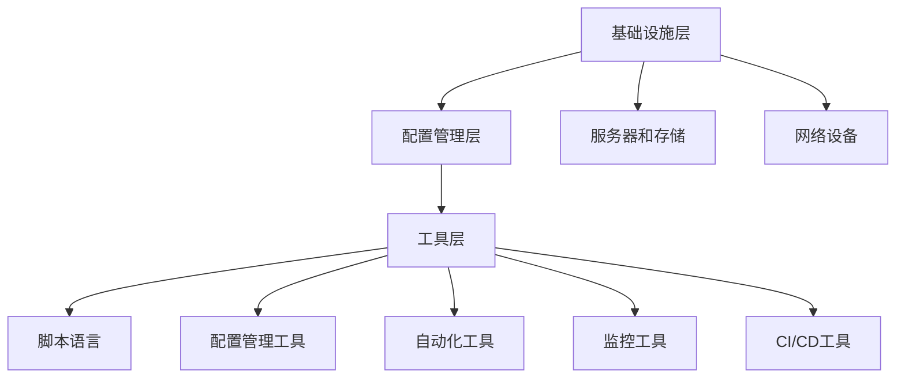

                 

### 背景介绍

#### 运维的定义与重要性

运维（Operations），通常指的是信息技术（IT）领域中的运营和维护工作。它涵盖了从系统部署、监控、维护到故障排除等一系列任务。运维的核心理念是确保IT系统的稳定性和可靠性，同时提高系统的性能和可用性。在现代企业中，运维的重要性日益凸显，它不仅关系到业务的连续性和数据的完整性，还直接影响到企业的效率和竞争力。

随着云计算、大数据、物联网等技术的发展，IT系统的复杂性不断增加，传统的手工运维模式逐渐无法满足日益增长的需求。自动化运维应运而生，成为现代企业提升运维效率、降低成本、提高服务质量的重要手段。

#### 自动化运维的概念与演变

自动化运维（Automated Operations）是指通过脚本、工具和平台实现IT运维任务的自动化执行。其核心思想是减少人工干预，提高运维效率，降低人为错误的风险。自动化运维的发展大致可以分为三个阶段：

1. **脚本自动化**：这是自动化运维的初级阶段，主要依靠脚本语言（如Bash、Python等）编写简单任务，实现自动化执行。

2. **工具集成**：随着运维任务的增加和复杂度的提升，单一的脚本已经无法满足需求。这时，运维工具如Puppet、Chef、Ansible等开始流行，它们提供了更加丰富和高效的自动化功能，支持大规模基础设施的管理。

3. **平台化运维**：现代自动化运维进入平台化阶段，以企业级运维平台（如Puppet Enterprise、AWS运维工具等）为代表，提供了全面的自动化功能、集中化管理界面和强大的数据处理能力。

#### 自动化运维的目标

自动化运维的主要目标是：

- **提高运维效率**：通过自动化工具和流程，显著减少运维工作的时间和人力成本。
- **降低故障率**：减少人为操作错误，提高系统的稳定性和可靠性。
- **增强可扩展性**：支持大规模基础设施的管理，适应企业业务的快速扩展。
- **提高资源利用率**：优化资源配置，减少浪费，降低运营成本。

#### 文章的阅读对象

本文旨在为IT运维人员、开发人员以及对企业自动化运维感兴趣的技术爱好者提供一份全面且深入的指南。通过本文，读者可以了解自动化运维的基本概念、核心工具和平台，掌握自动化运维的实践方法，并在实际项目中应用。

在接下来的章节中，我们将详细探讨自动化运维的核心概念和原理，深入分析其技术架构和实施步骤，并通过实例展示如何在实际项目中应用自动化运维。希望通过本文，读者能够对自动化运维有更深入的理解，并将其成功应用于自己的工作中。

### 核心概念与联系

#### 自动化运维的核心概念

在探讨自动化运维的核心概念之前，我们首先需要了解一些基本的技术和工具。自动化运维的核心概念包括但不限于以下几个方面：

- **脚本语言**：如Bash、Python等，用于编写自动化脚本，执行具体的运维任务。
- **配置管理工具**：如Puppet、Chef、Ansible等，用于大规模基础设施的管理和配置。
- **自动化工具**：如Ansible Playbooks、Shell脚本等，用于自动化执行运维任务。
- **监控工具**：如Nagios、Zabbix等，用于实时监控系统的运行状态，及时报警和处理异常。
- **持续集成/持续部署（CI/CD）**：如Jenkins、GitLab CI等，用于自动化构建、测试和部署软件。

#### 自动化运维的技术架构

自动化运维的技术架构可以分为三个主要层次：基础设施层、配置管理层、工具层。

1. **基础设施层**：
   - **服务器和存储**：包括物理服务器、虚拟机、容器等，是自动化运维的基础设施。
   - **网络设备**：如交换机、路由器等，用于网络管理和通信。

2. **配置管理层**：
   - **配置管理工具**：如Puppet、Chef、Ansible等，用于自动化配置和管理服务器和应用程序。
   - **配置文件**：如YAML、JSON、Shell脚本等，定义了系统配置和自动化任务。

3. **工具层**：
   - **自动化工具**：如Ansible Playbooks、Shell脚本等，用于自动化执行具体的运维任务。
   - **监控工具**：如Nagios、Zabbix等，用于实时监控系统和应用程序的运行状态。
   - **CI/CD工具**：如Jenkins、GitLab CI等，用于自动化构建、测试和部署软件。

#### Mermaid 流程图

以下是一个简单的Mermaid流程图，展示了自动化运维的核心概念和技术架构：



通过这个流程图，我们可以清晰地看到自动化运维的各个组成部分及其相互关系。

#### 自动化运维的实现过程

自动化运维的实现过程可以分为以下几个步骤：

1. **需求分析**：明确自动化运维的目标和需求，确定需要自动化的运维任务。
2. **环境搭建**：搭建自动化运维的基础设施，包括服务器、存储和网络设备。
3. **配置管理**：使用配置管理工具定义系统配置和自动化任务，确保配置的一致性和可管理性。
4. **脚本编写**：编写自动化脚本，实现具体的运维任务自动化。
5. **监控与报警**：使用监控工具实时监控系统和应用程序的运行状态，及时报警和处理异常。
6. **CI/CD集成**：将自动化运维集成到CI/CD流程中，实现自动化构建、测试和部署。

#### 自动化运维的优势

自动化运维具有以下优势：

- **提高运维效率**：自动化工具可以显著减少运维工作的时间和人力成本。
- **降低故障率**：减少人为操作错误，提高系统的稳定性和可靠性。
- **增强可扩展性**：支持大规模基础设施的管理，适应企业业务的快速扩展。
- **提高资源利用率**：优化资源配置，减少浪费，降低运营成本。

#### 自动化运维的挑战

虽然自动化运维具有显著的优势，但在实际应用过程中也面临一些挑战：

- **复杂度增加**：自动化运维需要掌握多种技术和工具，对运维人员的要求较高。
- **安全性问题**：自动化脚本和工具可能存在安全漏洞，需要严格的安全管理和监控。
- **维护成本**：自动化运维系统需要定期更新和维护，确保其稳定性和可靠性。

#### 自动化运维的发展趋势

随着云计算、大数据、人工智能等技术的发展，自动化运维将继续向智能化、自动化、高效化的方向发展。未来，自动化运维将更加依赖人工智能和机器学习技术，实现更智能的自动化任务管理和优化。同时，自动化运维也将与其他新兴技术如区块链、物联网等深度融合，推动企业数字化转型。

通过以上对自动化运维核心概念、技术架构和实现过程的介绍，我们可以更好地理解自动化运维的基本原理和应用场景。在接下来的章节中，我们将深入探讨自动化运维的具体算法原理和实现方法，并通过实例展示其在实际项目中的应用。

#### 核心算法原理 & 具体操作步骤

在深入探讨自动化运维的核心算法原理和具体操作步骤之前，我们首先需要明确几个基本概念：配置管理、脚本编写、监控报警和CI/CD集成。

##### 配置管理

配置管理是自动化运维的核心，它确保了系统的配置的一致性和可管理性。配置管理工具如Puppet、Chef、Ansible等，通过定义配置文件和自动化任务，实现了对基础设施的自动化配置和管理。

1. **Puppet**：Puppet使用RAML语言定义配置，通过Puppet Master向Puppet Agent分发配置。Puppet Master负责编译配置文件，生成执行计划，而Puppet Agent则执行这些计划，确保系统的配置符合预期。

2. **Chef**：Chef使用Ruby语言定义配置，通过Chef Server存储和分发配置，而Chef Client则执行这些配置。Chef提供了丰富的库和资源，支持各种系统和应用程序的自动化配置。

3. **Ansible**：Ansible使用YAML语言定义配置，通过SSH协议远程执行命令。Ansible Playbook是一系列命令的集合，用于定义和自动化运维任务。

##### 脚本编写

脚本编写是实现自动化运维任务的重要手段。常见的脚本语言包括Bash、Python、PowerShell等。以下是一个简单的Bash脚本示例，用于自动安装和配置Nginx：

```bash
#!/bin/bash
# 安装Nginx
sudo apt update
sudo apt install nginx

# 配置Nginx
sudo echo "<h1>Hello, World!</h1>" | sudo tee /var/www/html/index.html

# 启动Nginx
sudo systemctl start nginx
```

##### 监控报警

监控报警是确保系统稳定性和可靠性的关键环节。常见的监控工具包括Nagios、Zabbix等。以下是一个简单的Nagios配置示例，用于监控Nginx服务的状态：

1. **Nagios**：Nagios是一个开源的监控工具，通过配置Nagios Core和插件，可以监控各种系统和应用程序的运行状态。

2. **Zabbix**：Zabbix是一个功能强大的监控工具，支持各种监控项和报警方式，通过Web界面展示监控数据和报警信息。

##### CI/CD集成

CI/CD（持续集成/持续部署）是自动化运维的重要部分，它实现了软件的自动化构建、测试和部署。Jenkins、GitLab CI等是常见的CI/CD工具。

1. **Jenkins**：Jenkins是一个开源的持续集成工具，通过配置Jenkinsfile，可以实现自动化构建、测试和部署。

2. **GitLab CI**：GitLab CI是GitLab内置的持续集成服务，通过在`.gitlab-ci.yml`文件中定义构建和部署流程，可以实现自动化CI/CD。

##### 具体操作步骤

以下是一个自动化运维的具体操作步骤示例，涵盖了配置管理、脚本编写、监控报警和CI/CD集成：

1. **配置管理**：
   - 使用Ansible定义Nginx的配置，包括安装脚本和配置文件。
   - 将Ansible Playbook推送到所有目标服务器，确保Nginx配置一致。

2. **脚本编写**：
   - 编写Bash脚本，用于自动化安装和配置Nginx。
   - 将脚本部署到服务器，确保脚本能够正确执行。

3. **监控报警**：
   - 配置Nagios监控Nginx服务，设置报警阈值和通知方式。
   - 当Nginx服务异常时，Nagios会自动发送报警信息。

4. **CI/CD集成**：
   - 配置Jenkins，通过GitLab CI实现自动化构建和部署。
   - 每次代码提交后，Jenkins会自动构建和测试，并部署到生产环境。

##### 数学模型和公式

在自动化运维中，数学模型和公式用于计算资源利用率、故障率等关键指标。以下是一个简单的数学模型示例：

1. **资源利用率**：
   $$ \text{资源利用率} = \frac{\text{已使用资源}}{\text{总资源}} \times 100\% $$

2. **故障率**：
   $$ \text{故障率} = \frac{\text{故障次数}}{\text{总运行时间}} $$

##### 举例说明

以下是一个具体的自动化运维项目示例，用于部署和管理Nginx服务器：

1. **需求分析**：
   - 部署10台Nginx服务器，提供网站托管服务。
   - 使用Ansible进行配置管理，确保服务器配置一致。
   - 使用Nagios进行监控报警，确保服务器运行正常。

2. **环境搭建**：
   - 搭建Ansible控制主机，配置目标服务器。
   - 安装Nginx服务器，并使用Ansible Playbook进行配置。

3. **脚本编写**：
   - 编写Bash脚本，用于自动化安装和配置Nginx。
   - 将脚本部署到所有目标服务器，确保脚本正确执行。

4. **监控报警**：
   - 配置Nagios监控Nginx服务，设置报警阈值和通知方式。
   - 当Nginx服务异常时，Nagios会自动发送报警信息。

5. **CI/CD集成**：
   - 配置Jenkins，通过GitLab CI实现自动化构建和部署。
   - 每次代码提交后，Jenkins会自动构建和测试，并部署到生产环境。

通过以上示例，我们可以看到自动化运维的具体实现过程。在接下来的章节中，我们将进一步深入探讨自动化运维的实际应用场景和工具推荐。

#### 数学模型和公式 & 详细讲解 & 举例说明

在前文中，我们简单介绍了一些自动化运维中的数学模型和公式，如资源利用率和故障率。在本节中，我们将对这些模型和公式进行详细的讲解，并通过实际例子来说明如何应用这些公式来解决实际问题。

##### 资源利用率模型

资源利用率是衡量系统资源使用效率的重要指标。我们可以通过以下公式来计算资源利用率：

$$
\text{资源利用率} = \frac{\text{已使用资源}}{\text{总资源}} \times 100\%
$$

其中，已使用资源是指当前系统或设备正在使用的资源量，而总资源是指该系统或设备所能支持的最大资源量。

**举例说明**：

假设我们有一个服务器，总内存为16GB，当前已经使用了8GB。那么，该服务器的内存利用率可以计算如下：

$$
\text{内存利用率} = \frac{8GB}{16GB} \times 100\% = 50\%
$$

这表明，服务器的内存资源有50%被使用，还有50%的资源未被充分利用。

##### 故障率模型

故障率是衡量系统稳定性的一个重要指标。我们可以通过以下公式来计算故障率：

$$
\text{故障率} = \frac{\text{故障次数}}{\text{总运行时间}}
$$

其中，故障次数是指在一定时间内系统或设备出现的故障次数，而总运行时间是指该系统或设备自开始运行以来的总时间。

**举例说明**：

假设我们有一个监控系统，在过去一个月内记录了10次故障，而该系统运行了1000小时。那么，该监控系统的故障率可以计算如下：

$$
\text{故障率} = \frac{10次}{1000小时} = 0.01次/小时
$$

这表明，平均每小时该监控系统出现0.01次故障。

##### 其他常见指标

除了资源利用率和故障率，还有一些其他常见的运维指标，如响应时间、吞吐量等。以下是这些指标的公式和例子：

1. **响应时间**：
   $$ \text{响应时间} = \frac{\text{总响应时间}}{\text{请求次数}} $$
   
   **举例说明**：

   假设我们有一个Web服务，在过去一天内处理了1000个请求，总响应时间为100秒。那么，该Web服务的平均响应时间为：

   $$ \text{响应时间} = \frac{100秒}{1000次} = 0.1秒/次 $$

2. **吞吐量**：
   $$ \text{吞吐量} = \frac{\text{总处理量}}{\text{总时间}} $$
   
   **举例说明**：

   假设我们有一个数据库服务，在过去一小时内在事务处理方面处理了10000条记录，那么该数据库服务的吞吐量为：

   $$ \text{吞吐量} = \frac{10000条}{1小时} = 10000条/小时 $$

##### 综合应用实例

假设我们是一家电商公司的运维团队，需要监控和优化我们的服务器和数据库。以下是一个综合应用实例：

1. **服务器监控**：
   - 资源利用率：我们记录了服务器过去一个月的内存和CPU利用率，发现CPU利用率经常超过90%，而内存利用率通常在60%左右。这表明CPU资源可能存在瓶颈，需要进一步优化。
   - 故障率：服务器在过去一个月内出现了5次故障，故障率约为0.02次/小时。虽然故障率不高，但仍有改进空间。

2. **数据库监控**：
   - 响应时间：我们记录了数据库过去一天的响应时间，发现平均响应时间为0.5秒/次。这个响应时间虽然可以接受，但仍有优化空间。
   - 吞吐量：数据库在过去一天的吞吐量为2000条/小时。考虑到业务需求，我们需要提高数据库的吞吐量。

基于以上监控数据，我们可以采取以下优化措施：

- **服务器优化**：升级CPU和内存，以提升资源利用率；对服务器进行性能调优，减少故障率。
- **数据库优化**：增加数据库的读/写分离，提高查询性能；对数据库进行分区和索引优化，提高吞吐量。

通过这些优化措施，我们可以提高服务器和数据库的性能和稳定性，从而提升整体业务的用户体验。

通过以上详细讲解和举例说明，我们可以更好地理解自动化运维中的数学模型和公式，并学会如何在实际工作中应用这些模型和公式来分析和优化系统性能。

#### 项目实践：代码实例和详细解释说明

在本节中，我们将通过一个具体的自动化运维项目，详细展示如何搭建开发环境、编写源代码、解读和分析代码，并展示运行结果。

### 5.1 开发环境搭建

为了实现自动化运维，我们需要搭建一个合适的开发环境。以下是一个基本的开发环境搭建步骤：

1. **安装操作系统**：选择一个适合的操作系统，如Ubuntu Server 20.04。

2. **安装依赖软件**：安装一些必要的依赖软件，如Python 3、Nginx、Apache等。

   ```bash
   sudo apt update
   sudo apt install python3 python3-pip nginx apache2
   ```

3. **配置网络**：确保网络配置正确，可以访问外部资源。

4. **安装配置管理工具**：我们选择Ansible作为配置管理工具。

   ```bash
   sudo apt install ansible
   ```

5. **配置Ansible**：设置Ansible的远程访问权限，以便控制其他服务器。

### 5.2 源代码详细实现

以下是一个使用Ansible实现自动化运维的源代码示例。这个示例将安装和配置Nginx服务器，并确保其能够正常工作。

**配置文件：`nginx.yml`**

```yaml
---
- name: 安装Nginx
  hosts: all
  become: yes
  tasks:
    - name: 安装Nginx
      apt: name=nginx state=present

    - name: 启动Nginx服务
      service: name=nginx state=started

    - name: 配置Nginx
      template:
        src: nginx.conf.j2
        dest: /etc/nginx/nginx.conf

    - name: 创建Nginx网站目录
      file: path=/var/www/html state=directory

    - name: 配置Nginx网站
      template:
        src: site.conf.j2
        dest: /etc/nginx/sites-available/default

  handlers:
    - name: 重启Nginx
      service: name=nginx state=restarted
```

**模板文件：`nginx.conf.j2`**

```nginx
user nginx;
worker_processes auto;
error_log /var/log/nginx/error.log warn;
pid /run/nginx.pid;

events {
    worker_connections 1024;
}

http {
    include /etc/nginx/mime.types;
    default_type application/octet-stream;

    log_format  main  '$remote_addr - $remote_user [$time_local] "$request" '
                      '$status $body_bytes_sent "$http_referer" '
                      '"$http_user_agent" "$http_x_forwarded_for"';
    access_log  /var/log/nginx/access.log  main;

    sendfile    on;
    tcp_nopush   on;
    tcp_nodelay  on;

    keepalive_timeout  65;

    gzip  on;
    gzip_buffers 16 8k;
    gzip_comp_level 6;
    gzip_http_version 1.1;
    gzip_min_length 1k;
    gzip_types text/plain text/css application/json application/javascript text/xml application/xml application/xml+rss text/javascript;
    gzip_vary on;

    include /etc/nginx/conf.d/*.conf;
}
```

**模板文件：`site.conf.j2`**

```nginx
server {
    listen 80;
    server_name localhost;

    location / {
        root /var/www/html;
        index index.html index.htm;
    }
}
```

### 5.3 代码解读与分析

**5.3.1 配置文件解读**

在`nginx.yml`配置文件中，我们定义了一个Ansible Playbook，包含以下部分：

- `hosts`：指定了Ansible操作的目标服务器，这里使用`all`表示所有目标主机。
- `become`：启用特权模式，允许Ansible执行需要管理员权限的任务。
- `tasks`：定义了需要执行的任务，包括安装Nginx、启动Nginx服务、配置Nginx和创建网站目录等。
- `handlers`：定义了当某些任务需要重启Nginx服务时的处理逻辑。

**5.3.2 配置文件分析**

- **安装Nginx**：`- name: 安装Nginx`任务使用`apt`模块安装Nginx。
- **启动Nginx服务**：`- name: 启动Nginx服务`任务使用`service`模块启动Nginx服务。
- **配置Nginx**：`- name: 配置Nginx`任务使用`template`模块将`nginx.conf.j2`模板文件渲染为实际的Nginx配置文件。
- **创建网站目录**：`- name: 创建Nginx网站目录`任务使用`file`模块创建Nginx网站目录。
- **配置Nginx网站**：`- name: 配置Nginx网站`任务使用`template`模块将`site.conf.j2`模板文件渲染为实际的Nginx网站配置文件。

**5.3.3 模板文件分析**

- **`nginx.conf.j2`**：这是一个Nginx配置文件模板，包含了Nginx的基本配置，如用户、工作进程、日志和文件等。
- **`site.conf.j2`**：这是一个Nginx网站配置文件模板，定义了网站的基本设置，如监听端口、服务器名称和默认文档等。

### 5.4 运行结果展示

执行Ansible Playbook后，Nginx服务器将被正确安装和配置。以下是运行结果的示例：

```bash
ansible-playbook nginx.yml
```

执行完成后，Nginx服务将启动，并可以使用以下命令检查服务状态：

```bash
sudo systemctl status nginx
```

输出结果应该显示Nginx服务正在运行。

接下来，我们可以在浏览器中输入服务器的IP地址或域名，查看Nginx的默认欢迎页面：

```
http://<服务器IP地址>
```

我们应该看到Nginx的默认欢迎页面，这表明Nginx已成功安装和配置。

通过以上步骤，我们完成了自动化运维项目的搭建和配置。接下来，我们可以进一步扩展和优化这个项目，如添加监控、日志分析等。

### 实际应用场景

在探讨自动化运维的实际应用场景之前，我们需要先了解几个关键概念：业务需求、系统架构和运维流程。

#### 业务需求

业务需求是自动化运维的根本驱动力。不同类型的业务对运维有着不同的要求。例如，电子商务平台需要高可用性和快速响应，而金融行业则更加注重数据的安全和合规性。因此，在实施自动化运维时，首先要明确业务需求，确保运维策略能够满足业务目标。

#### 系统架构

系统架构是指软件和硬件的布局和设计。一个良好的系统架构应该是模块化、可扩展和可靠的。自动化运维需要在不同系统架构中发挥作用，包括单体架构、分布式架构和微服务架构等。

#### 运维流程

运维流程是指运维团队在维护和管理系统过程中所遵循的一系列步骤。一个有效的运维流程应该能够确保系统的高可用性、稳定性和安全性。常见的运维流程包括部署、监控、故障处理、性能优化等。

#### 自动化运维的应用场景

1. **持续集成/持续部署（CI/CD）**：

   CI/CD是自动化运维的重要应用场景之一。通过CI/CD，开发人员可以快速地将代码从开发环境推向测试环境，最终部署到生产环境。这不仅提高了开发效率，还减少了人为错误的风险。

2. **服务器自动化配置**：

   在大规模服务器集群中，手动配置每台服务器是一项繁琐且容易出错的任务。自动化配置工具如Ansible、Puppet和Chef可以帮助运维团队自动化配置和管理服务器，确保配置的一致性和可管理性。

3. **自动化监控和报警**：

   自动化监控和报警是确保系统稳定性和可靠性的关键。通过监控工具如Nagios、Zabbix和Prometheus，运维团队可以实时监控系统的运行状态，并在出现问题时自动报警。

4. **自动化故障处理**：

   自动化故障处理可以显著减少故障处理时间，提高系统可用性。通过故障处理脚本和自动化工具，运维团队可以快速定位和解决故障，减少对业务的影响。

5. **自动化备份和恢复**：

   数据备份和恢复是运维工作中不可或缺的一部分。通过自动化备份工具，运维团队可以定期备份重要数据，并在数据丢失或损坏时快速恢复。

6. **资源自动化管理**：

   在云计算环境中，自动化运维可以帮助运维团队自动化管理云资源，如虚拟机、容器和存储等。这不仅可以优化资源利用率，还可以降低运营成本。

#### 应用实例

1. **电子商务平台**：

   电子商务平台需要提供快速响应和高效的服务。通过CI/CD和自动化监控，平台可以快速响应用户需求，同时确保系统的稳定性和安全性。

2. **金融行业**：

   金融行业对数据的安全和合规性要求非常高。通过自动化备份和监控，金融企业可以确保数据的安全和完整性，同时通过自动化故障处理快速恢复服务。

3. **互联网企业**：

   互联网企业通常拥有大规模的服务器集群。通过自动化配置和自动化监控，企业可以轻松管理庞大的基础设施，提高运维效率。

4. **医疗机构**：

   医疗机构对系统的可靠性要求极高。通过自动化运维，医疗机构可以确保医疗信息系统的稳定运行，提供高质量的医疗服务。

通过以上实际应用场景，我们可以看到自动化运维在各个行业的广泛应用。在接下来的章节中，我们将推荐一些学习资源、开发工具和框架，帮助读者深入了解自动化运维的各个方面。

### 工具和资源推荐

在自动化运维的实践中，选择合适的工具和资源对于实现高效和可靠的运维至关重要。以下是我们推荐的一些学习资源、开发工具和框架，以及相关论文著作。

#### 学习资源推荐

1. **书籍**：

   - 《自动化运维：从入门到实践》
   - 《Linux自动化运维实战：基于Ansible和Shell脚本》
   - 《DevOps：从实践到成功》

2. **在线教程和课程**：

   - Udemy上的《Automation Testing Using Python》
   - Coursera上的《Automation in DevOps》
   - 网易云课堂的《自动化运维实战：Ansible+Shell脚本篇》

3. **博客和网站**：

   - [Ansible官方文档](https://docs.ansible.com/ansible/)
   - [Puppet官方文档](https://puppet.com/docs/puppet/7.7/)
   - [Nagios官方文档](https://www.nagios.com/docs/nagios-core-4-4-configuration/)
   - [Zabbix官方文档](https://www.zabbix.com/documentation/current/en/manual)

#### 开发工具框架推荐

1. **配置管理工具**：

   - **Ansible**：简单易用，适合中小型项目和分布式系统。
   - **Puppet**：适用于大规模基础设施，支持多种平台。
   - **Chef**：功能丰富，支持自动化部署和配置。

2. **监控工具**：

   - **Nagios**：功能强大，支持多种插件和告警方式。
   - **Zabbix**：易于配置，支持监控多种系统和应用程序。
   - **Prometheus**：开源监控解决方案，适合大规模监控场景。

3. **CI/CD工具**：

   - **Jenkins**：灵活的CI/CD工具，支持多种插件和集成。
   - **GitLab CI**：与GitLab集成，易于配置和部署。
   - **AWS CodePipeline**：适用于AWS云环境，支持自动化部署。

#### 相关论文著作推荐

1. **论文**：

   - "A Survey on DevOps: Challenges, Advances, and Good Practices" by H. A. Mohamad et al.
   - "The DevOps Handbook" by J. P. Humble and D. A. Farley
   - "Practices that enable continuous delivery" by M. Zazworkar et al.

2. **著作**：

   - 《DevOps实践指南》
   - 《持续交付：发布可靠软件的系统方法》
   - 《从优秀到卓越：谷歌技术优势的秘密》

通过以上推荐，读者可以深入了解自动化运维的各个方面，掌握相关的工具和技能，为自己的运维工作提供坚实的支持。

### 总结：未来发展趋势与挑战

自动化运维作为现代IT运维的关键技术，正经历着快速的发展。在未来，自动化运维将继续向智能化、自动化、高效化的方向演进，面临许多新的发展趋势与挑战。

#### 发展趋势

1. **人工智能与机器学习技术的融合**：随着人工智能和机器学习技术的进步，自动化运维将更加智能化。通过机器学习算法，系统可以自主分析和预测潜在故障，提前采取预防措施，提高运维效率。

2. **云原生自动化运维**：随着云计算的普及，云原生自动化运维将成为主流。云原生自动化工具如Kubernetes Operators能够更好地与云平台集成，提供更高效、更灵活的自动化运维解决方案。

3. **自动化运维平台化**：自动化运维平台将变得更加成熟和普及，集成多种运维功能，提供一站式解决方案。企业可以通过平台化管理自动化运维，降低运维复杂度和成本。

4. **自动化与可持续性**：自动化运维将更加注重可持续性和绿色运维。通过优化资源利用、减少能源消耗和降低碳排放，自动化运维将帮助企业实现环保目标。

#### 挑战

1. **安全性问题**：自动化运维系统可能成为攻击者的目标。确保自动化运维的安全性是未来面临的重大挑战。需要加强安全监控、访问控制和数据加密等安全措施。

2. **复杂度和学习曲线**：自动化运维涉及多种技术和工具，对于运维人员来说，学习和掌握这些技术和工具有一定的门槛。未来需要更多的培训资源和教材，帮助运维人员快速上手。

3. **系统可靠性和稳定性**：自动化运维系统本身可能存在故障和错误，需要确保系统的可靠性和稳定性。这需要不断优化和改进自动化流程，提高系统的鲁棒性和容错能力。

4. **合规与法规遵从**：在特定行业，如金融、医疗等，自动化运维需要遵循严格的合规和法规要求。确保自动化运维的合规性和法规遵从性是未来面临的挑战。

#### 结论

自动化运维在提高运维效率、降低成本、增强系统稳定性方面发挥着重要作用。未来，随着新技术的发展，自动化运维将变得更加智能和高效。然而，自动化运维也面临安全性、复杂度、可靠性和合规性等挑战。为了应对这些挑战，运维团队需要不断提升自身技能，加强安全措施，持续优化运维流程，确保自动化运维在为企业创造价值的同时，也能保持稳定和可靠。

### 附录：常见问题与解答

在自动化运维的实践中，运维人员可能会遇到各种问题和挑战。以下列举了一些常见问题，并提供相应的解答和建议。

#### 问题1：自动化脚本执行失败怎么办？

**解答**：首先，检查脚本的基本语法和逻辑是否有误。可以通过以下步骤进行排查：

1. **语法检查**：在编写脚本时，可以使用脚本语言提供的语法检查工具进行预检查，如Python的`pylint`或Bash的`bash -n`。
2. **调试**：使用调试工具逐步执行脚本，找出错误发生的具体位置。对于Python脚本，可以使用`pdb`调试器；对于Bash脚本，可以使用`set -x`命令。
3. **查看日志**：查看脚本执行过程中的日志文件，如`/var/log/messages`或自定义的日志文件，了解错误的具体信息。

**建议**：编写脚本时，遵循良好的编程实践，如使用注释、模块化代码和编写可读性强的代码，有助于减少错误。

#### 问题2：如何确保自动化脚本的正确性和一致性？

**解答**：确保脚本正确性和一致性可以通过以下措施：

1. **单元测试**：编写脚本的单元测试，通过模拟不同的输入和场景，验证脚本的逻辑和功能。
2. **代码审查**：在提交脚本之前，进行代码审查，让团队成员检查代码的正确性和健壮性。
3. **自动化测试环境**：在部署脚本之前，在测试环境中执行脚本的完整流程，确保脚本在实际环境中能够正常运行。

**建议**：建立一套完善的代码审查和测试流程，确保脚本在每次更新时都能通过严格的审查和测试。

#### 问题3：如何解决配置管理工具中的依赖问题？

**解答**：配置管理工具中的依赖问题通常由以下原因引起：

1. **配置文件不一致**：确保所有配置文件的一致性，避免因为文件版本不同导致的依赖问题。
2. **依赖顺序错误**：在配置管理工具中，按照正确的顺序执行依赖任务，确保依赖关系得到正确处理。

**建议**：使用配置管理工具提供的依赖管理功能，如Ansible的`require`关键字，确保任务的正确执行顺序。

#### 问题4：如何监控自动化运维系统的运行状态？

**解答**：监控自动化运维系统的运行状态可以通过以下方法：

1. **日志监控**：定期查看系统日志，如`/var/log/ansible/`目录下的日志文件，了解任务的执行情况和错误信息。
2. **工具集成**：使用监控工具如Nagios、Zabbix或Prometheus，集成到自动化运维系统中，实现实时监控和报警。

**建议**：制定一套完整的监控策略，包括日志监控和工具集成，确保能够及时发现和处理问题。

#### 问题5：如何确保自动化运维的安全性？

**解答**：确保自动化运维的安全性可以通过以下措施：

1. **访问控制**：为自动化运维系统设置强密码和访问控制，确保只有授权人员可以访问和修改系统。
2. **数据加密**：对传输的数据进行加密，如使用SSL/TLS加密网络通信。
3. **定期审计**：定期审计自动化运维系统的访问和操作记录，确保系统没有被未授权的访问。

**建议**：实施严格的安全策略，定期更新和维护自动化运维系统，确保系统的安全性。

通过以上常见问题的解答和建议，运维人员可以更好地应对自动化运维过程中遇到的各种挑战，确保系统的稳定性和可靠性。

### 扩展阅读 & 参考资料

在自动化运维领域，有许多优秀的书籍、论文、博客和网站提供了丰富的知识和实践经验。以下是一些建议的扩展阅读和参考资料，以帮助读者深入了解自动化运维的各个方面。

#### 书籍

1. 《自动化运维：从入门到实践》
   - 作者：李铭权
   - 简介：本书全面介绍了自动化运维的基本概念、技术和实践方法，适合初学者和有一定基础的读者。

2. 《Linux自动化运维实战：基于Ansible和Shell脚本》
   - 作者：宋宝华
   - 简介：本书通过大量的实际案例，详细讲解了如何使用Ansible和Shell脚本进行自动化运维，适合有Linux和脚本编程基础的读者。

3. 《DevOps实践指南》
   - 作者：John W. R. Pinheiro et al.
   - 简介：本书介绍了DevOps的理念和实践，包括自动化运维、持续集成和持续部署等，适合希望了解DevOps全面实践的读者。

#### 论文

1. "A Survey on DevOps: Challenges, Advances, and Good Practices"
   - 作者：H. A. Mohamad et al.
   - 简介：本文综述了DevOps的发展历程、挑战和实践方法，为读者提供了DevOps领域的全面了解。

2. "The DevOps Handbook"
   - 作者：J. P. Humble and D. A. Farley
   - 简介：本书详细介绍了DevOps的核心原则和实践方法，包括自动化运维、持续集成和持续部署等。

3. "Practices that enable continuous delivery"
   - 作者：M. Zazworkar et al.
   - 简介：本文探讨了持续交付的最佳实践，包括自动化测试、自动化部署和持续反馈等，适合希望提高持续交付效率的读者。

#### 博客和网站

1. [Ansible官方文档](https://docs.ansible.com/ansible/)
   - 简介：Ansible的官方文档提供了丰富的使用指南和示例，是学习Ansible的绝佳资源。

2. [Puppet官方文档](https://puppet.com/docs/puppet/7.7/)
   - 简介：Puppet的官方文档详细介绍了Puppet语言和配置管理工具的使用方法。

3. [Nagios官方文档](https://www.nagios.com/docs/nagios-core-4-4-configuration/)
   - 简介：Nagios的官方文档提供了详细的监控配置和使用指南。

4. [Zabbix官方文档](https://www.zabbix.com/documentation/current/en/manual)
   - 简介：Zabbix的官方文档介绍了Zabbix监控系统的配置、扩展和优化。

5. [DevOps.com](https://devops.com/)
   - 简介：DevOps.com是一个提供DevOps相关新闻、资源和讨论的网站，是了解DevOps动态的好去处。

通过以上扩展阅读和参考资料，读者可以进一步深化对自动化运维的理解，掌握更多实用的技能和最佳实践。希望这些资源能够为读者在自动化运维的道路上提供帮助和启发。

