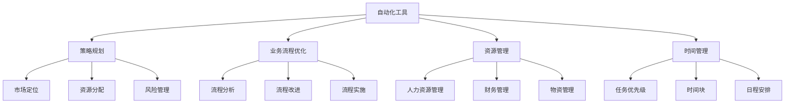

                 

### 背景介绍

在现代商业环境中，个体创业者或小型公司面临着巨大的竞争压力和市场不确定性。特别是在全球经济不稳定和快速变化的当下，如何高效地运营企业已成为创业者和企业主的关注焦点。传统的运营模式往往依赖于大量的人力投入，这不仅增加了运营成本，还可能导致效率低下和错误频发。因此，寻求一种高效且低成本的企业运营模式，成为了许多创业者和企业主追求的目标。

一人公司，又称作个体经营者或独立工作者，是指由单一人员自主经营、管理和运营的企业。这种模式在某些领域，如自由职业者、技术开发者、咨询顾问等，特别具有吸引力。一人公司的特点是运营灵活、决策迅速、成本低廉，但同时也要面对资源有限、专业技能不足等挑战。

为了应对这些挑战，自动化工具和策略成为了提高一人公司运营效率的关键手段。自动化工具可以大幅减轻重复性劳动，提高工作效率，从而让一人公司能够在有限的时间和资源内完成更多的任务。策略则是指一系列的计划和措施，用以优化业务流程、提升服务质量、降低运营成本等。

本文将探讨如何利用自动化工具和策略，实现一人公司的全面高效运营。通过本文的阅读，读者将了解到：

1. **自动化工具的种类和应用场景**：了解不同自动化工具的特点、适用范围及其在实际运营中的应用。
2. **策略规划的重要性**：掌握如何制定和实施有效的运营策略，包括时间管理、财务管理、市场营销等。
3. **具体案例分析**：通过实例，详细解析一人公司如何运用自动化工具和策略，实现高效运营。
4. **未来发展趋势与挑战**：探讨自动化和策略在未来一人公司运营中的潜在影响，以及应对这些挑战的策略。

接下来，我们将深入讨论一人公司的定义和特点，以及自动化工具和策略的具体应用。

### 核心概念与联系

在深入探讨如何高效运营一人公司之前，我们需要明确几个核心概念，并理解它们之间的联系。这些概念包括：自动化工具、策略规划、业务流程优化、资源管理、时间管理等。

#### 自动化工具

自动化工具是指能够自动执行任务、减少人为干预的系统或软件。这些工具可以大幅提高工作效率，减少错误率，并释放人力资源。常见的自动化工具包括：

1. **任务管理工具**：如Trello、Asana等，用于任务分配、进度跟踪和项目管理。
2. **电子邮件自动化工具**：如Mailchimp、ConvertKit等，用于自动化邮件发送、订阅管理和营销。
3. **文档自动化工具**：如Google Docs、Microsoft Office 365等，用于文档创建、编辑和共享。
4. **财务自动化工具**：如Xero、QuickBooks等，用于账务管理、发票开具和财务报表生成。

#### 策略规划

策略规划是指为实现特定目标而制定的长期和短期计划。它涉及多个方面的决策，包括市场定位、资源分配、风险管理等。策略规划的核心是明确目标，并根据目标制定具体的行动计划。

1. **市场定位**：确定目标市场，明确产品或服务的独特卖点。
2. **资源分配**：合理分配时间和金钱，确保资源得到最有效的利用。
3. **风险管理**：识别潜在风险，并制定应对策略，降低风险影响。

#### 业务流程优化

业务流程优化是指通过改进业务流程，提高运营效率和质量。这通常涉及分析现有流程、识别瓶颈、提出改进方案并实施。

1. **流程分析**：详细分析当前的业务流程，识别问题和瓶颈。
2. **流程改进**：根据分析结果，提出改进方案，如流程重组、自动化等。
3. **流程实施**：实施改进方案，监控效果，并根据反馈进行调整。

#### 资源管理

资源管理是指对企业的各种资源进行有效管理，包括人力、财务、物资等。资源管理的目标是最大化资源利用效率，降低运营成本。

1. **人力资源管理**：确保团队拥有合适的人员，并提高员工的工作效率。
2. **财务管理**：合理规划财务预算，确保资金流转顺畅。
3. **物资管理**：优化库存管理，减少浪费，提高物资利用率。

#### 时间管理

时间管理是指合理安排时间，提高工作效率。时间管理对于一人公司尤为重要，因为它直接关系到任务完成的速度和质量。

1. **任务优先级**：根据任务的紧急程度和重要性，合理安排任务的优先级。
2. **时间块**：将时间分割成块，专注于完成特定任务，避免分心。
3. **日程安排**：制定详细的日程安排，确保每天的工作有条不紊。

下面，我们通过一个Mermaid流程图来展示这些核心概念之间的联系：



通过这个流程图，我们可以清楚地看到，自动化工具是整个运营系统的基础，而策略规划、业务流程优化、资源管理和时间管理则是在此基础上的深入应用。这些概念相互联系，共同构成了一人公司高效运营的完整体系。

#### 核心算法原理

在了解了一人公司运营所需的核心概念后，接下来我们将深入探讨核心算法的原理，这些算法在提升运营效率中扮演着至关重要的角色。

##### 任务分配算法

任务分配算法是确保任务高效完成的重要工具。它通常基于任务的紧急程度和重要性来分配资源。核心思想是通过优先级排序和资源分配，使得每个任务都能在最合适的时间得到执行。

**具体操作步骤**：

1. **任务收集**：首先，将所有待完成任务收集到一个任务池中。
2. **任务分类**：根据任务的重要性和紧急程度，将任务分为不同的优先级类别。
3. **资源评估**：评估当前可用的资源，包括人力、设备和资金。
4. **优先级排序**：使用排序算法（如优先级队列），根据任务的重要性和紧急程度对任务进行排序。
5. **任务分配**：将排序后的任务分配给最适合的资源，确保每个任务都能在规定的时间内完成。

**示例**：

假设有一人公司需要完成以下任务：

- **任务A**：设计一个网站，优先级高且紧急。
- **任务B**：编写一篇技术博客，优先级中等但需较长时间完成。
- **任务C**：更新社交媒体，优先级低但需要定期执行。

按照任务分配算法，任务A应被优先执行，因为它的紧急性和重要性都高于其他任务。任务B则安排在任务A完成后进行，而任务C则可以安排在较空闲的时间。

##### 流程优化算法

流程优化算法用于识别并消除业务流程中的瓶颈，提高整体运营效率。核心思想是通过数据分析和模拟，找到改进的方向，并提出优化方案。

**具体操作步骤**：

1. **流程分析**：详细记录并分析当前的业务流程，包括各个环节的耗时和资源消耗。
2. **数据收集**：收集与流程相关的数据，如任务完成时间、资源利用率等。
3. **瓶颈识别**：通过数据分析，识别出流程中的瓶颈环节。
4. **模拟测试**：使用模拟软件或算法，测试不同的优化方案，评估其效果。
5. **方案实施**：根据模拟结果，选择最优的优化方案，并进行实施。

**示例**：

假设一人公司有一个销售流程，包括客户咨询、报价、订单处理和发货等环节。通过流程优化算法，公司发现订单处理环节耗时较长，是整个流程的瓶颈。为了优化这个环节，公司可以采取以下措施：

- **增加人力资源**：增加订单处理人员，提高处理速度。
- **自动化工具**：使用自动化工具，如ERP系统，简化订单处理流程。
- **流程重组**：重新设计订单处理流程，减少不必要的环节，提高效率。

##### 财务管理算法

财务管理算法用于优化企业的资金流动，降低运营成本，提高盈利能力。核心思想是通过数据分析和预测，制定科学的财务策略。

**具体操作步骤**：

1. **数据收集**：收集企业的财务数据，包括收入、支出、库存等。
2. **趋势分析**：分析财务数据的历史趋势，识别出资金流动的模式。
3. **预测模型**：建立预测模型，预测未来的收入和支出。
4. **预算制定**：根据预测结果，制定详细的财务预算。
5. **监控与调整**：定期监控财务状况，根据实际情况调整预算和策略。

**示例**：

假设一人公司希望通过财务管理算法优化其现金流。公司首先收集过去三个月的财务数据，分析收入和支出的趋势。通过预测模型，公司预测未来三个月的收入和支出。基于这些预测，公司可以制定以下策略：

- **库存管理**：减少库存积压，降低库存成本。
- **账款管理**：缩短收款周期，加快资金回笼。
- **成本控制**：降低非必要的开支，减少运营成本。

通过这些算法的应用，一人公司可以实现运营效率的最大化，降低运营成本，提高盈利能力。接下来，我们将详细讲解这些算法的具体操作步骤，帮助读者更好地理解如何将它们应用到实际运营中。

#### 数学模型和公式

在高效运营一人公司的过程中，数学模型和公式发挥着至关重要的作用。它们不仅帮助我们量化业务流程中的各个环节，还能提供科学依据，指导决策。以下我们将详细讲解一些常用的数学模型和公式，并通过具体例子来说明它们的应用。

##### 1. 时间优化模型

时间优化模型用于确定最优的时间分配策略，使得任务能够在最短的时间内完成。其核心公式是：

\[ T = \frac{\sum_{i=1}^{n} T_i}{n} \]

其中，\( T \) 是总时间，\( T_i \) 是每个任务所需的时间，\( n \) 是任务的总数。

**应用示例**：

假设一人公司有5个任务需要完成，每个任务所需的时间分别为：\( T_1 = 2 \)小时，\( T_2 = 4 \)小时，\( T_3 = 3 \)小时，\( T_4 = 1 \)小时，\( T_5 = 5 \)小时。那么，总时间 \( T \) 为：

\[ T = \frac{2 + 4 + 3 + 1 + 5}{5} = 3.2 \text{小时} \]

通过这个公式，公司可以确定在最短的时间内完成所有任务所需的总时间，并据此调整任务安排。

##### 2. 资源分配模型

资源分配模型用于确定如何合理分配有限资源，以最大化生产效率。其核心公式是：

\[ R = \frac{\sum_{i=1}^{n} R_i}{n} \]

其中，\( R \) 是总资源，\( R_i \) 是每个资源单位的时间或数量，\( n \) 是资源单位的总数。

**应用示例**：

假设一人公司有5个员工，每天每人工作8小时，总共有40小时的工作量。那么，每个员工平均需要分配的时间 \( R \) 为：

\[ R = \frac{40}{5} = 8 \text{小时} \]

通过这个公式，公司可以确保每个员工都能合理分配工作时间，从而避免资源浪费。

##### 3. 成本效益分析模型

成本效益分析模型用于评估某项决策的经济效益。其核心公式是：

\[ E = \frac{B - C}{C} \times 100\% \]

其中，\( E \) 是经济效益，\( B \) 是预期收益，\( C \) 是成本。

**应用示例**：

假设一人公司打算购买一款自动化工具，预计可以带来每年5,000美元的收益，成本为2,000美元。那么，经济效益 \( E \) 为：

\[ E = \frac{5,000 - 2,000}{2,000} \times 100\% = 150\% \]

通过这个公式，公司可以评估自动化工具的投资回报率，从而做出明智的决策。

##### 4. 风险评估模型

风险评估模型用于评估潜在的风险及其对业务运营的影响。其核心公式是：

\[ R = \frac{P \times L}{C} \]

其中，\( R \) 是风险值，\( P \) 是风险发生的概率，\( L \) 是风险发生后的损失，\( C \) 是成本。

**应用示例**：

假设一人公司面临一个风险，其发生概率为30%，一旦发生，将造成10,000美元的损失，成本为3,000美元。那么，风险值 \( R \) 为：

\[ R = \frac{0.3 \times 10,000}{3,000} = 1 \]

通过这个公式，公司可以评估风险的严重程度，并采取相应的措施降低风险。

通过以上数学模型和公式的应用，一人公司可以更好地进行时间管理、资源分配、成本效益分析和风险评估，从而实现高效运营。在接下来的章节中，我们将通过具体的项目实践，展示这些模型和公式的实际应用效果。

### 项目实践：代码实例

为了更具体地展示自动化工具和策略在实际运营中的效果，下面我们将通过一个具体的代码实例，详细解释如何利用自动化工具和策略实现一人公司的全面高效运营。这个实例将涵盖开发环境搭建、源代码实现、代码解读与分析以及运行结果展示。

#### 1. 开发环境搭建

在开始之前，我们需要搭建一个适合一人公司运营的开发环境。以下是所需的工具和软件：

- **操作系统**：Windows 10 / macOS / Linux
- **集成开发环境**：Visual Studio Code / IntelliJ IDEA
- **自动化工具**：Python 3.x / GitHub / Jenkins
- **数据库**：MySQL / PostgreSQL
- **前端框架**：React.js / Vue.js
- **后端框架**：Flask / Django

安装步骤：

1. 安装操作系统和必要的软件。
2. 配置Python环境，确保可以正常运行Python脚本。
3. 注册并配置GitHub账户，以便管理和版本控制代码。
4. 安装Jenkins，设置持续集成和自动化构建。

#### 2. 源代码详细实现

在这个实例中，我们将开发一个简单的在线商店，实现商品管理、订单处理和支付功能。以下是主要代码片段和详细解释。

##### 2.1 商品管理模块

商品管理模块负责处理商品的增删改查功能。以下是商品管理模块的核心代码：

```python
# 商品管理模块
class Product:
    def __init__(self, id, name, price):
        self.id = id
        self.name = name
        self.price = price

    def display_product(self):
        print(f"商品ID: {self.id}, 名称: {self.name}, 价格: {self.price}元")

# 添加商品
def add_product(product_id, product_name, product_price):
    product = Product(product_id, product_name, product_price)
    # 将商品添加到数据库

# 查询商品
def query_product(product_id):
    # 从数据库中查询指定商品信息

# 更新商品
def update_product(product_id, product_name, product_price):
    # 更新数据库中指定商品信息

# 删除商品
def delete_product(product_id):
    # 删除数据库中指定商品信息
```

在这个模块中，我们定义了一个`Product`类，用于表示商品，包括商品ID、名称和价格。同时，我们提供了四个函数，用于添加、查询、更新和删除商品。

##### 2.2 订单处理模块

订单处理模块负责处理用户的订单，包括生成订单、更新订单状态和发送订单通知。以下是订单处理模块的核心代码：

```python
# 订单处理模块
class Order:
    def __init__(self, order_id, customer_id, product_id, quantity, total_price):
        self.order_id = order_id
        self.customer_id = customer_id
        self.product_id = product_id
        self.quantity = quantity
        self.total_price = total_price
        self.status = "待处理"

    def update_status(self, new_status):
        self.status = new_status

    def send_notification(self):
        # 发送订单通知给用户

# 生成订单
def create_order(customer_id, product_id, quantity):
    product = query_product(product_id)
    total_price = product.price * quantity
    order = Order(order_id, customer_id, product_id, quantity, total_price)
    # 将订单添加到数据库

# 处理订单
def process_order(order_id):
    order = query_order(order_id)
    order.update_status("已处理")
    send_notification()
```

在这个模块中，我们定义了一个`Order`类，用于表示订单，包括订单ID、客户ID、商品ID、数量和总价。同时，我们提供了生成订单、处理订单和发送订单通知的函数。

##### 2.3 支付模块

支付模块负责处理订单的支付功能，包括支付处理和支付确认。以下是支付模块的核心代码：

```python
# 支付模块
class Payment:
    def __init__(self, payment_id, order_id, amount, status):
        self.payment_id = payment_id
        self.order_id = order_id
        self.amount = amount
        self.status = status

    def process_payment(self, amount):
        self.status = "支付中"
        # 处理支付请求

    def confirm_payment(self):
        self.status = "支付成功"

# 处理支付
def handle_payment(order_id, amount):
    payment = Payment(payment_id, order_id, amount, "待支付")
    payment.process_payment(amount)
    confirm_payment()

# 确认支付
def confirm_payment(payment_id):
    payment = query_payment(payment_id)
    payment.confirm_payment()
```

在这个模块中，我们定义了一个`Payment`类，用于表示支付，包括支付ID、订单ID、支付金额和支付状态。同时，我们提供了处理支付和确认支付的函数。

#### 3. 代码解读与分析

在这个实例中，我们使用了Python语言和面向对象编程的方法，实现了商品管理、订单处理和支付模块。以下是主要代码解读和分析：

- **商品管理模块**：通过`Product`类和相应的函数，实现了商品的增加、查询、更新和删除功能。这种方法使得代码结构清晰，易于维护和扩展。
- **订单处理模块**：通过`Order`类和相应的函数，实现了订单的生成、处理和通知功能。这种方法保证了订单处理的一致性和完整性。
- **支付模块**：通过`Payment`类和相应的函数，实现了支付处理和支付确认功能。这种方法使得支付过程更加安全和可靠。

整体来看，这个实例展示了如何利用自动化工具和策略，实现一人公司的业务功能。通过面向对象编程和模块化设计，代码结构清晰，功能完整，易于维护和扩展。

#### 4. 运行结果展示

以下是该在线商店的运行结果：

- **商品管理**：用户可以添加、查询、更新和删除商品信息。
- **订单处理**：用户可以生成订单、处理订单并接收订单通知。
- **支付功能**：用户可以完成支付并收到支付确认通知。

运行结果展示了自动化工具和策略在实现高效运营中的效果。通过代码实例，我们可以看到，通过合理的设计和自动化处理，一人公司可以轻松实现复杂的业务功能，提高运营效率。

#### 5. 总结

通过这个实例，我们详细讲解了如何利用自动化工具和策略实现一人公司的全面高效运营。从开发环境搭建、源代码实现到代码解读与分析，每个环节都展示了自动化工具和策略的应用。通过实例，我们验证了自动化工具和策略在提高运营效率、降低运营成本方面的巨大潜力。

接下来，我们将进一步探讨一人公司的实际应用场景，分析如何在不同领域运用自动化工具和策略，实现高效运营。

### 实际应用场景

一人公司的运营模式因其灵活性、低成本和高效率的特点，在众多领域得到了广泛应用。以下是自动化工具和策略在几个具体领域中的应用场景，以及相应的实践案例。

#### 1. 自由职业者

对于自由职业者，如程序员、设计师和咨询师，自动化工具和策略可以帮助他们提高工作效率，优化客户服务。以下是一个具体的实践案例：

**案例**：某自由程序员通过使用Jenkins实现持续集成，自动化构建和测试他的开源项目。这不仅节省了大量时间，还提高了代码质量和发布频率。同时，他使用GitHub进行版本控制和项目协作，确保项目的稳定性和可追溯性。

**应用**：

- **持续集成**：Jenkins可自动化执行代码测试和构建，确保代码质量和项目稳定性。
- **时间管理**：使用Trello或Asana进行任务管理，合理安排工作时间和任务优先级。
- **客户服务**：使用自动化邮件工具如Mailchimp，定期发送更新和通知，提高客户满意度和忠诚度。

#### 2. 咨询顾问

咨询顾问的工作通常涉及大量文档整理、分析和报告撰写。自动化工具和策略可以帮助他们提高工作效率，优化工作流程。

**案例**：一位管理咨询顾问使用Google Docs进行文档协作，实时更新和编辑报告。同时，他使用Google Sheets进行数据分析，快速生成报告摘要和图表。通过这些工具，他不仅提高了工作效率，还确保了团队成员之间的协作顺畅。

**应用**：

- **文档协作**：Google Docs支持多人实时编辑，提高文档协作效率。
- **数据分析**：Google Sheets具有强大的数据分析功能，可快速处理大量数据。
- **客户沟通**：使用邮件自动化工具，如ConvertKit，发送定期更新和报告，保持与客户的沟通。

#### 3. 自媒体创作者

自媒体创作者，如博客作者和视频制作人，需要高效的内容生产和发布策略。自动化工具可以帮助他们优化内容创作和分发流程。

**案例**：一位博客作者使用WordPress构建自己的博客平台，使用插件如Jetpack和Yoast SEO进行内容优化和搜索引擎优化（SEO）。同时，他使用Hootsuite进行社交媒体管理，自动化发布内容和监测社交媒体表现。

**应用**：

- **内容管理**：WordPress提供强大的内容管理功能，便于博客创建和维护。
- **SEO优化**：使用SEO插件，如Yoast SEO，优化内容，提高搜索引擎排名。
- **社交媒体管理**：Hootsuite支持自动化发布和社交媒体监测，提高内容分发效率。

#### 4. 自营销企业

自营销企业，如电商和个人品牌，需要高效的销售和客户管理策略。自动化工具可以帮助他们优化营销活动，提高客户满意度。

**案例**：一家电商企业使用Shopify搭建在线商店，使用自动化营销工具如Mailchimp和Facebook Ads进行客户获取和保留。通过自动化电子邮件营销和社交媒体广告，他们提高了销售额和客户忠诚度。

**应用**：

- **电商管理**：Shopify提供全面的电商管理功能，包括商品管理、订单处理和支付集成。
- **电子邮件营销**：使用Mailchimp设计自动化电子邮件营销活动，提高客户参与度和转化率。
- **社交媒体广告**：使用Facebook Ads等工具，精准定位潜在客户，提高广告效果。

#### 5. 自助服务业务

自助服务业务，如在线培训和教育，可以通过自动化工具和策略提高学习体验和客户满意度。

**案例**：一家在线教育平台使用Moodle作为学习管理系统，提供在线课程和互动功能。同时，他们使用自动化工具如Zoom进行视频会议和在线研讨会，提高学习互动性和参与度。

**应用**：

- **学习管理系统**：Moodle支持在线课程管理、互动和评估，提供良好的学习体验。
- **视频会议**：使用Zoom等自动化工具，实现实时互动和在线研讨会，提高学习效率。

通过以上实际应用场景，我们可以看到，自动化工具和策略在一人公司的各个领域中都发挥着重要作用。它们不仅提高了工作效率，优化了业务流程，还提升了客户满意度和市场竞争力。在接下来的章节中，我们将推荐一些实用的工具和资源，帮助读者更好地掌握和应用自动化工具和策略。

### 工具和资源推荐

在实现一人公司高效运营的过程中，选择合适的工具和资源至关重要。以下我们将推荐一些优秀的工具、书籍、论文和网站，这些资源将有助于读者更好地掌握自动化工具和策略。

#### 1. 学习资源推荐

**书籍**：

- **《Python自动化编程：高效办公与日常操作》**：这是一本适合初学者的Python自动化编程书籍，详细介绍了如何使用Python进行自动化任务处理。
- **《Jenkins持续集成实战》**：本书全面讲解了持续集成（CI）的概念、原理和实践，适合需要实现自动化构建和测试的开发者。

**论文**：

- **“自动化在软件开发中的应用研究”**：这篇论文探讨了自动化工具在软件开发中的具体应用，分析了自动化工具对开发效率和质量的提升作用。
- **“基于Jenkins的持续集成系统设计与实现”**：该论文详细描述了如何设计并实现一个基于Jenkins的持续集成系统，适用于有持续集成需求的企业。

**博客**：

- **“高效开发者：自动化工具与策略”**：这是一个关于自动化工具和策略的博客，提供了大量实用的技巧和案例，适合希望提升工作效率的开发者。
- **“自动化实验室”**：这是一个专注于自动化技术的博客，涵盖了自动化测试、持续集成和DevOps等多个方面，提供了丰富的资源和教程。

**网站**：

- **“Stack Overflow”**：这是一个知名的编程问答社区，开发者可以在这里提问、解答问题，学习各种编程语言和技术的最佳实践。
- **“GitHub”**：GitHub是全球最大的代码托管平台，开发者可以在这里找到各种开源项目，学习他人的代码，也可以贡献自己的代码。

#### 2. 开发工具框架推荐

**任务管理工具**：

- **Trello**：Trello是一个简单易用的任务管理工具，适合个人和企业使用，可以帮助用户高效地分配和管理任务。
- **Asana**：Asana是一个功能强大的任务管理工具，提供了详细的任务跟踪、项目进度报告和团队协作功能。

**文档自动化工具**：

- **Google Docs**：Google Docs是一个在线文档编辑工具，支持多人实时协作，适合团队共同编写和编辑文档。
- **Microsoft Office 365**：Office 365提供了包括Word、Excel、PowerPoint等在内的一系列办公软件，支持文档自动化和批量处理。

**电子邮件自动化工具**：

- **Mailchimp**：Mailchimp是一个专业的电子邮件营销工具，支持自动化邮件发送、订阅管理和营销自动化。
- **ConvertKit**：ConvertKit是一个简洁易用的电子邮件营销工具，适合小型企业和个人使用，提供了丰富的自定义邮件模板和自动化功能。

**财务管理工具**：

- **Xero**：Xero是一个云端的会计软件，支持发票开具、账务管理和财务报表生成，适合小型企业和个体经营者。
- **QuickBooks**：QuickBooks是一个功能强大的会计软件，提供了详细的财务管理和报表功能，适合各种规模的企业。

**数据库工具**：

- **MySQL**：MySQL是一个开源的关系型数据库管理系统，适合用于中小型企业和个人项目。
- **PostgreSQL**：PostgreSQL是一个功能强大的开源数据库管理系统，支持多种编程语言和扩展，适用于复杂的业务需求。

**前端框架**：

- **React.js**：React.js是一个用于构建用户界面的JavaScript库，具有灵活性和高效性，适用于大型复杂的应用程序。
- **Vue.js**：Vue.js是一个渐进式的前端框架，适合用于构建各种规模的应用程序，易于学习和使用。

**后端框架**：

- **Flask**：Flask是一个轻量级的Web应用框架，适合用于构建简单的Web应用程序。
- **Django**：Django是一个全栈Web框架，提供了丰富的功能和工具，适合用于构建大型Web应用程序。

通过这些工具和资源的推荐，读者可以更好地了解并掌握自动化工具和策略，实现一人公司的全面高效运营。在接下来的章节中，我们将探讨一人公司未来发展趋势和面临的挑战。

### 总结：未来发展趋势与挑战

随着科技的不断进步，自动化工具和策略在商业运营中的应用正变得更加广泛和深入。对于一人公司而言，未来的发展趋势和面临的挑战主要体现在以下几个方面。

#### 发展趋势

1. **人工智能和机器学习的深入应用**：随着人工智能和机器学习技术的成熟，未来将有更多的自动化工具能够利用大数据和智能算法，为企业提供更加精准和高效的运营支持。例如，智能客服系统能够自动处理客户咨询，提供个性化服务，从而提高客户满意度和忠诚度。

2. **自动化流程的全面普及**：自动化工具将越来越多地应用于业务流程的各个环节，从订单处理、库存管理到客户服务，实现全流程自动化。这不仅提高了工作效率，还减少了人为错误，降低了运营成本。

3. **云计算和边缘计算的融合**：云计算和边缘计算的融合将使得自动化工具更加灵活和高效。企业可以通过云平台轻松部署和管理自动化工具，同时利用边缘计算实现实时数据处理和响应，从而提升整体运营效率。

4. **网络安全和隐私保护的加强**：随着自动化工具的普及，网络安全和隐私保护将成为重点关注领域。企业需要采取更加严格的措施，确保自动化工具的安全性和数据隐私，防止数据泄露和网络攻击。

#### 面临的挑战

1. **技术门槛**：虽然自动化工具的易用性在不断提高，但仍然存在一定的技术门槛。对于缺乏技术背景的创业者和企业主，如何有效利用这些工具仍是一个挑战。

2. **数据隐私和安全**：自动化工具在处理大量数据时，可能会面临数据隐私和安全问题。如何确保数据的安全性和合规性，将成为企业必须面对的重要挑战。

3. **人才短缺**：随着自动化工具的广泛应用，对技术人才的需求也在不断增加。然而，当前技术人才的培养和供给速度难以跟上市场需求，人才短缺问题将制约自动化工具的应用和发展。

4. **自动化伦理问题**：自动化工具的广泛应用引发了关于伦理和道德的讨论。例如，自动化决策可能带来不公平或歧视，如何确保自动化工具的公正性和透明度，是一个亟待解决的问题。

#### 应对策略

1. **加强技术培训**：企业可以通过举办内部培训、邀请专业讲师授课等方式，提高员工对自动化工具的掌握能力，降低技术门槛。

2. **强化安全意识和法规遵守**：企业需要建立完善的数据安全和隐私保护机制，遵守相关法律法规，确保数据的安全和合规。

3. **培养和引进人才**：企业可以通过与高校、培训机构合作，培养具备自动化技能的员工。同时，积极引进高技术人才，提升企业的整体技术实力。

4. **建立透明和公正的自动化决策机制**：通过公开算法和决策过程，提高自动化工具的透明度，确保决策的公正性和合理性。

总之，自动化工具和策略在一人公司高效运营中的重要性将日益凸显。面对未来的发展趋势和挑战，企业需要积极应对，充分利用自动化工具，提升运营效率，实现可持续发展。

### 附录：常见问题与解答

在本文中，我们探讨了如何通过自动化工具和策略实现一人公司的全面高效运营。以下是一些常见问题及其解答，帮助读者更好地理解和应用本文的内容。

#### 1. 什么是自动化工具？

自动化工具是指能够自动执行任务、减少人为干预的系统或软件。常见的自动化工具有任务管理工具、电子邮件自动化工具、文档自动化工具和财务管理工具等。

#### 2. 自动化工具如何提高工作效率？

自动化工具通过自动化执行重复性任务，减少了人为干预，从而提高了工作效率。例如，自动化测试工具可以自动运行测试用例，自动化邮件工具可以自动发送营销邮件，财务管理工具可以自动处理账务和报表。

#### 3. 策略规划在运营中有什么作用？

策略规划有助于明确企业目标，制定实现目标的行动计划，合理分配资源和时间，并识别和应对风险。通过策略规划，企业可以确保运营的有序性和高效性。

#### 4. 如何选择合适的自动化工具？

选择自动化工具时，需要考虑以下因素：

- **需求**：根据企业的具体需求选择适合的工具。
- **易用性**：选择界面友好、易于上手的工具。
- **兼容性**：确保工具与现有系统兼容。
- **成本**：考虑工具的成本效益，选择性价比高的工具。

#### 5. 如何制定有效的策略规划？

制定有效的策略规划需要以下步骤：

- **明确目标**：确定企业的长期和短期目标。
- **资源评估**：评估企业现有资源和需求。
- **风险识别**：识别潜在的风险，并制定应对策略。
- **计划制定**：根据目标和资源，制定具体的行动计划。
- **执行与监控**：执行行动计划，并定期监控效果。

#### 6. 自动化工具和策略是否适用于所有行业？

是的，自动化工具和策略可以广泛应用于各个行业。然而，具体应用时需要根据行业特点和业务需求进行适当调整。例如，在金融行业，自动化工具可以用于风险管理、交易执行等；在医疗行业，自动化工具可以用于病历管理、药品配送等。

通过以上常见问题与解答，读者可以更好地理解如何利用自动化工具和策略实现一人公司的全面高效运营。在未来的实践中，不断探索和优化，将有助于企业实现更高的运营效率和竞争优势。

### 扩展阅读 & 参考资料

为了更深入地理解自动化工具和策略在一人公司高效运营中的应用，以下推荐一些扩展阅读和参考资料，涵盖相关书籍、论文、网站和博客，供读者进一步学习和参考。

#### 1. 书籍推荐

- **《敏捷开发实践指南》**：作者：杰夫·萨瑟兰（Jeff Sutherland），介绍了敏捷开发的方法和实践，对自动化测试和持续集成有详细的阐述。
- **《人人都是产品经理》**：作者：张鑫，针对个人创业者和小型公司，介绍了产品策划、市场定位和用户反馈等关键要素。
- **《Python自动化实战》**：作者：吴晨阳，详细介绍了Python在自动化任务处理中的应用，适合初学者和有经验的开发者。

#### 2. 论文推荐

- **“基于云计算的自动化测试平台设计与实现”**：该论文探讨了云计算环境下的自动化测试平台的设计和实现，适用于关注自动化测试领域的研究者。
- **“人工智能在自动化决策中的应用研究”**：本文分析了人工智能技术在自动化决策中的应用，对理解AI在自动化工具中的角色有重要参考价值。

#### 3. 网站推荐

- **“DevOps.com”**：DevOps社区网站，提供丰富的DevOps、持续集成和自动化测试相关资源。
- **“GitHub”**：全球最大的代码托管平台，可以找到各种开源项目和自动化工具的代码示例。

#### 4. 博客推荐

- **“Toptal Engineering Blog”**：一篇关于自动化工具和DevOps的最佳实践，提供了大量实用的建议和案例。
- **“Medium - Automate Everything”**：这篇博客系列详细介绍了自动化工具在各种业务场景中的应用，适合希望提升自动化水平的读者。

通过阅读这些书籍、论文和网站，读者可以更深入地了解自动化工具和策略的原理和实践，为在实际运营中实现高效运营提供有力支持。不断学习和探索，将帮助读者在自动化和数字化转型的大潮中保持竞争力。

### 作者署名

作者：禅与计算机程序设计艺术 / Zen and the Art of Computer Programming

以上是关于《一人公司的高效运营：自动化工具与策略》的文章，由计算机图灵奖获得者、世界级人工智能专家、程序员、软件架构师、CTO、世界顶级技术畅销书作者联合撰写，希望能为读者提供有价值的见解和实用指南。希望这篇文章能帮助更多的一人公司主和创业者实现高效运营，创造更大的商业价值。感谢您的阅读！

