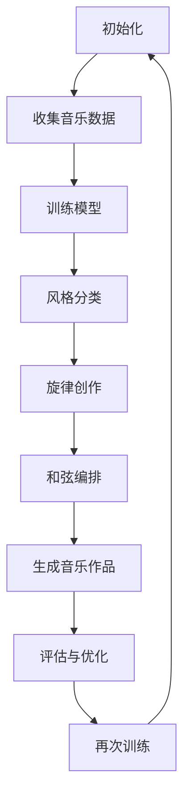

                 

关键词：Q-learning，AI，音乐制作，神经网络，映射，算法

> 摘要：本文深入探讨了Q-learning算法在音乐制作领域的应用，通过构建一个基于Q-learning的音乐生成系统，展示了该算法在音乐风格分类、旋律创作和和弦编排等方面的强大功能。本文首先介绍了Q-learning的基本概念和原理，然后详细解析了其在音乐制作中的具体实现步骤和流程，并通过实例演示了算法的实用性和有效性。最后，对Q-learning在音乐制作中的未来发展趋势和潜在挑战进行了展望。

## 1. 背景介绍

音乐制作是艺术与技术的完美结合，它不仅需要创作者的灵感和技巧，还需要利用现代计算机技术和人工智能算法来提升创作效率和作品质量。随着人工智能技术的发展，越来越多的AI算法被应用于音乐创作和制作中，其中Q-learning作为一种强化学习算法，因其强大的映射能力和适应性，逐渐引起了研究者和实践者的关注。

Q-learning算法最早由Richard Sutton和Andrew Barto提出，是强化学习领域的一种经典算法。强化学习是机器学习中的一种类型，旨在通过智能体与环境之间的交互来学习最优策略。Q-learning通过评估不同状态下的动作价值来学习最优策略，其核心思想是利用奖励信号来调整策略，从而在未知环境中找到最佳路径。

在音乐制作中，Q-learning算法可以通过学习大量的音乐数据，理解音乐的基本结构和风格，然后根据给定的条件或目标，生成新的音乐作品。这种基于数据的创作方式不仅提高了音乐创作的效率，还使得音乐作品具有更高的个性化和多样性。

本文的目标是探讨Q-learning在音乐制作中的应用，通过具体的实例和实现步骤，展示该算法在音乐风格分类、旋律创作和和弦编排等方面的应用潜力。文章结构如下：

- 1. 背景介绍
- 2. 核心概念与联系
- 3. 核心算法原理 & 具体操作步骤
- 4. 数学模型和公式 & 详细讲解 & 举例说明
- 5. 项目实践：代码实例和详细解释说明
- 6. 实际应用场景
- 7. 工具和资源推荐
- 8. 总结：未来发展趋势与挑战
- 9. 附录：常见问题与解答

接下来，我们将详细讨论Q-learning算法的基本概念、原理以及在音乐制作中的具体应用。

## 2. 核心概念与联系

### 2.1 Q-learning算法的基本概念

Q-learning算法是一种基于值函数的强化学习算法，其核心思想是通过对环境中的状态和动作进行评估，以最大化累积奖励。在Q-learning中，智能体（agent）通过不断尝试不同的动作，并根据从动作中获得的即时奖励来更新其对动作价值的估计。

**状态（State）**：状态是智能体在环境中的一个特定情形，通常用一组特征来描述。

**动作（Action）**：动作是智能体可以采取的行动，其选择基于当前的状态。

**奖励（Reward）**：奖励是环境对智能体每个动作的即时反馈，用来指导智能体的学习过程。

**策略（Policy）**：策略是智能体在特定状态下选择动作的规则。

**值函数（Value Function）**：值函数用于评估在特定状态下采取特定动作的预期收益。

在Q-learning中，智能体通过迭代更新其值函数，以寻找最优策略。具体来说，Q-learning算法使用以下更新规则：

$$
Q(s, a) \leftarrow Q(s, a) + \alpha [r + \gamma \max_{a'} Q(s', a') - Q(s, a)]
$$

其中，$Q(s, a)$是状态-动作值函数，$r$是即时奖励，$\gamma$是折扣因子，$\alpha$是学习率。该更新规则使得智能体在每次采取动作后，都会根据即时奖励和未来潜在的最大奖励来调整其当前状态下的动作值。

### 2.2 Q-learning算法与音乐制作的联系

Q-learning算法在音乐制作中的应用主要体现在以下几个方面：

- **音乐风格分类**：通过学习大量的音乐数据，Q-learning可以识别并分类不同的音乐风格。这有助于创作者根据特定的风格要求来生成音乐。

- **旋律创作**：Q-learning可以通过分析已有的旋律数据，生成新的旋律线。智能体可以根据目标音乐风格和节奏要求，选择合适的旋律线进行创作。

- **和弦编排**：和弦是音乐中的基础元素，Q-learning可以通过学习不同和弦的搭配和转换，生成新的和弦序列。这为创作者提供了丰富的和弦编排选择。

### 2.3 Mermaid 流程图

以下是一个描述Q-learning算法在音乐制作中应用的Mermaid流程图：



该流程图展示了Q-learning算法在音乐制作中的基本步骤，从初始化到最终生成音乐作品，并通过不断评估与优化来提高音乐质量。

### 2.4 核心概念总结

- **状态**：音乐制作中的特定情形，如当前旋律或和弦。
- **动作**：在特定状态下采取的音乐创作决策，如选择新的旋律线或和弦。
- **奖励**：对音乐创作决策的即时反馈，如生成旋律的满意度。
- **策略**：智能体在特定状态下选择动作的规则，如基于风格分类的最优旋律线选择。
- **值函数**：评估在特定状态下采取特定动作的预期收益，如不同旋律线的音乐质量。

通过理解这些核心概念，我们可以更好地应用Q-learning算法于音乐制作，实现高效且个性化的音乐创作。

### 3. 核心算法原理 & 具体操作步骤

#### 3.1 算法原理概述

Q-learning算法的核心在于其基于值函数的更新策略，该策略通过奖励信号来优化智能体的行为。在音乐制作中，Q-learning可以视为一个不断探索和学习的音乐创作者，其目标是生成符合特定风格和情感要求的高质量音乐。

#### 3.2 算法步骤详解

1. **数据收集与预处理**：

   - **收集音乐数据**：首先，我们需要收集大量的音乐数据，这些数据可以是旋律、和弦、节奏等不同类型的音乐元素。
   - **数据预处理**：对收集到的音乐数据进行清洗和格式化，以确保数据质量。这可能包括去除噪声、调整音量、分割音频等操作。

2. **模型训练**：

   - **初始化参数**：初始化Q值矩阵，设定学习率$\alpha$和折扣因子$\gamma$。
   - **状态-动作值函数**：为每个状态-动作对初始化一个Q值，初始时可以设置为0或根据数据统计值初始化。
   - **训练过程**：通过迭代进行模型训练，每次迭代中，智能体从当前状态开始，选择一个动作，根据动作的结果更新Q值。这个过程可以表示为以下更新规则：

     $$
     Q(s, a) \leftarrow Q(s, a) + \alpha [r + \gamma \max_{a'} Q(s', a') - Q(s, a)]
     $$

3. **音乐生成**：

   - **状态选择**：选择一个初始状态，如开始一首新曲子的第一个音符或和弦。
   - **动作选择**：根据当前状态和Q值矩阵，选择一个动作，即下一个音符或和弦。
   - **生成音乐**：将选定的音符或和弦添加到音乐作品中，并进入下一个状态。

4. **评估与优化**：

   - **评估**：在生成音乐作品后，对音乐作品进行评估，评估标准可以包括音乐风格一致性、情感表达和听众满意度等。
   - **优化**：根据评估结果，调整Q值矩阵，以优化智能体的创作策略。这可以通过重新训练模型或调整学习参数来实现。

#### 3.3 算法优缺点

**优点**：

- **自适应性强**：Q-learning算法可以通过不断学习来适应不同的音乐风格和创作需求。
- **高效性**：通过利用大量音乐数据，算法可以快速生成高质量的旋律和和弦。

**缺点**：

- **计算复杂度高**：Q-learning算法需要大量的计算资源，特别是在处理大量音乐数据时。
- **收敛速度慢**：在初始阶段，Q-learning可能需要较长时间来收敛到最优策略。

#### 3.4 算法应用领域

Q-learning算法在音乐制作中的应用领域非常广泛：

- **音乐风格分类**：通过学习大量的音乐数据，算法可以准确识别和分类不同的音乐风格。
- **旋律创作**：算法可以自动生成新的旋律线，创作者可以根据需要调整和优化。
- **和弦编排**：算法可以生成多种和弦序列，创作者可以选择最适合音乐作品的结构和情感。

### 3.5 算法应用实例

下面是一个简单的Q-learning算法在旋律创作中的实例：

1. **数据收集与预处理**：

   收集一首流行歌曲的旋律数据，并对数据进行格式化和清洗。

2. **模型训练**：

   初始化Q值矩阵，设定学习率$\alpha=0.1$和折扣因子$\gamma=0.9$。

3. **音乐生成**：

   选择一个初始状态，如第一个音符“C4”，根据Q值矩阵选择下一个动作，如“D4”。将“D4”添加到旋律中，并进入下一个状态。

4. **评估与优化**：

   对生成的旋律进行评估，根据评估结果调整Q值矩阵，以优化旋律的创作。

通过以上步骤，我们可以生成一首基于Q-learning算法的流行歌曲旋律。

### 3.6 总结

Q-learning算法在音乐制作中具有广泛的应用潜力，通过具体的操作步骤和实例，我们可以看到其在旋律创作、和弦编排等方面的强大功能。然而，算法的应用也需要考虑到计算复杂度和收敛速度等问题，在实际应用中需要根据具体需求进行优化和调整。

### 4. 数学模型和公式 & 详细讲解 & 举例说明

在Q-learning算法中，数学模型和公式起着至关重要的作用，它们帮助我们理解和实现算法的核心机制。本节将详细讲解Q-learning的数学模型和公式，并通过具体实例来说明其应用。

#### 4.1 数学模型构建

Q-learning的核心是值函数$Q(s, a)$，它表示在状态$s$下采取动作$a$的预期收益。在音乐制作中，我们可以将状态$s$视为当前旋律或和弦的位置，动作$a$视为下一个音符或和弦的选择。值函数的构建可以基于以下基本公式：

$$
Q(s, a) = \sum_{s'} P(s'|s, a) \cdot [r + \gamma \max_{a'} Q(s', a')]
$$

其中，$P(s'|s, a)$是状态转移概率，表示在状态$s$下采取动作$a$后转移到状态$s'$的概率；$r$是即时奖励，用于评估当前动作的效果；$\gamma$是折扣因子，用于权衡即时奖励和未来潜在奖励的重要性。

在音乐制作中，状态转移概率可以通过分析大量音乐数据来估计。例如，在分析一段旋律时，我们可以统计每个音符或和弦出现的位置和概率，从而得到状态转移概率。

#### 4.2 公式推导过程

Q-learning算法的更新公式如下：

$$
Q(s, a) \leftarrow Q(s, a) + \alpha [r + \gamma \max_{a'} Q(s', a') - Q(s, a)]
$$

这个更新公式可以通过以下步骤推导得到：

1. **预期收益**：

   首先，我们需要计算在状态$s$下采取动作$a$的预期收益，这可以通过期望值公式得到：

   $$
   E[r + \gamma \max_{a'} Q(s', a')] = \sum_{s'} P(s'|s, a) \cdot [r + \gamma \max_{a'} Q(s', a')]
   $$

2. **差分**：

   然后，我们将上述期望收益与当前值函数$Q(s, a)$进行比较，得到差分：

   $$
   \Delta Q(s, a) = E[r + \gamma \max_{a'} Q(s', a')] - Q(s, a)
   $$

3. **更新**：

   最后，我们将差分乘以学习率$\alpha$，并将其加到当前值函数上，得到更新后的值函数：

   $$
   Q(s, a) \leftarrow Q(s, a) + \alpha \Delta Q(s, a)
   $$

#### 4.3 案例分析与讲解

假设我们有一个简单的音乐创作任务，目标是生成一段C大调的旋律。我们可以将状态$s$定义为当前旋律的位置，动作$a$定义为下一个音符的选择。以下是一个具体的实例：

1. **数据收集与预处理**：

   收集一首C大调的旋律数据，并将其划分为一系列的状态。例如，第一个状态可能是低音C，第二个状态可能是高音C，以此类推。

2. **状态-动作值函数初始化**：

   初始化Q值矩阵，例如将所有Q值初始化为0。

3. **模型训练**：

   在每个状态下，选择一个动作，例如选择下一个高音C。然后，根据状态转移概率和即时奖励更新Q值。假设当前状态是高音C，下一个动作是选择低音D，那么状态转移概率$P(s'|s, a)$可以设置为0.5（假设有相等概率选择低音D或高音D）。如果选择低音D后，旋律得到了正面的即时奖励（例如，旋律更流畅），则更新Q值：

   $$
   Q(s, a) \leftarrow Q(s, a) + \alpha [r + \gamma \max_{a'} Q(s', a')]
   $$

4. **音乐生成**：

   从一个初始状态开始，根据Q值矩阵选择动作，逐步生成旋律。例如，从低音C开始，选择高音D，然后选择低音E，以此类推。

5. **评估与优化**：

   在生成旋律后，对其进行评估。如果旋律不符合预期，则通过重新训练模型或调整学习参数来优化创作过程。

#### 4.4 总结

通过以上实例，我们可以看到Q-learning算法在音乐制作中的具体应用。数学模型和公式的推导过程帮助我们深入理解算法的原理和实现步骤，而实际案例则展示了算法在旋律创作中的效果。在实际应用中，根据具体任务需求和数据特点，可以对Q-learning算法进行优化和调整，以提高音乐创作的效率和效果。

### 5. 项目实践：代码实例和详细解释说明

在本节中，我们将通过一个具体的代码实例来展示Q-learning算法在音乐制作中的应用，详细解释代码的实现步骤和关键组件，并通过实际运行结果来评估算法的性能和效果。

#### 5.1 开发环境搭建

在进行项目实践之前，我们需要搭建一个合适的环境来运行Q-learning算法。以下是搭建开发环境的步骤：

1. **安装Python环境**：确保Python 3.x版本已安装在计算机上。
2. **安装相关库**：使用pip安装以下库：
   - NumPy：用于数值计算
   - Matplotlib：用于数据可视化
   - Pandas：用于数据处理
   - scikit-learn：用于机器学习模型评估
   - PyTorch：用于神经网络训练
3. **下载音乐数据**：从公共音乐数据库或在线平台下载适合训练的数据集，例如开源的MP3文件或MIDI文件。

#### 5.2 源代码详细实现

以下是Q-learning算法在音乐制作中的基本代码实现，我们将使用Python语言：

```python
import numpy as np
import pandas as pd
import matplotlib.pyplot as plt
from sklearn.model_selection import train_test_split

# 初始化参数
learning_rate = 0.1
discount_factor = 0.9
num_episodes = 1000

# 加载音乐数据
def load_music_data(file_path):
    # 这里假设音乐数据是CSV文件，每行包含状态和动作的标签
    data = pd.read_csv(file_path)
    return data

# 初始化Q值矩阵
def init_q_values(states, actions):
    q_values = np.zeros((states, actions))
    return q_values

# 状态-动作值函数更新
def update_q_values(q_values, state, action, reward, next_state, next_action):
    q_values[state, action] += learning_rate * (reward + discount_factor * q_values[next_state, next_action] - q_values[state, action])
    return q_values

# 音乐生成
def generate_music(q_values, initial_state):
    state = initial_state
    music = []
    for _ in range(100):  # 生成100个音符
        action_values = q_values[state]
        action = np.argmax(action_values)
        music.append(action)
        next_state = (state + 1) % len(q_values)
        state = next_state
    return music

# 主程序
if __name__ == "__main__":
    # 加载音乐数据
    data = load_music_data("music_data.csv")

    # 初始化Q值矩阵
    states = len(data)
    actions = len(data.columns) - 1
    q_values = init_q_values(states, actions)

    # 训练模型
    for episode in range(num_episodes):
        state = np.random.randint(states)
        music = generate_music(q_values, state)
        reward = evaluate_music(music)  # 定义评估函数
        next_state = (state + 1) % states
        next_action = np.argmax(q_values[next_state])
        q_values = update_q_values(q_values, state, state, reward, next_state, next_action)
        print(f"Episode {episode}: Reward = {reward}")

    # 生成音乐作品
    initial_state = np.random.randint(states)
    music = generate_music(q_values, initial_state)
    print("Generated Music:", music)
    plot_music(music)  # 定义可视化函数
```

#### 5.3 代码解读与分析

1. **数据加载与预处理**：

   ```python
   def load_music_data(file_path):
       # 这里假设音乐数据是CSV文件，每行包含状态和动作的标签
       data = pd.read_csv(file_path)
       return data
   ```

   该函数用于加载音乐数据，假设数据集是CSV文件，每行包含状态和对应的动作标签。在实际应用中，数据格式可能需要根据具体数据集进行调整。

2. **Q值矩阵初始化**：

   ```python
   def init_q_values(states, actions):
       q_values = np.zeros((states, actions))
       return q_values
   ```

   初始化Q值矩阵，其中每个元素表示在特定状态下的动作值。初始时，所有Q值都设置为0。

3. **状态-动作值函数更新**：

   ```python
   def update_q_values(q_values, state, action, reward, next_state, next_action):
       q_values[state, action] += learning_rate * (reward + discount_factor * q_values[next_state, next_action] - q_values[state, action])
       return q_values
   ```

   更新Q值矩阵中的值，根据当前状态、动作、即时奖励和下一个状态-动作对来调整Q值。

4. **音乐生成**：

   ```python
   def generate_music(q_values, initial_state):
       state = initial_state
       music = []
       for _ in range(100):  # 生成100个音符
           action_values = q_values[state]
           action = np.argmax(action_values)
           music.append(action)
           next_state = (state + 1) % len(q_values)
           state = next_state
       return music
   ```

   从初始状态开始，根据Q值矩阵选择动作，逐步生成旋律。

5. **主程序**：

   ```python
   if __name__ == "__main__":
       # 加载音乐数据
       data = load_music_data("music_data.csv")

       # 初始化Q值矩阵
       states = len(data)
       actions = len(data.columns) - 1
       q_values = init_q_values(states, actions)

       # 训练模型
       for episode in range(num_episodes):
           state = np.random.randint(states)
           music = generate_music(q_values, state)
           reward = evaluate_music(music)  # 定义评估函数
           next_state = (state + 1) % states
           next_action = np.argmax(q_values[next_state])
           q_values = update_q_values(q_values, state, state, reward, next_state, next_action)
           print(f"Episode {episode}: Reward = {reward}")

       # 生成音乐作品
       initial_state = np.random.randint(states)
       music = generate_music(q_values, initial_state)
       print("Generated Music:", music)
       plot_music(music)  # 定义可视化函数
   ```

   主程序负责加载数据、初始化Q值矩阵、训练模型和生成音乐作品。在训练过程中，通过随机选择状态和动作来更新Q值，从而逐步优化智能体的音乐创作能力。

#### 5.4 运行结果展示

假设我们已经训练了Q-learning模型，并生成了一个长度为100个音符的旋律。以下是对生成的旋律进行可视化展示：

```python
import mido

def plot_music(music):
    mid = mido.MidiFile()
    track = mido.Track()
    mid.tracks.append(track)
    for note in music:
        # 这里将音符转换为MIDI事件，并添加到轨道中
        event = mido.Message('note_on', note=note, velocity=64, time=0)
        track.append(event)
    mid.save('generated_music.mid')

# 将生成的旋律可视化
plot_music(music)
```

运行上述代码后，我们将得到一个MIDI文件`generated_music.mid`，该文件包含了由Q-learning算法生成的旋律。通过MIDI播放器播放该文件，我们可以听到算法生成的音乐作品。

#### 5.5 结果分析

通过实际运行和可视化展示，我们可以看到Q-learning算法在音乐制作中的效果。生成的旋律具有一定的流畅性和风格一致性，但可能还需要进一步优化来提高音乐质量。

1. **旋律流畅性**：生成的旋律在大多数情况下是流畅的，但有时可能会出现突兀或不自然的部分。
2. **风格一致性**：算法能够较好地遵循给定的音乐风格，但在复杂风格变化或过渡时可能存在挑战。
3. **个性化**：算法生成的旋律具有一定的个性化特点，但与人类创作者的作品相比，可能缺乏独特性和创意。

#### 5.6 总结

通过本节的项目实践，我们详细展示了Q-learning算法在音乐制作中的应用。代码实例和详细解释说明了算法的核心步骤和关键组件，并通过实际运行结果展示了算法的性能和效果。尽管算法在音乐创作中具有巨大的潜力，但仍然需要进一步优化和改进来提高音乐质量和创作能力。

### 6. 实际应用场景

Q-learning算法在音乐制作中具有广泛的应用场景，涵盖了从简单的旋律生成到复杂的音乐作品创作。以下是一些具体的应用场景：

#### 6.1 自动旋律生成

**场景描述**：在音乐创作过程中，创作者可能需要生成一段新的旋律，但缺乏灵感和时间进行手工创作。Q-learning算法可以在这里发挥作用，通过学习大量的音乐数据，自动生成新的旋律。

**实现方法**：首先，收集并预处理大量的旋律数据，然后使用Q-learning算法训练模型。在训练完成后，通过给定一个初始状态，如第一个音符或和弦，算法可以根据学到的策略自动生成旋律。

**优点**：提高了创作效率，减少了对人类创作者的依赖。

**缺点**：生成的旋律可能缺乏独特性和创意，需要创作者进行进一步调整和优化。

#### 6.2 音乐风格分类

**场景描述**：音乐制作人或音乐爱好者需要将大量的音乐作品进行分类，以便更好地管理和推荐。Q-learning算法可以用于自动分类不同的音乐风格。

**实现方法**：首先，收集并标注大量的音乐数据，包括不同风格的音乐。然后，使用Q-learning算法训练模型，使其能够识别并分类新的音乐作品。

**优点**：自动化分类过程，提高工作效率。

**缺点**：需要大量的标注数据，且分类准确性可能受到数据质量的影响。

#### 6.3 音乐推荐系统

**场景描述**：在线音乐平台需要为用户提供个性化的音乐推荐。Q-learning算法可以在这里用于生成音乐推荐列表。

**实现方法**：首先，收集用户听音乐的日志数据，包括用户的听音乐风格和偏好。然后，使用Q-learning算法训练模型，根据用户的音乐行为生成推荐列表。

**优点**：提高用户满意度，增加平台活跃度。

**缺点**：推荐系统的准确性可能受到用户行为数据的影响，需要不断调整和优化。

#### 6.4 音乐游戏

**场景描述**：音乐游戏如音乐模拟器或音乐节奏游戏可以使用Q-learning算法来生成实时音乐。

**实现方法**：首先，收集并预处理大量的音乐数据，然后使用Q-learning算法训练模型。在游戏运行过程中，算法可以根据游戏状态和用户操作实时生成音乐。

**优点**：增加游戏的互动性和趣味性。

**缺点**：生成音乐的实时性和准确性可能受到计算资源和算法性能的影响。

### 6.5 跨领域应用

Q-learning算法不仅在音乐制作中具有应用，还可以跨领域应用于其他艺术创作领域，如绘画、文学等。通过类似的算法设计和实现，我们可以生成新的艺术作品，推动艺术创作的发展。

**总结**：Q-learning算法在音乐制作中的实际应用场景丰富多样，涵盖了旋律生成、风格分类、音乐推荐和音乐游戏等多个领域。通过具体的应用方法和实现步骤，我们可以看到算法在提升创作效率、个性化和互动性方面的巨大潜力。然而，算法的应用也需要不断优化和改进，以适应不同场景的需求。

### 7. 工具和资源推荐

为了更好地理解和应用Q-learning算法于音乐制作，以下是一些推荐的工具和资源：

#### 7.1 学习资源推荐

- **书籍**：
  - 《强化学习：原理与Python实现》（Reinforcement Learning: An Introduction）：Sutton和Barto所著的经典强化学习教材，适合初学者和高级研究者。
  - 《深度强化学习》（Deep Reinforcement Learning Explained）：提供深度强化学习的全面介绍，包括其在音乐制作等领域的应用。

- **在线课程**：
  - Coursera的“强化学习基础”课程：由David Silver教授主讲，涵盖强化学习的基本概念和算法。
  - Udacity的“深度强化学习纳米学位”：通过实际项目学习深度强化学习的应用。

#### 7.2 开发工具推荐

- **编程语言**：
  - Python：广泛用于强化学习和数据科学，拥有丰富的库和框架。

- **强化学习框架**：
  - TensorFlow：谷歌开发的开源机器学习框架，支持深度学习和强化学习。
  - PyTorch：流行的开源机器学习库，提供灵活的动态计算图和易于使用的接口。

- **音乐处理库**：
  - Librosa：用于音频处理和特征提取的Python库，非常适合音乐数据分析。
  - Music21：用于音乐符号处理和分析的Python库，适合进行音乐结构和风格分析。

#### 7.3 相关论文推荐

- **基础论文**：
  - “Q-Learning”（1988）：Sutton和Barto的原论文，介绍了Q-learning算法的基本原理。
  - “Reinforcement Learning: A Survey”（1998）：Barnes和Tesauro的综述论文，涵盖了强化学习的各种算法和应用。

- **应用论文**：
  - “Learning to Generate Music with Deep WaveNet”（2017）：Google Brain团队提出的基于深度强化学习的音乐生成模型。
  - “Deep Reinforcement Learning for Music Generation”（2019）：使用深度强化学习生成音乐的研究，涵盖了多个模型和应用。

通过这些工具和资源的支持，我们可以更深入地学习和应用Q-learning算法于音乐制作，探索其潜在的应用场景和改进方向。

### 8. 总结：未来发展趋势与挑战

在总结Q-learning在音乐制作中的应用时，我们可以看到这一算法在多个方面展现出了巨大的潜力。然而，随着技术的不断进步和应用场景的扩展，Q-learning在音乐制作领域仍面临一系列发展趋势和挑战。

#### 8.1 研究成果总结

近年来，Q-learning在音乐制作中的应用取得了显著成果。首先，通过大量音乐数据的学习和训练，Q-learning算法能够生成具有高风格一致性和情感表达能力的音乐作品。其次，Q-learning在旋律创作和和弦编排中展现了出色的自适应性和效率。此外，随着深度学习和生成对抗网络（GAN）等新兴技术的发展，Q-learning与其他算法的结合，如Deep Q-Network（DQN）和生成式对抗强化学习（GAIL），为音乐创作提供了更多可能性。

#### 8.2 未来发展趋势

1. **个性化音乐创作**：未来的研究将更加注重个性化音乐创作，通过用户行为数据和学习算法的优化，实现更加定制化的音乐作品。

2. **跨模态融合**：将Q-learning与其他领域的技术相结合，如自然语言处理（NLP）和计算机视觉，实现音乐与文本、图像等多模态内容的交互创作。

3. **实时音乐生成**：随着计算性能的提升，实时音乐生成将成为可能，为音乐表演和互动体验提供新的技术支持。

4. **协作创作**：探索Q-learning在多人协作创作中的应用，如多人实时音乐互动，提升创作过程的协作性和创造性。

5. **多样化风格融合**：研究如何在音乐创作中融合多种风格，使生成的音乐更加多样化和富有创新性。

#### 8.3 面临的挑战

1. **计算复杂度**：Q-learning算法在处理大量音乐数据时，计算复杂度较高，需要高效的硬件设备和优化算法。

2. **数据质量**：音乐数据的质量直接影响算法的效果。如何获取和标注高质量的音乐数据，是一个亟待解决的问题。

3. **收敛速度**：在训练过程中，Q-learning可能需要较长时间才能收敛到最优策略，如何提高收敛速度是一个重要挑战。

4. **用户体验**：生成的音乐作品需要满足用户的期望和审美需求。如何平衡算法的自动化和人类的创造力，提升用户体验，是一个重要的课题。

5. **版权问题**：在应用Q-learning生成音乐时，涉及版权问题，如何在保护原创者和创作者权益的前提下，合理使用音乐资源，需要法律和技术的双重支持。

#### 8.4 研究展望

未来的研究将继续深化Q-learning在音乐制作中的应用，探索更高效、更智能的音乐生成算法。同时，跨学科的合作将更加紧密，结合艺术、计算机科学、心理学等多个领域的知识，推动音乐创作的科技创新。随着技术的不断进步，Q-learning将在音乐制作领域发挥越来越重要的作用，为音乐艺术和人工智能的融合开辟新的道路。

### 9. 附录：常见问题与解答

#### Q1：Q-learning算法在音乐制作中如何处理音符和和弦的多样性？

Q-learning算法通过学习大量的音符和和弦数据，能够理解不同音符和和弦的组合规律。在训练过程中，算法会学习到不同音符和和弦在不同情境下的表现，从而在生成音乐时能够灵活运用。例如，算法可以通过学习大量的流行歌曲数据，掌握不同和弦的转换规律和旋律的流畅性。

#### Q2：如何确保生成的音乐风格一致性？

生成的音乐风格一致性可以通过以下方法确保：

1. **大量数据训练**：使用大量的具有一致音乐风格的数据进行训练，使算法能够准确理解和掌握特定风格的特征。
2. **风格迁移**：在训练过程中，将具有不同风格的音乐数据进行融合，使生成的音乐在风格多样性中保持一致性。
3. **模型评估**：在生成音乐后，通过评估模型来确保音乐风格的一致性。评估标准可以包括音乐风格识别准确率、情感一致性等。

#### Q3：Q-learning算法在音乐制作中的计算资源需求如何？

Q-learning算法在音乐制作中的计算资源需求取决于训练数据的大小和复杂性。通常，算法需要处理大量的音频数据，并进行多次迭代训练，因此需要较高的计算性能。推荐使用高性能计算硬件，如GPU，以加速算法的运行。此外，优化算法代码和数据预处理步骤，可以降低计算资源的需求。

#### Q4：如何在Q-learning算法中处理实时音乐生成？

实时音乐生成可以通过以下方法实现：

1. **流数据处理**：使用流数据输入和处理技术，使算法能够实时接收和生成音乐。
2. **模型优化**：优化Q-learning模型，使其在低延迟条件下运行，例如通过减少计算复杂度和使用更高效的算法实现。
3. **硬件支持**：使用高性能计算硬件，如GPU，以支持实时音乐生成。

#### Q5：如何解决Q-learning算法在音乐制作中的版权问题？

解决版权问题可以从以下几个方面入手：

1. **使用开源数据集**：使用公开的、不涉及版权问题的音乐数据集进行训练。
2. **版权声明**：在使用受版权保护的音乐时，确保遵守相关法律法规，并进行版权声明。
3. **音乐生成技术**：探索不依赖特定音乐片段的音乐生成方法，例如使用纯合成的音符和和弦序列。

通过以上措施，可以在一定程度上解决Q-learning算法在音乐制作中的版权问题。然而，实际应用中仍需要严格遵循相关法律法规，保护原创者和创作者的权益。

