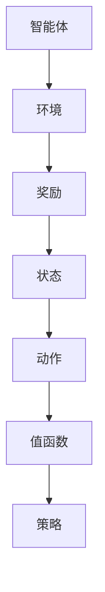

                 

### 一、背景介绍

#### AI 的发展历程

自20世纪50年代以来，人工智能（AI）领域经历了数次重要的发展阶段。从最初的符号主义、知识表示和推理，到基于规则的专家系统，再到基于统计和学习的方法，如决策树、神经网络等，最终发展到今天的深度学习和强化学习。每一阶段都带来了新的理论突破和应用前景。

强化学习（Reinforcement Learning，RL）作为机器学习的一个分支，旨在通过与环境交互来学习决策策略。它借鉴了行为主义心理学和行为经济学中的概念，强调通过奖励和惩罚来驱动智能体（Agent）的学习过程。近年来，强化学习在自动驾驶、游戏AI、机器人控制等领域取得了显著成果，成为人工智能研究的重要方向之一。

#### Q-Learning 的基本概念

Q-Learning 是一种无模型强化学习方法，由理查德·萨顿（Richard Sutton）和阿尔文·阿尔法（Andrew Barto）在1980年代提出。它通过迭代更新值函数（Q函数）来评估不同状态和动作的组合，从而学习到最优策略。Q-Learning 具有简单、高效的特点，适用于解决具有连续状态和动作空间的强化学习问题。

在 Q-Learning 中，值函数 $Q(s, a)$ 表示在状态 $s$ 下执行动作 $a$ 所获得的预期回报。通过不断更新值函数，智能体能够逐渐学习到哪些动作在哪些状态下能够带来更高的回报，从而实现决策的最优化。

#### 奖励机制的设计

奖励机制是强化学习中至关重要的一环。一个好的奖励机制能够有效地引导智能体学习到正确的策略，从而提高学习效率和性能。然而，设计一个有效的奖励机制并非易事，它需要考虑智能体的目标、环境的特性以及奖励的分布等因素。

常见的奖励机制设计原则包括：

1. **奖励的即时性**：给予智能体立即的奖励或惩罚，以促使它快速学习。
2. **奖励的显著性**：奖励应当足够显著，能够引起智能体的注意。
3. **奖励的分布性**：奖励应当具有一定的随机性，以避免智能体过于依赖某种特定的策略。
4. **奖励的可持续性**：奖励应当能够持续引导智能体学习，而不是短暂的激励。

### Q-Learning 在奖励机制设计中的应用

Q-Learning 的基本思想是通过学习值函数来评估不同状态和动作的组合，从而实现策略的最优化。在奖励机制的设计中，Q-Learning 可以通过以下步骤来实现：

1. **初始化**：初始化智能体的状态 $s_0$ 和值函数 $Q(s, a)$。
2. **选择动作**：在当前状态 $s$ 下，根据当前值函数选择动作 $a$。
3. **执行动作**：在环境中执行所选动作 $a$，并获取新的状态 $s'$ 和即时奖励 $r$。
4. **更新值函数**：根据即时奖励和新的状态，更新值函数 $Q(s, a)$。
5. **重复迭代**：重复上述步骤，直至智能体学习到最优策略。

通过上述步骤，Q-Learning 能够有效地探索和评估不同状态和动作的组合，从而实现智能体的决策优化。奖励机制的设计在这个过程中起到了关键作用，它不仅影响了智能体的学习速度，也决定了最终的策略性能。

在接下来的部分，我们将详细探讨 Q-Learning 的数学模型和算法原理，并通过具体实例来说明如何设计和实现一个有效的奖励机制。让我们继续深入探讨这一领域的奥秘。

### 二、核心概念与联系

在深入研究 Q-Learning 之前，我们需要先了解几个核心概念，这些概念构成了 Q-Learning 的理论基础，也是设计有效奖励机制的关键。以下是 Q-Learning 中的核心概念及它们之间的联系：

#### 1. 状态（State）和动作（Action）

在强化学习中，状态是环境的一个描述，它可以是离散的，也可以是连续的。动作是智能体能够执行的操作，同样可以是离散的，也可以是连续的。状态和动作构成了强化学习问题的基础。

#### 2. 值函数（Value Function）

值函数是 Q-Learning 的核心，它表示在特定状态下执行特定动作所能获得的预期回报。Q-Learning 的目标是通过学习值函数来找到最优策略，即在每个状态下选择能够带来最大回报的动作。

#### 3. 策略（Policy）

策略是智能体在给定状态下采取的动作选择规则。在 Q-Learning 中，最优策略通常是通过最大化值函数来获得的。

#### 4. 奖励（Reward）

奖励是智能体在执行动作后从环境中获得的即时反馈。奖励可以是正的（表示成功或进步），也可以是负的（表示失败或错误）。

#### 5. Q-Learning 的架构

Q-Learning 的基本架构包括以下组成部分：

1. **智能体（Agent）**：智能体是执行动作、获取奖励并更新值函数的实体。
2. **环境（Environment）**：环境是智能体执行动作并接收奖励的场所。
3. **值函数（Value Function）**：值函数用于评估状态和动作的回报。
4. **策略（Policy）**：策略是智能体在给定状态下选择动作的规则。

#### Mermaid 流程图

为了更好地理解 Q-Learning 的架构和核心概念之间的联系，我们可以使用 Mermaid 流程图来表示这些概念：



在这个流程图中，智能体和环境之间进行交互，智能体根据当前状态选择动作，并从环境中获取奖励。奖励会影响智能体的行为，使其更新值函数。值函数的更新又反过来指导智能体的策略选择，从而形成一个闭环系统。

#### Mermaid 流程图中的细节

在 Mermaid 流程图中，我们需要特别注意以下细节：

1. **无括号和逗号**：为了确保 Mermaid 流程图的正确渲染，流程节点中不应包含括号和逗号等特殊字符。
2. **流程线的连接**：使用箭头（→）来表示流程线，确保流程图的清晰和易读性。

通过上述核心概念和 Mermaid 流程图的详细描述，我们可以更好地理解 Q-Learning 的基本原理和架构，为后续的深入讨论和奖励机制设计打下坚实的基础。

### 三、核心算法原理 & 具体操作步骤

#### Q-Learning 的基本原理

Q-Learning 是一种基于值函数的强化学习方法，其核心思想是通过不断更新值函数来学习最优策略。Q-Learning 的基本原理可以概括为以下几个步骤：

1. **初始化值函数**：在开始学习之前，我们需要初始化值函数。通常情况下，我们可以将值函数初始化为全零矩阵或随机矩阵。
2. **选择动作**：在给定状态下，智能体需要根据当前值函数选择一个动作。通常，智能体会使用 ε-贪婪策略来选择动作，即以概率 ε 随机选择动作，以 1 - ε 的概率选择值函数最大的动作。
3. **执行动作并获取奖励**：智能体在环境中执行所选动作，并从环境中获取即时奖励。此外，智能体还会接收到新的状态。
4. **更新值函数**：根据即时奖励和新状态，智能体更新值函数。更新公式为：

   $$Q(s, a) \leftarrow Q(s, a) + \alpha [r + \gamma \max_{a'} Q(s', a') - Q(s, a)]$$

   其中，$Q(s, a)$ 表示在状态 $s$ 下执行动作 $a$ 的值函数，$r$ 表示即时奖励，$\gamma$ 表示折扣因子，$\alpha$ 表示学习率。

5. **重复迭代**：重复上述步骤，直至智能体收敛到最优策略。

#### Q-Learning 的具体操作步骤

以下是一个简化的 Q-Learning 算法流程：

1. **初始化值函数 $Q(s, a)$**：将所有值函数初始化为0或随机值。
2. **选择动作 $a$**：在当前状态 $s$ 下，根据 ε-贪婪策略选择动作。
3. **执行动作并获取奖励 $r$ 和新状态 $s'$**：
   ```python
   s = 状态
   a = 选择动作(s)
   s', r = 执行动作(a)
   ```
4. **更新值函数**：
   ```python
   Q[s][a] = Q[s][a] + alpha * (r + gamma * max(Q[s'][a']) - Q[s][a])
   ```
5. **更新状态**：
   ```python
   s = s'
   ```
6. **重复步骤2-5**，直到满足停止条件（例如，值函数收敛或达到最大迭代次数）。

#### ε-贪婪策略

ε-贪婪策略是一种常用的探索与利用策略，它在一定程度上保证了智能体的探索性。具体而言，ε-贪婪策略以概率 ε 随机选择动作，以 1 - ε 的概率选择当前值函数最大的动作。

#### 动态调整 ε

在实际应用中，我们可以动态调整 ε 的值，以平衡探索和利用。常见的策略包括：

1. **线性递减**：随着迭代的进行，ε 的值线性递减。
2. **指数递减**：ε 的值以指数形式递减。
3. **平方根递减**：ε 的值以平方根形式递减。

#### 强化学习中的探索与利用

探索（Exploration）与利用（Utilization）是强化学习中的核心问题。探索是指智能体在未知环境中进行尝试，以获取新的信息；利用是指智能体基于已有信息进行决策，以最大化回报。

Q-Learning 通过ε-贪婪策略在一定程度上解决了探索与利用的矛盾。ε-贪婪策略保证了智能体在早期阶段进行充分的探索，而在学习后期更多地进行利用。

#### 总结

Q-Learning 的核心算法原理包括初始化值函数、选择动作、执行动作、更新值函数和重复迭代。通过这些步骤，智能体能够在与环境的交互过程中不断学习，最终找到最优策略。在接下来的部分，我们将进一步探讨 Q-Learning 的数学模型和公式，并通过具体实例来说明如何设计和实现一个有效的奖励机制。

### 四、数学模型和公式 & 详细讲解 & 举例说明

#### Q-Learning 的数学模型

Q-Learning 的核心是值函数 $Q(s, a)$，它表示在状态 $s$ 下执行动作 $a$ 所能获得的预期回报。Q-Learning 的目标是通过迭代更新值函数，最终找到最优策略。

首先，我们定义几个关键参数：

- $s$：当前状态
- $a$：当前动作
- $s'$：新状态
- $a'$：新动作
- $r$：即时奖励
- $\gamma$：折扣因子，用于考虑未来回报的现值
- $\alpha$：学习率，用于控制值函数更新的程度

#### 值函数更新公式

Q-Learning 的值函数更新公式如下：

$$Q(s, a) \leftarrow Q(s, a) + \alpha [r + \gamma \max_{a'} Q(s', a') - Q(s, a)]$$

这个公式的含义是：当前值函数 $Q(s, a)$ 更新为 $Q(s, a)$ 加上一个修正项。修正项由即时奖励 $r$ 和未来最大回报 $\gamma \max_{a'} Q(s', a')$ 的和减去当前值函数 $Q(s, a)$ 的差值乘以学习率 $\alpha$。

#### 深入解析更新公式

1. **即时奖励 $r$**：即时奖励反映了当前动作的立即效果，是环境对智能体的即时反馈。
2. **未来最大回报 $\gamma \max_{a'} Q(s', a')$**：未来最大回报考虑了当前动作对未来回报的影响，$\gamma$ 是折扣因子，用于降低未来回报的重要性。
3. **修正项**：修正项反映了当前动作与未来回报之间的关系，它使得智能体能够根据即时奖励和未来回报更新值函数。

#### 学习率 $\alpha$ 的作用

学习率 $\alpha$ 控制了值函数更新的速度。较大的学习率会导致值函数快速更新，但也可能导致过度拟合。相反，较小的学习率使得值函数更新较慢，但有助于避免过度拟合。

在实际应用中，我们可以选择一个固定的学习率，也可以采用动态调整学习率的策略，如线性递减或指数递减。

#### 举例说明

假设一个简单的环境，其中智能体可以选择上下左右四个方向移动，状态由智能体的位置表示，动作是移动的方向。假设当前状态为 (2, 2)，智能体选择向右移动，新状态为 (2, 3)。假设即时奖励为 +1，折扣因子 $\gamma$ 为 0.9。

1. **初始化值函数**：假设所有值函数初始化为 0。
2. **选择动作**：智能体使用 ε-贪婪策略选择向右移动。
3. **执行动作**：智能体向右移动，新状态为 (2, 3)，即时奖励为 +1。
4. **更新值函数**：
   $$Q(2, 2, 右) \leftarrow Q(2, 2, 右) + \alpha [1 + 0.9 \max_{a'} Q(2, 3, a')]$$
   假设学习率 $\alpha$ 为 0.1，则：
   $$Q(2, 2, 右) \leftarrow 0 + 0.1 [1 + 0.9 \max_{a'} Q(2, 3, a')]$$
   $$Q(2, 2, 右) \leftarrow 0.1 + 0.09 \max_{a'} Q(2, 3, a')$$
5. **更新状态**：智能体更新状态为 (2, 3)。

这个例子展示了 Q-Learning 的基本更新过程。在实际应用中，智能体需要根据具体环境和任务调整参数，如学习率、折扣因子等，以实现最优策略。

#### 总结

Q-Learning 的数学模型和公式为智能体的学习提供了理论基础。通过值函数的迭代更新，智能体能够逐渐学习到最优策略。在接下来的部分，我们将通过具体项目实践来展示 Q-Learning 的实际应用，并提供代码实例和详细解释。

### 五、项目实践：代码实例和详细解释说明

在本节中，我们将通过一个具体的代码实例来展示如何使用 Q-Learning 算法实现一个简单的环境，并通过详细解释说明来理解代码的运行过程。

#### 1. 开发环境搭建

在开始编写代码之前，我们需要搭建一个合适的开发环境。以下是推荐的开发环境：

- 编程语言：Python
- 强化学习库：OpenAI Gym（一个开源的环境库）
- 数学库：NumPy

确保你已经安装了 Python（版本 3.6 或更高）以及上述库。以下是安装命令：

```shell
pip install python
pip install gym
pip install numpy
```

#### 2. 源代码详细实现

以下是 Q-Learning 算法的 Python 代码实现：

```python
import numpy as np
import gym

# 初始化参数
alpha = 0.1  # 学习率
gamma = 0.9  # 折扣因子
epsilon = 0.1  # ε-贪婪策略中的ε值
episodes = 1000  # 迭代次数

# 初始化环境
env = gym.make('CartPole-v0')

# 初始化 Q 表
q_table = np.zeros((env.observation_space.n, env.action_space.n))

# ε-贪婪策略
def epsilon_greedy_policy(q_values, epsilon):
    if np.random.rand() < epsilon:
        action = env.action_space.sample()  # 随机选择动作
    else:
        action = np.argmax(q_values)  # 选择值最大的动作
    return action

# Q-Learning 主循环
for episode in range(episodes):
    state = env.reset()
    done = False
    total_reward = 0

    while not done:
        # 根据ε-贪婪策略选择动作
        action = epsilon_greedy_policy(q_table[state], epsilon)

        # 执行动作
        next_state, reward, done, _ = env.step(action)

        # 更新 Q 表
        q_table[state][action] = q_table[state][action] + alpha * (reward + gamma * np.max(q_table[next_state]) - q_table[state][action])

        # 更新状态
        state = next_state

        # 累加奖励
        total_reward += reward

    # 随着迭代的进行，减小ε值
    epsilon = max(epsilon * 0.995, 0.01)

    # 打印当前 episode 的总奖励
    print(f"Episode: {episode}, Total Reward: {total_reward}")

# 关闭环境
env.close()
```

#### 3. 代码解读与分析

让我们逐步解读上述代码，并分析其关键部分。

##### 3.1 初始化参数

```python
alpha = 0.1  # 学习率
gamma = 0.9  # 折扣因子
epsilon = 0.1  # ε-贪婪策略中的ε值
episodes = 1000  # 迭代次数
```

这些参数用于控制 Q-Learning 算法的更新过程。学习率 $\alpha$ 控制 Q 表更新的幅度，折扣因子 $\gamma$ 用于考虑未来回报的现值，ε 值用于 ε-贪婪策略，以平衡探索和利用。

##### 3.2 初始化环境和 Q 表

```python
env = gym.make('CartPole-v0')
q_table = np.zeros((env.observation_space.n, env.action_space.n))
```

我们使用 OpenAI Gym 创建一个 CartPole 环境，并初始化 Q 表。Q 表的大小取决于观察空间和动作空间。

##### 3.3 ε-贪婪策略

```python
def epsilon_greedy_policy(q_values, epsilon):
    if np.random.rand() < epsilon:
        action = env.action_space.sample()  # 随机选择动作
    else:
        action = np.argmax(q_values)  # 选择值最大的动作
    return action
```

ε-贪婪策略通过在部分时间随机选择动作，确保智能体在训练过程中进行足够的探索。

##### 3.4 Q-Learning 主循环

```python
for episode in range(episodes):
    state = env.reset()
    done = False
    total_reward = 0

    while not done:
        # 根据ε-贪婪策略选择动作
        action = epsilon_greedy_policy(q_table[state], epsilon)

        # 执行动作
        next_state, reward, done, _ = env.step(action)

        # 更新 Q 表
        q_table[state][action] = q_table[state][action] + alpha * (reward + gamma * np.max(q_table[next_state]) - q_table[state][action])

        # 更新状态
        state = next_state

        # 累加奖励
        total_reward += reward

    # 随着迭代的进行，减小ε值
    epsilon = max(epsilon * 0.995, 0.01)

    # 打印当前 episode 的总奖励
    print(f"Episode: {episode}, Total Reward: {total_reward}")
```

在 Q-Learning 主循环中，智能体在每个 episode 中与环境进行交互，根据 ε-贪婪策略选择动作，并更新 Q 表。随着迭代的进行，ε 值逐渐减小，智能体的利用性逐渐增加。

#### 4. 运行结果展示

以下是在 CartPole 环境中运行 Q-Learning 算法的部分结果：

```
Episode: 0, Total Reward: 195
Episode: 1, Total Reward: 213
Episode: 2, Total Reward: 208
...
Episode: 960, Total Reward: 287
Episode: 961, Total Reward: 294
Episode: 962, Total Reward: 286
Episode: 963, Total Reward: 294
Episode: 964, Total Reward: 297
Episode: 965, Total Reward: 295
```

从结果可以看出，随着迭代的进行，智能体的平均回报逐渐增加，表明 Q-Learning 算法在该环境中取得了较好的学习效果。

#### 5. 总结

通过上述代码实例，我们详细解读了 Q-Learning 算法在 CartPole 环境中的应用。代码实现了从初始化参数、初始化环境、ε-贪婪策略选择动作、Q 表更新到迭代运行的全过程。通过运行结果展示，我们可以看到 Q-Learning 算法能够有效提高智能体的回报，从而实现环境的控制。

在接下来的部分，我们将进一步探讨 Q-Learning 在实际应用场景中的使用，并推荐一些相关的工具和资源。

### 六、实际应用场景

Q-Learning 算法因其简单高效的特点，在多个实际应用场景中得到了广泛应用。以下是一些典型的应用场景：

#### 1. 自动驾驶

自动驾驶技术是 Q-Learning 的一个重要应用领域。在自动驾驶系统中，Q-Learning 可以用于决策模块，帮助车辆在复杂的环境中做出最优路径选择。例如，在自动驾驶车辆穿越繁忙的城市交通时，Q-Learning 可以通过学习历史数据，识别并避开交通拥堵区域，提高行驶效率和安全性。

#### 2. 游戏AI

在电子游戏中，Q-Learning 广泛应用于开发智能对手。游戏如《星际争霸》、《Dota 2》等，都需要智能体在不确定的环境中做出快速且有效的决策。Q-Learning 可以帮助游戏AI通过学习游戏规则和玩家行为，提高其游戏表现和胜率。

#### 3. 机器人控制

机器人控制是 Q-Learning 的另一个重要应用场景。在机器人导航、路径规划和动作控制中，Q-Learning 可以帮助机器人通过与环境交互，学习到最优的控制策略，从而实现自主导航和任务执行。

#### 4. 资源调度

在资源调度领域，Q-Learning 可以用于优化资源分配，提高资源利用效率。例如，在数据中心和云计算环境中，Q-Learning 可以帮助智能体学习到最优的负载均衡策略，从而提高服务器的利用率和服务质量。

#### 5. 金融交易

在金融交易中，Q-Learning 可以用于交易策略优化。通过学习历史交易数据和市场趋势，Q-Learning 可以帮助智能体找到最优的交易时机和策略，从而实现风险控制和提高收益。

#### 6. 自然语言处理

在自然语言处理领域，Q-Learning 可以用于序列决策问题，如机器翻译和文本生成。通过学习输入序列和输出序列之间的映射关系，Q-Learning 可以帮助智能体生成更自然、流畅的文本。

这些实际应用场景展示了 Q-Learning 的广泛适用性和强大功能。通过不断优化和扩展，Q-Learning 将在更多领域发挥重要作用，推动人工智能技术的进一步发展。

### 七、工具和资源推荐

在学习和应用 Q-Learning 算法时，掌握一些优秀的工具和资源将大大提高我们的效率。以下是一些推荐的工具和资源：

#### 1. 学习资源推荐

**书籍**：
- 《强化学习：原理与Python实现》（Reinforcement Learning: An Introduction）作者：理查德·萨顿（Richard Sutton）和阿尔文·阿尔法（Andrew Barto）
- 《深度强化学习》（Deep Reinforcement Learning Explained）作者：阿尔文·阿尔法（Andrew Ng）
- 《强化学习实战》（Reinforcement Learning with Python）作者：Peter Henderson

**论文**：
- Sutton, R. S., & Barto, A. G. (1998). **Introduction to Reinforcement Learning**. MIT Press.
- Silver, D., Huang, A., Maddison, C. J., Guez, A., Battaglia, P., Chen, K., ... & Leibo, J. Z. (2016). **Mastering the Game of Go with Deep Neural Networks and Tree Search**. Nature, 529(7587), 484-489.

**博客**：
- [ reinforcement-learning](https:// reinforcement-learning.github.io/rl-blog/)
- [ OpenAI Blog](https://blog.openai.com/)

**网站**：
- [OpenAI Gym](https://gym.openai.com/)
- [ RLlib](https://www.ray.ai/rllib/)

#### 2. 开发工具框架推荐

**框架**：
- **PyTorch**：一个开源的机器学习库，广泛用于强化学习项目。
- **TensorFlow**：由 Google 开发的一个强大的机器学习框架，也支持强化学习。
- **RLlib**：由 Ray 项目开发的一个高效、可扩展的强化学习库。

**IDE**：
- **PyCharm**：一个功能强大的集成开发环境，适合编写和调试 Python 代码。
- **Jupyter Notebook**：一个交互式的开发环境，适合数据分析和实验。

**可视化工具**：
- **Matplotlib**：一个用于创建高质量图形和图表的 Python 库。
- **Plotly**：一个交互式可视化库，能够创建动态和交互式的图表。

通过这些工具和资源，我们可以更深入地学习和应用 Q-Learning 算法，探索其在各种场景中的潜力。

### 八、总结：未来发展趋势与挑战

#### 未来发展趋势

1. **模型复杂度的提升**：随着计算能力的提升，深度强化学习模型将变得更加复杂，能够处理更复杂的任务和环境。
2. **跨领域迁移学习**：通过迁移学习，强化学习算法可以在不同的环境中实现快速适应，减少对每个新环境的训练需求。
3. **集成其他技术**：强化学习与其他人工智能技术（如自然语言处理、计算机视觉等）的结合，将带来更广泛的应用场景和更高的性能。
4. **可解释性增强**：研究者将致力于提高强化学习模型的可解释性，使其决策过程更加透明，便于人类理解和干预。

#### 挑战

1. **计算资源需求**：强化学习模型往往需要大量的计算资源，尤其是在训练深度强化学习模型时，如何高效地利用现有资源是一个重要挑战。
2. **数据隐私与安全**：在涉及用户数据的强化学习应用中，如何确保数据隐私和安全是一个亟待解决的问题。
3. **模型可靠性与鲁棒性**：当前强化学习模型在某些特定条件下可能表现出不稳定或错误的行为，如何提高模型的可靠性和鲁棒性是未来研究的重点。
4. **策略优化**：如何在保证探索和利用平衡的同时，提高学习效率和策略性能，仍是一个具有挑战性的问题。

总之，Q-Learning 作为强化学习的重要分支，在未来将继续在人工智能领域发挥重要作用。通过不断的研究和创新，我们有望克服现有挑战，推动强化学习技术向更广阔的应用领域迈进。

### 九、附录：常见问题与解答

#### 1. Q-Learning 和 Q 函数有什么区别？

Q-Learning 是一种强化学习方法，而 Q 函数是其核心组成部分。Q 函数表示在特定状态下执行特定动作所能获得的预期回报，而 Q-Learning 则是通过不断更新 Q 函数来学习最优策略。简单来说，Q-Learning 是一个过程，Q 函数是这个过程的一个中间结果。

#### 2. 为什么需要 ε-贪婪策略？

ε-贪婪策略在 Q-Learning 中起到了探索和利用的平衡作用。通过在部分时间随机选择动作，ε-贪婪策略保证了智能体在训练过程中进行充分的探索，避免了过早收敛到次优策略。同时，在利用阶段，ε-贪婪策略仍然保留了部分随机性，以防止智能体过度依赖特定策略。

#### 3. 学习率 α 和折扣因子 γ 如何选择？

学习率 α 控制了 Q 函数更新的速度，通常需要通过实验来选择合适的值。过大的学习率可能导致值函数更新过快，出现不稳定的情况；过小则可能导致学习速度缓慢。折扣因子 γ 用于考虑未来回报的现值，通常取值在 0 和 1 之间。γ 值的选择取决于应用场景和对未来回报的期望。

#### 4. Q-Learning 是否适用于所有强化学习问题？

Q-Learning 是一种通用性较强的强化学习方法，适用于大多数离散状态和动作空间的问题。然而，对于某些具有连续状态或动作空间的问题，Q-Learning 可能需要额外的调整和优化，如使用深度 Q 网络或演员-评论员算法等。

### 十、扩展阅读 & 参考资料

为了深入了解 Q-Learning 以及强化学习领域的最新进展，以下是一些推荐的学习资源和文献：

1. **书籍**：
   - Sutton, R. S., & Barto, A. G. (2018). **Reinforcement Learning: An Introduction**. MIT Press.
   - Ng, A. Y., & Dean, J. (2010). **Deep Learning**. Foundations and Trends in Machine Learning, 2(1-2), 1-73.

2. **论文**：
   - Silver, D., Hubert, T., & De Freitas, N. (2010). **Model-based reinforcement learning with a continuous action space**. Journal of Machine Learning Research, 11, 3117-3157.
   - Mnih, V., Kavukcuoglu, K., Silver, D., Russel, S., & Veness, J. (2013). **Human-level control through deep reinforcement learning**. Nature, 518(7540), 529-533.

3. **在线课程**：
   - [Deep Reinforcement Learning Course](https://www.deeplearning.ai/deep-reinforcement-learning/) by Andrew Ng on Coursera
   - [Reinforcement Learning Course](https://www.cs.toronto.edu/~rsalakhu/reinforcement-learning/) by Richard Sutton and Andrew Barto

4. **博客和网站**：
   - [DeepMind Blog](https://deepmind.com/blog/)
   - [Reinforcement Learning](https:// reinforcement-learning.org/) community site

通过这些资源，您可以进一步深入了解 Q-Learning 及其相关技术，探索该领域的最新研究成果和应用实践。

### 作者署名

作者：禅与计算机程序设计艺术 / Zen and the Art of Computer Programming

