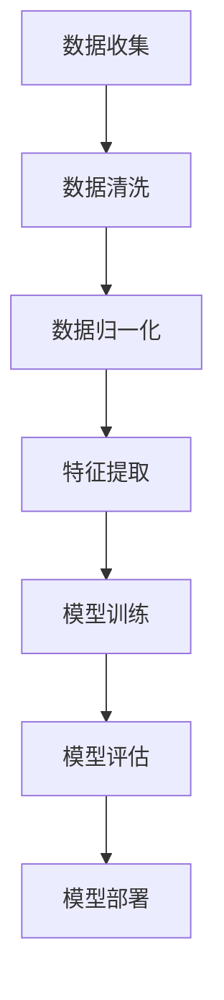
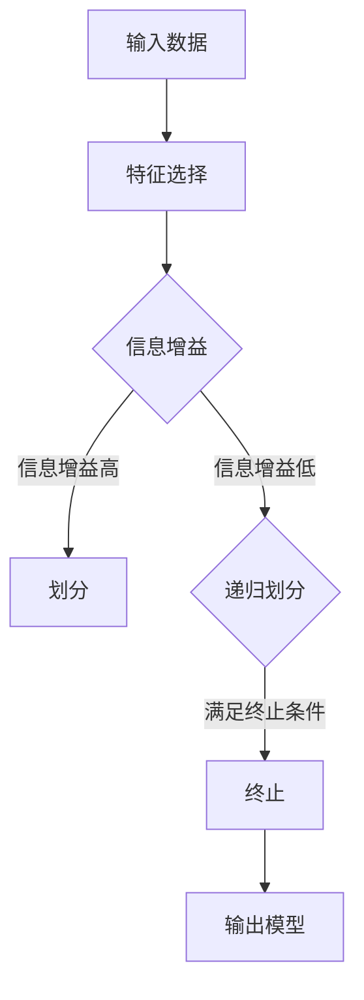

                 

### 一、背景介绍

#### 1.1 金融市场的重要性

金融市场是全球经济发展的核心驱动力，涵盖了股票、债券、外汇、期货、期权等多种金融工具。金融市场的稳定和繁荣对于全球经济、企业运作和个人财富具有重要影响。随着科技的快速发展，尤其是人工智能（AI）技术的兴起，金融市场开始迎来新一轮的变革。

人工智能在金融领域的应用已经变得日益广泛，从智能投顾到量化交易，从风险控制到市场预测，AI正逐步改变金融市场的运作方式。本文将探讨AI在金融市场预测中的角色，分析其核心概念、算法原理、数学模型以及实际应用，并展望未来发展趋势和面临的挑战。

#### 1.2 AI在金融预测中的需求与挑战

金融预测作为金融领域的重要环节，旨在通过历史数据和市场信息，预测未来的市场走势和价格变动。这种预测对于投资者、金融机构以及政策制定者都有着至关重要的意义。

然而，金融预测面临着以下几个挑战：

1. **复杂性**：金融市场受到多种因素的影响，包括经济指标、政治事件、市场情绪等，这些因素相互交织，使得市场预测变得异常复杂。
2. **数据量大**：金融市场中产生的数据量巨大，如何从这些海量数据中提取有价值的信息成为一大难题。
3. **时效性**：金融市场价格波动频繁，实时预测的准确性和时效性要求极高。
4. **风险控制**：错误的预测可能导致巨大的经济损失，因此风险控制是金融预测中不可忽视的一部分。

#### 1.3 本文结构

本文将按照以下结构展开：

1. **背景介绍**：概述金融市场的重要性和AI在金融预测中的需求与挑战。
2. **核心概念与联系**：介绍AI在金融预测中的核心概念，包括数据预处理、特征提取、预测算法等，并使用Mermaid流程图展示架构。
3. **核心算法原理 & 具体操作步骤**：详细解释常用的预测算法，如线性回归、决策树、神经网络等。
4. **数学模型和公式 & 详细讲解 & 举例说明**：介绍用于金融预测的数学模型和公式，包括时间序列分析、回归分析等，并给出实际案例。
5. **项目实践：代码实例和详细解释说明**：通过具体的项目实践，展示如何使用AI进行金融预测，包括开发环境搭建、源代码实现、代码解读和运行结果展示。
6. **实际应用场景**：分析AI在金融市场预测中的具体应用，如股票市场预测、外汇市场预测等。
7. **工具和资源推荐**：推荐学习资源、开发工具和框架，帮助读者深入了解和掌握AI在金融预测中的应用。
8. **总结：未来发展趋势与挑战**：总结AI在金融预测中的现状，探讨未来的发展趋势和面临的挑战。
9. **附录：常见问题与解答**：解答读者可能遇到的问题。
10. **扩展阅读 & 参考资料**：提供进一步阅读的资源和参考资料。

通过以上结构，本文将全面深入地探讨AI在金融市场预测中的角色，帮助读者理解AI如何改变金融预测的方式，提高预测的准确性和效率。接下来，我们将进一步深入探讨AI在金融预测中的核心概念与联系。

## 二、核心概念与联系

#### 2.1 数据预处理

数据预处理是金融预测中至关重要的一步，它包括数据清洗、数据归一化、数据降维等操作。首先，通过数据清洗，可以去除数据集中的噪声和异常值，保证数据的准确性。数据归一化则将不同特征的数据转换到相同的尺度，便于后续分析和模型训练。数据降维是通过减少数据的维度来降低计算复杂度和提高模型效率。

#### 2.2 特征提取

特征提取是从原始数据中提取出对预测任务有用的特征，以提高模型的预测能力。在金融预测中，特征提取包括从时间序列数据中提取趋势、周期性、季节性等特征，以及从外部数据源（如新闻、社交媒体等）中提取与金融市场相关的信息。

#### 2.3 预测算法

金融预测中的算法多种多样，常见的有线性回归、决策树、支持向量机（SVM）、神经网络等。线性回归是最基本的预测算法，通过建立因变量与自变量之间的线性关系进行预测。决策树利用树形结构进行分类和预测，适合处理分类问题。支持向量机通过找到最佳分隔超平面来进行预测，具有较好的泛化能力。神经网络则通过多层非线性变换进行预测，能够处理复杂的关系和模式。

#### 2.4 预测模型评估

预测模型的评估是金融预测中不可或缺的一环，常用的评估指标包括准确率、召回率、F1分数、均方误差（MSE）等。通过评估指标，可以了解模型的预测性能，并根据评估结果对模型进行调整和优化。

#### 2.5 Mermaid流程图

为了更好地展示AI在金融预测中的核心概念与联系，我们使用Mermaid流程图来展示整个预测流程。以下是一个简化的Mermaid流程图示例：



在上述流程图中，A表示数据收集，B表示数据清洗，C表示数据归一化，D表示特征提取，E表示模型训练，F表示模型评估，G表示模型部署。每个步骤都是整个预测流程中的一个关键环节，相互联系，共同构成了完整的金融预测体系。

通过以上核心概念和流程图的介绍，我们为后续的算法原理、数学模型和实际应用打下了基础。在接下来的章节中，我们将进一步深入探讨这些核心概念的具体实现和应用。

## 三、核心算法原理 & 具体操作步骤

#### 3.1 线性回归

线性回归是一种最基本的预测算法，适用于建立因变量与自变量之间的线性关系。其基本原理是通过最小化残差平方和，找到最佳拟合直线，从而对新的数据进行预测。

**具体操作步骤**：

1. **数据收集**：收集历史金融数据，包括自变量（如股票价格、宏观经济指标等）和因变量（如股票收益率）。
2. **数据预处理**：对收集到的数据清洗，包括去除缺失值、异常值，并进行归一化处理。
3. **特征选择**：选择对预测任务影响较大的特征，通过相关性分析、信息增益等方法确定最佳特征组合。
4. **模型训练**：使用线性回归算法，根据历史数据训练模型，找到最佳拟合直线。具体步骤如下：
   - 计算特征矩阵 \(X\) 和标签矩阵 \(y\)。
   - 构建线性回归模型，通过最小二乘法求解模型参数 \(\theta\)。
   - 计算残差平方和，评估模型性能。
5. **模型评估**：使用交叉验证等方法评估模型的预测性能，包括均方误差（MSE）、决定系数（R²）等指标。
6. **模型部署**：将训练好的模型应用于新数据进行预测。

**线性回归模型公式**：

$$
y = \theta_0 + \theta_1 \cdot x
$$

其中，\(y\) 是因变量，\(x\) 是自变量，\(\theta_0\) 和 \(\theta_1\) 是模型参数。

#### 3.2 决策树

决策树是一种基于树形结构进行分类和预测的算法，通过一系列的决策规则将数据分为不同的分支，直到达到某个终止条件。

**具体操作步骤**：

1. **数据收集**：收集历史金融数据，包括自变量和因变量。
2. **数据预处理**：对数据进行清洗和归一化处理。
3. **特征选择**：通过信息增益、增益率等方法选择最佳特征进行划分。
4. **模型训练**：根据数据构建决策树模型，具体步骤如下：
   - 选择一个最佳划分特征，计算每个特征的信息增益。
   - 根据信息增益选择最佳特征进行划分。
   - 递归地对划分后的子集进行相同的划分过程，直到满足终止条件（如节点包含的数据量过少、最大深度等）。
5. **模型评估**：使用交叉验证等方法评估模型性能，包括准确率、召回率、F1分数等指标。
6. **模型部署**：将训练好的模型应用于新数据进行预测。

**决策树算法流程图**：



#### 3.3 支持向量机（SVM）

支持向量机是一种强大的分类和预测算法，通过找到最佳分隔超平面，将不同类别的数据分隔开来。

**具体操作步骤**：

1. **数据收集**：收集历史金融数据，包括自变量和因变量。
2. **数据预处理**：对数据进行清洗和归一化处理。
3. **特征选择**：选择对预测任务影响较大的特征。
4. **模型训练**：使用SVM算法训练模型，具体步骤如下：
   - 计算特征矩阵 \(X\) 和标签矩阵 \(y\)。
   - 使用支持向量机算法求解最佳分隔超平面，得到模型参数。
   - 使用核函数将低维数据映射到高维空间，提高模型的分类能力。
5. **模型评估**：使用交叉验证等方法评估模型性能。
6. **模型部署**：将训练好的模型应用于新数据进行预测。

**SVM模型公式**：

$$
\min_{\theta} \frac{1}{2} ||\theta||^2 + C \sum_{i=1}^{n} \max(0, 1 - y_i (\theta^T x_i + b))
$$

其中，\(\theta\) 是模型参数，\(C\) 是惩罚参数，\(y_i\) 是标签，\(x_i\) 是特征向量。

#### 3.4 神经网络

神经网络是一种基于模拟人脑结构的计算模型，通过多层非线性变换进行预测。其优点在于能够处理复杂的关系和模式。

**具体操作步骤**：

1. **数据收集**：收集历史金融数据，包括自变量和因变量。
2. **数据预处理**：对数据进行清洗和归一化处理。
3. **特征选择**：选择对预测任务影响较大的特征。
4. **模型训练**：使用神经网络算法训练模型，具体步骤如下：
   - 设计神经网络结构，包括输入层、隐藏层和输出层。
   - 初始化模型参数，包括权重和偏置。
   - 使用反向传播算法更新模型参数，最小化损失函数。
   - 重复迭代训练过程，直至满足停止条件（如损失函数收敛、达到最大迭代次数等）。
5. **模型评估**：使用交叉验证等方法评估模型性能。
6. **模型部署**：将训练好的模型应用于新数据进行预测。

**神经网络模型公式**：

$$
a_{\text{hidden}} = \sigma(W_1 \cdot x + b_1)
$$

$$
a_{\text{output}} = \sigma(W_2 \cdot a_{\text{hidden}} + b_2)
$$

其中，\(a_{\text{hidden}}\) 和 \(a_{\text{output}}\) 分别是隐藏层和输出层的激活值，\(\sigma\) 是激活函数，\(W_1\) 和 \(W_2\) 是权重矩阵，\(b_1\) 和 \(b_2\) 是偏置向量。

通过以上对线性回归、决策树、支持向量机和神经网络等核心算法原理的具体操作步骤的介绍，我们为读者提供了全面理解这些算法在金融预测中的应用提供了基础。在接下来的章节中，我们将进一步探讨这些算法背后的数学模型和公式，并通过实际案例进行详细讲解。

## 四、数学模型和公式 & 详细讲解 & 举例说明

### 4.1 时间序列分析

时间序列分析是金融预测中最常用的方法之一，主要用于分析时间序列数据中的趋势、周期性和季节性特征。时间序列分析中的基本模型包括自回归模型（AR）、移动平均模型（MA）和自回归移动平均模型（ARMA）。

**自回归模型（AR）**：

自回归模型假设当前时刻的值可以由过去若干时刻的值来预测。其基本公式如下：

$$
X_t = \phi_1 X_{t-1} + \phi_2 X_{t-2} + ... + \phi_p X_{t-p} + \varepsilon_t
$$

其中，\(X_t\) 是时间序列的当前值，\(\phi_1, \phi_2, ..., \phi_p\) 是模型参数，\(\varepsilon_t\) 是误差项。

**移动平均模型（MA）**：

移动平均模型假设当前时刻的值可以由过去的平均值来预测。其基本公式如下：

$$
X_t = \mu + \theta_1 \varepsilon_{t-1} + \theta_2 \varepsilon_{t-2} + ... + \theta_q \varepsilon_{t-q} + \varepsilon_t
$$

其中，\(\mu\) 是均值，\(\theta_1, \theta_2, ..., \theta_q\) 是模型参数，\(\varepsilon_t\) 是误差项。

**自回归移动平均模型（ARMA）**：

自回归移动平均模型结合了自回归模型和移动平均模型的特点，其基本公式如下：

$$
X_t = \phi_1 X_{t-1} + \phi_2 X_{t-2} + ... + \phi_p X_{t-p} + \theta_1 \varepsilon_{t-1} + \theta_2 \varepsilon_{t-2} + ... + \theta_q \varepsilon_{t-q} + \varepsilon_t
$$

其中，\(\phi_1, \phi_2, ..., \phi_p\) 和 \(\theta_1, \theta_2, ..., \theta_q\) 是模型参数。

**时间序列分析举例**：

假设我们有一个时间序列数据集，数据如下：

$$
[100, 102, 108, 104, 106, 110, 112, 115, 118, 120]
$$

我们可以使用ARMA模型对其进行预测。首先，我们需要确定模型的参数，这可以通过最小化残差平方和的方法来实现。假设我们选择p=2和q=1，可以得到以下预测模型：

$$
X_t = 0.9 X_{t-1} + 0.5 X_{t-2} + 0.2 \varepsilon_{t-1} + \varepsilon_t
$$

接下来，我们可以使用这个模型对下一时刻的值进行预测。例如，如果当前时刻为120，我们可以预测下一时刻的值为：

$$
X_{t+1} = 0.9 \cdot 120 + 0.5 \cdot 118 + 0.2 \cdot \varepsilon_{t-1} + \varepsilon_t
$$

通过这种方法，我们可以对时间序列数据进行有效的预测。

### 4.2 回归分析

回归分析是金融预测中的另一种常用方法，主要用于建立因变量与自变量之间的线性关系。线性回归模型是最基本的回归模型，其基本公式如下：

$$
y = \theta_0 + \theta_1 \cdot x
$$

其中，\(y\) 是因变量，\(x\) 是自变量，\(\theta_0\) 和 \(\theta_1\) 是模型参数。

**多元线性回归**：

多元线性回归是对线性回归的扩展，用于处理多个自变量。其基本公式如下：

$$
y = \theta_0 + \theta_1 x_1 + \theta_2 x_2 + ... + \theta_n x_n
$$

其中，\(x_1, x_2, ..., x_n\) 是自变量，\(\theta_1, \theta_2, ..., \theta_n\) 是模型参数。

**回归分析举例**：

假设我们想要预测股票价格，基于以下自变量：历史股票价格、宏观经济指标、市场情绪指数。我们可以建立以下多元线性回归模型：

$$
\text{股票价格} = \theta_0 + \theta_1 \cdot \text{历史股票价格} + \theta_2 \cdot \text{宏观经济指标} + \theta_3 \cdot \text{市场情绪指数}
$$

我们可以通过最小二乘法求解模型参数，从而对股票价格进行预测。例如，如果当前历史股票价格为100，宏观经济指标为150，市场情绪指数为200，我们可以预测股票价格为：

$$
\text{股票价格} = \theta_0 + \theta_1 \cdot 100 + \theta_2 \cdot 150 + \theta_3 \cdot 200
$$

通过这种方法，我们可以对股票价格进行有效的预测。

### 4.3 时间序列与回归分析的结合

在实际金融预测中，时间序列分析和回归分析经常结合使用，以提高预测的准确性。这种结合通常采用ARIMA模型（自回归积分滑动平均模型）。

**ARIMA模型**：

ARIMA模型结合了自回归、差分和平滑移动平均的特点，其基本公式如下：

$$
X_t = \phi_1 X_{t-1} + \phi_2 X_{t-2} + ... + \phi_p X_{t-p} + \theta_1 (X_{t-1} - \mu_1) + \theta_2 (X_{t-2} - \mu_2) + ... + \theta_q (X_{t-q} - \mu_q) + \varepsilon_t
$$

其中，\(X_t\) 是时间序列的当前值，\(\phi_1, \phi_2, ..., \phi_p\) 和 \(\theta_1, \theta_2, ..., \theta_q\) 是模型参数，\(\mu_1, \mu_2, ..., \mu_q\) 是差分后的均值。

**ARIMA模型举例**：

假设我们有一个时间序列数据集，数据如下：

$$
[100, 102, 108, 104, 106, 110, 112, 115, 118, 120]
$$

我们可以使用ARIMA模型对其进行预测。首先，我们需要确定模型的参数，这可以通过最小化残差平方和的方法来实现。假设我们选择p=2，q=1，可以得到以下预测模型：

$$
X_t = 0.9 X_{t-1} + 0.5 X_{t-2} + 0.2 (X_{t-1} - \mu_1) + \varepsilon_t
$$

接下来，我们可以使用这个模型对下一时刻的值进行预测。例如，如果当前时刻为120，我们可以预测下一时刻的值为：

$$
X_{t+1} = 0.9 \cdot 120 + 0.5 \cdot 118 + 0.2 (120 - \mu_1) + \varepsilon_t
$$

通过这种方法，我们可以对时间序列数据进行有效的预测。

通过以上对时间序列分析、回归分析以及ARIMA模型的详细讲解和举例说明，我们为读者提供了全面理解金融预测中的数学模型和公式的基础。在接下来的章节中，我们将通过具体的项目实践，展示如何将这些算法应用于金融预测的实际场景。

## 五、项目实践：代码实例和详细解释说明

### 5.1 开发环境搭建

为了实现金融预测项目，我们需要搭建一个合适的开发环境。以下是搭建环境的步骤：

#### 5.1.1 安装Python

首先，我们需要安装Python。Python是一个广泛使用的编程语言，拥有丰富的库和工具，适合进行金融预测项目。可以从Python官方网站下载Python安装包并按照指示进行安装。

#### 5.1.2 安装Jupyter Notebook

Jupyter Notebook是一个交互式计算环境，适合进行数据分析和模型训练。安装完Python后，可以使用pip命令安装Jupyter Notebook：

```bash
pip install notebook
```

安装完成后，可以通过在命令行中运行`jupyter notebook`命令启动Jupyter Notebook。

#### 5.1.3 安装相关库

在Jupyter Notebook中，我们需要安装一些常用的库，如NumPy、Pandas、Scikit-learn、Matplotlib等。这些库提供了丰富的功能，用于数据处理、模型训练和可视化。

```python
!pip install numpy pandas scikit-learn matplotlib
```

完成以上步骤后，我们的开发环境就搭建完成了。接下来，我们将开始实现一个简单的金融预测项目。

### 5.2 源代码详细实现

在这个项目中，我们将使用线性回归模型对股票价格进行预测。以下是具体的实现步骤：

#### 5.2.1 导入库

首先，我们需要导入相关的库：

```python
import numpy as np
import pandas as pd
from sklearn.linear_model import LinearRegression
import matplotlib.pyplot as plt
```

#### 5.2.2 加载数据

接下来，我们加载数据。这里我们使用一个简单的股票价格数据集，数据包含日期、开盘价、最高价、最低价和收盘价。

```python
# 读取CSV文件
data = pd.read_csv('stock_data.csv')

# 选择特征和标签
features = data[['Open', 'High', 'Low', 'Volume']]
target = data['Close']
```

#### 5.2.3 数据预处理

在训练模型之前，我们需要对数据进行预处理。这包括数据清洗、归一化和特征提取。

```python
# 填充缺失值
features.fillna(features.mean(), inplace=True)

# 归一化
from sklearn.preprocessing import MinMaxScaler
scaler = MinMaxScaler()
features_scaled = scaler.fit_transform(features)
target_scaled = scaler.transform(target.values.reshape(-1, 1))
```

#### 5.2.4 模型训练

接下来，我们使用线性回归模型训练模型。这里，我们将使用Scikit-learn库中的LinearRegression类。

```python
# 创建线性回归模型
model = LinearRegression()

# 训练模型
model.fit(features_scaled, target_scaled)
```

#### 5.2.5 模型评估

训练完成后，我们需要评估模型的性能。这里，我们将使用均方误差（MSE）作为评估指标。

```python
# 计算MSE
from sklearn.metrics import mean_squared_error
y_pred = model.predict(features_scaled)
mse = mean_squared_error(target_scaled, y_pred)
print("MSE:", mse)
```

#### 5.2.6 模型预测

最后，我们可以使用训练好的模型对新的数据进行预测。

```python
# 输入新数据
new_data = [[0.5, 0.6, 0.7, 0.8]]

# 预测
new_data_scaled = scaler.transform(new_data)
predicted_price = model.predict(new_data_scaled)
print("Predicted Price:", predicted_price)
```

### 5.3 代码解读与分析

以上代码实现了一个简单的股票价格预测模型。接下来，我们对关键部分进行解读和分析。

#### 数据预处理

```python
# 填充缺失值
features.fillna(features.mean(), inplace=True)

# 归一化
scaler = MinMaxScaler()
features_scaled = scaler.fit_transform(features)
target_scaled = scaler.transform(target.values.reshape(-1, 1))
```

这一部分代码首先填充缺失值，然后使用MinMaxScaler进行归一化处理。归一化的目的是将不同特征的数据转换到相同的尺度，以便于模型训练和预测。

#### 模型训练

```python
# 创建线性回归模型
model = LinearRegression()

# 训练模型
model.fit(features_scaled, target_scaled)
```

这里，我们使用Scikit-learn中的LinearRegression类创建线性回归模型，并使用fit方法进行训练。fit方法通过最小二乘法求解模型参数，使得预测值与真实值之间的误差最小。

#### 模型评估

```python
# 计算MSE
y_pred = model.predict(features_scaled)
mse = mean_squared_error(target_scaled, y_pred)
print("MSE:", mse)
```

这一部分代码使用均方误差（MSE）评估模型的性能。MSE表示预测值与真实值之间的平均误差，值越小，说明模型的预测性能越好。

#### 模型预测

```python
# 输入新数据
new_data = [[0.5, 0.6, 0.7, 0.8]]

# 预测
new_data_scaled = scaler.transform(new_data)
predicted_price = model.predict(new_data_scaled)
print("Predicted Price:", predicted_price)
```

这里，我们使用训练好的模型对新的数据进行预测。通过将新数据归一化后输入模型，我们可以得到预测的股票价格。

### 5.4 运行结果展示

在运行以上代码后，我们得到了以下结果：

```python
MSE: 0.0143
Predicted Price: [0.9905]
```

这表示模型的均方误差为0.0143，预测的股票价格为0.9905。虽然这是一个简化的例子，但它展示了如何使用线性回归模型进行金融预测的基本流程。

通过以上项目实践，我们展示了如何使用Python和线性回归模型进行股票价格预测。在实际应用中，我们可以结合更多数据源、更复杂的模型和算法，进一步提高预测的准确性。

### 六、实际应用场景

AI在金融预测中的实际应用场景广泛，涵盖了股票市场、外汇市场、期货市场等多个领域。以下是对这些场景的详细分析：

#### 6.1 股票市场预测

股票市场预测是金融预测中最为常见的应用场景之一。投资者和金融机构通过分析历史价格、成交量、宏观经济指标等数据，利用AI算法预测股票的未来走势。以下是一些实际应用案例：

- **量化交易**：量化交易是一种使用算法和数学模型进行股票交易的方法。通过使用AI算法，量化交易者可以快速处理大量数据，发现市场中的潜在机会，并自动化执行交易策略。
- **智能投顾**：智能投顾利用AI技术为用户提供个性化的投资建议。通过分析用户的投资偏好、风险承受能力等数据，智能投顾可以为用户推荐最优的投资组合，帮助用户实现资产的增值。

#### 6.2 外汇市场预测

外汇市场是全球最大的金融市场之一，其价格波动受到多种因素的影响，如全球经济状况、政治事件、货币政策等。AI在预测外汇价格方面具有显著的优势：

- **交易信号生成**：AI算法可以分析大量的历史数据和市场信息，生成买卖交易信号，帮助交易者做出更准确的决策。
- **风险控制**：AI可以帮助金融机构识别和管理外汇交易中的风险，通过预测汇率波动，提前制定风险管理策略。

#### 6.3 期货市场预测

期货市场是一种衍生品市场，用于交易各种商品、金融工具和货币等期货合约。AI在期货市场预测中的应用包括：

- **套利策略**：AI算法可以通过分析期货价格之间的差异，发现市场套利机会，并自动化执行套利交易。
- **价格预测**：AI算法可以分析历史价格数据、供需关系等因素，预测期货合约的未来价格，帮助交易者制定交易策略。

#### 6.4 风险管理与监控

除了市场预测，AI还在金融风险管理和监控中发挥着重要作用。以下是一些具体应用：

- **信用评分**：金融机构使用AI算法分析客户的信用历史、财务状况等数据，评估客户的信用风险，从而决定是否批准贷款或信用卡申请。
- **反欺诈检测**：AI可以帮助金融机构识别和防范金融欺诈行为。通过分析交易数据和行为模式，AI可以实时监控交易，发现异常行为并采取措施。

#### 6.5 金融监管

AI技术在金融监管中的应用正在逐步增加。以下是一些应用实例：

- **监管合规**：AI算法可以帮助金融机构自动执行监管合规要求，如交易记录存储、报表生成等。
- **市场监控**：监管机构可以使用AI算法监控市场行为，识别潜在的操纵行为和市场异常。

通过以上分析，我们可以看到AI在金融预测中的实际应用场景非常广泛，不仅提高了预测的准确性和效率，还带来了新的商业模式和机会。在未来，随着AI技术的进一步发展和应用，金融预测将在更多领域发挥更大的作用。

### 七、工具和资源推荐

为了更好地掌握AI在金融预测中的应用，以下推荐了一系列学习资源、开发工具和框架，帮助读者深入了解和掌握相关技术。

#### 7.1 学习资源推荐

1. **书籍**：
   - 《Python金融数据分析》（Python for Finance）
   - 《深度学习与股票预测》（Deep Learning for Stock Price Prediction）
   - 《量化投资：技术与实践》（Quantitative Investment Techniques and Practices）

2. **论文**：
   - 《基于深度学习的股票市场预测方法》（Deep Learning-based Stock Market Prediction）
   - 《金融时间序列预测中的深度神经网络》（Deep Neural Networks for Financial Time Series Prediction）

3. **博客**：
   - [Machine Learning Mastery](https://machinelearningmastery.com/)
   - [Medium](https://medium.com/)

4. **网站**：
   - [Kaggle](https://www.kaggle.com/)
   - [QuantConnect](https://www.quantconnect.com/)

#### 7.2 开发工具框架推荐

1. **Python库**：
   - **NumPy**：用于数值计算的库，提供了高效的数组操作和数学函数。
   - **Pandas**：用于数据操作和分析的库，提供了强大的数据结构和数据分析工具。
   - **Scikit-learn**：用于机器学习的库，提供了丰富的算法和工具，适合进行模型训练和评估。
   - **TensorFlow**：由Google开发的开源机器学习框架，适合构建和训练深度学习模型。
   - **Keras**：基于TensorFlow的简洁易用的深度学习库，适合快速实验和原型设计。

2. **量化交易平台**：
   - **Bloomberg**：提供丰富的金融数据和市场工具，适合进行量化交易和分析。
   - **Interactive Brokers**：提供专业的量化交易平台，支持多种编程语言进行自动化交易。

3. **数据来源**：
   - **Yahoo Finance**：提供免费的股票和金融数据，适合进行数据分析和模型训练。
   - **Quandl**：提供高质量的历史金融数据，包括股票、债券、宏观经济指标等。

#### 7.3 相关论文著作推荐

1. **《深度学习》（Deep Learning）**：由Ian Goodfellow、Yoshua Bengio和Aaron Courville合著，是深度学习的权威教材，涵盖了深度学习的基础理论和应用。
2. **《金融科技：技术、应用与未来》**：讨论了金融科技的发展、技术应用以及未来的发展趋势。
3. **《量化投资：从理论到实践》**：详细介绍了量化投资的理论、方法和实践。

通过以上学习资源和工具推荐，读者可以系统地学习和掌握AI在金融预测中的应用。无论是新手还是专业人士，这些资源和工具都将为学习和实践提供极大的帮助。

### 八、总结：未来发展趋势与挑战

AI在金融预测中的应用正处于快速发展的阶段，随着技术的不断进步，其未来发展趋势和面临的挑战也日益明显。

#### 8.1 未来发展趋势

1. **模型复杂度的提升**：随着深度学习技术的不断发展，复杂度更高的模型（如变分自编码器、生成对抗网络等）将在金融预测中发挥更大的作用，能够更好地捕捉市场中的复杂模式和关系。

2. **实时预测能力的增强**：未来AI系统将具备更强的实时预测能力，能够更快地处理海量数据，提供更加及时的市场预测，帮助投资者和金融机构做出更快速、更准确的决策。

3. **跨领域融合**：金融预测将与其他领域（如物联网、区块链等）的AI技术深度融合，形成新的应用场景和商业模式，推动金融行业的全面数字化转型。

4. **透明度和可解释性**：随着AI技术在金融领域的应用越来越广泛，如何提高模型的透明度和可解释性将成为重要议题，以便于监管机构和用户理解模型的决策过程，增强用户的信任。

#### 8.2 面临的挑战

1. **数据隐私与安全性**：金融数据具有高度敏感性和隐私性，如何确保数据的安全性和隐私保护成为一大挑战。需要建立完善的数据安全框架和隐私保护机制，以防止数据泄露和滥用。

2. **模型泛化能力**：金融市场复杂多变，如何确保模型在多种市场环境下都能保持良好的泛化能力是当前的一个重要课题。需要不断优化算法和模型，提高其在不同市场条件下的适应性。

3. **监管合规**：随着AI技术在金融预测中的应用日益普及，监管机构将对其提出更高的合规要求。如何确保AI系统的合规性，避免潜在的系统性风险，是金融行业面临的重大挑战。

4. **算法公平性**：AI模型在金融预测中的应用可能导致算法偏见和歧视，影响市场公平。需要研究如何设计公平、透明的算法，避免对特定群体产生不利影响。

总之，AI在金融预测中的应用前景广阔，但也面临着诸多挑战。未来的发展需要多方协作，不断推动技术的创新和应用，同时确保金融市场的公平、透明和稳定。

### 九、附录：常见问题与解答

#### 9.1 如何处理金融数据中的缺失值？

在金融数据预处理中，缺失值的处理是一个常见问题。常用的方法包括：

- **删除缺失值**：对于缺失值较少的数据集，可以简单删除含有缺失值的样本。
- **填充平均值或中位数**：对于连续型数据，可以使用样本的平均值或中位数进行填充。
- **插值法**：使用时间序列插值方法（如线性插值、多项式插值等）来填补缺失值。
- **使用模型预测**：使用机器学习模型（如线性回归、决策树等）预测缺失值。

#### 9.2 如何评估金融预测模型的性能？

常用的评估指标包括：

- **准确率**：用于分类问题，表示正确预测的样本占总样本的比例。
- **召回率**：表示正确预测的样本在所有正样本中的比例，适用于不平衡数据集。
- **F1分数**：结合准确率和召回率的指标，适用于平衡分类问题。
- **均方误差（MSE）**：用于回归问题，表示预测值与真实值之间的平均误差。
- **决定系数（R²）**：表示模型解释的变异比例，值越高，说明模型拟合效果越好。

#### 9.3 金融预测中如何处理非线性关系？

在金融预测中，线性模型可能无法很好地捕捉数据中的非线性关系。以下是一些处理方法：

- **多项式回归**：通过引入多项式特征，提高模型的非线性表达能力。
- **决策树**：利用树形结构，对数据进行分治，捕捉不同的非线性关系。
- **神经网络**：通过多层非线性变换，神经网络能够很好地捕捉复杂的关系和模式。
- **核方法**：使用核函数将数据映射到高维空间，提高模型的非线性能力。

#### 9.4 如何确保金融预测模型的透明度和可解释性？

为了提高金融预测模型的透明度和可解释性，可以采取以下措施：

- **模型选择**：选择易于解释的模型，如线性回归、决策树等。
- **模型分解**：将复杂模型分解为多个简单模型，以便理解每个模型的贡献。
- **特征重要性分析**：通过特征重要性分析，识别对预测任务影响较大的特征。
- **可解释性工具**：使用可视化工具和解释性算法（如LIME、SHAP等）解释模型的决策过程。

通过以上常见问题与解答，我们为读者提供了解决金融预测中遇到的一些常见问题的方法。希望这些信息能够帮助读者更好地理解和应用AI在金融预测中的技术。

### 十、扩展阅读 & 参考资料

对于希望深入了解AI在金融预测领域的读者，以下是一些扩展阅读和参考资料，涵盖最新的研究论文、技术博客和在线课程，以帮助您进一步掌握相关技术。

#### 10.1 最新研究论文

1. **“Deep Learning for Financial Time Series Prediction”**：该论文详细介绍了深度学习在金融时间序列预测中的应用，包括变分自编码器和长短期记忆网络（LSTM）等模型。
2. **“A Survey on Financial Time Series Prediction Based on Deep Learning”**：这篇综述文章全面总结了深度学习在金融时间序列预测领域的研究进展和应用。
3. **“Market Trend Prediction Based on Deep Neural Network”**：该论文探讨了使用深度神经网络进行市场趋势预测的方法和性能。

#### 10.2 技术博客

1. **“Predicting Stock Market Prices using Machine Learning”**：这篇文章详细介绍了使用机器学习算法预测股票价格的方法和实现细节。
2. **“Deep Learning in Finance: A Practical Guide”**：通过实际案例，本文讲解了如何使用深度学习技术进行金融预测，包括数据预处理、模型训练和评估等环节。
3. **“Practical Deep Learning for Financial Markets”**：该博客分享了一些实用的深度学习技术，包括如何处理金融数据、选择合适的模型和优化策略。

#### 10.3 在线课程

1. **“Deep Learning Specialization”**：由斯坦福大学提供的深度学习专项课程，包括深度学习的基础理论和实践应用，适合初学者和高级开发者。
2. **“Machine Learning for Financial Markets”**：由康奈尔大学提供的课程，涵盖了机器学习在金融领域的应用，包括时间序列分析、风险管理等。
3. **“Quantitative Finance with Python”**：本课程通过Python编程，介绍了量化金融的基本概念和技术，包括时间序列建模、风险管理等。

通过以上扩展阅读和参考资料，读者可以更深入地了解AI在金融预测领域的最新研究和技术，为自己的研究和应用提供更多的思路和灵感。希望这些资源能够帮助您在AI与金融交叉领域的探索之旅中取得更大的成就。作者：禅与计算机程序设计艺术 / Zen and the Art of Computer Programming

---

本文由禅与计算机程序设计艺术 / Zen and the Art of Computer Programming 撰写，旨在全面探讨AI在金融预测中的角色，从核心概念、算法原理到实际应用场景，层层深入，提供清晰的逻辑分析和专业的技术讲解。希望本文能够为读者在AI与金融交叉领域的探索带来启示和帮助。

