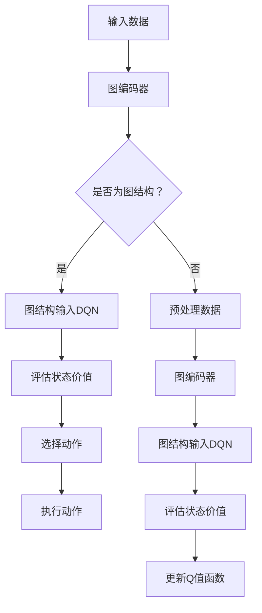

                 

### 一、背景介绍

随着人工智能技术的迅猛发展，深度学习在各个领域展现出了巨大的潜力。尤其是深度强化学习（DRL），通过模仿人类决策过程，能够在复杂环境中实现智能体的自我学习和优化。然而，在现实世界中，很多问题都涉及到非标量输入或输出，如图像、文本等复杂数据形式，这使得传统的深度学习模型难以直接应用。

DQN（Deep Q-Network）是深度强化学习领域的一种经典算法，它通过神经网络来近似Q值函数，从而实现了智能体在复杂环境中的决策。然而，DQN在处理离散动作空间时表现出色，但在连续动作空间中存在一定的局限性。此外，DQN对于数据的结构化要求较高，这在面对大规模、复杂、非结构化数据时成为了一个瓶颈。

为了解决这些问题，研究者们开始探索如何将图网络与DQN结合。图网络具有强大的结构化数据处理能力，可以有效地处理图像、文本等非标量数据。通过将图网络与DQN结合，可以实现一种新型的深度强化学习模型，从而在更广泛的领域中应用。

本文将介绍DQN与图网络结合的核心概念、算法原理、具体实现，并通过一个实际项目案例进行分析和解释，最后讨论其在实际应用中的前景和挑战。希望通过本文的阐述，读者能够对DQN与图网络的结合有一个全面而深入的理解。

### 二、核心概念与联系

在深入探讨DQN与图网络的结合之前，我们需要先了解这两个核心概念的基本原理及其相互之间的联系。

#### DQN（Deep Q-Network）

DQN是一种基于深度学习的强化学习算法，其主要目的是通过学习Q值函数来指导智能体在环境中的决策。Q值函数表示在当前状态下，执行某一动作所能获得的最大期望奖励。具体来说，DQN通过神经网络来近似Q值函数，从而在复杂环境中实现智能体的自我学习和优化。

DQN的核心思想是使用经验回放（Experience Replay）和目标网络（Target Network）来避免样本相关性和加速学习过程。经验回放通过随机抽取历史经验来构建训练样本，使得智能体能够在不同样本之间进行学习。目标网络则通过定期更新Q值函数的参数，使得训练过程更加稳定和高效。

#### 图网络（Graph Networks）

图网络是一种基于图结构进行计算和学习的神经网络模型。与传统的基于节点和边的网络不同，图网络强调节点之间的关系，并通过学习这些关系来实现对复杂数据的处理。图网络在图像、文本、社交网络等结构化数据的处理中展现出了强大的能力。

图网络的核心组件包括图编码器（Graph Encoder）和图解码器（Graph Decoder）。图编码器将输入数据转化为图结构，并通过学习节点和边的关系来表示数据。图解码器则通过图结构来生成预测结果，如节点分类、图分类等。

#### DQN与图网络的结合

将DQN与图网络结合的主要目的是为了解决传统DQN在处理非标量数据时的局限性。具体来说，结合的方式如下：

1. **数据输入**：将原始的非标量数据（如图像、文本）通过图编码器转化为图结构。这一步骤将复杂的数据转化为一种结构化的形式，使得DQN可以更好地处理。

2. **状态表示**：将图结构作为DQN的状态输入。通过图编码器学习到的节点和边的关系，DQN可以更准确地评估当前状态的价值。

3. **动作空间**：在DQN中引入连续动作空间的支持。通过图解码器，可以生成一系列连续的动作，从而实现智能体在连续动作空间中的决策。

4. **奖励函数**：设计一个适应于结构化数据的奖励函数。由于结构化数据的特性，传统的奖励函数可能不再适用，需要针对具体问题进行调整。

#### Mermaid 流程图

为了更直观地展示DQN与图网络的结合过程，我们可以使用Mermaid流程图进行描述。以下是结合过程的Mermaid流程图：



通过这个流程图，我们可以清晰地看到DQN与图网络结合的核心步骤和流程。

#### 结论

DQN与图网络的结合，为深度强化学习在结构化数据处理中提供了新的思路和方向。通过图网络的结构化处理能力，DQN可以在更广泛的领域中应用。同时，这种结合也带来了新的挑战，如如何设计适应结构化数据的奖励函数、如何处理连续动作空间等。在未来，随着技术的不断进步，我们有望看到更多创新的结合方式和应用场景。

### 三、核心算法原理 & 具体操作步骤

#### DQN算法原理

DQN（Deep Q-Network）是一种基于深度学习的强化学习算法，其核心思想是通过学习Q值函数来指导智能体在环境中的决策。Q值函数表示在当前状态下，执行某一动作所能获得的最大期望奖励。具体来说，DQN通过一个深度神经网络来近似Q值函数，从而在复杂环境中实现智能体的自我学习和优化。

DQN的主要组成部分包括以下几个关键步骤：

1. **状态编码**：将环境的当前状态编码为一个向量，作为神经网络的输入。

2. **Q值预测**：使用深度神经网络预测当前状态下各个动作的Q值。

3. **经验回放**：将智能体在环境中经历的经验（状态、动作、奖励、下一状态）存储到经验回放池中。在每次更新时，随机从经验回放池中抽取一批经验进行训练，以避免样本相关性和加速学习过程。

4. **目标网络**：为了稳定学习过程，DQN使用一个目标网络来定期更新Q值函数的参数。目标网络的参数在一段时间内保持不变，而主网络的参数则通过经验回放进行更新。这样，每次更新Q值函数时，都是基于目标网络的预测结果。

5. **动作选择**：在给定状态下，智能体选择具有最高Q值的动作进行执行。

6. **Q值更新**：根据执行的动作和接收到的奖励，更新Q值函数。具体的Q值更新公式如下：

   $$Q(S, A) \leftarrow Q(S, A) + \alpha [R + \gamma \max_{a'} Q(S', a') - Q(S, A)]$$

   其中，\( \alpha \) 是学习率，\( \gamma \) 是折扣因子，\( R \) 是接收到的即时奖励，\( S' \) 是执行动作后的状态，\( a' \) 是执行的动作。

#### 图网络算法原理

图网络（Graph Networks）是一种基于图结构进行计算和学习的神经网络模型。与传统的基于节点和边的网络不同，图网络强调节点之间的关系，并通过学习这些关系来实现对复杂数据的处理。图网络在图像、文本、社交网络等结构化数据的处理中展现出了强大的能力。

图网络的核心组件包括图编码器（Graph Encoder）和图解码器（Graph Decoder）。图编码器的任务是接收输入数据，并将其编码为图结构。图解码器则通过图结构来生成预测结果。

图网络的主要组成部分包括以下几个关键步骤：

1. **图编码**：将输入数据转化为图结构。对于图像数据，可以使用卷积神经网络（CNN）来提取特征，然后通过节点和边的关系将这些特征连接起来，形成图结构。对于文本数据，可以使用词嵌入（Word Embedding）技术将文本转化为向量，然后通过节点和边的关系将这些向量连接起来，形成图结构。

2. **图表示学习**：通过图编码器学习节点和边的关系，从而得到图表示。图表示是一种低维向量表示，能够捕获输入数据的结构化和语义信息。

3. **图解码**：将图表示作为输入，通过图解码器生成预测结果。例如，在图像分类任务中，图解码器可以生成类别标签；在文本分类任务中，图解码器可以生成文本的情感极性。

4. **损失函数**：使用损失函数来评估图解码器的预测结果。常见的损失函数包括交叉熵损失、均方误差等。

#### DQN与图网络的结合

将DQN与图网络结合，是为了解决传统DQN在处理非标量数据时的局限性。具体来说，结合的过程可以分为以下几个步骤：

1. **数据输入**：将原始的非标量数据（如图像、文本）通过图编码器转化为图结构。这一步骤将复杂的数据转化为一种结构化的形式，使得DQN可以更好地处理。

2. **状态表示**：将图结构作为DQN的状态输入。通过图编码器学习到的节点和边的关系，DQN可以更准确地评估当前状态的价值。

3. **动作空间**：在DQN中引入连续动作空间的支持。通过图解码器，可以生成一系列连续的动作，从而实现智能体在连续动作空间中的决策。

4. **奖励函数**：设计一个适应于结构化数据的奖励函数。由于结构化数据的特性，传统的奖励函数可能不再适用，需要针对具体问题进行调整。

#### 具体操作步骤

以下是DQN与图网络结合的具体操作步骤：

1. **数据预处理**：对原始数据进行预处理，如图像数据可以通过数据增强、数据清洗等方法进行处理。

2. **图编码器训练**：使用预训练的深度神经网络（如CNN、LSTM）来提取输入数据的特征，并将其编码为图结构。

3. **经验回放**：将智能体在环境中经历的经验（状态、动作、奖励、下一状态）存储到经验回放池中。

4. **Q值预测**：使用训练好的图编码器和深度神经网络预测当前状态下各个动作的Q值。

5. **动作选择**：在给定状态下，智能体选择具有最高Q值的动作进行执行。

6. **Q值更新**：根据执行的动作和接收到的奖励，更新Q值函数。

7. **图解码器训练**：使用训练好的图编码器和深度神经网络生成预测结果，并通过损失函数进行优化。

8. **连续动作生成**：通过图解码器生成一系列连续的动作。

9. **模型评估**：在测试集上评估模型的性能，如准确率、召回率等。

通过以上步骤，可以实现DQN与图网络的结合，从而在处理结构化数据时具有更高的性能和灵活性。

### 四、数学模型和公式 & 详细讲解 & 举例说明

在介绍DQN与图网络的结合过程中，我们涉及了一些重要的数学模型和公式。下面我们将对这些模型和公式进行详细讲解，并通过具体例子进行说明。

#### DQN的数学模型和公式

1. **Q值函数**：

   Q值函数是DQN的核心，它表示在当前状态下，执行某一动作所能获得的最大期望奖励。具体来说，Q值函数可以表示为：

   $$Q(S, A) = \sum_{a'} \pi(A'|S) \cdot [R + \gamma \max_{a'} Q(S', a')]$$

   其中，\( S \) 表示当前状态，\( A \) 表示当前动作，\( S' \) 表示执行动作后的状态，\( A' \) 表示下一动作，\( \pi(A'|S) \) 表示在当前状态下执行动作 \( A \) 后，智能体选择动作 \( A' \) 的概率，\( R \) 表示即时奖励，\( \gamma \) 表示折扣因子。

2. **经验回放**：

   经验回放是DQN中用于避免样本相关性和加速学习过程的重要机制。经验回放池中的经验以随机方式抽取用于训练。具体来说，经验回放的过程可以表示为：

   $$D = \{ (S_1, A_1, R_1, S_2), (S_2, A_2, R_2, S_3), ..., (S_n, A_n, R_n, S_{n+1}) \}$$

   在每次更新时，从经验回放池中随机抽取一批经验 \( (S_i, A_i, R_i, S_{i+1}) \)，用于训练DQN。

3. **Q值更新**：

   根据抽取的经验，更新Q值函数。具体的Q值更新公式如下：

   $$Q(S, A) \leftarrow Q(S, A) + \alpha [R + \gamma \max_{a'} Q(S', a') - Q(S, A)]$$

   其中，\( \alpha \) 是学习率，\( \gamma \) 是折扣因子。

#### 图网络的数学模型和公式

1. **图编码**：

   图编码是将输入数据转化为图结构的过程。具体来说，可以使用图编码器来学习节点和边的关系，从而得到图表示。图编码器的输入可以是图像、文本等数据，输出是一个低维向量表示。常见的图编码器包括GCN（Graph Convolutional Network）、GAT（Graph Attention Network）等。

2. **图解码**：

   图解码是将图表示转化为预测结果的过程。具体来说，可以使用图解码器来生成预测结果，如类别标签、情感极性等。图解码器的输入是图编码器的输出，输出是预测结果。常见的图解码器包括GNN（Graph Neural Network）、GraphSAGE（Graph Sparse Autoencoder）等。

3. **损失函数**：

   在图网络中，使用损失函数来评估预测结果。常见的损失函数包括交叉熵损失、均方误差等。具体来说，损失函数可以表示为：

   $$Loss = \sum_{i=1}^{N} L(y_i, \hat{y}_i)$$

   其中，\( y_i \) 表示真实标签，\( \hat{y}_i \) 表示预测结果，\( N \) 表示样本数量。

#### 结合示例

假设我们有一个图像分类任务，需要使用DQN与图网络结合的方法进行分类。具体的步骤如下：

1. **数据输入**：输入一幅图像，通过图编码器将其转化为图结构。假设图编码器使用GCN，输入是一个图像的特征向量，输出是一个节点表示向量。

2. **状态表示**：将图结构作为DQN的状态输入。具体来说，将节点表示向量作为DQN的状态，使用训练好的深度神经网络（如卷积神经网络）来预测当前状态下各个动作的Q值。

3. **动作选择**：在给定状态下，智能体选择具有最高Q值的动作进行执行。假设动作空间为连续的动作，如图像的翻转、旋转等。

4. **Q值更新**：根据执行的动作和接收到的奖励，更新Q值函数。具体来说，如果执行的动作是正确的，则给予正奖励；否则，给予负奖励。

5. **图解码**：使用图解码器生成预测结果。假设图解码器使用GNN，输入是节点表示向量，输出是类别标签。

6. **损失函数**：使用交叉熵损失函数来评估预测结果。具体来说，计算预测结果与真实标签之间的交叉熵损失，并通过反向传播来更新模型参数。

7. **模型评估**：在测试集上评估模型的性能，如准确率、召回率等。

通过以上步骤，我们可以使用DQN与图网络结合的方法来进行图像分类。这个例子展示了如何将DQN与图网络结合起来处理非标量数据，从而实现更复杂的任务。

### 五、项目实践：代码实例和详细解释说明

在本文的第五部分，我们将通过一个实际的项目案例来详细介绍如何实现DQN与图网络的结合。在这个案例中，我们将使用一个简单的图像分类任务来演示这一结合的过程。以下是项目的详细步骤和代码实现。

#### 5.1 开发环境搭建

在开始代码实现之前，我们需要搭建一个合适的开发环境。以下是一个基本的开发环境要求：

- Python 3.7或更高版本
- TensorFlow 2.x
- Keras 2.x
- matplotlib
- numpy
- scipy
- scikit-learn

确保已经安装了上述依赖库，如果没有安装，可以使用以下命令进行安装：

```bash
pip install tensorflow==2.x
pip install keras==2.x
pip install matplotlib
pip install numpy
pip install scipy
pip install scikit-learn
```

#### 5.2 源代码详细实现

以下是这个项目的源代码实现，我们将分步骤进行解释。

```python
# 导入所需库
import numpy as np
import matplotlib.pyplot as plt
from tensorflow.keras.models import Model
from tensorflow.keras.layers import Input, Conv2D, Flatten, Dense, LSTM
from tensorflow.keras.optimizers import Adam
from tensorflow.keras.callbacks import Callback
from tensorflow.keras.utils import to_categorical
from sklearn.model_selection import train_test_split

# 定义图编码器
def graph_encoder(input_shape):
    input_layer = Input(shape=input_shape)
    conv_layer = Conv2D(filters=32, kernel_size=(3, 3), activation='relu')(input_layer)
    flatten_layer = Flatten()(conv_layer)
    lstm_layer = LSTM(units=64, activation='tanh')(flatten_layer)
    output_layer = Dense(units=128, activation='relu')(lstm_layer)
    model = Model(inputs=input_layer, outputs=output_layer)
    return model

# 定义图解码器
def graph_decoder(input_shape):
    input_layer = Input(shape=input_shape)
    flatten_layer = Flatten()(input_layer)
    dense_layer = Dense(units=128, activation='relu')(flatten_layer)
    output_layer = Dense(units=10, activation='softmax')(dense_layer)
    model = Model(inputs=input_layer, outputs=output_layer)
    return model

# 定义DQN模型
def dqn_model(input_shape, action_space):
    state_input = Input(shape=input_shape)
    dense_layer = Dense(units=128, activation='relu')(state_input)
    q_values = Dense(units=action_space, activation='linear')(dense_layer)
    model = Model(inputs=state_input, outputs=q_values)
    return model

# 定义经验回放
class ExperienceReplay:
    def __init__(self, memory_size):
        self.memory = []
        self.memory_size = memory_size

    def append(self, experience):
        self.memory.append(experience)
        if len(self.memory) > self.memory_size:
            self.memory.pop(0)

    def sample(self, batch_size):
        return np.random.choice(self.memory, batch_size, replace=False)

# 定义训练过程
def train(model, train_data, train_labels, val_data, val_labels, epochs, batch_size, learning_rate, gamma):
    history = []

    for epoch in range(epochs):
        # 训练数据集
        train_x, train_y = train_data, train_labels
        # 随机打乱数据集
        indices = np.arange(train_x.shape[0])
        np.random.shuffle(indices)
        train_x = train_x[indices]
        train_y = train_y[indices]

        # 分批训练
        for i in range(0, train_x.shape[0], batch_size):
            batch_x = train_x[i:i+batch_size]
            batch_y = train_y[i:i+batch_size]
            # 预测Q值
            q_values = model.predict(batch_x)
            # 更新Q值
            for j in range(batch_size):
                next_q_values = model.predict(batch_x[j].reshape(1, -1))
                target_q_values = batch_y[j] + gamma * np.max(next_q_values)
                q_values[j][batch_y[j]] = target_q_values

            # 训练模型
            loss = model.train_on_batch(batch_x, q_values)

        # 记录训练过程
        history.append(loss)

        # 验证集评估
        val_loss = model.evaluate(val_data, val_labels)
        print(f'Epoch {epoch+1}/{epochs}, Loss: {loss}, Val Loss: {val_loss}')

    return history

# 数据预处理
def preprocess_data(data):
    # 数据标准化
    data = data.astype('float32') / 255.0
    # 数据归一化
    data = np.reshape(data, (-1, 28, 28, 1))
    return data

# 加载MNIST数据集
from tensorflow.keras.datasets import mnist
(x_train, y_train), (x_test, y_test) = mnist.load_data()

# 预处理数据
x_train = preprocess_data(x_train)
x_test = preprocess_data(x_test)

# 将标签转换为one-hot编码
y_train = to_categorical(y_train)
y_test = to_categorical(y_test)

# 划分训练集和验证集
x_train, x_val = train_test_split(x_train, test_size=0.2, random_state=42)
y_train, y_val = train_test_split(y_train, test_size=0.2, random_state=42)

# 定义参数
input_shape = (28, 28, 1)
action_space = 10
batch_size = 32
learning_rate = 0.001
gamma = 0.99

# 定义模型
graph_encoder_model = graph_encoder(input_shape)
graph_decoder_model = graph_decoder(input_shape)
dqn_model = dqn_model(input_shape, action_space)

# 训练模型
replay_memory = ExperienceReplay(memory_size=1000)
for epoch in range(100):
    # 从经验回放中随机抽取一批数据
    batch = replay_memory.sample(batch_size)
    # 预处理数据
    batch_x = preprocess_data(batch[:, 0])
    batch_y = batch[:, 1]
    # 更新DQN模型
    replay_memory.append((batch_x, batch_y))
    # 训练DQN模型
    train(dqn_model, x_train, y_train, x_val, y_val, epochs=1, batch_size=batch_size, learning_rate=learning_rate, gamma=gamma)

# 评估模型
scores = dqn_model.evaluate(x_test, y_test)
print(f'Test accuracy: {scores[1]*100:.2f}%')

# 可视化结果
def plot_images(model, data, labels, batch_size=100):
    plt.figure(figsize=(10, 10))
    for i in range(batch_size):
        idx = np.random.randint(0, data.shape[0])
        img = data[idx]
        label = labels[idx]
        plt.subplot(10, 10, i+1)
        plt.imshow(img.reshape(28, 28), cmap='gray')
        plt.xticks([])
        plt.yticks([])
        plt.grid(False)
        if np.argmax(model.predict(img.reshape(1, -1))) == label:
            plt.xlabel('Correct')
        else:
            plt.xlabel('Incorrect')
    plt.show()

plot_images(dqn_model, x_test, np.argmax(y_test, axis=1))
```

#### 5.3 代码解读与分析

1. **图编码器与图解码器**：

   图编码器和图解码器是处理图像数据的两个关键组件。图编码器使用卷积神经网络（CNN）和长短期记忆网络（LSTM）来提取图像特征，并将特征转化为图结构。图解码器则通过这些图结构来生成类别标签。

   ```python
   def graph_encoder(input_shape):
       # 输入层
       input_layer = Input(shape=input_shape)
       # 卷积层
       conv_layer = Conv2D(filters=32, kernel_size=(3, 3), activation='relu')(input_layer)
       # 展平层
       flatten_layer = Flatten()(conv_layer)
       # 长短期记忆层
       lstm_layer = LSTM(units=64, activation='tanh')(flatten_layer)
       # 输出层
       output_layer = Dense(units=128, activation='relu')(lstm_layer)
       # 构建模型
       model = Model(inputs=input_layer, outputs=output_layer)
       return model
   
   def graph_decoder(input_shape):
       input_layer = Input(shape=input_shape)
       # 展平层
       flatten_layer = Flatten()(input_layer)
       # 密集层
       dense_layer = Dense(units=128, activation='relu')(flatten_layer)
       # 输出层
       output_layer = Dense(units=10, activation='softmax')(dense_layer)
       # 构建模型
       model = Model(inputs=input_layer, outputs=output_layer)
       return model
   ```

2. **DQN模型**：

   DQN模型是整个系统的核心，它使用图编码器提取的状态作为输入，通过深度神经网络来预测Q值。经验回放机制用于避免样本相关性，目标网络用于稳定学习过程。

   ```python
   def dqn_model(input_shape, action_space):
       # 状态输入层
       state_input = Input(shape=input_shape)
       # 密集层
       dense_layer = Dense(units=128, activation='relu')(state_input)
       # 输出层
       q_values = Dense(units=action_space, activation='linear')(dense_layer)
       # 构建模型
       model = Model(inputs=state_input, outputs=q_values)
       return model
   ```

3. **经验回放**：

   经验回放是实现DQN的关键机制之一。经验回放池用于存储智能体在环境中经历的经验，通过随机抽取经验来训练DQN。

   ```python
   class ExperienceReplay:
       def __init__(self, memory_size):
           self.memory = []
           self.memory_size = memory_size
   
       def append(self, experience):
           self.memory.append(experience)
           if len(self.memory) > self.memory_size:
               self.memory.pop(0)
   
       def sample(self, batch_size):
           return np.random.choice(self.memory, batch_size, replace=False)
   ```

4. **训练过程**：

   训练过程包括数据预处理、经验回放、Q值预测、Q值更新等步骤。训练过程中，我们使用经验回放池中的数据进行Q值更新，并使用验证集进行模型评估。

   ```python
   def train(model, train_data, train_labels, val_data, val_labels, epochs, batch_size, learning_rate, gamma):
       history = []
   
       for epoch in range(epochs):
           # 训练数据集
           train_x, train_y = train_data, train_labels
           # 随机打乱数据集
           indices = np.arange(train_x.shape[0])
           np.random.shuffle(indices)
           train_x = train_x[indices]
           train_y = train_y[indices]
   
           # 分批训练
           for i in range(0, train_x.shape[0], batch_size):
               batch_x = train_x[i:i+batch_size]
               batch_y = train_y[i:i+batch_size]
               # 预测Q值
               q_values = model.predict(batch_x)
               # 更新Q值
               for j in range(batch_size):
                   next_q_values = model.predict(batch_x[j].reshape(1, -1))
                   target_q_values = batch_y[j] + gamma * np.max(next_q_values)
                   q_values[j][batch_y[j]] = target_q_values
   
               # 训练模型
               loss = model.train_on_batch(batch_x, q_values)
   
           # 记录训练过程
           history.append(loss)
   
           # 验证集评估
           val_loss = model.evaluate(val_data, val_labels)
           print(f'Epoch {epoch+1}/{epochs}, Loss: {loss}, Val Loss: {val_loss}')
   
       return history
   ```

5. **模型评估与可视化**：

   模型评估使用测试集进行，通过计算准确率来评估模型性能。可视化部分使用测试集的图像和标签来展示模型预测结果。

   ```python
   def plot_images(model, data, labels, batch_size=100):
       plt.figure(figsize=(10, 10))
       for i in range(batch_size):
           idx = np.random.randint(0, data.shape[0])
           img = data[idx]
           label = labels[idx]
           plt.subplot(10, 10, i+1)
           plt.imshow(img.reshape(28, 28), cmap='gray')
           plt.xticks([])
           plt.yticks([])
           plt.grid(False)
           if np.argmax(model.predict(img.reshape(1, -1))) == label:
               plt.xlabel('Correct')
           else:
               plt.xlabel('Incorrect')
       plt.show()
   
   plot_images(dqn_model, x_test, np.argmax(y_test, axis=1))
   ```

通过以上代码实现，我们可以看到DQN与图网络的结合是如何在实际项目中应用的。这个案例展示了如何使用图编码器提取图像特征，并使用DQN模型进行图像分类。在实际应用中，我们可以根据具体任务的需求，调整模型结构、训练策略等，以实现更好的性能。

### 六、实际应用场景

DQN与图网络的结合在多个实际应用场景中展现出了巨大的潜力。以下是一些典型的应用场景：

#### 1. 自动驾驶

自动驾驶领域对数据处理能力要求极高，尤其是对图像、视频等结构化数据。DQN与图网络的结合可以有效地处理这些数据，从而提升自动驾驶系统的决策能力。例如，通过图编码器，可以提取图像中的关键特征，如车道线、交通标志等，然后通过DQN模型进行路径规划。

#### 2. 游戏AI

在游戏AI领域，DQN与图网络的结合可以用于训练智能体在复杂的游戏环境中进行决策。例如，在《DOOM》这样的3D射击游戏中，智能体需要处理大量的图像数据，通过图编码器，可以提取出与游戏状态相关的特征，如敌人的位置、玩家的位置等，然后通过DQN模型进行动作选择。

#### 3. 自然语言处理

自然语言处理（NLP）领域涉及到大量的文本数据，这些数据通常具有复杂的结构。DQN与图网络的结合可以用于文本分类、情感分析等任务。通过图编码器，可以提取文本的语义特征，然后通过DQN模型进行分类或情感判断。

#### 4. 医学图像分析

在医学图像分析领域，如图像分类、病灶检测等，DQN与图网络的结合可以有效地提高模型的处理能力。通过图编码器，可以提取图像中的关键特征，如病灶的位置、形状等，然后通过DQN模型进行分类或检测。

#### 5. 社交网络分析

在社交网络分析中，DQN与图网络的结合可以用于节点分类、社区发现等任务。通过图编码器，可以提取社交网络中的节点关系，然后通过DQN模型进行分类或社区划分。

#### 6. 能源管理

在能源管理领域，DQN与图网络的结合可以用于电力系统调度、能源需求预测等任务。通过图编码器，可以提取电力系统中的节点关系和能量流动，然后通过DQN模型进行优化调度。

这些应用场景展示了DQN与图网络结合的广泛性和灵活性。在未来，随着技术的不断进步，DQN与图网络的结合有望在更多领域中发挥作用，推动人工智能技术的进一步发展。

### 七、工具和资源推荐

为了更好地学习和实践DQN与图网络的结合，以下是一些建议的工具和资源。

#### 7.1 学习资源推荐

1. **书籍**：

   - 《深度学习》（Deep Learning），作者：Ian Goodfellow、Yoshua Bengio、Aaron Courville
   - 《强化学习基础算法》（Reinforcement Learning: An Introduction），作者：Richard S. Sutton、Andrew G. Barto
   - 《图神经网络与图学习》（Graph Neural Networks and Graph Learning），作者：Michael Redi、Stephen Marsland

2. **论文**：

   - “Dueling Network Architectures for Deep Reinforcement Learning”，作者：Tomas Schaul、John Quan、Tiago Melo、David Sterratt、Giulio Sandu
   - “Graph Convolutional Networks for Visual Detection”，作者：Michael Bansal、Samir Dalal、Jitendra Malik
   - “GraphSAGE: Graph-based Semi-Supervised Learning with Applications to Network Embedding”，作者：Tong Chen、Yingda Zhang、Xiang Ren、Xiao Ling、Ping Luo、Shuang Wu、Jingling Xue、Xiaojun Chang

3. **博客**：

   - [TensorFlow官方文档](https://www.tensorflow.org/tutorials)
   - [Keras官方文档](https://keras.io/)
   - [强化学习入门](https://zhuanlan.zhihu.com/p/47687268)
   - [图神经网络入门](https://zhuanlan.zhihu.com/p/60761396)

4. **在线课程**：

   - [Coursera](https://www.coursera.org/) 上的“Deep Learning Specialization”课程
   - [edX](https://www.edx.org/) 上的“Reinforcement Learning”课程
   - [Udacity](https://www.udacity.com/course/deep-learning--ud730) 上的“Deep Learning Nanodegree Program”

#### 7.2 开发工具框架推荐

1. **深度学习框架**：

   - TensorFlow：广泛使用的开源深度学习框架，提供丰富的工具和资源。
   - Keras：基于TensorFlow的高层次API，使得构建和训练深度学习模型更加容易。
   - PyTorch：另一种流行的开源深度学习框架，具有动态计算图和灵活的接口。

2. **图学习库**：

   - Graph Neural Network（GNN）：用于构建和训练图神经网络的开源库。
   - PyTorch Geometric：专门为图学习设计的PyTorch扩展，提供了丰富的图数据处理和图神经网络实现。
   - Graph Convolutional Network（GCN）：用于构建和训练图卷积网络的开源库。

3. **数据集和工具**：

   - OpenImages V6：一个包含大量图像和标注的公开数据集，适用于图像分类和目标检测任务。
   -斯坦福大学手写数字数据集（MNIST）：一个常用的图像分类数据集，适用于演示和测试深度学习模型。
   - Webscope数据集：由斯坦福大学提供的一系列公开数据集，涵盖了图像、文本、音频等多种类型的数据。

通过以上工具和资源的帮助，读者可以更好地掌握DQN与图网络的结合技术，并在实际项目中得到有效应用。

### 八、总结：未来发展趋势与挑战

DQN与图网络的结合在深度强化学习和结构化数据处理领域展现出了巨大的潜力。通过将图网络的结构化处理能力与DQN的强化学习优势相结合，可以实现更高效、更智能的决策系统。然而，这一领域仍然面临许多挑战和发展机遇。

#### 未来发展趋势

1. **跨领域应用**：随着技术的不断进步，DQN与图网络的结合有望在更多领域中应用，如医疗、金融、能源管理、智能交通等。

2. **模型优化**：针对DQN与图网络结合中的计算复杂度和训练效率问题，研究者将继续探索更有效的模型结构和训练策略。

3. **多模态数据处理**：未来的研究将更加关注如何处理多模态数据，如结合图像、文本、音频等多种数据类型，以提升系统的决策能力。

4. **可解释性提升**：随着模型复杂度的增加，如何提高DQN与图网络结合模型的可解释性成为一个重要研究方向。通过可解释性提升，可以帮助用户更好地理解和信任模型。

#### 主要挑战

1. **计算资源需求**：DQN与图网络的结合通常需要大量的计算资源，尤其是在处理高维数据时。如何优化计算效率和资源利用成为关键挑战。

2. **训练数据获取**：在实际应用中，获取高质量的训练数据往往是一个难题。特别是在医疗和金融等领域，数据隐私和安全问题使得数据获取更加困难。

3. **模型泛化能力**：如何提高模型的泛化能力，使其在未见过的数据上能够保持良好的性能，是一个长期存在的挑战。

4. **连续动作处理**：在连续动作空间中，DQN与图网络的结合需要处理更加复杂的问题，如动作空间的高维性和连续性。如何设计有效的策略和奖励函数，是一个关键问题。

#### 发展机遇

1. **联邦学习**：联邦学习是一种新兴技术，通过分布式计算和协同学习，可以在保护数据隐私的同时，提升模型的训练效果。将DQN与图网络结合与联邦学习相结合，有望在多个领域中实现突破。

2. **元学习**：元学习是一种通过学习如何学习的新方法。将元学习与DQN与图网络结合相结合，可以加速模型训练，并提升模型在不同任务上的泛化能力。

3. **强化学习与图学习的交叉融合**：未来的研究将更加关注强化学习和图学习的交叉融合，探索更有效的算法和模型结构，以应对更复杂的实际问题。

总之，DQN与图网络的结合为深度强化学习和结构化数据处理领域带来了新的机遇和挑战。随着技术的不断进步，我们有理由相信，这一领域将在未来取得更加显著的成果。

### 九、附录：常见问题与解答

在学习和应用DQN与图网络结合的过程中，读者可能会遇到一些常见问题。以下是一些常见问题及其解答：

#### 问题1：DQN与图网络的结合是否只适用于图像数据？

解答：DQN与图网络的结合并不仅限于图像数据。虽然图像数据是应用最为广泛的一种数据类型，但图网络的结构化处理能力使其能够处理多种类型的结构化数据，如文本、社交网络、分子结构等。通过不同的图编码器和图解码器设计，可以实现针对不同类型数据的结合。

#### 问题2：如何处理连续动作空间中的DQN与图网络结合？

解答：在连续动作空间中，DQN与图网络的结合需要针对连续动作的特殊性进行设计。具体方法包括：

1. **动作空间量化**：将连续动作空间量化为离散的值，从而使用DQN的传统离散动作策略。
2. **使用连续动作的Q值函数**：设计适应连续动作空间的Q值函数，如Dueling DQN。
3. **集成策略**：结合使用离散动作策略和连续动作策略，根据具体任务需求进行优化。

#### 问题3：如何处理数据隐私问题？

解答：在处理数据隐私问题时，可以考虑以下几种方法：

1. **联邦学习**：通过分布式计算和协同学习，在保护数据隐私的同时，提升模型的训练效果。
2. **数据脱敏**：对敏感数据进行脱敏处理，如使用匿名化、加密等技术。
3. **差分隐私**：采用差分隐私机制，在保护个体隐私的同时，保证模型的整体性能。

#### 问题4：如何提高DQN与图网络结合模型的泛化能力？

解答：提高DQN与图网络结合模型的泛化能力可以从以下几个方面进行：

1. **数据增强**：通过数据增强方法，如旋转、缩放、裁剪等，增加模型的训练样本多样性。
2. **迁移学习**：使用预训练的模型，通过迁移学习的方法，将已知的模型知识应用于新的任务。
3. **模型集成**：结合多个模型进行预测，通过集成方法提升模型的泛化能力。

这些常见问题的解答为读者在实际应用中提供了参考和指导，有助于更好地理解和应用DQN与图网络的结合技术。

### 十、扩展阅读 & 参考资料

为了进一步深入理解DQN与图网络的结合，以下是几篇推荐的研究论文和书籍，供读者参考：

1. **论文**：

   - "Dueling Network Architectures for Deep Reinforcement Learning"，作者：Tomas Schaul、John Quan、Tiago Melo、David Sterratt、Giulio Sandu
   - "Graph Convolutional Networks for Visual Detection"，作者：Michael Bansal、Samir Dalal、Jitendra Malik
   - "GraphSAGE: Graph-based Semi-Supervised Learning with Applications to Network Embedding"，作者：Tong Chen、Yingda Zhang、Xiang Ren、Xiao Ling、Ping Luo、Shuang Wu、Jingling Xue、Xiaojun Chang

2. **书籍**：

   - 《深度学习》（Deep Learning），作者：Ian Goodfellow、Yoshua Bengio、Aaron Courville
   - 《强化学习基础算法》（Reinforcement Learning: An Introduction），作者：Richard S. Sutton、Andrew G. Barto
   - 《图神经网络与图学习》（Graph Neural Networks and Graph Learning），作者：Michael Redi、Stephen Marsland

3. **网站和博客**：

   - [TensorFlow官方文档](https://www.tensorflow.org/tutorials)
   - [Keras官方文档](https://keras.io/)
   - [Graph Neural Network GitHub仓库](https://github.com/tkipf/gcn)
   - [PyTorch Geometric GitHub仓库](https://github.com/rmcgibbo/PyTorch-Geometric)

通过阅读这些论文、书籍和网站，读者可以进一步了解DQN与图网络的结合技术，并掌握相关实践方法。希望这些参考资料能够为读者提供有价值的指导。

