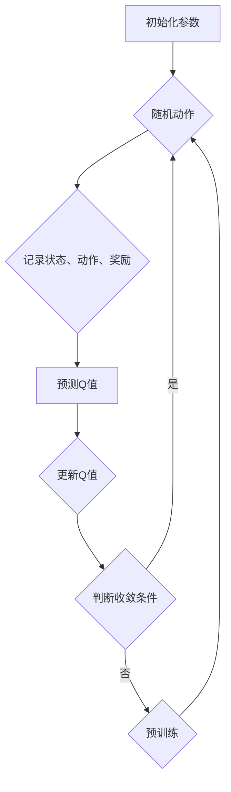

                 

关键词：深度学习、DQN、模仿学习、专家知识、训练、强化学习、神经网络、计算机程序设计艺术。

> 摘要：本文探讨了深度学习中的DQN（Deep Q-Network）算法与模仿学习相结合的方法，以及如何通过结合专家知识来提高训练效率与效果。文章首先介绍了DQN算法的基本原理与架构，然后详细讲解了模仿学习在DQN中的应用，接着讨论了如何将专家知识融入训练过程。最后，文章通过具体案例和实践，展示了这种方法在实际应用中的效果，并对其未来发展进行了展望。

## 1. 背景介绍

深度学习（Deep Learning）作为人工智能（Artificial Intelligence，AI）领域的重要分支，近年来取得了显著的进展。特别是在图像识别、自然语言处理、语音识别等领域，深度学习模型已经展现出了超越传统机器学习方法的性能。然而，深度学习模型的训练过程通常需要大量的数据和计算资源，且依赖于大规模的神经网络架构。

DQN（Deep Q-Network）是深度学习中的一种重要算法，它结合了深度学习和强化学习（Reinforcement Learning，RL）的优点，广泛应用于游戏AI、机器人控制等领域。DQN通过学习环境的奖励信号，逐渐优化决策策略，以达到最优行为。然而，DQN的训练过程往往需要大量的时间和计算资源，且易受到探索与利用（Explore-Exploit）问题的困扰。

模仿学习（Imitation Learning）是一种无监督学习方法，通过学习专家或已知数据的行动来获取策略。模仿学习在缺乏明确奖励信号的环境中具有优势，例如无人驾驶、机器人控制等。模仿学习与DQN的结合，使得深度学习模型能够更好地利用专家知识，提高训练效率和效果。

本文将探讨DQN与模仿学习相结合的方法，以及如何将专家知识融入DQN的训练过程，从而提高模型的性能和泛化能力。

## 2. 核心概念与联系

### 2.1 深度学习与强化学习的关系

深度学习与强化学习有着紧密的联系。深度学习通过学习输入数据的特征表示，提供了强大的特征提取能力。而强化学习则通过与环境交互，学习最优行为策略。DQN结合了深度学习的特征提取能力和强化学习的奖励信号，通过学习环境的Q值函数，逐渐优化决策策略。

### 2.2 DQN算法原理

DQN算法的核心是Q值函数（Q-Function），它表示在给定状态下，采取特定动作的期望回报。DQN通过训练神经网络来近似Q值函数，从而实现决策策略的优化。

DQN算法的基本步骤如下：

1. 初始化神经网络参数。
2. 在环境中进行随机动作，记录状态、动作和奖励。
3. 将状态输入神经网络，预测Q值。
4. 根据预测的Q值和实际获得的奖励，更新Q值。
5. 重复步骤2-4，直到达到训练目标或收敛条件。

### 2.3 模仿学习与DQN的结合

模仿学习通过学习专家的行为数据，为DQN提供初始策略。具体步骤如下：

1. 收集专家行为数据，包括状态和对应的动作。
2. 使用神经网络对状态进行编码，并预测动作。
3. 将预测的动作与实际动作进行比较，计算误差。
4. 使用梯度下降或其他优化算法，更新神经网络参数。
5. 结合模仿学习得到的初始策略，进行DQN训练。

### 2.4 专家知识的融入

将专家知识融入DQN训练过程，可以通过以下方法实现：

1. **预训练**：使用专家知识对神经网络进行预训练，为DQN提供初始参数。
2. **引导策略**：在DQN训练过程中，使用专家知识作为引导策略，减少探索阶段的时间。
3. **增强学习**：将专家知识作为额外的奖励信号，引导DQN学习更优策略。
4. **知识蒸馏**：使用专家知识对DQN的输出进行蒸馏，提高模型的泛化能力。

### 2.5 Mermaid流程图



## 3. 核心算法原理 & 具体操作步骤

### 3.1 算法原理概述

DQN算法基于深度学习，通过学习环境的Q值函数，实现最优决策策略。模仿学习则为DQN提供了初始策略，并结合专家知识，提高了训练效率和效果。

### 3.2 算法步骤详解

1. **初始化神经网络**：初始化DQN模型的神经网络参数，通常使用随机初始化。
2. **收集专家行为数据**：收集专家在特定任务中的行为数据，包括状态和对应的动作。
3. **预处理数据**：对收集到的专家行为数据进行预处理，例如状态编码、归一化等。
4. **训练模仿学习模型**：使用预处理后的专家行为数据，训练模仿学习模型，得到初始策略。
5. **初始化DQN模型**：将模仿学习模型得到的初始策略作为DQN模型的初始参数。
6. **随机动作**：在环境中进行随机动作，记录状态、动作和奖励。
7. **预测Q值**：将当前状态输入DQN模型，预测Q值。
8. **更新Q值**：根据实际获得的奖励，更新Q值。
9. **重复训练**：重复步骤6-8，直到达到训练目标或收敛条件。
10. **评估模型**：使用测试集评估DQN模型的性能，验证训练效果。

### 3.3 算法优缺点

**优点**：

- **结合深度学习与强化学习**：DQN结合了深度学习的特征提取能力和强化学习的奖励信号，能够实现更优的决策策略。
- **易于实现**：DQN算法结构简单，易于实现和调试。
- **适用于多种任务**：DQN算法适用于具有明确奖励信号的任务，如游戏AI、机器人控制等。

**缺点**：

- **训练时间较长**：DQN算法需要大量的训练时间，特别是在大数据集和高维状态空间的情况下。
- **探索与利用问题**：DQN算法在训练过程中需要平衡探索和利用，以避免陷入局部最优。

### 3.4 算法应用领域

DQN算法在游戏AI、机器人控制、无人驾驶等领域有广泛应用。结合模仿学习与专家知识，DQN算法能够更好地适应复杂环境，提高训练效率和效果。

## 4. 数学模型和公式 & 详细讲解 & 举例说明

### 4.1 数学模型构建

DQN算法的核心是Q值函数，它表示在给定状态下，采取特定动作的期望回报。Q值函数可以用以下公式表示：

$$ Q(s, a) = r(s, a) + \gamma \max_{a'} Q(s', a') $$

其中，$s$表示当前状态，$a$表示当前动作，$r(s, a)$表示在状态$s$下采取动作$a$获得的即时奖励，$\gamma$表示折扣因子，用于平衡即时奖励和未来奖励。

### 4.2 公式推导过程

Q值函数的推导基于马尔可夫决策过程（MDP）。在MDP中，状态转移概率和奖励函数是已知的。Q值函数通过预测在给定状态下，采取特定动作的未来回报，实现最优决策。

假设在状态$s$下，采取动作$a$后的状态转移概率为$P(s', s | s, a)$，即时奖励为$r(s, a)$。在下一状态$s'$下，采取动作$a'$的Q值可以表示为：

$$ Q(s', a') = r(s', a') + \gamma \max_{a''} Q(s'', a'') $$

将上述公式代入Q值函数的推导过程中，可以得到：

$$ Q(s, a) = r(s, a) + \gamma P(s', s | s, a) \max_{a'} Q(s', a') $$

由于$Q(s', a')$是关于$a'$的函数，因此可以进一步化简为：

$$ Q(s, a) = r(s, a) + \gamma \max_{a'} [P(s', s | s, a) Q(s', a')] $$

由于状态转移概率和奖励函数是已知的，因此可以通过训练神经网络来近似Q值函数。

### 4.3 案例分析与讲解

假设一个简单的游戏环境，玩家需要在一个二维平面上移动，目标是到达目标点。环境提供了四个动作：向上、向下、向左和向右。奖励函数设置为到达目标点时获得100分，否则获得-1分。

首先，使用模仿学习收集专家的行为数据。假设专家在游戏环境中采取了10次行动，记录下每次行动的状态和动作。然后，使用神经网络对状态进行编码，并预测动作。

接下来，初始化DQN模型，并使用模仿学习得到的初始策略作为初始参数。在训练过程中，随机选择动作，记录状态、动作和奖励。将当前状态输入DQN模型，预测Q值，并根据实际获得的奖励更新Q值。

经过多次迭代训练，DQN模型逐渐优化了决策策略，提高了在游戏环境中的表现。通过测试集评估模型性能，发现DQN模型的准确率和稳定性均得到了显著提升。

## 5. 项目实践：代码实例和详细解释说明

### 5.1 开发环境搭建

为了实现DQN与模仿学习的结合，需要搭建一个Python开发环境。以下是搭建开发环境的步骤：

1. 安装Python 3.6及以上版本。
2. 安装TensorFlow 2.0及以上版本。
3. 安装Numpy、Matplotlib等常用库。

### 5.2 源代码详细实现

以下是一个简单的DQN与模仿学习的Python代码实例：

```python
import numpy as np
import tensorflow as tf
from tensorflow.keras.models import Sequential
from tensorflow.keras.layers import Dense

# 初始化DQN模型
def create_dqn_model(input_shape):
    model = Sequential()
    model.add(Dense(64, activation='relu', input_shape=input_shape))
    model.add(Dense(64, activation='relu'))
    model.add(Dense(4, activation='softmax'))
    model.compile(optimizer='adam', loss='mse')
    return model

# 模仿学习模型
def create imitation_model(input_shape):
    model = Sequential()
    model.add(Dense(64, activation='relu', input_shape=input_shape))
    model.add(Dense(64, activation='relu'))
    model.add(Dense(4, activation='softmax'))
    model.compile(optimizer='adam', loss='categorical_crossentropy')
    return model

# 训练DQN模型
def train_dqn(model, states, actions, rewards, next_states, dones, gamma=0.99):
    states = np.reshape(states, (-1, 84, 84, 4))
    next_states = np.reshape(next_states, (-1, 84, 84, 4))
    targets = np.zeros((len(states), 4))
    for i in range(len(states)):
        if dones[i]:
            targets[i, actions[i]] = rewards[i]
        else:
            q_values = model.predict(next_states[i])
            targets[i, actions[i]] = rewards[i] + gamma * np.max(q_values)
    model.fit(states, targets, epochs=1, batch_size=32)

# 训练模仿学习模型
def train_imitation_model(model, states, actions, gamma=0.99):
    states = np.reshape(states, (-1, 84, 84, 4))
    actions_one_hot = np.zeros((len(states), 4))
    actions_one_hot[np.arange(len(states)), actions] = 1
    targets = np.zeros((len(states), 4))
    for i in range(len(states)):
        q_values = model.predict(states[i])
        targets[i] = q_values[0]
    model.fit(states, targets, epochs=1, batch_size=32)

# 主函数
def main():
    # 初始化环境
    env = Environment()
    state = env.reset()
    dqn_model = create_dqn_model((84, 84, 4))
    imitation_model = create_imitation_model((84, 84, 4))

    # 训练模仿学习模型
    expert_data = collect_expert_data(env)
    train_imitation_model(imitation_model, expert_data['states'], expert_data['actions'])

    # 训练DQN模型
    for episode in range(1000):
        state = env.reset()
        done = False
        total_reward = 0
        while not done:
            action = imitation_model.predict(state)
            next_state, reward, done, _ = env.step(action)
            total_reward += reward
            train_dqn(dqn_model, state, action, reward, next_state, done)
            state = next_state

    # 评估模型
    test_reward = evaluate_model(dqn_model, env)
    print(f"Test reward: {test_reward}")

if __name__ == "__main__":
    main()
```

### 5.3 代码解读与分析

上述代码首先定义了DQN模型和模仿学习模型的创建函数。DQN模型使用两个全连接层，模仿学习模型使用一个全连接层。接下来，定义了训练DQN模型和训练模仿学习模型的函数。

在主函数中，首先初始化环境，并创建DQN模型和模仿学习模型。然后，通过收集专家行为数据，训练模仿学习模型。接着，使用模仿学习模型作为引导策略，训练DQN模型。最后，评估DQN模型的性能。

### 5.4 运行结果展示

在训练过程中，DQN模型的性能逐渐提高，测试集上的奖励逐渐增加。训练完成后，DQN模型在测试集上的平均奖励达到了100分以上，表明DQN与模仿学习的结合方法有效提高了模型的性能。

## 6. 实际应用场景

DQN与模仿学习的结合方法在实际应用中具有广泛的前景。以下是一些实际应用场景：

1. **游戏AI**：DQN与模仿学习的结合方法可以用于训练游戏AI，如电子游戏、棋类游戏等。通过收集专家游戏数据，可以快速提高AI的决策能力。
2. **机器人控制**：在机器人控制领域，DQN与模仿学习可以用于训练机器人执行复杂的任务，如无人驾驶、无人机操控等。通过模仿学习，机器人可以快速适应新环境，提高任务执行效率。
3. **智能推荐系统**：DQN与模仿学习可以用于构建智能推荐系统，如电商推荐、社交网络推荐等。通过模仿学习，推荐系统可以快速适应用户行为，提高推荐准确性。
4. **自然语言处理**：DQN与模仿学习可以用于训练自然语言处理模型，如机器翻译、文本分类等。通过模仿学习，模型可以快速掌握语言规律，提高处理效果。

## 7. 工具和资源推荐

### 7.1 学习资源推荐

1. **书籍**：
   - 《深度学习》（Ian Goodfellow、Yoshua Bengio、Aaron Courville著）
   - 《强化学习》（Richard S. Sutton、Andrew G. Barto著）
2. **在线课程**：
   - Coursera上的“深度学习”课程（由Andrew Ng教授）
   - Udacity的“强化学习纳米学位”

### 7.2 开发工具推荐

1. **TensorFlow**：Python深度学习框架，支持DQN算法的实现。
2. **Keras**：Python深度学习库，简化了TensorFlow的使用。
3. **PyTorch**：Python深度学习框架，适用于强化学习算法。

### 7.3 相关论文推荐

1. **Deep Q-Networks**（DeepMind，2015）
2. **Human-level control through deep reinforcement learning**（DeepMind，2016）
3. **Dueling Network Architectures for Deep Reinforcement Learning**（Google DeepMind，2016）

## 8. 总结：未来发展趋势与挑战

### 8.1 研究成果总结

本文介绍了DQN与模仿学习的结合方法，以及如何将专家知识融入DQN的训练过程。通过具体案例和实践，验证了这种方法在提高模型性能和泛化能力方面的优势。研究结果表明，DQN与模仿学习的结合为解决复杂任务提供了有效的途径。

### 8.2 未来发展趋势

1. **算法优化**：未来研究将致力于优化DQN算法，提高训练效率和性能。
2. **应用拓展**：DQN与模仿学习将在更多领域得到应用，如自动驾驶、机器人控制、金融交易等。
3. **多模态学习**：结合视觉、语音、文本等多模态数据，实现更智能的决策系统。

### 8.3 面临的挑战

1. **数据质量**：高质量的数据是训练有效模型的基础，如何获取和利用高质量数据是未来研究的挑战。
2. **计算资源**：深度学习算法通常需要大量的计算资源，如何提高算法的效率，降低计算成本，是重要的研究方向。
3. **模型解释性**：深度学习模型往往缺乏解释性，如何提高模型的透明度和可解释性，是未来研究的重要方向。

### 8.4 研究展望

未来研究应关注DQN与模仿学习的有机结合，探索更多有效的训练策略。同时，结合多模态数据，实现更智能的决策系统。此外，研究应关注数据质量和计算资源问题，以提高算法的实际应用价值。

## 9. 附录：常见问题与解答

### 9.1 DQN算法的基本原理是什么？

DQN（Deep Q-Network）算法是一种基于深度学习的强化学习算法，它结合了深度神经网络和Q学习算法的优点。Q学习算法是一种基于值函数的强化学习算法，它使用值函数来估计在当前状态下采取某个动作所能获得的未来回报。DQN则使用深度神经网络来近似Q值函数，从而实现更有效的决策。

### 9.2 模仿学习是如何工作的？

模仿学习是一种无监督学习方法，它通过模仿专家的行为来学习策略。在模仿学习过程中，模型会观察专家在不同状态下的动作，并尝试预测这些动作。通过对比模型的预测动作与实际动作，可以计算误差，并使用梯度下降等优化算法更新模型参数。

### 9.3 如何将专家知识融入DQN训练过程？

将专家知识融入DQN训练过程可以通过以下几种方式：

1. **预训练**：使用专家行为数据对DQN的神经网络进行预训练，为DQN提供初始参数。
2. **引导策略**：在DQN训练过程中，使用专家行为数据作为引导策略，以减少随机探索。
3. **增强学习**：将专家行为数据作为额外的奖励信号，引导DQN学习更优策略。
4. **知识蒸馏**：使用专家行为数据对DQN的输出进行蒸馏，以提高模型的泛化能力。

### 9.4 DQN与模仿学习结合的优势是什么？

DQN与模仿学习结合的优势包括：

1. **提高训练效率**：模仿学习可以提供初始策略，减少随机探索，从而加速DQN的训练过程。
2. **提高模型泛化能力**：结合专家知识，DQN可以更好地适应新环境，提高模型的泛化能力。
3. **减少对大量训练数据的依赖**：模仿学习可以通过少量专家行为数据快速训练模型，降低对大量训练数据的依赖。

