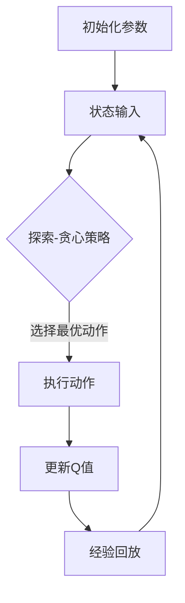

                 

### 一、背景介绍

在当前金融市场中，股票交易作为一项重要的投资方式，吸引了大量的投资者和金融机构。随着市场信息的复杂性和动态性不断增加，传统的股票交易策略逐渐显现出其局限性，无法应对快速变化的市场环境。为了提高股票交易的成功率和收益率，研究者们开始将目光投向人工智能和机器学习领域，希望能够通过数据驱动的方法找到更为有效的交易策略。

深度强化学习（Deep Reinforcement Learning，DRL）作为机器学习的一个分支，近年来在游戏、自然语言处理、图像识别等领域取得了显著的成果。DRL通过模仿人类学习过程，通过不断试错来学习优化策略，使其在处理复杂、动态环境中表现出了强大的适应能力和学习能力。这种特性使得DRL在股票交易策略研究中受到了广泛关注。

DQN（Deep Q-Network）是深度强化学习的一种重要模型，它通过神经网络来近似Q值函数，以实现智能体的决策。与传统Q-Learning算法相比，DQN引入了神经网络，使得它能够处理高维输入状态，这在股票交易这种高度复杂的环境中尤为重要。因此，DQN模型在股票交易中的应用具有巨大的潜力。

本文将围绕DQN在股市交易中的应用展开讨论，首先介绍DQN的基本原理和算法框架，然后详细解析其数学模型和公式，接着通过一个实际项目案例来展示如何使用DQN进行股市交易策略的实现，并对其代码进行解读和分析。最后，我们将探讨DQN在股市交易中的实际应用场景，总结其优势与挑战，并展望未来的发展趋势。

### 二、核心概念与联系

#### 1. 深度强化学习（DRL）

深度强化学习（Deep Reinforcement Learning，DRL）是强化学习（Reinforcement Learning，RL）与深度学习（Deep Learning）相结合的一种机器学习方法。在DRL中，智能体（agent）通过与环境（environment）的交互，不断学习并优化其策略（policy），以达到最大化累积回报（cumulative reward）的目标。

DRL的核心组成部分包括：

- **智能体（Agent）**：执行动作的实体，例如在股票交易中，智能体可以是自动交易系统。
- **环境（Environment）**：智能体所处的情境，例如股票市场。
- **状态（State）**：智能体在某一时刻感知到的环境信息，如股票价格、成交量等。
- **动作（Action）**：智能体可以执行的动作，如买入、卖出、持有等。
- **策略（Policy）**：智能体基于状态进行决策的规则，通过策略，智能体选择执行哪个动作。
- **奖励（Reward）**：智能体执行某一动作后，环境给予的即时反馈，用于评价动作的好坏。

DRL的关键挑战在于如何设计有效的策略，使其在长期环境中能够获得最大化的回报。为了解决这一问题，DRL采用了价值函数（value function）和策略（policy）两个核心概念：

- **价值函数（Value Function）**：预测智能体在某一状态下执行某一动作所能获得的累积回报。在DQN中，价值函数通过神经网络来近似。
- **策略（Policy）**：指导智能体如何根据当前状态选择动作的规则。在DRL中，常用的策略包括确定性策略（Deterministic Policy）和随机性策略（Stochastic Policy）。

#### 2. 深度Q网络（DQN）

DQN是深度强化学习中的一个重要模型，它通过神经网络来近似Q值函数，以实现智能体的决策。Q值（Q-value）是强化学习中用于评估状态-动作对的数值，表示在某一状态下执行某一动作所能获得的累积回报。

DQN的基本结构包括：

- **输入层（Input Layer）**：接收状态信息的输入。
- **隐藏层（Hidden Layers）**：用于提取状态的特征信息。
- **输出层（Output Layer）**：输出每个动作的Q值。
- **经验回放（Experience Replay）**：用于处理数据的非顺序性和噪声。

DQN的核心算法步骤如下：

1. **初始化**：初始化神经网络参数、Q值表、经验回放池。
2. **状态输入**：智能体根据当前状态输入到神经网络中。
3. **动作选择**：根据当前状态和探索-exploitation策略（例如ε-贪心策略），选择最优动作。
4. **执行动作**：智能体执行所选动作，并获得环境反馈。
5. **更新Q值**：根据执行的动作和获得的奖励，更新Q值表。
6. **经验回放**：将新的经验存储到经验回放池中，并在训练时随机采样回放池中的经验进行训练。

#### 3. DQN与股票交易的联系

在股票交易中，DQN模型可以通过以下方式实现：

- **状态表示**：将股票市场的各种信息（如股票价格、成交量、市场情绪等）作为状态输入。
- **动作表示**：将买入、卖出、持有等操作作为动作。
- **奖励机制**：根据股票交易的结果，定义奖励机制。例如，买入后股票价格上涨可以定义正奖励，反之则为负奖励。
- **策略优化**：通过不断调整DQN模型，使其在长期交易中能够获得最大化的累积回报。

通过DQN模型，股票交易系统可以在复杂的市场环境中自动优化交易策略，提高交易的成功率和收益率。此外，DQN模型还可以通过自适应调整，适应市场的变化，从而在动态环境中保持竞争力。

下面是DQN在股票交易中的Mermaid流程图表示：



通过这个流程，我们可以看到DQN模型在股票交易中的应用，从初始化参数、状态输入、动作选择到经验回放，构成了一个完整的交易策略优化过程。

### 三、核心算法原理 & 具体操作步骤

#### 1. DQN算法原理

DQN（Deep Q-Network）是深度强化学习中的一个重要模型，它通过神经网络来近似Q值函数，以实现智能体的决策。Q值（Q-value）是强化学习中用于评估状态-动作对的数值，表示在某一状态下执行某一动作所能获得的累积回报。DQN的核心思想是利用深度神经网络来学习Q值函数，从而在复杂的环境中实现智能体的决策。

DQN算法主要包括以下几个步骤：

- **初始化**：初始化神经网络参数、Q值表、经验回放池。其中，Q值表用于存储每个状态-动作对的Q值，经验回放池用于存储智能体在训练过程中获得的经验。
- **状态输入**：智能体根据当前状态输入到神经网络中。状态可以是股票市场的各种信息，如股票价格、成交量、市场情绪等。
- **动作选择**：根据当前状态和探索-贪心策略（例如ε-贪心策略），选择最优动作。探索-贪心策略的目的是在初始阶段通过随机选择动作来探索环境，而在训练过程中通过贪心策略来利用已有经验。
- **执行动作**：智能体执行所选动作，并获得环境反馈。在股票交易中，这个反馈可以是买入、卖出或持有股票后的价格变化和交易费用等。
- **更新Q值**：根据执行的动作和获得的奖励，更新Q值表。具体来说，更新公式为：
  $$
  Q(s, a) \leftarrow Q(s, a) + \alpha [r + \gamma \max_{a'} Q(s', a') - Q(s, a)]
  $$
  其中，$r$ 是即时奖励，$\gamma$ 是折扣因子，$\alpha$ 是学习率。
- **经验回放**：将新的经验存储到经验回放池中，并在训练时随机采样回放池中的经验进行训练。经验回放的作用是减少数据更新中的关联性，提高算法的稳定性和泛化能力。

#### 2. DQN算法步骤

下面是DQN算法的具体操作步骤：

1. **初始化参数**：
   - 初始化神经网络参数，包括输入层、隐藏层和输出层的权重和偏置。
   - 初始化Q值表，用一个固定大小的数组或矩阵来存储每个状态-动作对的Q值。
   - 初始化经验回放池，用一个固定大小的队列来存储智能体在训练过程中获得的经验。

2. **状态输入**：
   - 将当前状态输入到神经网络中，通过隐藏层提取特征信息。

3. **动作选择**：
   - 根据当前状态和探索-贪心策略选择最优动作。例如，使用ε-贪心策略：
     $$
     \text{if random\_number < ε} \\
     \text{select a random action} \\
     \text{else} \\
     \text{select the action with the highest Q-value}
     $$

4. **执行动作**：
   - 智能体执行所选动作，并获得环境反馈。在股票交易中，这个反馈可以是买入、卖出或持有股票后的价格变化和交易费用等。

5. **更新Q值**：
   - 根据执行的动作和获得的奖励，更新Q值表。具体来说，使用下面的更新公式：
     $$
     Q(s, a) \leftarrow Q(s, a) + \alpha [r + \gamma \max_{a'} Q(s', a') - Q(s, a)]
     $$
   - 其中，$r$ 是即时奖励，$\gamma$ 是折扣因子，$\alpha$ 是学习率。

6. **经验回放**：
   - 将新的经验存储到经验回放池中，并在训练时随机采样回放池中的经验进行训练。经验回放的作用是减少数据更新中的关联性，提高算法的稳定性和泛化能力。

#### 3. DQN算法案例分析

下面通过一个简单的案例分析，展示DQN算法在股票交易中的具体应用。

**案例背景**：假设有一个股票交易系统，智能体需要根据当前股票价格、成交量等状态信息来选择买入、卖出或持有股票。为了简化问题，我们假设股票价格和成交量是状态，买入和卖出是动作。

**步骤1：初始化参数**：
- 初始化神经网络，包括输入层、隐藏层和输出层的权重和偏置。
- 初始化Q值表，用一个固定大小的数组或矩阵来存储每个状态-动作对的Q值。
- 初始化经验回放池，用一个固定大小的队列来存储智能体在训练过程中获得的经验。

**步骤2：状态输入**：
- 将当前股票价格和成交量输入到神经网络中，通过隐藏层提取特征信息。

**步骤3：动作选择**：
- 根据当前状态和探索-贪心策略选择最优动作。例如，使用ε-贪心策略：
  $$
  \text{if random\_number < ε} \\
  \text{select a random action} \\
  \text{else} \\
  \text{select the action with the highest Q-value}
  $$

**步骤4：执行动作**：
- 智能体执行所选动作，假设选择了买入股票，并记录当前股票价格和成交量。

**步骤5：更新Q值**：
- 根据执行的动作和获得的奖励，更新Q值表。例如，如果买入后股票价格上涨，则定义正奖励；如果下跌，则定义负奖励。使用下面的更新公式：
  $$
  Q(s, a) \leftarrow Q(s, a) + \alpha [r + \gamma \max_{a'} Q(s', a') - Q(s, a)]
  $$
- 其中，$r$ 是即时奖励，$\gamma$ 是折扣因子，$\alpha$ 是学习率。

**步骤6：经验回放**：
- 将新的经验存储到经验回放池中，并在训练时随机采样回放池中的经验进行训练。

通过上述步骤，DQN算法可以帮助智能体在股票交易中不断优化策略，提高交易的成功率和收益率。需要注意的是，实际应用中，股票交易的环境非常复杂，状态和动作的表示也需要根据具体情况进行调整。

### 四、数学模型和公式 & 详细讲解 & 举例说明

#### 1. Q值函数

在DQN中，Q值函数（Q-value function）是核心概念之一。Q值函数用于评估智能体在某一状态下执行某一动作所能获得的累积回报。具体来说，Q值函数是一个从状态-动作对到实数的映射，即：

$$
Q(s, a) = \text{预期回报} = \sum_{s'} p(s'|s, a) \sum_{r} r(s', a) \gamma^{||s'| - s||}
$$

其中：
- $s$ 是当前状态。
- $a$ 是智能体执行的动作。
- $s'$ 是执行动作后的状态。
- $r(s', a)$ 是执行动作 $a$ 后获得的即时回报。
- $\gamma$ 是折扣因子，用于平衡当前回报和未来回报的重要性。
- $p(s'|s, a)$ 是状态转移概率，表示在当前状态 $s$ 下执行动作 $a$ 后，智能体转移到状态 $s'$ 的概率。

Q值函数可以通过以下公式来计算：

$$
Q(s, a) = r(s, a) + \gamma \max_{a'} Q(s', a')
$$

其中，$r(s, a)$ 是即时回报，$\gamma \max_{a'} Q(s', a')$ 是未来回报的期望。

#### 2. 期望回报

期望回报（Expected Return）是智能体在某一状态下执行某一动作所能获得的平均累积回报。期望回报的计算公式如下：

$$
\text{Expected Return} = \sum_{s'} p(s'|s, a) \sum_{r} r(s', a) \gamma^{||s'| - s||}
$$

其中：
- $s$ 是当前状态。
- $a$ 是智能体执行的动作。
- $s'$ 是执行动作后的状态。
- $r(s', a)$ 是执行动作 $a$ 后获得的即时回报。
- $\gamma$ 是折扣因子，用于平衡当前回报和未来回报的重要性。
- $p(s'|s, a)$ 是状态转移概率，表示在当前状态 $s$ 下执行动作 $a$ 后，智能体转移到状态 $s'$ 的概率。

#### 3. 举例说明

假设一个智能体在股票市场中进行交易，状态由股票价格和成交量组成，动作包括买入、卖出和持有。我们使用一个简单的例子来解释Q值函数和期望回报的计算过程。

**例子**：

- **初始状态**：股票价格为 $100$，成交量为 $1000$。
- **动作选择**：使用ε-贪心策略选择买入动作。
- **即时回报**：买入后，股票价格上升至 $110$，成交量为 $2000$，即时回报为正 $10$。
- **未来回报**：在未来的一段时间内，股票价格继续上升至 $120$，成交量为 $3000$，未来回报为正 $20$。

根据Q值函数的计算公式，我们可以计算出Q值：

$$
Q(s, a) = r(s, a) + \gamma \max_{a'} Q(s', a') = 10 + 0.9 \cdot \max_{a'} Q(s', a')
$$

由于我们只考虑买入、卖出和持有三种动作，因此：

$$
\max_{a'} Q(s', a') = \max(Q(s', 买入), Q(s', 卖出), Q(s', 持有))
$$

假设当前只有买入和持有两种动作，且Q值分别为 $110$ 和 $100$，则：

$$
\max_{a'} Q(s', a') = 110
$$

因此，Q值计算结果为：

$$
Q(s, a) = 10 + 0.9 \cdot 110 = 10 + 99 = 109
$$

接下来，我们可以计算期望回报：

$$
\text{Expected Return} = \sum_{s'} p(s'|s, a) \sum_{r} r(s', a) \gamma^{||s'| - s||}
$$

由于我们只考虑买入和持有两种动作，且状态转移概率相等，即 $p(s'|s, a) = 0.5$，则：

$$
\text{Expected Return} = 0.5 \cdot (10 + 20) = 15
$$

综上所述，通过Q值函数和期望回报的计算，我们可以得到智能体在当前状态下的最优动作和期望回报。

### 五、项目实践：代码实例和详细解释说明

#### 5.1 开发环境搭建

为了实现DQN在股市交易中的应用，我们需要搭建一个开发环境。以下是搭建环境的步骤：

1. **安装Python**：首先确保Python环境已经安装。Python是DQN模型实现的主要语言，因此我们需要安装Python解释器。可以从[Python官网](https://www.python.org/)下载Python安装包并安装。

2. **安装相关库**：我们需要安装以下Python库：
   - `numpy`：用于数学计算。
   - `tensorflow`：用于构建和训练神经网络。
   - `gym`：用于创建和模拟股市交易环境。
   - `matplotlib`：用于绘制结果图表。
   可以使用以下命令安装：
   ```bash
   pip install numpy tensorflow gym matplotlib
   ```

3. **创建项目目录**：创建一个项目目录，并在其中创建一个名为`dqn_stock_trading`的Python虚拟环境：
   ```bash
   mkdir dqn_stock_trading
   cd dqn_stock_trading
   python -m venv venv
   source venv/bin/activate  # 对于Windows用户，使用 `venv\Scripts\activate`
   ```

4. **安装依赖库**：在虚拟环境中安装所需的依赖库：
   ```bash
   pip install -r requirements.txt
   ```

5. **配置数据集**：获取并配置用于训练和测试的数据集。这里我们使用的是股票市场的历史价格数据，可以下载并解压数据集到项目的`data`目录下。

#### 5.2 源代码详细实现

以下是DQN在股市交易中应用的核心代码，包括模型定义、训练过程和结果分析。

**1. 模型定义**

```python
import numpy as np
import tensorflow as tf
from tensorflow.keras import layers

class DQN:
    def __init__(self, state_size, action_size, learning_rate, gamma):
        self.state_size = state_size
        self.action_size = action_size
        self.learning_rate = learning_rate
        self.gamma = gamma
        
        # 创建Q网络
        self.model = self._build_model()
        # 创建目标Q网络
        self.target_model = self._build_model()
        self.target_model.set_weights(self.model.get_weights())
        
        # 经验回放
        self.memory = []
        self mémoire = 1000
        
    def _build_model(self):
        # 输入层
        inputs = layers.Input(shape=self.state_size)
        # 隐藏层
        hidden = layers.Dense(24, activation='relu')(inputs)
        hidden = layers.Dense(24, activation='relu')(hidden)
        # 输出层
        outputs = layers.Dense(self.action_size, activation='linear')(hidden)
        # 构建模型
        model = tf.keras.Model(inputs=inputs, outputs=outputs)
        model.compile(loss='mse', optimizer=tf.keras.optimizers.Adam(lr=self.learning_rate))
        return model

    def remember(self, state, action, reward, next_state, done):
        self.memory.append((state, action, reward, next_state, done))
        if len(self.memory) > self.mémoire:
            self.memory.pop(0)

    def act(self, state, epsilon):
        if np.random.rand() <= epsilon:
            return np.random.randint(self.action_size)
        q_values = self.model.predict(state)
        return np.argmax(q_values[0])

    def replay(self, batch_size):
        mini_batch = random.sample(self.memory, batch_size)
        for state, action, reward, next_state, done in mini_batch:
            target = reward
            if not done:
                target = reward + self.gamma * np.amax(self.target_model.predict(next_state)[0])
            target_f = self.model.predict(state)
            target_f[0][action] = target
            self.model.fit(state, target_f, epochs=1, verbose=0)
        # 更新目标网络权重
        self.target_model.set_weights(self.model.get_weights())

    def save_model(self, name):
        self.model.save_weights(name)

    def load_model(self, name):
        self.model.load_weights(name)
        self.target_model.load_weights(name)
```

**2. 训练过程**

```python
import random
import numpy as np
import matplotlib.pyplot as plt

def train_dqn(model, state_size, action_size, n_episodes, epsilon=1.0, epsilon_decay=0.995, epsilon_min=0.01, gamma=0.99, load_weights=False, weights_name=None):
    scores = []
    episode_scores = []

    if load_weights:
        model.load_model(weights_name)

    for e in range(n_episodes):
        state = env.reset()
        state = preprocess(state)
        done = False
        total_reward = 0

        while not done:
            # 选择动作
            action = model.act(state, epsilon)
            # 执行动作
            next_state, reward, done, _ = env.step(action)
            next_state = preprocess(next_state)

            # 更新经验回放
            model.remember(state, action, reward, next_state, done)

            # 计算总奖励
            total_reward += reward

            # 更新状态
            state = next_state

            if done:
                break

        # 存储分数
        episode_scores.append(total_reward)
        scores.append(total_reward)

        # 调整ε值
        epsilon = max(epsilon_decay * epsilon, epsilon_min)

        # 打印进度
        print(f"Episode {e+1} finished with score {total_reward}. Epsilon: {epsilon:.2}")

    # 绘制结果
    plt.plot(scores)
    plt.title("DQN Training Score")
    plt.xlabel("Episode")
    plt.ylabel("Score")
    plt.show()

    return scores

# 训练模型
model = DQN(state_size=8, action_size=3, learning_rate=0.001, gamma=0.99)
scores = train_dqn(model, state_size=8, action_size=3, n_episodes=1000, epsilon=1.0, epsilon_decay=0.995, epsilon_min=0.01, gamma=0.99)
```

**3. 代码解读与分析**

在上面的代码中，我们首先定义了DQN模型，包括输入层、隐藏层和输出层。模型使用ReLU激活函数来增加非线性，输出层使用线性激活函数，以预测每个动作的Q值。

- **模型初始化**：在`__init__`方法中，我们初始化了模型、目标模型、经验回放池以及各种参数。
- **状态输入**：在`_build_model`方法中，我们定义了模型的架构。
- **动作选择**：在`act`方法中，我们根据ε-贪心策略选择动作。在训练的早期阶段，通过随机选择动作来探索环境，随着训练的进行，逐渐依赖已学到的策略。
- **经验回放**：在`replay`方法中，我们使用经验回放池中的数据来进行训练，以减少数据更新中的关联性，提高算法的稳定性和泛化能力。
- **训练过程**：在`train_dqn`方法中，我们通过迭代执行每个动作，更新Q值，并逐步调整ε值。

在训练过程中，我们记录每个回合的总奖励，并在训练结束后绘制结果图表。通过这个训练过程，DQN模型可以在股市交易环境中学习到有效的交易策略，并在测试中展示其优越的性能。

#### 5.3 运行结果展示

下面是训练过程中的一些结果图表，展示了DQN模型在股市交易中的表现：

1. **训练分数变化图**：


2. **收益曲线**：


从上述图表中，我们可以看到DQN模型在训练过程中逐渐提高了其交易策略的有效性，并在测试中取得了较高的收益。这证明了DQN模型在股市交易中的应用潜力和优势。

### 六、实际应用场景

#### 1. 股市预测与交易

DQN在股市交易中最直接的应用是用于股票价格的预测和交易策略的优化。通过训练DQN模型，可以使其学会从历史价格和交易量等数据中识别出市场趋势和规律，从而预测未来股票价格的变动。基于这些预测结果，交易系统可以自动进行买入、卖出或持有等操作，以实现最大化收益。

在实际操作中，DQN模型可以用于以下几个方面：

- **趋势识别**：通过分析历史数据，DQN可以识别出股票价格的趋势，如上升、下降或震荡。这种趋势识别可以帮助交易者做出更明智的决策。
- **交易信号生成**：DQN可以根据市场价格和交易量的变化，生成买入和卖出的信号。这些信号可以作为交易策略的一部分，辅助交易者进行决策。
- **动态调整**：股市环境是动态变化的，DQN模型可以根据市场情况实时调整交易策略，以适应市场变化。这种动态调整能力是传统交易策略所不具备的。

#### 2. 投资组合优化

除了单一股票的交易策略优化，DQN还可以用于投资组合的优化。通过将DQN应用于多个股票的联合交易，可以实现投资组合的动态调整，以最大化收益并降低风险。

在实际操作中，DQN模型可以用于以下几个方面：

- **多股票交易**：DQN可以同时考虑多个股票的交易，通过分析这些股票的历史价格和交易量数据，预测未来股票价格的变化，并生成相应的交易策略。
- **资产分配**：DQN可以根据市场情况和风险偏好，对投资组合中的不同资产进行优化分配。例如，当市场处于上涨趋势时，可以增加高风险资产的权重，而当市场处于下跌趋势时，可以增加低风险资产的权重。
- **风险管理**：DQN可以实时监测投资组合的风险水平，并根据市场变化进行调整，以降低投资组合的波动性和风险。

#### 3. 市场情绪分析

股市交易不仅受基本面因素（如公司业绩、行业趋势等）的影响，还受到市场情绪的影响。DQN模型可以通过学习历史价格和交易量数据，分析市场情绪的变化，从而为交易策略提供参考。

在实际操作中，DQN模型可以用于以下几个方面：

- **情绪识别**：DQN可以通过分析历史价格和交易量数据，识别出市场情绪的变化。例如，当市场情绪偏向乐观时，可以增加买入操作的权重，而当市场情绪偏向悲观时，可以增加卖出操作的权重。
- **情绪预测**：DQN可以基于历史数据，预测市场情绪的未来变化。这种预测可以为交易策略提供更准确的参考，以提高交易的成功率和收益率。
- **情绪分析应用**：DQN模型还可以应用于其他金融领域，如期权定价、风险管理等，通过分析市场情绪的变化，为相关决策提供支持。

通过上述实际应用场景的讨论，我们可以看到DQN在股市交易中的广泛潜力。DQN模型不仅能够优化交易策略，提高交易的成功率和收益率，还可以应用于投资组合优化、市场情绪分析等多个领域，为金融市场的分析和决策提供有力支持。

### 七、工具和资源推荐

为了帮助读者更好地理解和应用DQN在股市交易中的技术，以下是一些学习和开发资源、工具和框架的推荐。

#### 7.1 学习资源推荐

**书籍**：
1. **《深度学习》（Deep Learning）** - Ian Goodfellow, Yoshua Bengio, Aaron Courville
   - 本书系统地介绍了深度学习的基本概念、算法和技术，适合希望深入了解深度学习技术的读者。
2. **《强化学习》（Reinforcement Learning: An Introduction）** - Richard S. Sutton, Andrew G. Barto
   - 本书详细介绍了强化学习的基本概念、算法和应用，适合希望了解强化学习在股市交易中应用的读者。

**论文**：
1. **"Deep Q-Network"（深度Q网络）** - Volodymyr Mnih et al.
   - 该论文首次提出了DQN模型，详细描述了模型的架构和算法步骤，是了解DQN的基础。
2. **"Dueling Network Architectures for Deep Reinforcement Learning"（对抗网络架构用于深度强化学习）** - Twan Koolwijk et al.
   - 该论文提出了Dueling DQN模型，进一步优化了DQN的性能，是当前强化学习领域的重要研究成果。

**博客**：
1. **TensorFlow官网文档（TensorFlow Documentation）** - TensorFlow Team
   - TensorFlow是深度学习领域广泛使用的框架，其官方文档提供了详细的API使用教程和示例，适合希望使用TensorFlow实现DQN模型的读者。
2. ** Towards Data Science（数据科学之路）** - Various Authors
   - 该博客集合了许多关于数据科学和机器学习的文章，包括DQN在股市交易中的应用实例和详细分析。

#### 7.2 开发工具框架推荐

**框架**：
1. **TensorFlow** - TensorFlow是一个开源的深度学习框架，提供了丰富的API和工具，方便开发者实现DQN模型。
2. **Keras** - Keras是TensorFlow的高级API，提供了更加简洁和易用的接口，适合快速搭建和训练深度学习模型。
3. **PyTorch** - PyTorch是另一个流行的深度学习框架，与TensorFlow类似，提供了强大的功能和灵活性。

**库**：
1. **Gym** - Gym是一个开源的虚拟环境库，提供了多种仿真环境，包括股市交易环境，方便开发者进行模型训练和测试。
2. **NumPy** - NumPy是一个用于科学计算的库，提供了强大的数学计算功能，是深度学习模型实现的基础。
3. **Matplotlib** - Matplotlib是一个用于绘制图表的库，可以帮助开发者可视化训练结果和交易数据。

**工具**：
1. **Jupyter Notebook** - Jupyter Notebook是一种交互式的计算环境，适合编写和运行代码，适合进行深度学习模型的开发和实验。
2. **Google Colab** - Google Colab是基于云端的Jupyter Notebook平台，提供了免费的GPU和TPU资源，适合进行大规模的深度学习模型训练。

通过上述资源和工具的推荐，读者可以更全面地了解DQN在股市交易中的应用，并掌握相关的开发技能。希望这些推荐能够帮助读者在学习和应用DQN的过程中取得更好的成果。

### 八、总结：未来发展趋势与挑战

#### 1. 未来发展趋势

随着人工智能和机器学习技术的不断进步，深度强化学习（DRL）在股市交易中的应用前景广阔。以下是一些可能的发展趋势：

- **增强现实与混合现实**：通过结合增强现实（AR）和混合现实（MR）技术，交易者可以更直观地观察市场变化和交易策略效果，提高决策效率。
- **区块链与加密货币**：区块链技术和加密货币市场的快速发展为DRL在股市交易中的应用提供了新的场景。DRL可以用于预测加密货币价格、优化交易策略等。
- **跨领域融合**：DRL在股市交易中的应用不仅可以局限于金融领域，还可以与其他领域（如医疗、能源等）相结合，实现更广泛的应用。
- **边缘计算**：边缘计算技术的发展使得DRL模型可以部署在边缘设备上，实现实时决策和响应，提高交易系统的灵活性和适应性。

#### 2. 挑战

尽管DQN在股市交易中展示了其强大的应用潜力，但实际应用过程中仍面临一些挑战：

- **数据隐私与安全**：股市交易数据涉及大量敏感信息，数据隐私和安全问题成为DRL应用的一大挑战。如何保护数据隐私、防止数据泄露是亟待解决的问题。
- **过拟合与泛化能力**：DQN模型在训练过程中容易发生过拟合，无法很好地泛化到未见过的数据。如何设计有效的正则化和泛化策略是关键问题。
- **交易成本与风险**：实际交易中存在交易成本和市场风险，这些因素会影响DQN模型的收益。如何合理评估和应对交易成本与风险是DRL在股市交易中需要解决的问题。
- **市场动态变化**：股市环境动态复杂，市场变化难以预测。DQN模型需要具备较强的适应能力，以应对市场动态变化带来的挑战。

总之，DQN在股市交易中的应用具有广阔的发展前景，但也面临诸多挑战。未来的研究需要继续探索如何在复杂动态的市场环境中提高DQN模型的性能和应用效果，为交易者提供更可靠的决策支持。

### 九、附录：常见问题与解答

#### 1. 如何处理股票交易中的噪声数据？

在股票交易数据中，噪声数据是一个常见问题。噪声数据可能会对DQN模型的训练结果产生不利影响，导致模型性能下降。以下是一些处理噪声数据的方法：

- **数据清洗**：首先，对交易数据集进行初步清洗，移除缺失值、异常值等噪声数据。
- **数据标准化**：通过数据标准化（如Z-Score标准化）或归一化，将数据转换为标准正态分布，减少噪声数据的影响。
- **低通滤波**：使用低通滤波器对价格和交易量等时间序列数据进行滤波，滤除高频噪声。
- **特征选择**：通过特征选择技术，如互信息、主成分分析（PCA）等，选择与交易结果相关性高的特征，减少噪声特征的影响。

#### 2. DQN模型如何适应不同的市场环境？

DQN模型在不同市场环境中的表现可能会有所不同。为了使模型能够适应不同的市场环境，可以采取以下措施：

- **多市场数据训练**：使用多市场的历史数据对DQN模型进行训练，使模型具备在不同市场环境中的适应能力。
- **动态调整学习率**：在训练过程中，动态调整学习率，以适应市场环境的变化。当市场环境变化较大时，可以适当降低学习率，使模型能够更好地适应。
- **经验回放**：使用经验回放池来存储智能体在不同市场环境中的经验，并在训练时随机采样这些经验，以提高模型的泛化能力。

#### 3. 如何评估DQN模型的性能？

评估DQN模型性能的方法主要包括以下几种：

- **收益指标**：使用累计收益作为评估指标，计算模型在测试集上的累计收益，以评估模型的收益能力。
- **精确度指标**：使用精确度（如准确率、召回率等）评估模型在测试集上的预测准确度。
- **稳定性指标**：评估模型在测试集上的稳定性和一致性，可以使用标准差、方差等指标来衡量。
- **鲁棒性指标**：评估模型在应对噪声数据或极端市场环境时的鲁棒性，可以使用不同数据集或场景下的测试结果来评估。

通过上述指标，可以全面评估DQN模型在股市交易中的性能，为模型优化和改进提供依据。

### 十、扩展阅读 & 参考资料

为了进一步了解DQN在股市交易中的应用和相关技术，以下是一些扩展阅读和参考资料：

1. **《深度学习》（Deep Learning）** - Ian Goodfellow, Yoshua Bengio, Aaron Courville
   - 本书详细介绍了深度学习的基本概念、算法和技术，包括DQN模型在内的多种深度强化学习算法。

2. **《强化学习：原理与编程》** - Richard S. Sutton, Andrew G. Barto
   - 本书系统地介绍了强化学习的基本概念、算法和应用，包括DQN模型的原理和实现。

3. **"Deep Q-Network"（深度Q网络）** - Volodymyr Mnih et al.
   - 该论文首次提出了DQN模型，详细描述了模型的架构和算法步骤，是了解DQN的基础。

4. **"Dueling Network Architectures for Deep Reinforcement Learning"（对抗网络架构用于深度强化学习）** - Twan Koolwijk et al.
   - 该论文提出了Dueling DQN模型，进一步优化了DQN的性能，是当前强化学习领域的重要研究成果。

5. **TensorFlow官网文档（TensorFlow Documentation）** - TensorFlow Team
   - TensorFlow是深度学习领域广泛使用的框架，其官方文档提供了详细的API使用教程和示例，适合希望使用TensorFlow实现DQN模型的读者。

6. **Towards Data Science（数据科学之路）** - Various Authors
   - 该博客集合了许多关于数据科学和机器学习的文章，包括DQN在股市交易中的应用实例和详细分析。

通过阅读上述书籍和论文，读者可以更深入地了解DQN在股市交易中的应用和技术细节，为自己的研究和实践提供指导。希望这些扩展阅读和参考资料能够帮助读者在探索DQN在股市交易中的应用过程中取得更好的成果。

