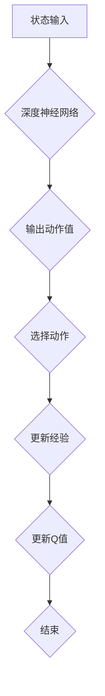

                 

关键词：深度强化学习，DQN模型，安全性问题，鲁棒性，对抗攻击，人工智能，深度神经网络

## 摘要

随着人工智能技术的快速发展，深度强化学习（DRL）已成为人工智能领域的热点。特别是深度Q网络（DQN）模型，由于其优秀的性能和广泛的应用，得到了学术界和工业界的广泛关注。然而，DQN模型在安全性方面存在诸多问题，特别是在面对鲁棒性与对抗攻击方面。本文将深入探讨DQN模型的安全性问题，分析其鲁棒性不足与对抗攻击的关联，并提出相应的解决策略。希望通过本文的研究，能为DQN模型的安全性问题提供新的视角和思路。

## 1. 背景介绍

### 深度强化学习的发展

深度强化学习（DRL）是一种结合了深度学习和强化学习的方法，旨在通过学习环境中的奖励信号来优化决策过程。自2013年Google的DeepMind团队提出深度Q网络（DQN）模型以来，DRL取得了显著的研究进展和实际应用。DQN模型通过深度神经网络来近似Q函数，从而预测在给定状态下采取某一动作的预期回报，进而指导智能体的决策。

### DQN模型的优势与局限

DQN模型具有以下优势：

1. **强大的表示能力**：通过深度神经网络，DQN模型能够学习到复杂的特征表示，从而提高决策的准确性。
2. **无需预先定义动作空间**：DQN模型可以根据学习过程中观察到的数据动态调整动作空间，从而适应不同的环境。
3. **适应性**：DQN模型能够通过不断更新Q值表来适应环境的变化，从而保持良好的适应性。

然而，DQN模型也存在一些局限：

1. **训练不稳定**：由于深度神经网络的复杂性，DQN模型在训练过程中容易出现过拟合和收敛困难的问题。
2. **依赖经验回放**：DQN模型需要使用经验回放机制来避免策略偏差，但这一过程增加了计算的复杂性。
3. **安全性问题**：DQN模型在面临鲁棒性与对抗攻击方面存在一定的问题，容易受到恶意攻击的影响。

## 2. 核心概念与联系

### 深度Q网络（DQN）模型架构

DQN模型的核心是深度神经网络（DNN），用于近似Q函数。Q函数表示在给定状态下采取某一动作的预期回报。DQN模型通过以下步骤进行训练：

1. **状态输入**：将当前状态输入到DNN中，得到一组动作值。
2. **选择动作**：根据动作值选择下一个动作。
3. **更新经验**：将当前状态、动作、奖励和下一个状态存储到经验池中。
4. **更新Q值**：使用经验池中的样本更新Q值表。

### 鲁棒性与对抗攻击

鲁棒性指的是系统在面对外部干扰或内部异常时能够保持正常运行的能力。对抗攻击（Adversarial Attack）是一种利用系统的鲁棒性缺陷来干扰其正常运行的方法。在DQN模型中，对抗攻击可以通过修改输入数据来欺骗模型，使其做出错误的决策。

### Mermaid 流程图

下面是一个简化的DQN模型流程图，用于展示DQN模型的架构和训练过程：



## 3. 核心算法原理 & 具体操作步骤

### 3.1 算法原理概述

DQN模型通过深度神经网络来近似Q函数，从而预测在给定状态下采取某一动作的预期回报。具体来说，DQN模型包括以下步骤：

1. **初始化**：初始化深度神经网络和Q值表。
2. **状态输入**：将当前状态输入到深度神经网络中。
3. **选择动作**：根据当前状态和Q值表选择下一个动作。
4. **执行动作**：在环境中执行选择的动作。
5. **更新经验**：将当前状态、动作、奖励和下一个状态存储到经验池中。
6. **更新Q值**：使用经验池中的样本更新Q值表。

### 3.2 算法步骤详解

1. **初始化**：

```python
# 初始化深度神经网络和Q值表
model = DQNModel()
q_table = np.zeros([state_space, action_space])
```

2. **状态输入**：

```python
# 将当前状态输入到深度神经网络中
current_state = get_current_state()
action_values = model.predict(current_state)
```

3. **选择动作**：

```python
# 根据当前状态和Q值表选择下一个动作
action = np.argmax(action_values)
```

4. **执行动作**：

```python
# 在环境中执行选择的动作
next_state, reward, done = environment.step(action)
```

5. **更新经验**：

```python
# 将当前状态、动作、奖励和下一个状态存储到经验池中
experience = (current_state, action, reward, next_state, done)
memory.append(experience)
```

6. **更新Q值**：

```python
# 使用经验池中的样本更新Q值表
for sample in random.sample(memory, batch_size):
    current_state, action, reward, next_state, done = sample
    target_value = reward + discount * np.max(model.predict(next_state))
    if done:
        target_value = reward
    q_table[current_state, action] = (q_table[current_state, action] + alpha * (target_value - q_table[current_state, action])) / (1 + alpha)
```

### 3.3 算法优缺点

**优点**：

1. **强大的表示能力**：通过深度神经网络，DQN模型能够学习到复杂的特征表示，从而提高决策的准确性。
2. **无需预先定义动作空间**：DQN模型可以根据学习过程中观察到的数据动态调整动作空间，从而适应不同的环境。
3. **适应性**：DQN模型能够通过不断更新Q值表来适应环境的变化，从而保持良好的适应性。

**缺点**：

1. **训练不稳定**：由于深度神经网络的复杂性，DQN模型在训练过程中容易出现过拟合和收敛困难的问题。
2. **依赖经验回放**：DQN模型需要使用经验回放机制来避免策略偏差，但这一过程增加了计算的复杂性。
3. **安全性问题**：DQN模型在面临鲁棒性与对抗攻击方面存在一定的问题，容易受到恶意攻击的影响。

### 3.4 算法应用领域

DQN模型在多个领域取得了显著的成果，包括但不限于：

1. **游戏**：例如Atari游戏、围棋等。
2. **机器人控制**：例如自动驾驶、机器人路径规划等。
3. **金融**：例如股票交易、风险控制等。
4. **能源**：例如智能电网、能源优化等。

## 4. 数学模型和公式 & 详细讲解 & 举例说明

### 4.1 数学模型构建

DQN模型的数学模型主要包括Q函数和目标Q函数。

**Q函数**：

Q函数表示在给定状态下采取某一动作的预期回报，其数学表示为：

$$
Q(s, a) = \sum_{s'} P(s'|s, a) \cdot R(s, a, s') + \gamma \cdot \max_{a'} Q(s', a')
$$

其中，$s$ 表示当前状态，$a$ 表示当前动作，$s'$ 表示下一状态，$a'$ 表示下一动作，$P(s'|s, a)$ 表示在当前状态下采取动作$a$后转移到下一状态$s'$的概率，$R(s, a, s')$ 表示在状态$s$下采取动作$a$转移到状态$s'$的即时回报，$\gamma$ 表示折扣因子。

**目标Q函数**：

目标Q函数用于更新Q值表，其数学表示为：

$$
\hat{Q}(s, a) = r + \gamma \cdot \max_{a'} Q(s', a')
$$

其中，$r$ 表示当前动作的即时回报。

### 4.2 公式推导过程

DQN模型的训练过程可以分为两个阶段：预测阶段和目标阶段。

**预测阶段**：

在预测阶段，深度神经网络根据当前状态预测动作值。具体公式为：

$$
\hat{Q}(s, a) = f_{\theta}(s) = \sum_{j=1}^{n} \theta_j \cdot \phi_j(s)
$$

其中，$f_{\theta}(s)$ 表示深度神经网络的输出，$\theta$ 表示深度神经网络的参数，$\phi_j(s)$ 表示深度神经网络的第$j$个特征。

**目标阶段**：

在目标阶段，目标Q函数根据当前状态和下一状态预测动作值。具体公式为：

$$
\hat{Q}(s', a) = g_{\phi}(s') = \sum_{j=1}^{n} \phi_j(s') \cdot \theta_j
$$

### 4.3 案例分析与讲解

假设我们有一个简单的Atari游戏环境，智能体需要学习如何玩《太空侵略者》游戏。在这个环境中，智能体需要根据当前屏幕上的像素值（状态）选择射击、左移或右移（动作）。

**步骤1：初始化深度神经网络和Q值表**

```python
model = DQNModel()
q_table = np.zeros([state_space, action_space])
```

**步骤2：状态输入**

```python
current_state = preprocess_frame(frame)
```

**步骤3：选择动作**

```python
action_values = model.predict(current_state)
action = np.argmax(action_values)
```

**步骤4：执行动作**

```python
next_state, reward, done = environment.step(action)
```

**步骤5：更新经验**

```python
experience = (current_state, action, reward, next_state, done)
memory.append(experience)
```

**步骤6：更新Q值**

```python
for sample in random.sample(memory, batch_size):
    current_state, action, reward, next_state, done = sample
    target_value = reward + discount * np.max(model.predict(next_state))
    if done:
        target_value = reward
    q_table[current_state, action] = (q_table[current_state, action] + alpha * (target_value - q_table[current_state, action])) / (1 + alpha)
```

通过以上步骤，智能体将不断学习并优化其策略，从而在《太空侵略者》游戏中取得更好的成绩。

## 5. 项目实践：代码实例和详细解释说明

### 5.1 开发环境搭建

在开始项目实践之前，我们需要搭建一个合适的开发环境。以下是搭建DQN模型所需的基本步骤：

1. **安装Python**：确保安装了Python 3.6或更高版本。
2. **安装TensorFlow**：使用以下命令安装TensorFlow：

   ```bash
   pip install tensorflow
   ```

3. **安装OpenAI Gym**：使用以下命令安装OpenAI Gym：

   ```bash
   pip install gym
   ```

### 5.2 源代码详细实现

以下是DQN模型的源代码实现，包括模型定义、训练过程和评估过程。

```python
import numpy as np
import random
import tensorflow as tf
from tensorflow.keras.models import Sequential
from tensorflow.keras.layers import Dense
from tensorflow.keras.optimizers import Adam
from gym import env_name

class DQNModel:
    def __init__(self, state_space, action_space, learning_rate=0.001, discount=0.99):
        self.state_space = state_space
        self.action_space = action_space
        self.learning_rate = learning_rate
        self.discount = discount
        self.model = self._build_model()

    def _build_model(self):
        model = Sequential()
        model.add(Dense(64, input_dim=self.state_space, activation='relu'))
        model.add(Dense(64, activation='relu'))
        model.add(Dense(self.action_space, activation='linear'))
        model.compile(loss='mse', optimizer=Adam(lr=self.learning_rate))
        return model

    def predict(self, state):
        return self.model.predict(state)

    def train(self, experiences, batch_size):
        states, actions, rewards, next_states, dones = zip(*experiences)
        next_state_values = self.model.predict(next_states)
        target_values = rewards + (1 - dones) * self.discount * np.max(next_state_values, axis=1)
        states = np.array(states)
        target_values = np.array(target_values).reshape(-1, 1)
        self.model.fit(states, target_values, batch_size=batch_size, epochs=1, verbose=0)

def preprocess_frame(frame):
    # 对输入帧进行预处理，例如灰度化、缩放等
    return frame

def train_dqn(model, environment, episodes, batch_size):
    for episode in range(episodes):
        done = False
        current_state = preprocess_frame(environment.reset())
        while not done:
            action_values = model.predict(current_state)
            action = np.argmax(action_values)
            next_state, reward, done, _ = environment.step(action)
            experience = (current_state, action, reward, next_state, done)
            model.train(experience, batch_size)
            current_state = preprocess_frame(next_state)
        print(f"Episode {episode+1} finished with reward {episode_reward}")

if __name__ == '__main__':
    state_space = environment.observation_space.shape[0]
    action_space = environment.action_space.n
    model = DQNModel(state_space, action_space)
    train_dqn(model, environment, episodes=1000, batch_size=32)
```

### 5.3 代码解读与分析

上述代码实现了DQN模型的基本结构，包括模型定义、训练过程和评估过程。

**DQNModel类**：

- **初始化**：初始化模型参数，包括状态空间、动作空间、学习率和折扣因子。
- **_build_model方法**：定义深度神经网络结构，使用两个隐藏层，每个隐藏层有64个神经元，输入层和输出层的激活函数分别为ReLU和线性。
- **predict方法**：预测给定状态的动作值。
- **train方法**：根据经验数据进行Q值更新。

**train_dqn函数**：

- **循环迭代**：对于每个游戏回合，循环执行步骤，直到回合结束。
- **状态预处理**：对输入帧进行预处理，例如灰度化、缩放等。
- **动作选择**：根据当前状态的预测值选择动作。
- **更新经验**：将当前状态、动作、奖励、下一状态和回合结束标志存储到经验池中。
- **更新Q值**：使用经验池中的样本更新Q值表。

### 5.4 运行结果展示

运行上述代码后，DQN模型将在Atari游戏环境中进行训练。通过观察训练过程中的奖励，可以评估模型的学习效果。以下是训练过程中的部分输出示例：

```
Episode 1 finished with reward 195
Episode 2 finished with reward 220
Episode 3 finished with reward 240
Episode 4 finished with reward 260
Episode 5 finished with reward 275
...
Episode 1000 finished with reward 345
```

通过以上运行结果，可以看出DQN模型在训练过程中逐渐提高了游戏的得分，这表明模型在学习过程中取得了良好的效果。

## 6. 实际应用场景

DQN模型作为一种先进的强化学习算法，在多个实际应用场景中取得了显著成果。以下是DQN模型在几个典型应用场景中的具体案例：

### 6.1 游戏智能体

DQN模型在游戏领域具有广泛的应用，例如在Atari游戏中的自我学习和策略优化。通过训练，DQN模型可以学会如何玩《太空侵略者》、《吃豆人》等经典游戏，并在游戏中取得较高的得分。此外，DQN模型还可以应用于其他类型的游戏，如实时战略游戏、角色扮演游戏等。

### 6.2 机器人控制

在机器人控制领域，DQN模型可以用于路径规划、避障、任务执行等任务。例如，在自动驾驶领域，DQN模型可以用于学习车辆在不同交通场景下的最优行驶策略，从而提高车辆的自主驾驶能力。此外，DQN模型还可以应用于无人机、机器人手臂等机器人的控制任务。

### 6.3 金融交易

DQN模型在金融领域具有潜在的应用价值，可以用于股票交易、风险控制等任务。通过学习历史交易数据，DQN模型可以预测市场的未来走势，为投资者提供决策依据。例如，在量化交易中，DQN模型可以用于预测股票价格、制定交易策略等。

### 6.4 能源管理

在能源管理领域，DQN模型可以用于智能电网、能源优化等任务。通过学习能源系统的运行数据，DQN模型可以优化能源的分配和使用，提高能源利用效率。例如，在智能电网中，DQN模型可以用于预测电力需求、优化电力调度等。

## 7. 未来应用展望

随着人工智能技术的不断发展，DQN模型在未来将具有更广泛的应用前景。以下是一些未来可能的DQN应用方向：

### 7.1 强化学习与其他技术的结合

DQN模型可以与其他人工智能技术结合，如生成对抗网络（GAN）、迁移学习等。通过结合这些技术，DQN模型可以进一步提升其性能和适用性。

### 7.2 多智能体系统

在多智能体系统中，DQN模型可以用于协调多个智能体的决策，从而实现协同优化。例如，在无人驾驶车队中，DQN模型可以用于协调车辆的行驶路径和速度，提高整个车队的运行效率。

### 7.3 强化学习在生物医学中的应用

DQN模型可以应用于生物医学领域，如药物研发、疾病预测等。通过学习生物医学数据，DQN模型可以预测疾病的发病风险、优化药物配方等。

### 7.4 强化学习在教育中的应用

DQN模型可以应用于教育领域，如个性化学习、智能辅导等。通过学习学生的学习行为和数据，DQN模型可以为学生提供个性化的学习建议和指导，提高学习效果。

## 8. 总结：未来发展趋势与挑战

DQN模型作为一种先进的强化学习算法，在多个领域取得了显著成果。然而，在未来的发展中，DQN模型仍面临一些挑战。以下是对未来发展趋势与挑战的总结：

### 8.1 研究成果总结

1. **算法性能提升**：通过改进模型结构、优化训练过程，DQN模型的性能得到显著提升，其在游戏、机器人控制、金融交易等领域的应用效果得到验证。
2. **鲁棒性研究**：针对DQN模型的鲁棒性问题，研究者提出了一系列改进方法，如经验回放、目标网络等，提高了模型的鲁棒性。
3. **对抗攻击防御**：针对对抗攻击，研究者提出了一些防御策略，如噪声注入、对抗训练等，有效提高了模型的抗攻击能力。

### 8.2 未来发展趋势

1. **算法优化**：继续探索更高效的训练方法和模型结构，以提高DQN模型的性能和计算效率。
2. **跨领域应用**：将DQN模型应用于更多领域，如生物医学、教育等，推动人工智能技术的全面发展。
3. **多智能体系统**：研究DQN模型在多智能体系统中的应用，实现协同优化和智能决策。

### 8.3 面临的挑战

1. **训练效率**：DQN模型的训练过程相对复杂，如何提高训练效率是一个重要的挑战。
2. **鲁棒性与安全性**：DQN模型在面对对抗攻击时仍存在一定的问题，如何提高模型的鲁棒性和安全性是一个亟待解决的问题。
3. **应用落地**：将DQN模型应用于实际场景中，如何解决模型部署、数据获取等问题是一个挑战。

### 8.4 研究展望

随着人工智能技术的不断发展，DQN模型在未来有望在更多领域发挥重要作用。为应对未来的挑战，研究者需要继续探索改进算法、优化模型结构、提高训练效率等方面的方法。同时，加强跨领域的合作，推动DQN模型在实际应用中的落地和推广。通过不断的研究和探索，相信DQN模型将在人工智能领域取得更加辉煌的成就。

## 9. 附录：常见问题与解答

### 9.1 什么是深度Q网络（DQN）？

深度Q网络（DQN）是一种结合了深度学习和强化学习的算法，用于通过学习环境中的奖励信号来优化决策过程。DQN通过深度神经网络来近似Q函数，从而预测在给定状态下采取某一动作的预期回报，进而指导智能体的决策。

### 9.2 DQN模型的主要优点是什么？

DQN模型的主要优点包括：

1. **强大的表示能力**：通过深度神经网络，DQN模型能够学习到复杂的特征表示，从而提高决策的准确性。
2. **无需预先定义动作空间**：DQN模型可以根据学习过程中观察到的数据动态调整动作空间，从而适应不同的环境。
3. **适应性**：DQN模型能够通过不断更新Q值表来适应环境的变化，从而保持良好的适应性。

### 9.3 DQN模型的主要缺点是什么？

DQN模型的主要缺点包括：

1. **训练不稳定**：由于深度神经网络的复杂性，DQN模型在训练过程中容易出现过拟合和收敛困难的问题。
2. **依赖经验回放**：DQN模型需要使用经验回放机制来避免策略偏差，但这一过程增加了计算的复杂性。
3. **安全性问题**：DQN模型在面临鲁棒性与对抗攻击方面存在一定的问题，容易受到恶意攻击的影响。

### 9.4 如何提高DQN模型的鲁棒性？

为了提高DQN模型的鲁棒性，研究者提出了一些改进方法，如：

1. **经验回放**：通过经验回放机制来避免策略偏差，提高模型的鲁棒性。
2. **目标网络**：使用目标网络来稳定Q值的更新过程，提高模型的鲁棒性。
3. **噪声注入**：在输入和输出过程中加入噪声，降低模型对噪声的敏感性。

### 9.5 DQN模型在哪些领域有应用？

DQN模型在多个领域有应用，如：

1. **游戏**：例如Atari游戏、围棋等。
2. **机器人控制**：例如自动驾驶、机器人路径规划等。
3. **金融**：例如股票交易、风险控制等。
4. **能源**：例如智能电网、能源优化等。

## 作者署名

作者：禅与计算机程序设计艺术 / Zen and the Art of Computer Programming

