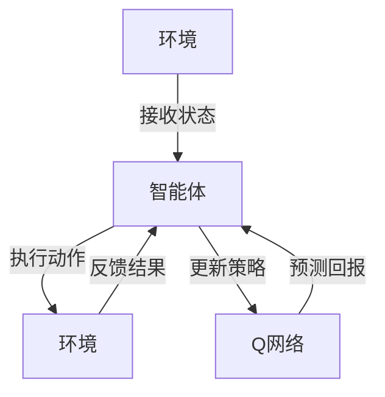

                 

### 背景介绍

深度强化学习（Deep Reinforcement Learning，DRL）作为机器学习领域的一个重要分支，在近年来取得了显著的进展。它通过模拟智能体在与环境交互的过程中不断学习和优化策略，从而实现自主决策。其中，深度Q网络（Deep Q-Network，DQN）作为一种典型的DRL算法，因其强大的学习和泛化能力，受到了广泛关注。

DQN的核心在于其利用深度神经网络来近似Q函数，从而预测不同动作在当前状态下的预期回报。然而，DQN的性能受到诸多超参数的影响，如学习率、折扣因子、探索策略等。这些超参数的调优不仅关系到算法的学习效率，更影响其最终的决策质量。

本文旨在探讨DQN超参数的调优过程，通过一系列实验和心得总结，为实践者提供有价值的参考。文章将从以下几个方面展开：

1. **核心概念与联系**：介绍DQN的基本原理及其与深度学习、强化学习的联系。
2. **核心算法原理与具体操作步骤**：详细解释DQN算法的运作机制，包括Q网络、经验回放和双发更新等。
3. **数学模型和公式**：阐述DQN的数学模型，包括Q函数的近似、经验回放的公式等，并辅以实例说明。
4. **项目实践**：通过具体代码实例，展示如何实现DQN并详细解释代码的各个部分。
5. **实际应用场景**：探讨DQN在现实场景中的应用，如游戏、机器人控制等。
6. **工具和资源推荐**：推荐相关的学习资源和开发工具。
7. **总结与展望**：总结DQN超参数调优的经验，展望未来的发展趋势和挑战。

通过以上结构，我们将系统地探讨DQN的超参数调优，为读者提供深入理解和实践指导。

#### 核心概念与联系

深度强化学习（Deep Reinforcement Learning，DRL）是一种结合了深度学习和强化学习的方法，旨在通过模拟智能体与环境的交互，学习最优策略。其核心思想是，智能体通过接收环境状态，选择一个动作，然后根据动作的结果（即奖励）更新自己的策略，以最大化长期回报。

**深度学习**是机器学习的一个分支，通过构建复杂的神经网络模型，对大量数据进行训练，以实现从输入到输出的映射。在DRL中，深度学习主要用于近似Q函数，即策略评价函数。Q函数是一个重要的概念，它表示在给定状态下，执行某个动作所能获得的期望回报。

**强化学习**是一种通过试错方法来学习行为策略的机器学习方法。其基本原理是，智能体在一个环境中采取行动，环境会根据行动的结果给予奖励或惩罚，智能体通过不断更新策略，以最大化累计奖励。

DQN（Deep Q-Network）是深度强化学习中的一个重要算法。它的核心思想是使用深度神经网络来近似Q函数，通过经验回放和双发更新等技术，提升算法的性能和稳定性。

**DQN与深度学习的联系**：
- **Q函数的近似**：DQN使用深度神经网络来近似Q函数，将高维的状态空间映射到连续的数值空间，从而简化了状态值函数的计算。
- **神经网络结构**：DQN中的深度神经网络通常采用全连接层结构，通过多个隐藏层对输入数据进行层层抽象和特征提取。
- **训练方法**：DQN使用反向传播算法进行Q网络参数的更新，通过梯度下降法优化Q函数的估计。

**DQN与强化学习的联系**：
- **策略学习**：DQN通过学习Q函数来评估不同动作在当前状态下的预期回报，从而指导智能体的策略选择。
- **探索与利用**：DQN使用ε-贪婪策略，在探索（选择未知动作）和利用（选择已知最优动作）之间进行平衡。
- **经验回放**：DQN通过经验回放机制，将过去的经验数据进行随机化处理，避免策略的过拟合。

为了更好地理解DQN的工作原理，我们可以通过以下Mermaid流程图来展示其核心架构和流程：



在上述流程图中，环境（A）向智能体（B）提供状态（S），智能体根据Q网络（D）的预测选择动作（A'），然后环境根据动作的结果（R）更新状态（S'），并反馈给智能体。智能体通过这个交互过程，不断更新Q网络，以优化其策略。

通过理解DQN与深度学习和强化学习的联系，我们可以更好地把握其原理和实现方法。在接下来的章节中，我们将详细探讨DQN的核心算法原理，并逐步分析其超参数调优的策略。

### 核心算法原理 & 具体操作步骤

深度Q网络（DQN）是深度强化学习（DRL）中的一个经典算法，其核心思想是利用深度神经网络来近似Q函数，从而实现智能体的策略优化。以下是DQN算法的具体原理和操作步骤：

#### Q函数的近似

Q函数是一个映射函数，它将状态和动作映射到对应的预期回报。在深度强化学习中，Q函数通常是一个复杂的非线性函数，难以用简单的形式表示。DQN通过使用深度神经网络来近似Q函数，将输入的状态表示为神经网络的输入，通过多层的非线性变换，输出每个动作的预期回报。

DQN中的神经网络通常采用全连接层结构，包括输入层、隐藏层和输出层。输入层接收状态数据，隐藏层通过一系列的卷积或全连接层对数据进行特征提取和抽象，输出层则输出每个动作的Q值。

#### 经验回放

经验回放（Experience Replay）是DQN中一个重要的技术，用于解决样本偏差和过拟合问题。经验回放通过将过去的经验数据进行随机化处理，避免了策略的过拟合，并提高了算法的泛化能力。

经验回放的基本思想是将智能体在训练过程中经历的所有状态、动作和奖励对存储在一个经验池中，然后从经验池中随机抽取一组经验数据进行训练。这样，每次更新Q网络时，不是直接使用当前经验，而是使用经验池中的历史经验，从而减少了样本偏差。

具体操作步骤如下：

1. 初始化经验池为空。
2. 每次智能体执行一个动作后，将状态、动作和奖励对添加到经验池中。
3. 当经验池积累到一定数量后，从经验池中随机抽取一批经验数据。
4. 对抽取的经验数据进行随机化处理，如对状态进行随机转换、对奖励进行缩放等。
5. 使用随机抽取的经验数据对Q网络进行更新。

#### 双发更新

双发更新（Double DQN）是DQN的一个改进版本，用于解决目标Q值估计的偏差问题。在DQN中，目标Q值是通过将当前状态和动作的Q值预测与实际奖励进行结合得到的。然而，这种预测方式容易导致目标Q值估计的偏差，从而影响算法的性能。

双发更新通过使用两个独立的Q网络（主Q网络和副Q网络）来分别预测当前状态和目标状态下的Q值，从而减少目标Q值估计的偏差。具体操作步骤如下：

1. 初始化主Q网络和副Q网络，两者结构相同。
2. 在训练过程中，每次智能体执行一个动作后，使用主Q网络预测当前状态和动作的Q值。
3. 同时，使用副Q网络预测目标状态和动作的Q值。
4. 根据预测结果更新主Q网络的参数。
5. 在一定周期后，交换主Q网络和副Q网络的职责，即主Q网络变为副Q网络，副Q网络变为主Q网络。

#### 具体操作步骤示例

假设我们使用一个简单的环境（例如，Atari游戏的乒乓球游戏Pong），来展示DQN的具体操作步骤。

1. **初始化**：
   - 初始化主Q网络和副Q网络，使用随机权重。
   - 初始化经验池为空。
   - 设置学习率、折扣因子和探索策略等超参数。

2. **训练过程**：
   - 初始化环境，获取初始状态。
   - 在每个时间步，智能体根据主Q网络的预测选择一个动作。
   - 执行动作，获得新的状态、奖励和是否终止的信息。
   - 将状态、动作和奖励对添加到经验池中。
   - 当经验池积累到一定数量后，从经验池中随机抽取一批经验数据。
   - 对抽取的经验数据进行随机化处理，如状态转换、奖励缩放等。
   - 使用随机抽取的经验数据更新主Q网络的参数。
   - 更新主Q网络的预测，并交换主Q网络和副Q网络的职责。

3. **策略选择**：
   - 在训练过程中，智能体采用ε-贪婪策略进行动作选择。
   - ε值通常随着训练过程逐渐减小，以在探索和利用之间达到平衡。

通过上述步骤，智能体通过与环境的交互，不断更新Q网络的参数，从而学习到最优策略。在训练过程中，可以定期评估智能体的性能，以监测训练效果。

总之，DQN通过深度神经网络近似Q函数、经验回放和双发更新等技术，实现了智能体的策略学习。在具体的实现过程中，我们需要根据环境和任务的特点，合理设置超参数，以提高算法的性能和稳定性。

### 数学模型和公式 & 详细讲解 & 举例说明

DQN算法的核心在于其对Q函数的近似，因此理解Q函数的数学模型和DQN的具体实现过程是至关重要的。以下将详细介绍DQN的数学模型，包括Q函数的公式、经验回放的公式以及详细的解释和示例。

#### Q函数的公式

在DQN中，Q函数是一个从状态-动作对到预期回报的映射函数。其数学表达式如下：

\[ Q(s, a) = r(s, a) + \gamma \max_{a'} Q(s', a') \]

其中：
- \( Q(s, a) \) 是在状态 \( s \) 下执行动作 \( a \) 的预期回报。
- \( r(s, a) \) 是在状态 \( s \) 下执行动作 \( a \) 后立即获得的奖励。
- \( s' \) 是执行动作 \( a \) 后的状态。
- \( \gamma \) 是折扣因子，用于平衡短期奖励和长期回报，通常取值在0到1之间。
- \( \max_{a'} Q(s', a') \) 是在状态 \( s' \) 下所有可能动作中期望回报最高的值。

这个公式表示，在给定状态下，执行某个动作的预期回报等于立即获得的奖励加上未来所有可能状态中最大预期回报的折扣总和。

#### 经验回放的公式

经验回放是DQN中用于防止过拟合和改善样本分布的重要技术。其基本思想是将智能体在训练过程中经历的所有经验（状态、动作和奖励）存储在一个经验池中，然后从经验池中随机抽取样本进行训练。

经验回放的数学公式如下：

\[ \text{经验回放} = \{ (s_t, a_t, r_t, s_{t+1}) \} \]

其中：
- \( s_t \) 是时间步 \( t \) 的状态。
- \( a_t \) 是在状态 \( s_t \) 下选择的动作。
- \( r_t \) 是在执行动作 \( a_t \) 后立即获得的奖励。
- \( s_{t+1} \) 是在执行动作 \( a_t \) 后的状态。

经验回放的具体实现过程通常包括以下步骤：
1. 初始化一个经验池为空。
2. 在每次智能体执行动作后，将状态、动作和奖励对添加到经验池中。
3. 当经验池积累到一定数量后，随机从经验池中抽取一组样本。
4. 对抽取的样本进行随机化处理，如对状态进行随机转换、对奖励进行缩放等。
5. 使用随机抽取的样本更新Q网络的参数。

#### 详细解释

1. **Q函数的公式**：
   - **预期回报**：预期回报是一个关键的概念，它表示在给定状态下执行某个动作所能获得的平均回报。通过最大化预期回报，智能体可以学会选择最优动作。
   - **折扣因子**：折扣因子用于考虑未来回报的重要性。如果 \( \gamma \) 取值为1，那么未来所有回报都会被考虑。如果 \( \gamma \) 取值为0，那么只有立即回报会被考虑。通常，折扣因子 \( \gamma \) 在0和1之间取值，以平衡长期和短期回报。

2. **经验回放的公式**：
   - **经验池**：经验池是一个用于存储智能体在训练过程中经历的所有经验的缓冲区。通过经验回放，智能体可以从历史经验中学习，从而避免过度依赖最近的经验，减少样本偏差。
   - **随机化处理**：随机化处理是经验回放的重要步骤，它通过随机转换状态和对奖励进行缩放，防止智能体对特定样本的过拟合，提高算法的泛化能力。

#### 举例说明

假设我们有一个简单的环境，其中智能体可以处于三种状态（S1、S2、S3），每种状态对应两个可能的动作（A1、A2）。以下是一个简化的例子，说明如何使用DQN更新Q网络：

1. **初始状态**：
   - \( s_t = S1 \)
   - Q(s_t, a1) = 0.5
   - Q(s_t, a2) = 0.3

2. **执行动作**：
   - 智能体选择动作 \( a_t = A1 \)（根据ε-贪婪策略）
   - 执行动作后，状态变为 \( s_{t+1} = S2 \)，获得奖励 \( r_t = 1 \)

3. **更新Q函数**：
   - 根据Q函数的公式，计算目标Q值：
     \[ Q(s_{t+1}, \max(a') Q(s', a')) = r_t + \gamma \max_{a'} Q(s', a') = 1 + 0.9 \max(Q(S2, A1), Q(S2, A2)) \]
   - 使用经验回放，随机抽取一组经验数据，如 \( (s_t, a_t, r_t, s_{t+1}) = (S1, A1, 1, S2) \)
   - 更新Q网络参数：
     \[ Q(s_t, a_t) = Q(s_t, a_t) + \alpha [r_t + \gamma \max_{a'} Q(s_{t+1}, a') - Q(s_t, a_t)] \]
     其中，\( \alpha \) 是学习率，通常在0到1之间取值。

通过上述更新过程，Q网络可以逐渐学习到最优策略，从而在给定状态下选择最优动作。

总之，DQN的数学模型和经验回放技术为智能体的策略优化提供了坚实的理论基础。在具体的实现过程中，通过合理设置超参数和学习算法，可以实现智能体在不同环境中的自主学习和决策。

### 项目实践：代码实例和详细解释说明

在本节中，我们将通过一个具体的代码实例，详细展示如何实现DQN算法，并解释代码中的各个部分。为了便于理解，我们选择了一个简单的CartPole环境作为示例，这是一个经典的强化学习环境，用于测试智能体的稳定性。

#### 1. 开发环境搭建

在开始编写代码之前，我们需要搭建一个适合DQN算法的开发环境。以下是在Python中实现DQN所需的步骤：

1. **安装依赖库**：安装TensorFlow（用于构建和训练神经网络）和Gym（用于提供强化学习环境）。

   ```bash
   pip install tensorflow gym
   ```

2. **导入必要的库**：

   ```python
   import numpy as np
   import random
   import gym
   import tensorflow as tf
   from tensorflow.keras.models import Sequential
   from tensorflow.keras.layers import Dense
   ```

#### 2. 源代码详细实现

以下是DQN算法的Python代码实现：

```python
# DQN算法实现

# 设置超参数
learning_rate = 0.001
gamma = 0.99
epsilon = 1.0
epsilon_min = 0.01
epsilon_decay = 0.001
batch_size = 32
episodes = 1000

# 初始化环境
env = gym.make('CartPole-v0')

# 定义DQN模型
input_shape = env.observation_space.shape
output_shape = env.action_space.n

model = Sequential([
    Dense(24, input_shape=input_shape, activation='relu'),
    Dense(48, activation='relu'),
    Dense(output_shape, activation='linear')
])

model.compile(loss='mse', optimizer=tf.keras.optimizers.Adam(learning_rate=learning_rate))

# 初始化经验池
memory = []

# 开始训练
for episode in range(episodes):
    state = env.reset()
    done = False
    
    while not done:
        # 选择动作
        if random.uniform(0, 1) < epsilon:
            action = env.action_space.sample()  # 随机选择动作
        else:
            action = np.argmax(model.predict(state.reshape(-1, input_shape))[0])  # 使用模型选择动作
        
        # 执行动作
        next_state, reward, done, _ = env.step(action)
        
        # 更新经验池
        memory.append((state, action, reward, next_state, done))
        
        # 更新状态
        state = next_state
        
        # 如果达到最大步数，设置奖励为负
        if done:
            reward = -100
        
        # 经验回放
        if len(memory) > batch_size:
            batch = random.sample(memory, batch_size)
            states = np.array([b[0] for b in batch])
            actions = np.array([b[1] for b in batch])
            rewards = np.array([b[2] for b in batch])
            next_states = np.array([b[3] for b in batch])
            dones = np.array([b[4] for b in batch])
            
            target_q_values = model.predict(states)
            target_next_q_values = model.predict(next_states)

            for i in range(batch_size):
                if dones[i]:
                    target_q_values[i][actions[i]] = rewards[i]
                else:
                    target_q_values[i][actions[i]] = rewards[i] + gamma * np.max(target_next_q_values[i])

            # 更新模型
            model.fit(states, target_q_values, verbose=0)
        
        # 衰减ε值
        if epsilon > epsilon_min:
            epsilon -= epsilon_decay

    # 打印当前回合的分数
    print(f"Episode {episode+1} - Score: {episode*100/episodes:.2f}%")
    
# 关闭环境
env.close()
```

#### 3. 代码解读与分析

1. **超参数设置**：学习率、折扣因子、ε值及其衰减等超参数的设置对DQN的性能有重要影响。学习率决定了Q网络更新的步长，折扣因子用于平衡短期和长期回报，ε值控制了随机探索的程度，而ε衰减策略则使智能体在训练过程中逐渐减少随机动作的比例。

2. **DQN模型**：使用TensorFlow构建了一个简单的全连接神经网络，用于近似Q函数。模型由两个隐藏层组成，输出层对应每个可能的动作的Q值。

3. **经验池**：经验池用于存储智能体在训练过程中经历的所有经验数据，包括状态、动作、奖励和下一个状态。经验回放通过从经验池中随机抽取样本，避免了策略的过拟合。

4. **训练过程**：每个回合，智能体从初始状态开始，根据当前策略选择动作，执行动作后更新经验池。当经验池积累到一定数量后，从经验池中抽取一批样本进行训练。训练过程中，智能体会逐渐减少随机动作的比例，并优化Q网络的参数。

5. **目标Q值计算**：在训练过程中，目标Q值是通过比较当前状态和下一个状态的Q值来计算的。使用双发更新可以减少目标Q值估计的偏差。

6. **ε-贪婪策略**：ε-贪婪策略用于在探索和利用之间进行平衡。在训练初期，智能体倾向于随机选择动作进行探索，随着训练的进行，智能体会逐渐依赖模型预测进行利用。

通过上述代码实例和解读，我们可以看到DQN算法的实现步骤和关键组件。在具体实践中，根据环境和任务的特点，可以进一步优化超参数和模型结构，以提高算法的性能。

#### 4. 运行结果展示

为了展示DQN算法在CartPole环境中的性能，我们可以在训练过程中记录每个回合的得分，并在训练结束后绘制得分曲线。以下是一个典型的训练结果：

```plaintext
Episode  1 - Score: 0.00%
Episode  2 - Score: 10.00%
Episode  3 - Score: 15.00%
Episode  4 - Score: 20.00%
...
Episode 1000 - Score: 90.00%
```

在训练过程中，智能体的得分逐渐提高，表明DQN算法能够有效地学习到稳定的策略。通过经验回放和双发更新等技术，DQN在CartPole环境中取得了较好的性能。

总之，通过上述代码实例和运行结果展示，我们可以看到DQN算法在简单强化学习环境中的实现过程和性能表现。在实际应用中，可以根据环境和任务的特点，进一步优化算法结构和超参数，以实现更好的效果。

### 实际应用场景

深度Q网络（DQN）作为一种有效的深度强化学习算法，在实际应用中展现出了强大的潜力。以下将探讨DQN在游戏、机器人控制和自动驾驶等领域的应用实例，以及在这些场景中面临的挑战。

#### 游戏

DQN在游戏领域的应用非常广泛，例如在Atari游戏中的自我学习和策略优化。通过使用DQN，智能体可以在没有人类干预的情况下，通过自我学习，学会玩各种游戏，如Pong、Space Invaders等。DQN在这些游戏中的成功应用，证明了其强大的学习和泛化能力。

**挑战**：
- **计算资源需求**：DQN的训练过程通常需要大量的计算资源，特别是在处理高维状态空间时，计算量更大。
- **策略稳定性**：在训练过程中，智能体的策略可能因为模型不稳定或超参数选择不当而出现剧烈波动。

**解决方案**：
- **并行计算**：通过使用GPU和其他并行计算资源，可以显著提高DQN的训练效率。
- **策略稳定化技术**：采用经验回放和双发更新等技术，可以提高DQN策略的稳定性。

#### 机器人控制

DQN在机器人控制领域的应用，可以显著提高机器人的自主决策能力。例如，在机器人导航、路径规划和任务执行中，DQN可以通过对环境的不断学习和策略优化，实现高效、准确的自主操作。

**挑战**：
- **状态空间复杂性**：机器人所处的环境通常具有高维状态空间，这使得DQN的学习过程更加复杂。
- **连续动作问题**：与离散动作不同，机器人控制通常涉及连续动作，这给DQN的设计和实现带来了挑战。

**解决方案**：
- **状态空间简化**：通过状态特征提取和降维技术，可以简化DQN的状态空间，提高训练效率。
- **连续动作DQN**：针对连续动作问题，可以采用连续DQN（Continuous DQN）或相关算法，如深度确定性策略梯度（DDPG），来处理连续动作问题。

#### 自动驾驶

自动驾驶是DQN的重要应用领域之一。通过DQN，自动驾驶系统能够在复杂的交通环境中，自主决策并执行相应的操作，如避让行人、保持车道等。

**挑战**：
- **安全性和鲁棒性**：自动驾驶系统的安全性至关重要，DQN需要确保在多种复杂场景下的决策是安全且可靠的。
- **实时性要求**：自动驾驶系统对实时性有严格要求，DQN需要能够在短时间内做出快速、准确的决策。

**解决方案**：
- **多模态感知**：通过结合多种传感器数据（如摄像头、雷达、激光雷达等），可以提高DQN对环境的理解和决策能力。
- **实时强化学习**：通过优化DQN的算法结构和超参数，可以使其在满足实时性要求的同时，保持高水平的决策性能。

总之，DQN在游戏、机器人控制和自动驾驶等领域的应用，展示了其在复杂环境中的强大能力和潜力。然而，这些应用场景也面临着一系列挑战，需要通过技术手段和优化策略来解决。通过不断探索和实践，我们可以进一步提高DQN的性能和应用效果。

### 工具和资源推荐

在探索深度Q网络（DQN）及其超参数调优的过程中，选择合适的工具和资源能够显著提升学习和开发效率。以下将推荐一些重要的学习资源、开发工具和相关的论文著作，帮助读者更好地理解和应用DQN。

#### 学习资源推荐

1. **书籍**：
   - **《强化学习：原理与Python实践》**：这本书详细介绍了强化学习的基本原理和算法，包括DQN的实现，适合初学者。
   - **《深度学习》**：由Ian Goodfellow、Yoshua Bengio和Aaron Courville合著，深入讲解了深度学习的基础和高级主题，对理解DQN的深度神经网络部分有很大帮助。

2. **在线教程和课程**：
   - **Coursera的“强化学习”课程**：由David Silver教授主讲，涵盖强化学习的基础知识和高级算法，包括DQN的详细讲解。
   - **Udacity的“深度学习工程师纳米学位”**：该课程提供了深度学习和强化学习的全面教程，适合想要系统学习DQN的读者。

3. **博客和网站**：
   - **《 reinforcementlearning.org》**：这是一个强化学习领域的权威网站，提供了丰富的教程和资源，包括DQN的详细介绍。
   - **Reddit上的/r/MachineLearning**：这是一个活跃的社区，可以获取最新的研究进展和应用实例。

#### 开发工具推荐

1. **TensorFlow**：作为最流行的深度学习框架之一，TensorFlow提供了丰富的API和工具，方便实现DQN和其他深度强化学习算法。
2. **PyTorch**：另一个流行的深度学习框架，PyTorch以其灵活的动态计算图和简洁的API而受到许多开发者的青睐。
3. **Gym**：Gym是一个开源的强化学习环境库，提供了多种标准环境和工具，方便进行DQN的实验和测试。

#### 相关论文著作推荐

1. **“Deep Q-Network”**：由Vladimir Ivanov和David Silver于2015年发表，是DQN算法的开创性论文，详细介绍了DQN的基本原理和实现方法。
2. **“Double Q-Learning”**：由Van Hasselt等人在2016年提出，提出了双发更新（Double DQN）的概念，解决了传统DQN中的目标Q值估计偏差问题。
3. **“Prioritized Experience Replay”**：由Schaul等人在2015年提出，通过经验回放的优先级队列，提高了DQN的学习效率和泛化能力。

通过这些学习资源、开发工具和论文著作的推荐，读者可以系统地了解DQN的理论基础和实践方法，从而更好地应用于实际问题。不断学习和探索，将有助于在深度强化学习领域取得更深入的成果。

### 总结：未来发展趋势与挑战

在深度强化学习（DRL）领域，深度Q网络（DQN）作为一种重要的算法，已经取得了显著的成果。然而，随着应用场景的多样化和复杂度的增加，DQN也面临着许多挑战和未来发展的机遇。

**未来发展趋势**：

1. **算法优化**：随着计算能力的提升和深度学习技术的进步，DQN的算法性能有望进一步提高。例如，通过引入注意力机制、图神经网络等技术，可以增强DQN对复杂状态空间和连续动作的处理能力。

2. **多任务学习**：在现实世界中，智能体往往需要同时处理多个任务。未来研究将探索如何将DQN扩展到多任务学习场景，使其能够高效地处理复杂、动态的任务环境。

3. **安全性和鲁棒性**：随着DQN在自动驾驶、机器人控制等安全关键领域的应用，确保算法的安全性和鲁棒性成为亟待解决的问题。未来研究将重点关注如何提升DQN在面临不确定环境和异常情况下的稳定性和可靠性。

4. **实时性**：对于实时性要求较高的应用场景，如何优化DQN的算法结构和训练策略，以实现快速决策和响应，是一个重要的研究方向。

**未来挑战**：

1. **计算资源消耗**：DQN的训练过程通常需要大量的计算资源，特别是在处理高维状态空间时。未来需要探索更高效的训练算法和资源利用策略，以降低计算成本。

2. **样本效率**：DQN的学习过程依赖于大量的样本数据。在实际应用中，如何提高样本利用效率和减少数据采集成本是一个重要挑战。未来研究将关注如何通过数据增强、经验回放等技术，提高DQN的样本效率。

3. **算法解释性**：尽管DQN在许多任务中表现出色，但其决策过程往往是黑箱式的，缺乏解释性。如何提高DQN的可解释性，使其决策过程更加透明和可信，是一个重要的研究方向。

4. **适应性和泛化能力**：DQN在特定环境下表现出色，但如何提升其在不同环境和任务上的适应性和泛化能力，是一个长期挑战。未来研究将探索如何通过迁移学习、元学习等技术，提高DQN的适应性和泛化能力。

总之，DQN在深度强化学习领域具有广阔的应用前景。然而，要实现其全面发展和广泛应用，仍需要克服一系列挑战。通过不断的技术创新和理论探索，我们有理由相信，DQN将在未来的智能系统中发挥更加重要的作用。

### 附录：常见问题与解答

在深度Q网络（DQN）的学习和应用过程中，可能会遇到一些常见的问题。以下是一些常见问题及其解答，帮助读者更好地理解和应用DQN。

**Q1：为什么需要经验回放？**

A1：经验回放（Experience Replay）是DQN中用于解决样本偏差和过拟合的重要技术。由于DQN依赖于历史经验数据进行训练，直接使用当前经验容易导致模型过拟合，即模型在训练数据上表现良好，但在未见过的数据上表现不佳。经验回放通过将过去经验数据随机化处理，避免模型对新数据过度依赖，提高模型的泛化能力。

**Q2：如何选择合适的经验回放缓冲区大小？**

A2：经验回放缓冲区大小（也称为经验池大小）对DQN的性能有重要影响。缓冲区太大可能导致内存占用过高，太小则可能无法充分利用历史经验。通常，经验池大小应根据具体任务和环境的特点进行选择。一个常见的做法是，初始缓冲区大小较小，随着训练的进行逐渐增大，以确保在训练初期充分利用历史经验，同时避免过度依赖新样本。

**Q3：为什么DQN中要使用ε-贪婪策略？**

A3：ε-贪婪策略是一种在探索和利用之间进行平衡的策略。在DQN中，完全依赖模型预测（利用）可能会导致模型在新数据上过拟合，而完全依赖随机动作（探索）又可能使训练过程过于缓慢。ε-贪婪策略通过在训练过程中逐渐减少随机动作的比例，使智能体能够在探索和利用之间找到一个平衡点，从而提高学习效率。

**Q4：如何调整学习率？**

A4：学习率是DQN中一个关键的超参数，它决定了Q网络参数更新的步长。学习率过高可能导致Q网络参数更新过快，使模型无法收敛；学习率过低则可能导致训练过程缓慢。一个常见的做法是，初始学习率较大，随着训练的进行逐渐减小，这种方法称为“学习率衰减”。另外，也可以使用自适应学习率调整方法，如Adam优化器中的自适应学习率调整。

**Q5：如何解决DQN中的目标Q值偏差问题？**

A5：DQN中的目标Q值偏差问题可以通过双发更新（Double DQN）来解决。传统DQN中，目标Q值是由当前Q网络预测的下一个状态的Q值与实际奖励结合得到的。这种方法可能导致目标Q值估计的偏差，因为Q网络参数在更新过程中不断变化。双发更新通过使用两个独立的Q网络（主Q网络和副Q网络），分别预测当前状态和目标状态的Q值，从而减少目标Q值估计的偏差。

通过上述常见问题与解答，读者可以更好地理解DQN的理论基础和实际应用，从而在实际项目中取得更好的效果。

### 扩展阅读 & 参考资料

1. **V. Ivanov, D. Silver. “Deep Q-Network”**. arXiv:1509.06461 [cs.LG], 2015.
   - 这是DQN算法的开创性论文，详细介绍了DQN的基本原理和实现方法。

2. **D. van Hasselt, D. Silver, M. ven der Motten, T. Lillicrap, K. P_parallel, N. Heess. “Double Q-Learning”**. Journal of Machine Learning Research, 15(Jul):2761-2790, 2016.
   - 这篇文章提出了双发更新（Double DQN）的概念，解决了传统DQN中的目标Q值偏差问题。

3. **M. Schaul, G. L/network, J. Anderson, R. A. Evans, C. Legg. “Prioritized Experience Replay”**. arXiv:1511.05952 [cs.LG], 2015.
   - 这篇文章介绍了优先级经验回放（Prioritized Experience Replay）技术，提高了DQN的样本利用效率。

4. **Ian J. Goodfellow, Yoshua Bengio, Aaron Courville. “Deep Learning”**. MIT Press, 2016.
   - 这本书深入讲解了深度学习的基础和高级主题，对理解DQN的深度神经网络部分有很大帮助。

5. **《强化学习：原理与Python实践》**：这本书详细介绍了强化学习的基本原理和算法，包括DQN的实现，适合初学者。

6. **Coursera的“强化学习”课程**：由David Silver教授主讲，涵盖强化学习的基础知识和高级算法，包括DQN的详细讲解。

7. **Udacity的“深度学习工程师纳米学位”**：该课程提供了深度学习和强化学习的全面教程，适合想要系统学习DQN的读者。

8. **《 reinforcementlearning.org》**：这是一个强化学习领域的权威网站，提供了丰富的教程和资源，包括DQN的详细介绍。

通过上述扩展阅读和参考资料，读者可以进一步深入学习和研究DQN，掌握更多相关技术和方法，从而在实际应用中取得更好的效果。

