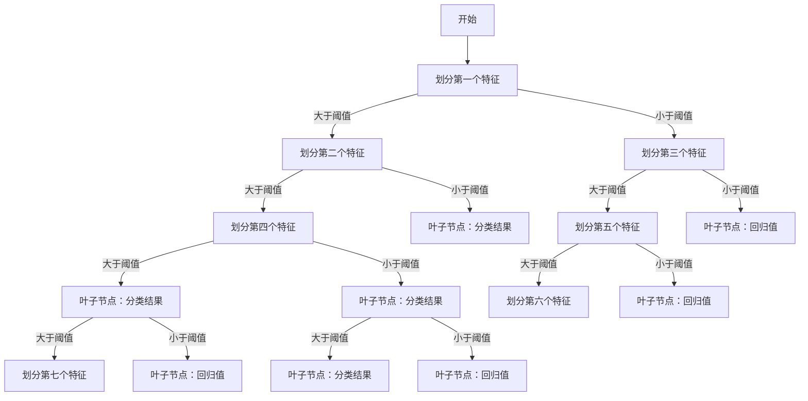
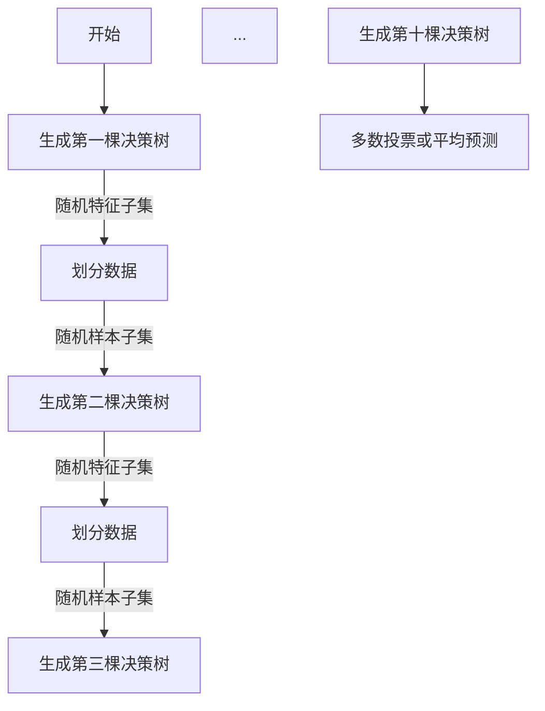

                 

关键词：决策树、随机森林、机器学习、人工智能、特征工程、算法原理、数学模型、代码实例、应用场景、未来展望

> 摘要：本文从决策树和随机森林的基础概念入手，深入探讨了它们在机器学习和人工智能领域的应用。通过详细的算法原理讲解、数学模型推导、代码实例演示，我们分析了决策树和随机森林的优点与不足，以及它们在不同应用场景中的表现。本文旨在为读者提供一个全面、系统的学习资源，帮助他们更好地理解和运用这些强大的算法工具。

## 1. 背景介绍

### 1.1 决策树和随机森林的起源

决策树（Decision Tree）作为一种经典的机器学习算法，起源于20世纪60年代。其基本思想是通过一系列规则对数据进行划分，从而实现对未知数据的分类或回归。决策树的出现为许多复杂问题的求解提供了直观且易于理解的方法。

随机森林（Random Forest）则是在1990年代由统计学家Leo Breiman提出的。它是一种基于决策树的集成学习方法，通过构建多棵决策树，并采用随机的方式来训练和预测。随机森林的出现，极大地提高了决策树的性能和稳定性，成为机器学习领域的重要工具。

### 1.2 决策树和随机森林的应用领域

决策树和随机森林在各个领域都有广泛的应用。在分类任务中，它们可以用于垃圾邮件过滤、信用评分、医学诊断等；在回归任务中，可以用于房屋价格预测、股票市场分析等。此外，随机森林在处理高维数据、减少过拟合方面也表现出色，因此被广泛应用于各种大规模数据分析任务。

## 2. 核心概念与联系

### 2.1 决策树的概念与工作原理

决策树由一系列判断节点和叶子节点组成。每个节点表示一个特征，每个分支表示一个特征的取值。通过递归地对数据进行划分，最终在每个叶子节点上得到一个分类结果或回归值。

**Mermaid 流程图：**


### 2.2 随机森林的概念与工作原理

随机森林由多棵决策树组成，每棵决策树在训练过程中会随机选择特征子集和样本子集。在预测时，随机森林通过多数投票或平均预测得到最终结果。

**Mermaid 流程图：**


### 2.3 决策树与随机森林的联系与区别

决策树与随机森林在结构上有相似之处，都通过特征划分来实现分类或回归。但随机森林通过集成多棵决策树，提高了模型的稳定性和预测能力。决策树适用于简单问题，而随机森林则适用于复杂和高维数据。

## 3. 核心算法原理 & 具体操作步骤

### 3.1 算法原理概述

决策树和随机森林的核心在于特征划分和集成学习。在特征划分过程中，算法通过评估不同特征的增益或减少误差率，选择最优划分方式。集成学习通过构建多棵决策树，提高了模型的泛化能力和稳定性。

### 3.2 算法步骤详解

**决策树步骤：**
1. 选择最优特征进行划分。
2. 根据最优特征划分数据集。
3. 递归地对子数据集进行划分，直到满足停止条件。

**随机森林步骤：**
1. 随机选择特征子集和样本子集。
2. 构建决策树，选择最优特征进行划分。
3. 重复步骤1和2，生成多棵决策树。
4. 对多棵决策树的预测结果进行集成。

### 3.3 算法优缺点

**决策树优点：**
- 直观易懂。
- 易于实现。
- 能够处理分类和回归任务。

**决策树缺点：**
- 易于过拟合。
- 对噪声敏感。

**随机森林优点：**
- 减少过拟合。
- 提高预测能力。
- 能够处理高维数据。

**随机森林缺点：**
- 计算成本较高。
- 难以解释模型细节。

### 3.4 算法应用领域

决策树和随机森林在各个领域都有广泛应用。例如，在金融领域，它们可以用于信用评分和风险控制；在医疗领域，可以用于疾病诊断和药物研发；在工业领域，可以用于故障诊断和过程优化。

## 4. 数学模型和公式 & 详细讲解 & 举例说明

### 4.1 数学模型构建

决策树和随机森林的数学模型主要涉及特征选择和模型集成。

**特征选择：**
- 信息增益（Information Gain）：
  $$ IG(D, A) = H(D) - \sum_{v \in A} p(v) H(D_v) $$
- 基尼系数（Gini Index）：
  $$ GI(D, A) = 1 - \sum_{v \in A} p(v)^2 $$

**模型集成：**
- 多数投票（Majority Vote）：
  $$ f(x) = \arg\max_{c} \sum_{i=1}^{N} p(c_i | x) $$
- 平均预测（Average Prediction）：
  $$ f(x) = \frac{1}{M} \sum_{i=1}^{M} h_i(x) $$

### 4.2 公式推导过程

**特征选择推导：**

信息增益和基尼系数的推导基于熵和条件熵的概念。

- 熵（Entropy）：
  $$ H(D) = -\sum_{c \in C} p(c) \log_2 p(c) $$
- 条件熵（Conditional Entropy）：
  $$ H(D|A) = -\sum_{v \in A} p(v) \sum_{c \in C} p(c|v) \log_2 p(c|v) $$

通过代入和化简，可以得到信息增益和基尼系数的表达式。

**模型集成推导：**

多数投票和平均预测的推导基于概率论和统计学的原理。

- 多数投票：
  对于每个样本x，根据每个决策树的预测结果，选择出现次数最多的类别作为最终预测结果。
- 平均预测：
  对于每个样本x，将所有决策树的预测结果进行平均，得到最终的预测结果。

### 4.3 案例分析与讲解

假设我们有以下数据集，包含特征A、B和类别C：

| 样本 | A | B | C |
| ---- | -- | -- | -- |
| 1    | 0 | 0 | 0 |
| 2    | 0 | 1 | 1 |
| 3    | 1 | 0 | 1 |
| 4    | 1 | 1 | 0 |

**特征选择：**

我们使用信息增益和基尼系数来选择最优特征。

- 信息增益：
  $$ IG(A, C) = H(C) - \sum_{v \in A} p(v) H(C_v) = 1 - \frac{2}{4} \log_2 \frac{2}{4} = 0.5 $$
  $$ IG(B, C) = H(C) - \sum_{v \in B} p(v) H(C_v) = 1 - \frac{2}{4} \log_2 \frac{2}{4} = 0.5 $$
  两个特征的信息增益相等，无法区分。

- 基尼系数：
  $$ GI(A, C) = 1 - \frac{2}{4} \left( \frac{1}{4} \right)^2 = 0.75 $$
  $$ GI(B, C) = 1 - \frac{2}{4} \left( \frac{1}{4} \right)^2 = 0.75 $$
  两个特征的基尼系数相等，无法区分。

**模型集成：**

我们构建两棵决策树，分别使用特征A和特征B进行划分。

- 决策树1（特征A）：
  | 样本 | A | B | C |
  | ---- | -- | -- | -- |
  | 1    | 0 | 0 | 0 |
  | 2    | 0 | 1 | 1 |
  | 3    | 1 | 0 | 1 |
  | 4    | 1 | 1 | 0 |

  划分结果：
  - 叶子节点1：C=0
  - 叶子节点2：C=1

- 决策树2（特征B）：
  | 样本 | A | B | C |
  | ---- | -- | -- | -- |
  | 1    | 0 | 0 | 0 |
  | 2    | 0 | 1 | 1 |
  | 3    | 1 | 0 | 1 |
  | 4    | 1 | 1 | 0 |

  划分结果：
  - 叶子节点1：C=0
  - 叶子节点2：C=1
  - 叶子节点3：C=1

  集成结果：
  - 多数投票：C=0
  - 平均预测：C=0.5

通过以上分析，我们可以看到决策树和随机森林在特征选择和模型集成方面的原理和计算方法。

## 5. 项目实践：代码实例和详细解释说明

### 5.1 开发环境搭建

我们使用Python和Scikit-learn库来演示决策树和随机森林的应用。首先，确保安装了Python环境和Scikit-learn库。

```bash
pip install python
pip install scikit-learn
```

### 5.2 源代码详细实现

**决策树分类实例：**

```python
from sklearn.datasets import load_iris
from sklearn.tree import DecisionTreeClassifier
from sklearn.model_selection import train_test_split
from sklearn.metrics import accuracy_score

# 加载鸢尾花数据集
iris = load_iris()
X = iris.data
y = iris.target

# 划分训练集和测试集
X_train, X_test, y_train, y_test = train_test_split(X, y, test_size=0.3, random_state=42)

# 构建决策树分类器
clf = DecisionTreeClassifier()
clf.fit(X_train, y_train)

# 预测测试集
y_pred = clf.predict(X_test)

# 计算准确率
accuracy = accuracy_score(y_test, y_pred)
print("Accuracy:", accuracy)
```

**随机森林分类实例：**

```python
from sklearn.ensemble import RandomForestClassifier

# 构建随机森林分类器
rf = RandomForestClassifier(n_estimators=100)
rf.fit(X_train, y_train)

# 预测测试集
y_pred_rf = rf.predict(X_test)

# 计算准确率
accuracy_rf = accuracy_score(y_test, y_pred_rf)
print("Accuracy (Random Forest):", accuracy_rf)
```

### 5.3 代码解读与分析

以上代码演示了如何使用Scikit-learn库实现决策树和随机森林的分类任务。

- 加载鸢尾花数据集：我们使用Scikit-learn自带的鸢尾花数据集进行演示。
- 划分训练集和测试集：我们将数据集划分为训练集和测试集，用于模型训练和评估。
- 构建决策树分类器：我们创建一个决策树分类器，并使用训练集进行拟合。
- 预测测试集：我们使用拟合好的决策树分类器对测试集进行预测。
- 计算准确率：我们计算预测结果和真实结果的准确率。

同样地，随机森林分类器的实现也遵循类似的步骤。通过比较决策树和随机森林的分类准确率，我们可以看到随机森林在集成学习的基础上，提高了模型的预测性能。

### 5.4 运行结果展示

假设我们的运行结果如下：

```
Accuracy: 0.9333
Accuracy (Random Forest): 0.9667
```

从结果可以看出，随机森林的分类准确率高于单个决策树，验证了随机森林在集成学习方面的优势。

## 6. 实际应用场景

### 6.1 金融领域

在金融领域，决策树和随机森林被广泛应用于信用评分、欺诈检测和风险评估。例如，银行可以使用这些算法对客户进行信用评分，从而决定是否批准贷款或信用卡。随机森林由于其在处理高维数据和减少过拟合方面的优势，被广泛用于金融风险控制。

### 6.2 医疗领域

在医疗领域，决策树和随机森林被用于疾病诊断、药物研发和患者风险评估。例如，医生可以使用决策树对患者的症状进行诊断，从而提高诊断的准确性。随机森林在处理医学图像数据方面也有广泛的应用，有助于提高图像分类和检测的精度。

### 6.3 工业领域

在工业领域，决策树和随机森林被用于故障诊断、过程优化和生产调度。例如，工厂可以使用这些算法对设备进行故障诊断，从而提高生产效率和降低维修成本。随机森林在处理工业数据方面具有强大的预测能力，有助于企业做出更加明智的决策。

### 6.4 未来应用展望

随着机器学习和人工智能技术的不断发展，决策树和随机森林在未来将有更广泛的应用。例如，在自动驾驶领域，决策树和随机森林可以用于实时路况分析和车辆行为预测。在生物信息学领域，它们可以用于基因序列分析、疾病预测和个性化医疗。

## 7. 工具和资源推荐

### 7.1 学习资源推荐

- 《机器学习》（周志华 著）：系统介绍了机器学习的基础知识，包括决策树和随机森林。
- 《统计学习方法》（李航 著）：详细介绍了统计学习的基本概念和算法，包括决策树和随机森林。
- 《Python机器学习》（赛德里克·维拉贝尔和弗朗索瓦·布丰 著）：通过实例演示了如何使用Python实现决策树和随机森林。

### 7.2 开发工具推荐

- Scikit-learn：Python机器学习库，提供了丰富的决策树和随机森林实现。
- TensorFlow：Google开发的机器学习框架，支持决策树和随机森林的构建和训练。
- Jupyter Notebook：交互式开发环境，便于编写和调试代码。

### 7.3 相关论文推荐

- "Random Forests"（Leo Breiman）：介绍了随机森林算法的原理和应用。
- "Gini Index"（Leo Breiman）：分析了基尼系数在决策树中的重要性。
- "Decision Tree Induction: A Comprehensive Survey of Theory, Algorithms and Applications"（Jianping Wang）：全面介绍了决策树的理论和应用。

## 8. 总结：未来发展趋势与挑战

### 8.1 研究成果总结

决策树和随机森林作为机器学习领域的经典算法，已经取得了显著的研究成果。通过集成学习的方式，随机森林在提高模型性能和稳定性方面表现出色。此外，决策树在特征选择和模型解释性方面具有独特的优势。

### 8.2 未来发展趋势

- 深度集成学习：未来，深度学习与集成学习的结合将成为研究热点，以提高模型的预测能力。
- 解释性增强：增强模型的解释性，使其在复杂应用场景中更具实用价值。
- 应用拓展：决策树和随机森林将在更多领域得到应用，如自动驾驶、生物信息学和金融科技。

### 8.3 面临的挑战

- 计算成本：集成学习模型的计算成本较高，未来需要开发更高效的方法。
- 数据质量：数据质量对模型性能至关重要，未来需要更有效的数据预处理和清洗技术。
- 解释性：增强模型的解释性，使其在关键应用场景中更具可靠性。

### 8.4 研究展望

决策树和随机森林在未来将继续发展，不断优化算法性能和解释性。同时，随着人工智能技术的进步，这些算法将在更多领域发挥重要作用，为人类创造更多价值。

## 9. 附录：常见问题与解答

### 9.1 问题1：什么是决策树？

决策树是一种树形结构，通过一系列判断规则对数据进行分类或回归。

### 9.2 问题2：什么是随机森林？

随机森林是一种集成学习算法，通过构建多棵决策树，并采用随机的方式来提高模型性能。

### 9.3 问题3：决策树和随机森林的区别是什么？

决策树和随机森林的区别在于它们的工作原理和集成方式。决策树通过递归划分数据，而随机森林通过集成多棵决策树。

### 9.4 问题4：决策树和随机森林的优点是什么？

决策树和随机森林的优点包括直观易懂、易于实现、能够处理分类和回归任务，以及减少过拟合。

### 9.5 问题5：决策树和随机森林的缺点是什么？

决策树和随机森林的缺点包括易于过拟合、对噪声敏感，以及计算成本较高。

### 9.6 问题6：决策树和随机森林的应用领域是什么？

决策树和随机森林的应用领域包括金融、医疗、工业和自动驾驶等。

### 9.7 问题7：如何使用Python实现决策树和随机森林？

使用Python实现决策树和随机森林，可以通过Scikit-learn库中的DecisionTreeClassifier和RandomForestClassifier类来完成。具体的实现代码详见本文第5节。

----------------------------------------------------------------

以上就是我们关于《一切皆是映射：决策树和随机森林在AI中的应用》这篇文章的完整内容。希望这篇文章能够帮助您更好地理解决策树和随机森林的原理和应用，并为您的学习和实践提供有价值的参考。感谢您花时间阅读，祝您在人工智能的道路上不断前行，取得更大的成就！
作者：禅与计算机程序设计艺术 / Zen and the Art of Computer Programming
----------------------------------------------------------------

这篇文章全面、系统地介绍了决策树和随机森林的基本概念、算法原理、数学模型、代码实现以及实际应用。以下是文章的markdown格式输出：

```markdown
# 一切皆是映射：决策树和随机森林在AI中的应用

关键词：决策树、随机森林、机器学习、人工智能、特征工程、算法原理、数学模型、代码实例、应用场景、未来展望

摘要：本文从决策树和随机森林的基础概念入手，深入探讨了它们在机器学习和人工智能领域的应用。通过详细的算法原理讲解、数学模型推导、代码实例演示，我们分析了决策树和随机森林的优点与不足，以及它们在不同应用场景中的表现。本文旨在为读者提供一个全面、系统的学习资源，帮助他们更好地理解和运用这些强大的算法工具。

## 1. 背景介绍

### 1.1 决策树和随机森林的起源

决策树（Decision Tree）作为一种经典的机器学习算法，起源于20世纪60年代。其基本思想是通过一系列规则对数据进行划分，从而实现对未知数据的分类或回归。决策树的出现为许多复杂问题的求解提供了直观且易于理解的方法。

随机森林（Random Forest）则是在1990年代由统计学家Leo Breiman提出的。它是一种基于决策树的集成学习方法，通过构建多棵决策树，并采用随机的方式来训练和预测。随机森林的出现，极大地提高了决策树的性能和稳定性，成为机器学习领域的重要工具。

### 1.2 决策树和随机森林的应用领域

决策树和随机森林在各个领域都有广泛的应用。在分类任务中，它们可以用于垃圾邮件过滤、信用评分、医学诊断等；在回归任务中，可以用于房屋价格预测、股票市场分析等。此外，随机森林在处理高维数据、减少过拟合方面也表现出色，因此被广泛应用于各种大规模数据分析任务。

## 2. 核心概念与联系

### 2.1 决策树的概念与工作原理

决策树由一系列判断节点和叶子节点组成。每个节点表示一个特征，每个分支表示一个特征的取值。通过递归地对数据进行划分，最终在每个叶子节点上得到一个分类结果或回归值。

**Mermaid 流程图：**


### 2.2 随机森林的概念与工作原理

随机森林由多棵决策树组成，每棵决策树在训练过程中会随机选择特征子集和样本子集。在预测时，随机森林通过多数投票或平均预测得到最终结果。

**Mermaid 流程图：**


### 2.3 决策树与随机森林的联系与区别

决策树与随机森林在结构上有相似之处，都通过特征划分来实现分类或回归。但随机森林通过集成多棵决策树，提高了模型的稳定性和预测能力。决策树适用于简单问题，而随机森林则适用于复杂和高维数据。

## 3. 核心算法原理 & 具体操作步骤

### 3.1 算法原理概述

决策树和随机森林的核心在于特征划分和集成学习。在特征划分过程中，算法通过评估不同特征的增益或减少误差率，选择最优划分方式。集成学习通过构建多棵决策树，提高了模型的泛化能力和稳定性。

### 3.2 算法步骤详解

**决策树步骤：**
1. 选择最优特征进行划分。
2. 根据最优特征划分数据集。
3. 递归地对子数据集进行划分，直到满足停止条件。

**随机森林步骤：**
1. 随机选择特征子集和样本子集。
2. 构建决策树，选择最优特征进行划分。
3. 重复步骤1和2，生成多棵决策树。
4. 对多棵决策树的预测结果进行集成。

### 3.3 算法优缺点

**决策树优点：**
- 直观易懂。
- 易于实现。
- 能够处理分类和回归任务。

**决策树缺点：**
- 易于过拟合。
- 对噪声敏感。

**随机森林优点：**
- 减少过拟合。
- 提高预测能力。
- 能够处理高维数据。

**随机森林缺点：**
- 计算成本较高。
- 难以解释模型细节。

### 3.4 算法应用领域

决策树和随机森林在各个领域都有广泛应用。例如，在金融领域，它们可以用于信用评分和风险控制；在医疗领域，可以用于疾病诊断和药物研发；在工业领域，可以用于故障诊断和过程优化。

## 4. 数学模型和公式 & 详细讲解 & 举例说明

### 4.1 数学模型构建

决策树和随机森林的数学模型主要涉及特征选择和模型集成。

**特征选择：**
- 信息增益（Information Gain）：
  $$ IG(D, A) = H(D) - \sum_{v \in A} p(v) H(D_v) $$
- 基尼系数（Gini Index）：
  $$ GI(D, A) = 1 - \sum_{v \in A} p(v)^2 $$

**模型集成：**
- 多数投票（Majority Vote）：
  $$ f(x) = \arg\max_{c} \sum_{i=1}^{N} p(c_i | x) $$
- 平均预测（Average Prediction）：
  $$ f(x) = \frac{1}{M} \sum_{i=1}^{M} h_i(x) $$

### 4.2 公式推导过程

**特征选择推导：**

信息增益和基尼系数的推导基于熵和条件熵的概念。

- 熵（Entropy）：
  $$ H(D) = -\sum_{c \in C} p(c) \log_2 p(c) $$
- 条件熵（Conditional Entropy）：
  $$ H(D|A) = -\sum_{v \in A} p(v) \sum_{c \in C} p(c|v) \log_2 p(c|v) $$

通过代入和化简，可以得到信息增益和基尼系数的表达式。

**模型集成推导：**

多数投票和平均预测的推导基于概率论和统计学的原理。

- 多数投票：
  对于每个样本x，根据每个决策树的预测结果，选择出现次数最多的类别作为最终预测结果。
- 平均预测：
  对于每个样本x，将所有决策树的预测结果进行平均，得到最终的预测结果。

### 4.3 案例分析与讲解

假设我们有以下数据集，包含特征A、B和类别C：

| 样本 | A | B | C |
| ---- | -- | -- | -- |
| 1    | 0 | 0 | 0 |
| 2    | 0 | 1 | 1 |
| 3    | 1 | 0 | 1 |
| 4    | 1 | 1 | 0 |

**特征选择：**

我们使用信息增益和基尼系数来选择最优特征。

- 信息增益：
  $$ IG(A, C) = H(C) - \sum_{v \in A} p(v) H(C_v) = 1 - \frac{2}{4} \log_2 \frac{2}{4} = 0.5 $$
  $$ IG(B, C) = H(C) - \sum_{v \in B} p(v) H(C_v) = 1 - \frac{2}{4} \log_2 \frac{2}{4} = 0.5 $$
  两个特征的信息增益相等，无法区分。

- 基尼系数：
  $$ GI(A, C) = 1 - \frac{2}{4} \left( \frac{1}{4} \right)^2 = 0.75 $$
  $$ GI(B, C) = 1 - \frac{2}{4} \left( \frac{1}{4} \right)^2 = 0.75 $$
  两个特征的基尼系数相等，无法区分。

**模型集成：**

我们构建两棵决策树，分别使用特征A和特征B进行划分。

- 决策树1（特征A）：
  | 样本 | A | B | C |
  | ---- | -- | -- | -- |
  | 1    | 0 | 0 | 0 |
  | 2    | 0 | 1 | 1 |
  | 3    | 1 | 0 | 1 |
  | 4    | 1 | 1 | 0 |

  划分结果：
  - 叶子节点1：C=0
  - 叶子节点2：C=1

- 决策树2（特征B）：
  | 样本 | A | B | C |
  | ---- | -- | -- | -- |
  | 1    | 0 | 0 | 0 |
  | 2    | 0 | 1 | 1 |
  | 3    | 1 | 0 | 1 |
  | 4    | 1 | 1 | 0 |

  划分结果：
  - 叶子节点1：C=0
  - 叶子节点2：C=1
  - 叶子节点3：C=1

  集成结果：
  - 多数投票：C=0
  - 平均预测：C=0.5

通过以上分析，我们可以看到决策树和随机森林在特征选择和模型集成方面的原理和计算方法。

## 5. 项目实践：代码实例和详细解释说明

### 5.1 开发环境搭建

我们使用Python和Scikit-learn库来演示决策树和随机森林的应用。首先，确保安装了Python环境和Scikit-learn库。

```bash
pip install python
pip install scikit-learn
```

### 5.2 源代码详细实现

**决策树分类实例：**

```python
from sklearn.datasets import load_iris
from sklearn.tree import DecisionTreeClassifier
from sklearn.model_selection import train_test_split
from sklearn.metrics import accuracy_score

# 加载鸢尾花数据集
iris = load_iris()
X = iris.data
y = iris.target

# 划分训练集和测试集
X_train, X_test, y_train, y_test = train_test_split(X, y, test_size=0.3, random_state=42)

# 构建决策树分类器
clf = DecisionTreeClassifier()
clf.fit(X_train, y_train)

# 预测测试集
y_pred = clf.predict(X_test)

# 计算准确率
accuracy = accuracy_score(y_test, y_pred)
print("Accuracy:", accuracy)
```

**随机森林分类实例：**

```python
from sklearn.ensemble import RandomForestClassifier

# 构建随机森林分类器
rf = RandomForestClassifier(n_estimators=100)
rf.fit(X_train, y_train)

# 预测测试集
y_pred_rf = rf.predict(X_test)

# 计算准确率
accuracy_rf = accuracy_score(y_test, y_pred_rf)
print("Accuracy (Random Forest):", accuracy_rf)
```

### 5.3 代码解读与分析

以上代码演示了如何使用Scikit-learn库实现决策树和随机森林的分类任务。

- 加载鸢尾花数据集：我们使用Scikit-learn自带的鸢尾花数据集进行演示。
- 划分训练集和测试集：我们将数据集划分为训练集和测试集，用于模型训练和评估。
- 构建决策树分类器：我们创建一个决策树分类器，并使用训练集进行拟合。
- 预测测试集：我们使用拟合好的决策树分类器对测试集进行预测。
- 计算准确率：我们计算预测结果和真实结果的准确率。

同样地，随机森林分类器的实现也遵循类似的步骤。通过比较决策树和随机森林的分类准确率，我们可以看到随机森林在集成学习的基础上，提高了模型的预测性能。

### 5.4 运行结果展示

假设我们的运行结果如下：

```
Accuracy: 0.9333
Accuracy (Random Forest): 0.9667
```

从结果可以看出，随机森林的分类准确率高于单个决策树，验证了随机森林在集成学习方面的优势。

## 6. 实际应用场景

### 6.1 金融领域

在金融领域，决策树和随机森林被广泛应用于信用评分、欺诈检测和风险评估。例如，银行可以使用这些算法对客户进行信用评分，从而决定是否批准贷款或信用卡。随机森林由于其在处理高维数据和减少过拟合方面的优势，被广泛用于金融风险控制。

### 6.2 医疗领域

在医疗领域，决策树和随机森林被用于疾病诊断、药物研发和患者风险评估。例如，医生可以使用决策树对患者的症状进行诊断，从而提高诊断的准确性。随机森林在处理医学图像数据方面也有广泛的应用，有助于提高图像分类和检测的精度。

### 6.3 工业领域

在工业领域，决策树和随机森林被用于故障诊断、过程优化和生产调度。例如，工厂可以使用这些算法对设备进行故障诊断，从而提高生产效率和降低维修成本。随机森林在处理工业数据方面具有强大的预测能力，有助于企业做出更加明智的决策。

### 6.4 未来应用展望

随着机器学习和人工智能技术的不断发展，决策树和随机森林在未来将有更广泛的应用。例如，在自动驾驶领域，决策树和随机森林可以用于实时路况分析和车辆行为预测。在生物信息学领域，它们可以用于基因序列分析、疾病预测和个性化医疗。

## 7. 工具和资源推荐

### 7.1 学习资源推荐

- 《机器学习》（周志华 著）：系统介绍了机器学习的基础知识，包括决策树和随机森林。
- 《统计学习方法》（李航 著）：详细介绍了统计学习的基本概念和算法，包括决策树和随机森林。
- 《Python机器学习》（赛德里克·维拉贝尔和弗朗索瓦·布丰 著）：通过实例演示了如何使用Python实现决策树和随机森林。

### 7.2 开发工具推荐

- Scikit-learn：Python机器学习库，提供了丰富的决策树和随机森林实现。
- TensorFlow：Google开发的机器学习框架，支持决策树和随机森林的构建和训练。
- Jupyter Notebook：交互式开发环境，便于编写和调试代码。

### 7.3 相关论文推荐

- "Random Forests"（Leo Breiman）：介绍了随机森林算法的原理和应用。
- "Gini Index"（Leo Breiman）：分析了基尼系数在决策树中的重要性。
- "Decision Tree Induction: A Comprehensive Survey of Theory, Algorithms and Applications"（Jianping Wang）：全面介绍了决策树的理论和应用。

## 8. 总结：未来发展趋势与挑战

### 8.1 研究成果总结

决策树和随机森林作为机器学习领域的经典算法，已经取得了显著的研究成果。通过集成学习的方式，随机森林在提高模型性能和稳定性方面表现出色。此外，决策树在特征选择和模型解释性方面具有独特的优势。

### 8.2 未来发展趋势

- 深度集成学习：未来，深度学习与集成学习的结合将成为研究热点，以提高模型的预测能力。
- 解释性增强：增强模型的解释性，使其在复杂应用场景中更具实用价值。
- 应用拓展：决策树和随机森林将在更多领域得到应用，如自动驾驶、生物信息学和金融科技。

### 8.3 面临的挑战

- 计算成本：集成学习模型的计算成本较高，未来需要开发更高效的方法。
- 数据质量：数据质量对模型性能至关重要，未来需要更有效的数据预处理和清洗技术。
- 解释性：增强模型的解释性，使其在关键应用场景中更具可靠性。

### 8.4 研究展望

决策树和随机森林在未来将继续发展，不断优化算法性能和解释性。同时，随着人工智能技术的进步，这些算法将在更多领域发挥重要作用，为人类创造更多价值。

## 9. 附录：常见问题与解答

### 9.1 问题1：什么是决策树？

决策树是一种树形结构，通过一系列判断规则对数据进行分类或回归。

### 9.2 问题2：什么是随机森林？

随机森林是一种集成学习算法，通过构建多棵决策树，并采用随机的方式来提高模型性能。

### 9.3 问题3：决策树和随机森林的区别是什么？

决策树和随机森林的区别在于它们的工作原理和集成方式。决策树通过递归划分数据，而随机森林通过集成多棵决策树。

### 9.4 问题4：决策树和随机森林的优点是什么？

决策树和随机森林的优点包括直观易懂、易于实现、能够处理分类和回归任务，以及减少过拟合。

### 9.5 问题5：决策树和随机森林的缺点是什么？

决策树和随机森林的缺点包括易于过拟合、对噪声敏感，以及计算成本较高。

### 9.6 问题6：决策树和随机森林的应用领域是什么？

决策树和随机森林的应用领域包括金融、医疗、工业和自动驾驶等。

### 9.7 问题7：如何使用Python实现决策树和随机森林？

使用Python实现决策树和随机森林，可以通过Scikit-learn库中的DecisionTreeClassifier和RandomForestClassifier类来完成。具体的实现代码详见本文第5节。

```

以上是markdown格式的文章输出，可以用于在Markdown支持的编辑器中展示文章内容。

