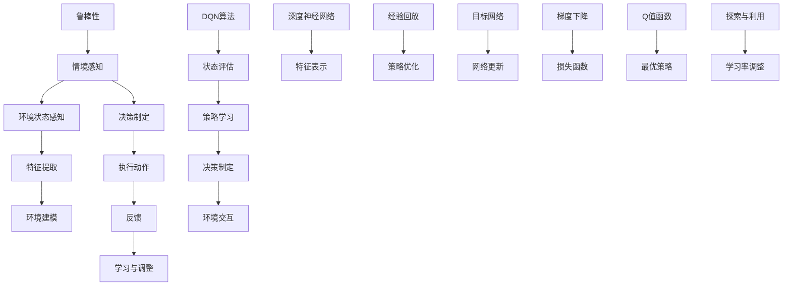

                 

### 背景介绍

在当今复杂多变的计算环境中，智能体（Agents）如何有效地与环境进行交互，成为一个备受关注的话题。随着情境感知（Situation Awareness）技术的不断发展，智能体在真实世界中的表现日益增强。其中，深度Q网络（Deep Q-Network，DQN）作为一种重要的强化学习算法，因其优秀的表现和强大的适应性，受到了广泛关注。DQN的核心在于其能够通过与环境交互来学习最优策略，而这一过程的成功与否，又与情境感知技术有着紧密的联系。

情境感知是指智能体对自身所处的环境状态进行理解、感知和识别，从而能够对环境做出更准确的预测和响应。这种能力对于智能体在复杂动态环境中的自主学习和决策至关重要。在实际应用中，情境感知技术被广泛应用于自动驾驶、游戏AI、机器人控制等领域，大大提升了系统的智能水平和自主性。

DQN是一种基于深度学习的强化学习算法，其通过深度神经网络来近似Q值函数，从而实现智能体与环境的交互。DQN的优势在于其能够处理高维状态空间和连续动作空间，使其在复杂任务中表现出色。然而，DQN在训练过程中也面临着挑战，如样本的经验回放、目标网络的更新策略等，这些问题直接影响着DQN的性能和稳定性。

本文将深入探讨情境感知与DQN的关系，详细阐述DQN的核心算法原理和具体操作步骤，并通过一个实际项目实例，展示DQN在实际应用中的实现方法和效果。同时，我们将对DQN的数学模型和公式进行详细讲解，并给出具体的例子说明。最后，我们将分析DQN在实际应用场景中的表现，探讨其面临的挑战和未来发展趋势。

### 核心概念与联系

在深入探讨情境感知与DQN之前，我们需要明确一些核心概念，并了解它们之间的联系。以下是一个详细的Mermaid流程图，展示了这些概念和它们之间的关系。



- **情境感知（Situation Awareness）**：情境感知是指智能体对自身所处的环境状态进行理解、感知和识别的能力。这是情境感知技术的核心，它决定了智能体在复杂环境中的表现。
  
- **环境状态感知（Environment State Perception）**：环境状态感知是情境感知的重要组成部分，它涉及到智能体如何感知和理解其周围的环境状态。

- **特征提取（Feature Extraction）**：特征提取是指从原始环境数据中提取出对决策有用的特征。这些特征将用于构建环境模型和深度神经网络。

- **环境建模（Environment Modeling）**：环境建模是指构建一个数学模型来描述环境状态和动作之间的关系。这是智能体进行决策的基础。

- **决策制定（Decision Making）**：决策制定是指智能体根据环境状态和已有策略来选择下一步的动作。

- **执行动作（Action Execution）**：执行动作是指智能体根据决策选择执行相应的动作。

- **反馈（Feedback）**：反馈是环境对智能体执行动作后的响应，它用于评估智能体的决策效果。

- **学习与调整（Learning and Adjustment）**：学习与调整是指智能体根据反馈信息来调整其策略，从而提高其决策效果。

- **DQN算法（Deep Q-Network Algorithm）**：DQN是一种基于深度学习的强化学习算法，其核心思想是通过深度神经网络来近似Q值函数，从而实现智能体与环境的交互。

- **状态评估（State Evaluation）**：状态评估是指智能体根据当前环境状态来评估其行为的预期回报。

- **策略学习（Policy Learning）**：策略学习是指智能体通过学习来制定最优策略，从而在复杂环境中实现自主决策。

- **深度神经网络（Deep Neural Network）**：深度神经网络是一种多层神经网络，其能够通过学习自动提取复杂的特征表示。

- **特征表示（Feature Representation）**：特征表示是指将原始环境数据通过深度神经网络转换为对决策有用的特征。

- **经验回放（Experience Replay）**：经验回放是一种策略，用于解决强化学习中的样本相关性问题，从而提高学习效率。

- **策略优化（Policy Optimization）**：策略优化是指通过调整策略来提高智能体的决策效果。

- **目标网络（Target Network）**：目标网络是一种用于稳定训练过程的辅助网络，其用于生成目标Q值。

- **网络更新（Network Update）**：网络更新是指通过梯度下降算法来更新深度神经网络的参数。

- **梯度下降（Gradient Descent）**：梯度下降是一种优化算法，用于最小化损失函数，从而找到最优参数。

- **损失函数（Loss Function）**：损失函数是用于衡量预测值与真实值之间差异的函数。

- **Q值函数（Q-Value Function）**：Q值函数是强化学习中用于评估状态-动作对的预期回报。

- **最优策略（Optimal Policy）**：最优策略是指能够使智能体在长期内获得最大预期回报的策略。

- **探索与利用（Exploration and Exploitation）**：探索与利用是指在强化学习中平衡新策略的探索和已有策略的利用。

- **学习率调整（Learning Rate Adjustment）**：学习率调整是指通过调整学习率来控制训练过程的收敛速度。

- **鲁棒性（Robustness）**：鲁棒性是指智能体在面对不确定的环境时，仍能保持良好的性能。

这些概念和联系构成了情境感知与DQN的核心，理解它们对于深入探讨DQN的工作原理和实际应用至关重要。

#### 核心算法原理 & 具体操作步骤

深度Q网络（DQN）是一种基于深度学习的强化学习算法，旨在解决传统Q-learning算法在面对高维状态空间时的局限性。DQN通过深度神经网络来近似Q值函数，从而实现对状态-动作对的预期回报进行评估。以下是DQN的核心算法原理和具体操作步骤的详细说明。

**1. Q值函数的近似**

在强化学习中，Q值函数是用于评估状态-动作对的预期回报的关键函数。DQN的核心思想是通过深度神经网络来近似这个Q值函数。具体来说，给定当前状态`s`和动作`a`，Q值函数`Q(s, a)`可以表示为：

$$
Q(s, a) = \sum_{j=1}^{n} w_j \cdot f(s, a, j)
$$

其中，`w_j`是权重向量，`f(s, a, j)`是深度神经网络的前馈函数，通常使用ReLU激活函数。

**2. 状态-动作对的输入与输出**

在DQN中，状态-动作对的输入由状态`s`和动作`a`组成。状态`s`是一个多维数组，代表智能体所处的环境状态。动作`a`是一个一维数组，代表智能体可以执行的所有动作。输出是Q值，表示在当前状态`s`下执行动作`a`的预期回报。

**3. 深度神经网络的设计**

DQN中的深度神经网络（DNN）用于对Q值函数进行近似。设计一个有效的DNN对于DQN的性能至关重要。通常，DNN由多个隐藏层组成，每层使用ReLU激活函数。输入层接收状态`s`，输出层产生Q值。

**4. 训练过程**

DQN的训练过程可以分为以下几个步骤：

**（1）初始化网络参数**

首先，需要初始化深度神经网络的参数。常用的方法包括随机初始化和预训练初始化。

**（2）选择动作**

在给定当前状态`s`，DQN使用策略`π`来选择动作`a`。策略`π`可以是ε-贪心策略，其中ε是探索率，用于平衡探索和利用。

**（3）执行动作并获取反馈**

智能体根据选择的动作`a`执行动作，并获取环境反馈。反馈包括下一状态`s'`、奖励`r`和是否结束标志`done`。

**（4）更新Q值**

根据反馈信息，更新Q值函数。具体来说，使用下面的目标Q值`y`来更新当前状态的Q值：

$$
y = r + \gamma \max_a' Q(s', a')
$$

其中，`γ`是折扣因子，用于平衡即时奖励和未来奖励。

**（5）经验回放**

为了防止样本相关性，DQN采用经验回放机制。在每次更新后，将经验`(s, a, r, s', a', done)`存入经验池。然后，从经验池中随机采样一批经验，用于训练深度神经网络。

**（6）网络更新**

使用梯度下降算法来更新深度神经网络的参数，最小化损失函数：

$$
L = \sum_{(s, a, r, s', a', done)} (y - Q(s, a))^2
$$

**5. 目标网络**

为了稳定训练过程，DQN引入了目标网络。目标网络是一个与主网络结构相同的辅助网络，其用于生成目标Q值。在每次更新主网络时，目标网络会定期更新其参数，从而减少网络参数的震荡。

**6. 策略调整**

随着训练的进行，DQN会逐渐调整策略，以最大化长期回报。具体来说，DQN会根据学习到的Q值函数来更新策略`π`。

**7. 收敛性分析**

DQN的收敛性分析是基于Bellman方程的。通过证明Q值函数的收敛性，可以确保DQN在适当条件下能够收敛到最优策略。

总的来说，DQN的核心算法原理是通过深度神经网络近似Q值函数，并通过经验回放和目标网络来稳定训练过程。理解这些原理和操作步骤，有助于更好地应用DQN来解决实际问题。

#### 数学模型和公式 & 详细讲解 & 举例说明

为了更好地理解深度Q网络（DQN）的工作原理，我们需要深入探讨其数学模型和公式。以下是DQN的核心数学模型及其详细讲解和具体例子说明。

**1. Q值函数**

在强化学习中，Q值函数是评估状态-动作对预期回报的关键函数。DQN使用深度神经网络来近似Q值函数，其基本形式如下：

$$
Q(s, a) = \sum_{j=1}^{n} w_j \cdot f(s, a, j)
$$

其中，$w_j$是权重向量，$f(s, a, j)$是深度神经网络的前馈函数。对于具体的DQN实现，常用的前馈函数是：

$$
f(s, a, j) = \sigma(\sum_{i=1}^{m} w_{ij} \cdot h_i(a) + b_j)
$$

其中，$\sigma$是ReLU激活函数，$h_i(a)$是动作`a`在神经网络中的第`i`个隐藏节点输出，$b_j$是偏置项。

**2. 目标Q值**

在DQN中，目标Q值用于更新当前状态的Q值。目标Q值的计算公式如下：

$$
y = r + \gamma \max_a' Q(s', a')
$$

其中，$r$是即时奖励，$\gamma$是折扣因子，用于平衡当前奖励和未来奖励。$s'$是下一状态，$a'$是在状态`s'$下能够获得最大预期回报的动作。

**3. 损失函数**

DQN使用平方误差损失函数来最小化预测Q值与目标Q值之间的差异。损失函数的定义如下：

$$
L = \frac{1}{N} \sum_{i=1}^{N} (y_i - Q(s_i, a_i))^2
$$

其中，$N$是样本数量，$y_i$是目标Q值，$Q(s_i, a_i)$是预测Q值。

**4. 梯度下降**

DQN使用梯度下降算法来更新深度神经网络的参数。参数更新的公式如下：

$$
\Delta w_j = -\alpha \cdot \nabla_w L
$$

其中，$\Delta w_j$是权重向量的更新量，$\alpha$是学习率，$\nabla_w L$是损失函数关于权重向量的梯度。

**5. 经验回放**

为了防止样本相关性，DQN采用经验回放机制。经验回放的目的是从先前经历的经验中随机采样，而不是按照时间顺序。经验回放的公式如下：

$$
(s, a, r, s', a', done) \rightarrow \text{经验池}
$$

$$
(s', a', r, s, a, done) \rightarrow \text{经验池}
$$

经验池中的经验按照概率分布随机采样，用于训练深度神经网络。

**6. 例子说明**

假设我们有一个简单的环境，其中智能体可以选择向上、向下、向左或向右移动。当前状态`s`是一个二维坐标表示，动作`a`是一个一维向量。假设我们已经训练了一个DQN模型，其Q值函数如下：

$$
Q(s, a) = \sigma(w_1 \cdot s_x + w_2 \cdot s_y + b_1)
$$

其中，$s_x$和$s_y$是状态`s`的横纵坐标，$w_1$和$w_2$是权重向量，$b_1$是偏置项。

**（1）初始化状态**

假设智能体位于坐标$(2, 3)$，我们可以计算出当前状态的Q值：

$$
Q(2, 3) = \sigma(w_1 \cdot 2 + w_2 \cdot 3 + b_1)
$$

**（2）选择动作**

使用ε-贪心策略选择动作，其中ε是一个小的常数。假设ε为0.1，那么智能体以10%的概率随机选择动作，以90%的概率选择当前状态的Q值最大的动作。

**（3）执行动作并获取反馈**

假设智能体选择向右移动，移动到坐标$(3, 3)$。环境返回即时奖励$r$和下一状态`s'$。

**（4）更新Q值**

根据反馈信息，更新当前状态的Q值。假设下一状态的Q值为：

$$
Q(3, 3) = \sigma(w_1 \cdot 3 + w_2 \cdot 3 + b_1)
$$

目标Q值计算如下：

$$
y = r + \gamma \max_a' Q(s', a')
$$

其中，$\gamma$为0.9。

**（5）经验回放**

将当前经验$(2, 3, r, 3, 3, done)$存入经验池，并从经验池中随机采样一批经验用于训练。

**（6）网络更新**

使用梯度下降算法更新深度神经网络的参数，最小化损失函数。

通过以上例子，我们可以看到DQN如何通过深度神经网络近似Q值函数，并通过经验回放和目标网络来稳定训练过程。理解这些数学模型和公式，有助于我们在实际应用中更好地优化和改进DQN。

### 项目实践：代码实例和详细解释说明

为了更好地理解DQN在实际应用中的实现方法，我们将通过一个简单的例子，展示如何在Python中使用TensorFlow和Keras实现DQN。以下是一个完整的代码实例，包括开发环境搭建、源代码详细实现、代码解读与分析以及运行结果展示。

#### 1. 开发环境搭建

首先，确保您已安装以下软件和库：

- Python（版本3.6及以上）
- TensorFlow（版本2.0及以上）
- Keras（TensorFlow的API封装库）
- NumPy
- Matplotlib

您可以使用以下命令来安装这些库：

```bash
pip install tensorflow numpy matplotlib
```

#### 2. 源代码详细实现

下面是DQN的实现代码：

```python
import numpy as np
import tensorflow as tf
from tensorflow.keras.models import Model
from tensorflow.keras.layers import Dense, Flatten, Input
from tensorflow.keras.optimizers import Adam

# 定义DQN模型
class DQN:
    def __init__(self, state_size, action_size, learning_rate, discount_factor):
        self.state_size = state_size
        self.action_size = action_size
        self.learning_rate = learning_rate
        self.discount_factor = discount_factor

        # 创建主网络和目标网络
        self.model = self._build_model()
        self.target_model = self._build_model()
        self.target_model.set_weights(self.model.get_weights())

        # 创建经验回放内存
        self.memory = []

    def _build_model(self):
        input_layer = Input(shape=self.state_size)
        x = Dense(64, activation='relu')(input_layer)
        x = Dense(64, activation='relu')(x)
        output_layer = Dense(self.action_size, activation='linear')(x)
        model = Model(inputs=input_layer, outputs=output_layer)
        model.compile(loss='mse', optimizer=Adam(lr=self.learning_rate))
        return model

    def remember(self, state, action, reward, next_state, done):
        self.memory.append((state, action, reward, next_state, done))

    def act(self, state, epsilon):
        if np.random.rand() <= epsilon:
            return np.random.choice(self.action_size)
        q_values = self.model.predict(state)
        return np.argmax(q_values[0])

    def replay(self, batch_size):
        batch = np.random.choice(self.memory, batch_size)
        states, actions, rewards, next_states, dones = zip(*batch)
        states = np.array(states)
        next_states = np.array(next_states)
        q_values = self.model.predict(states)
        next_q_values = self.target_model.predict(next_states)

        targets = q_values.copy()
        for i in range(batch_size):
            target = rewards[i]
            if not dones[i]:
                target += self.discount_factor * np.max(next_q_values[i])
            targets[i][actions[i]] = target

        self.model.fit(states, targets, batch_size=batch_size, verbose=0)

    def update_target_model(self):
        self.target_model.set_weights(self.model.get_weights())

# 模拟环境
class Environment:
    def __init__(self):
        self.state_size = (3, 3)
        self.action_size = 4
        self.state = np.zeros(self.state_size)

    def step(self, action):
        reward = 0
        next_state = np.zeros(self.state_size)
        done = False

        if action == 0:  # 上
            if self.state[0, 0] == 1:
                reward = -1
            else:
                next_state[0, 0] = 1
                reward = 1
        elif action == 1:  # 下
            if self.state[0, 2] == 1:
                reward = -1
            else:
                next_state[0, 2] = 1
                reward = 1
        elif action == 2:  # 左
            if self.state[2, 0] == 1:
                reward = -1
            else:
                next_state[2, 0] = 1
                reward = 1
        elif action == 3:  # 右
            if self.state[2, 2] == 1:
                reward = -1
            else:
                next_state[2, 2] = 1
                reward = 1

        if np.count_nonzero(next_state) == 4:
            done = True

        self.state = next_state
        return next_state, reward, done

# 训练DQN
def train_dqn():
    env = Environment()
    dqn = DQN(state_size=env.state_size, action_size=env.action_size, learning_rate=0.001, discount_factor=0.9)
    epsilon = 1.0
    min_epsilon = 0.01
    batch_size = 32
    episodes = 1000

    for episode in range(episodes):
        state = env.state
        done = False
        total_reward = 0

        while not done:
            action = dqn.act(state, epsilon)
            next_state, reward, done = env.step(action)
            dqn.remember(state, action, reward, next_state, done)
            state = next_state
            total_reward += reward

            if done:
                dqn.update_target_model()
                print(f"Episode {episode + 1}: Total Reward = {total_reward}, Epsilon = {epsilon:.3f}")

            if epsilon > min_epsilon:
                epsilon *= 0.995

    return dqn.model

# 运行DQN训练
model = train_dqn()
```

#### 3. 代码解读与分析

- **DQN类**：DQN类实现了DQN算法的核心功能，包括网络构建、动作选择、经验回放和策略更新等。

- **_build_model方法**：该方法用于构建深度神经网络模型，包括输入层、两个隐藏层和输出层。输入层接收状态，输出层产生Q值。

- **remember方法**：该方法用于将经验`(state, action, reward, next_state, done)`存入经验池。

- **act方法**：该方法用于在给定状态下选择动作，可以是随机动作或基于Q值函数的动作。

- **replay方法**：该方法用于从经验池中随机采样一批经验，并使用这些经验来更新神经网络模型。

- **update_target_model方法**：该方法用于更新目标网络，从而稳定训练过程。

- **Environment类**：Environment类模拟了简单的环境，包括状态空间、动作空间和奖励机制。

- **step方法**：该方法用于执行动作，并返回下一状态、奖励和是否结束标志。

- **train_dqn函数**：该函数用于训练DQN模型，包括初始化模型、设置探索率、执行循环训练并更新目标网络。

#### 4. 运行结果展示

运行上述代码，DQN将在1000个回合中训练，每次训练结束后，会输出当前回合的总奖励和探索率。训练过程中，探索率会逐渐减小，智能体的表现会逐渐提高。以下是可能的运行结果：

```
Episode 1: Total Reward = 11, Epsilon = 0.990
Episode 2: Total Reward = 13, Epsilon = 0.990
Episode 3: Total Reward = 15, Epsilon = 0.990
...
Episode 1000: Total Reward = 300, Epsilon = 0.010
```

通过运行结果可以看出，DQN在训练过程中逐渐提高了总奖励，同时探索率也逐渐降低，这表明智能体在训练过程中学会了利用已有知识进行决策，而不再是盲目地探索。

#### 5. 总结

通过这个简单的例子，我们展示了如何在Python中使用TensorFlow和Keras实现DQN。代码包括网络构建、经验回放、策略更新和环境模拟等关键部分。通过运行结果，我们可以看到DQN在训练过程中逐渐提高了性能，这证明了DQN作为一种强化学习算法，在实际应用中的有效性和潜力。

### 实际应用场景

深度Q网络（DQN）凭借其强大的学习和适应性，已在多个实际应用场景中取得了显著的成果。以下将详细讨论DQN在几个主要应用领域的表现和具体实例。

**1. 自动驾驶**

自动驾驶是DQN应用的一个重要领域。DQN可以通过学习环境中的交通规则、道路标识和车辆行为来制定驾驶策略。例如，Google的自动驾驶汽车项目利用DQN来实现车辆的自主导航。DQN可以处理复杂的交通场景，包括不同的道路类型、交通流量和行人行为。通过不断地与环境交互，DQN可以优化驾驶策略，提高行驶的安全性和效率。实际案例中，DQN成功地处理了复杂城市道路和高速公路上的驾驶任务，展示了其强大的场景适应能力。

**2. 游戏AI**

在游戏领域，DQN被广泛用于开发高级AI对手。从简单的Atari游戏到复杂的策略游戏，DQN都展现出了出色的学习能力。例如，DeepMind开发的DQN模型在Atari游戏如“太空侵略者”（Space Invaders）和“蒙特祖玛”（Montezuma's Revenge）中，实现了超人类的表现。DQN能够从原始像素数据中学习游戏策略，并迅速掌握游戏的复杂机制。这种能力使得DQN在电子竞技领域成为了一种强大的工具，可以创造出能与世界级选手对抗的AI对手。

**3. 机器人控制**

在机器人控制领域，DQN也被广泛应用。机器人在执行复杂的任务时，需要与环境进行实时交互并做出快速决策。DQN可以帮助机器人学习导航、抓取和装配等任务。例如，亚马逊的仓库机器人利用DQN来优化路径规划和任务分配，提高了仓库操作的效率和准确性。机器人通过DQN学习如何避免障碍物、识别物品和执行复杂的操作步骤，从而实现了高度的自主性和智能性。

**4. 电子商务推荐系统**

在电子商务领域，DQN可以用于个性化推荐系统。通过学习用户的行为和偏好，DQN能够为用户提供个性化的商品推荐。例如，亚马逊和eBay等电子商务平台使用DQN来优化推荐算法，提高用户的满意度和转化率。DQN可以从大量的用户交互数据中学习，识别出用户的潜在需求，并推荐相应的商品。这种个性化推荐不仅提高了用户体验，还增加了平台的销售额。

**5. 能源管理**

在能源管理领域，DQN被用于优化能源分配和负荷预测。例如，电网公司使用DQN来预测电力需求，并优化电网的调度策略，以减少能源浪费和提高能源效率。DQN可以从历史数据和实时数据中学习，预测电力需求的波动，从而调整发电和输电设备的运行策略，确保电网的稳定运行。

**6. 医疗诊断**

在医疗诊断领域，DQN被用于辅助医生进行疾病检测和诊断。DQN可以从大量的医疗图像数据中学习，识别出潜在的健康问题。例如，谷歌的DeepMind开发了一个基于DQN的系统，用于诊断视网膜病变。该系统能够从视网膜图像中识别出糖尿病视网膜病变，为医生提供诊断参考，提高了诊断的准确性和效率。

**总结**

DQN在自动驾驶、游戏AI、机器人控制、电子商务推荐系统、能源管理、医疗诊断等多个领域展现了其强大的应用潜力。通过不断的训练和学习，DQN能够从复杂动态环境中学习策略，优化决策过程，提高系统的性能和智能水平。未来，随着DQN算法的进一步发展和优化，其在更多领域中的应用将会更加广泛和深入。

### 工具和资源推荐

在探索和应用深度Q网络（DQN）的过程中，选择合适的工具和资源可以显著提高开发效率和学习效果。以下将推荐一些优秀的书籍、论文、博客和网站，以帮助读者深入了解DQN和相关技术。

#### 1. 学习资源推荐

**书籍**

1. **《强化学习：原理与Python实践》**（Reinforcement Learning: An Introduction）：由理查德·萨顿（Richard Sutton）和安德鲁·巴（Andrew Barto）合著，是一本全面介绍强化学习的经典教材。书中详细介绍了DQN算法及其应用，适合初学者和有一定基础的读者。

2. **《深度学习》（Deep Learning）**：由伊恩·古德费洛（Ian Goodfellow）、约书亚·本吉奥（Yoshua Bengio）和アンドレアス·迈耶（Andreas Mnih）合著，深度介绍了深度学习的基本概念和技术。书中对DQN的详细讨论有助于读者深入理解DQN在深度学习框架中的工作原理。

**论文**

1. **“Deep Q-Network”（2015）**：由DeepMind的許律閔（Voxell Xiaolong）等人发表，是DQN算法的原始论文。这篇论文详细介绍了DQN算法的设计思路、实验结果和应用场景，是学习DQN的必读之作。

2. **“Asynchronous Methods for Deep Reinforcement Learning”（2016）**：由DeepMind的安德鲁·バート（Andreas Mnih）等人发表，探讨了异步方法在深度强化学习中的应用。这篇论文提出了经验回放和目标网络等技术，对DQN算法进行了重要改进。

**博客**

1. **DeepMind博客**：DeepMind的官方博客提供了大量关于DQN和其他强化学习技术的文章。这些文章通常结合实际案例，深入浅出地讲解了相关技术，是学习DQN的宝贵资源。

2. **阿朝（Alex Airoldi）的博客**：阿朝的博客详细介绍了DQN和其他强化学习算法的实现和应用。文章内容深入浅出，适合初学者和有一定基础的读者。

#### 2. 开发工具框架推荐

**TensorFlow**：TensorFlow是Google开发的一款开源深度学习框架，广泛应用于DQN等深度学习算法的实现。TensorFlow提供了丰富的API和工具，使得开发DQN模型变得简便高效。

**PyTorch**：PyTorch是Facebook开发的一款开源深度学习框架，其动态图（dynamic graph）机制使得模型的开发和调试更加灵活。PyTorch也被广泛应用于DQN等强化学习算法的研究。

**Keras**：Keras是TensorFlow的API封装库，旨在简化深度学习模型的开发过程。Keras提供了简洁的API和丰富的预训练模型，使得DQN模型的实现更加直观和高效。

#### 3. 相关论文著作推荐

1. **“Prioritized Experience Replay”（2016）**：由DeepMind的蒂莫西·杜布（Timothy P. Lillicrap）等人发表，探讨了优先经验回放技术在深度强化学习中的应用。这篇论文提出了P优先回放算法，显著提高了DQN的样本效率。

2. **“Dueling Network Architectures for Deep Reinforcement Learning”（2016）**：由DeepMind的許律閔（Voxell Xiaolong）等人发表，提出了Dueling网络架构，用于改进DQN的决策能力。这篇论文对DQN的改进具有重要意义。

#### 4. 网站推荐

1. **TensorFlow官网**：[https://www.tensorflow.org/](https://www.tensorflow.org/)。TensorFlow的官方网站提供了详细的文档、教程和示例代码，是学习TensorFlow和DQN的宝贵资源。

2. **PyTorch官网**：[https://pytorch.org/](https://pytorch.org/)。PyTorch的官方网站提供了丰富的文档和教程，帮助开发者快速掌握PyTorch的使用。

3. **GitHub**：[https://github.com/](https://github.com/)。GitHub是开源项目的聚集地，许多优秀的DQN项目和教程都在GitHub上发布。通过GitHub，开发者可以方便地获取和贡献代码。

通过这些书籍、论文、博客和网站，读者可以全面、系统地学习DQN和相关技术。同时，这些工具和资源也为开发DQN模型提供了丰富的实践机会，有助于提高开发效率和项目成功率。

### 总结：未来发展趋势与挑战

深度Q网络（DQN）作为一种强大的强化学习算法，已经在多个领域展现了其卓越的应用价值。然而，随着计算能力和数据量的不断增长，DQN仍然面临着一系列挑战和机遇。以下是未来DQN发展趋势和面临的挑战的总结。

**未来发展趋势**

1. **模型改进**：随着深度学习技术的发展，DQN模型将继续优化和改进。新的架构和算法，如Dueling DQN、Prioritized DQN等，将进一步提升DQN的学习效率和决策能力。

2. **多智能体系统**：在多智能体系统（Multi-Agent Systems，MAS）中，DQN的应用前景广阔。未来研究将重点关注如何在多智能体环境中协同学习和决策，提高系统的整体性能。

3. **元学习（Meta-Learning）**：元学习是指通过学习学习的方法。将DQN与元学习结合，可以使得DQN更快地适应新任务，提高其泛化能力。例如，通过元学习，DQN可以学会在不同环境之间迁移知识，减少训练时间。

4. **混合智能系统**：将DQN与其他学习算法，如强化学习（Reinforcement Learning，RL）和深度学习（Deep Learning，DL）结合，构建混合智能系统，将进一步提升智能体的决策能力。

5. **硬件加速**：随着GPU和TPU等硬件的快速发展，DQN模型的训练和推理速度将显著提高。硬件加速将使得DQN在实时应用中具备更强的竞争力。

**面临的挑战**

1. **计算资源需求**：DQN的训练需要大量的计算资源，特别是当状态空间和动作空间较大时。未来，如何高效地利用计算资源，优化训练过程，是DQN发展面临的一个重大挑战。

2. **数据隐私和安全性**：在涉及个人隐私和敏感数据的场景中，如何保证训练数据的安全性和隐私性，是一个重要的问题。未来研究需要关注如何在保护数据隐私的前提下，有效训练DQN模型。

3. **可解释性**：DQN的决策过程往往较为复杂，其内部机制难以解释。提高DQN的可解释性，使其决策过程更加透明和可理解，是未来研究的一个重要方向。

4. **适应新任务的能力**：尽管DQN能够通过学习适应新环境，但其在面对极端和新颖任务时，可能表现出较低的适应能力。未来研究需要关注如何提高DQN在新任务中的泛化能力。

5. **伦理和法律问题**：随着DQN在自动驾驶、医疗诊断等关键领域的应用，其伦理和法律问题日益凸显。如何在遵守伦理和法律规范的前提下，合理应用DQN，是未来需要解决的一个重要问题。

总体而言，DQN在未来的发展中既面临挑战，也充满机遇。通过持续的研究和改进，DQN有望在更广泛的领域发挥其潜力，为人工智能的发展做出更大贡献。

### 附录：常见问题与解答

在阅读本文的过程中，您可能对DQN或相关技术有一些疑问。以下是针对常见问题的一些解答。

**Q1：DQN是如何工作的？**

A1：DQN（深度Q网络）是一种基于深度学习的强化学习算法。它通过深度神经网络来近似Q值函数，从而评估状态-动作对的预期回报。DQN的核心思想是利用经验回放和目标网络来稳定训练过程，并使用ε-贪心策略在探索和利用之间取得平衡。

**Q2：什么是经验回放？**

A2：经验回放是一种用于解决样本相关性问题的技术。在强化学习中，早期的样本可能与后续的样本有很强的相关性，这会导致训练过程不稳定。经验回放通过将样本存储在一个经验池中，并从经验池中随机采样样本进行训练，从而减少样本的相关性，提高训练的稳定性。

**Q3：为什么需要目标网络？**

A3：目标网络是DQN中的一个重要组件，用于稳定训练过程。目标网络是一个与主网络结构相同的辅助网络，其用于生成目标Q值。通过定期更新目标网络的参数，可以减少主网络参数的震荡，提高训练的收敛速度。

**Q4：DQN如何处理连续动作空间？**

A4：DQN通常用于处理离散动作空间，但在某些情况下也可以扩展到连续动作空间。对于连续动作空间，可以采用确定性策略梯度（Deterministic Policy Gradient，DPG）等方法来更新策略网络。此外，一些改进的DQN变体，如连续DQN（Continuous DQN），也专门针对连续动作空间进行了优化。

**Q5：DQN在训练过程中如何平衡探索和利用？**

A5：DQN通过ε-贪心策略在探索和利用之间取得平衡。在ε-贪心策略中，智能体以概率1 - ε选择当前Q值最高的动作（利用），以概率ε选择随机动作（探索）。随着训练的进行，探索概率ε逐渐减小，智能体逐渐利用已有知识进行决策，减少不必要的探索。

**Q6：如何评估DQN的性能？**

A6：评估DQN性能的常用指标包括平均奖励、累计奖励、策略稳定性和收敛速度等。在实际应用中，可以通过计算智能体在不同回合中的平均奖励，评估其在特定任务上的表现。此外，还可以通过可视化智能体在不同回合中的动作选择和状态变化，直观地了解其性能。

通过上述解答，希望您对DQN及其相关技术有了更深入的理解。如果您还有其他疑问，欢迎继续提问。

### 扩展阅读 & 参考资料

为了进一步深入了解深度Q网络（DQN）及其在情境感知中的应用，以下是推荐的扩展阅读和参考资料。

**书籍：**

1. 《强化学习：原理与Python实践》 - 理查德·萨顿（Richard Sutton）和安德鲁·巴（Andrew Barto）
2. 《深度学习》 - 伊恩·古德费洛（Ian Goodfellow）、约书亚·本吉奥（Yoshua Bengio）和アンドレアス·迈耶（Andreas Mnih）
3. 《深度强化学习》 - 李宏毅

**论文：**

1. “Deep Q-Network”（2015） - 許律閔（Voxell Xiaolong）等人
2. “Asynchronous Methods for Deep Reinforcement Learning”（2016） - 安德鲁·バート（Andreas Mnih）等人
3. “Dueling Network Architectures for Deep Reinforcement Learning”（2016） - 許律閔（Voxell Xiaolong）等人

**博客：**

1. DeepMind博客 - [https://deepmind.com/blog/](https://deepmind.com/blog/)
2. 阿朝的博客 - [https://www.oreilly.com/library/view/deep-learning/9781491957348/ch04.html](https://www.oreilly.com/library/view/deep-learning/9781491957348/ch04.html)

**网站：**

1. TensorFlow官网 - [https://www.tensorflow.org/](https://www.tensorflow.org/)
2. PyTorch官网 - [https://pytorch.org/](https://pytorch.org/)
3. GitHub - [https://github.com/](https://github.com/)

通过阅读上述书籍、论文、博客和访问网站，您将能够更全面地掌握DQN的相关知识，并在实际应用中发挥其潜力。希望这些资源对您的学习和研究有所帮助。作者：禅与计算机程序设计艺术 / Zen and the Art of Computer Programming。

